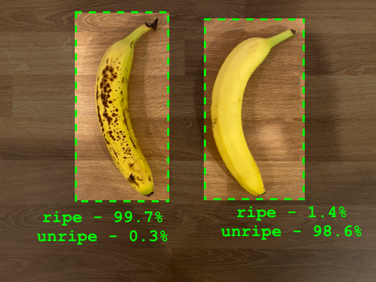
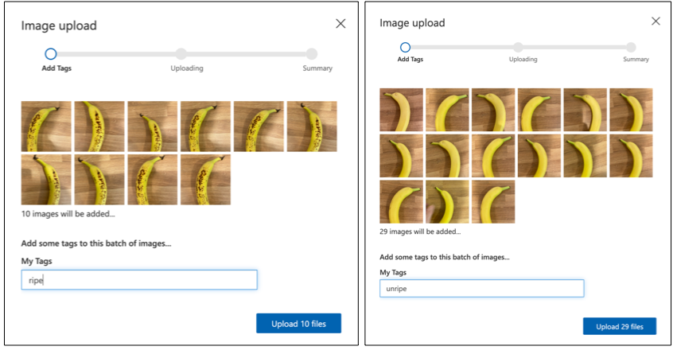

<!--
CO_OP_TRANSLATOR_METADATA:
{
  "original_hash": "f5e63c916d2dd97d58be12aaf76bd9f1",
  "translation_date": "2025-08-27T20:36:37+00:00",
  "source_file": "4-manufacturing/lessons/1-train-fruit-detector/README.md",
  "language_code": "nl"
}
-->
# Train een detector voor fruitkwaliteit


> Schets door [Nitya Narasimhan](https://github.com/nitya). Klik op de afbeelding voor een grotere versie.

Deze video geeft een overzicht van de Azure Custom Vision-service, een dienst die in deze les wordt behandeld.

[](https://www.youtube.com/watch?v=TETcDLJlWR4)

> 🎥 Klik op de afbeelding hierboven om de video te bekijken

## Quiz voorafgaand aan de les

[Quiz voorafgaand aan de les](https://black-meadow-040d15503.1.azurestaticapps.net/quiz/29)

## Introductie

De recente opkomst van Kunstmatige Intelligentie (AI) en Machine Learning (ML) biedt een breed scala aan mogelijkheden voor de ontwikkelaars van vandaag. ML-modellen kunnen worden getraind om verschillende dingen in afbeeldingen te herkennen, zoals onrijp fruit, en dit kan worden gebruikt in IoT-apparaten om producten te sorteren, zowel tijdens de oogst als tijdens de verwerking in fabrieken of magazijnen.

In deze les leer je over beeldclassificatie - het gebruik van ML-modellen om onderscheid te maken tussen afbeeldingen van verschillende objecten. Je leert hoe je een beeldclassifier kunt trainen om onderscheid te maken tussen fruit dat goed is en fruit dat slecht is, zoals te rijp, te onrijp, gekneusd of rot.

In deze les behandelen we:

* [AI en ML gebruiken om voedsel te sorteren](../../../../../4-manufacturing/lessons/1-train-fruit-detector)
* [Beeldclassificatie via Machine Learning](../../../../../4-manufacturing/lessons/1-train-fruit-detector)
* [Train een beeldclassifier](../../../../../4-manufacturing/lessons/1-train-fruit-detector)
* [Test je beeldclassifier](../../../../../4-manufacturing/lessons/1-train-fruit-detector)
* [Hertrain je beeldclassifier](../../../../../4-manufacturing/lessons/1-train-fruit-detector)

## AI en ML gebruiken om voedsel te sorteren

Het voeden van de wereldbevolking is moeilijk, vooral tegen een prijs die voedsel betaalbaar maakt voor iedereen. Een van de grootste kostenposten is arbeid, dus boeren wenden zich steeds vaker tot automatisering en tools zoals IoT om hun arbeidskosten te verlagen. Handmatig oogsten is arbeidsintensief (en vaak zwaar werk) en wordt vervangen door machines, vooral in rijkere landen. Ondanks de kostenbesparingen van het gebruik van machines om te oogsten, is er een nadeel: het vermogen om voedsel te sorteren tijdens de oogst.

Niet alle gewassen rijpen gelijkmatig. Tomaten, bijvoorbeeld, kunnen nog groene vruchten aan de plant hebben terwijl de meerderheid klaar is voor de oogst. Hoewel het zonde is om deze vroeg te oogsten, is het voor de boer goedkoper en gemakkelijker om alles met machines te oogsten en later het onrijpe product weg te gooien.

✅ Kijk eens naar verschillende soorten fruit of groenten, of ze nu bij jou in de buurt groeien op boerderijen of in je tuin, of in winkels. Zijn ze allemaal even rijp, of zie je variatie?

De opkomst van geautomatiseerde oogst heeft het sorteren van producten van de oogst naar de fabriek verplaatst. Voedsel zou op lange transportbanden reizen met teams van mensen die het product inspecteren en alles verwijderen dat niet aan de vereiste kwaliteitsnormen voldeed. Oogsten werd goedkoper dankzij machines, maar er waren nog steeds kosten verbonden aan het handmatig sorteren van voedsel.


De volgende evolutie was het gebruik van machines om te sorteren, ingebouwd in de oogstmachine of in de verwerkingsfabrieken. De eerste generatie van deze machines gebruikte optische sensoren om kleuren te detecteren, waarbij actuatoren groene tomaten in een afvalbak duwden met behulp van hefbomen of luchtstoten, terwijl rode tomaten verder gingen op een netwerk van transportbanden.

In deze video, terwijl tomaten van de ene transportband naar de andere vallen, worden groene tomaten gedetecteerd en met hefbomen in een bak gegooid.

✅ Welke omstandigheden zou je nodig hebben in een fabriek of op een veld zodat deze optische sensoren correct werken?

De nieuwste evoluties van deze sorteermachines maken gebruik van AI en ML, waarbij modellen worden getraind om goed product van slecht product te onderscheiden, niet alleen door duidelijke kleurverschillen zoals groene tomaten versus rode, maar door subtielere verschillen in uiterlijk die ziekte of kneuzingen kunnen aangeven.

## Beeldclassificatie via Machine Learning

Traditioneel programmeren is waar je gegevens neemt, een algoritme toepast op de gegevens, en een output krijgt. Bijvoorbeeld, in het laatste project nam je GPS-coördinaten en een geofence, paste een algoritme toe dat werd geleverd door Azure Maps, en kreeg een resultaat terug of het punt binnen of buiten de geofence lag. Je voert meer gegevens in, je krijgt meer output.


Machine learning draait dit om - je begint met gegevens en bekende outputs, en het machine learning-algoritme leert van de gegevens. Je kunt vervolgens dat getrainde algoritme, een *machine learning model* of *model* genoemd, nemen en nieuwe gegevens invoeren om nieuwe output te krijgen.

> 🎓 Het proces waarbij een machine learning-algoritme leert van de gegevens wordt *training* genoemd. De inputs en bekende outputs worden *trainingsgegevens* genoemd.

Bijvoorbeeld, je zou een model miljoenen foto's van onrijpe bananen kunnen geven als input-trainingsgegevens, met de trainingsoutput ingesteld op `onrijp`, en miljoenen foto's van rijpe bananen als trainingsgegevens met de output ingesteld op `rijp`. Het ML-algoritme zal dan een model creëren op basis van deze gegevens. Je geeft dit model vervolgens een nieuwe foto van een banaan en het zal voorspellen of de nieuwe foto een rijpe of een onrijpe banaan is.

> 🎓 De resultaten van ML-modellen worden *voorspellingen* genoemd.



ML-modellen geven geen binair antwoord, maar geven waarschijnlijkheden. Bijvoorbeeld, een model kan een foto van een banaan krijgen en voorspellen `rijp` met 99,7% en `onrijp` met 0,3%. Je code zou dan de beste voorspelling kiezen en beslissen dat de banaan rijp is.

Het ML-model dat wordt gebruikt om afbeeldingen zoals deze te detecteren wordt een *beeldclassifier* genoemd - het krijgt gelabelde afbeeldingen en classificeert nieuwe afbeeldingen op basis van deze labels.

> 💁 Dit is een vereenvoudiging, en er zijn veel andere manieren om modellen te trainen die niet altijd gelabelde outputs nodig hebben, zoals unsupervised learning. Als je meer wilt leren over ML, bekijk dan [ML voor beginners, een curriculum van 24 lessen over Machine Learning](https://aka.ms/ML-beginners).

## Train een beeldclassifier

Om een beeldclassifier succesvol te trainen, heb je miljoenen afbeeldingen nodig. Het blijkt echter dat zodra je een beeldclassifier hebt getraind op miljoenen of miljarden verschillende afbeeldingen, je deze opnieuw kunt gebruiken en opnieuw kunt trainen met een kleine set afbeeldingen en geweldige resultaten kunt behalen, met behulp van een proces dat *transfer learning* wordt genoemd.

> 🎓 Transfer learning is waar je de kennis van een bestaand ML-model overdraagt naar een nieuw model op basis van nieuwe gegevens.

Zodra een beeldclassifier is getraind voor een breed scala aan afbeeldingen, zijn de interne mechanismen ervan goed in het herkennen van vormen, kleuren en patronen. Transfer learning stelt het model in staat om wat het al heeft geleerd in het herkennen van beeldonderdelen te gebruiken om nieuwe afbeeldingen te herkennen.


Je kunt dit zien als een soort kinderboek over vormen, waarbij je, zodra je een halve cirkel, een rechthoek en een driehoek kunt herkennen, een zeilboot of een kat kunt herkennen, afhankelijk van de configuratie van deze vormen. De beeldclassifier kan de vormen herkennen, en transfer learning leert het wat de combinatie maakt - een boot, een kat, of een rijpe banaan.

Er zijn een breed scala aan tools die je hierbij kunnen helpen, waaronder cloudgebaseerde diensten die je kunnen helpen je model te trainen en het vervolgens te gebruiken via web-API's.

> 💁 Het trainen van deze modellen vereist veel rekenkracht, meestal via Graphics Processing Units, of GPU's. Dezelfde gespecialiseerde hardware die games op je Xbox er geweldig uit laat zien, kan ook worden gebruikt om machine learning-modellen te trainen. Door gebruik te maken van de cloud kun je tijd huren op krachtige computers met GPU's om deze modellen te trainen, waardoor je toegang krijgt tot de rekenkracht die je nodig hebt, alleen voor de tijd die je nodig hebt.

## Custom Vision

Custom Vision is een cloudgebaseerde tool voor het trainen van beeldclassifiers. Het stelt je in staat om een classifier te trainen met slechts een klein aantal afbeeldingen. Je kunt afbeeldingen uploaden via een webportaal, web-API of een SDK, waarbij je elke afbeelding een *tag* geeft die de classificatie van die afbeelding aangeeft. Vervolgens train je het model en test je het om te zien hoe goed het presteert. Zodra je tevreden bent met het model, kun je versies ervan publiceren die toegankelijk zijn via een web-API of een SDK.


> 💁 Je kunt een Custom Vision-model trainen met slechts 5 afbeeldingen per classificatie, maar meer is beter. Je kunt betere resultaten behalen met minstens 30 afbeeldingen.

Custom Vision maakt deel uit van een reeks AI-tools van Microsoft genaamd Cognitive Services. Dit zijn AI-tools die kunnen worden gebruikt zonder enige training, of met een kleine hoeveelheid training. Ze omvatten spraakherkenning en vertaling, taalbegrip en beeldanalyse. Deze zijn beschikbaar met een gratis niveau als diensten in Azure.

> 💁 Het gratis niveau is meer dan genoeg om een model te maken, te trainen en het vervolgens te gebruiken voor ontwikkelingswerk. Je kunt meer lezen over de limieten van het gratis niveau op de [Custom Vision Limieten en quota-pagina op Microsoft Docs](https://docs.microsoft.com/azure/cognitive-services/custom-vision-service/limits-and-quotas?WT.mc_id=academic-17441-jabenn).

### Taak - maak een cognitive services-resource

Om Custom Vision te gebruiken, moet je eerst twee cognitive services-resources in Azure maken met behulp van de Azure CLI, één voor Custom Vision-training en één voor Custom Vision-voorspelling.

1. Maak een Resource Group voor dit project genaamd `fruit-quality-detector`.

1. Gebruik de volgende opdracht om een gratis Custom Vision-trainingresource te maken:

    ```sh
    az cognitiveservices account create --name fruit-quality-detector-training \
                                        --resource-group fruit-quality-detector \
                                        --kind CustomVision.Training \
                                        --sku F0 \
                                        --yes \
                                        --location <location>
    ```

    Vervang `<location>` door de locatie die je hebt gebruikt bij het maken van de Resource Group.

    Dit zal een Custom Vision-trainingresource maken in je Resource Group. Het zal `fruit-quality-detector-training` worden genoemd en de `F0` sku gebruiken, wat het gratis niveau is. De optie `--yes` betekent dat je akkoord gaat met de voorwaarden van de cognitive services.

> 💁 Gebruik `S0` sku als je al een gratis account hebt dat een van de Cognitive Services gebruikt.

1. Gebruik de volgende opdracht om een gratis Custom Vision-voorspellingsresource te maken:

    ```sh
    az cognitiveservices account create --name fruit-quality-detector-prediction \
                                        --resource-group fruit-quality-detector \
                                        --kind CustomVision.Prediction \
                                        --sku F0 \
                                        --yes \
                                        --location <location>
    ```

    Vervang `<location>` door de locatie die je hebt gebruikt bij het maken van de Resource Group.

    Dit zal een Custom Vision-voorspellingsresource maken in je Resource Group. Het zal `fruit-quality-detector-prediction` worden genoemd en de `F0` sku gebruiken, wat het gratis niveau is. De optie `--yes` betekent dat je akkoord gaat met de voorwaarden van de cognitive services.

### Taak - maak een beeldclassifierproject

1. Start het Custom Vision-portaal op [CustomVision.ai](https://customvision.ai) en log in met het Microsoft-account dat je hebt gebruikt voor je Azure-account.

1. Volg de [sectie Een nieuw project maken van de build een classifier quickstart op de Microsoft Docs](https://docs.microsoft.com/azure/cognitive-services/custom-vision-service/getting-started-build-a-classifier?WT.mc_id=academic-17441-jabenn#create-a-new-project) om een nieuw Custom Vision-project te maken. De gebruikersinterface kan veranderen en deze documentatie is altijd de meest actuele referentie.

    Noem je project `fruit-quality-detector`.

    Wanneer je je project maakt, zorg ervoor dat je de `fruit-quality-detector-training`-resource gebruikt die je eerder hebt gemaakt. Gebruik een *Classification*-projecttype, een *Multiclass*-classificatietype en het *Food*-domein.

    

✅ Neem de tijd om de Custom Vision-gebruikersinterface voor je beeldclassifier te verkennen.

### Taak - train je beeldclassifierproject

Om een beeldclassifier te trainen, heb je meerdere foto's van fruit nodig, zowel van goede als slechte kwaliteit, om te taggen als goed en slecht, zoals een rijpe en een overrijpe banaan.
💁 Deze classificators kunnen afbeeldingen van alles classificeren, dus als je geen fruit van verschillende kwaliteit bij de hand hebt, kun je twee verschillende soorten fruit gebruiken, of katten en honden!
Ideaal gezien zou elke foto alleen het fruit moeten tonen, met ofwel een consistente achtergrond, of een grote variatie aan achtergronden. Zorg ervoor dat er niets in de achtergrond is dat specifiek is voor rijp versus onrijp fruit.

> 💁 Het is belangrijk om geen specifieke achtergronden of specifieke items te hebben die niet gerelateerd zijn aan het te classificeren object voor elke tag. Anders kan de classifier alleen op basis van de achtergrond classificeren. Er was een classifier voor huidkanker die werd getraind op moedervlekken, zowel normale als kankerverwekkende. De kankerverwekkende moedervlekken hadden allemaal linialen erbij om de grootte te meten. Het bleek dat de classifier bijna 100% accuraat was in het identificeren van linialen op foto's, niet kankerverwekkende moedervlekken.

Beeldclassificators werken op een zeer lage resolutie. Bijvoorbeeld, Custom Vision kan trainings- en voorspellingsafbeeldingen tot 10240x10240 verwerken, maar traint en draait het model op afbeeldingen van 227x227. Grotere afbeeldingen worden verkleind naar dit formaat, dus zorg ervoor dat het object dat je classificeert een groot deel van de afbeelding inneemt. Anders kan het te klein zijn in de verkleinde afbeelding die door de classifier wordt gebruikt.

1. Verzamel foto's voor je classifier. Je hebt minstens 5 foto's per label nodig om de classifier te trainen, maar hoe meer hoe beter. Je hebt ook een paar extra afbeeldingen nodig om de classifier te testen. Deze afbeeldingen moeten allemaal verschillende afbeeldingen van hetzelfde object zijn. Bijvoorbeeld:

    * Gebruik 2 rijpe bananen en maak enkele foto's van elk vanuit verschillende hoeken. Maak minstens 7 foto's (5 om te trainen, 2 om te testen), maar idealiter meer.

        

    * Herhaal hetzelfde proces met 2 onrijpe bananen.

    Je zou minstens 10 trainingsafbeeldingen moeten hebben, met minstens 5 rijpe en 5 onrijpe, en 4 testafbeeldingen, 2 rijpe en 2 onrijpe. Je afbeeldingen moeten png of jpeg zijn, kleiner dan 6MB. Als je ze bijvoorbeeld met een iPhone maakt, kunnen ze high-resolution HEIC-afbeeldingen zijn, die moeten worden geconverteerd en mogelijk verkleind. Hoe meer afbeeldingen hoe beter, en je zou een vergelijkbaar aantal rijpe en onrijpe moeten hebben.

    Als je geen rijp en onrijp fruit hebt, kun je verschillende soorten fruit gebruiken, of elk ander paar objecten dat je beschikbaar hebt. Je kunt ook enkele voorbeeldafbeeldingen vinden in de [images](../../../../../4-manufacturing/lessons/1-train-fruit-detector/images) map van rijpe en onrijpe bananen die je kunt gebruiken.

1. Volg de [upload en tag afbeeldingen sectie van de build a classifier quickstart op de Microsoft docs](https://docs.microsoft.com/azure/cognitive-services/custom-vision-service/getting-started-build-a-classifier?WT.mc_id=academic-17441-jabenn#upload-and-tag-images) om je trainingsafbeeldingen te uploaden. Tag het rijpe fruit als `ripe`, en het onrijpe fruit als `unripe`.

    

1. Volg de [train de classifier sectie van de build a classifier quickstart op de Microsoft docs](https://docs.microsoft.com/azure/cognitive-services/custom-vision-service/getting-started-build-a-classifier?WT.mc_id=academic-17441-jabenn#train-the-classifier) om de beeldclassifier te trainen op je geüploade afbeeldingen.

    Je krijgt een keuze voor het type training. Selecteer **Quick Training**.

De classifier zal vervolgens trainen. Het duurt een paar minuten voordat de training is voltooid.

> 🍌 Als je besluit je fruit op te eten terwijl de classifier aan het trainen is, zorg er dan voor dat je eerst genoeg afbeeldingen hebt om mee te testen!

## Test je beeldclassifier

Zodra je classifier is getraind, kun je hem testen door een nieuwe afbeelding te geven om te classificeren.

### Taak - test je beeldclassifier

1. Volg de [test je model documentatie op de Microsoft docs](https://docs.microsoft.com/azure/cognitive-services/custom-vision-service/test-your-model?WT.mc_id=academic-17441-jabenn#test-your-model) om je beeldclassifier te testen. Gebruik de testafbeeldingen die je eerder hebt gemaakt, niet de afbeeldingen die je hebt gebruikt voor training.

    

1. Probeer alle testafbeeldingen die je beschikbaar hebt en observeer de waarschijnlijkheden.

## Hertrain je beeldclassifier

Wanneer je je classifier test, kan het zijn dat deze niet de resultaten geeft die je verwacht. Beeldclassificators gebruiken machine learning om voorspellingen te doen over wat er in een afbeelding zit, gebaseerd op waarschijnlijkheden dat bepaalde kenmerken van een afbeelding betekenen dat het overeenkomt met een bepaald label. Het begrijpt niet wat er in de afbeelding zit - het weet niet wat een banaan is of begrijpt wat een banaan een banaan maakt in plaats van een boot. Je kunt je classifier verbeteren door hem opnieuw te trainen met afbeeldingen die hij verkeerd classificeert.

Elke keer dat je een voorspelling doet met de quick test optie, worden de afbeelding en resultaten opgeslagen. Je kunt deze afbeeldingen gebruiken om je model opnieuw te trainen.

### Taak - hertrain je beeldclassifier

1. Volg de [gebruik de voorspelde afbeelding voor training documentatie op de Microsoft docs](https://docs.microsoft.com/azure/cognitive-services/custom-vision-service/test-your-model?WT.mc_id=academic-17441-jabenn#use-the-predicted-image-for-training) om je model opnieuw te trainen, met de juiste tag voor elke afbeelding.

1. Zodra je model opnieuw is getraind, test op nieuwe afbeeldingen.

---

## 🚀 Uitdaging

Wat denk je dat er zou gebeuren als je een foto van een aardbei gebruikt met een model dat is getraind op bananen, of een foto van een opblaasbare banaan, of een persoon in een bananenpak, of zelfs een geel cartoonfiguur zoals iemand van de Simpsons?

Probeer het uit en kijk wat de voorspellingen zijn. Je kunt afbeeldingen vinden om mee te proberen via [Bing Image search](https://www.bing.com/images/trending).

## Quiz na de les

[Quiz na de les](https://black-meadow-040d15503.1.azurestaticapps.net/quiz/30)

## Review & Zelfstudie

* Toen je je classifier trainde, zag je waarden voor *Precision*, *Recall*, en *AP* die het model beoordelen dat werd gemaakt. Lees meer over wat deze waarden betekenen via [de classifier evalueren sectie van de build a classifier quickstart op de Microsoft docs](https://docs.microsoft.com/azure/cognitive-services/custom-vision-service/getting-started-build-a-classifier?WT.mc_id=academic-17441-jabenn#evaluate-the-classifier)
* Lees meer over hoe je je classifier kunt verbeteren via [hoe je je Custom Vision model kunt verbeteren op de Microsoft docs](https://docs.microsoft.com/azure/cognitive-services/custom-vision-service/getting-started-improving-your-classifier?WT.mc_id=academic-17441-jabenn)

## Opdracht

[Train je classifier voor meerdere soorten fruit en groenten](assignment.md)

---

**Disclaimer**:  
Dit document is vertaald met behulp van de AI-vertalingsservice [Co-op Translator](https://github.com/Azure/co-op-translator). Hoewel we streven naar nauwkeurigheid, dient u zich ervan bewust te zijn dat geautomatiseerde vertalingen fouten of onnauwkeurigheden kunnen bevatten. Het originele document in zijn oorspronkelijke taal moet worden beschouwd als de gezaghebbende bron. Voor cruciale informatie wordt professionele menselijke vertaling aanbevolen. Wij zijn niet aansprakelijk voor misverstanden of verkeerde interpretaties die voortvloeien uit het gebruik van deze vertaling.