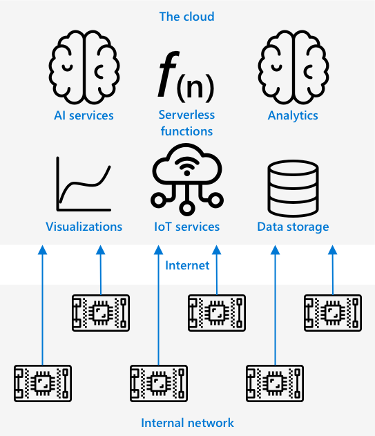

<!--
CO_OP_TRANSLATOR_METADATA:
{
  "original_hash": "2625af24587465c5547ae33d6cc000a5",
  "translation_date": "2025-08-27T20:47:58+00:00",
  "source_file": "4-manufacturing/lessons/3-run-fruit-detector-edge/README.md",
  "language_code": "nl"
}
-->
# Voer je fruitdetector uit aan de rand


> Sketchnote door [Nitya Narasimhan](https://github.com/nitya). Klik op de afbeelding voor een grotere versie.

Deze video geeft een overzicht van het uitvoeren van beeldclassificators op IoT-apparaten, het onderwerp dat in deze les wordt behandeld.

[](https://www.youtube.com/watch?v=_K5fqGLO8us)

## Quiz voorafgaand aan de les

[Quiz voorafgaand aan de les](https://black-meadow-040d15503.1.azurestaticapps.net/quiz/33)

## Introductie

In de vorige les gebruikte je je beeldclassificator om rijp en onrijp fruit te classificeren, waarbij een afbeelding die door de camera op je IoT-apparaat werd vastgelegd via het internet naar een clouddienst werd verzonden. Deze oproepen kosten tijd, geld en kunnen, afhankelijk van het soort beeldgegevens dat je gebruikt, privacyproblemen veroorzaken.

In deze les leer je hoe je machine learning (ML)-modellen aan de rand kunt uitvoeren - op IoT-apparaten die op je eigen netwerk draaien in plaats van in de cloud. Je leert de voordelen en nadelen van edge computing versus cloud computing, hoe je je AI-model naar de rand kunt implementeren en hoe je er toegang toe krijgt vanaf je IoT-apparaat.

In deze les behandelen we:

* [Edge computing](../../../../../4-manufacturing/lessons/3-run-fruit-detector-edge)
* [Azure IoT Edge](../../../../../4-manufacturing/lessons/3-run-fruit-detector-edge)
* [Een IoT Edge-apparaat registreren](../../../../../4-manufacturing/lessons/3-run-fruit-detector-edge)
* [Een IoT Edge-apparaat instellen](../../../../../4-manufacturing/lessons/3-run-fruit-detector-edge)
* [Je model exporteren](../../../../../4-manufacturing/lessons/3-run-fruit-detector-edge)
* [Je container voorbereiden voor implementatie](../../../../../4-manufacturing/lessons/3-run-fruit-detector-edge)
* [Je container implementeren](../../../../../4-manufacturing/lessons/3-run-fruit-detector-edge)
* [Je IoT Edge-apparaat gebruiken](../../../../../4-manufacturing/lessons/3-run-fruit-detector-edge)

## Edge computing

Edge computing houdt in dat computers IoT-gegevens zo dicht mogelijk bij de plaats waar de gegevens worden gegenereerd verwerken. In plaats van deze verwerking in de cloud te laten plaatsvinden, wordt deze verplaatst naar de rand van de cloud - je interne netwerk.



In de lessen tot nu toe heb je apparaten gehad die gegevens verzamelen en naar de cloud sturen om te worden geanalyseerd, waarbij serverloze functies of AI-modellen in de cloud worden uitgevoerd.


Edge computing houdt in dat sommige clouddiensten van de cloud worden verplaatst naar computers die op hetzelfde netwerk draaien als de IoT-apparaten, en alleen communiceren met de cloud indien nodig. Bijvoorbeeld, je kunt AI-modellen op edge-apparaten uitvoeren om fruit te analyseren op rijpheid, en alleen analyses naar de cloud sturen, zoals het aantal rijpe stukken fruit versus onrijpe.

✅ Denk na over de IoT-toepassingen die je tot nu toe hebt gebouwd. Welke onderdelen daarvan zouden naar de rand kunnen worden verplaatst?

### Voordelen

De voordelen van edge computing zijn:

1. **Snelheid** - edge computing is ideaal voor tijdgevoelige gegevens, omdat acties worden uitgevoerd op hetzelfde netwerk als het apparaat, in plaats van oproepen via het internet te doen. Dit zorgt voor hogere snelheden, omdat interne netwerken aanzienlijk sneller kunnen werken dan internetverbindingen, met gegevens die een veel kortere afstand afleggen.

    > 💁 Ondanks dat optische kabels worden gebruikt voor internetverbindingen waardoor gegevens met de snelheid van het licht kunnen reizen, kan het tijd kosten om gegevens over de wereld naar cloudproviders te sturen. Bijvoorbeeld, als je gegevens vanuit Europa naar clouddiensten in de VS stuurt, duurt het minstens 28 ms voordat de gegevens de Atlantische Oceaan oversteken in een optische kabel, en dat is zonder rekening te houden met de tijd die nodig is om de gegevens naar de trans-Atlantische kabel te krijgen, om te zetten van elektrische naar lichtsignalen en weer terug aan de andere kant, en vervolgens van de optische kabel naar de cloudprovider.

    Edge computing vereist ook minder netwerkverkeer, waardoor het risico dat je gegevens vertragen door congestie op de beperkte bandbreedte van een internetverbinding wordt verminderd.

1. **Toegankelijkheid op afstand** - edge computing werkt wanneer je beperkte of geen connectiviteit hebt, of wanneer connectiviteit te duur is om continu te gebruiken. Bijvoorbeeld bij het werken in humanitaire rampgebieden waar infrastructuur beperkt is, of in ontwikkelingslanden.

1. **Lagere kosten** - het verzamelen, opslaan, analyseren en activeren van acties op edge-apparaten vermindert het gebruik van clouddiensten, wat de totale kosten van je IoT-toepassing kan verlagen. Er is een recente toename van apparaten die zijn ontworpen voor edge computing, zoals AI-versnellingsborden zoals de [Jetson Nano van NVIDIA](https://developer.nvidia.com/embedded/jetson-nano-developer-kit), die AI-werkbelastingen kunnen uitvoeren met GPU-gebaseerde hardware op apparaten die minder dan US$100 kosten.

1. **Privacy en beveiliging** - met edge computing blijven gegevens op je netwerk en worden ze niet geüpload naar de cloud. Dit heeft vaak de voorkeur voor gevoelige en persoonlijk identificeerbare informatie, vooral omdat gegevens niet hoeven te worden opgeslagen nadat ze zijn geanalyseerd, wat het risico op datalekken aanzienlijk vermindert. Voorbeelden zijn medische gegevens en beveiligingscamera-opnamen.

1. **Omgaan met onveilige apparaten** - als je apparaten hebt met bekende beveiligingsproblemen die je niet rechtstreeks op je netwerk of het internet wilt aansluiten, kun je ze aansluiten op een apart netwerk met een gateway IoT Edge-apparaat. Dit edge-apparaat kan dan ook een verbinding hebben met je bredere netwerk of het internet, en de gegevensstromen heen en weer beheren.

1. **Ondersteuning voor incompatibele apparaten** - als je apparaten hebt die geen verbinding kunnen maken met IoT Hub, bijvoorbeeld apparaten die alleen verbinding kunnen maken via HTTP-verbindingen of apparaten die alleen Bluetooth hebben, kun je een IoT Edge-apparaat gebruiken als een gateway-apparaat dat berichten doorstuurt naar IoT Hub.

✅ Doe wat onderzoek: Welke andere voordelen kunnen er zijn van edge computing?

### Nadelen

Er zijn nadelen aan edge computing, waarbij de cloud soms een betere optie kan zijn:

1. **Schaal en flexibiliteit** - cloud computing kan zich in realtime aanpassen aan netwerk- en gegevensbehoeften door servers en andere middelen toe te voegen of te verminderen. Om meer edge-computers toe te voegen, moet je handmatig meer apparaten toevoegen.

1. **Betrouwbaarheid en veerkracht** - cloud computing biedt meerdere servers, vaak op meerdere locaties, voor redundantie en rampenherstel. Om hetzelfde niveau van redundantie aan de rand te hebben, zijn grote investeringen en veel configuratiewerk nodig.

1. **Onderhoud** - cloudserviceproviders bieden systeemonderhoud en updates.

✅ Doe wat onderzoek: Welke andere nadelen kunnen er zijn van edge computing?

De nadelen zijn eigenlijk het tegenovergestelde van de voordelen van het gebruik van de cloud - je moet deze apparaten zelf bouwen en beheren, in plaats van te vertrouwen op de expertise en schaal van cloudproviders.

Sommige risico's worden beperkt door de aard van edge computing. Bijvoorbeeld, als je een edge-apparaat hebt dat in een fabriek draait en gegevens verzamelt van machines, hoef je niet na te denken over sommige rampenherstelscenario's. Als de stroom in de fabriek uitvalt, hoef je geen back-up edge-apparaat te hebben, omdat de machines die de gegevens genereren die het edge-apparaat verwerkt ook zonder stroom zullen zitten.

Voor IoT-systemen wil je vaak een mix van cloud- en edge computing, waarbij je elke dienst gebruikt op basis van de behoeften van het systeem, zijn klanten en zijn beheerders.

## Azure IoT Edge


Azure IoT Edge is een dienst die je kan helpen om werkbelastingen uit de cloud naar de rand te verplaatsen. Je stelt een apparaat in als een edge-apparaat, en vanuit de cloud kun je code naar dat edge-apparaat implementeren. Dit stelt je in staat om de mogelijkheden van de cloud en de rand te combineren.

> 🎓 *Werkbelastingen* is een term voor elke dienst die een soort werk uitvoert, zoals AI-modellen, applicaties of serverloze functies.

Bijvoorbeeld, je kunt een beeldclassificator in de cloud trainen en deze vervolgens vanuit de cloud implementeren naar een edge-apparaat. Je IoT-apparaat stuurt dan afbeeldingen naar het edge-apparaat voor classificatie, in plaats van de afbeeldingen via het internet te sturen. Als je een nieuwe versie van het model moet implementeren, kun je het in de cloud trainen en IoT Edge gebruiken om het model op het edge-apparaat bij te werken naar je nieuwe versie.

> 🎓 Software die wordt geïmplementeerd op IoT Edge wordt *modules* genoemd. Standaard draait IoT Edge modules die communiceren met IoT Hub, zoals de `edgeAgent` en `edgeHub` modules. Wanneer je een beeldclassificator implementeert, wordt deze geïmplementeerd als een extra module.

IoT Edge is ingebouwd in IoT Hub, zodat je edge-apparaten kunt beheren met dezelfde dienst die je zou gebruiken om IoT-apparaten te beheren, met hetzelfde niveau van beveiliging.

IoT Edge draait code vanuit *containers* - zelfstandige applicaties die geïsoleerd worden uitgevoerd van de rest van de applicaties op je computer. Wanneer je een container uitvoert, gedraagt deze zich als een aparte computer die binnen je computer draait, met zijn eigen software, diensten en applicaties. Meestal kunnen containers niets op je computer benaderen, tenzij je ervoor kiest om bijvoorbeeld een map te delen met de container. De container biedt vervolgens diensten aan via een open poort die je kunt verbinden of blootstellen aan je netwerk.


Bijvoorbeeld, je kunt een container hebben met een website die draait op poort 80, de standaard HTTP-poort, en je kunt deze vervolgens blootstellen vanaf je computer ook op poort 80.

✅ Doe wat onderzoek: Lees meer over containers en diensten zoals Docker of Moby.

Je kunt Custom Vision gebruiken om beeldclassificators te downloaden en deze te implementeren als containers, ofwel direct naar een apparaat of geïmplementeerd via IoT Edge. Zodra ze draaien in een container, kunnen ze worden benaderd met dezelfde REST API als de cloudversie, maar met het eindpunt dat verwijst naar het edge-apparaat dat de container uitvoert.

## Een IoT Edge-apparaat registreren

Om een IoT Edge-apparaat te gebruiken, moet het worden geregistreerd in IoT Hub.

### Taak - een IoT Edge-apparaat registreren

1. Maak een IoT Hub in de resourcegroep `fruit-quality-detector`. Geef het een unieke naam gebaseerd op `fruit-quality-detector`.

1. Registreer een IoT Edge-apparaat genaamd `fruit-quality-detector-edge` in je IoT Hub. De opdracht om dit te doen is vergelijkbaar met de opdracht die wordt gebruikt om een niet-edge-apparaat te registreren, behalve dat je de vlag `--edge-enabled` doorgeeft.

    ```sh
    az iot hub device-identity create --edge-enabled \
                                      --device-id fruit-quality-detector-edge \
                                      --hub-name <hub_name>
    ```

    Vervang `<hub_name>` door de naam van je IoT Hub.

1. Haal de verbindingsreeks voor je apparaat op met de volgende opdracht:

    ```sh
    az iot hub device-identity connection-string show --device-id fruit-quality-detector-edge \
                                                      --output table \
                                                      --hub-name <hub_name>
    ```

    Vervang `<hub_name>` door de naam van je IoT Hub.

    Maak een kopie van de verbindingsreeks die in de uitvoer wordt weergegeven.

## Een IoT Edge-apparaat instellen

Zodra je de edge-apparaatregistratie in je IoT Hub hebt gemaakt, kun je het edge-apparaat instellen.

### Taak - Installeer en start de IoT Edge Runtime

**De IoT Edge runtime draait alleen Linux-containers.** Het kan worden uitgevoerd op Linux, of op Windows met behulp van Linux Virtual Machines.

* Als je een Raspberry Pi gebruikt als je IoT-apparaat, dan draait deze een ondersteunde versie van Linux en kan de IoT Edge runtime hosten. Volg de [installatiehandleiding voor Azure IoT Edge voor Linux op Microsoft Docs](https://docs.microsoft.com/azure/iot-edge/how-to-install-iot-edge?WT.mc_id=academic-17441-jabenn) om IoT Edge te installeren en de verbindingsreeks in te stellen.

    > 💁 Vergeet niet, Raspberry Pi OS is een variant van Debian Linux.

* Als je geen Raspberry Pi gebruikt, maar een Linux-computer hebt, kun je de IoT Edge runtime uitvoeren. Volg de [installatiehandleiding voor Azure IoT Edge voor Linux op Microsoft Docs](https://docs.microsoft.com/azure/iot-edge/how-to-install-iot-edge?WT.mc_id=academic-17441-jabenn) om IoT Edge te installeren en de verbindingsreeks in te stellen.

* Als je Windows gebruikt, kun je de IoT Edge runtime installeren in een Linux Virtual Machine door de [installatie- en startsectie van de IoT Edge runtime in de quickstart voor het implementeren van je eerste IoT Edge-module op een Windows-apparaat op Microsoft Docs](https://docs.microsoft.com/azure/iot-edge/quickstart?WT.mc_id=academic-17441-jabenn#install-and-start-the-iot-edge-runtime) te volgen. Je kunt stoppen wanneer je het gedeelte *Een module implementeren* bereikt.

* Als je macOS gebruikt, kun je een virtuele machine (VM) in de cloud maken om te gebruiken voor je IoT Edge-apparaat. Dit zijn computers die je in de cloud kunt maken en via het internet kunt benaderen. Je kunt een Linux VM maken die IoT Edge heeft geïnstalleerd. Volg de [handleiding voor het maken van een virtuele machine met IoT Edge](vm-iotedge.md) voor instructies over hoe je dit kunt doen.

## Je model exporteren

Om de classificator aan de rand uit te voeren, moet deze worden geëxporteerd vanuit Custom Vision. Custom Vision kan twee soorten modellen genereren - standaardmodellen en compacte modellen. Compacte modellen gebruiken verschillende technieken om de grootte van het model te verkleinen, zodat het klein genoeg is om te worden gedownload en geïmplementeerd op IoT-apparaten.

Toen je de beeldclassificator maakte, gebruikte je het *Food*-domein, een versie van het model die is geoptimaliseerd voor training op voedselafbeeldingen. In Custom Vision kun je het domein van je project wijzigen, waarbij je je trainingsgegevens gebruikt om een nieuw model te trainen met het nieuwe domein. Alle domeinen die door Custom Vision worden ondersteund, zijn beschikbaar als standaard en compact.

### Taak - train je model met behulp van het Food (compact) domein
1. Open het Custom Vision-portaal op [CustomVision.ai](https://customvision.ai) en log in als je dat nog niet hebt gedaan. Open vervolgens je `fruit-quality-detector`-project.

1. Selecteer de knop **Instellingen** (het ⚙-icoon).

1. Kies in de lijst *Domeinen* voor *Voedsel (compact)*.

1. Zorg ervoor dat onder *Exportmogelijkheden* de optie *Basisplatforms (Tensorflow, CoreML, ONNX, ...)* is geselecteerd.

1. Klik onderaan de Instellingen-pagina op **Wijzigingen opslaan**.

1. Train het model opnieuw met de knop **Train**, en kies voor *Snelle training*.

### Taak - Exporteer je model

Zodra het model is getraind, moet het worden geëxporteerd als een container.

1. Selecteer het tabblad **Prestaties** en zoek je meest recente iteratie die is getraind met het compacte domein.

1. Klik bovenaan op de knop **Exporteren**.

1. Kies **DockerFile** en selecteer een versie die overeenkomt met je edge-apparaat:

    * Als je IoT Edge uitvoert op een Linux-computer, een Windows-computer of een virtuele machine, kies dan de *Linux*-versie.
    * Als je IoT Edge uitvoert op een Raspberry Pi, kies dan de *ARM (Raspberry Pi 3)*-versie.

> 🎓 Docker is een van de populairste tools voor het beheren van containers, en een DockerFile is een set instructies om de container in te stellen.

1. Klik op **Exporteren** om Custom Vision de benodigde bestanden te laten maken en vervolgens op **Downloaden** om ze in een zip-bestand te downloaden.

1. Sla de bestanden op je computer op en pak de map uit.

## Bereid je container voor op implementatie


Nadat je je model hebt gedownload, moet het worden opgebouwd in een container en vervolgens worden gepusht naar een containerregister - een online locatie waar je containers kunt opslaan. IoT Edge kan de container vervolgens downloaden van het register en naar je apparaat pushen.


Het containerregister dat je in deze les gebruikt, is Azure Container Registry. Dit is geen gratis service, dus om kosten te besparen, zorg ervoor dat je [je project opruimt](../../../clean-up.md) zodra je klaar bent.

> 💁 Je kunt de kosten van het gebruik van een Azure Container Registry bekijken op de [Azure Container Registry-prijspagina](https://azure.microsoft.com/pricing/details/container-registry/?WT.mc_id=academic-17441-jabenn).

### Taak - Installeer Docker

Om de classifier te bouwen en te implementeren, moet je mogelijk [Docker](https://www.docker.com/) installeren.

Dit is alleen nodig als je van plan bent de container te bouwen op een ander apparaat dan waarop je IoT Edge hebt geïnstalleerd - Docker wordt namelijk al geïnstalleerd als onderdeel van de IoT Edge-installatie.

1. Als je de Docker-container bouwt op een ander apparaat dan je IoT Edge-apparaat, volg dan de installatie-instructies op de [Docker-installatiepagina](https://www.docker.com/products/docker-desktop) om Docker Desktop of de Docker-engine te installeren. Zorg ervoor dat Docker na installatie actief is.

### Taak - Maak een containerregisterresource

1. Voer het volgende commando uit in je terminal of opdrachtprompt om een Azure Container Registry-resource te maken:

    ```sh
    az acr create --resource-group fruit-quality-detector \
                  --sku Basic \
                  --name <Container registry name>
    ```

    Vervang `<Container registry name>` door een unieke naam voor je containerregister, gebruikmakend van alleen letters en cijfers. Baseer dit op `fruitqualitydetector`. Deze naam wordt onderdeel van de URL om toegang te krijgen tot het containerregister, dus het moet wereldwijd uniek zijn.

1. Log in op het Azure Container Registry met het volgende commando:

    ```sh
    az acr login --name <Container registry name>
    ```

    Vervang `<Container registry name>` door de naam die je hebt gebruikt voor je containerregister.

1. Zet het containerregister in de beheermodus zodat je een wachtwoord kunt genereren met het volgende commando:

    ```sh
    az acr update --admin-enabled true \
                 --name <Container registry name>
    ```

    Vervang `<Container registry name>` door de naam die je hebt gebruikt voor je containerregister.

1. Genereer wachtwoorden voor je containerregister met het volgende commando:

    ```sh
     az acr credential renew --password-name password \
                             --output table \
                             --name <Container registry name>
    ```

    Vervang `<Container registry name>` door de naam die je hebt gebruikt voor je containerregister.

    Noteer de waarde van `PASSWORD`, want je hebt dit later nodig.

### Taak - Bouw je container

Wat je hebt gedownload van Custom Vision is een DockerFile met instructies over hoe de container moet worden gebouwd, samen met applicatiecode die binnen de container wordt uitgevoerd om je Custom Vision-model te hosten, inclusief een REST API om het aan te roepen. Je kunt Docker gebruiken om een getagde container te bouwen vanuit de DockerFile en deze vervolgens naar je containerregister te pushen.

> 🎓 Containers krijgen een tag die een naam en versie voor hen definieert. Wanneer je een container moet bijwerken, kun je deze bouwen met dezelfde tag maar een nieuwere versie.

1. Open je terminal of opdrachtprompt en navigeer naar het uitgepakte model dat je hebt gedownload van Custom Vision.

1. Voer het volgende commando uit om de afbeelding te bouwen en te taggen:

    ```sh
    docker build --platform <platform> -t <Container registry name>.azurecr.io/classifier:v1 .
    ```

    Vervang `<platform>` door het platform waarop deze container zal draaien. Als je IoT Edge uitvoert op een Raspberry Pi, stel dit dan in op `linux/armhf`, anders stel je dit in op `linux/amd64`.

    > 💁 Als je dit commando uitvoert vanaf het apparaat waarop je IoT Edge draait, zoals een Raspberry Pi, kun je het deel `--platform <platform>` weglaten, omdat het standaard het huidige platform gebruikt.

    Vervang `<Container registry name>` door de naam die je hebt gebruikt voor je containerregister.

    > 💁 Als je Linux of Raspberry Pi OS gebruikt, moet je mogelijk `sudo` gebruiken om dit commando uit te voeren.

    Docker bouwt de afbeelding en configureert alle benodigde software. De afbeelding wordt vervolgens getagd als `classifier:v1`.

    ```output
    ➜  d4ccc45da0bb478bad287128e1274c3c.DockerFile.Linux docker build --platform linux/amd64 -t  fruitqualitydetectorjimb.azurecr.io/classifier:v1 .
    [+] Building 102.4s (11/11) FINISHED
     => [internal] load build definition from Dockerfile
     => => transferring dockerfile: 131B
     => [internal] load .dockerignore
     => => transferring context: 2B
     => [internal] load metadata for docker.io/library/python:3.7-slim
     => [internal] load build context
     => => transferring context: 905B
     => [1/6] FROM docker.io/library/python:3.7-slim@sha256:b21b91c9618e951a8cbca5b696424fa5e820800a88b7e7afd66bba0441a764d6
     => => resolve docker.io/library/python:3.7-slim@sha256:b21b91c9618e951a8cbca5b696424fa5e820800a88b7e7afd66bba0441a764d6
     => => sha256:b4d181a07f8025e00e0cb28f1cc14613da2ce26450b80c54aea537fa93cf3bda 27.15MB / 27.15MB
     => => sha256:de8ecf497b753094723ccf9cea8a46076e7cb845f333df99a6f4f397c93c6ea9 2.77MB / 2.77MB
     => => sha256:707b80804672b7c5d8f21e37c8396f319151e1298d976186b4f3b76ead9f10c8 10.06MB / 10.06MB
     => => sha256:b21b91c9618e951a8cbca5b696424fa5e820800a88b7e7afd66bba0441a764d6 1.86kB / 1.86kB
     => => sha256:44073386687709c437586676b572ff45128ff1f1570153c2f727140d4a9accad 1.37kB / 1.37kB
     => => sha256:3d94f0f2ca798607808b771a7766f47ae62a26f820e871dd488baeccc69838d1 8.31kB / 8.31kB
     => => sha256:283715715396fd56d0e90355125fd4ec57b4f0773f306fcd5fa353b998beeb41 233B / 233B
     => => sha256:8353afd48f6b84c3603ea49d204bdcf2a1daada15f5d6cad9cc916e186610a9f 2.64MB / 2.64MB
     => => extracting sha256:b4d181a07f8025e00e0cb28f1cc14613da2ce26450b80c54aea537fa93cf3bda
     => => extracting sha256:de8ecf497b753094723ccf9cea8a46076e7cb845f333df99a6f4f397c93c6ea9
     => => extracting sha256:707b80804672b7c5d8f21e37c8396f319151e1298d976186b4f3b76ead9f10c8
     => => extracting sha256:283715715396fd56d0e90355125fd4ec57b4f0773f306fcd5fa353b998beeb41
     => => extracting sha256:8353afd48f6b84c3603ea49d204bdcf2a1daada15f5d6cad9cc916e186610a9f
     => [2/6] RUN pip install -U pip
     => [3/6] RUN pip install --no-cache-dir numpy~=1.17.5 tensorflow~=2.0.2 flask~=1.1.2 pillow~=7.2.0
     => [4/6] RUN pip install --no-cache-dir mscviplib==2.200731.16
     => [5/6] COPY app /app
     => [6/6] WORKDIR /app
     => exporting to image
     => => exporting layers
     => => writing image sha256:1846b6f134431f78507ba7c079358ed66d944c0e185ab53428276bd822400386
     => => naming to fruitqualitydetectorjimb.azurecr.io/classifier:v1
    ```

### Taak - Push je container naar je containerregister

1. Gebruik het volgende commando om je container naar je containerregister te pushen:

    ```sh
    docker push <Container registry name>.azurecr.io/classifier:v1
    ```

    Vervang `<Container registry name>` door de naam die je hebt gebruikt voor je containerregister.

    > 💁 Als je Linux gebruikt, moet je mogelijk `sudo` gebruiken om dit commando uit te voeren.

    De container wordt naar het containerregister gepusht.

    ```output
    ➜  d4ccc45da0bb478bad287128e1274c3c.DockerFile.Linux docker push fruitqualitydetectorjimb.azurecr.io/classifier:v1
    The push refers to repository [fruitqualitydetectorjimb.azurecr.io/classifier]
    5f70bf18a086: Pushed 
    8a1ba9294a22: Pushed 
    56cf27184a76: Pushed 
    b32154f3f5dd: Pushed 
    36103e9a3104: Pushed 
    e2abb3cacca0: Pushed 
    4213fd357bbe: Pushed 
    7ea163ba4dce: Pushed 
    537313a13d90: Pushed 
    764055ebc9a7: Pushed 
    v1: digest: sha256:ea7894652e610de83a5a9e429618e763b8904284253f4fa0c9f65f0df3a5ded8 size: 2423
    ```

1. Om te verifiëren dat de push is gelukt, kun je de containers in je register weergeven met het volgende commando:

    ```sh
    az acr repository list --output table \
                           --name <Container registry name> 
    ```

    Vervang `<Container registry name>` door de naam die je hebt gebruikt voor je containerregister.

    ```output
    ➜  d4ccc45da0bb478bad287128e1274c3c.DockerFile.Linux az acr repository list --name fruitqualitydetectorjimb --output table
    Result
    ----------
    classifier
    ```

    Je ziet je classifier in de uitvoer staan.

## Implementeer je container

Je container kan nu worden geïmplementeerd op je IoT Edge-apparaat. Om te implementeren, moet je een implementatiemanifest definiëren - een JSON-document dat de modules opsomt die op het edge-apparaat worden geïmplementeerd.

### Taak - Maak het implementatiemanifest

1. Maak een nieuw bestand genaamd `deployment.json` ergens op je computer.

1. Voeg het volgende toe aan dit bestand:

    ```json
    {
        "content": {
            "modulesContent": {
                "$edgeAgent": {
                    "properties.desired": {
                        "schemaVersion": "1.1",
                        "runtime": {
                            "type": "docker",
                            "settings": {
                                "minDockerVersion": "v1.25",
                                "loggingOptions": "",
                                "registryCredentials": {
                                    "ClassifierRegistry": {
                                        "username": "<Container registry name>",
                                        "password": "<Container registry password>",
                                        "address": "<Container registry name>.azurecr.io"
                                      }
                                }
                            }
                        },
                        "systemModules": {
                            "edgeAgent": {
                                "type": "docker",
                                "settings": {
                                    "image": "mcr.microsoft.com/azureiotedge-agent:1.1",
                                    "createOptions": "{}"
                                }
                            },
                            "edgeHub": {
                                "type": "docker",
                                "status": "running",
                                "restartPolicy": "always",
                                "settings": {
                                    "image": "mcr.microsoft.com/azureiotedge-hub:1.1",
                                    "createOptions": "{\"HostConfig\":{\"PortBindings\":{\"5671/tcp\":[{\"HostPort\":\"5671\"}],\"8883/tcp\":[{\"HostPort\":\"8883\"}],\"443/tcp\":[{\"HostPort\":\"443\"}]}}}"
                                }
                            }
                        },
                        "modules": {
                            "ImageClassifier": {
                                "version": "1.0",
                                "type": "docker",
                                "status": "running",
                                "restartPolicy": "always",
                                "settings": {
                                    "image": "<Container registry name>.azurecr.io/classifier:v1",
                                    "createOptions": "{\"ExposedPorts\": {\"80/tcp\": {}},\"HostConfig\": {\"PortBindings\": {\"80/tcp\": [{\"HostPort\": \"80\"}]}}}"
                                }
                            }
                        }
                    }
                },
                "$edgeHub": {
                    "properties.desired": {
                        "schemaVersion": "1.1",
                        "routes": {
                            "upstream": "FROM /messages/* INTO $upstream"
                        },
                        "storeAndForwardConfiguration": {
                            "timeToLiveSecs": 7200
                        }
                    }
                }
            }
        }
    }
    ```

    > 💁 Je kunt dit bestand vinden in de map [code-deployment/deployment](../../../../../4-manufacturing/lessons/3-run-fruit-detector-edge/code-deployment/deployment).

    Vervang de drie instanties van `<Container registry name>` door de naam die je hebt gebruikt voor je containerregister. Eén bevindt zich in de sectie `ImageClassifier`-module, de andere twee in de sectie `registryCredentials`.

    Vervang `<Container registry password>` in de sectie `registryCredentials` door je containerregisterwachtwoord.

1. Voer vanuit de map met je implementatiemanifest het volgende commando uit:

    ```sh
    az iot edge set-modules --device-id fruit-quality-detector-edge \
                            --content deployment.json \
                            --hub-name <hub_name>
    ```

    Vervang `<hub_name>` door de naam van je IoT Hub.

    De image classifier-module wordt geïmplementeerd op je edge-apparaat.

### Taak - Verifieer dat de classifier draait

1. Maak verbinding met het IoT Edge-apparaat:

    * Als je een Raspberry Pi gebruikt om IoT Edge uit te voeren, maak verbinding via ssh vanuit je terminal of via een externe SSH-sessie in VS Code.
    * Als je IoT Edge uitvoert in een Linux-container op Windows, volg dan de stappen in de [gids voor succesvolle configuratieverificatie](https://docs.microsoft.com/azure/iot-edge/how-to-install-iot-edge-on-windows?WT.mc_id=academic-17441-jabenn&view=iotedge-2018-06&tabs=powershell#verify-successful-configuration) om verbinding te maken met het IoT Edge-apparaat.
    * Als je IoT Edge uitvoert op een virtuele machine, kun je SSH gebruiken naar de machine met de `adminUsername` en `password` die je hebt ingesteld bij het maken van de VM, en met behulp van het IP-adres of de DNS-naam:

        ```sh
        ssh <adminUsername>@<IP address>
        ```

        Of:

        ```sh
        ssh <adminUsername>@<DNS Name>
        ```

        Voer je wachtwoord in wanneer daarom wordt gevraagd.

1. Zodra je bent verbonden, voer je het volgende commando uit om de lijst met IoT Edge-modules te krijgen:

    ```sh
    iotedge list
    ```

    > 💁 Mogelijk moet je dit commando uitvoeren met `sudo`.

    Je ziet de draaiende modules:

    ```output
    jim@fruit-quality-detector-jimb:~$ iotedge list
    NAME             STATUS           DESCRIPTION      CONFIG
    ImageClassifier  running          Up 42 minutes    fruitqualitydetectorjimb.azurecr.io/classifier:v1
    edgeAgent        running          Up 42 minutes    mcr.microsoft.com/azureiotedge-agent:1.1
    edgeHub          running          Up 42 minutes    mcr.microsoft.com/azureiotedge-hub:1.1
    ```

1. Controleer de logs voor de Image Classifier-module met het volgende commando:

    ```sh
    iotedge logs ImageClassifier
    ```

    > 💁 Mogelijk moet je dit commando uitvoeren met `sudo`.

    ```output
    jim@fruit-quality-detector-jimb:~$ iotedge logs ImageClassifier
    2021-07-05 20:30:15.387144: I tensorflow/core/platform/cpu_feature_guard.cc:142] Your CPU supports instructions that this TensorFlow binary was not compiled to use: AVX2 FMA
    2021-07-05 20:30:15.392185: I tensorflow/core/platform/profile_utils/cpu_utils.cc:94] CPU Frequency: 2394450000 Hz
    2021-07-05 20:30:15.392712: I tensorflow/compiler/xla/service/service.cc:168] XLA service 0x55ed9ac83470 executing computations on platform Host. Devices:
    2021-07-05 20:30:15.392806: I tensorflow/compiler/xla/service/service.cc:175]   StreamExecutor device (0): Host, Default Version
    Loading model...Success!
    Loading labels...2 found. Success!
     * Serving Flask app "app" (lazy loading)
     * Environment: production
       WARNING: This is a development server. Do not use it in a production deployment.
       Use a production WSGI server instead.
     * Debug mode: off
     * Running on http://0.0.0.0:80/ (Press CTRL+C to quit)
    ```

### Taak - Test de image classifier

1. Je kunt CURL gebruiken om de image classifier te testen met behulp van het IP-adres of de hostnaam van de computer waarop de IoT Edge-agent draait. Zoek het IP-adres:

    * Als je op dezelfde machine bent als waarop IoT Edge draait, kun je `localhost` gebruiken als hostnaam.
    * Als je een VM gebruikt, kun je het IP-adres of de DNS-naam van de VM gebruiken.
    * Anders kun je het IP-adres van de machine waarop IoT Edge draait verkrijgen:
      * Op Windows 10, volg de [gids om je IP-adres te vinden](https://support.microsoft.com/windows/find-your-ip-address-f21a9bbc-c582-55cd-35e0-73431160a1b9?WT.mc_id=academic-17441-jabenn).
      * Op macOS, volg de [gids om je IP-adres op een Mac te vinden](https://www.hellotech.com/guide/for/how-to-find-ip-address-on-mac).
      * Op Linux, volg de sectie over het vinden van je privé-IP-adres in de [gids om je IP-adres in Linux te vinden](https://opensource.com/article/18/5/how-find-ip-address-linux).

1. Je kunt de container testen met een lokaal bestand door het volgende curl-commando uit te voeren:

    ```sh
    curl --location \
         --request POST 'http://<IP address or name>/image' \
         --header 'Content-Type: image/png' \
         --data-binary '@<file_Name>' 
    ```

    Vervang `<IP address or name>` door het IP-adres of de hostnaam van de computer waarop IoT Edge draait. Vervang `<file_Name>` door de naam van het bestand dat je wilt testen.

    Je ziet de voorspellingsresultaten in de uitvoer:

    ```output
    {
        "created": "2021-07-05T21:44:39.573181",
        "id": "",
        "iteration": "",
        "predictions": [
            {
                "boundingBox": null,
                "probability": 0.9995615482330322,
                "tagId": "",
                "tagName": "ripe"
            },
            {
                "boundingBox": null,
                "probability": 0.0004384400090202689,
                "tagId": "",
                "tagName": "unripe"
            }
        ],
        "project": ""
    }
    ```

    > 💁 Er is hier geen voorspelsleutel nodig, omdat dit geen gebruik maakt van een Azure-resource. In plaats daarvan wordt beveiliging geconfigureerd op het interne netwerk op basis van interne beveiligingsbehoeften, in plaats van te vertrouwen op een openbare eindpunt en een API-sleutel.

## Gebruik je IoT Edge-apparaat

Nu je Image Classifier is geïmplementeerd op een IoT Edge-apparaat, kun je het gebruiken vanaf je IoT-apparaat.

### Taak - Gebruik je IoT Edge-apparaat

Werk de relevante gids door om afbeeldingen te classificeren met behulp van de IoT Edge-classifier:

* [Arduino - Wio Terminal](wio-terminal.md)
* [Single-board computer - Raspberry Pi/Virtual IoT device](single-board-computer.md)

### Model opnieuw trainen

Een van de nadelen van het uitvoeren van image classifiers op IoT Edge is dat ze niet zijn verbonden met je Custom Vision-project. Als je kijkt naar het tabblad **Voorspellingen** in Custom Vision, zie je niet de afbeeldingen die zijn geclassificeerd met de Edge-gebaseerde classifier.

Dit is het verwachte gedrag - afbeeldingen worden niet naar de cloud verzonden voor classificatie, dus ze zijn niet beschikbaar in de cloud. Een van de voordelen van het gebruik van IoT Edge is privacy, waardoor wordt gegarandeerd dat afbeeldingen je netwerk niet verlaten. Een ander voordeel is dat je offline kunt werken, zonder afhankelijk te zijn van het uploaden van afbeeldingen wanneer het apparaat geen internetverbinding heeft. Het nadeel is het verbeteren van je model - je zou een andere manier moeten implementeren om afbeeldingen op te slaan die handmatig opnieuw kunnen worden geclassificeerd om de image classifier te verbeteren en opnieuw te trainen.

✅ Denk na over manieren om afbeeldingen te uploaden om de classifier opnieuw te trainen.

---

## 🚀 Uitdaging

AI-modellen uitvoeren op edge-apparaten kan sneller zijn dan in de cloud - de netwerkhop is korter. Ze kunnen ook langzamer zijn omdat de hardware die het model uitvoert mogelijk niet zo krachtig is als de cloud.

Doe wat metingen en vergelijk of de oproep naar je edge-apparaat sneller of langzamer is dan de oproep naar de cloud? Denk na over redenen om het verschil, of het gebrek aan verschil, te verklaren. Onderzoek manieren om AI-modellen sneller uit te voeren op de edge met behulp van gespecialiseerde hardware.

## Quiz na de les

[Quiz na de les](https://black-meadow-040d15503.1.azurestaticapps.net/quiz/34)

## Review & Zelfstudie

* Lees meer over containers op de [OS-niveau virtualisatiepagina op Wikipedia](https://wikipedia.org/wiki/OS-level_virtualization).
* Lees meer over edge computing, met de nadruk op hoe 5G kan helpen edge computing uit te breiden in het [wat is edge computing en waarom is het belangrijk? artikel op NetworkWorld](https://www.networkworld.com/article/3224893/what-is-edge-computing-and-how-its-changing-the-network.html)
* Leer meer over het uitvoeren van AI-diensten in IoT Edge door te kijken naar de [leer hoe je Azure IoT Edge kunt gebruiken op een vooraf gebouwde AI-dienst op de Edge om taalherkenning te doen aflevering van Learn Live op Microsoft Channel9](https://channel9.msdn.com/Shows/Learn-Live/Sharpen-Your-AI-Edge-Skills-Episode-4-Learn-How-to-Use-Azure-IoT-Edge-on-a-Pre-Built-AI-Service-on-t?WT.mc_id=academic-17441-jabenn)

## Opdracht

[Voer andere diensten uit op de edge](assignment.md)

---

**Disclaimer**:  
Dit document is vertaald met behulp van de AI-vertalingsservice [Co-op Translator](https://github.com/Azure/co-op-translator). Hoewel we streven naar nauwkeurigheid, dient u zich ervan bewust te zijn dat geautomatiseerde vertalingen fouten of onnauwkeurigheden kunnen bevatten. Het originele document in zijn oorspronkelijke taal moet worden beschouwd als de gezaghebbende bron. Voor cruciale informatie wordt professionele menselijke vertaling aanbevolen. Wij zijn niet aansprakelijk voor misverstanden of verkeerde interpretaties die voortvloeien uit het gebruik van deze vertaling.