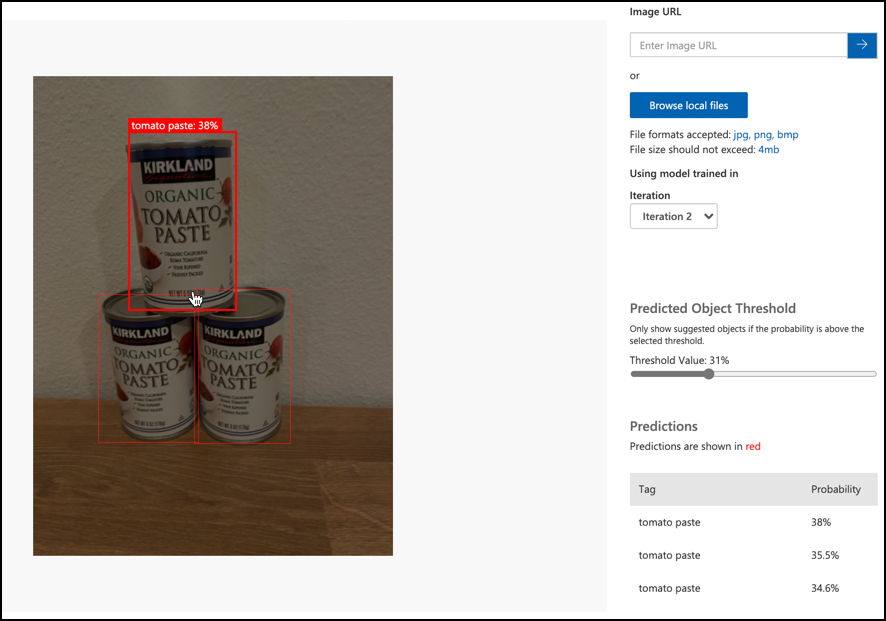

<!--
CO_OP_TRANSLATOR_METADATA:
{
  "original_hash": "8df310a42f902139a01417dacb1ffbef",
  "translation_date": "2025-08-27T20:33:15+00:00",
  "source_file": "5-retail/lessons/1-train-stock-detector/README.md",
  "language_code": "nl"
}
-->
# Train een voorraad detector

> Sketchnote door [Nitya Narasimhan](https://github.com/nitya). Klik op de afbeelding voor een grotere versie.

Deze video geeft een overzicht van Objectdetectie met de Azure Custom Vision-service, een dienst die in deze les wordt behandeld.

> 🎥 Klik op de afbeelding hierboven om de video te bekijken

## Pre-lecture quiz

[Pre-lecture quiz](https://black-meadow-040d15503.1.azurestaticapps.net/quiz/37)

## Introductie

In het vorige project gebruikte je AI om een beeldclassifier te trainen - een model dat kan bepalen of een afbeelding iets bevat, zoals rijp of onrijp fruit. Een ander type AI-model dat met afbeeldingen kan worden gebruikt, is objectdetectie. Deze modellen classificeren een afbeelding niet op basis van tags, maar worden getraind om objecten te herkennen en kunnen ze in afbeeldingen lokaliseren. Ze detecteren niet alleen dat een object aanwezig is, maar ook waar het zich in de afbeelding bevindt. Dit maakt het mogelijk om objecten in afbeeldingen te tellen.

In deze les leer je over objectdetectie, inclusief hoe het kan worden gebruikt in de detailhandel. Je leert ook hoe je een objectdetector in de cloud kunt trainen.

In deze les behandelen we:

* [Objectdetectie](../../../../../5-retail/lessons/1-train-stock-detector)
* [Objectdetectie gebruiken in de detailhandel](../../../../../5-retail/lessons/1-train-stock-detector)
* [Een objectdetector trainen](../../../../../5-retail/lessons/1-train-stock-detector)
* [Je objectdetector testen](../../../../../5-retail/lessons/1-train-stock-detector)
* [Je objectdetector opnieuw trainen](../../../../../5-retail/lessons/1-train-stock-detector)

## Objectdetectie

Objectdetectie houdt in dat objecten in afbeeldingen worden gedetecteerd met behulp van AI. In tegenstelling tot de beeldclassifier die je in het vorige project hebt getraind, draait objectdetectie niet om het voorspellen van de beste tag voor een afbeelding als geheel, maar om het vinden van één of meer objecten in een afbeelding.

### Objectdetectie versus beeldclassificatie

Beeldclassificatie draait om het classificeren van een afbeelding als geheel - wat zijn de waarschijnlijkheden dat de hele afbeelding overeenkomt met elke tag. Je krijgt waarschijnlijkheden terug voor elke tag die is gebruikt om het model te trainen.

In het bovenstaande voorbeeld worden twee afbeeldingen geclassificeerd met behulp van een model dat is getraind om potten met cashewnoten of blikken tomatenpuree te classificeren. De eerste afbeelding is een pot met cashewnoten en heeft twee resultaten van de beeldclassifier:

| Tag            | Waarschijnlijkheid |
| -------------- | ------------------: |
| `cashewnoten`  | 98.4%              |
| `tomatenpuree` | 1.6%               |

De tweede afbeelding is van een blik tomatenpuree, en de resultaten zijn:

| Tag            | Waarschijnlijkheid |
| -------------- | ------------------: |
| `cashewnoten`  | 0.7%               |
| `tomatenpuree` | 99.3%              |

Je zou deze waarden kunnen gebruiken met een drempelpercentage om te voorspellen wat er in de afbeelding zit. Maar wat als een afbeelding meerdere blikken tomatenpuree bevat, of zowel cashewnoten als tomatenpuree? De resultaten zouden waarschijnlijk niet geven wat je wilt. Hier komt objectdetectie van pas.

Objectdetectie houdt in dat een model wordt getraind om objecten te herkennen. In plaats van het model afbeeldingen te geven die het object bevatten en te vertellen dat elke afbeelding één tag of een andere is, markeer je het gedeelte van een afbeelding dat het specifieke object bevat en tag je dat. Je kunt een enkel object in een afbeelding taggen of meerdere. Op deze manier leert het model hoe het object er zelf uitziet, niet alleen hoe afbeeldingen die het object bevatten eruitzien.

Wanneer je het vervolgens gebruikt om afbeeldingen te voorspellen, krijg je in plaats van een lijst met tags en percentages een lijst met gedetecteerde objecten terug, met hun begrenzingskader en de waarschijnlijkheid dat het object overeenkomt met de toegewezen tag.

> 🎓 *Begrenzingskaders* zijn de kaders rond een object.

De bovenstaande afbeelding bevat zowel een pot met cashewnoten als drie blikken tomatenpuree. De objectdetector heeft de cashewnoten gedetecteerd en geeft het begrenzingskader dat de cashewnoten bevat terug met de kans dat het begrenzingskader het object bevat, in dit geval 97.6%. De objectdetector heeft ook drie blikken tomatenpuree gedetecteerd en biedt drie afzonderlijke begrenzingskaders, één voor elk gedetecteerd blik, en elk met een percentage waarschijnlijkheid dat het begrenzingskader een blik tomatenpuree bevat.

✅ Bedenk enkele verschillende scenario's waarvoor je AI-modellen op basis van afbeeldingen zou willen gebruiken. Welke zouden classificatie nodig hebben en welke zouden objectdetectie nodig hebben?

### Hoe objectdetectie werkt

Objectdetectie maakt gebruik van complexe ML-modellen. Deze modellen werken door de afbeelding op te delen in meerdere cellen en vervolgens te controleren of het midden van het begrenzingskader het midden is van een afbeelding die overeenkomt met een van de afbeeldingen die zijn gebruikt om het model te trainen. Je kunt dit zien als een soort beeldclassifier die over verschillende delen van de afbeelding wordt uitgevoerd om overeenkomsten te zoeken.

> 💁 Dit is een drastische vereenvoudiging. Er zijn veel technieken voor objectdetectie, en je kunt er meer over lezen op de [Objectdetectie-pagina op Wikipedia](https://wikipedia.org/wiki/Object_detection).

Er zijn een aantal verschillende modellen die objectdetectie kunnen uitvoeren. Een bijzonder bekend model is [YOLO (You only look once)](https://pjreddie.com/darknet/yolo/), dat ongelooflijk snel is en 20 verschillende klassen van objecten kan detecteren, zoals mensen, honden, flessen en auto's.

✅ Lees meer over het YOLO-model op [pjreddie.com/darknet/yolo/](https://pjreddie.com/darknet/yolo/)

Objectdetectiemodellen kunnen opnieuw worden getraind met behulp van transfer learning om aangepaste objecten te detecteren.

## Objectdetectie gebruiken in de detailhandel

Objectdetectie heeft meerdere toepassingen in de detailhandel. Enkele voorbeelden zijn:

* **Voorraadcontrole en telling** - herkennen wanneer de voorraad op de planken laag is. Als de voorraad te laag is, kunnen meldingen worden verzonden naar personeel of robots om de planken opnieuw te vullen.
* **Maskerdetectie** - in winkels met maskerbeleid tijdens openbare gezondheidsgebeurtenissen kan objectdetectie mensen met en zonder masker herkennen.
* **Geautomatiseerde facturering** - detecteren van items die van planken worden gepakt in geautomatiseerde winkels en klanten correct factureren.
* **Gevarendetectie** - herkennen van gebroken items op vloeren of gemorste vloeistoffen, en schoonmaakploegen waarschuwen.

✅ Doe wat onderzoek: Wat zijn nog meer toepassingen van objectdetectie in de detailhandel?

## Een objectdetector trainen

Je kunt een objectdetector trainen met Custom Vision, op een vergelijkbare manier als hoe je een beeldclassifier hebt getraind.

### Taak - maak een objectdetector

1. Maak een Resource Group voor dit project genaamd `stock-detector`.

1. Maak een gratis Custom Vision-trainingsresource en een gratis Custom Vision-voorspellingsresource in de `stock-detector` resource group. Noem ze `stock-detector-training` en `stock-detector-prediction`.

    > 💁 Je kunt slechts één gratis trainings- en voorspellingsresource hebben, dus zorg ervoor dat je je project van de eerdere lessen hebt opgeruimd.

    > ⚠️ Je kunt [de instructies voor het maken van trainings- en voorspellingsresources uit project 4, les 1 indien nodig raadplegen](../../../4-manufacturing/lessons/1-train-fruit-detector/README.md#task---create-a-cognitive-services-resource).

1. Start het Custom Vision-portaal op [CustomVision.ai](https://customvision.ai) en log in met het Microsoft-account dat je hebt gebruikt voor je Azure-account.

1. Volg de [Sectie 'Een nieuw project maken' van de Build an object detector quickstart op de Microsoft Docs](https://docs.microsoft.com/azure/cognitive-services/custom-vision-service/get-started-build-detector?WT.mc_id=academic-17441-jabenn#create-a-new-project) om een nieuw Custom Vision-project te maken. De gebruikersinterface kan veranderen en deze documentatie is altijd de meest actuele referentie.

    Noem je project `stock-detector`.

    Wanneer je je project maakt, zorg ervoor dat je de `stock-detector-training` resource gebruikt die je eerder hebt gemaakt. Gebruik het projecttype *Object Detection* en het domein *Products on Shelves*.

    

    ✅ Het domein 'Products on Shelves' is specifiek gericht op het detecteren van voorraad op winkelplanken. Lees meer over de verschillende domeinen in de [Select a domain documentatie op Microsoft Docs](https://docs.microsoft.com/azure/cognitive-services/custom-vision-service/select-domain?WT.mc_id=academic-17441-jabenn#object-detection)

✅ Neem de tijd om de Custom Vision-gebruikersinterface voor je objectdetector te verkennen.

### Taak - train je objectdetector

Om je model te trainen, heb je een set afbeeldingen nodig die de objecten bevatten die je wilt detecteren.

1. Verzamel afbeeldingen die het te detecteren object bevatten. Je hebt minimaal 15 afbeeldingen nodig die elk object bevatten dat je wilt detecteren vanuit verschillende hoeken en in verschillende lichtomstandigheden, maar hoe meer hoe beter. Deze objectdetector gebruikt het domein *Products on Shelves*, dus probeer de objecten op te stellen alsof ze op een winkelplank staan. Je hebt ook een paar afbeeldingen nodig om het model te testen. Als je meer dan één object detecteert, wil je enkele testafbeeldingen die alle objecten bevatten.

    > 💁 Afbeeldingen met meerdere verschillende objecten tellen mee voor het minimum van 15 afbeeldingen voor alle objecten in de afbeelding.

    Je afbeeldingen moeten png of jpegs zijn, kleiner dan 6MB. Als je ze bijvoorbeeld met een iPhone maakt, kunnen ze high-resolution HEIC-afbeeldingen zijn, dus moeten ze worden geconverteerd en mogelijk verkleind. Hoe meer afbeeldingen hoe beter, en je zou een vergelijkbaar aantal rijpe en onrijpe moeten hebben.

    Het model is ontworpen voor producten op planken, dus probeer de foto's van de objecten op planken te maken.

    Je kunt enkele voorbeeldafbeeldingen vinden die je kunt gebruiken in de [images](../../../../../5-retail/lessons/1-train-stock-detector/images) map van cashewnoten en tomatenpuree die je kunt gebruiken.

1. Volg de [Sectie 'Afbeeldingen uploaden en taggen' van de Build an object detector quickstart op de Microsoft Docs](https://docs.microsoft.com/azure/cognitive-services/custom-vision-service/get-started-build-detector?WT.mc_id=academic-17441-jabenn#upload-and-tag-images) om je trainingsafbeeldingen te uploaden. Maak relevante tags afhankelijk van de soorten objecten die je wilt detecteren.

    

    Wanneer je begrenzingskaders tekent voor objecten, houd ze dan strak rond het object. Het kan even duren om alle afbeeldingen te markeren, maar de tool detecteert wat het denkt dat de begrenzingskaders zijn, waardoor het sneller gaat.

    

    > 💁 Als je meer dan 15 afbeeldingen hebt voor elk object, kun je trainen na 15 en vervolgens de functie **Suggested tags** gebruiken. Dit zal het getrainde model gebruiken om de objecten in de niet-gemarkeerde afbeelding te detecteren. Je kunt vervolgens de gedetecteerde objecten bevestigen of afwijzen en de begrenzingskaders opnieuw tekenen. Dit kan *veel* tijd besparen.

1. Volg de [Sectie 'Train de detector' van de Build an object detector quickstart op de Microsoft Docs](https://docs.microsoft.com/azure/cognitive-services/custom-vision-service/get-started-build-detector?WT.mc_id=academic-17441-jabenn#train-the-detector) om de objectdetector te trainen op je gemarkeerde afbeeldingen.

    Je krijgt een keuze voor het type training. Selecteer **Quick Training**.

De objectdetector zal dan trainen. Het duurt een paar minuten voordat de training is voltooid.

## Test je objectdetector

Zodra je objectdetector is getraind, kun je deze testen door hem nieuwe afbeeldingen te geven om objecten in te detecteren.

### Taak - test je objectdetector

1. Gebruik de **Quick Test** knop om testafbeeldingen te uploaden en te verifiëren dat de objecten worden gedetecteerd. Gebruik de testafbeeldingen die je eerder hebt gemaakt, niet de afbeeldingen die je hebt gebruikt voor training.

    

1. Probeer alle testafbeeldingen die je hebt en observeer de waarschijnlijkheden.

## Train je objectdetector opnieuw

Wanneer je je objectdetector test, geeft deze mogelijk niet de resultaten die je verwacht, net zoals bij beeldclassifiers in het vorige project. Je kunt je objectdetector verbeteren door hem opnieuw te trainen met afbeeldingen die hij verkeerd heeft.

Elke keer dat je een voorspelling doet met de optie snelle test, worden de afbeelding en resultaten opgeslagen. Je kunt deze afbeeldingen gebruiken om je model opnieuw te trainen.

1. Gebruik het tabblad **Predictions** om de afbeeldingen te vinden die je hebt gebruikt voor testen.

1. Bevestig eventuele nauwkeurige detecties, verwijder onjuiste en voeg ontbrekende objecten toe.

1. Train en test het model opnieuw.

---

## 🚀 Uitdaging

Wat zou er gebeuren als je de objectdetector zou gebruiken met vergelijkbare items, zoals blikken tomatenpuree en gehakte tomaten van hetzelfde merk?

Als je vergelijkbare items hebt, test het dan door afbeeldingen ervan toe te voegen aan je objectdetector.

## Post-lecture quiz
[Post-lecture quiz](https://black-meadow-040d15503.1.azurestaticapps.net/quiz/38)

## Herziening & Zelfstudie

* Toen je je objectdetector trainde, zag je waarden voor *Precision*, *Recall* en *mAP* die het gemaakte model beoordelen. Lees meer over wat deze waarden betekenen via [de sectie "Evaluate the detector" in de Build an object detector quickstart op de Microsoft-documentatie](https://docs.microsoft.com/azure/cognitive-services/custom-vision-service/get-started-build-detector?WT.mc_id=academic-17441-jabenn#evaluate-the-detector)
* Lees meer over objectdetectie op de [Objectdetectie-pagina op Wikipedia](https://wikipedia.org/wiki/Object_detection)

## Opdracht

[Vergelijk domeinen](assignment.md)

---

**Disclaimer**:  
Dit document is vertaald met behulp van de AI-vertalingsservice [Co-op Translator](https://github.com/Azure/co-op-translator). Hoewel we streven naar nauwkeurigheid, dient u zich ervan bewust te zijn dat geautomatiseerde vertalingen fouten of onnauwkeurigheden kunnen bevatten. Het originele document in zijn oorspronkelijke taal moet worden beschouwd als de gezaghebbende bron. Voor cruciale informatie wordt professionele menselijke vertaling aanbevolen. Wij zijn niet aansprakelijk voor misverstanden of verkeerde interpretaties die voortvloeien uit het gebruik van deze vertaling.