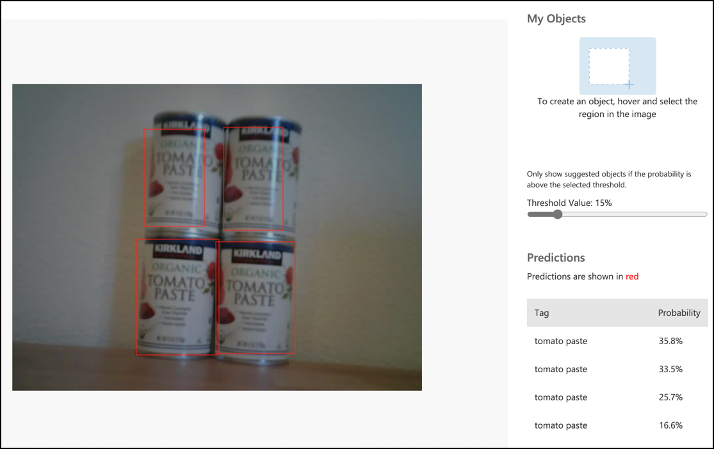

<!--
CO_OP_TRANSLATOR_METADATA:
{
  "original_hash": "4cf1421420a6fab9ab4f2c391bd523b7",
  "translation_date": "2025-08-27T20:32:01+00:00",
  "source_file": "5-retail/lessons/2-check-stock-device/wio-terminal-object-detector.md",
  "language_code": "nl"
}
-->
# Roep je objectdetector aan vanaf je IoT-apparaat - Wio Terminal

Zodra je objectdetector is gepubliceerd, kan deze worden gebruikt vanaf je IoT-apparaat.

## Kopieer het project van de beeldclassifier

Het grootste deel van je voorraaddetector is hetzelfde als de beeldclassifier die je in een eerdere les hebt gemaakt.

### Taak - kopieer het project van de beeldclassifier

1. Verbind je ArduCam met je Wio Terminal, volgens de stappen uit [les 2 van het productieproject](../../../4-manufacturing/lessons/2-check-fruit-from-device/wio-terminal-camera.md#task---connect-the-camera).

    Je kunt er ook voor kiezen om de camera in een vaste positie te plaatsen, bijvoorbeeld door de kabel over een doos of blik te hangen, of de camera met dubbelzijdige tape aan een doos te bevestigen.

1. Maak een gloednieuw Wio Terminal-project met PlatformIO. Noem dit project `stock-counter`.

1. Herhaal de stappen uit [les 2 van het productieproject](../../../4-manufacturing/lessons/2-check-fruit-from-device/README.md#task---capture-an-image-using-an-iot-device) om beelden van de camera vast te leggen.

1. Herhaal de stappen uit [les 2 van het productieproject](../../../4-manufacturing/lessons/2-check-fruit-from-device/README.md#task---classify-images-from-your-iot-device) om de beeldclassifier aan te roepen. Het grootste deel van deze code zal opnieuw worden gebruikt om objecten te detecteren.

## Wijzig de code van een classifier naar een objectdetector

De code die je gebruikte om beelden te classificeren lijkt erg op de code om objecten te detecteren. Het belangrijkste verschil is de URL die wordt aangeroepen, die je hebt verkregen van Custom Vision, en de resultaten van de oproep.

### Taak - wijzig de code van een classifier naar een objectdetector

1. Voeg de volgende include-richtlijn toe aan de bovenkant van het bestand `main.cpp`:

    ```cpp
    #include <vector>
    ```

1. Hernoem de functie `classifyImage` naar `detectStock`, zowel de naam van de functie als de oproep in de functie `buttonPressed`.

1. Verklaar boven de functie `detectStock` een drempelwaarde om detecties met een lage waarschijnlijkheid eruit te filteren:

    ```cpp
    const float threshold = 0.3f;
    ```

    In tegenstelling tot een beeldclassifier die slechts één resultaat per tag retourneert, zal de objectdetector meerdere resultaten retourneren, dus alle met een lage waarschijnlijkheid moeten worden gefilterd.

1. Verklaar boven de functie `detectStock` een functie om de voorspellingen te verwerken:

    ```cpp
    void processPredictions(std::vector<JsonVariant> &predictions)
    {
        for(JsonVariant prediction : predictions)
        {
            String tag = prediction["tagName"].as<String>();
            float probability = prediction["probability"].as<float>();
    
            char buff[32];
            sprintf(buff, "%s:\t%.2f%%", tag.c_str(), probability * 100.0);
            Serial.println(buff);
        }
    }
    ```

    Deze functie neemt een lijst met voorspellingen en print ze naar de seriële monitor.

1. Vervang in de functie `detectStock` de inhoud van de `for`-lus die door de voorspellingen loopt met het volgende:

    ```cpp
    std::vector<JsonVariant> passed_predictions;

    for(JsonVariant prediction : predictions) 
    {
        float probability = prediction["probability"].as<float>();
        if (probability > threshold)
        {
            passed_predictions.push_back(prediction);
        }
    }

    processPredictions(passed_predictions);
    ```

    Deze lus doorloopt de voorspellingen en vergelijkt de waarschijnlijkheid met de drempelwaarde. Alle voorspellingen met een waarschijnlijkheid hoger dan de drempelwaarde worden toegevoegd aan een `list` en doorgegeven aan de functie `processPredictions`.

1. Upload en voer je code uit. Richt de camera op objecten op een plank en druk op de C-knop. Je zult de uitvoer zien in de seriële monitor:

    ```output
    Connecting to WiFi..
    Connected!
    Image captured
    Image read to buffer with length 17416
    tomato paste:   35.84%
    tomato paste:   35.87%
    tomato paste:   34.11%
    tomato paste:   35.16%
    ```

    > 💁 Mogelijk moet je de `threshold` aanpassen naar een geschikte waarde voor jouw beelden.

    Je zult het beeld dat is genomen kunnen zien, en deze waarden in het tabblad **Predictions** in Custom Vision.

    

> 💁 Je kunt deze code vinden in de map [code-detect/wio-terminal](../../../../../5-retail/lessons/2-check-stock-device/code-detect/wio-terminal).

😀 Je voorraadtelprogramma was een succes!

---

**Disclaimer**:  
Dit document is vertaald met behulp van de AI-vertalingsservice [Co-op Translator](https://github.com/Azure/co-op-translator). Hoewel we streven naar nauwkeurigheid, dient u zich ervan bewust te zijn dat geautomatiseerde vertalingen fouten of onnauwkeurigheden kunnen bevatten. Het originele document in zijn oorspronkelijke taal moet worden beschouwd als de gezaghebbende bron. Voor cruciale informatie wordt professionele menselijke vertaling aanbevolen. Wij zijn niet aansprakelijk voor eventuele misverstanden of verkeerde interpretaties die voortvloeien uit het gebruik van deze vertaling.