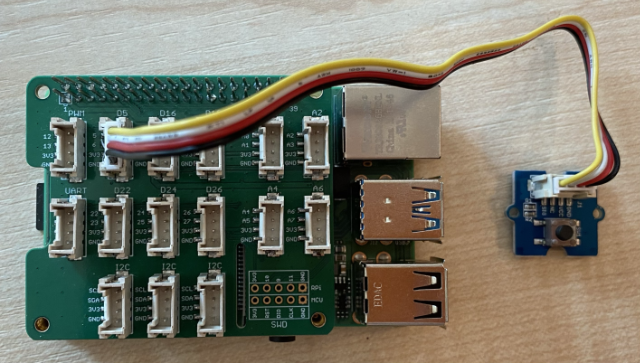

<!--
CO_OP_TRANSLATOR_METADATA:
{
  "original_hash": "0ac0afcfb40cb5970ef4cb74f01c32e9",
  "translation_date": "2025-08-27T22:32:35+00:00",
  "source_file": "6-consumer/lessons/1-speech-recognition/pi-audio.md",
  "language_code": "nl"
}
-->
# Audio opnemen - Raspberry Pi

In dit deel van de les ga je code schrijven om audio op te nemen met je Raspberry Pi. De audio-opname wordt bediend met een knop.

## Hardware

De Raspberry Pi heeft een knop nodig om de audio-opname te bedienen.

De knop die je gaat gebruiken is een Grove-knop. Dit is een digitale sensor die een signaal aan of uit zet. Deze knoppen kunnen worden geconfigureerd om een hoog signaal te sturen wanneer de knop wordt ingedrukt, en laag wanneer dat niet het geval is, of laag wanneer ingedrukt en hoog wanneer niet.

Als je een ReSpeaker 2-Mics Pi HAT als microfoon gebruikt, hoef je geen knop aan te sluiten, omdat deze HAT al een knop heeft. Ga door naar de volgende sectie.

### Sluit de knop aan

De knop kan worden aangesloten op de Grove Base Hat.

#### Taak - sluit de knop aan


1. Steek één uiteinde van een Grove-kabel in de aansluiting op de knopmodule. Het past maar op één manier.

1. Met de Raspberry Pi uitgeschakeld, sluit je het andere uiteinde van de Grove-kabel aan op de digitale aansluiting gemarkeerd als **D5** op de Grove Base Hat die op de Pi is aangesloten. Deze aansluiting is de tweede van links, op de rij aansluitingen naast de GPIO-pinnen.



## Audio opnemen

Je kunt audio opnemen van de microfoon met behulp van Python-code.

### Taak - audio opnemen

1. Zet de Pi aan en wacht tot deze is opgestart.

1. Start VS Code, direct op de Pi of via de Remote SSH-extensie.

1. Het PyAudio Pip-pakket bevat functies om audio op te nemen en af te spelen. Dit pakket is afhankelijk van enkele audiobibliotheken die eerst moeten worden geïnstalleerd. Voer de volgende opdrachten uit in de terminal om deze te installeren:

    ```sh
    sudo apt update
    sudo apt install libportaudio0 libportaudio2 libportaudiocpp0 portaudio19-dev libasound2-plugins --yes 
    ```

1. Installeer het PyAudio Pip-pakket.

    ```sh
    pip3 install pyaudio
    ```

1. Maak een nieuwe map genaamd `smart-timer` en voeg een bestand genaamd `app.py` toe aan deze map.

1. Voeg de volgende imports toe aan de bovenkant van dit bestand:

    ```python
    import io
    import pyaudio
    import time
    import wave
    
    from grove.factory import Factory
    ```

    Hiermee worden de `pyaudio`-module, enkele standaard Python-modules om wave-bestanden te verwerken, en de `grove.factory`-module geïmporteerd om een `Factory` te gebruiken voor het maken van een knopklasse.

1. Voeg hieronder code toe om een Grove-knop te maken.

    Als je de ReSpeaker 2-Mics Pi HAT gebruikt, gebruik dan de volgende code:

    ```python
    # The button on the ReSpeaker 2-Mics Pi HAT
    button = Factory.getButton("GPIO-LOW", 17)
    ```

    Hiermee wordt een knop gemaakt op poort **D17**, de poort waarop de knop van de ReSpeaker 2-Mics Pi HAT is aangesloten. Deze knop is ingesteld om een laag signaal te sturen wanneer ingedrukt.

    Als je de ReSpeaker 2-Mics Pi HAT niet gebruikt, maar een Grove-knop die is aangesloten op de Base Hat, gebruik dan deze code:

    ```python
    button = Factory.getButton("GPIO-HIGH", 5)
    ```

    Hiermee wordt een knop gemaakt op poort **D5**, die is ingesteld om een hoog signaal te sturen wanneer ingedrukt.

1. Maak hieronder een instantie van de PyAudio-klasse om audio te verwerken:

    ```python
    audio = pyaudio.PyAudio()
    ```

1. Declareer het hardwarekaartnummer voor de microfoon en luidspreker. Dit is het nummer van de kaart dat je eerder in deze les hebt gevonden door `arecord -l` en `aplay -l` uit te voeren.

    ```python
    microphone_card_number = <microphone card number>
    speaker_card_number = <speaker card number>
    ```

    Vervang `<microphone card number>` door het nummer van de microfoonkaart.

    Vervang `<speaker card number>` door het nummer van de luidsprekerkaart, hetzelfde nummer dat je hebt ingesteld in het `alsa.conf`-bestand.

1. Declareer hieronder de sample rate die je wilt gebruiken voor de audio-opname en -weergave. Je moet deze mogelijk aanpassen afhankelijk van de hardware die je gebruikt.

    ```python
    rate = 48000 #48KHz
    ```

    Als je later bij het uitvoeren van deze code fouten krijgt met betrekking tot de sample rate, verander deze waarde dan naar `44100` of `16000`. Hoe hoger de waarde, hoe beter de geluidskwaliteit.

1. Maak hieronder een nieuwe functie genaamd `capture_audio`. Deze wordt aangeroepen om audio op te nemen van de microfoon:

    ```python
    def capture_audio():
    ```

1. Voeg binnen deze functie het volgende toe om de audio op te nemen:

    ```python
    stream = audio.open(format = pyaudio.paInt16,
                        rate = rate,
                        channels = 1, 
                        input_device_index = microphone_card_number,
                        input = True,
                        frames_per_buffer = 4096)

    frames = []

    while button.is_pressed():
        frames.append(stream.read(4096))

    stream.stop_stream()
    stream.close()
    ```

    Deze code opent een audio-invoerstroom met behulp van het PyAudio-object. Deze stroom neemt audio op van de microfoon bij 16KHz, waarbij het wordt vastgelegd in buffers van 4096 bytes groot.

    De code loopt vervolgens door terwijl de Grove-knop is ingedrukt, waarbij deze 4096-byte buffers telkens in een array worden gelezen.

    > 💁 Je kunt meer lezen over de opties die worden doorgegeven aan de `open`-methode in de [PyAudio-documentatie](https://people.csail.mit.edu/hubert/pyaudio/docs/).

    Zodra de knop wordt losgelaten, wordt de stroom gestopt en gesloten.

1. Voeg het volgende toe aan het einde van deze functie:

    ```python
    wav_buffer = io.BytesIO()
    with wave.open(wav_buffer, 'wb') as wavefile:
        wavefile.setnchannels(1)
        wavefile.setsampwidth(audio.get_sample_size(pyaudio.paInt16))
        wavefile.setframerate(rate)
        wavefile.writeframes(b''.join(frames))
        wav_buffer.seek(0)

    return wav_buffer
    ```

    Deze code maakt een binair buffer en schrijft alle opgenomen audio erin als een [WAV-bestand](https://wikipedia.org/wiki/WAV). Dit is een standaard manier om ongecomprimeerde audio naar een bestand te schrijven. Deze buffer wordt vervolgens geretourneerd.

1. Voeg de volgende `play_audio`-functie toe om de audiobuffer af te spelen:

    ```python
    def play_audio(buffer):
        stream = audio.open(format = pyaudio.paInt16,
                            rate = rate,
                            channels = 1,
                            output_device_index = speaker_card_number,
                            output = True)
    
        with wave.open(buffer, 'rb') as wf:
            data = wf.readframes(4096)
    
            while len(data) > 0:
                stream.write(data)
                data = wf.readframes(4096)
    
            stream.close()
    ```

    Deze functie opent een andere audiostroom, dit keer voor uitvoer - om de audio af te spelen. Het gebruikt dezelfde instellingen als de invoerstroom. De buffer wordt vervolgens geopend als een wave-bestand en in 4096-byte stukken naar de uitvoerstroom geschreven, waardoor de audio wordt afgespeeld. De stroom wordt daarna gesloten.

1. Voeg de volgende code toe onder de `capture_audio`-functie om te blijven herhalen totdat de knop wordt ingedrukt. Zodra de knop wordt ingedrukt, wordt de audio opgenomen en vervolgens afgespeeld.

    ```python
    while True:
        while not button.is_pressed():
            time.sleep(.1)
        
        buffer = capture_audio()
        play_audio(buffer)
    ```

1. Voer de code uit. Druk op de knop en spreek in de microfoon. Laat de knop los wanneer je klaar bent, en je hoort de opname.

    Je kunt enkele ALSA-fouten krijgen wanneer de PyAudio-instantie wordt gemaakt. Dit komt door configuratie op de Pi voor audiodevices die je niet hebt. Je kunt deze fouten negeren.

    ```output
    pi@raspberrypi:~/smart-timer $ python3 app.py 
    ALSA lib pcm.c:2565:(snd_pcm_open_noupdate) Unknown PCM cards.pcm.front
    ALSA lib pcm.c:2565:(snd_pcm_open_noupdate) Unknown PCM cards.pcm.rear
    ALSA lib pcm.c:2565:(snd_pcm_open_noupdate) Unknown PCM cards.pcm.center_lfe
    ALSA lib pcm.c:2565:(snd_pcm_open_noupdate) Unknown PCM cards.pcm.side
    ```

    Als je de volgende fout krijgt:

    ```output
    OSError: [Errno -9997] Invalid sample rate
    ```

    verander dan de `rate` naar 44100 of 16000.

> 💁 Je kunt deze code vinden in de [code-record/pi](../../../../../6-consumer/lessons/1-speech-recognition/code-record/pi) map.

😀 Je audiorecorderprogramma is een succes!

---

**Disclaimer**:  
Dit document is vertaald met behulp van de AI-vertalingsservice [Co-op Translator](https://github.com/Azure/co-op-translator). Hoewel we streven naar nauwkeurigheid, dient u zich ervan bewust te zijn dat geautomatiseerde vertalingen fouten of onnauwkeurigheden kunnen bevatten. Het originele document in zijn oorspronkelijke taal moet worden beschouwd als de gezaghebbende bron. Voor cruciale informatie wordt professionele menselijke vertaling aanbevolen. Wij zijn niet aansprakelijk voor eventuele misverstanden of verkeerde interpretaties die voortvloeien uit het gebruik van deze vertaling.