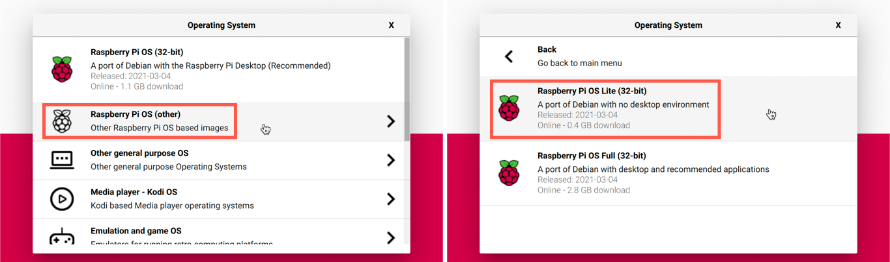
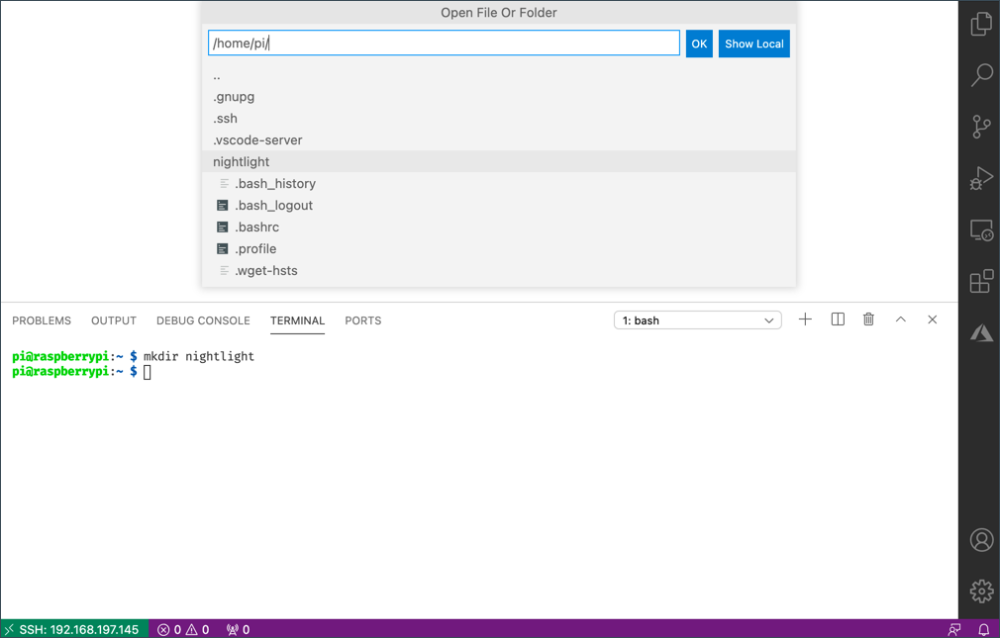

<!--
CO_OP_TRANSLATOR_METADATA:
{
  "original_hash": "8ff0d0a1d29832bb896b9c103b69a452",
  "translation_date": "2025-08-27T22:00:33+00:00",
  "source_file": "1-getting-started/lessons/1-introduction-to-iot/pi.md",
  "language_code": "no"
}
-->
# Raspberry Pi

[Raspberry Pi](https://raspberrypi.org) er en datamaskin på ett enkelt kretskort. Du kan legge til sensorer og aktuatorer ved hjelp av et bredt spekter av enheter og økosystemer. I disse leksjonene bruker vi et maskinvareøkosystem kalt [Grove](https://www.seeedstudio.com/category/Grove-c-1003.html). Du vil programmere din Pi og få tilgang til Grove-sensorene ved hjelp av Python.


## Oppsett

Hvis du bruker en Raspberry Pi som din IoT-maskinvare, har du to valg – du kan jobbe gjennom alle disse leksjonene og programmere direkte på Pi-en, eller du kan koble til en "headless" Pi eksternt og programmere fra datamaskinen din.

Før du begynner, må du også koble Grove Base Hat til din Pi.

### Oppgave - oppsett

Installer Grove Base Hat på din Pi og konfigurer Pi-en.

1. Koble Grove Base Hat til din Pi. Kontakten på hatten passer over alle GPIO-pinnene på Pi-en, og skyves helt ned for å sitte godt på plass. Den dekker Pi-en.

    

1. Bestem deg for hvordan du vil programmere din Pi, og gå til den relevante delen nedenfor:

    * [Jobb direkte på din Pi](../../../../../1-getting-started/lessons/1-introduction-to-iot)
    * [Fjernstyring for å programmere Pi-en](../../../../../1-getting-started/lessons/1-introduction-to-iot)

### Jobb direkte på din Pi

Hvis du ønsker å jobbe direkte på din Pi, kan du bruke skrivebordsversjonen av Raspberry Pi OS og installere alle verktøyene du trenger.

#### Oppgave - jobb direkte på din Pi

Konfigurer din Pi for utvikling.

1. Følg instruksjonene i [Raspberry Pi oppsettsveiledning](https://projects.raspberrypi.org/en/projects/raspberry-pi-setting-up) for å sette opp din Pi, koble den til et tastatur/mus/skjerm, koble den til ditt WiFi- eller Ethernet-nettverk, og oppdatere programvaren.

For å programmere Pi-en ved hjelp av Grove-sensorer og aktuatorer, må du installere en editor for å skrive enhetskoden, samt ulike biblioteker og verktøy som samhandler med Grove-maskinvaren.

1. Når Pi-en har startet på nytt, åpne Terminal ved å klikke på **Terminal**-ikonet i toppmenyen, eller velg *Meny -> Tilbehør -> Terminal*.

1. Kjør følgende kommando for å sikre at OS og installert programvare er oppdatert:

    ```sh
    sudo apt update && sudo apt full-upgrade --yes
    ```

1. Kjør følgende kommandoer for å installere alle nødvendige biblioteker for Grove-maskinvaren:

    ```sh
    sudo apt install git python3-dev python3-pip --yes

    git clone https://github.com/Seeed-Studio/grove.py
    cd grove.py
    sudo pip3 install .

    sudo raspi-config nonint do_i2c 0
    ```

    Dette starter med å installere Git, sammen med Pip for å installere Python-pakker.

    En av de kraftige funksjonene i Python er muligheten til å installere [Pip-pakker](https://pypi.org) – dette er pakker med kode skrevet av andre og publisert på Internett. Du kan installere en Pip-pakke på datamaskinen din med én kommando, og deretter bruke den pakken i koden din.

    Seeed Grove Python-pakkene må installeres fra kildekoden. Disse kommandoene kloner repoet som inneholder kildekoden for denne pakken, og installerer den deretter lokalt.

    > 💁 Som standard, når du installerer en pakke, er den tilgjengelig overalt på datamaskinen din, og dette kan føre til problemer med pakkeversjoner – for eksempel at én applikasjon avhenger av én versjon av en pakke som slutter å fungere når du installerer en ny versjon for en annen applikasjon. For å unngå dette problemet kan du bruke et [Python-virtuelt miljø](https://docs.python.org/3/library/venv.html), som i hovedsak er en kopi av Python i en dedikert mappe. Når du installerer Pip-pakker, blir de installert bare i den mappen. Du vil ikke bruke virtuelle miljøer når du bruker din Pi. Grove-installasjonsskriptet installerer Grove Python-pakkene globalt, så for å bruke et virtuelt miljø må du sette opp et virtuelt miljø og deretter manuelt installere Grove-pakkene på nytt i det miljøet. Det er enklere å bare bruke globale pakker, spesielt siden mange Pi-utviklere vil flashe et rent SD-kort for hvert prosjekt.

    Til slutt aktiveres I<sup>2</sup>C-grensesnittet.

1. Start Pi-en på nytt enten ved å bruke menyen eller ved å kjøre følgende kommando i Terminal:

    ```sh
    sudo reboot
    ```

1. Når Pi-en har startet på nytt, åpne Terminal igjen og kjør følgende kommando for å installere [Visual Studio Code (VS Code)](https://code.visualstudio.com?WT.mc_id=academic-17441-jabenn) – dette er editoren du vil bruke til å skrive enhetskoden din i Python.

    ```sh
    sudo apt install code
    ```

    Når dette er installert, vil VS Code være tilgjengelig fra toppmenyen.

    > 💁 Du står fritt til å bruke hvilken som helst Python-IDE eller editor for disse leksjonene hvis du har et foretrukket verktøy, men leksjonene vil gi instruksjoner basert på bruk av VS Code.

1. Installer Pylance. Dette er en utvidelse for VS Code som gir støtte for Python-språket. Se [Pylance-utvidelsesdokumentasjonen](https://marketplace.visualstudio.com/items?WT.mc_id=academic-17441-jabenn&itemName=ms-python.vscode-pylance) for instruksjoner om hvordan du installerer denne utvidelsen i VS Code.

### Fjernstyring for å programmere Pi-en

I stedet for å programmere direkte på Pi-en, kan den kjøre "headless", det vil si uten å være koblet til tastatur/mus/skjerm. Du kan konfigurere og programmere den fra datamaskinen din ved hjelp av Visual Studio Code.

#### Sett opp Pi OS

For å programmere eksternt må Pi OS installeres på et SD-kort.

##### Oppgave - sett opp Pi OS

Konfigurer et headless Pi OS.

1. Last ned **Raspberry Pi Imager** fra [Raspberry Pi OS-programvaresiden](https://www.raspberrypi.org/software/) og installer den.

1. Sett inn et SD-kort i datamaskinen din, bruk en adapter om nødvendig.

1. Start Raspberry Pi Imager.

1. Fra Raspberry Pi Imager, velg **CHOOSE OS**-knappen, og velg deretter *Raspberry Pi OS (Other)*, etterfulgt av *Raspberry Pi OS Lite (32-bit)*.

    

    > 💁 Raspberry Pi OS Lite er en versjon av Raspberry Pi OS som ikke har skrivebordsgrensesnittet eller verktøy basert på brukergrensesnitt. Disse er ikke nødvendige for en headless Pi og gjør installasjonen mindre og oppstartstiden raskere.

1. Velg **CHOOSE STORAGE**-knappen, og velg deretter SD-kortet ditt.

1. Start **Avanserte alternativer** ved å trykke `Ctrl+Shift+X`. Disse alternativene lar deg forhåndskonfigurere Raspberry Pi OS før det skrives til SD-kortet.

    1. Merk av for **Enable SSH**, og sett et passord for brukeren `pi`. Dette er passordet du vil bruke for å logge inn på Pi-en senere.

    1. Hvis du planlegger å koble til Pi-en via WiFi, merk av for **Configure WiFi**, og skriv inn WiFi-SSID og passordet ditt, samt velg WiFi-landet ditt. Du trenger ikke gjøre dette hvis du bruker en Ethernet-kabel. Sørg for at nettverket du kobler til er det samme som datamaskinen din er på.

    1. Merk av for **Set locale settings**, og sett landet og tidssonen din.

    1. Velg **SAVE**-knappen.

1. Velg **WRITE**-knappen for å skrive OS til SD-kortet. Hvis du bruker macOS, vil du bli bedt om å oppgi passordet ditt, da verktøyet som skriver diskbilder krever privilegert tilgang.

OS vil bli skrevet til SD-kortet, og når det er fullført, vil kortet bli matet ut av operativsystemet, og du vil bli varslet. Fjern SD-kortet fra datamaskinen, sett det inn i Pi-en, slå på Pi-en og vent i omtrent 2 minutter for at den skal starte opp riktig.

#### Koble til Pi-en

Neste steg er å få tilgang til Pi-en eksternt. Dette kan gjøres ved hjelp av `ssh`, som er tilgjengelig på macOS, Linux og nyere versjoner av Windows.

##### Oppgave - koble til Pi-en

Få tilgang til Pi-en eksternt.

1. Start en Terminal eller Kommandolinje, og skriv inn følgende kommando for å koble til Pi-en:

    ```sh
    ssh pi@raspberrypi.local
    ```

    Hvis du bruker en eldre versjon av Windows som ikke har `ssh` installert, kan du bruke OpenSSH. Du finner installasjonsinstruksjonene i [OpenSSH-installasjonsdokumentasjonen](https://docs.microsoft.com//windows-server/administration/openssh/openssh_install_firstuse?WT.mc_id=academic-17441-jabenn).

1. Dette skal koble deg til Pi-en og be om passordet.

    Å kunne finne datamaskiner på nettverket ditt ved å bruke `<hostname>.local` er en relativt ny funksjon i Linux og Windows. Hvis du bruker Linux eller Windows og får feil om at vertsnavnet ikke blir funnet, må du installere ekstra programvare for å aktivere ZeroConf-nettverk (også referert til av Apple som Bonjour):

    1. Hvis du bruker Linux, installer Avahi ved å bruke følgende kommando:

        ```sh
        sudo apt-get install avahi-daemon
        ```

    1. Hvis du bruker Windows, er den enkleste måten å aktivere ZeroConf på å installere [Bonjour Print Services for Windows](http://support.apple.com/kb/DL999). Du kan også installere [iTunes for Windows](https://www.apple.com/itunes/download/) for å få en nyere versjon av verktøyet (som ikke er tilgjengelig som en frittstående versjon).

    > 💁 Hvis du ikke kan koble til ved hjelp av `raspberrypi.local`, kan du bruke IP-adressen til Pi-en. Se [Raspberry Pi IP-adressedokumentasjon](https://www.raspberrypi.org/documentation/remote-access/ip-address.md) for instruksjoner om flere måter å finne IP-adressen på.

1. Skriv inn passordet du satte i Raspberry Pi Imager Avanserte Alternativer.

#### Konfigurer programvare på Pi-en

Når du er koblet til Pi-en, må du sørge for at operativsystemet er oppdatert, og installere ulike biblioteker og verktøy som samhandler med Grove-maskinvaren.

##### Oppgave - konfigurer programvare på Pi-en

Konfigurer den installerte programvaren på Pi-en og installer Grove-bibliotekene.

1. Fra din `ssh`-økt, kjør følgende kommando for å oppdatere og deretter starte Pi-en på nytt:

    ```sh
    sudo apt update && sudo apt full-upgrade --yes && sudo reboot
    ```

    Pi-en vil bli oppdatert og starte på nytt. `ssh`-økten vil avsluttes når Pi-en starter på nytt, så vent i omtrent 30 sekunder og koble til igjen.

1. Fra den gjenopprettede `ssh`-økten, kjør følgende kommandoer for å installere alle nødvendige biblioteker for Grove-maskinvaren:

    ```sh
    sudo apt install git python3-dev python3-pip --yes

    git clone https://github.com/Seeed-Studio/grove.py
    cd grove.py
    sudo pip3 install .

    sudo raspi-config nonint do_i2c 0
    ```

    Dette starter med å installere Git, sammen med Pip for å installere Python-pakker.

    En av de kraftige funksjonene i Python er muligheten til å installere [Pip-pakker](https://pypi.org) – dette er pakker med kode skrevet av andre og publisert på Internett. Du kan installere en Pip-pakke på datamaskinen din med én kommando, og deretter bruke den pakken i koden din.

    Seeed Grove Python-pakkene må installeres fra kildekoden. Disse kommandoene kloner repoet som inneholder kildekoden for denne pakken, og installerer den deretter lokalt.

    > 💁 Som standard, når du installerer en pakke, er den tilgjengelig overalt på datamaskinen din, og dette kan føre til problemer med pakkeversjoner – for eksempel at én applikasjon avhenger av én versjon av en pakke som slutter å fungere når du installerer en ny versjon for en annen applikasjon. For å unngå dette problemet kan du bruke et [Python-virtuelt miljø](https://docs.python.org/3/library/venv.html), som i hovedsak er en kopi av Python i en dedikert mappe. Når du installerer Pip-pakker, blir de installert bare i den mappen. Du vil ikke bruke virtuelle miljøer når du bruker din Pi. Grove-installasjonsskriptet installerer Grove Python-pakkene globalt, så for å bruke et virtuelt miljø må du sette opp et virtuelt miljø og deretter manuelt installere Grove-pakkene på nytt i det miljøet. Det er enklere å bare bruke globale pakker, spesielt siden mange Pi-utviklere vil flashe et rent SD-kort for hvert prosjekt.

    Til slutt aktiveres I<sup>2</sup>C-grensesnittet.

1. Start Pi-en på nytt ved å kjøre følgende kommando:

    ```sh
    sudo reboot
    ```

    `ssh`-økten vil avsluttes når Pi-en starter på nytt. Det er ikke nødvendig å koble til igjen.

#### Konfigurer VS Code for fjernstyring

Når Pi-en er konfigurert, kan du koble til den ved hjelp av Visual Studio Code (VS Code) fra datamaskinen din – dette er en gratis utviklerteksteditor du vil bruke til å skrive enhetskoden din i Python.

##### Oppgave - konfigurer VS Code for fjernstyring

Installer nødvendig programvare og koble til Pi-en eksternt.

1. Installer VS Code på datamaskinen din ved å følge [VS Code-dokumentasjonen](https://code.visualstudio.com?WT.mc_id=academic-17441-jabenn).

1. Følg instruksjonene i [VS Code Remote Development using SSH-dokumentasjonen](https://code.visualstudio.com/docs/remote/ssh?WT.mc_id=academic-17441-jabenn) for å installere de nødvendige komponentene.

1. Følg de samme instruksjonene for å koble VS Code til Pi-en.

1. Når du er koblet til, følg instruksjonene for [håndtering av utvidelser](https://code.visualstudio.com/docs/remote/ssh#_managing-extensions?WT.mc_id=academic-17441-jabenn) for å installere [Pylance-utvidelsen](https://marketplace.visualstudio.com/items?WT.mc_id=academic-17441-jabenn&itemName=ms-python.vscode-pylance) eksternt på Pi-en.

## Hei verden
Det er tradisjonelt når man starter med et nytt programmeringsspråk eller teknologi å lage en 'Hello World'-applikasjon - en liten applikasjon som viser tekst som `"Hello World"` for å bekrefte at alle verktøyene er riktig konfigurert.

Hello World-appen for Pi vil sikre at du har Python og Visual Studio Code installert korrekt.

Denne appen vil ligge i en mappe kalt `nightlight`, og den vil bli gjenbrukt med forskjellig kode i senere deler av denne oppgaven for å bygge nattlys-applikasjonen.

### Oppgave - hello world

Lag Hello World-appen.

1. Start VS Code, enten direkte på Pi, eller på datamaskinen din og koblet til Pi ved hjelp av Remote SSH-utvidelsen.

1. Start VS Code-terminalen ved å velge *Terminal -> New Terminal*, eller ved å trykke `` CTRL+` ``. Den vil åpne i hjemmekatalogen til `pi`-brukeren.

1. Kjør følgende kommandoer for å opprette en mappe for koden din, og opprett en Python-fil kalt `app.py` inne i den mappen:

    ```sh
    mkdir nightlight
    cd nightlight
    touch app.py
    ```

1. Åpne denne mappen i VS Code ved å velge *File -> Open...* og velge *nightlight*-mappen, deretter velg **OK**.

    

1. Åpne `app.py`-filen fra VS Code-utforskeren og legg til følgende kode:

    ```python
    print('Hello World!')
    ```

    `print`-funksjonen skriver det som sendes til den ut i konsollen.

1. Fra VS Code-terminalen, kjør følgende for å kjøre Python-appen din:

    ```sh
    python app.py
    ```

    > 💁 Du må kanskje eksplisitt bruke `python3` for å kjøre denne koden hvis du har Python 2 installert i tillegg til Python 3 (den nyeste versjonen). Hvis du har Python 2 installert, vil `python` bruke Python 2 i stedet for Python 3. Som standard har de nyeste versjonene av Raspberry Pi OS kun Python 3 installert.

    Følgende utdata vil vises i terminalen:

    ```output
    pi@raspberrypi:~/nightlight $ python3 app.py
    Hello World!
    ```

> 💁 Du finner denne koden i [code/pi](../../../../../1-getting-started/lessons/1-introduction-to-iot/code/pi)-mappen.

😀 Din 'Hello World'-program var en suksess!

---

**Ansvarsfraskrivelse**:  
Dette dokumentet er oversatt ved hjelp av AI-oversettelsestjenesten [Co-op Translator](https://github.com/Azure/co-op-translator). Selv om vi streber etter nøyaktighet, vær oppmerksom på at automatiserte oversettelser kan inneholde feil eller unøyaktigheter. Det originale dokumentet på sitt opprinnelige språk bør anses som den autoritative kilden. For kritisk informasjon anbefales profesjonell menneskelig oversettelse. Vi er ikke ansvarlige for misforståelser eller feiltolkninger som oppstår ved bruk av denne oversettelsen.