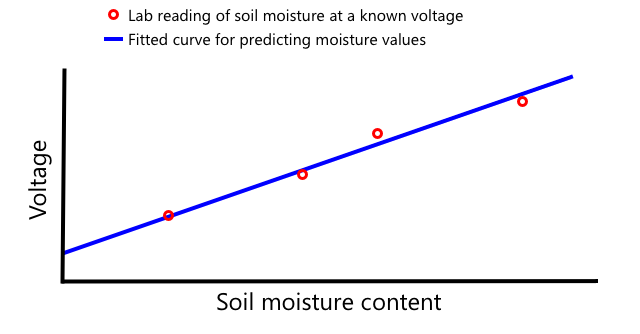

<!--
CO_OP_TRANSLATOR_METADATA:
{
  "original_hash": "4fb20273d299dc8d07a8f06c9cd0cdd9",
  "translation_date": "2025-08-27T22:26:31+00:00",
  "source_file": "2-farm/lessons/2-detect-soil-moisture/README.md",
  "language_code": "no"
}
-->
C, uttalt *I-kvadrat-C*, er en fler-kontroller, fler-periferiprotokoll, der alle tilkoblede enheter kan fungere som enten kontroller eller periferiutstyr som kommuniserer over I²C-bussen (navnet på et kommunikasjonssystem som overfører data). Data sendes som adresserte pakker, hvor hver pakke inneholder adressen til den tilkoblede enheten den er ment for.

> 💁 Denne modellen ble tidligere referert til som master/slave, men denne terminologien er i ferd med å fases ut på grunn av dens assosiasjon med slaveri. [Open Source Hardware Association har vedtatt kontroller/periferi](https://www.oshwa.org/a-resolution-to-redefine-spi-signal-names/), men du kan fortsatt se referanser til den gamle terminologien.

Enheter har en adresse som brukes når de kobler seg til I²C-bussen, og denne er vanligvis hardkodet på enheten. For eksempel har hver type Grove-sensor fra Seeed samme adresse, så alle lyssensorer har samme adresse, alle knappene har samme adresse som er forskjellig fra lyssensorens adresse. Noen enheter har muligheter for å endre adressen, ved å endre jumper-innstillinger eller lodde sammen pinner.

I²C har en buss som består av 2 hovedledninger, sammen med 2 strømledninger:

| Ledning | Navn | Beskrivelse |
| ---- | --------- | ----------- |
| SDA | Serial Data | Denne ledningen brukes til å sende data mellom enheter. |
| SCL | Serial Clock | Denne ledningen sender et klokkesignal med en hastighet satt av kontrolleren. |
| VCC | Voltage common collector | Strømforsyningen for enhetene. Denne er koblet til SDA- og SCL-ledningene for å gi strøm via en pull-up-motstand som slår av signalet når ingen enhet er kontroller. |
| GND | Ground | Gir en felles jord for den elektriske kretsen. |

For å sende data vil én enhet utstede en startbetingelse for å vise at den er klar til å sende data. Den vil deretter bli kontrolleren. Kontrolleren sender deretter adressen til enheten den ønsker å kommunisere med, sammen med informasjon om den ønsker å lese eller skrive data. Etter at dataene er overført, sender kontrolleren en stoppbetingelse for å indikere at den er ferdig. Etter dette kan en annen enhet bli kontroller og sende eller motta data.

I2C har hastighetsbegrensninger, med tre forskjellige moduser som kjører på faste hastigheter. Den raskeste er High Speed-modus med en maksimal hastighet på 3,4 Mbps (megabit per sekund), selv om svært få enheter støtter denne hastigheten. Raspberry Pi, for eksempel, er begrenset til fast-modus på 400 Kbps (kilobit per sekund). Standard-modus kjører på 100 Kbps.

> 💠Hvis du bruker en Raspberry Pi med en Grove Base hat som din IoT-maskinvare, vil du kunne se flere I2C-porter på kortet som du kan bruke til å kommunisere med I2C-sensorer. Analoge Grove-sensorer bruker også I2C med en ADC for å sende analoge verdier som digitale data, så lyssensoren du brukte simulerte en analog pinne, med verdien sendt over I2C ettersom Raspberry Pi kun støtter digitale pinner.

### Universal asynkron mottaker-sender (UART)

UART innebærer fysisk kretsløp som lar to enheter kommunisere. Hver enhet har to kommunikasjons-pinner - transmit (Tx) og receive (Rx), der Tx-pinnen på den første enheten er koblet til Rx-pinnen på den andre, og Tx-pinnen på den andre enheten er koblet til Rx-pinnen på den første. Dette gjør det mulig å sende data i begge retninger.

* Enhet 1 sender data fra sin Tx-pinne, som mottas av enhet 2 på dens Rx-pinne
* Enhet 1 mottar data på sin Rx-pinne som sendes av enhet 2 fra dens Tx-pinne

> 🎓 Data sendes én bit om gangen, og dette kalles *seriell* kommunikasjon. De fleste operativsystemer og mikrokontrollere har *serielle porter*, det vil si tilkoblinger som kan sende og motta serielle data som er tilgjengelige for koden din.

UART-enheter har en [baud rate](https://wikipedia.org/wiki/Symbol_rate) (også kjent som symbolhastighet), som er hastigheten data sendes og mottas i biter per sekund. En vanlig baud rate er 9 600, som betyr at 9 600 biter (0-er og 1-ere) av data sendes hvert sekund.

UART bruker start- og stoppbiter - det vil si at den sender en startbit for å indikere at den er i ferd med å sende en byte (8 biter) med data, og deretter en stoppbit etter at den har sendt de 8 bitene.

UART-hastighet avhenger av maskinvaren, men selv de raskeste implementasjonene overstiger ikke 6,5 Mbps (megabit per sekund, eller millioner av biter, 0 eller 1, sendt per sekund).

Du kan bruke UART over GPIO-pinner - du kan sette én pinne som Tx og en annen som Rx, og deretter koble disse til en annen enhet.

> 💁 Hvis du bruker en Raspberry Pi med en Grove Base hat som din IoT-maskinvare, vil du kunne se en UART-port på kortet som du kan bruke til å kommunisere med sensorer som bruker UART-protokollen.

### Serial Peripheral Interface (SPI)

SPI er designet for kommunikasjon over korte avstander, for eksempel på en mikrokontroller for å snakke med en lagringsenhet som flashminne. Det er basert på en kontroller/perifer-modell med en enkelt kontroller (vanligvis prosessoren til IoT-enheten) som interagerer med flere perifere enheter. Kontrolleren styrer alt ved å velge en perifer enhet og sende eller be om data.

> 💠Akkurat som I2C, er begrepene kontroller og perifer nylige endringer, så du kan se de eldre begrepene fortsatt brukt.

SPI-kontrollere bruker tre ledninger, sammen med én ekstra ledning per perifer enhet. Perifere enheter bruker fire ledninger. Disse ledningene er:

| Ledning | Navn | Beskrivelse |
| ---- | --------- | ----------- |
| COPI | Controller Output, Peripheral Input | Denne ledningen brukes til å sende data fra kontrolleren til den perifere enheten. |
| CIPO | Controller Input, Peripheral Output | Denne ledningen brukes til å sende data fra den perifere enheten til kontrolleren. |
| SCLK | Serial Clock | Denne ledningen sender et klokkesignal med en hastighet satt av kontrolleren. |
| CS   | Chip Select | Kontrolleren har flere ledninger, én per perifer enhet, og hver ledning kobles til CS-ledningen på den tilsvarende perifere enheten. |

CS-ledningen brukes til å aktivere én perifer enhet om gangen, og kommuniserer over COPI- og CIPO-ledningene. Når kontrolleren trenger å bytte perifer enhet, deaktiverer den CS-ledningen koblet til den aktive perifere enheten, og aktiverer deretter ledningen koblet til den perifere enheten den vil kommunisere med neste gang.

SPI er *full-dupleks*, noe som betyr at kontrolleren kan sende og motta data samtidig fra samme perifere enhet ved hjelp av COPI- og CIPO-ledningene. SPI bruker et klokkesignal på SCLK-ledningen for å holde enhetene synkronisert, så i motsetning til å sende direkte over UART trenger den ikke start- og stoppbiter.

Det er ingen definerte hastighetsbegrensninger for SPI, med implementasjoner som ofte kan overføre flere megabyte med data per sekund.

IoT-utviklersett støtter ofte SPI over noen av GPIO-pinnene. For eksempel kan du på en Raspberry Pi bruke GPIO-pinnene 19, 21, 23, 24 og 26 for SPI.

### Trådløst

Noen sensorer kan kommunisere over standard trådløse protokoller, som Bluetooth (hovedsakelig Bluetooth Low Energy, eller BLE), LoRaWAN (en **Lo**ng **Ra**nge lavenergiprotokoll), eller WiFi. Disse gjør det mulig for fjernsensorer som ikke er fysisk koblet til en IoT-enhet.

Et eksempel er kommersielle jordfuktighetssensorer. Disse måler jordfuktighet i et felt, og sender deretter dataene over LoRaWAN til en hub-enhet, som behandler dataene eller sender dem over Internett. Dette gjør det mulig for sensoren å være langt unna IoT-enheten som administrerer dataene, og reduserer strømforbruket og behovet for store WiFi-nettverk eller lange kabler.

BLE er populært for avanserte sensorer som treningssporere som bæres på håndleddet. Disse kombinerer flere sensorer og sender sensordataene til en IoT-enhet, som telefonen din, via BLE.

✅ Har du noen Bluetooth-sensorer på deg, i huset ditt eller på skolen din? Disse kan inkludere temperatursensorer, bevegelsessensorer, enhetssporere og treningsenheter.

En populær måte for kommersielle enheter å koble til er Zigbee. Zigbee bruker WiFi for å danne mesh-nettverk mellom enheter, der hver enhet kobles til så mange nærliggende enheter som mulig, og danner et stort antall forbindelser som et edderkoppnett. Når én enhet vil sende en melding til Internett, kan den sende den til de nærmeste enhetene, som deretter videresender den til andre nærliggende enheter og så videre, til den når en koordinator og kan sendes til Internett.

> 🐝 Navnet Zigbee refererer til honningbienes dans etter at de kommer tilbake til bikuben.

## Mål fuktighetsnivået i jord

Du kan måle fuktighetsnivået i jord ved hjelp av en jordfuktighetssensor, en IoT-enhet og en potteplante eller en nærliggende jordflekk.

### Oppgave - mål jordfuktighet

Arbeid gjennom den relevante veiledningen for å måle jordfuktighet ved hjelp av din IoT-enhet:

* [Arduino - Wio Terminal](wio-terminal-soil-moisture.md)
* [Enkeltkortdatamaskin - Raspberry Pi](pi-soil-moisture.md)
* [Enkeltkortdatamaskin - Virtuell enhet](virtual-device-soil-moisture.md)

## Sensorkalibrering

Sensorer er avhengige av å måle elektriske egenskaper som motstand eller kapasitans.

> 🎓 Motstand, målt i ohm (Ω), er hvor mye motstand det er mot den elektriske strømmen som går gjennom noe. Når en spenning påføres et materiale, avhenger mengden strøm som passerer gjennom det av materialets motstand. Du kan lese mer på [Wikipedia-siden om elektrisk motstand](https://wikipedia.org/wiki/Electrical_resistance_and_conductance).

> 🎓 Kapasitans, målt i farad (F), er evnen til en komponent eller krets til å samle og lagre elektrisk energi. Du kan lese mer om kapasitans på [Wikipedia-siden om kapasitans](https://wikipedia.org/wiki/Capacitance).

Disse målingene er ikke alltid nyttige - tenk deg en temperatursensor som gir deg en måling på 22,5 kΩ! I stedet må den målte verdien konverteres til en nyttig enhet ved å kalibreres - det vil si å matche de målte verdiene til den målte mengden for å tillate nye målinger å konverteres til riktig enhet.

Noen sensorer kommer ferdig kalibrert. For eksempel var temperatursensoren du brukte i forrige leksjon allerede kalibrert slik at den kan returnere en temperaturmåling i °C. På fabrikken ville den første sensoren som ble laget bli utsatt for en rekke kjente temperaturer, og motstanden målt. Dette ville deretter bli brukt til å bygge en beregning som kan konvertere fra den målte verdien i Ω (enheten for motstand) til °C.

> 💁 Formelen for å beregne motstand fra temperatur kalles [Steinhart–Hart-ligningen](https://wikipedia.org/wiki/Steinhart–Hart_equation).

### Kalibrering av jordfuktighetssensor

Jordfuktighet måles ved hjelp av gravimetrisk eller volumetrisk vanninnhold.

* Gravimetrisk er vekten av vann i en enhetsvekt av jord målt, som antall kilogram vann per kilogram tørr jord
* Volumetrisk er volumet av vann i en enhetsvolum av jord målt, som antall kubikkmeter vann per kubikkmeter tørr jord

> 🇺🇸 For amerikanere, på grunn av konsistensen i enhetene, kan disse måles i pund i stedet for kilogram eller kubikkfot i stedet for kubikkmeter.

Jordfuktighetssensorer måler elektrisk motstand eller kapasitans - dette varierer ikke bare med jordfuktighet, men også jordtype ettersom komponentene i jorden kan endre dens elektriske egenskaper. Ideelt sett bør sensorer kalibreres - det vil si å ta avlesninger fra sensoren og sammenligne dem med målinger funnet ved hjelp av en mer vitenskapelig tilnærming. For eksempel kan et laboratorium beregne gravimetrisk jordfuktighet ved hjelp av prøver fra et spesifikt felt tatt noen ganger i året, og disse tallene brukes til å kalibrere sensoren, og matche sensoravlesningen til gravimetrisk jordfuktighet.

Grafen ovenfor viser hvordan man kalibrerer en sensor. Spenningen fanges opp for en jordprøve som deretter måles i et laboratorium ved å sammenligne den fuktige vekten med den tørre vekten (ved å måle vekten våt, deretter tørke i en ovn og måle tørr). Når noen få avlesninger er tatt, kan dette plottes på en graf og en linje tilpasses punktene. Denne linjen kan deretter brukes til å konvertere jordfuktighetssensoravlesninger tatt av en IoT-enhet til faktiske jordfuktighetsmålinger.

💁 For resistive jordfuktighetssensorer øker spenningen etter hvert som jordfuktigheten øker. For kapasitive jordfuktighetssensorer synker spenningen etter hvert som jordfuktigheten øker, så grafene for disse vil skrå nedover, ikke oppover.

Grafen ovenfor viser en spenningsavlesning fra en jordfuktighetssensor, og ved å følge den til linjen på grafen kan den faktiske jordfuktigheten beregnes.

Denne tilnærmingen betyr at bonden bare trenger å få noen laboratoriemålinger for et felt, og deretter kan bruke IoT-enheter til å måle jordfuktighet - noe som drastisk reduserer tiden det tar å ta målinger.

---

## 🚀 Utfordring

Resistive og kapasitive jordfuktighetssensorer har en rekke forskjeller. Hva er disse forskjellene, og hvilken type (hvis noen) er best for en bonde å bruke? Endrer dette svaret seg mellom utviklingsland og utviklede land?

## Quiz etter forelesning

[Quiz etter forelesning](https://black-meadow-040d15503.1.azurestaticapps.net/quiz/12)

## Gjennomgang og selvstudium

Les om maskinvaren og protokollene som brukes av sensorer og aktuatorer:

* [GPIO Wikipedia-side](https://wikipedia.org/wiki/General-purpose_input/output)
* [UART Wikipedia-side](https://wikipedia.org/wiki/Universal_asynchronous_receiver-transmitter)
* [SPI Wikipedia-side](https://wikipedia.org/wiki/Serial_Peripheral_Interface)
* [I2C Wikipedia-side](https://wikipedia.org/wiki/I²C)
* [Zigbee Wikipedia-side](https://wikipedia.org/wiki/Zigbee)

## Oppgave

[Kalibrer sensoren din](assignment.md)

---

**Ansvarsfraskrivelse**:  
Dette dokumentet er oversatt ved hjelp av AI-oversettelsestjenesten [Co-op Translator](https://github.com/Azure/co-op-translator). Selv om vi streber etter nøyaktighet, vær oppmerksom på at automatiserte oversettelser kan inneholde feil eller unøyaktigheter. Det originale dokumentet på sitt opprinnelige språk bør anses som den autoritative kilden. For kritisk informasjon anbefales profesjonell menneskelig oversettelse. Vi er ikke ansvarlige for misforståelser eller feiltolkninger som oppstår ved bruk av denne oversettelsen.