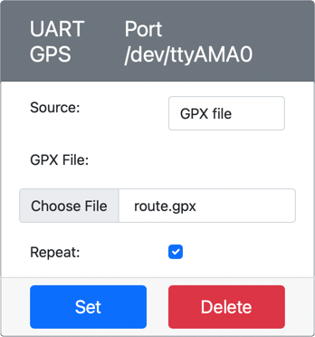

<!--
CO_OP_TRANSLATOR_METADATA:
{
  "original_hash": "64f18a8f8aaa1fef5e7320e0992d8b3a",
  "translation_date": "2025-08-27T21:27:37+00:00",
  "source_file": "3-transport/lessons/1-location-tracking/virtual-device-gps-sensor.md",
  "language_code": "no"
}
-->
# Les GPS-data - Virtuell IoT-maskinvare

I denne delen av leksjonen skal du legge til en GPS-sensor til din virtuelle IoT-enhet og lese verdier fra den.

## Virtuell maskinvare

Den virtuelle IoT-enheten vil bruke en simulert GPS-sensor som er tilgjengelig over UART via en seriel port.

En fysisk GPS-sensor har en antenne som fanger opp radiobølger fra GPS-satellitter og konverterer GPS-signaler til GPS-data. Den virtuelle versjonen simulerer dette ved å la deg enten sette en breddegrad og lengdegrad, sende rå NMEA-setninger, eller laste opp en GPX-fil med flere lokasjoner som kan returneres sekvensielt.

> 🎓 NMEA-setninger vil bli dekket senere i denne leksjonen

### Legg til sensoren i CounterFit

For å bruke en virtuell GPS-sensor må du legge til en i CounterFit-appen.

#### Oppgave - legg til sensoren i CounterFit

Legg til GPS-sensoren i CounterFit-appen.

1. Opprett en ny Python-app på datamaskinen din i en mappe kalt `gps-sensor` med en enkelt fil kalt `app.py` og et Python-virtuelt miljø, og legg til CounterFit pip-pakkene.

    > ⚠️ Du kan referere til [instruksjonene for å opprette og sette opp et CounterFit Python-prosjekt i leksjon 1 hvis nødvendig](../../../1-getting-started/lessons/1-introduction-to-iot/virtual-device.md).

1. Installer en ekstra Pip-pakke for å installere en CounterFit shim som kan kommunisere med UART-baserte sensorer over en seriel tilkobling. Sørg for at du installerer dette fra en terminal med det virtuelle miljøet aktivert.

    ```sh
    pip install counterfit-shims-serial
    ```

1. Sørg for at CounterFit-nettappen kjører.

1. Opprett en GPS-sensor:

    1. I boksen *Create sensor* i *Sensors*-panelet, åpne rullegardinmenyen *Sensor type* og velg *UART GPS*.

    1. La *Port* være satt til */dev/ttyAMA0*.

    1. Velg **Add**-knappen for å opprette GPS-sensoren på porten `/dev/ttyAMA0`.

    

    GPS-sensoren vil bli opprettet og vises i sensorlisten.

    

## Programmer GPS-sensoren

Den virtuelle IoT-enheten kan nå programmeres til å bruke den virtuelle GPS-sensoren.

### Oppgave - programmer GPS-sensoren

Programmer GPS-sensor-appen.

1. Sørg for at `gps-sensor`-appen er åpen i VS Code.

1. Åpne filen `app.py`.

1. Legg til følgende kode øverst i `app.py` for å koble appen til CounterFit:

    ```python
    from counterfit_connection import CounterFitConnection
    CounterFitConnection.init('127.0.0.1', 5000)
    ```

1. Legg til følgende kode under dette for å importere noen nødvendige biblioteker, inkludert biblioteket for CounterFit-serielporten:

    ```python
    import time
    import counterfit_shims_serial
    
    serial = counterfit_shims_serial.Serial('/dev/ttyAMA0')
    ```

    Denne koden importerer `serial`-modulen fra Pip-pakken `counterfit_shims_serial`. Den kobler deretter til serielporten `/dev/ttyAMA0` - dette er adressen til serielporten som den virtuelle GPS-sensoren bruker for sin UART-port.

1. Legg til følgende kode under dette for å lese fra serielporten og skrive verdiene til konsollen:

    ```python
    def print_gps_data(line):
        print(line.rstrip())
    
    while True:
        line = serial.readline().decode('utf-8')
    
        while len(line) > 0:
            print_gps_data(line)
            line = serial.readline().decode('utf-8')
    
        time.sleep(1)
    ```

    En funksjon kalt `print_gps_data` er definert som skriver ut linjen som sendes til den, til konsollen.

    Deretter går koden i en evig løkke, leser så mange tekstlinjer som mulig fra serielporten i hver iterasjon. Den kaller `print_gps_data`-funksjonen for hver linje.

    Etter at all data er lest, sover løkken i 1 sekund før den prøver igjen.

1. Kjør denne koden, og sørg for at du bruker en annen terminal enn den som CounterFit-appen kjører i, slik at CounterFit-appen forblir aktiv.

1. Fra CounterFit-appen, endre verdien til GPS-sensoren. Du kan gjøre dette på en av følgende måter:

    * Sett **Source** til `Lat/Lon`, og angi en spesifikk breddegrad, lengdegrad og antall satellitter brukt for å få GPS-fiksen. Denne verdien vil bare bli sendt én gang, så merk av i **Repeat**-boksen for å få dataene til å gjentas hvert sekund.

      

    * Sett **Source** til `NMEA` og legg til noen NMEA-setninger i tekstboksen. Alle disse verdiene vil bli sendt, med en forsinkelse på 1 sekund før hver ny GGA (posisjonsfiks)-setning kan leses.

      

      Du kan bruke et verktøy som [nmeagen.org](https://www.nmeagen.org) for å generere disse setningene ved å tegne på et kart. Disse verdiene vil bare bli sendt én gang, så merk av i **Repeat**-boksen for å få dataene til å gjentas ett sekund etter at alt er sendt.

    * Sett **Source** til GPX-fil, og last opp en GPX-fil med sporingslokasjoner. Du kan laste ned GPX-filer fra en rekke populære kart- og tur-nettsteder, som [AllTrails](https://www.alltrails.com/). Disse filene inneholder flere GPS-lokasjoner som en rute, og GPS-sensoren vil returnere hver nye lokasjon med 1 sekunds intervall.

      

      Disse verdiene vil bare bli sendt én gang, så merk av i **Repeat**-boksen for å få dataene til å gjentas ett sekund etter at alt er sendt.

    Når du har konfigurert GPS-innstillingene, velg **Set**-knappen for å lagre disse verdiene til sensoren.

1. Du vil se råutdataene fra GPS-sensoren, noe som kan ligne på følgende:

    ```output
    $GNGGA,020604.001,4738.538654,N,12208.341758,W,1,3,,164.7,M,-17.1,M,,*67
    $GNGGA,020604.001,4738.538654,N,12208.341758,W,1,3,,164.7,M,-17.1,M,,*67
    ```

> 💁 Du finner denne koden i [code-gps/virtual-device](../../../../../3-transport/lessons/1-location-tracking/code-gps/virtual-device)-mappen.

😀 GPS-sensorprogrammet ditt var en suksess!

---

**Ansvarsfraskrivelse**:  
Dette dokumentet er oversatt ved hjelp av AI-oversettelsestjenesten [Co-op Translator](https://github.com/Azure/co-op-translator). Selv om vi streber etter nøyaktighet, vær oppmerksom på at automatiserte oversettelser kan inneholde feil eller unøyaktigheter. Det originale dokumentet på sitt opprinnelige språk bør anses som den autoritative kilden. For kritisk informasjon anbefales profesjonell menneskelig oversettelse. Vi er ikke ansvarlige for misforståelser eller feiltolkninger som oppstår ved bruk av denne oversettelsen.