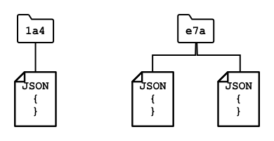

<!--
CO_OP_TRANSLATOR_METADATA:
{
  "original_hash": "e345843ccfeb7261d81500d19c64d476",
  "translation_date": "2025-08-27T21:38:51+00:00",
  "source_file": "3-transport/lessons/2-store-location-data/README.md",
  "language_code": "no"
}
-->
# Lagre lokasjonsdata


> Sketchnote av [Nitya Narasimhan](https://github.com/nitya). Klikk på bildet for en større versjon.

## Quiz før leksjonen

[Quiz før leksjonen](https://black-meadow-040d15503.1.azurestaticapps.net/quiz/23)

## Introduksjon

I forrige leksjon lærte du hvordan du bruker en GPS-sensor for å fange opp lokasjonsdata. For å bruke denne dataen til å visualisere lokasjonen til en lastebil med mat og dens reise, må dataen sendes til en IoT-tjeneste i skyen og deretter lagres et sted.

I denne leksjonen vil du lære om de forskjellige måtene å lagre IoT-data på, og hvordan du kan lagre data fra din IoT-tjeneste ved hjelp av serverløs kode.

I denne leksjonen dekker vi:

* [Strukturert og ustrukturert data](../../../../../3-transport/lessons/2-store-location-data)
* [Send GPS-data til en IoT Hub](../../../../../3-transport/lessons/2-store-location-data)
* [Hot, warm og cold paths](../../../../../3-transport/lessons/2-store-location-data)
* [Håndtere GPS-hendelser med serverløs kode](../../../../../3-transport/lessons/2-store-location-data)
* [Azure Storage Accounts](../../../../../3-transport/lessons/2-store-location-data)
* [Koble serverløs kode til lagring](../../../../../3-transport/lessons/2-store-location-data)

## Strukturert og ustrukturert data

Datasystemer håndterer data, og denne dataen kommer i mange forskjellige former og størrelser. Den kan variere fra enkeltstående tall, til store mengder tekst, til videoer og bilder, og til IoT-data. Data kan vanligvis deles inn i to kategorier - *strukturert* data og *ustrukturert* data.

* **Strukturert data** er data med en veldefinert, rigid struktur som ikke endrer seg og vanligvis kan kartlegges til tabeller med relasjoner. Et eksempel er en persons detaljer, inkludert navn, fødselsdato og adresse.

* **Ustrukturert data** er data uten en veldefinert, rigid struktur, inkludert data som kan endre struktur ofte. Et eksempel er dokumenter som skriftlige dokumenter eller regneark.

✅ Gjør litt research: Kan du komme på noen andre eksempler på strukturert og ustrukturert data?

> 💁 Det finnes også semi-strukturert data som er strukturert, men som ikke passer inn i faste datatabeller.

IoT-data regnes vanligvis som ustrukturert data.

Tenk deg at du legger til IoT-enheter i en flåte av kjøretøy for en stor kommersiell gård. Du kan ønske å bruke forskjellige enheter for forskjellige typer kjøretøy. For eksempel:

* For gårdskjøretøy som traktorer vil du ha GPS-data for å sikre at de arbeider på de riktige jordene.
* For lastebiler som transporterer mat til lager vil du ha GPS-data samt hastighets- og akselerasjonsdata for å sikre at sjåføren kjører trygt, og sjåføridentitet og start/stopp-data for å sikre samsvar med lokale lover om arbeidstider.
* For kjølebiler vil du også ha temperaturdata for å sikre at maten ikke blir for varm eller kald og ødelegges under transport.

Denne dataen kan endre seg konstant. For eksempel, hvis IoT-enheten er i førerhuset på en lastebil, kan dataen den sender endre seg når tilhengeren byttes, for eksempel ved kun å sende temperaturdata når en kjøletilhenger brukes.

✅ Hvilken annen IoT-data kan fanges opp? Tenk på hvilke typer last lastebiler kan frakte, samt vedlikeholdsdata.

Denne dataen varierer fra kjøretøy til kjøretøy, men alt sendes til den samme IoT-tjenesten for behandling. IoT-tjenesten må kunne behandle denne ustrukturerte dataen, lagre den på en måte som gjør det mulig å søke eller analysere, men som fungerer med forskjellige strukturer for denne dataen.

### SQL vs NoSQL lagring

Databaser er tjenester som lar deg lagre og søke i data. Databaser kommer i to typer - SQL og NoSQL.

#### SQL-databaser

De første databasene var Relational Database Management Systems (RDBMS), eller relasjonsdatabaser. Disse er også kjent som SQL-databaser etter Structured Query Language (SQL) som brukes til å legge til, fjerne, oppdatere eller søke i data. Disse databasene består av et skjema - et veldefinert sett med datatabeller, likt et regneark. Hver tabell har flere navngitte kolonner. Når du legger inn data, legger du til en rad i tabellen, og setter verdier inn i hver av kolonnene. Dette holder dataen i en veldig rigid struktur - selv om du kan la kolonner stå tomme, må du legge til en ny kolonne i databasen og fylle verdier for eksisterende rader hvis du vil legge til en ny kolonne. Disse databasene er relasjonelle - i den forstand at én tabell kan ha en relasjon til en annen.


For eksempel, hvis du lagrer en brukers personlige detaljer i en tabell, vil du ha en slags intern unik ID per bruker som brukes i en rad i en tabell som inneholder brukerens navn og adresse. Hvis du deretter vil lagre andre detaljer om den brukeren, som deres kjøp, i en annen tabell, vil du ha én kolonne i den nye tabellen for brukerens ID. Når du ser opp en bruker, kan du bruke deres ID for å hente deres personlige detaljer fra én tabell, og deres kjøp fra en annen.

SQL-databaser er ideelle for å lagre strukturert data, og for når du vil sikre at dataen samsvarer med skjemaet ditt.

✅ Hvis du ikke har brukt SQL før, ta et øyeblikk til å lese om det på [SQL-siden på Wikipedia](https://wikipedia.org/wiki/SQL).

Noen kjente SQL-databaser er Microsoft SQL Server, MySQL og PostgreSQL.

✅ Gjør litt research: Les om noen av disse SQL-databasene og deres funksjoner.

#### NoSQL-databaser

NoSQL-databaser kalles NoSQL fordi de ikke har den samme rigide strukturen som SQL-databaser. De er også kjent som dokumentdatabaser fordi de kan lagre ustrukturert data som dokumenter.

> 💁 Til tross for navnet, lar noen NoSQL-databaser deg bruke SQL for å søke i dataen.



NoSQL-databaser har ikke et forhåndsdefinert skjema som begrenser hvordan data lagres. I stedet kan du sette inn hvilken som helst ustrukturert data, vanligvis ved hjelp av JSON-dokumenter. Disse dokumentene kan organiseres i mapper, lik filer på datamaskinen din. Hvert dokument kan ha forskjellige felt fra andre dokumenter - for eksempel hvis du lagrer IoT-data fra gårdskjøretøyene dine, kan noen ha felt for akselerometer- og hastighetsdata, mens andre kan ha felt for temperaturen i tilhengeren. Hvis du skulle legge til en ny type lastebil, for eksempel en med innebygde vekter for å spore vekten av fraktet mat, kan IoT-enheten din legge til dette nye feltet, og det kan lagres uten endringer i databasen.

Noen kjente NoSQL-databaser inkluderer Azure CosmosDB, MongoDB og CouchDB.

✅ Gjør litt research: Les om noen av disse NoSQL-databasene og deres funksjoner.

I denne leksjonen vil du bruke NoSQL-lagring for å lagre IoT-data.

## Send GPS-data til en IoT Hub

I forrige leksjon fanget du GPS-data fra en GPS-sensor koblet til din IoT-enhet. For å lagre denne IoT-dataen i skyen, må du sende den til en IoT-tjeneste. Nok en gang vil du bruke Azure IoT Hub, den samme IoT-sky-tjenesten du brukte i det forrige prosjektet.


### Oppgave - send GPS-data til en IoT Hub

1. Opprett en ny IoT Hub ved hjelp av gratisnivået.

    > ⚠️ Du kan referere til [instruksjonene for å opprette en IoT Hub fra prosjekt 2, leksjon 4](../../../2-farm/lessons/4-migrate-your-plant-to-the-cloud/README.md#create-an-iot-service-in-the-cloud) hvis nødvendig.

    Husk å opprette en ny ressursgruppe. Navngi den nye ressursgruppen `gps-sensor`, og den nye IoT Hub et unikt navn basert på `gps-sensor`, for eksempel `gps-sensor-<ditt navn>`.

    > 💁 Hvis du fortsatt har din IoT Hub fra det forrige prosjektet, kan du gjenbruke den. Husk å bruke navnet på denne IoT Hub og ressursgruppen den er i når du oppretter andre tjenester.

1. Legg til en ny enhet i IoT Hub. Kall denne enheten `gps-sensor`. Ta tak i tilkoblingsstrengen for enheten.

1. Oppdater enhetskoden din for å sende GPS-data til den nye IoT Hub ved hjelp av tilkoblingsstrengen fra forrige steg.

    > ⚠️ Du kan referere til [instruksjonene for å koble enheten din til IoT fra prosjekt 2, leksjon 4](../../../2-farm/lessons/4-migrate-your-plant-to-the-cloud/README.md#connect-your-device-to-the-iot-service) hvis nødvendig.

1. Når du sender GPS-data, gjør det som JSON i følgende format:

    ```json
    {
        "gps" :
        {
            "lat" : <latitude>,
            "lon" : <longitude>
        }
    }
    ```

1. Send GPS-data hvert minutt slik at du ikke bruker opp din daglige meldingskvote.

Hvis du bruker Wio Terminal, husk å legge til alle nødvendige biblioteker og sette tiden ved hjelp av en NTP-server. Koden din må også sikre at den har lest all data fra seriellporten før den sender GPS-lokasjonen, ved å bruke eksisterende kode fra forrige leksjon. Bruk følgende kode for å konstruere JSON-dokumentet:

```cpp
DynamicJsonDocument doc(1024);
doc["gps"]["lat"] = gps.location.lat();
doc["gps"]["lon"] = gps.location.lng();
```

Hvis du bruker en virtuell IoT-enhet, husk å installere alle nødvendige biblioteker ved hjelp av et virtuelt miljø.

For både Raspberry Pi og virtuell IoT-enhet, bruk eksisterende kode fra forrige leksjon for å hente bredde- og lengdegradverdier, og send dem i riktig JSON-format med følgende kode:

```python
message_json = { "gps" : { "lat":lat, "lon":lon } }
print("Sending telemetry", message_json)
message = Message(json.dumps(message_json))
```

> 💁 Du finner denne koden i [code/wio-terminal](../../../../../3-transport/lessons/2-store-location-data/code/wio-terminal), [code/pi](../../../../../3-transport/lessons/2-store-location-data/code/pi) eller [code/virtual-device](../../../../../3-transport/lessons/2-store-location-data/code/virtual-device)-mappen.

Kjør enhetskoden din og sørg for at meldinger flyter inn i IoT Hub ved hjelp av `az iot hub monitor-events` CLI-kommandoen.

## Hot, warm og cold paths

Data som flyter fra en IoT-enhet til skyen behandles ikke alltid i sanntid. Noen data trenger sanntidsbehandling, andre data kan behandles kort tid senere, og andre data kan behandles mye senere. Flyten av data til forskjellige tjenester som behandler dataen på forskjellige tidspunkter refereres til som hot, warm og cold paths.

### Hot path

Hot path refererer til data som må behandles i sanntid eller nesten sanntid. Du vil bruke hot path-data for varsler, som å få beskjed om at et kjøretøy nærmer seg et lager, eller at temperaturen i en kjølebil er for høy.

For å bruke hot path-data, vil koden din reagere på hendelser så snart de mottas av sky-tjenestene dine.

### Warm path

Warm path refererer til data som kan behandles kort tid etter at den er mottatt, for eksempel for rapportering eller kortsiktig analyse. Du vil bruke warm path-data for daglige rapporter om kjøretøymileage, ved å bruke data samlet inn dagen før.

Warm path-data lagres når den mottas av sky-tjenesten i en form for lagring som kan nås raskt.

### Cold path

Cold path refererer til historisk data, som lagrer data for langtidsbruk som kan behandles når som helst. For eksempel kan du bruke cold path til å få årlige mileage-rapporter for kjøretøy, eller kjøre analyser på ruter for å finne den mest optimale ruten for å redusere drivstoffkostnader.

Cold path-data lagres i datavarehus - databaser designet for å lagre store mengder data som aldri endres og kan søkes raskt og enkelt. Du vil normalt ha en regelmessig jobb i sky-applikasjonen din som kjører på et fast tidspunkt hver dag, uke eller måned for å flytte data fra warm path-lagring til datavarehuset.

✅ Tenk på dataen du har fanget så langt i disse leksjonene. Er det hot, warm eller cold path-data?

## Håndtere GPS-hendelser med serverløs kode

Når data flyter inn i din IoT Hub, kan du skrive serverløs kode for å lytte etter hendelser publisert til Event-Hub-kompatible endepunktet. Dette er warm path - denne dataen vil bli lagret og brukt i neste leksjon for rapportering om reisen.


### Oppgave - håndtere GPS-hendelser med serverløs kode

1. Opprett en Azure Functions-app ved hjelp av Azure Functions CLI. Bruk Python-runtime, og opprett den i en mappe kalt `gps-trigger`, og bruk samme navn for Functions App-prosjektnavnet. Sørg for å opprette et virtuelt miljø for dette.
> ⚠️ Du kan referere til [instruksjonene for å opprette et Azure Functions-prosjekt fra prosjekt 2, leksjon 5](../../../2-farm/lessons/5-migrate-application-to-the-cloud/README.md#create-a-serverless-application) hvis nødvendig.
1. Legg til en IoT Hub-hendelsesutløser som bruker IoT Hubs Event Hub-kompatible endepunkt.

    > ⚠️ Du kan se [instruksjonene for å opprette en IoT Hub-hendelsesutløser fra prosjekt 2, leksjon 5](../../../2-farm/lessons/5-migrate-application-to-the-cloud/README.md#create-an-iot-hub-event-trigger) hvis nødvendig.

1. Sett inn tilkoblingsstrengen for Event Hub-kompatible endepunkt i filen `local.settings.json`, og bruk nøkkelen for denne oppføringen i filen `function.json`.

1. Bruk Azurite-appen som en lokal lagringsemulator.

1. Kjør funksjonsappen din for å sikre at den mottar hendelser fra GPS-enheten din. Sørg for at IoT-enheten din også kjører og sender GPS-data.

    ```output
    Python EventHub trigger processed an event: {"gps": {"lat": 47.73481, "lon": -122.25701}}
    ```

## Azure Storage Accounts


Azure Storage Accounts er en allsidig lagringstjeneste som kan lagre data på ulike måter. Du kan lagre data som blobber, i køer, i tabeller eller som filer, og alt dette samtidig.

### Blob-lagring

Ordet *Blob* betyr binære store objekter, men har blitt et begrep for ustrukturert data. Du kan lagre hvilken som helst data i blob-lagring, fra JSON-dokumenter som inneholder IoT-data, til bilde- og filmfiler. Blob-lagring har konseptet *containere*, navngitte "bøtter" der du kan lagre data, lik tabeller i en relasjonsdatabase. Disse containerne kan ha én eller flere mapper for å lagre blobber, og hver mappe kan inneholde andre mapper, lik hvordan filer lagres på harddisken din.

Du vil bruke blob-lagring i denne leksjonen for å lagre IoT-data.

✅ Gjør litt research: Les om [Azure Blob Storage](https://docs.microsoft.com/azure/storage/blobs/storage-blobs-overview?WT.mc_id=academic-17441-jabenn)

### Tabell-lagring

Tabell-lagring lar deg lagre semi-strukturert data. Tabell-lagring er faktisk en NoSQL-database, så den krever ikke et forhåndsdefinert sett med tabeller, men den er designet for å lagre data i én eller flere tabeller, med unike nøkler for å definere hver rad.

✅ Gjør litt research: Les om [Azure Table Storage](https://docs.microsoft.com/azure/storage/tables/table-storage-overview?WT.mc_id=academic-17441-jabenn)

### Kø-lagring

Kø-lagring lar deg lagre meldinger på opptil 64KB i størrelse i en kø. Du kan legge til meldinger bakerst i køen og lese dem fra fronten. Køer lagrer meldinger på ubestemt tid så lenge det er lagringsplass tilgjengelig, noe som gjør det mulig å lagre meldinger over lang tid og lese dem når det trengs. For eksempel, hvis du ønsker å kjøre en månedlig jobb for å behandle GPS-data, kan du legge dem til i en kø hver dag i en måned, og deretter behandle alle meldingene på slutten av måneden.

✅ Gjør litt research: Les om [Azure Queue Storage](https://docs.microsoft.com/azure/storage/queues/storage-queues-introduction?WT.mc_id=academic-17441-jabenn)

### Fil-lagring

Fil-lagring er lagring av filer i skyen, og alle apper eller enheter kan koble til ved hjelp av industristandardprotokoller. Du kan skrive filer til fil-lagring og deretter montere det som en disk på PC-en eller Mac-en din.

✅ Gjør litt research: Les om [Azure File Storage](https://docs.microsoft.com/azure/storage/files/storage-files-introduction?WT.mc_id=academic-17441-jabenn)

## Koble serverløs kode til lagring

Funksjonsappen din må nå kobles til blob-lagring for å lagre meldingene fra IoT Hub. Det finnes to måter å gjøre dette på:

* Inne i funksjonskoden, koble til blob-lagring ved hjelp av blob-lagringens Python SDK og skriv dataene som blobber.
* Bruk en utdatafunksjonsbinding for å binde returverdien av funksjonen til blob-lagring og få blobben lagret automatisk.

I denne leksjonen vil du bruke Python SDK for å se hvordan du kan interagere med blob-lagring.


Dataene vil bli lagret som en JSON-blob med følgende format:

```json
{
    "device_id": <device_id>,
    "timestamp" : <time>,
    "gps" :
    {
        "lat" : <latitude>,
        "lon" : <longitude>
    }
}
```

### Oppgave - koble serverløs kode til lagring

1. Opprett en Azure Storage-konto. Gi den et navn som `gps<ditt navn>`.

    > ⚠️ Du kan se [instruksjonene for å opprette en lagringskonto fra prosjekt 2, leksjon 5](../../../2-farm/lessons/5-migrate-application-to-the-cloud/README.md#task---create-the-cloud-resources) hvis nødvendig.

    Hvis du fortsatt har en lagringskonto fra forrige prosjekt, kan du gjenbruke denne.

    > 💁 Du vil kunne bruke den samme lagringskontoen til å distribuere Azure Functions-appen din senere i denne leksjonen.

1. Kjør følgende kommando for å hente tilkoblingsstrengen for lagringskontoen:

    ```sh
    az storage account show-connection-string --output table \
                                              --name <storage_name>
    ```

    Erstatt `<storage_name>` med navnet på lagringskontoen du opprettet i forrige steg.

1. Legg til en ny oppføring i filen `local.settings.json` for tilkoblingsstrengen til lagringskontoen, ved å bruke verdien fra forrige steg. Gi den navnet `STORAGE_CONNECTION_STRING`.

1. Legg til følgende i filen `requirements.txt` for å installere Azure Storage Pip-pakkene:

    ```sh
    azure-storage-blob
    ```

    Installer pakkene fra denne filen i ditt virtuelle miljø.

    > Hvis du får en feil, oppgrader Pip-versjonen i ditt virtuelle miljø til den nyeste versjonen med følgende kommando, og prøv igjen:
    >
    > ```sh
    > pip install --upgrade pip
    > ```

1. I filen `__init__.py` for `iot-hub-trigger`, legg til følgende importsetninger:

    ```python
    import json
    import os
    import uuid
    from azure.storage.blob import BlobServiceClient, PublicAccess
    ```

    Modulen `json` fra systemet vil bli brukt til å lese og skrive JSON, modulen `os` fra systemet vil bli brukt til å lese tilkoblingsstrengen, og modulen `uuid` fra systemet vil bli brukt til å generere en unik ID for GPS-avlesningen.

    Pakken `azure.storage.blob` inneholder Python SDK for å jobbe med blob-lagring.

1. Før metoden `main`, legg til følgende hjelpefunksjon:

    ```python
    def get_or_create_container(name):
        connection_str = os.environ['STORAGE_CONNECTION_STRING']
        blob_service_client = BlobServiceClient.from_connection_string(connection_str)
    
        for container in blob_service_client.list_containers():
            if container.name == name:
                return blob_service_client.get_container_client(container.name)
        
        return blob_service_client.create_container(name, public_access=PublicAccess.Container)
    ```

    Python blob SDK har ikke en hjelpemetode for å opprette en container hvis den ikke eksisterer. Denne koden vil laste tilkoblingsstrengen fra filen `local.settings.json` (eller Application Settings når den er distribuert til skyen), deretter opprette en `BlobServiceClient`-klasse fra denne for å interagere med blob-lagringskontoen. Den går deretter gjennom alle containerne for blob-lagringskontoen, ser etter en med det angitte navnet - hvis den finner en, vil den returnere en `ContainerClient`-klasse som kan interagere med containeren for å opprette blobber. Hvis den ikke finner en, opprettes containeren, og klienten for den nye containeren returneres.

    Når den nye containeren opprettes, gis offentlig tilgang for å kunne spørre etter blobber i containeren. Dette vil bli brukt i neste leksjon for å visualisere GPS-data på et kart.

1. I motsetning til jordfuktighet, ønsker vi med denne koden å lagre hver hendelse, så legg til følgende kode inne i `for event in events:`-løkken i `main`-funksjonen, under `logging`-setningen:

    ```python
    device_id = event.iothub_metadata['connection-device-id']
    blob_name = f'{device_id}/{str(uuid.uuid1())}.json'
    ```

    Denne koden henter enhets-ID-en fra hendelsesmetadataene og bruker den til å opprette et blob-navn. Blobber kan lagres i mapper, og enhets-ID-en vil bli brukt som mappenavn, slik at hver enhet vil ha alle sine GPS-hendelser i én mappe. Blob-navnet er denne mappen, etterfulgt av et dokumentnavn, separert med skråstreker, lik Linux- og macOS-stier (lik Windows også, men Windows bruker bakstreker). Dokumentnavnet er en unik ID generert ved hjelp av Python-modulen `uuid`, med filtypen `json`.

    For eksempel, for enhets-ID-en `gps-sensor`, kan blob-navnet være `gps-sensor/a9487ac2-b9cf-11eb-b5cd-1e00621e3648.json`.

1. Legg til følgende kode under dette:

    ```python
    container_client = get_or_create_container('gps-data')
    blob = container_client.get_blob_client(blob_name)
    ```

    Denne koden henter containerklienten ved hjelp av hjelpeklassen `get_or_create_container`, og deretter henter en blob-klientobjekt ved hjelp av blob-navnet. Disse blob-klientene kan referere til eksisterende blobber, eller som i dette tilfellet, til nye blobber.

1. Legg til følgende kode etter dette:

    ```python
    event_body = json.loads(event.get_body().decode('utf-8'))
    blob_body = {
        'device_id' : device_id,
        'timestamp' : event.iothub_metadata['enqueuedtime'],
        'gps': event_body['gps']
    }
    ```

    Dette bygger innholdet til blobben som skal skrives til blob-lagring. Det er et JSON-dokument som inneholder enhets-ID-en, tidspunktet telemetrien ble sendt til IoT Hub, og GPS-koordinatene fra telemetrien.

    > 💁 Det er viktig å bruke tidspunktet meldingen ble lagt i kø (enqueued time) i stedet for nåværende tidspunkt for å få tidspunktet meldingen ble sendt. Den kan ha ligget på huben en stund før den ble hentet opp hvis Functions-appen ikke kjører.

1. Legg til følgende under denne koden:

    ```python
    logging.info(f'Writing blob to {blob_name} - {blob_body}')
    blob.upload_blob(json.dumps(blob_body).encode('utf-8'))
    ```

    Denne koden logger at en blob er i ferd med å bli skrevet med detaljene sine, og deretter laster opp blob-innholdet som innholdet til den nye blobben.

1. Kjør Functions-appen. Du vil se blobber bli skrevet for alle GPS-hendelsene i utdataene:

    ```output
    [2021-05-21T01:31:14.325Z] Python EventHub trigger processed an event: {"gps": {"lat": 47.73092, "lon": -122.26206}}
    ...
    [2021-05-21T01:31:14.351Z] Writing blob to gps-sensor/4b6089fe-ba8d-11eb-bc7b-1e00621e3648.json - {'device_id': 'gps-sensor', 'timestamp': '2021-05-21T00:57:53.878Z', 'gps': {'lat': 47.73092, 'lon': -122.26206}}
    ```

    > 💁 Sørg for at du ikke kjører IoT Hub-hendelsesmonitoren samtidig.

> 💁 Du finner denne koden i [code/functions](../../../../../3-transport/lessons/2-store-location-data/code/functions)-mappen.

### Oppgave - verifiser de opplastede blobbene

1. For å se de opprettede blobbene kan du enten bruke [Azure Storage Explorer](https://azure.microsoft.com/features/storage-explorer/?WT.mc_id=academic-17441-jabenn), et gratis verktøy som lar deg se og administrere lagringskontoene dine, eller fra CLI.

    1. For å bruke CLI, må du først ha en kontonøkkel. Kjør følgende kommando for å hente denne nøkkelen:

        ```sh
        az storage account keys list --output table \
                                     --account-name <storage_name>
        ```

        Erstatt `<storage_name>` med navnet på lagringskontoen.

        Kopier verdien av `key1`.

    1. Kjør følgende kommando for å liste opp blobbene i containeren:

        ```sh
        az storage blob list --container-name gps-data \
                             --output table \
                             --account-name <storage_name> \
                             --account-key <key1>
        ```

        Erstatt `<storage_name>` med navnet på lagringskontoen, og `<key1>` med verdien av `key1` du kopierte i forrige steg.

        Dette vil liste opp alle blobbene i containeren:

        ```output
        Name                                                  Blob Type    Blob Tier    Length    Content Type              Last Modified              Snapshot
        ----------------------------------------------------  -----------  -----------  --------  ------------------------  -------------------------  ----------
        gps-sensor/1810d55e-b9cf-11eb-9f5b-1e00621e3648.json  BlockBlob    Hot          45        application/octet-stream  2021-05-21T00:54:27+00:00
        gps-sensor/18293e46-b9cf-11eb-9f5b-1e00621e3648.json  BlockBlob    Hot          45        application/octet-stream  2021-05-21T00:54:28+00:00
        gps-sensor/1844549c-b9cf-11eb-9f5b-1e00621e3648.json  BlockBlob    Hot          45        application/octet-stream  2021-05-21T00:54:28+00:00
        gps-sensor/1894d714-b9cf-11eb-9f5b-1e00621e3648.json  BlockBlob    Hot          45        application/octet-stream  2021-05-21T00:54:28+00:00
        ```

    1. Last ned en av blobbene ved hjelp av følgende kommando:

        ```sh
        az storage blob download --container-name gps-data \
                                 --account-name <storage_name> \
                                 --account-key <key1> \
                                 --name <blob_name> \
                                 --file <file_name>
        ```

        Erstatt `<storage_name>` med navnet på lagringskontoen, og `<key1>` med verdien av `key1` du kopierte i forrige steg.

        Erstatt `<blob_name>` med det fullstendige navnet fra `Name`-kolonnen i utdataene fra forrige steg, inkludert mappenavnet. Erstatt `<file_name>` med navnet på en lokal fil for å lagre blobben til.

    Når den er lastet ned, kan du åpne JSON-filen i VS Code, og du vil se blobben som inneholder GPS-plasseringens detaljer:

    ```json
    {"device_id": "gps-sensor", "timestamp": "2021-05-21T00:57:53.878Z", "gps": {"lat": 47.73092, "lon": -122.26206}}
    ```

### Oppgave - distribuer Functions-appen din til skyen

Nå som Functions-appen din fungerer, kan du distribuere den til skyen.

1. Opprett en ny Azure Functions-app, ved å bruke lagringskontoen du opprettet tidligere. Gi den et navn som `gps-sensor-` og legg til en unik identifikator på slutten, som noen tilfeldige ord eller navnet ditt.

    > ⚠️ Du kan se [instruksjonene for å opprette en Functions-app fra prosjekt 2, leksjon 5](../../../2-farm/lessons/5-migrate-application-to-the-cloud/README.md#task---create-the-cloud-resources) hvis nødvendig.

1. Last opp verdiene `IOT_HUB_CONNECTION_STRING` og `STORAGE_CONNECTION_STRING` til Application Settings.

    > ⚠️ Du kan se [instruksjonene for å laste opp Application Settings fra prosjekt 2, leksjon 5](../../../2-farm/lessons/5-migrate-application-to-the-cloud/README.md#task---upload-your-application-settings) hvis nødvendig.

1. Distribuer din lokale Functions-app til skyen.
> ⚠️ Du kan referere til [instruksjonene for å distribuere din Functions-app fra prosjekt 2, leksjon 5](../../../2-farm/lessons/5-migrate-application-to-the-cloud/README.md#task---deploy-your-functions-app-to-the-cloud) hvis nødvendig.
---

## 🚀 Utfordring

GPS-data er ikke helt nøyaktige, og de registrerte posisjonene kan være feil med noen få meter, eller mer, spesielt i tunneler og områder med høye bygninger.

Tenk på hvordan satellittnavigasjon kan overvinne dette? Hvilke data har din satellittnavigasjon som kan hjelpe den med å gjøre bedre forutsigelser om din posisjon?

## Quiz etter forelesning

[Quiz etter forelesning](https://black-meadow-040d15503.1.azurestaticapps.net/quiz/24)

## Gjennomgang & Selvstudie

* Les om strukturert data på [Data modell-siden på Wikipedia](https://wikipedia.org/wiki/Data_model)
* Les om semi-strukturert data på [Semi-strukturert data-siden på Wikipedia](https://wikipedia.org/wiki/Semi-structured_data)
* Les om ustrukturert data på [Ustrukturert data-siden på Wikipedia](https://wikipedia.org/wiki/Unstructured_data)
* Les mer om Azure Storage og de forskjellige lagringstypene i [Azure Storage-dokumentasjonen](https://docs.microsoft.com/azure/storage/?WT.mc_id=academic-17441-jabenn)

## Oppgave

[Undersøk funksjonsbindinger](assignment.md)

---

**Ansvarsfraskrivelse**:  
Dette dokumentet er oversatt ved hjelp av AI-oversettelsestjenesten [Co-op Translator](https://github.com/Azure/co-op-translator). Selv om vi streber etter nøyaktighet, vær oppmerksom på at automatiserte oversettelser kan inneholde feil eller unøyaktigheter. Det originale dokumentet på sitt opprinnelige språk bør anses som den autoritative kilden. For kritisk informasjon anbefales profesjonell menneskelig oversettelse. Vi er ikke ansvarlige for misforståelser eller feiltolkninger som oppstår ved bruk av denne oversettelsen.