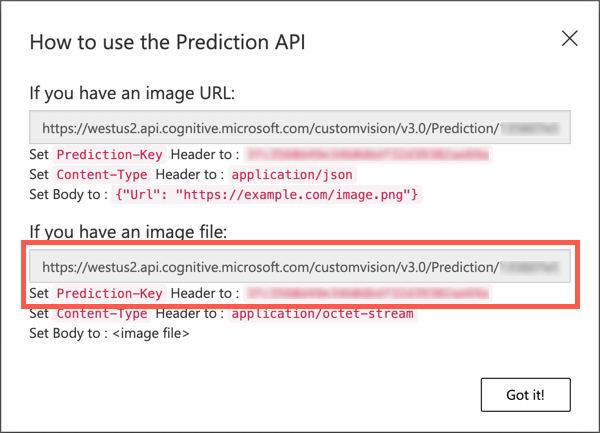

<!--
CO_OP_TRANSLATOR_METADATA:
{
  "original_hash": "557f4ee96b752e0651d2e6e74aa6bd14",
  "translation_date": "2025-08-27T20:41:06+00:00",
  "source_file": "4-manufacturing/lessons/2-check-fruit-from-device/README.md",
  "language_code": "no"
}
-->
# Sjekk fruktkvalitet med en IoT-enhet


> Sketchnote av [Nitya Narasimhan](https://github.com/nitya). Klikk på bildet for en større versjon.

## Quiz før leksjonen

[Quiz før leksjonen](https://black-meadow-040d15503.1.azurestaticapps.net/quiz/31)

## Introduksjon

I forrige leksjon lærte du om bildeklassifisering og hvordan du kan trene dem til å oppdage god og dårlig frukt. For å bruke denne bildeklassifiseringen i en IoT-applikasjon, må du kunne ta et bilde med et kamera og sende dette bildet til skyen for klassifisering.

I denne leksjonen vil du lære om kamerasensorer og hvordan du bruker dem med en IoT-enhet for å ta et bilde. Du vil også lære hvordan du kan bruke bildeklassifiseringen fra din IoT-enhet.

I denne leksjonen dekker vi:

* [Kamerasensorer](../../../../../4-manufacturing/lessons/2-check-fruit-from-device)
* [Ta et bilde med en IoT-enhet](../../../../../4-manufacturing/lessons/2-check-fruit-from-device)
* [Publiser din bildeklassifisering](../../../../../4-manufacturing/lessons/2-check-fruit-from-device)
* [Klassifiser bilder fra din IoT-enhet](../../../../../4-manufacturing/lessons/2-check-fruit-from-device)
* [Forbedre modellen](../../../../../4-manufacturing/lessons/2-check-fruit-from-device)

## Kamerasensorer

Kamerasensorer, som navnet antyder, er kameraer som kan kobles til din IoT-enhet. De kan ta stillbilder eller fange strømmet video. Noen gir rå bildedata, mens andre komprimerer bildedata til en bildefil som JPEG eller PNG. Vanligvis er kameraene som fungerer med IoT-enheter mye mindre og har lavere oppløsning enn det du kanskje er vant til, men du kan få kameraer med høy oppløsning som kan konkurrere med toppmoderne telefoner. Du kan også få ulike utskiftbare linser, oppsett med flere kameraer, infrarøde termiske kameraer eller UV-kameraer.


De fleste kamerasensorer bruker bildesensorer der hver piksel er en fotodiode. En linse fokuserer bildet på bildesensoren, og tusenvis eller millioner av fotodioder registrerer lyset som faller på hver enkelt og lagrer det som pikseldata.

> 💁 Linser inverterer bilder, og kamerasensoren snur deretter bildet tilbake til riktig vei. Det samme skjer i øynene dine - det du ser registreres opp ned på baksiden av øyet, og hjernen din korrigerer det.

> 🎓 Bildesensoren kalles en Active-Pixel Sensor (APS), og den mest populære typen APS er en komplementær metalloksid-halvleder-sensor, eller CMOS. Du har kanskje hørt begrepet CMOS-sensor brukt for kamerasensorer.

Kamerasensorer er digitale sensorer som sender bildedata som digitale data, vanligvis med hjelp av et bibliotek som gir kommunikasjonen. Kameraer kobles til ved hjelp av protokoller som SPI for å sende store mengder data - bilder er betydelig større enn enkeltverdier fra en sensor som en temperatursensor.

✅ Hva er begrensningene rundt bildestørrelse med IoT-enheter? Tenk på begrensningene, spesielt på maskinvare for mikrokontrollere.

## Ta et bilde med en IoT-enhet

Du kan bruke din IoT-enhet til å ta et bilde som skal klassifiseres.

### Oppgave - ta et bilde med en IoT-enhet

Følg den relevante veiledningen for å ta et bilde med din IoT-enhet:

* [Arduino - Wio Terminal](wio-terminal-camera.md)
* [Enkeltkortdatamaskin - Raspberry Pi](pi-camera.md)
* [Enkeltkortdatamaskin - Virtuell enhet](virtual-device-camera.md)

## Publiser din bildeklassifisering

Du trente din bildeklassifisering i forrige leksjon. Før du kan bruke den fra din IoT-enhet, må du publisere modellen.

### Modelliterasjoner

Når modellen din ble trent i forrige leksjon, la du kanskje merke til at fanen **Performance** viser iterasjoner på siden. Når du først trente modellen, ville du ha sett *Iteration 1* under trening. Når du forbedret modellen ved hjelp av prediksjonsbildene, ville du ha sett *Iteration 2* under trening.

Hver gang du trener modellen, får du en ny iterasjon. Dette er en måte å holde oversikt over de forskjellige versjonene av modellen din trent på forskjellige datasett. Når du gjør en **Quick Test**, er det en rullegardinmeny du kan bruke til å velge iterasjonen, slik at du kan sammenligne resultatene på tvers av flere iterasjoner.

Når du er fornøyd med en iterasjon, kan du publisere den for å gjøre den tilgjengelig for bruk fra eksterne applikasjoner. På denne måten kan du ha en publisert versjon som brukes av enhetene dine, deretter jobbe med en ny versjon over flere iterasjoner, og publisere den når du er fornøyd med den.

### Oppgave - publiser en iterasjon

Iterasjoner publiseres fra Custom Vision-portalen.

1. Åpne Custom Vision-portalen på [CustomVision.ai](https://customvision.ai) og logg inn hvis du ikke allerede har den åpen. Deretter åpner du prosjektet ditt `fruit-quality-detector`.

1. Velg fanen **Performance** fra alternativene øverst.

1. Velg den nyeste iterasjonen fra listen *Iterations* på siden.

1. Velg knappen **Publish** for iterasjonen.

    

1. I dialogboksen *Publish Model*, sett *Prediction resource* til ressursen `fruit-quality-detector-prediction` som du opprettet i forrige leksjon. La navnet være `Iteration2`, og velg knappen **Publish**.

1. Når den er publisert, velg knappen **Prediction URL**. Dette vil vise detaljer om prediksjons-API-en, og du vil trenge disse for å bruke modellen fra din IoT-enhet. Den nedre delen er merket *If you have an image file*, og dette er detaljene du trenger. Ta en kopi av URL-en som vises, som vil være noe som:

    ```output
    https://<location>.api.cognitive.microsoft.com/customvision/v3.0/Prediction/<id>/classify/iterations/Iteration2/image
    ```

    Der `<location>` vil være stedet du brukte da du opprettet din Custom Vision-ressurs, og `<id>` vil være en lang ID laget av bokstaver og tall.

    Ta også en kopi av verdien *Prediction-Key*. Dette er en sikker nøkkel som du må sende når du bruker modellen. Bare applikasjoner som sender denne nøkkelen har lov til å bruke modellen, alle andre applikasjoner blir avvist.

    

✅ Når en ny iterasjon publiseres, vil den ha et annet navn. Hvordan tror du at du ville endret iterasjonen en IoT-enhet bruker?

## Klassifiser bilder fra din IoT-enhet

Du kan nå bruke disse tilkoblingsdetaljene til å bruke bildeklassifiseringen fra din IoT-enhet.

### Oppgave - klassifiser bilder fra din IoT-enhet

Følg den relevante veiledningen for å klassifisere bilder ved hjelp av din IoT-enhet:

* [Arduino - Wio Terminal](wio-terminal-classify-image.md)
* [Enkeltkortdatamaskin - Raspberry Pi/Virtual IoT-enhet](single-board-computer-classify-image.md)

## Forbedre modellen

Du kan oppleve at resultatene du får når du bruker kameraet koblet til din IoT-enhet ikke samsvarer med det du forventer. Prediksjonene er ikke alltid like nøyaktige som når du bruker bilder lastet opp fra datamaskinen din. Dette skyldes at modellen ble trent på forskjellige data enn det som brukes for prediksjoner.

For å få de beste resultatene for en bildeklassifisering, vil du trene modellen med bilder som er så like som mulig de bildene som brukes for prediksjoner. Hvis du for eksempel brukte telefonkameraet ditt til å ta bilder for trening, vil bildekvaliteten, skarpheten og fargen være annerledes enn et kamera koblet til en IoT-enhet.


I bildet ovenfor ble bananbildet til venstre tatt med et Raspberry Pi-kamera, mens det til høyre ble tatt av den samme bananen på samme sted med en iPhone. Det er en merkbar forskjell i kvalitet - iPhone-bildet er skarpere, med lysere farger og mer kontrast.

✅ Hva annet kan føre til at bildene tatt av din IoT-enhet gir feil prediksjoner? Tenk på miljøet en IoT-enhet kan brukes i, hvilke faktorer kan påvirke bildet som tas?

For å forbedre modellen kan du trene den på nytt ved hjelp av bildene tatt fra IoT-enheten.

### Oppgave - forbedre modellen

1. Klassifiser flere bilder av både moden og umoden frukt ved hjelp av din IoT-enhet.

1. I Custom Vision-portalen, tren modellen på nytt ved hjelp av bildene på fanen *Predictions*.

    > ⚠️ Du kan referere til [instruksjonene for å trene klassifiseringen på nytt i leksjon 1 hvis nødvendig](../1-train-fruit-detector/README.md#retrain-your-image-classifier).

1. Hvis bildene dine ser veldig forskjellige ut fra de opprinnelige som ble brukt til trening, kan du slette alle de opprinnelige bildene ved å velge dem i fanen *Training Images* og velge knappen **Delete**. For å velge et bilde, flytt markøren over det, og en hake vil vises. Velg den haken for å velge eller fjerne valget av bildet.

1. Tren en ny iterasjon av modellen og publiser den ved hjelp av trinnene ovenfor.

1. Oppdater endepunkt-URL-en i koden din, og kjør appen på nytt.

1. Gjenta disse trinnene til du er fornøyd med resultatene av prediksjonene.

---

## 🚀 Utfordring

Hvor mye påvirker bildekvalitet eller belysning prediksjonen?

Prøv å endre oppløsningen på bildene i enhetskoden din og se om det gjør en forskjell for bildekvaliteten. Prøv også å endre belysningen.

Hvis du skulle lage en produksjonsenhet for salg til gårder eller fabrikker, hvordan ville du sikret at den gir konsistente resultater hele tiden?

## Quiz etter leksjonen

[Quiz etter leksjonen](https://black-meadow-040d15503.1.azurestaticapps.net/quiz/32)

## Gjennomgang og selvstudium

Du trente din Custom Vision-modell ved hjelp av portalen. Dette avhenger av å ha tilgjengelige bilder - og i den virkelige verden kan det hende du ikke kan få treningsdata som samsvarer med det kameraet på enheten din fanger. Du kan omgå dette ved å trene direkte fra enheten din ved hjelp av trenings-API-en, for å trene en modell ved hjelp av bilder tatt fra din IoT-enhet.

* Les om trenings-API-en i [kom i gang med Custom Vision SDK](https://docs.microsoft.com/azure/cognitive-services/custom-vision-service/quickstarts/image-classification?WT.mc_id=academic-17441-jabenn&tabs=visual-studio&pivots=programming-language-python)

## Oppgave

[Reager på klassifiseringsresultater](assignment.md)

---

**Ansvarsfraskrivelse**:  
Dette dokumentet er oversatt ved hjelp av AI-oversettelsestjenesten [Co-op Translator](https://github.com/Azure/co-op-translator). Selv om vi streber etter nøyaktighet, vær oppmerksom på at automatiserte oversettelser kan inneholde feil eller unøyaktigheter. Det originale dokumentet på sitt opprinnelige språk bør anses som den autoritative kilden. For kritisk informasjon anbefales profesjonell menneskelig oversettelse. Vi er ikke ansvarlige for eventuelle misforståelser eller feiltolkninger som oppstår ved bruk av denne oversettelsen.