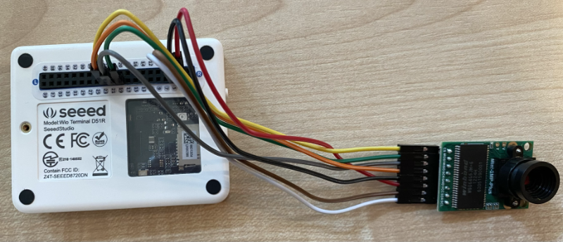

<!--
CO_OP_TRANSLATOR_METADATA:
{
  "original_hash": "160be8c0f558687f6686dca64f10f739",
  "translation_date": "2025-08-27T20:44:57+00:00",
  "source_file": "4-manufacturing/lessons/2-check-fruit-from-device/wio-terminal-camera.md",
  "language_code": "no"
}
-->
# Ta et bilde - Wio Terminal

I denne delen av leksjonen skal du legge til et kamera på din Wio Terminal og ta bilder med det.

## Maskinvare

Wio Terminal trenger et kamera.

Kameraet du skal bruke er en [ArduCam Mini 2MP Plus](https://www.arducam.com/product/arducam-2mp-spi-camera-b0067-arduino/). Dette er et 2 megapiksel kamera basert på OV2640 bildesensoren. Det kommuniserer over en SPI-grensesnitt for å ta bilder og bruker I2C for å konfigurere sensoren.

## Koble til kameraet

ArduCam har ikke en Grove-kontakt, men kobles i stedet til både SPI- og I2C-bussene via GPIO-pinnene på Wio Terminal.

### Oppgave - koble til kameraet

Koble til kameraet.


1. Pinnene på bunnen av ArduCam må kobles til GPIO-pinnene på Wio Terminal. For å gjøre det enklere å finne de riktige pinnene, fest GPIO-pinneklistremerket som følger med Wio Terminal rundt pinnene:

    

1. Bruk hoppkabler for å lage følgende tilkoblinger:

    | ArduCAM pin | Wio Terminal pin | Beskrivelse                             |
    | ----------- | ---------------- | --------------------------------------- |
    | CS          | 24 (SPI_CS)      | SPI Chip Select                         |
    | MOSI        | 19 (SPI_MOSI)    | SPI Controller Output, Peripheral Input |
    | MISO        | 21 (SPI_MISO)    | SPI Controller Input, Peripheral Output |
    | SCK         | 23 (SPI_SCLK)    | SPI Serial Clock                        |
    | GND         | 6 (GND)          | Jord - 0V                               |
    | VCC         | 4 (5V)           | 5V strømforsyning                       |
    | SDA         | 3 (I2C1_SDA)     | I2C Serial Data                         |
    | SCL         | 5 (I2C1_SCL)     | I2C Serial Clock                        |

    

    GND- og VCC-tilkoblingene gir en 5V strømforsyning til ArduCam. Den kjører på 5V, i motsetning til Grove-sensorer som kjører på 3V. Denne strømmen kommer direkte fra USB-C-tilkoblingen som driver enheten.

    > 💁 For SPI-tilkoblingen bruker pinneetikettene på ArduCam og Wio Terminal pinnenavnene i koden fortsatt den gamle navnekonvensjonen. Instruksjonene i denne leksjonen vil bruke den nye navnekonvensjonen, bortsett fra når pinnenavnene brukes i koden.

1. Du kan nå koble Wio Terminal til datamaskinen din.

## Programmer enheten til å koble til kameraet

Wio Terminal kan nå programmeres til å bruke det tilkoblede ArduCAM-kameraet.

### Oppgave - programmer enheten til å koble til kameraet

1. Opprett et helt nytt Wio Terminal-prosjekt ved hjelp av PlatformIO. Kall dette prosjektet `fruit-quality-detector`. Legg til kode i `setup`-funksjonen for å konfigurere seriellporten.

1. Legg til kode for å koble til WiFi, med dine WiFi-legitimasjoner i en fil kalt `config.h`. Ikke glem å legge til de nødvendige bibliotekene i `platformio.ini`-filen.

1. ArduCam-biblioteket er ikke tilgjengelig som et Arduino-bibliotek som kan installeres fra `platformio.ini`-filen. I stedet må det installeres fra kildekoden fra deres GitHub-side. Du kan få dette ved enten:

    * Å klone repoet fra [https://github.com/ArduCAM/Arduino.git](https://github.com/ArduCAM/Arduino.git)
    * Gå til repoet på GitHub på [github.com/ArduCAM/Arduino](https://github.com/ArduCAM/Arduino) og laste ned koden som en zip fra **Code**-knappen

1. Du trenger bare `ArduCAM`-mappen fra denne koden. Kopier hele mappen inn i `lib`-mappen i prosjektet ditt.

    > ⚠️ Hele mappen må kopieres, slik at koden er i `lib/ArduCam`. Ikke bare kopier innholdet i `ArduCam`-mappen inn i `lib`-mappen, kopier hele mappen.

1. ArduCam-bibliotekskoden fungerer for flere typer kameraer. Typen kamera du vil bruke konfigureres ved hjelp av kompilatorflagg - dette holder det bygde biblioteket så lite som mulig ved å fjerne kode for kameraer du ikke bruker. For å konfigurere biblioteket for OV2640-kameraet, legg til følgende på slutten av `platformio.ini`-filen:

    ```ini
    build_flags =
        -DARDUCAM_SHIELD_V2
        -DOV2640_CAM
    ```

    Dette setter 2 kompilatorflagg:

      * `ARDUCAM_SHIELD_V2` for å fortelle biblioteket at kameraet er på et Arduino-kort, kjent som et shield.
      * `OV2640_CAM` for å fortelle biblioteket å bare inkludere kode for OV2640-kameraet.

1. Legg til en header-fil i `src`-mappen kalt `camera.h`. Denne vil inneholde kode for å kommunisere med kameraet. Legg til følgende kode i denne filen:

    ```cpp
    #pragma once
    
    #include <ArduCAM.h>
    #include <Wire.h>
    
    class Camera
    {
    public:
        Camera(int format, int image_size) : _arducam(OV2640, PIN_SPI_SS)
        {
            _format = format;
            _image_size = image_size;
        }
    
        bool init()
        {
            // Reset the CPLD
            _arducam.write_reg(0x07, 0x80);
            delay(100);
    
            _arducam.write_reg(0x07, 0x00);
            delay(100);
    
            // Check if the ArduCAM SPI bus is OK
            _arducam.write_reg(ARDUCHIP_TEST1, 0x55);
            if (_arducam.read_reg(ARDUCHIP_TEST1) != 0x55)
            {
                return false;
            }
                
            // Change MCU mode
            _arducam.set_mode(MCU2LCD_MODE);
    
            uint8_t vid, pid;
    
            // Check if the camera module type is OV2640
            _arducam.wrSensorReg8_8(0xff, 0x01);
            _arducam.rdSensorReg8_8(OV2640_CHIPID_HIGH, &vid);
            _arducam.rdSensorReg8_8(OV2640_CHIPID_LOW, &pid);
            if ((vid != 0x26) && ((pid != 0x41) || (pid != 0x42)))
            {
                return false;
            }
            
            _arducam.set_format(_format);
            _arducam.InitCAM();
            _arducam.OV2640_set_JPEG_size(_image_size);
            _arducam.OV2640_set_Light_Mode(Auto);
            _arducam.OV2640_set_Special_effects(Normal);
            delay(1000);
    
            return true;
        }
    
        void startCapture()
        {
            _arducam.flush_fifo();
            _arducam.clear_fifo_flag();
            _arducam.start_capture();
        }
    
        bool captureReady()
        {
            return _arducam.get_bit(ARDUCHIP_TRIG, CAP_DONE_MASK);
        }
    
        bool readImageToBuffer(byte **buffer, uint32_t &buffer_length)
        {
            if (!captureReady()) return false;
    
            // Get the image file length
            uint32_t length = _arducam.read_fifo_length();
            buffer_length = length;
    
            if (length >= MAX_FIFO_SIZE)
            {
                return false;
            }
            if (length == 0)
            {
                return false;
            }
    
            // create the buffer
            byte *buf = new byte[length];
    
            uint8_t temp = 0, temp_last = 0;
            int i = 0;
            uint32_t buffer_pos = 0;
            bool is_header = false;
    
            _arducam.CS_LOW();
            _arducam.set_fifo_burst();
            
            while (length--)
            {
                temp_last = temp;
                temp = SPI.transfer(0x00);
                //Read JPEG data from FIFO
                if ((temp == 0xD9) && (temp_last == 0xFF)) //If find the end ,break while,
                {
                    buf[buffer_pos] = temp;
    
                    buffer_pos++;
                    i++;
                    
                    _arducam.CS_HIGH();
                }
                if (is_header == true)
                {
                    //Write image data to buffer if not full
                    if (i < 256)
                    {
                        buf[buffer_pos] = temp;
                        buffer_pos++;
                        i++;
                    }
                    else
                    {
                        _arducam.CS_HIGH();
    
                        i = 0;
                        buf[buffer_pos] = temp;
    
                        buffer_pos++;
                        i++;
    
                        _arducam.CS_LOW();
                        _arducam.set_fifo_burst();
                    }
                }
                else if ((temp == 0xD8) & (temp_last == 0xFF))
                {
                    is_header = true;
    
                    buf[buffer_pos] = temp_last;
                    buffer_pos++;
                    i++;
    
                    buf[buffer_pos] = temp;
                    buffer_pos++;
                    i++;
                }
            }
            
            _arducam.clear_fifo_flag();
    
            _arducam.set_format(_format);
            _arducam.InitCAM();
            _arducam.OV2640_set_JPEG_size(_image_size);
    
            // return the buffer
            *buffer = buf;
        }
    
    private:
        ArduCAM _arducam;
        int _format;
        int _image_size;
    };
    ```

    Dette er lavnivåkode som konfigurerer kameraet ved hjelp av ArduCam-bibliotekene og henter bildene når det er nødvendig ved hjelp av SPI-bussen. Denne koden er veldig spesifikk for ArduCam, så du trenger ikke bekymre deg for hvordan den fungerer på dette tidspunktet.

1. I `main.cpp`, legg til følgende kode under de andre `include`-setningene for å inkludere denne nye filen og opprette en instans av kamera-klassen:

    ```cpp
    #include "camera.h"

    Camera camera = Camera(JPEG, OV2640_640x480);
    ```

    Dette oppretter et `Camera` som lagrer bildene som JPEG-er med en oppløsning på 640 x 480. Selv om høyere oppløsninger støttes (opptil 3280x2464), fungerer bildekategoriseringen på mye mindre bilder (227x227), så det er ikke nødvendig å ta og sende større bilder.

1. Legg til følgende kode under dette for å definere en funksjon for å sette opp kameraet:

    ```cpp
    void setupCamera()
    {
        pinMode(PIN_SPI_SS, OUTPUT);
        digitalWrite(PIN_SPI_SS, HIGH);
    
        Wire.begin();
        SPI.begin();
    
        if (!camera.init())
        {
            Serial.println("Error setting up the camera!");
        }
    }
    ```

    Denne `setupCamera`-funksjonen starter med å konfigurere SPI chip select-pinnen (`PIN_SPI_SS`) som høy, noe som gjør Wio Terminal til SPI-kontrolleren. Deretter starter den I2C- og SPI-bussene. Til slutt initialiserer den kamera-klassen som konfigurerer kameraets sensorsettings og sørger for at alt er koblet riktig.

1. Kall denne funksjonen på slutten av `setup`-funksjonen:

    ```cpp
    setupCamera();
    ```

1. Bygg og last opp denne koden, og sjekk utdataene fra den serielle monitoren. Hvis du ser `Error setting up the camera!`, sjekk ledningene for å sikre at alle kabler kobler de riktige pinnene på ArduCam til de riktige GPIO-pinnene på Wio Terminal, og at alle hoppkabler sitter riktig.

## Ta et bilde

Wio Terminal kan nå programmeres til å ta et bilde når en knapp trykkes.

### Oppgave - ta et bilde

1. Mikrokontrollere kjører koden din kontinuerlig, så det er ikke lett å utløse noe som å ta et bilde uten å reagere på en sensor. Wio Terminal har knapper, så kameraet kan settes opp til å utløses av en av knappene. Legg til følgende kode på slutten av `setup`-funksjonen for å konfigurere C-knappen (en av de tre knappene på toppen, den nærmest strømbryteren).

    

    ```cpp
    pinMode(WIO_KEY_C, INPUT_PULLUP);
    ```

    Modusen `INPUT_PULLUP` inverterer i hovedsak et inngangssignal. For eksempel, normalt vil en knapp sende et lavt signal når den ikke er trykket, og et høyt signal når den er trykket. Når den er satt til `INPUT_PULLUP`, sender den et høyt signal når den ikke er trykket, og et lavt signal når den er trykket.

1. Legg til en tom funksjon for å reagere på knappetrykket før `loop`-funksjonen:

    ```cpp
    void buttonPressed()
    {
        
    }
    ```

1. Kall denne funksjonen i `loop`-metoden når knappen trykkes:

    ```cpp
    void loop()
    {
        if (digitalRead(WIO_KEY_C) == LOW)
        {
            buttonPressed();
            delay(2000);
        }
    
        delay(200);
    }
    ```

    Denne nøkkelen sjekker om knappen er trykket. Hvis den er trykket, kalles `buttonPressed`-funksjonen, og loopen forsinkes i 2 sekunder. Dette er for å gi tid til at knappen slippes slik at et langt trykk ikke registreres to ganger.

    > 💁 Knappen på Wio Terminal er satt til `INPUT_PULLUP`, så den sender et høyt signal når den ikke er trykket, og et lavt signal når den er trykket.

1. Legg til følgende kode i `buttonPressed`-funksjonen:

    ```cpp
    camera.startCapture();
 
    while (!camera.captureReady())
        delay(100);

    Serial.println("Image captured");

    byte *buffer;
    uint32_t length;

    if (camera.readImageToBuffer(&buffer, length))
    {
        Serial.print("Image read to buffer with length ");
        Serial.println(length);

        delete(buffer);
    }
    ```

    Denne koden starter kamerafangsten ved å kalle `startCapture`. Kameramaskinvaren fungerer ikke ved å returnere dataene når du ber om det, i stedet sender du en instruksjon for å starte fangsten, og kameraet vil jobbe i bakgrunnen for å ta bildet, konvertere det til en JPEG og lagre det i en lokal buffer på selve kameraet. Kallet `captureReady` sjekker deretter om bildefangsten er ferdig.

    Når fangsten er ferdig, kopieres bildedataene fra bufferen på kameraet til en lokal buffer (en byte-array) med kallet `readImageToBuffer`. Lengden på bufferen sendes deretter til den serielle monitoren.

1. Bygg og last opp denne koden, og sjekk utdataene på den serielle monitoren. Hver gang du trykker på C-knappen, vil et bilde bli tatt, og du vil se bildestørrelsen sendt til den serielle monitoren.

    ```output
    Connecting to WiFi..
    Connected!
    Image captured
    Image read to buffer with length 9224
    Image captured
    Image read to buffer with length 11272
    ```

    Ulike bilder vil ha forskjellige størrelser. De er komprimert som JPEG-er, og størrelsen på en JPEG-fil for en gitt oppløsning avhenger av hva som er i bildet.

> 💁 Du finner denne koden i [code-camera/wio-terminal](../../../../../4-manufacturing/lessons/2-check-fruit-from-device/code-camera/wio-terminal)-mappen.

😀 Du har nå klart å ta bilder med din Wio Terminal.

## Valgfritt - verifiser kamerabildene ved hjelp av et SD-kort

Den enkleste måten å se bildene som ble tatt av kameraet på, er å skrive dem til et SD-kort i Wio Terminal og deretter se dem på datamaskinen din. Gjør dette trinnet hvis du har et ekstra microSD-kort og en microSD-kortleser i datamaskinen din, eller en adapter.

Wio Terminal støtter kun microSD-kort på opptil 16GB. Hvis du har et større SD-kort, vil det ikke fungere.

### Oppgave - verifiser kamerabildene ved hjelp av et SD-kort

1. Formater et microSD-kort som FAT32 eller exFAT ved hjelp av relevante applikasjoner på datamaskinen din (Disk Utility på macOS, File Explorer på Windows, eller ved hjelp av kommandolinjeverktøy i Linux).

1. Sett inn microSD-kortet i sporet rett under strømbryteren. Sørg for at det er helt inne til det klikker og holder seg på plass. Du må kanskje trykke det inn med en negl eller et tynt verktøy.

1. Legg til følgende `include`-setninger øverst i `main.cpp`-filen:

    ```cpp
    #include "SD/Seeed_SD.h"
    #include <Seeed_FS.h>
    ```

1. Legg til følgende funksjon før `setup`-funksjonen:

    ```cpp
    void setupSDCard()
    {
        while (!SD.begin(SDCARD_SS_PIN, SDCARD_SPI))
        {
            Serial.println("SD Card Error");
        }
    }
    ```

    Dette konfigurerer SD-kortet ved hjelp av SPI-bussen.

1. Kall denne fra `setup`-funksjonen:

    ```cpp
    setupSDCard();
    ```

1. Legg til følgende kode over `buttonPressed`-funksjonen:

    ```cpp
    int fileNum = 1;

    void saveToSDCard(byte *buffer, uint32_t length)
    {
        char buff[16];
        sprintf(buff, "%d.jpg", fileNum);
        fileNum++;
    
        File outFile = SD.open(buff, FILE_WRITE );
        outFile.write(buffer, length);
        outFile.close();

        Serial.print("Image written to file ");
        Serial.println(buff);
    }
    ```

    Dette definerer en global variabel for en filteller. Denne brukes til bildefilnavn slik at flere bilder kan tas med inkrementerende filnavn - `1.jpg`, `2.jpg` og så videre.

    Deretter defineres `saveToSDCard` som tar en buffer med byte-data og lengden på bufferen. Et filnavn opprettes ved hjelp av filtelleren, og filtelleren økes klar for neste fil. De binære dataene fra bufferen skrives deretter til filen.

1. Kall `saveToSDCard`-funksjonen fra `buttonPressed`-funksjonen. Kallet skal være **før** bufferen slettes:

    ```cpp
    Serial.print("Image read to buffer with length ");
    Serial.println(length);

    saveToSDCard(buffer, length);
    
    delete(buffer);
    ```

1. Bygg og last opp denne koden, og sjekk utdataene på den serielle monitoren. Hver gang du trykker på C-knappen, vil et bilde bli tatt og lagret på SD-kortet.

    ```output
    Connecting to WiFi..
    Connected!
    Image captured
    Image read to buffer with length 16392
    Image written to file 1.jpg
    Image captured
    Image read to buffer with length 14344
    Image written to file 2.jpg
    ```

1. Slå av Wio Terminal og ta ut microSD-kortet ved å trykke det litt inn og slippe, så vil det sprette ut. Du må kanskje bruke et tynt verktøy for å gjøre dette. Sett microSD-kortet inn i datamaskinen din for å se bildene.

    
💁 Det kan ta noen bilder før hvitbalansen til kameraet justerer seg. Du vil merke dette basert på fargen på bildene som tas, de første kan se ut til å ha feil farge. Du kan alltid omgå dette ved å endre koden til å ta noen bilder som ignoreres i `setup`-funksjonen.


---

**Ansvarsfraskrivelse**:  
Dette dokumentet er oversatt ved hjelp av AI-oversettelsestjenesten [Co-op Translator](https://github.com/Azure/co-op-translator). Selv om vi streber etter nøyaktighet, vær oppmerksom på at automatiserte oversettelser kan inneholde feil eller unøyaktigheter. Det originale dokumentet på sitt opprinnelige språk bør anses som den autoritative kilden. For kritisk informasjon anbefales profesjonell menneskelig oversettelse. Vi er ikke ansvarlige for eventuelle misforståelser eller feiltolkninger som oppstår ved bruk av denne oversettelsen.