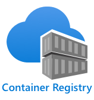

<!--
CO_OP_TRANSLATOR_METADATA:
{
  "original_hash": "2625af24587465c5547ae33d6cc000a5",
  "translation_date": "2025-08-27T20:36:28+00:00",
  "source_file": "4-manufacturing/lessons/3-run-fruit-detector-edge/README.md",
  "language_code": "no"
}
-->
# Kjør fruktdetektoren din på kanten


> Sketchnote av [Nitya Narasimhan](https://github.com/nitya). Klikk på bildet for en større versjon.

Denne videoen gir en oversikt over hvordan man kjører bildeklassifiserere på IoT-enheter, temaet som dekkes i denne leksjonen.

[](https://www.youtube.com/watch?v=_K5fqGLO8us)

## Quiz før leksjonen

[Quiz før leksjonen](https://black-meadow-040d15503.1.azurestaticapps.net/quiz/33)

## Introduksjon

I forrige leksjon brukte du bildeklassifisereren din til å klassifisere moden og umoden frukt, ved å sende et bilde tatt av kameraet på IoT-enheten din over internett til en skytjeneste. Disse forespørslene tar tid, koster penger, og avhengig av hvilken type bildedata du bruker, kan det ha personvernimplikasjoner.

I denne leksjonen vil du lære hvordan du kjører maskinlæringsmodeller (ML) på kanten – på IoT-enheter som kjører på ditt eget nettverk i stedet for i skyen. Du vil lære om fordelene og ulempene ved kantberegning kontra skyberegning, hvordan du distribuerer AI-modellen din til kanten, og hvordan du får tilgang til den fra IoT-enheten din.

I denne leksjonen dekker vi:

* [Kantberegning](../../../../../4-manufacturing/lessons/3-run-fruit-detector-edge)
* [Azure IoT Edge](../../../../../4-manufacturing/lessons/3-run-fruit-detector-edge)
* [Registrer en IoT Edge-enhet](../../../../../4-manufacturing/lessons/3-run-fruit-detector-edge)
* [Sett opp en IoT Edge-enhet](../../../../../4-manufacturing/lessons/3-run-fruit-detector-edge)
* [Eksporter modellen din](../../../../../4-manufacturing/lessons/3-run-fruit-detector-edge)
* [Forbered containeren din for distribusjon](../../../../../4-manufacturing/lessons/3-run-fruit-detector-edge)
* [Distribuer containeren din](../../../../../4-manufacturing/lessons/3-run-fruit-detector-edge)
* [Bruk IoT Edge-enheten din](../../../../../4-manufacturing/lessons/3-run-fruit-detector-edge)

## Kantberegning

Kantberegning innebærer å ha datamaskiner som behandler IoT-data så nær som mulig der dataene genereres. I stedet for å ha denne behandlingen i skyen, flyttes den til kanten av skyen – ditt interne nettverk.


I leksjonene så langt har du hatt enheter som samler inn data og sender data til skyen for å bli analysert, ved å kjøre serverløse funksjoner eller AI-modeller i skyen.


Kantberegning innebærer å flytte noen av skytjenestene ut av skyen og over på datamaskiner som kjører på samme nettverk som IoT-enhetene, og kun kommunisere med skyen hvis nødvendig. For eksempel kan du kjøre AI-modeller på kantenheter for å analysere fruktens modenhet, og kun sende analyser tilbake til skyen, som antall modne frukter kontra umodne.

✅ Tenk over IoT-applikasjonene du har bygget så langt. Hvilke deler av dem kunne blitt flyttet til kanten?

### Fordeler

Fordelene med kantberegning er:

1. **Hastighet** – kantberegning er ideell for tidskritiske data, ettersom handlinger utføres på samme nettverk som enheten, i stedet for å gjøre forespørsler over internett. Dette gir høyere hastigheter, ettersom interne nettverk kan kjøre betydelig raskere enn internettforbindelser, med data som reiser mye kortere avstander.

    > 💁 Til tross for at optiske kabler brukes til internettforbindelser som lar data reise med lysets hastighet, kan det ta tid for data å reise rundt i verden til skyleverandører. For eksempel, hvis du sender data fra Europa til skytjenester i USA, tar det minst 28 ms for dataene å krysse Atlanteren i en optisk kabel, og dette er uten å ta med tiden det tar å få dataene til den transatlantiske kabelen, konvertere fra elektriske til lyssignaler og tilbake igjen på den andre siden, og deretter fra den optiske kabelen til skyleverandøren.

    Kantberegning krever også mindre nettverkstrafikk, noe som reduserer risikoen for at dataene dine blir tregere på grunn av overbelastning på den begrensede båndbredden som er tilgjengelig for en internettforbindelse.

1. **Fjernaksessibilitet** – kantberegning fungerer når du har begrenset eller ingen tilkobling, eller når tilkobling er for dyrt til å brukes kontinuerlig. For eksempel i humanitære katastrofeområder hvor infrastrukturen er begrenset, eller i utviklingsland.

1. **Lavere kostnader** – å utføre datainnsamling, lagring, analyse og utløse handlinger på kantenheten reduserer bruken av skytjenester, noe som kan redusere de totale kostnadene for IoT-applikasjonen din. Det har vært en nylig økning i enheter designet for kantberegning, som AI-akseleratorer som [Jetson Nano fra NVIDIA](https://developer.nvidia.com/embedded/jetson-nano-developer-kit), som kan kjøre AI-arbeidsbelastninger ved hjelp av GPU-basert maskinvare på enheter som koster mindre enn 100 USD.

1. **Personvern og sikkerhet** – med kantberegning forblir dataene på nettverket ditt og lastes ikke opp til skyen. Dette foretrekkes ofte for sensitiv og personlig identifiserbar informasjon, spesielt fordi dataene ikke trenger å lagres etter at de er analysert, noe som i stor grad reduserer risikoen for datalekkasjer. Eksempler inkluderer medisinske data og opptak fra sikkerhetskameraer.

1. **Håndtering av usikre enheter** – hvis du har enheter med kjente sikkerhetsfeil som du ikke ønsker å koble direkte til nettverket eller internett, kan du koble dem til et separat nettverk via en gateway IoT Edge-enhet. Denne kantenheten kan deretter også ha en tilkobling til ditt bredere nettverk eller internett, og administrere dataflyten frem og tilbake.

1. **Støtte for inkompatible enheter** – hvis du har enheter som ikke kan koble til IoT Hub, for eksempel enheter som kun kan koble til via HTTP-tilkoblinger eller enheter som kun har Bluetooth, kan du bruke en IoT Edge-enhet som en gateway-enhet, som videresender meldinger til IoT Hub.

✅ Gjør litt research: Hvilke andre fordeler kan det være med kantberegning?

### Ulemper

Det finnes også ulemper med kantberegning, hvor skyen kan være et foretrukket alternativ:

1. **Skalering og fleksibilitet** – skyberegning kan tilpasse seg nettverks- og databehov i sanntid ved å legge til eller redusere servere og andre ressurser. For å legge til flere kantenheter kreves det manuell installasjon av flere enheter.

1. **Pålitelighet og robusthet** – skyberegning tilbyr flere servere, ofte på flere lokasjoner, for redundans og katastrofegjenoppretting. For å oppnå samme nivå av redundans på kanten kreves store investeringer og mye konfigurasjonsarbeid.

1. **Vedlikehold** – skytjenesteleverandører tilbyr systemvedlikehold og oppdateringer.

✅ Gjør litt research: Hvilke andre ulemper kan det være med kantberegning?

Ulempene er egentlig det motsatte av fordelene ved å bruke skyen – du må bygge og administrere disse enhetene selv, i stedet for å stole på ekspertisen og skalaen til skyleverandører.

Noen av risikoene blir redusert av selve naturen til kantberegning. For eksempel, hvis du har en kantenhet som kjører i en fabrikk og samler inn data fra maskiner, trenger du ikke å tenke på noen katastrofegjenopprettingsscenarier. Hvis strømmen til fabrikken går, trenger du ikke en reservekantenhet, ettersom maskinene som genererer dataene kantenheten behandler også vil være uten strøm.

For IoT-systemer vil du ofte ønske en blanding av sky- og kantberegning, og utnytte hver tjeneste basert på systemets behov, kundene og vedlikeholdspersonalet.

## Azure IoT Edge


Azure IoT Edge er en tjeneste som kan hjelpe deg med å flytte arbeidsbelastninger ut av skyen og til kanten. Du setter opp en enhet som en kantenhet, og fra skyen kan du distribuere kode til denne kantenheten. Dette lar deg kombinere skyens og kantens kapabiliteter.

> 🎓 *Arbeidsbelastninger* er et begrep for enhver tjeneste som utfører en form for arbeid, som AI-modeller, applikasjoner eller serverløse funksjoner.

For eksempel kan du trene en bildeklassifiserer i skyen, og deretter distribuere den til en kantenhet fra skyen. IoT-enheten din sender deretter bilder til kantenheten for klassifisering, i stedet for å sende bildene over internett. Hvis du trenger å distribuere en ny iterasjon av modellen, kan du trene den i skyen og bruke IoT Edge til å oppdatere modellen på kantenheten til den nye iterasjonen.

> 🎓 Programvare som distribueres til IoT Edge kalles *moduler*. Som standard kjører IoT Edge moduler som kommuniserer med IoT Hub, som `edgeAgent` og `edgeHub`-modulene. Når du distribuerer en bildeklassifiserer, distribueres dette som en ekstra modul.

IoT Edge er innebygd i IoT Hub, slik at du kan administrere kantenheter ved hjelp av den samme tjenesten du ville brukt til å administrere IoT-enheter, med samme sikkerhetsnivå.

IoT Edge kjører kode fra *containere* – selvstendige applikasjoner som kjøres isolert fra resten av applikasjonene på datamaskinen din. Når du kjører en container, fungerer den som en separat datamaskin som kjører inne i datamaskinen din, med sin egen programvare, tjenester og applikasjoner. Som oftest kan containere ikke få tilgang til noe på datamaskinen din med mindre du velger å dele ting som en mappe med containeren. Containeren eksponerer deretter tjenester via en åpen port som du kan koble til eller eksponere for nettverket ditt.


For eksempel kan du ha en container med et nettsted som kjører på port 80, standard HTTP-port, og du kan deretter eksponere den fra datamaskinen din også på port 80.

✅ Gjør litt research: Les om containere og tjenester som Docker eller Moby.

Du kan bruke Custom Vision til å laste ned bildeklassifiserere og distribuere dem som containere, enten direkte til en enhet eller distribuert via IoT Edge. Når de kjører i en container, kan de nås ved hjelp av den samme REST API-en som skyversjonen, men med endepunktet som peker til kantenheten som kjører containeren.

## Registrer en IoT Edge-enhet

For å bruke en IoT Edge-enhet, må den registreres i IoT Hub.

### Oppgave – registrer en IoT Edge-enhet

1. Opprett en IoT Hub i ressursgruppen `fruit-quality-detector`. Gi den et unikt navn basert på `fruit-quality-detector`.

1. Registrer en IoT Edge-enhet kalt `fruit-quality-detector-edge` i IoT Hub. Kommandoen for å gjøre dette ligner på den som brukes til å registrere en ikke-kantenhet, bortsett fra at du legger til flagget `--edge-enabled`.

    ```sh
    az iot hub device-identity create --edge-enabled \
                                      --device-id fruit-quality-detector-edge \
                                      --hub-name <hub_name>
    ```

    Erstatt `<hub_name>` med navnet på IoT Hub-en din.

1. Hent tilkoblingsstrengen for enheten din ved å bruke følgende kommando:

    ```sh
    az iot hub device-identity connection-string show --device-id fruit-quality-detector-edge \
                                                      --output table \
                                                      --hub-name <hub_name>
    ```

    Erstatt `<hub_name>` med navnet på IoT Hub-en din.

    Ta en kopi av tilkoblingsstrengen som vises i utdataene.

## Sett opp en IoT Edge-enhet

Når du har opprettet kantenhetsregistreringen i IoT Hub, kan du sette opp kantenheten.

### Oppgave – Installer og start IoT Edge Runtime

**IoT Edge-runtime kjører kun Linux-containere.** Den kan kjøres på Linux, eller på Windows ved hjelp av Linux Virtual Machines.

* Hvis du bruker en Raspberry Pi som IoT-enhet, kjører denne en støttet versjon av Linux og kan være vert for IoT Edge-runtime. Følg [installasjonsveiledningen for Azure IoT Edge for Linux på Microsoft Docs](https://docs.microsoft.com/azure/iot-edge/how-to-install-iot-edge?WT.mc_id=academic-17441-jabenn) for å installere IoT Edge og angi tilkoblingsstrengen.

    > 💁 Husk, Raspberry Pi OS er en variant av Debian Linux.

* Hvis du ikke bruker en Raspberry Pi, men har en Linux-datamaskin, kan du kjøre IoT Edge-runtime. Følg [installasjonsveiledningen for Azure IoT Edge for Linux på Microsoft Docs](https://docs.microsoft.com/azure/iot-edge/how-to-install-iot-edge?WT.mc_id=academic-17441-jabenn) for å installere IoT Edge og angi tilkoblingsstrengen.

* Hvis du bruker Windows, kan du installere IoT Edge-runtime i en Linux Virtual Machine ved å følge [seksjonen for å installere og starte IoT Edge-runtime i hurtigstarten for å distribuere din første IoT Edge-modul til en Windows-enhet på Microsoft Docs](https://docs.microsoft.com/azure/iot-edge/quickstart?WT.mc_id=academic-17441-jabenn#install-and-start-the-iot-edge-runtime). Du kan stoppe når du når delen *Distribuer en modul*.

* Hvis du bruker macOS, kan du opprette en virtuell maskin (VM) i skyen for å bruke som IoT Edge-enhet. Dette er datamaskiner du kan opprette i skyen og få tilgang til over internett. Du kan opprette en Linux-VM som har IoT Edge installert. Følg [veiledningen for å opprette en virtuell maskin som kjører IoT Edge](vm-iotedge.md) for instruksjoner om hvordan du gjør dette.

## Eksporter modellen din

For å kjøre klassifisereren på kanten, må den eksporteres fra Custom Vision. Custom Vision kan generere to typer modeller – standardmodeller og kompakte modeller. Kompakte modeller bruker ulike teknikker for å redusere størrelsen på modellen, slik at den blir liten nok til å lastes ned og distribueres på IoT-enheter.

Da du opprettet bildeklassifisereren, brukte du *Food*-domenet, en versjon av modellen som er optimalisert for trening på matbilder. I Custom Vision kan du endre domenet til prosjektet ditt, og bruke treningsdataene dine til å trene en ny modell med det nye domenet. Alle domenene som støttes av Custom Vision er tilgjengelige som standard og kompakte.

### Oppgave – tren modellen din ved hjelp av Food (kompakt)-domenet
1. Åpne Custom Vision-portalen på [CustomVision.ai](https://customvision.ai) og logg inn hvis du ikke allerede har den åpen. Deretter åpner du prosjektet ditt `fruit-quality-detector`.

1. Velg **Innstillinger**-knappen (⚙-ikonet).

1. I listen *Domener*, velg *Mat (kompakt)*.

1. Under *Eksportmuligheter*, sørg for at *Grunnleggende plattformer (Tensorflow, CoreML, ONNX, ...)* er valgt.

1. Nederst på innstillingssiden, velg **Lagre endringer**.

1. Tren modellen på nytt med **Tren**-knappen, og velg *Rask trening*.

### Oppgave - eksporter modellen din

Når modellen er trent, må den eksporteres som en container.

1. Velg **Ytelse**-fanen, og finn den nyeste iterasjonen som ble trent med det kompakte domenet.

1. Velg **Eksporter**-knappen øverst.

1. Velg **DockerFile**, og velg en versjon som passer til din edge-enhet:

    * Hvis du kjører IoT Edge på en Linux-datamaskin, en Windows-datamaskin eller en virtuell maskin, velg *Linux*-versjonen.
    * Hvis du kjører IoT Edge på en Raspberry Pi, velg *ARM (Raspberry Pi 3)*-versjonen.

> 🎓 Docker er et av de mest populære verktøyene for å administrere containere, og en DockerFile er et sett med instruksjoner for hvordan man setter opp containeren.

1. Velg **Eksporter** for å få Custom Vision til å lage de relevante filene, og deretter **Last ned** for å laste dem ned som en zip-fil.

1. Lagre filene på datamaskinen din, og pakk ut mappen.

## Forbered containeren din for distribusjon


Når du har lastet ned modellen din, må den bygges inn i en container og deretter skyves til et containerregister - et nettbasert sted hvor du kan lagre containere. IoT Edge kan deretter laste ned containeren fra registeret og skyve den til enheten din.



Containerregisteret du vil bruke for denne leksjonen er Azure Container Registry. Dette er ikke en gratis tjeneste, så for å spare penger må du [rydde opp i prosjektet ditt](../../../clean-up.md) når du er ferdig.

> 💁 Du kan se kostnadene for å bruke et Azure Container Registry på [Azure Container Registry-prissiden](https://azure.microsoft.com/pricing/details/container-registry/?WT.mc_id=academic-17441-jabenn).

### Oppgave - installer Docker

For å bygge og distribuere klassifiseringsmodulen, må du kanskje installere [Docker](https://www.docker.com/).

Du trenger bare å gjøre dette hvis du planlegger å bygge containeren fra en annen enhet enn den du installerte IoT Edge på - som en del av installasjonen av IoT Edge blir Docker installert for deg.

1. Hvis du bygger Docker-containeren på en annen enhet enn IoT Edge-enheten din, følg instruksjonene for Docker-installasjon på [Docker installasjonssiden](https://www.docker.com/products/docker-desktop) for å installere Docker Desktop eller Docker-motoren. Sørg for at den kjører etter installasjonen.

### Oppgave - opprett en containerregisterressurs

1. Kjør følgende kommando fra terminalen eller kommandoprompten for å opprette en Azure Container Registry-ressurs:

    ```sh
    az acr create --resource-group fruit-quality-detector \
                  --sku Basic \
                  --name <Container registry name>
    ```

    Erstatt `<Container registry name>` med et unikt navn for containerregisteret ditt, kun med bokstaver og tall. Basér dette på `fruitqualitydetector`. Dette navnet blir en del av URL-en for å få tilgang til containerregisteret, så det må være globalt unikt.

1. Logg inn på Azure Container Registry med følgende kommando:

    ```sh
    az acr login --name <Container registry name>
    ```

    Erstatt `<Container registry name>` med navnet du brukte for containerregisteret ditt.

1. Sett containerregisteret i administratormodus slik at du kan generere et passord med følgende kommando:

    ```sh
    az acr update --admin-enabled true \
                 --name <Container registry name>
    ```

    Erstatt `<Container registry name>` med navnet du brukte for containerregisteret ditt.

1. Generer passord for containerregisteret ditt med følgende kommando:

    ```sh
     az acr credential renew --password-name password \
                             --output table \
                             --name <Container registry name>
    ```

    Erstatt `<Container registry name>` med navnet du brukte for containerregisteret ditt.

    Ta en kopi av verdien `PASSWORD`, da du vil trenge denne senere.

### Oppgave - bygg containeren din

Det du lastet ned fra Custom Vision var en DockerFile som inneholder instruksjoner om hvordan containeren skal bygges, sammen med applikasjonskode som vil bli kjørt inne i containeren for å være vert for din Custom Vision-modell, samt en REST API for å kalle den. Du kan bruke Docker til å bygge en tagget container fra DockerFile, og deretter skyve den til containerregisteret ditt.

> 🎓 Containere får en tag som definerer et navn og en versjon for dem. Når du trenger å oppdatere en container, kan du bygge den med samme tag, men en nyere versjon.

1. Åpne terminalen eller kommandoprompten og naviger til den utpakkede modellen du lastet ned fra Custom Vision.

1. Kjør følgende kommando for å bygge og tagge bildet:

    ```sh
    docker build --platform <platform> -t <Container registry name>.azurecr.io/classifier:v1 .
    ```

    Erstatt `<platform>` med plattformen som denne containeren skal kjøre på. Hvis du kjører IoT Edge på en Raspberry Pi, sett dette til `linux/armhf`, ellers sett det til `linux/amd64`.

    > 💁 Hvis du kjører denne kommandoen fra enheten du kjører IoT Edge fra, som å kjøre dette fra din Raspberry Pi, kan du utelate `--platform <platform>`-delen, da den standardiseres til den nåværende plattformen.

    Erstatt `<Container registry name>` med navnet du brukte for containerregisteret ditt.

    > 💁 Hvis du kjører på Linux eller Raspberry Pi OS, kan det hende du må bruke `sudo` for å kjøre denne kommandoen.

    Docker vil bygge bildet, konfigurere all nødvendig programvare. Bildet vil deretter bli tagget som `classifier:v1`.

    ```output
    ➜  d4ccc45da0bb478bad287128e1274c3c.DockerFile.Linux docker build --platform linux/amd64 -t  fruitqualitydetectorjimb.azurecr.io/classifier:v1 .
    [+] Building 102.4s (11/11) FINISHED
     => [internal] load build definition from Dockerfile
     => => transferring dockerfile: 131B
     => [internal] load .dockerignore
     => => transferring context: 2B
     => [internal] load metadata for docker.io/library/python:3.7-slim
     => [internal] load build context
     => => transferring context: 905B
     => [1/6] FROM docker.io/library/python:3.7-slim@sha256:b21b91c9618e951a8cbca5b696424fa5e820800a88b7e7afd66bba0441a764d6
     => => resolve docker.io/library/python:3.7-slim@sha256:b21b91c9618e951a8cbca5b696424fa5e820800a88b7e7afd66bba0441a764d6
     => => sha256:b4d181a07f8025e00e0cb28f1cc14613da2ce26450b80c54aea537fa93cf3bda 27.15MB / 27.15MB
     => => sha256:de8ecf497b753094723ccf9cea8a46076e7cb845f333df99a6f4f397c93c6ea9 2.77MB / 2.77MB
     => => sha256:707b80804672b7c5d8f21e37c8396f319151e1298d976186b4f3b76ead9f10c8 10.06MB / 10.06MB
     => => sha256:b21b91c9618e951a8cbca5b696424fa5e820800a88b7e7afd66bba0441a764d6 1.86kB / 1.86kB
     => => sha256:44073386687709c437586676b572ff45128ff1f1570153c2f727140d4a9accad 1.37kB / 1.37kB
     => => sha256:3d94f0f2ca798607808b771a7766f47ae62a26f820e871dd488baeccc69838d1 8.31kB / 8.31kB
     => => sha256:283715715396fd56d0e90355125fd4ec57b4f0773f306fcd5fa353b998beeb41 233B / 233B
     => => sha256:8353afd48f6b84c3603ea49d204bdcf2a1daada15f5d6cad9cc916e186610a9f 2.64MB / 2.64MB
     => => extracting sha256:b4d181a07f8025e00e0cb28f1cc14613da2ce26450b80c54aea537fa93cf3bda
     => => extracting sha256:de8ecf497b753094723ccf9cea8a46076e7cb845f333df99a6f4f397c93c6ea9
     => => extracting sha256:707b80804672b7c5d8f21e37c8396f319151e1298d976186b4f3b76ead9f10c8
     => => extracting sha256:283715715396fd56d0e90355125fd4ec57b4f0773f306fcd5fa353b998beeb41
     => => extracting sha256:8353afd48f6b84c3603ea49d204bdcf2a1daada15f5d6cad9cc916e186610a9f
     => [2/6] RUN pip install -U pip
     => [3/6] RUN pip install --no-cache-dir numpy~=1.17.5 tensorflow~=2.0.2 flask~=1.1.2 pillow~=7.2.0
     => [4/6] RUN pip install --no-cache-dir mscviplib==2.200731.16
     => [5/6] COPY app /app
     => [6/6] WORKDIR /app
     => exporting to image
     => => exporting layers
     => => writing image sha256:1846b6f134431f78507ba7c079358ed66d944c0e185ab53428276bd822400386
     => => naming to fruitqualitydetectorjimb.azurecr.io/classifier:v1
    ```

### Oppgave - skyv containeren din til containerregisteret ditt

1. Bruk følgende kommando for å skyve containeren din til containerregisteret ditt:

    ```sh
    docker push <Container registry name>.azurecr.io/classifier:v1
    ```

    Erstatt `<Container registry name>` med navnet du brukte for containerregisteret ditt.

    > 💁 Hvis du kjører Linux, kan det hende du må bruke `sudo` for å kjøre denne kommandoen.

    Containeren vil bli skyvet til containerregisteret.

    ```output
    ➜  d4ccc45da0bb478bad287128e1274c3c.DockerFile.Linux docker push fruitqualitydetectorjimb.azurecr.io/classifier:v1
    The push refers to repository [fruitqualitydetectorjimb.azurecr.io/classifier]
    5f70bf18a086: Pushed 
    8a1ba9294a22: Pushed 
    56cf27184a76: Pushed 
    b32154f3f5dd: Pushed 
    36103e9a3104: Pushed 
    e2abb3cacca0: Pushed 
    4213fd357bbe: Pushed 
    7ea163ba4dce: Pushed 
    537313a13d90: Pushed 
    764055ebc9a7: Pushed 
    v1: digest: sha256:ea7894652e610de83a5a9e429618e763b8904284253f4fa0c9f65f0df3a5ded8 size: 2423
    ```

1. For å verifisere skyvingen, kan du liste opp containerne i registeret ditt med følgende kommando:

    ```sh
    az acr repository list --output table \
                           --name <Container registry name> 
    ```

    Erstatt `<Container registry name>` med navnet du brukte for containerregisteret ditt.

    ```output
    ➜  d4ccc45da0bb478bad287128e1274c3c.DockerFile.Linux az acr repository list --name fruitqualitydetectorjimb --output table
    Result
    ----------
    classifier
    ```

    Du vil se klassifiseringsmodulen din oppført i utdataene.

## Distribuer containeren din

Containeren din kan nå distribueres til IoT Edge-enheten din. For å distribuere må du definere et distribusjonsmanifest - et JSON-dokument som lister opp modulene som skal distribueres til edge-enheten.

### Oppgave - opprett distribusjonsmanifestet

1. Opprett en ny fil kalt `deployment.json` et sted på datamaskinen din.

1. Legg til følgende i denne filen:

    ```json
    {
        "content": {
            "modulesContent": {
                "$edgeAgent": {
                    "properties.desired": {
                        "schemaVersion": "1.1",
                        "runtime": {
                            "type": "docker",
                            "settings": {
                                "minDockerVersion": "v1.25",
                                "loggingOptions": "",
                                "registryCredentials": {
                                    "ClassifierRegistry": {
                                        "username": "<Container registry name>",
                                        "password": "<Container registry password>",
                                        "address": "<Container registry name>.azurecr.io"
                                      }
                                }
                            }
                        },
                        "systemModules": {
                            "edgeAgent": {
                                "type": "docker",
                                "settings": {
                                    "image": "mcr.microsoft.com/azureiotedge-agent:1.1",
                                    "createOptions": "{}"
                                }
                            },
                            "edgeHub": {
                                "type": "docker",
                                "status": "running",
                                "restartPolicy": "always",
                                "settings": {
                                    "image": "mcr.microsoft.com/azureiotedge-hub:1.1",
                                    "createOptions": "{\"HostConfig\":{\"PortBindings\":{\"5671/tcp\":[{\"HostPort\":\"5671\"}],\"8883/tcp\":[{\"HostPort\":\"8883\"}],\"443/tcp\":[{\"HostPort\":\"443\"}]}}}"
                                }
                            }
                        },
                        "modules": {
                            "ImageClassifier": {
                                "version": "1.0",
                                "type": "docker",
                                "status": "running",
                                "restartPolicy": "always",
                                "settings": {
                                    "image": "<Container registry name>.azurecr.io/classifier:v1",
                                    "createOptions": "{\"ExposedPorts\": {\"80/tcp\": {}},\"HostConfig\": {\"PortBindings\": {\"80/tcp\": [{\"HostPort\": \"80\"}]}}}"
                                }
                            }
                        }
                    }
                },
                "$edgeHub": {
                    "properties.desired": {
                        "schemaVersion": "1.1",
                        "routes": {
                            "upstream": "FROM /messages/* INTO $upstream"
                        },
                        "storeAndForwardConfiguration": {
                            "timeToLiveSecs": 7200
                        }
                    }
                }
            }
        }
    }
    ```

    > 💁 Du finner denne filen i [code-deployment/deployment](../../../../../4-manufacturing/lessons/3-run-fruit-detector-edge/code-deployment/deployment)-mappen.

    Erstatt de tre forekomstene av `<Container registry name>` med navnet du brukte for containerregisteret ditt. Én er i `ImageClassifier`-modulseksjonen, de andre to er i `registryCredentials`-seksjonen.

    Erstatt `<Container registry password>` i `registryCredentials`-seksjonen med passordet ditt for containerregisteret.

1. Fra mappen som inneholder distribusjonsmanifestet ditt, kjør følgende kommando:

    ```sh
    az iot edge set-modules --device-id fruit-quality-detector-edge \
                            --content deployment.json \
                            --hub-name <hub_name>
    ```

    Erstatt `<hub_name>` med navnet på IoT Hub-en din.

    Image classifier-modulen vil bli distribuert til edge-enheten din.

### Oppgave - verifiser at klassifiseringsmodulen kjører

1. Koble til IoT Edge-enheten:

    * Hvis du bruker en Raspberry Pi til å kjøre IoT Edge, koble til via ssh enten fra terminalen din eller via en ekstern SSH-økt i VS Code.
    * Hvis du kjører IoT Edge i en Linux-container på Windows, følg trinnene i [veiledningen for å verifisere vellykket konfigurasjon](https://docs.microsoft.com/azure/iot-edge/how-to-install-iot-edge-on-windows?WT.mc_id=academic-17441-jabenn&view=iotedge-2018-06&tabs=powershell#verify-successful-configuration) for å koble til IoT Edge-enheten.
    * Hvis du kjører IoT Edge på en virtuell maskin, kan du SSH inn i maskinen ved å bruke `adminUsername` og `password` du satte da du opprettet VM-en, og bruke enten IP-adressen eller DNS-navnet:

        ```sh
        ssh <adminUsername>@<IP address>
        ```

        Eller:

        ```sh
        ssh <adminUsername>@<DNS Name>
        ```

        Skriv inn passordet ditt når du blir bedt om det.

1. Når du er koblet til, kjør følgende kommando for å få listen over IoT Edge-moduler:

    ```sh
    iotedge list
    ```

    > 💁 Du kan trenge å kjøre denne kommandoen med `sudo`.

    Du vil se de kjørende modulene:

    ```output
    jim@fruit-quality-detector-jimb:~$ iotedge list
    NAME             STATUS           DESCRIPTION      CONFIG
    ImageClassifier  running          Up 42 minutes    fruitqualitydetectorjimb.azurecr.io/classifier:v1
    edgeAgent        running          Up 42 minutes    mcr.microsoft.com/azureiotedge-agent:1.1
    edgeHub          running          Up 42 minutes    mcr.microsoft.com/azureiotedge-hub:1.1
    ```

1. Sjekk loggene for Image classifier-modulen med følgende kommando:

    ```sh
    iotedge logs ImageClassifier
    ```

    > 💁 Du kan trenge å kjøre denne kommandoen med `sudo`.

    ```output
    jim@fruit-quality-detector-jimb:~$ iotedge logs ImageClassifier
    2021-07-05 20:30:15.387144: I tensorflow/core/platform/cpu_feature_guard.cc:142] Your CPU supports instructions that this TensorFlow binary was not compiled to use: AVX2 FMA
    2021-07-05 20:30:15.392185: I tensorflow/core/platform/profile_utils/cpu_utils.cc:94] CPU Frequency: 2394450000 Hz
    2021-07-05 20:30:15.392712: I tensorflow/compiler/xla/service/service.cc:168] XLA service 0x55ed9ac83470 executing computations on platform Host. Devices:
    2021-07-05 20:30:15.392806: I tensorflow/compiler/xla/service/service.cc:175]   StreamExecutor device (0): Host, Default Version
    Loading model...Success!
    Loading labels...2 found. Success!
     * Serving Flask app "app" (lazy loading)
     * Environment: production
       WARNING: This is a development server. Do not use it in a production deployment.
       Use a production WSGI server instead.
     * Debug mode: off
     * Running on http://0.0.0.0:80/ (Press CTRL+C to quit)
    ```

### Oppgave - test bildeklassifiseringen

1. Du kan bruke CURL til å teste bildeklassifiseringen ved å bruke IP-adressen eller vertsnavnet til datamaskinen som kjører IoT Edge-agenten. Finn IP-adressen:

    * Hvis du er på samme maskin som IoT Edge kjører på, kan du bruke `localhost` som vertsnavn.
    * Hvis du bruker en VM, kan du bruke enten IP-adressen eller DNS-navnet til VM-en.
    * Ellers kan du finne IP-adressen til maskinen som kjører IoT Edge:
      * På Windows 10, følg [veiledningen for å finne IP-adressen din](https://support.microsoft.com/windows/find-your-ip-address-f21a9bbc-c582-55cd-35e0-73431160a1b9?WT.mc_id=academic-17441-jabenn).
      * På macOS, følg [veiledningen for å finne IP-adressen din på Mac](https://www.hellotech.com/guide/for/how-to-find-ip-address-on-mac).
      * På Linux, følg delen om å finne din private IP-adresse i [veiledningen for å finne IP-adressen din i Linux](https://opensource.com/article/18/5/how-find-ip-address-linux).

1. Du kan teste containeren med en lokal fil ved å kjøre følgende curl-kommando:

    ```sh
    curl --location \
         --request POST 'http://<IP address or name>/image' \
         --header 'Content-Type: image/png' \
         --data-binary '@<file_Name>' 
    ```

    Erstatt `<IP address or name>` med IP-adressen eller vertsnavnet til datamaskinen som kjører IoT Edge. Erstatt `<file_Name>` med navnet på filen som skal testes.

    Du vil se prediksjonsresultatene i utdataene:

    ```output
    {
        "created": "2021-07-05T21:44:39.573181",
        "id": "",
        "iteration": "",
        "predictions": [
            {
                "boundingBox": null,
                "probability": 0.9995615482330322,
                "tagId": "",
                "tagName": "ripe"
            },
            {
                "boundingBox": null,
                "probability": 0.0004384400090202689,
                "tagId": "",
                "tagName": "unripe"
            }
        ],
        "project": ""
    }
    ```

    > 💁 Det er ikke nødvendig å oppgi en prediksjonsnøkkel her, da dette ikke bruker en Azure-ressurs. I stedet vil sikkerhet bli konfigurert på det interne nettverket basert på interne sikkerhetsbehov, i stedet for å stole på en offentlig endepunkt og en API-nøkkel.

## Bruk IoT Edge-enheten din

Nå som Image Classifier er distribuert til en IoT Edge-enhet, kan du bruke den fra IoT-enheten din.

### Oppgave - bruk IoT Edge-enheten din

Arbeid gjennom den relevante veiledningen for å klassifisere bilder ved hjelp av IoT Edge-klassifiseringen:

* [Arduino - Wio Terminal](wio-terminal.md)
* [Enkeltkortdatamaskin - Raspberry Pi/Virtual IoT-enhet](single-board-computer.md)

### Modelltrening på nytt

En av ulempene med å kjøre bildeklassifisering på IoT Edge er at de ikke er koblet til Custom Vision-prosjektet ditt. Hvis du ser på **Prediksjoner**-fanen i Custom Vision, vil du ikke se bildene som ble klassifisert ved hjelp av Edge-basert klassifisering.

Dette er forventet oppførsel - bilder sendes ikke til skyen for klassifisering, så de vil ikke være tilgjengelige i skyen. En av fordelene med å bruke IoT Edge er personvern, som sikrer at bilder ikke forlater nettverket ditt, en annen er muligheten til å arbeide offline, slik at du ikke er avhengig av å laste opp bilder når enheten ikke har internettforbindelse. Ulempen er forbedring av modellen din - du må implementere en annen måte å lagre bilder på som kan klassifiseres manuelt for å forbedre og trene bildeklassifiseringen på nytt.

✅ Tenk på måter å laste opp bilder for å trene klassifiseringen på nytt.

---

## 🚀 Utfordring

Å kjøre AI-modeller på edge-enheter kan være raskere enn i skyen - nettverkshoppet er kortere. De kan også være tregere, ettersom maskinvaren som kjører modellen kanskje ikke er like kraftig som skyen.

Ta noen tidsmålinger og sammenlign om kallet til edge-enheten din er raskere eller tregere enn kallet til skyen? Tenk på årsaker til å forklare forskjellen, eller mangelen på forskjell. Undersøk måter å kjøre AI-modeller raskere på edge-enheter ved hjelp av spesialisert maskinvare.

## Quiz etter forelesning

[Quiz etter forelesning](https://black-meadow-040d15503.1.azurestaticapps.net/quiz/34)

## Gjennomgang og selvstudium

* Les mer om containere på [OS-nivå virtualiseringssiden på Wikipedia](https://wikipedia.org/wiki/OS-level_virtualization).
* Les mer om edge computing, med fokus på hvordan 5G kan bidra til å utvide edge computing i [hva er edge computing og hvorfor er det viktig? artikkelen på NetworkWorld](https://www.networkworld.com/article/3224893/what-is-edge-computing-and-how-its-changing-the-network.html)
* Lær mer om å kjøre AI-tjenester i IoT Edge ved å se [lær hvordan du bruker Azure IoT Edge på en forhåndsbygget AI-tjeneste på Edge for å utføre språkgjenkjenning-episoden av Learn Live på Microsoft Channel9](https://channel9.msdn.com/Shows/Learn-Live/Sharpen-Your-AI-Edge-Skills-Episode-4-Learn-How-to-Use-Azure-IoT-Edge-on-a-Pre-Built-AI-Service-on-t?WT.mc_id=academic-17441-jabenn)

## Oppgave

[Kjør andre tjenester på kanten](assignment.md)

---

**Ansvarsfraskrivelse**:  
Dette dokumentet er oversatt ved hjelp av AI-oversettelsestjenesten [Co-op Translator](https://github.com/Azure/co-op-translator). Selv om vi streber etter nøyaktighet, vær oppmerksom på at automatiserte oversettelser kan inneholde feil eller unøyaktigheter. Det originale dokumentet på sitt opprinnelige språk bør anses som den autoritative kilden. For kritisk informasjon anbefales profesjonell menneskelig oversettelse. Vi er ikke ansvarlige for misforståelser eller feiltolkninger som oppstår ved bruk av denne oversettelsen.