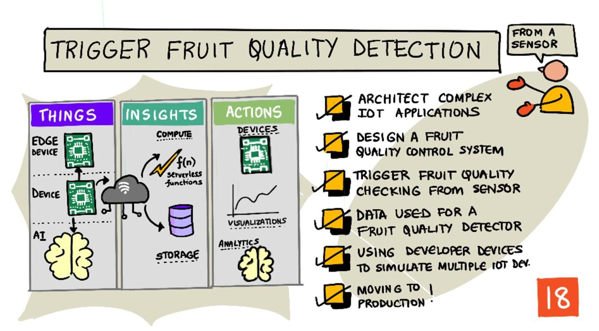

<!--
CO_OP_TRANSLATOR_METADATA:
{
  "original_hash": "f74f4ccb61f00e5f7e9f49c3ed416e36",
  "translation_date": "2025-08-27T20:30:00+00:00",
  "source_file": "4-manufacturing/lessons/4-trigger-fruit-detector/README.md",
  "language_code": "no"
}
-->
# Utløse fruktkvalitetsdeteksjon fra en sensor



> Sketchnote av [Nitya Narasimhan](https://github.com/nitya). Klikk på bildet for en større versjon.

## Quiz før forelesning

[Quiz før forelesning](https://black-meadow-040d15503.1.azurestaticapps.net/quiz/35)

## Introduksjon

En IoT-applikasjon er ikke bare en enkelt enhet som fanger data og sender det til skyen. Ofte består den av flere enheter som samarbeider for å samle data fra den fysiske verden ved hjelp av sensorer, ta beslutninger basert på disse dataene, og interagere tilbake med den fysiske verden via aktuatorer eller visualiseringer.

I denne leksjonen vil du lære mer om hvordan man designer komplekse IoT-applikasjoner, inkludert bruk av flere sensorer, flere skytjenester for analyse og lagring av data, og hvordan man viser en respons via en aktuator. Du vil lære hvordan man designer en prototype for et fruktkvalitetskontrollsystem, inkludert bruk av nærhetssensorer for å utløse IoT-applikasjonen, og hvordan arkitekturen for denne prototypen vil se ut.

I denne leksjonen dekker vi:

* [Arkitekturer for komplekse IoT-applikasjoner](../../../../../4-manufacturing/lessons/4-trigger-fruit-detector)
* [Design av et fruktkvalitetskontrollsystem](../../../../../4-manufacturing/lessons/4-trigger-fruit-detector)
* [Utløse fruktkvalitetskontroll fra en sensor](../../../../../4-manufacturing/lessons/4-trigger-fruit-detector)
* [Data brukt i en fruktkvalitetsdetektor](../../../../../4-manufacturing/lessons/4-trigger-fruit-detector)
* [Bruke utviklerutstyr for å simulere flere IoT-enheter](../../../../../4-manufacturing/lessons/4-trigger-fruit-detector)
* [Overgang til produksjon](../../../../../4-manufacturing/lessons/4-trigger-fruit-detector)

> 🗑 Dette er den siste leksjonen i dette prosjektet, så etter at du har fullført denne leksjonen og oppgaven, ikke glem å rydde opp i skytjenestene dine. Du vil trenge tjenestene for å fullføre oppgaven, så sørg for å fullføre den først.
>
> Se [veiledningen for å rydde opp i prosjektet ditt](../../../clean-up.md) hvis du trenger instruksjoner om hvordan du gjør dette.

## Arkitekturer for komplekse IoT-applikasjoner

IoT-applikasjoner består av mange komponenter. Dette inkluderer en rekke enheter og internettjenester.

IoT-applikasjoner kan beskrives som *ting* (enheter) som sender data som genererer *innsikt*. Disse *innsiktene* genererer *handlinger* for å forbedre en virksomhet eller prosess. Et eksempel er en motor (tingen) som sender temperaturdata. Disse dataene brukes til å evaluere om motoren fungerer som forventet (innsikten). Innsikten brukes til proaktivt å prioritere vedlikeholdsplanen for motoren (handlingen).

* Ulike ting samler inn ulike typer data.
* IoT-tjenester gir innsikt basert på disse dataene, noen ganger ved å kombinere dem med data fra andre kilder.
* Disse innsiktene driver handlinger, inkludert kontroll av aktuatorer i enheter eller visualisering av data.

### Referansearkitektur for IoT


Diagrammet ovenfor viser en referansearkitektur for IoT.

> 🎓 En *referansearkitektur* er et eksempel på en arkitektur du kan bruke som referanse når du designer nye systemer. I dette tilfellet, hvis du bygger et nytt IoT-system, kan du følge referansearkitekturen og erstatte med dine egne enheter og tjenester der det er passende.

* **Ting** er enheter som samler inn data fra sensorer, og kanskje interagerer med edge-tjenester for å tolke disse dataene, som bildeklassifisering for å tolke bildedata. Dataene fra enhetene sendes til en IoT-tjeneste.
* **Innsikt** kommer fra serverløse applikasjoner eller fra analyser av lagrede data.
* **Handlinger** kan være kommandoer sendt til enheter eller visualisering av data som lar mennesker ta beslutninger.


Diagrammet ovenfor viser noen av komponentene og tjenestene som er dekket så langt i disse leksjonene, og hvordan de kobles sammen i en referansearkitektur for IoT.

* **Ting** - du har skrevet enhetskode for å fange data fra sensorer og analysere bilder ved hjelp av Custom Vision som kjører både i skyen og på en edge-enhet. Disse dataene ble sendt til IoT Hub.
* **Innsikt** - du har brukt Azure Functions for å svare på meldinger sendt til en IoT Hub, og lagret data for senere analyse i Azure Storage.
* **Handlinger** - du har kontrollert aktuatorer basert på beslutninger tatt i skyen og kommandoer sendt til enhetene, og du har visualisert data ved hjelp av Azure Maps.

✅ Tenk på andre IoT-enheter du har brukt, som smarte hjemmeapparater. Hva er tingene, innsiktene og handlingene involvert i den enheten og dens programvare?

Dette mønsteret kan skaleres opp eller ned etter behov, ved å legge til flere enheter og flere tjenester.

### Data og sikkerhet

Når du definerer arkitekturen for systemet ditt, må du hele tiden vurdere data og sikkerhet.

* Hvilke data sender og mottar enheten din?
* Hvordan bør disse dataene sikres og beskyttes?
* Hvordan bør tilgang til enheten og skytjenesten kontrolleres?

✅ Tenk på datasikkerheten til IoT-enheter du eier. Hvor mye av disse dataene er personlige og bør holdes private, både under overføring og når de er lagret? Hvilke data bør ikke lagres?

## Design av et fruktkvalitetskontrollsystem

La oss nå ta ideen om ting, innsikt og handlinger og bruke den på vår fruktkvalitetsdetektor for å designe en større ende-til-ende-applikasjon.

Tenk deg at du har fått oppgaven med å bygge en fruktkvalitetsdetektor som skal brukes i en prosesseringsfabrikk. Frukt transporteres på et samlebåndsystem hvor ansatte for øyeblikket bruker tid på å sjekke frukten manuelt og fjerne umoden frukt når den ankommer. For å redusere kostnader ønsker fabrikkeieren et automatisert system.

✅ En av trendene med fremveksten av IoT (og teknologi generelt) er at manuelle jobber erstattes av maskiner. Gjør litt research: Hvor mange jobber er estimert å gå tapt på grunn av IoT? Hvor mange nye jobber vil bli skapt for å bygge IoT-enheter?

Du må bygge et system der frukt oppdages når den ankommer samlebåndet, fotograferes og sjekkes ved hjelp av en AI-modell som kjører på edge-enheten. Resultatene sendes deretter til skyen for lagring, og hvis frukten er umoden gis det en varsling slik at den umodne frukten kan fjernes.

|   |   |
| - | - |
| **Ting** | Detektor for frukt som ankommer samlebåndet<br>Kamera for å fotografere og klassifisere frukten<br>Edge-enhet som kjører klassifiseringen<br>Enhet for å varsle om umoden frukt |
| **Innsikt** | Beslutning om å sjekke fruktens modenhet<br>Lagre resultatene fra klassifiseringen<br>Avgjøre om det er behov for å varsle om umoden frukt |
| **Handlinger** | Sende en kommando til en enhet for å fotografere frukten og sjekke den med en bildeklassifisering<br>Sende en kommando til en enhet for å varsle om at frukten er umoden |

### Prototyping av applikasjonen din


Diagrammet ovenfor viser en referansearkitektur for denne prototype-applikasjonen.

* En IoT-enhet med en nærhetssensor oppdager ankomsten av frukt. Dette sender en melding til skyen om at frukt er oppdaget.
* En serverløs applikasjon i skyen sender en kommando til en annen enhet for å ta et bilde og klassifisere det.
* En IoT-enhet med et kamera tar et bilde og sender det til en bildeklassifisering som kjører på edge-enheten. Resultatene sendes deretter til skyen.
* En serverløs applikasjon i skyen lagrer denne informasjonen for senere analyse for å se hvilken prosentandel av frukten som er umoden. Hvis frukten er umoden, sender den en kommando til en annen IoT-enhet for å varsle fabrikkarbeidere via en LED.

> 💁 Hele denne IoT-applikasjonen kunne ha blitt implementert som en enkelt enhet, med all logikken for å starte bildeklassifiseringen og kontrollere LED-en innebygd. Den kunne ha brukt en IoT Hub bare for å spore antall umodne frukter som er oppdaget og konfigurere enheten. I denne leksjonen er den utvidet for å demonstrere konseptene for storskala IoT-applikasjoner.

For prototypen vil du implementere alt dette på en enkelt enhet. Hvis du bruker en mikrokontroller, vil du bruke en separat edge-enhet for å kjøre bildeklassifiseringen. Du har allerede lært det meste av det du trenger for å kunne bygge dette.

## Utløse fruktkvalitetskontroll fra en sensor

IoT-enheten trenger en slags trigger for å indikere når frukten er klar til å klassifiseres. En trigger for dette kan være å måle når frukten er på riktig sted på samlebåndet ved å måle avstanden til en sensor.


Nærhetssensorer kan brukes til å måle avstanden fra sensoren til et objekt. De sender vanligvis ut en stråle av elektromagnetisk stråling, som en laserstråle eller infrarødt lys, og oppdager deretter strålingen som reflekteres fra et objekt. Tiden mellom laserstrålen som sendes og signalet som reflekteres tilbake kan brukes til å beregne avstanden til sensoren.

> 💁 Du har sannsynligvis brukt nærhetssensorer uten å være klar over det. De fleste smarttelefoner slår av skjermen når du holder dem mot øret for å unngå å avslutte en samtale ved et uhell med øreflippen din. Dette fungerer ved hjelp av en nærhetssensor som oppdager et objekt nær skjermen under en samtale og deaktiverer berøringsfunksjonene til telefonen er en viss avstand unna.

### Oppgave - utløse fruktkvalitetsdeteksjon fra en avstandssensor

Følg den relevante veiledningen for å bruke en nærhetssensor til å oppdage et objekt ved hjelp av IoT-enheten din:

* [Arduino - Wio Terminal](wio-terminal-proximity.md)
* [Enkeltkortdatamaskin - Raspberry Pi](pi-proximity.md)
* [Enkeltkortdatamaskin - Virtuell enhet](virtual-device-proximity.md)

## Data brukt i en fruktkvalitetsdetektor

Prototypen for fruktdetektoren har flere komponenter som kommuniserer med hverandre.


* En nærhetssensor som måler avstanden til et stykke frukt og sender dette til IoT Hub
* Kommandoen for å kontrollere kameraet som kommer fra IoT Hub til kameraenheten
* Resultatene fra bildeklassifiseringen som sendes til IoT Hub
* Kommandoen for å kontrollere en LED for å varsle når frukten er umoden, sendt fra IoT Hub til enheten med LED-en

Det er lurt å definere strukturen til disse meldingene på forhånd, før du bygger applikasjonen.

> 💁 Nesten alle erfarne utviklere har på et tidspunkt i karrieren brukt timer, dager eller til og med uker på å jakte på feil forårsaket av forskjeller mellom dataene som sendes og det som forventes.

For eksempel - hvis du sender temperaturinformasjon, hvordan ville du definert JSON? Du kunne hatt et felt kalt `temperature`, eller du kunne brukt den vanlige forkortelsen `temp`.

```json
{
    "temperature": 20.7
}
```

sammenlignet med:

```json
{
    "temp": 20.7
}
```

Du må også vurdere enheter - er temperaturen i °C eller °F? Hvis du måler temperatur med en forbrukerenhet og de endrer visningsenhetene, må du sørge for at enhetene som sendes til skyen forblir konsistente.

✅ Gjør litt research: Hvordan førte problemer med enheter til at Mars Climate Orbiter til en verdi av $125 millioner krasjet?

Tenk på dataene som sendes for fruktkvalitetsdetektoren. Hvordan ville du definert hver melding? Hvor ville du analysert dataene og tatt beslutninger om hvilke data som skal sendes?

For eksempel - utløse bildeklassifiseringen ved hjelp av nærhetssensoren. IoT-enheten måler avstanden, men hvor tas beslutningen? Bestemmer enheten at frukten er nær nok og sender en melding til IoT Hub for å utløse klassifiseringen? Eller sender den avstandsmålinger og lar IoT Hub ta beslutningen?

Svaret på spørsmål som dette er - det kommer an på. Hver brukssituasjon er forskjellig, og derfor må du som IoT-utvikler forstå systemet du bygger, hvordan det brukes, og dataene som oppdages.

* Hvis beslutningen tas av IoT Hub, må du sende flere avstandsmålinger.
* Hvis du sender for mange meldinger, øker det kostnadene for IoT Hub og båndbredden som trengs av IoT-enhetene dine (spesielt i en fabrikk med millioner av enheter). Det kan også gjøre enheten din tregere.
* Hvis du tar beslutningen på enheten, må du gi en måte å konfigurere enheten for å finjustere maskinen.

## Bruke utviklerutstyr for å simulere flere IoT-enheter

For å bygge prototypen din, må IoT-utviklingssettet ditt fungere som flere enheter, sende telemetri og svare på kommandoer.

### Simulere flere IoT-enheter på en Raspberry Pi eller virtuell IoT-maskinvare

Når du bruker en enkeltkortdatamaskin som en Raspberry Pi, kan du kjøre flere applikasjoner samtidig. Dette betyr at du kan simulere flere IoT-enheter ved å lage flere applikasjoner, én per 'IoT-enhet'. For eksempel kan du implementere hver enhet som en separat Python-fil og kjøre dem i forskjellige terminalsesjoner.
> 💁 Vær oppmerksom på at noe maskinvare ikke vil fungere når den brukes av flere applikasjoner som kjører samtidig.
### Simulering av flere enheter på en mikrokontroller

Mikrokontrollere er mer kompliserte å simulere med flere enheter. I motsetning til enkortsdatamaskiner kan du ikke kjøre flere applikasjoner samtidig; du må inkludere all logikk for alle de separate IoT-enhetene i én enkelt applikasjon.

Noen forslag for å gjøre denne prosessen enklere er:

* Opprett én eller flere klasser per IoT-enhet – for eksempel klasser kalt `DistanceSensor`, `ClassifierCamera`, `LEDController`. Hver av dem kan ha sine egne `setup`- og `loop`-metoder som kalles av hovedfunksjonene `setup` og `loop`.
* Håndter kommandoer på ett sted, og diriger dem til den relevante enhetsklassen etter behov.
* I hovedfunksjonen `loop` må du ta hensyn til tidsstyringen for hver enhet. For eksempel, hvis du har én enhetsklasse som må prosesseres hvert 10. sekund, og en annen som må prosesseres hvert 1. sekund, bruk en 1-sekunds forsinkelse i hovedfunksjonen `loop`. Hver `loop`-kall utløser relevant kode for enheten som må prosesseres hvert sekund, og bruk en teller for å telle hver loop, og prosesser den andre enheten når telleren når 10 (nullstill telleren etterpå).

## Overgang til produksjon

Prototypen vil danne grunnlaget for et endelig produksjonssystem. Noen av forskjellene når du går over til produksjon kan være:

* Robust komponenter – bruk av maskinvare designet for å tåle støy, varme, vibrasjon og stress i en fabrikk.
* Bruk av intern kommunikasjon – noen av komponentene vil kommunisere direkte og unngå å hoppe til skyen, og kun sende data til skyen for lagring. Hvordan dette gjøres avhenger av fabrikkoppsettet, enten med direkte kommunikasjon eller ved å kjøre deler av IoT-tjenesten på kanten ved hjelp av en gateway-enhet.
* Konfigurasjonsalternativer – hver fabrikk og brukstilfelle er forskjellig, så maskinvaren må være konfigurerbar. For eksempel kan nærhetssensoren trenge å oppdage forskjellige frukter på forskjellige avstander. I stedet for å hardkode avstanden for å utløse klassifiseringen, vil du at dette skal være konfigurerbart via skyen, for eksempel ved å bruke en enhetstvilling.
* Automatisk fjerning av frukt – i stedet for en LED som varsler om at frukten er umoden, vil automatiserte enheter fjerne den.

✅ Gjør litt research: På hvilke andre måter vil produksjonsenheter skille seg fra utviklerkits?

---

## 🚀 Utfordring

I denne leksjonen har du lært noen av konseptene du trenger å vite for å designe et IoT-system. Tenk tilbake på de tidligere prosjektene. Hvordan passer de inn i referansearkitekturen som er vist ovenfor?

Velg ett av prosjektene så langt og tenk på designet av en mer komplisert løsning som kombinerer flere funksjoner utover det som ble dekket i prosjektene. Tegn arkitekturen og tenk på alle enhetene og tjenestene du vil trenge.

For eksempel – en sporingsenhet for kjøretøy som kombinerer GPS med sensorer for å overvåke ting som temperaturer i en kjølebil, motorens av- og på-tider, og identiteten til sjåføren. Hva er de involverte enhetene, tjenestene, dataene som overføres, og sikkerhets- og personvernvurderingene?

## Quiz etter forelesning

[Quiz etter forelesning](https://black-meadow-040d15503.1.azurestaticapps.net/quiz/36)

## Gjennomgang & Selvstudium

* Les mer om IoT-arkitektur på [Azure IoT referansearkitektur-dokumentasjon på Microsoft docs](https://docs.microsoft.com/azure/architecture/reference-architectures/iot?WT.mc_id=academic-17441-jabenn)
* Les mer om enhetstvillinger i [forstå og bruk enhetstvillinger i IoT Hub-dokumentasjon på Microsoft docs](https://docs.microsoft.com/azure/iot-hub/iot-hub-devguide-device-twins?WT.mc_id=academic-17441-jabenn)
* Les om OPC-UA, en maskin-til-maskin-kommunikasjonsprotokoll brukt i industriell automatisering på [OPC-UA-siden på Wikipedia](https://wikipedia.org/wiki/OPC_Unified_Architecture)

## Oppgave

[Bygg en fruktkvalitetsdetektor](assignment.md)

---

**Ansvarsfraskrivelse**:  
Dette dokumentet er oversatt ved hjelp av AI-oversettelsestjenesten [Co-op Translator](https://github.com/Azure/co-op-translator). Selv om vi streber etter nøyaktighet, vær oppmerksom på at automatiserte oversettelser kan inneholde feil eller unøyaktigheter. Det originale dokumentet på sitt opprinnelige språk bør anses som den autoritative kilden. For kritisk informasjon anbefales profesjonell menneskelig oversettelse. Vi er ikke ansvarlige for misforståelser eller feiltolkninger som oppstår ved bruk av denne oversettelsen.