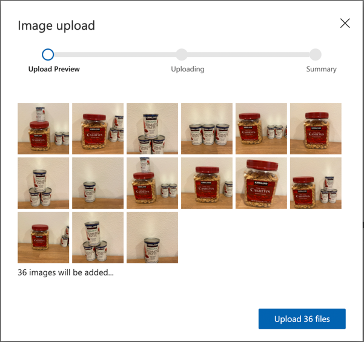

<!--
CO_OP_TRANSLATOR_METADATA:
{
  "original_hash": "8df310a42f902139a01417dacb1ffbef",
  "translation_date": "2025-08-27T22:14:50+00:00",
  "source_file": "5-retail/lessons/1-train-stock-detector/README.md",
  "language_code": "no"
}
-->
# Tren en lagerdetektor

> Sketchnote av [Nitya Narasimhan](https://github.com/nitya). Klikk på bildet for en større versjon.

Denne videoen gir en oversikt over objektdeteksjon med Azure Custom Vision-tjenesten, en tjeneste som vil bli dekket i denne leksjonen.

> 🎥 Klikk på bildet ovenfor for å se videoen

## Quiz før leksjonen

[Quiz før leksjonen](https://black-meadow-040d15503.1.azurestaticapps.net/quiz/37)

## Introduksjon

I det forrige prosjektet brukte du AI til å trene en bildekategoriserer – en modell som kan avgjøre om et bilde inneholder noe, som modne eller umodne frukter. En annen type AI-modell som kan brukes med bilder er objektdeteksjon. Disse modellene klassifiserer ikke et bilde med merkelapper, men trenes til å gjenkjenne objekter og kan finne dem i bilder, ikke bare oppdage at objektet er til stede, men også hvor det er i bildet. Dette gjør det mulig å telle objekter i bilder.

I denne leksjonen vil du lære om objektdeteksjon, inkludert hvordan det kan brukes i detaljhandel. Du vil også lære hvordan du trener en objektdetektor i skyen.

I denne leksjonen dekker vi:

* [Objektdeteksjon](../../../../../5-retail/lessons/1-train-stock-detector)
* [Bruk objektdeteksjon i detaljhandel](../../../../../5-retail/lessons/1-train-stock-detector)
* [Tren en objektdetektor](../../../../../5-retail/lessons/1-train-stock-detector)
* [Test din objektdetektor](../../../../../5-retail/lessons/1-train-stock-detector)
* [Tren din objektdetektor på nytt](../../../../../5-retail/lessons/1-train-stock-detector)

## Objektdeteksjon

Objektdeteksjon innebærer å oppdage objekter i bilder ved hjelp av AI. I motsetning til bildekategoriseringen du trente i det forrige prosjektet, handler objektdeteksjon ikke om å forutsi den beste merkelappen for et bilde som helhet, men om å finne ett eller flere objekter i et bilde.

### Objektdeteksjon vs bildekategorisering

Bildekategorisering handler om å klassifisere et bilde som helhet – hva er sannsynligheten for at hele bildet samsvarer med hver merkelapp. Du får tilbake sannsynligheter for hver merkelapp som ble brukt til å trene modellen.

I eksempelet ovenfor blir to bilder klassifisert ved hjelp av en modell trent til å klassifisere bokser med cashewnøtter eller bokser med tomatpuré. Det første bildet er en boks med cashewnøtter og har to resultater fra bildekategoriseringen:

| Merkelapp       | Sannsynlighet |
| --------------- | ------------: |
| `cashewnøtter`  | 98.4%         |
| `tomatpuré`     | 1.6%          |

Det andre bildet er av en boks med tomatpuré, og resultatene er:

| Merkelapp       | Sannsynlighet |
| --------------- | ------------: |
| `cashewnøtter`  | 0.7%          |
| `tomatpuré`     | 99.3%         |

Du kunne brukt disse verdiene med en terskelprosent for å forutsi hva som var i bildet. Men hva om et bilde inneholdt flere bokser med tomatpuré, eller både cashewnøtter og tomatpuré? Resultatene ville sannsynligvis ikke gi deg det du ønsker. Det er her objektdeteksjon kommer inn.

Objektdeteksjon innebærer å trene en modell til å gjenkjenne objekter. I stedet for å gi den bilder som inneholder objektet og fortelle den at hvert bilde er én merkelapp eller en annen, fremhever du delen av et bilde som inneholder det spesifikke objektet og merker det. Du kan merke ett enkelt objekt i et bilde eller flere. På denne måten lærer modellen hvordan selve objektet ser ut, ikke bare hvordan bilder som inneholder objektet ser ut.

Når du deretter bruker den til å forutsi bilder, får du ikke tilbake en liste med merkelapper og prosenter, men en liste med oppdagede objekter, med deres avgrensningsbokser og sannsynligheten for at objektet samsvarer med den tildelte merkelappen.

> 🎓 *Avgrensningsbokser* er boksene rundt et objekt.

Bildet ovenfor inneholder både en boks med cashewnøtter og tre bokser med tomatpuré. Objektdetektoren oppdaget cashewnøttene og returnerte avgrensningsboksen som inneholder cashewnøttene med sannsynligheten for at avgrensningsboksen inneholder objektet, i dette tilfellet 97.6%. Objektdetektoren har også oppdaget tre bokser med tomatpuré og gir tre separate avgrensningsbokser, én for hver oppdaget boks, og hver har en sannsynlighetsprosent for at avgrensningsboksen inneholder en boks med tomatpuré.

✅ Tenk på noen forskjellige scenarier der du kanskje vil bruke bildebaserte AI-modeller. Hvilke ville trenge klassifisering, og hvilke ville trenge objektdeteksjon?

### Hvordan objektdeteksjon fungerer

Objektdeteksjon bruker komplekse ML-modeller. Disse modellene fungerer ved å dele opp bildet i flere celler, og deretter sjekke om midten av avgrensningsboksen er midten av et bilde som samsvarer med ett av bildene som ble brukt til å trene modellen. Du kan tenke på dette som en slags bildekategorisering over forskjellige deler av bildet for å lete etter treff.

> 💁 Dette er en drastisk forenkling. Det finnes mange teknikker for objektdeteksjon, og du kan lese mer om dem på [Objektdeteksjon-siden på Wikipedia](https://wikipedia.org/wiki/Object_detection).

Det finnes en rekke forskjellige modeller som kan utføre objektdeteksjon. En spesielt kjent modell er [YOLO (You only look once)](https://pjreddie.com/darknet/yolo/), som er utrolig rask og kan oppdage 20 forskjellige klasser av objekter, som mennesker, hunder, flasker og biler.

✅ Les om YOLO-modellen på [pjreddie.com/darknet/yolo/](https://pjreddie.com/darknet/yolo/)

Objektdeteksjonsmodeller kan trenes på nytt ved hjelp av overføringslæring for å oppdage tilpassede objekter.

## Bruk objektdeteksjon i detaljhandel

Objektdeteksjon har flere bruksområder i detaljhandel. Noen inkluderer:

* **Lagerkontroll og telling** - gjenkjenne når lageret er lavt på hyllene. Hvis lageret er for lavt, kan varsler sendes til ansatte eller roboter for å fylle opp hyllene.
* **Maskedeteksjon** - i butikker med maskepolitikk under offentlige helsehendelser kan objektdeteksjon gjenkjenne personer med masker og de uten.
* **Automatisk fakturering** - oppdage varer som tas fra hyllene i automatiserte butikker og fakturere kundene riktig.
* **Faredeteksjon** - gjenkjenne ødelagte gjenstander på gulvet eller sølte væsker, og varsle rengjøringspersonell.

✅ Gjør litt research: Hva er noen flere bruksområder for objektdeteksjon i detaljhandel?

## Tren en objektdetektor

Du kan trene en objektdetektor ved hjelp av Custom Vision, på en lignende måte som du trente en bildekategoriserer.

### Oppgave - opprett en objektdetektor

1. Opprett en ressursgruppe for dette prosjektet kalt `stock-detector`.

1. Opprett en gratis Custom Vision-treningsressurs og en gratis Custom Vision-prediksjonsressurs i ressursgruppen `stock-detector`. Gi dem navnene `stock-detector-training` og `stock-detector-prediction`.

    > 💁 Du kan bare ha én gratis trenings- og prediksjonsressurs, så sørg for at du har ryddet opp i prosjektet fra de tidligere leksjonene.

    > ⚠️ Du kan referere til [instruksjonene for å opprette trenings- og prediksjonsressurser fra prosjekt 4, leksjon 1 hvis nødvendig](../../../4-manufacturing/lessons/1-train-fruit-detector/README.md#task---create-a-cognitive-services-resource).

1. Start Custom Vision-portalen på [CustomVision.ai](https://customvision.ai), og logg inn med Microsoft-kontoen du brukte for din Azure-konto.

1. Følg [seksjonen Opprett et nytt prosjekt i hurtigstarten for å bygge en objektdetektor på Microsoft Docs](https://docs.microsoft.com/azure/cognitive-services/custom-vision-service/get-started-build-detector?WT.mc_id=academic-17441-jabenn#create-a-new-project) for å opprette et nytt Custom Vision-prosjekt. Brukergrensesnittet kan endres, og disse dokumentene er alltid den mest oppdaterte referansen.

    Kall prosjektet ditt `stock-detector`.

    Når du oppretter prosjektet, sørg for å bruke ressursen `stock-detector-training` som du opprettet tidligere. Bruk prosjekttypen *Objektdeteksjon* og domenet *Produkter på hyller*.

    

    ✅ Domenet produkter på hyller er spesielt rettet mot å oppdage lager på butikkhyller. Les mer om de forskjellige domenene i [Velg et domene-dokumentasjonen på Microsoft Docs](https://docs.microsoft.com/azure/cognitive-services/custom-vision-service/select-domain?WT.mc_id=academic-17441-jabenn#object-detection)

✅ Ta deg tid til å utforske Custom Vision-brukergrensesnittet for din objektdetektor.

### Oppgave - tren din objektdetektor

For å trene modellen din trenger du et sett med bilder som inneholder objektene du vil oppdage.

1. Samle bilder som inneholder objektet du vil oppdage. Du trenger minst 15 bilder som inneholder hvert objekt du vil oppdage fra forskjellige vinkler og i forskjellige lysforhold, men jo flere jo bedre. Denne objektdetektoren bruker domenet *Produkter på hyller*, så prøv å sette opp objektene som om de var på en butikkhylle. Du vil også trenge noen bilder for å teste modellen. Hvis du oppdager mer enn ett objekt, vil du ha noen testbilder som inneholder alle objektene.

    > 💁 Bilder med flere forskjellige objekter teller mot minimumskravet på 15 bilder for alle objektene i bildet.

    Bildene dine bør være png eller jpeg, mindre enn 6MB. Hvis du lager dem med en iPhone, for eksempel, kan de være høyoppløselige HEIC-bilder, så de må konverteres og muligens krympes. Jo flere bilder jo bedre, og du bør ha et lignende antall modne og umodne.

    Modellen er designet for produkter på hyller, så prøv å ta bildene av objektene på hyller.

    Du kan finne noen eksempler på bilder du kan bruke i [images](../../../../../5-retail/lessons/1-train-stock-detector/images)-mappen av cashewnøtter og tomatpuré som du kan bruke.

1. Følg [seksjonen Last opp og merk bilder i hurtigstarten for å bygge en objektdetektor på Microsoft Docs](https://docs.microsoft.com/azure/cognitive-services/custom-vision-service/get-started-build-detector?WT.mc_id=academic-17441-jabenn#upload-and-tag-images) for å laste opp treningsbildene dine. Opprett relevante merkelapper avhengig av hvilke typer objekter du vil oppdage.

    

    Når du tegner avgrensningsbokser for objekter, hold dem stramme rundt objektet. Det kan ta en stund å markere alle bildene, men verktøyet vil oppdage hva det tror er avgrensningsboksene, noe som gjør det raskere.

    

    > 💁 Hvis du har mer enn 15 bilder for hvert objekt, kan du trene etter 15 og deretter bruke funksjonen **Foreslåtte merkelapper**. Dette vil bruke den trente modellen til å oppdage objektene i det umerkede bildet. Du kan deretter bekrefte de oppdagede objektene, eller avvise og tegne avgrensningsboksene på nytt. Dette kan spare *mye* tid.

1. Følg [seksjonen Tren detektoren i hurtigstarten for å bygge en objektdetektor på Microsoft Docs](https://docs.microsoft.com/azure/cognitive-services/custom-vision-service/get-started-build-detector?WT.mc_id=academic-17441-jabenn#train-the-detector) for å trene objektdetektoren på de merkede bildene dine.

    Du vil få et valg av treningstype. Velg **Rask trening**.

Objektdetektoren vil deretter trenes. Det vil ta noen minutter før treningen er fullført.

## Test din objektdetektor

Når objektdetektoren din er trent, kan du teste den ved å gi den nye bilder for å oppdage objekter i.

### Oppgave - test din objektdetektor

1. Bruk knappen **Rask test** for å laste opp testbilder og verifisere at objektene blir oppdaget. Bruk testbildene du opprettet tidligere, ikke noen av bildene du brukte til trening.

    

1. Prøv alle testbildene du har tilgang til og observer sannsynlighetene.

## Tren din objektdetektor på nytt

Når du tester objektdetektoren din, kan det hende den ikke gir de resultatene du forventer, det samme som med bildekategoriseringen i det forrige prosjektet. Du kan forbedre objektdetektoren din ved å trene den på nytt med bilder den gjør feil.

Hver gang du gjør en prediksjon ved hjelp av rask test-alternativet, lagres bildet og resultatene. Du kan bruke disse bildene til å trene modellen din på nytt.

1. Bruk fanen **Prediksjoner** for å finne bildene du brukte til testing.

1. Bekreft eventuelle nøyaktige oppdagelser, slett eventuelle feilaktige og legg til eventuelle manglende objekter.

1. Tren og test modellen på nytt.

---

## 🚀 Utfordring

Hva ville skje hvis du brukte objektdetektoren med lignende utseende gjenstander, som bokser med tomatpuré og hakkede tomater fra samme merke?

Hvis du har noen lignende utseende gjenstander, test det ut ved å legge til bilder av dem i objektdetektoren.

## Quiz etter leksjonen
[Etter-forelesningsquiz](https://black-meadow-040d15503.1.azurestaticapps.net/quiz/38)

## Gjennomgang og selvstudium

* Da du trente objektgjenkjenneren din, så du verdier for *Precision*, *Recall* og *mAP* som vurderer modellen som ble laget. Les om hva disse verdiene betyr ved å bruke [seksjonen Evaluer gjenkjenneren i Hurtigstart for å bygge en objektgjenkjenner på Microsoft-dokumentasjonen](https://docs.microsoft.com/azure/cognitive-services/custom-vision-service/get-started-build-detector?WT.mc_id=academic-17441-jabenn#evaluate-the-detector)
* Les mer om objektgjenkjenning på [siden om objektgjenkjenning på Wikipedia](https://wikipedia.org/wiki/Object_detection)

## Oppgave

[Sammenlign domener](assignment.md)

---

**Ansvarsfraskrivelse**:  
Dette dokumentet er oversatt ved hjelp av AI-oversettelsestjenesten [Co-op Translator](https://github.com/Azure/co-op-translator). Selv om vi streber etter nøyaktighet, vær oppmerksom på at automatiske oversettelser kan inneholde feil eller unøyaktigheter. Det originale dokumentet på sitt opprinnelige språk bør anses som den autoritative kilden. For kritisk informasjon anbefales profesjonell menneskelig oversettelse. Vi er ikke ansvarlige for eventuelle misforståelser eller feiltolkninger som oppstår ved bruk av denne oversettelsen.