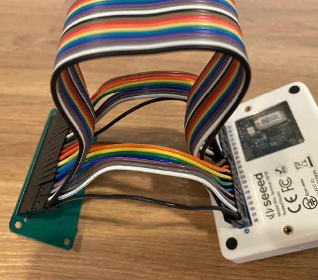

<!--
CO_OP_TRANSLATOR_METADATA:
{
  "original_hash": "93d352de36526b8990e41dd538100324",
  "translation_date": "2025-08-27T21:06:24+00:00",
  "source_file": "6-consumer/lessons/1-speech-recognition/wio-terminal-microphone.md",
  "language_code": "no"
}
-->
# Konfigurer mikrofon og høyttalere - Wio Terminal

I denne delen av leksjonen skal du legge til høyttalere til din Wio Terminal. Wio Terminal har allerede en innebygd mikrofon som kan brukes til å fange opp tale.

## Maskinvare

Wio Terminal har allerede en innebygd mikrofon som kan brukes til å fange opp lyd for talegjenkjenning.

For å legge til en høyttaler kan du bruke [ReSpeaker 2-Mics Pi Hat](https://www.seeedstudio.com/ReSpeaker-2-Mics-Pi-HAT.html). Dette er et eksternt kort som inneholder 2 MEMS-mikrofoner, samt en høyttalerkontakt og hodetelefonutgang.

Du må legge til enten hodetelefoner, en høyttaler med en 3,5 mm jack, eller en høyttaler med en JST-tilkobling, som for eksempel [Mono Enclosed Speaker - 2W 6 Ohm](https://www.seeedstudio.com/Mono-Enclosed-Speaker-2W-6-Ohm-p-2832.html).

For å koble til ReSpeaker 2-Mics Pi Hat trenger du 40 pin-til-pin (også kalt hann-til-hann) jumperkabler.

> 💁 Hvis du er komfortabel med lodding, kan du bruke [40 Pin Raspberry Pi Hat Adapter Board For Wio Terminal](https://www.seeedstudio.com/40-Pin-Raspberry-Pi-Hat-Adapter-Board-For-Wio-Terminal-p-4730.html) for å koble til ReSpeaker.

Du trenger også et SD-kort for å laste ned og spille av lyd. Wio Terminal støtter kun SD-kort opptil 16 GB i størrelse, og disse må være formatert som FAT32 eller exFAT.

### Oppgave - koble til ReSpeaker Pi Hat

1. Med Wio Terminal slått av, koble ReSpeaker 2-Mics Pi Hat til Wio Terminal ved hjelp av jumperkabler og GPIO-kontaktene på baksiden av Wio Terminal:

    Pinnene må kobles på denne måten:

    

1. Plasser ReSpeaker og Wio Terminal med GPIO-kontaktene vendt oppover, og på venstre side.

1. Start fra kontakten øverst til venstre på GPIO-kontakten på ReSpeaker. Koble en pin-til-pin jumperkabel fra øverste venstre kontakt på ReSpeaker til øverste venstre kontakt på Wio Terminal.

1. Gjenta dette hele veien nedover GPIO-kontaktene på venstre side. Sørg for at pinnene sitter godt fast.

    

    

    > 💁 Hvis jumperkablene dine er koblet sammen i bånd, hold dem samlet - det gjør det enklere å sikre at du har koblet alle kablene i riktig rekkefølge.

1. Gjenta prosessen med GPIO-kontaktene på høyre side av ReSpeaker og Wio Terminal. Disse kablene må gå rundt kablene som allerede er på plass.

    

    

    > 💁 Hvis jumperkablene dine er koblet sammen i bånd, del dem opp i to bånd. Før ett på hver side av de eksisterende kablene.

    > 💁 Du kan bruke tape for å holde pinnene samlet i en blokk for å forhindre at noen løsner mens du kobler dem til.
    >
    > 

1. Du må legge til en høyttaler.

    * Hvis du bruker en høyttaler med en JST-kabel, koble den til JST-porten på ReSpeaker.

      

    * Hvis du bruker en høyttaler med en 3,5 mm jack eller hodetelefoner, sett dem inn i 3,5 mm jack-kontakten.

      

### Oppgave - sett opp SD-kortet

1. Koble SD-kortet til datamaskinen din, bruk en ekstern leser hvis du ikke har en SD-kortspor.

1. Formater SD-kortet ved hjelp av riktig verktøy på datamaskinen din, og sørg for å bruke et FAT32- eller exFAT-filsystem.

1. Sett SD-kortet inn i SD-kortsporet på venstre side av Wio Terminal, rett under av/på-knappen. Sørg for at kortet er helt inne og klikker på plass - du kan trenge et tynt verktøy eller et annet SD-kort for å hjelpe til med å trykke det helt inn.

    

    > 💁 For å ta ut SD-kortet må du trykke det litt inn, og det vil sprette ut. Du trenger et tynt verktøy for dette, som en flat skrutrekker eller et annet SD-kort.

---

**Ansvarsfraskrivelse**:  
Dette dokumentet er oversatt ved hjelp av AI-oversettelsestjenesten [Co-op Translator](https://github.com/Azure/co-op-translator). Selv om vi streber etter nøyaktighet, vær oppmerksom på at automatiserte oversettelser kan inneholde feil eller unøyaktigheter. Det originale dokumentet på sitt opprinnelige språk bør anses som den autoritative kilden. For kritisk informasjon anbefales profesjonell menneskelig oversettelse. Vi er ikke ansvarlige for misforståelser eller feiltolkninger som oppstår ved bruk av denne oversettelsen.