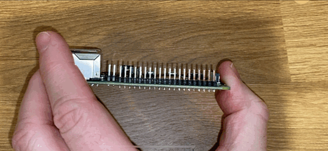

<!--
CO_OP_TRANSLATOR_METADATA:
{
  "original_hash": "8ff0d0a1d29832bb896b9c103b69a452",
  "translation_date": "2025-08-27T13:08:41+00:00",
  "source_file": "1-getting-started/lessons/1-introduction-to-iot/pi.md",
  "language_code": "pa"
}
-->
# ਰਾਸਪਬੈਰੀ ਪਾਈ

[ਰਾਸਪਬੈਰੀ ਪਾਈ](https://raspberrypi.org) ਇੱਕ ਸਿੰਗਲ-ਬੋਰਡ ਕੰਪਿਊਟਰ ਹੈ। ਤੁਸੀਂ ਸੈਂਸਰ ਅਤੇ ਐਕਚੁਏਟਰ ਨੂੰ ਵੱਖ-ਵੱਖ ਡਿਵਾਈਸ ਅਤੇ ਈਕੋਸਿਸਟਮ ਦੀ ਵਰਤੋਂ ਕਰਕੇ ਜੋੜ ਸਕਦੇ ਹੋ। ਇਸ ਪਾਠ ਵਿੱਚ, ਤੁਸੀਂ ਇੱਕ ਹਾਰਡਵੇਅਰ ਈਕੋਸਿਸਟਮ [Grove](https://www.seeedstudio.com/category/Grove-c-1003.html) ਦੀ ਵਰਤੋਂ ਕਰ ਰਹੇ ਹੋ। ਤੁਸੀਂ Python ਦੀ ਵਰਤੋਂ ਕਰਕੇ ਆਪਣੇ Pi ਨੂੰ ਕੋਡ ਕਰੋਗੇ ਅਤੇ Grove ਸੈਂਸਰਾਂ ਤੱਕ ਪਹੁੰਚ ਹਾਸਲ ਕਰੋਗੇ।


## ਸੈਟਅਪ

ਜੇ ਤੁਸੀਂ ਰਾਸਪਬੈਰੀ ਪਾਈ ਨੂੰ ਆਪਣੇ IoT ਹਾਰਡਵੇਅਰ ਵਜੋਂ ਵਰਤ ਰਹੇ ਹੋ, ਤਾਂ ਤੁਹਾਡੇ ਕੋਲ ਦੋ ਚੋਣਾਂ ਹਨ - ਤੁਸੀਂ ਸਿੱਧੇ Pi 'ਤੇ ਸਾਰੇ ਪਾਠਾਂ ਅਤੇ ਕੋਡ 'ਤੇ ਕੰਮ ਕਰ ਸਕਦੇ ਹੋ, ਜਾਂ ਤੁਸੀਂ 'headless' Pi ਨਾਲ ਦੂਰੋਂ ਕਨੈਕਟ ਕਰਕੇ ਆਪਣੇ ਕੰਪਿਊਟਰ ਤੋਂ ਕੋਡ ਕਰ ਸਕਦੇ ਹੋ।

ਸ਼ੁਰੂ ਕਰਨ ਤੋਂ ਪਹਿਲਾਂ, ਤੁਹਾਨੂੰ ਆਪਣੇ Pi ਨਾਲ Grove Base Hat ਨੂੰ ਵੀ ਜੁੜਨਾ ਹੋਵੇਗਾ।

### ਕੰਮ - ਸੈਟਅਪ

ਆਪਣੇ Pi 'ਤੇ Grove Base Hat ਇੰਸਟਾਲ ਕਰੋ ਅਤੇ Pi ਨੂੰ ਕਨਫਿਗਰ ਕਰੋ।

1. Grove Base Hat ਨੂੰ ਆਪਣੇ Pi ਨਾਲ ਜੁੜੋ। Hat ਦਾ ਸਾਕਟ Pi ਦੇ ਸਾਰੇ GPIO ਪਿੰਨ 'ਤੇ ਫਿੱਟ ਹੁੰਦਾ ਹੈ, ਪਿੰਨਾਂ ਦੇ ਸਿਰੇ ਤੱਕ ਸਲਾਈਡ ਕਰਦਾ ਹੈ ਅਤੇ Pi ਦੇ ਬੇਸ 'ਤੇ ਪੱਕਾ ਬੈਠਦਾ ਹੈ। ਇਹ Pi ਦੇ ਉੱਤੇ ਬੈਠਦਾ ਹੈ ਅਤੇ ਇਸਨੂੰ ਕਵਰ ਕਰਦਾ ਹੈ।

    

1. ਇਹ ਫੈਸਲਾ ਕਰੋ ਕਿ ਤੁਸੀਂ ਆਪਣੇ Pi ਨੂੰ ਕਿਵੇਂ ਪ੍ਰੋਗਰਾਮ ਕਰਨਾ ਚਾਹੁੰਦੇ ਹੋ, ਅਤੇ ਹੇਠਾਂ ਦਿੱਤੇ ਸਬੰਧਤ ਸੈਕਸ਼ਨ 'ਤੇ ਜਾਓ:

    * [ਸਿੱਧੇ Pi 'ਤੇ ਕੰਮ ਕਰੋ](../../../../../1-getting-started/lessons/1-introduction-to-iot)
    * [Pi ਨੂੰ ਕੋਡ ਕਰਨ ਲਈ ਦੂਰੋਂ ਪਹੁੰਚ](../../../../../1-getting-started/lessons/1-introduction-to-iot)

### ਸਿੱਧੇ Pi 'ਤੇ ਕੰਮ ਕਰੋ

ਜੇ ਤੁਸੀਂ ਸਿੱਧੇ Pi 'ਤੇ ਕੰਮ ਕਰਨਾ ਚਾਹੁੰਦੇ ਹੋ, ਤਾਂ ਤੁਸੀਂ ਰਾਸਪਬੈਰੀ ਪਾਈ OS ਦੇ ਡੈਸਕਟਾਪ ਵਰਜਨ ਦੀ ਵਰਤੋਂ ਕਰ ਸਕਦੇ ਹੋ ਅਤੇ ਤੁਹਾਨੂੰ ਲੋੜੀਂਦੇ ਸਾਰੇ ਟੂਲ ਇੰਸਟਾਲ ਕਰ ਸਕਦੇ ਹੋ।

#### ਕੰਮ - ਸਿੱਧੇ Pi 'ਤੇ ਕੰਮ ਕਰੋ

ਡਿਵੈਲਪਮੈਂਟ ਲਈ ਆਪਣੇ Pi ਨੂੰ ਸੈਟਅਪ ਕਰੋ।

1. [ਰਾਸਪਬੈਰੀ ਪਾਈ ਸੈਟਅਪ ਗਾਈਡ](https://projects.raspberrypi.org/en/projects/raspberry-pi-setting-up) ਵਿੱਚ ਦਿੱਤੇ ਨਿਰਦੇਸ਼ਾਂ ਦੀ ਪਾਲਣਾ ਕਰੋ, ਆਪਣੇ Pi ਨੂੰ ਕੀਬੋਰਡ/ਮਾਊਸ/ਮਾਨੀਟਰ ਨਾਲ ਜੁੜੋ, ਇਸਨੂੰ ਆਪਣੇ WiFi ਜਾਂ ਈਥਰਨੈਟ ਨੈਟਵਰਕ ਨਾਲ ਜੁੜੋ, ਅਤੇ ਸੌਫਟਵੇਅਰ ਨੂੰ ਅਪਡੇਟ ਕਰੋ।

Pi ਨੂੰ Grove ਸੈਂਸਰ ਅਤੇ ਐਕਚੁਏਟਰ ਦੀ ਵਰਤੋਂ ਕਰਕੇ ਪ੍ਰੋਗਰਾਮ ਕਰਨ ਲਈ, ਤੁਹਾਨੂੰ ਇੱਕ ਐਡੀਟਰ ਇੰਸਟਾਲ ਕਰਨ ਦੀ ਲੋੜ ਹੋਵੇਗੀ ਜੋ ਤੁਹਾਨੂੰ ਡਿਵਾਈਸ ਕੋਡ ਲਿਖਣ ਦੀ ਆਗਿਆ ਦੇਵੇ, ਅਤੇ ਵੱਖ-ਵੱਖ ਲਾਇਬ੍ਰੇਰੀਆਂ ਅਤੇ ਟੂਲ ਜੋ Grove ਹਾਰਡਵੇਅਰ ਨਾਲ ਇੰਟਰੈਕਟ ਕਰਦੇ ਹਨ।

1. ਜਦੋਂ ਤੁਹਾਡਾ Pi ਰੀਬੂਟ ਹੋ ਜਾਵੇ, **Terminal** ਆਈਕਨ 'ਤੇ ਕਲਿਕ ਕਰਕੇ ਟਰਮੀਨਲ ਲਾਂਚ ਕਰੋ, ਜਾਂ *Menu -> Accessories -> Terminal* ਚੁਣੋ।

1. ਇਹ ਕਮਾਂਡ ਚਲਾਓ ਤਾਂ ਜੋ OS ਅਤੇ ਇੰਸਟਾਲ ਕੀਤੇ ਸੌਫਟਵੇਅਰ ਨੂੰ ਅਪਡੇਟ ਕੀਤਾ ਜਾ ਸਕੇ:

    ```sh
    sudo apt update && sudo apt full-upgrade --yes
    ```

1. Grove ਹਾਰਡਵੇਅਰ ਲਈ ਲੋੜੀਂਦੇ ਸਾਰੇ ਲਾਇਬ੍ਰੇਰੀਆਂ ਨੂੰ ਇੰਸਟਾਲ ਕਰਨ ਲਈ ਹੇਠਾਂ ਦਿੱਤੀਆਂ ਕਮਾਂਡਾਂ ਚਲਾਓ:

    ```sh
    sudo apt install git python3-dev python3-pip --yes

    git clone https://github.com/Seeed-Studio/grove.py
    cd grove.py
    sudo pip3 install .

    sudo raspi-config nonint do_i2c 0
    ```

    ਇਹ Git ਨੂੰ ਇੰਸਟਾਲ ਕਰਨ ਨਾਲ ਸ਼ੁਰੂ ਹੁੰਦਾ ਹੈ, ਨਾਲ ਹੀ Python ਪੈਕੇਜਾਂ ਨੂੰ ਇੰਸਟਾਲ ਕਰਨ ਲਈ Pip।

    Python ਦੀ ਇੱਕ ਸ਼ਕਤੀਸ਼ਾਲੀ ਵਿਸ਼ੇਸ਼ਤਾ [Pip ਪੈਕੇਜ](https://pypi.org) ਇੰਸਟਾਲ ਕਰਨ ਦੀ ਯੋਗਤਾ ਹੈ - ਇਹ ਇੰਟਰਨੈਟ 'ਤੇ ਪ੍ਰਕਾਸ਼ਿਤ ਹੋਏ ਹੋਰ ਲੋਕਾਂ ਦੁਆਰਾ ਲਿਖੇ ਕੋਡ ਦੇ ਪੈਕੇਜ ਹਨ। ਤੁਸੀਂ ਇੱਕ ਕਮਾਂਡ ਨਾਲ ਆਪਣੇ ਕੰਪਿਊਟਰ 'ਤੇ Pip ਪੈਕੇਜ ਇੰਸਟਾਲ ਕਰ ਸਕਦੇ ਹੋ, ਫਿਰ ਆਪਣੇ ਕੋਡ ਵਿੱਚ ਉਸ ਪੈਕੇਜ ਦੀ ਵਰਤੋਂ ਕਰ ਸਕਦੇ ਹੋ।

    Seeed Grove Python ਪੈਕੇਜਾਂ ਨੂੰ ਸਰੋਤ ਤੋਂ ਇੰਸਟਾਲ ਕਰਨ ਦੀ ਲੋੜ ਹੈ। ਇਹ ਕਮਾਂਡਾਂ ਇਸ ਪੈਕੇਜ ਲਈ ਸਰੋਤ ਕੋਡ ਵਾਲੇ ਰਿਪੋ ਨੂੰ ਕਲੋਨ ਕਰਨਗੀਆਂ, ਫਿਰ ਇਸਨੂੰ ਸਥਾਨਕ ਤੌਰ 'ਤੇ ਇੰਸਟਾਲ ਕਰਨਗੀਆਂ।

    > 💁 ਡਿਫਾਲਟ ਤੌਰ 'ਤੇ ਜਦੋਂ ਤੁਸੀਂ ਇੱਕ ਪੈਕੇਜ ਇੰਸਟਾਲ ਕਰਦੇ ਹੋ, ਤਾਂ ਇਹ ਤੁਹਾਡੇ ਕੰਪਿਊਟਰ 'ਤੇ ਹਰ ਜਗ੍ਹਾ ਉਪਲਬਧ ਹੁੰਦਾ ਹੈ, ਅਤੇ ਇਹ ਪੈਕੇਜ ਵਰਜਨਾਂ ਨਾਲ ਸਮੱਸਿਆਵਾਂ ਪੈਦਾ ਕਰ ਸਕਦਾ ਹੈ - ਜਿਵੇਂ ਕਿ ਇੱਕ ਐਪਲੀਕੇਸ਼ਨ ਇੱਕ ਪੈਕੇਜ ਦੇ ਇੱਕ ਵਰਜਨ 'ਤੇ ਨਿਰਭਰ ਹੁੰਦੀ ਹੈ ਜੋ ਇੱਕ ਹੋਰ ਐਪਲੀਕੇਸ਼ਨ ਲਈ ਇੱਕ ਨਵਾਂ ਵਰਜਨ ਇੰਸਟਾਲ ਕਰਨ 'ਤੇ ਟੁੱਟ ਜਾਂਦੀ ਹੈ। ਇਸ ਸਮੱਸਿਆ ਨੂੰ ਹੱਲ ਕਰਨ ਲਈ, ਤੁਸੀਂ [Python ਵਰਚੁਅਲ ਐਨਵਾਇਰਨਮੈਂਟ](https://docs.python.org/3/library/venv.html) ਦੀ ਵਰਤੋਂ ਕਰ ਸਕਦੇ ਹੋ, ਅਸਲ ਵਿੱਚ Python ਦੀ ਇੱਕ ਕਾਪੀ ਇੱਕ ਸਮਰਪਿਤ ਫੋਲਡਰ ਵਿੱਚ, ਅਤੇ ਜਦੋਂ ਤੁਸੀਂ Pip ਪੈਕੇਜ ਇੰਸਟਾਲ ਕਰਦੇ ਹੋ, ਤਾਂ ਉਹ ਸਿਰਫ ਉਸ ਫੋਲਡਰ ਵਿੱਚ ਇੰਸਟਾਲ ਹੁੰਦੇ ਹਨ। Pi ਦੀ ਵਰਤੋਂ ਕਰਦੇ ਸਮੇਂ ਤੁਸੀਂ ਵਰਚੁਅਲ ਐਨਵਾਇਰਨਮੈਂਟ ਦੀ ਵਰਤੋਂ ਨਹੀਂ ਕਰ ਰਹੇ ਹੋ। Grove ਇੰਸਟਾਲ ਸਕ੍ਰਿਪਟ Grove Python ਪੈਕੇਜਾਂ ਨੂੰ ਗਲੋਬਲ ਤੌਰ 'ਤੇ ਇੰਸਟਾਲ ਕਰਦਾ ਹੈ, ਇਸ ਲਈ ਵਰਚੁਅਲ ਐਨਵਾਇਰਨਮੈਂਟ ਦੀ ਵਰਤੋਂ ਕਰਨ ਲਈ ਤੁਹਾਨੂੰ ਇੱਕ ਵਰਚੁਅਲ ਐਨਵਾਇਰਨਮੈਂਟ ਸੈਟਅਪ ਕਰਨਾ ਪਵੇਗਾ ਫਿਰ ਉਸ ਐਨਵਾਇਰਨਮੈਂਟ ਦੇ ਅੰਦਰ Grove ਪੈਕੇਜਾਂ ਨੂੰ ਮੈਨੂਅਲੀ ਦੁਬਾਰਾ ਇੰਸਟਾਲ ਕਰਨਾ ਪਵੇਗਾ। ਗਲੋਬਲ ਪੈਕੇਜਾਂ ਦੀ ਵਰਤੋਂ ਕਰਨਾ ਆਸਾਨ ਹੈ, ਖਾਸ ਕਰਕੇ ਜਦੋਂ ਬਹੁਤ ਸਾਰੇ Pi ਡਿਵੈਲਪਰ ਹਰ ਪ੍ਰੋਜੈਕਟ ਲਈ ਇੱਕ ਸਾਫ਼ SD ਕਾਰਡ ਨੂੰ ਦੁਬਾਰਾ ਫਲੈਸ਼ ਕਰਦੇ ਹਨ।

    ਆਖਰਕਾਰ, ਇਹ I<sup>2</sup>C ਇੰਟਰਫੇਸ ਨੂੰ ਯੋਗ ਕਰਦਾ ਹੈ।

1. Pi ਨੂੰ ਰੀਬੂਟ ਕਰੋ ਜਾਂ ਮੀਨੂ ਦੀ ਵਰਤੋਂ ਕਰਕੇ ਜਾਂ ਟਰਮੀਨਲ ਵਿੱਚ ਹੇਠਾਂ ਦਿੱਤੀ ਕਮਾਂਡ ਚਲਾਉਣ:

    ```sh
    sudo reboot
    ```

1. ਜਦੋਂ Pi ਰੀਬੂਟ ਹੋ ਜਾਵੇ, ਟਰਮੀਨਲ ਨੂੰ ਦੁਬਾਰਾ ਲਾਂਚ ਕਰੋ ਅਤੇ ਹੇਠਾਂ ਦਿੱਤੀ ਕਮਾਂਡ ਚਲਾਓ [Visual Studio Code (VS Code)](https://code.visualstudio.com?WT.mc_id=academic-17441-jabenn) ਇੰਸਟਾਲ ਕਰਨ ਲਈ - ਇਹ ਉਹ ਐਡੀਟਰ ਹੈ ਜਿਸਦੀ ਤੁਸੀਂ Python ਵਿੱਚ ਆਪਣੇ ਡਿਵਾਈਸ ਕੋਡ ਨੂੰ ਲਿਖਣ ਲਈ ਵਰਤੋਂ ਕਰ ਰਹੇ ਹੋ।

    ```sh
    sudo apt install code
    ```

    ਜਦੋਂ ਇਹ ਇੰਸਟਾਲ ਹੋ ਜਾਵੇ, VS Code ਉੱਪਰਲੇ ਮੀਨੂ ਤੋਂ ਉਪਲਬਧ ਹੋਵੇਗਾ।

    > 💁 ਤੁਸੀਂ ਆਪਣੇ ਪਸੰਦੀਦਾ ਟੂਲ ਦੇ ਤੌਰ 'ਤੇ ਕੋਈ ਵੀ Python IDE ਜਾਂ ਐਡੀਟਰ ਵਰਤ ਸਕਦੇ ਹੋ, ਪਰ ਪਾਠਾਂ ਵਿੱਚ VS Code ਦੀ ਵਰਤੋਂ ਕਰਨ ਦੇ ਨਿਰਦੇਸ਼ ਦਿੱਤੇ ਜਾਣਗੇ।

1. Pylance ਇੰਸਟਾਲ ਕਰੋ। ਇਹ VS Code ਲਈ ਇੱਕ ਐਕਸਟੈਂਸ਼ਨ ਹੈ ਜੋ Python ਭਾਸ਼ਾ ਸਹਾਇਤਾ ਪ੍ਰਦਾਨ ਕਰਦਾ ਹੈ। VS Code ਵਿੱਚ ਇਸ ਐਕਸਟੈਂਸ਼ਨ ਨੂੰ ਇੰਸਟਾਲ ਕਰਨ ਦੇ ਨਿਰਦੇਸ਼ਾਂ ਲਈ [Pylance ਐਕਸਟੈਂਸ਼ਨ ਡੌਕੂਮੈਂਟੇਸ਼ਨ](https://marketplace.visualstudio.com/items?WT.mc_id=academic-17441-jabenn&itemName=ms-python.vscode-pylance) ਨੂੰ ਵੇਖੋ।

### Pi ਨੂੰ ਕੋਡ ਕਰਨ ਲਈ ਦੂਰੋਂ ਪਹੁੰਚ

Pi 'ਤੇ ਸਿੱਧੇ ਕੋਡ ਕਰਨ ਦੀ ਬਜਾਏ, ਇਹ 'headless' ਚੱਲ ਸਕਦਾ ਹੈ, ਜਿਸਦਾ ਮਤਲਬ ਹੈ ਕਿ ਇਹ ਕੀਬੋਰਡ/ਮਾਊਸ/ਮਾਨੀਟਰ ਨਾਲ ਨਹੀਂ ਜੁੜਿਆ ਹੋਇਆ ਹੈ। ਤੁਸੀਂ ਆਪਣੇ ਕੰਪਿਊਟਰ ਤੋਂ ਇਸਨੂੰ ਕਨਫਿਗਰ ਅਤੇ ਕੋਡ ਕਰ ਸਕਦੇ ਹੋ, Visual Studio Code ਦੀ ਵਰਤੋਂ ਕਰਕੇ।

#### Pi OS ਸੈਟਅਪ ਕਰੋ

ਦੂਰੋਂ ਕੋਡ ਕਰਨ ਲਈ, Pi OS ਨੂੰ SD ਕਾਰਡ 'ਤੇ ਇੰਸਟਾਲ ਕਰਨ ਦੀ ਲੋੜ ਹੈ।

##### ਕੰਮ - Pi OS ਸੈਟਅਪ ਕਰੋ

'headless' Pi OS ਸੈਟਅਪ ਕਰੋ।

1. **ਰਾਸਪਬੈਰੀ ਪਾਈ ਇਮੇਜਰ** ਨੂੰ [ਰਾਸਪਬੈਰੀ ਪਾਈ OS ਸੌਫਟਵੇਅਰ ਪੇਜ](https://www.raspberrypi.org/software/) ਤੋਂ ਡਾਊਨਲੋਡ ਕਰੋ ਅਤੇ ਇਸਨੂੰ ਇੰਸਟਾਲ ਕਰੋ।

1. SD ਕਾਰਡ ਨੂੰ ਆਪਣੇ ਕੰਪਿਊਟਰ ਵਿੱਚ ਪਾਓ, ਜੇ ਲੋੜ ਹੋਵੇ ਤਾਂ ਐਡਾਪਟਰ ਦੀ ਵਰਤੋਂ ਕਰੋ।

1. ਰਾਸਪਬੈਰੀ ਪਾਈ ਇਮੇਜਰ ਲਾਂਚ ਕਰੋ।

1. ਰਾਸਪਬੈਰੀ ਪਾਈ ਇਮੇਜਰ ਤੋਂ, **CHOOSE OS** ਬਟਨ ਚੁਣੋ, ਫਿਰ *Raspberry Pi OS (Other)* ਚੁਣੋ, ਅਤੇ *Raspberry Pi OS Lite (32-bit)* ਚੁਣੋ।

    

    > 💁 Raspberry Pi OS Lite ਰਾਸਪਬੈਰੀ ਪਾਈ OS ਦਾ ਇੱਕ ਵਰਜਨ ਹੈ ਜਿਸ ਵਿੱਚ ਡੈਸਕਟਾਪ UI ਜਾਂ UI ਅਧਾਰਿਤ ਟੂਲ ਨਹੀਂ ਹਨ। ਇਹ 'headless' Pi ਲਈ ਲੋੜੀਂਦੇ ਨਹੀਂ ਹਨ ਅਤੇ ਇੰਸਟਾਲ ਨੂੰ ਛੋਟਾ ਅਤੇ ਬੂਟ ਅੱਪ ਸਮਾਂ ਤੇਜ਼ ਬਣਾਉਂਦੇ ਹਨ।

1. **CHOOSE STORAGE** ਬਟਨ ਚੁਣੋ, ਫਿਰ ਆਪਣੇ SD ਕਾਰਡ ਨੂੰ ਚੁਣੋ।

1. **Advanced Options** ਲਾਂਚ ਕਰਨ ਲਈ `Ctrl+Shift+X` ਦਬਾਓ। ਇਹ ਵਿਕਲਪ ਰਾਸਪਬੈਰੀ ਪਾਈ OS ਨੂੰ SD ਕਾਰਡ 'ਤੇ ਇਮੇਜ ਕਰਨ ਤੋਂ ਪਹਿਲਾਂ ਕੁਝ ਪ੍ਰੀ-ਕਨਫਿਗਰੇਸ਼ਨ ਦੀ ਆਗਿਆ ਦਿੰਦੇ ਹਨ।

    1. **Enable SSH** ਚੈਕ ਬਾਕਸ ਨੂੰ ਚੈੱਕ ਕਰੋ, ਅਤੇ `pi` ਯੂਜ਼ਰ ਲਈ ਪਾਸਵਰਡ ਸੈਟ ਕਰੋ। ਇਹ ਉਹ ਪਾਸਵਰਡ ਹੈ ਜੋ ਤੁਸੀਂ ਬਾਅਦ ਵਿੱਚ Pi ਵਿੱਚ ਲੌਗਇਨ ਕਰਨ ਲਈ ਵਰਤੋਂ ਕਰੋਗੇ।

    1. ਜੇ ਤੁਸੀਂ Pi ਨੂੰ WiFi 'ਤੇ ਕਨੈਕਟ ਕਰਨ ਦੀ ਯੋਜਨਾ ਬਣਾ ਰਹੇ ਹੋ, **Configure WiFi** ਚੈਕ ਬਾਕਸ ਨੂੰ ਚੈੱਕ ਕਰੋ, ਅਤੇ ਆਪਣਾ WiFi SSID ਅਤੇ ਪਾਸਵਰਡ ਦਰਜ ਕਰੋ, ਨਾਲ ਹੀ ਆਪਣਾ WiFi ਦੇਸ਼ ਚੁਣੋ। ਜੇ ਤੁਸੀਂ ਈਥਰਨੈਟ ਕੇਬਲ ਦੀ ਵਰਤੋਂ ਕਰ ਰਹੇ ਹੋ ਤਾਂ ਇਹ ਕਰਨ ਦੀ ਲੋੜ ਨਹੀਂ ਹੈ। ਯਕੀਨੀ ਬਣਾਓ ਕਿ ਤੁਸੀਂ ਜਿਸ ਨੈਟਵਰਕ ਨਾਲ ਜੁੜ ਰਹੇ ਹੋ ਉਹ ਤੁਹਾਡੇ ਕੰਪਿਊਟਰ ਵਾਲੇ ਨੈਟਵਰਕ ਦੇ ਸਮਾਨ ਹੈ।

    1. **Set locale settings** ਚੈਕ ਬਾਕਸ ਨੂੰ ਚੈੱਕ ਕਰੋ, ਅਤੇ ਆਪਣਾ ਦੇਸ਼ ਅਤੇ ਸਮਾਂ ਖੇਤਰ ਸੈਟ ਕਰੋ।

    1. **SAVE** ਬਟਨ ਚੁਣੋ।

1. SD ਕਾਰਡ 'ਤੇ OS ਲਿਖਣ ਲਈ **WRITE** ਬਟਨ ਚੁਣੋ। ਜੇ ਤੁਸੀਂ macOS ਦੀ ਵਰਤੋਂ ਕਰ ਰਹੇ ਹੋ, ਤਾਂ ਤੁਹਾਨੂੰ ਆਪਣਾ ਪਾਸਵਰਡ ਦਰਜ ਕਰਨ ਲਈ ਕਿਹਾ ਜਾਵੇਗਾ ਕਿਉਂਕਿ ਡਿਸਕ ਇਮੇਜ ਲਿਖਣ ਵਾਲਾ ਟੂਲ ਵਿਸ਼ੇਸ਼ ਪਹੁੰਚ ਦੀ ਲੋੜ ਰੱਖਦਾ ਹੈ।

OS SD ਕਾਰਡ 'ਤੇ ਲਿਖਿਆ ਜਾਵੇਗਾ, ਅਤੇ ਜਦੋਂ ਇਹ ਪੂਰਾ ਹੋ ਜਾਵੇ, OS SD ਕਾਰਡ ਨੂੰ ਬਾਹਰ ਕੱਢੇਗਾ ਅਤੇ ਤੁਹਾਨੂੰ ਸੂਚਿਤ ਕਰੇਗਾ। SD ਕਾਰਡ ਨੂੰ ਆਪਣੇ ਕੰਪਿਊਟਰ ਤੋਂ ਹਟਾਓ, ਇਸਨੂੰ Pi ਵਿੱਚ ਪਾਓ, Pi ਨੂੰ ਪਾਵਰ ਦਿਓ ਅਤੇ ਇਸਨੂੰ ਠੀਕ ਤੌਰ 'ਤੇ ਬੂਟ ਕਰਨ ਲਈ ਲਗਭਗ 2 ਮਿੰਟ ਦੀ ਉਡੀਕ ਕਰੋ।

#### Pi ਨਾਲ ਕਨੈਕਟ ਕਰੋ

ਅਗਲਾ ਕਦਮ Pi ਤੱਕ ਦੂਰੋਂ ਪਹੁੰਚ ਪ੍ਰਾਪਤ ਕਰਨਾ ਹੈ। ਤੁਸੀਂ ਇਹ `ssh` ਦੀ ਵਰਤੋਂ ਕਰਕੇ ਕਰ ਸਕਦੇ ਹੋ, ਜੋ macOS, Linux ਅਤੇ Windows ਦੇ ਹਾਲੀਆ ਵਰਜਨਾਂ 'ਤੇ ਉਪਲਬਧ ਹੈ।

##### ਕੰਮ - Pi ਨਾਲ ਕਨੈਕਟ ਕਰੋ

Pi ਤੱਕ ਦੂਰੋਂ ਪਹੁੰਚ ਪ੍ਰਾਪਤ ਕਰੋ।

1. ਟਰਮੀਨਲ ਜਾਂ ਕਮਾਂਡ ਪ੍ਰਾਂਪਟ ਲਾਂਚ ਕਰੋ, ਅਤੇ Pi ਨਾਲ ਕਨੈਕਟ ਕਰਨ ਲਈ ਹੇਠਾਂ ਦਿੱਤੀ ਕਮਾਂਡ ਦਰਜ ਕਰੋ:

    ```sh
    ssh pi@raspberrypi.local
    ```

    ਜੇ ਤੁਸੀਂ Windows ਦੇ ਪੁਰਾਣੇ ਵਰਜਨ ਦੀ ਵਰਤੋਂ ਕਰ ਰਹੇ ਹੋ ਜਿਸ ਵਿੱਚ `ssh` ਇੰਸਟਾਲ ਨਹੀਂ ਹੈ, ਤਾਂ ਤੁਸੀਂ OpenSSH ਦੀ ਵਰਤੋਂ ਕਰ ਸਕਦੇ ਹੋ। [OpenSSH ਇੰਸਟਾਲੇਸ਼ਨ ਡੌਕੂਮੈਂਟੇਸ਼ਨ](https://docs.microsoft.com//windows-server/administration/openssh/openssh_install_firstuse?WT.mc_id=academic-17441-jabenn) ਵਿੱਚ ਇੰਸਟਾਲੇਸ਼ਨ ਨਿਰਦੇਸ਼ਾਂ ਨੂੰ ਵੇਖੋ।

1. ਇਹ ਤੁਹਾਨੂੰ Pi ਨਾਲ ਕਨੈਕਟ ਕਰਨਾ ਚਾਹੀਦਾ ਹੈ ਅਤੇ ਪਾਸਵਰਡ ਪੁੱਛਣਾ ਚਾਹੀਦਾ ਹੈ।

    `<hostname>.local` ਦੀ ਵਰਤੋਂ ਕਰਕੇ ਆਪਣੇ ਨੈਟਵਰਕ 'ਤੇ ਕੰਪਿਊਟਰਾਂ ਨੂੰ ਲੱਭਣ ਦੀ ਯੋਗਤਾ Linux ਅਤੇ Windows ਵਿੱਚ ਇੱਕ ਕਾਫ਼ੀ ਹਾਲੀਆ ਸ਼ਾਮਲ ਹੈ। ਜੇ ਤੁਸੀਂ Linux ਜਾਂ Windows ਦੀ ਵਰਤੋਂ ਕਰ ਰਹੇ ਹੋ ਅਤੇ ਤੁਹਾਨੂੰ Hostname ਨਾ ਲੱਭਣ ਬਾਰੇ ਕੋਈ ਗਲਤੀਆਂ ਮਿਲਦੀਆਂ ਹਨ, ਤਾਂ ਤੁਹਾਨੂੰ ZeroConf ਨੈਟਵਰਕਿੰਗ (Apple ਦੁਆਰਾ Bonjour ਦੇ ਤੌਰ 'ਤੇ ਦਰਸਾਇਆ ਗਿਆ) ਯੋਗ ਕਰਨ ਲਈ ਵਾਧੂ ਸੌਫਟਵੇਅਰ ਇੰਸਟਾਲ ਕਰਨ ਦੀ ਲੋੜ ਹੋਵੇਗੀ:

    1. ਜੇ ਤੁਸੀਂ Linux ਦੀ ਵਰਤੋਂ ਕਰ ਰਹੇ ਹੋ, ਤਾਂ ਹੇਠਾਂ ਦਿੱਤੀ ਕਮਾਂਡ ਦੀ ਵਰਤੋਂ ਕਰਕੇ Avahi ਇੰਸਟਾਲ ਕਰੋ:

        ```sh
        sudo apt-get install avahi-daemon
        ```

    1. ਜੇ ਤੁਸੀਂ Windows ਦੀ ਵਰਤੋਂ ਕਰ ਰਹੇ ਹੋ, ਤਾਂ ZeroConf ਨੂੰ ਯੋਗ ਕਰਨ ਦਾ ਸਭ ਤੋਂ ਆਸਾਨ ਤਰੀਕਾ [Bonjour Print Services for Windows](http://support.apple.com/kb/DL999) ਨੂੰ ਇੰਸਟਾਲ ਕਰਨਾ ਹੈ। ਤੁਸੀਂ [iTunes for Windows](https://www.apple.com/itunes/download/) ਨੂੰ ਵੀ ਇੰਸਟਾਲ ਕਰ ਸਕਦੇ ਹੋ ਤਾਂ ਜੋ ਯੂਟਿਲਿਟੀ ਦਾ ਇੱਕ ਨਵਾਂ ਵਰਜਨ ਪ੍ਰਾਪਤ ਕੀਤਾ ਜਾ ਸਕੇ (ਜੋ ਸਵੈਤੰਤਰ ਤੌਰ 'ਤੇ ਉਪਲਬਧ ਨਹੀਂ ਹੈ)।

    > 💁 ਜੇ ਤੁਸੀਂ `raspberrypi.local` ਦੀ ਵਰਤੋਂ ਕਰਕੇ ਕਨੈਕਟ ਨਹੀਂ ਕਰ ਸਕਦੇ, ਤਾਂ ਤੁਸੀਂ ਆਪਣੇ Pi ਦਾ IP ਐਡਰੈਸ ਵਰਤ ਸਕਦੇ ਹੋ। [ਰਾਸਪਬੈਰੀ ਪਾਈ IP ਐਡਰੈਸ ਡੌਕੂਮੈਂਟੇਸ਼ਨ](https://www.raspberrypi.org/documentation/remote-access/ip-address.md) ਨੂੰ ਵੇਖੋ ਜੋ IP ਐਡਰੈਸ ਪ੍ਰਾਪਤ ਕਰਨ ਦੇ ਕਈ ਤਰੀਕੇ ਦੇ ਨਿਰਦੇਸ਼ ਦਿੰਦਾ ਹੈ।

1. Raspberry Pi Imager Advanced Options ਵਿੱਚ ਸੈਟ ਕੀਤਾ ਪਾਸਵਰਡ ਦਰਜ ਕਰੋ।

#### Pi 'ਤੇ ਸੌਫਟਵੇਅਰ ਕਨਫਿਗਰ ਕਰੋ

ਜਦੋਂ ਤੁਸੀਂ Pi ਨਾਲ ਕਨੈਕ
ਨਵੀਂ ਪ੍ਰੋਗ੍ਰਾਮਿੰਗ ਭਾਸ਼ਾ ਜਾਂ ਤਕਨਾਲੋਜੀ ਸਿੱਖਣ ਦੀ ਸ਼ੁਰੂਆਤ ਕਰਦੇ ਸਮੇਂ, ਇੱਕ 'ਹੈਲੋ ਵਰਲਡ' ਐਪਲੀਕੇਸ਼ਨ ਬਣਾਉਣਾ ਰਿਵਾਜ਼ੀ ਹੁੰਦਾ ਹੈ - ਇੱਕ ਛੋਟੀ ਜਿਹੀ ਐਪਲੀਕੇਸ਼ਨ ਜੋ `"Hello World"` ਵਰਗਾ ਟੈਕਸਟ ਪ੍ਰਦਰਸ਼ਿਤ ਕਰਦੀ ਹੈ, ਇਹ ਦਿਖਾਉਣ ਲਈ ਕਿ ਸਾਰੇ ਟੂਲ ਸਹੀ ਤਰੀਕੇ ਨਾਲ ਕਨਫਿਗਰ ਕੀਤੇ ਗਏ ਹਨ।

Pi ਲਈ ਹੈਲੋ ਵਰਲਡ ਐਪ ਇਹ ਯਕੀਨੀ ਬਣਾਏਗੀ ਕਿ ਤੁਹਾਡੇ ਕੋਲ Python ਅਤੇ Visual Studio Code ਸਹੀ ਤਰੀਕੇ ਨਾਲ ਇੰਸਟਾਲ ਹਨ।

ਇਹ ਐਪ `nightlight` ਨਾਮਕ ਫੋਲਡਰ ਵਿੱਚ ਹੋਵੇਗੀ, ਅਤੇ ਇਸ ਅਸਾਈਨਮੈਂਟ ਦੇ ਅਗਲੇ ਹਿੱਸਿਆਂ ਵਿੱਚ ਨਾਈਟਲਾਈਟ ਐਪਲੀਕੇਸ਼ਨ ਬਣਾਉਣ ਲਈ ਵੱਖ-ਵੱਖ ਕੋਡ ਨਾਲ ਦੁਬਾਰਾ ਵਰਤੀ ਜਾਵੇਗੀ।

### ਕੰਮ - ਹੈਲੋ ਵਰਲਡ

ਹੈਲੋ ਵਰਲਡ ਐਪ ਬਣਾਓ।

1. VS Code ਲਾਂਚ ਕਰੋ, ਚਾਹੇ ਸਿੱਧੇ Pi 'ਤੇ, ਜਾਂ ਆਪਣੇ ਕੰਪਿਊਟਰ 'ਤੇ ਅਤੇ Pi ਨਾਲ Remote SSH ਐਕਸਟੈਂਸ਼ਨ ਦੀ ਵਰਤੋਂ ਕਰਕੇ ਕਨੈਕਟ ਕਰੋ।

1. VS Code ਟਰਮੀਨਲ ਲਾਂਚ ਕਰੋ *Terminal -> New Terminal* ਚੁਣ ਕੇ, ਜਾਂ `` CTRL+` `` ਦਬਾ ਕੇ। ਇਹ `pi` ਯੂਜ਼ਰ ਦੇ ਹੋਮ ਡਾਇਰੈਕਟਰੀ 'ਤੇ ਖੁੱਲੇਗਾ।

1. ਹੇਠਾਂ ਦਿੱਤੇ ਕਮਾਂਡ ਚਲਾਓ, ਆਪਣੇ ਕੋਡ ਲਈ ਇੱਕ ਡਾਇਰੈਕਟਰੀ ਬਣਾਉਣ ਲਈ, ਅਤੇ ਉਸ ਡਾਇਰੈਕਟਰੀ ਦੇ ਅੰਦਰ `app.py` ਨਾਮਕ ਇੱਕ Python ਫਾਈਲ ਬਣਾਉਣ ਲਈ:

    ```sh
    mkdir nightlight
    cd nightlight
    touch app.py
    ```

1. ਇਸ ਫੋਲਡਰ ਨੂੰ VS Code ਵਿੱਚ ਖੋਲ੍ਹੋ *File -> Open...* ਚੁਣ ਕੇ ਅਤੇ *nightlight* ਫੋਲਡਰ ਚੁਣੋ, ਫਿਰ **OK** ਚੁਣੋ।

    

1. VS Code ਐਕਸਪਲੋਰਰ ਤੋਂ `app.py` ਫਾਈਲ ਖੋਲ੍ਹੋ ਅਤੇ ਹੇਠਾਂ ਦਿੱਤਾ ਕੋਡ ਸ਼ਾਮਲ ਕਰੋ:

    ```python
    print('Hello World!')
    ```

    `print` ਫੰਕਸ਼ਨ ਜੋ ਵੀ ਇਸਨੂੰ ਪਾਸ ਕੀਤਾ ਜਾਂਦਾ ਹੈ, ਉਸਨੂੰ ਕਨਸੋਲ 'ਤੇ ਪ੍ਰਦਰਸ਼ਿਤ ਕਰਦਾ ਹੈ।

1. VS Code ਟਰਮੀਨਲ ਤੋਂ ਹੇਠਾਂ ਦਿੱਤਾ ਕਮਾਂਡ ਚਲਾਓ, ਆਪਣੀ Python ਐਪ ਚਲਾਉਣ ਲਈ:

    ```sh
    python app.py
    ```

    > 💁 ਜੇ ਤੁਹਾਡੇ ਕੋਲ Python 2 ਵੀ ਇੰਸਟਾਲ ਹੈ, ਤਾਂ ਤੁਹਾਨੂੰ ਇਹ ਕੋਡ ਚਲਾਉਣ ਲਈ ਖਾਸ ਤੌਰ 'ਤੇ `python3` ਕਾਲ ਕਰਨਾ ਪੈ ਸਕਦਾ ਹੈ। ਜੇ Python 2 ਇੰਸਟਾਲ ਹੈ, ਤਾਂ `python` ਕਾਲ ਕਰਨ 'ਤੇ Python 2 ਚੱਲੇਗਾ, ਨਾ ਕਿ Python 3। ਡਿਫਾਲਟ ਰੂਪ ਵਿੱਚ, ਨਵੇਂ Raspberry Pi OS ਵਰਜਨ ਸਿਰਫ Python 3 ਹੀ ਇੰਸਟਾਲ ਕਰਦੇ ਹਨ।

    ਟਰਮੀਨਲ ਵਿੱਚ ਹੇਠਾਂ ਦਿੱਤਾ ਆਉਟਪੁੱਟ ਪ੍ਰਦਰਸ਼ਿਤ ਹੋਵੇਗਾ:

    ```output
    pi@raspberrypi:~/nightlight $ python3 app.py
    Hello World!
    ```

> 💁 ਤੁਸੀਂ ਇਹ ਕੋਡ [code/pi](../../../../../1-getting-started/lessons/1-introduction-to-iot/code/pi) ਫੋਲਡਰ ਵਿੱਚ ਲੱਭ ਸਕਦੇ ਹੋ।

😀 ਤੁਹਾਡਾ 'ਹੈਲੋ ਵਰਲਡ' ਪ੍ਰੋਗਰਾਮ ਸਫਲ ਰਿਹਾ!

---

**ਅਸਵੀਕਰਤੀ**:  
ਇਹ ਦਸਤਾਵੇਜ਼ AI ਅਨੁਵਾਦ ਸੇਵਾ [Co-op Translator](https://github.com/Azure/co-op-translator) ਦੀ ਵਰਤੋਂ ਕਰਕੇ ਅਨੁਵਾਦ ਕੀਤਾ ਗਿਆ ਹੈ। ਜਦੋਂ ਕਿ ਅਸੀਂ ਸਹੀ ਹੋਣ ਦੀ ਕੋਸ਼ਿਸ਼ ਕਰਦੇ ਹਾਂ, ਕਿਰਪਾ ਕਰਕੇ ਧਿਆਨ ਦਿਓ ਕਿ ਸਵੈਚਾਲਿਤ ਅਨੁਵਾਦਾਂ ਵਿੱਚ ਗਲਤੀਆਂ ਜਾਂ ਅਸੁਣਭਵਤਾਵਾਂ ਹੋ ਸਕਦੀਆਂ ਹਨ। ਇਸ ਦੀ ਮੂਲ ਭਾਸ਼ਾ ਵਿੱਚ ਮੌਜੂਦ ਮੂਲ ਦਸਤਾਵੇਜ਼ ਨੂੰ ਪ੍ਰਮਾਣਿਕ ਸਰੋਤ ਮੰਨਿਆ ਜਾਣਾ ਚਾਹੀਦਾ ਹੈ। ਮਹੱਤਵਪੂਰਨ ਜਾਣਕਾਰੀ ਲਈ, ਪੇਸ਼ੇਵਰ ਮਨੁੱਖੀ ਅਨੁਵਾਦ ਦੀ ਸਿਫਾਰਸ਼ ਕੀਤੀ ਜਾਂਦੀ ਹੈ। ਇਸ ਅਨੁਵਾਦ ਦੇ ਪ੍ਰਯੋਗ ਤੋਂ ਪੈਦਾ ਹੋਣ ਵਾਲੇ ਕਿਸੇ ਵੀ ਗਲਤਫਹਮੀਆਂ ਜਾਂ ਗਲਤ ਵਿਆਖਿਆਵਾਂ ਲਈ ਅਸੀਂ ਜ਼ਿੰਮੇਵਾਰ ਨਹੀਂ ਹਾਂ।  