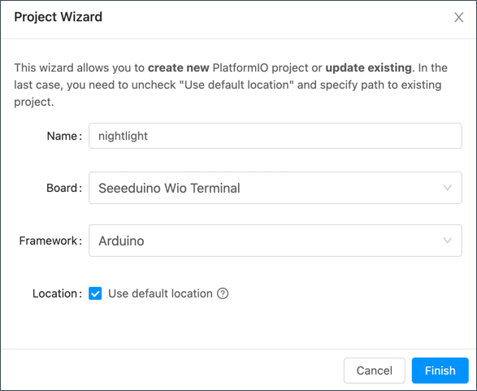

<!--
CO_OP_TRANSLATOR_METADATA:
{
  "original_hash": "a4f0c166010e31fd7b6ca20bc88dec6d",
  "translation_date": "2025-08-27T13:11:47+00:00",
  "source_file": "1-getting-started/lessons/1-introduction-to-iot/wio-terminal.md",
  "language_code": "pa"
}
-->
# ਵਾਇਓ ਟਰਮੀਨਲ

[Seeed Studios ਦਾ ਵਾਇਓ ਟਰਮੀਨਲ](https://www.seeedstudio.com/Wio-Terminal-p-4509.html) ਇੱਕ Arduino-ਅਨੁਕੂਲ ਮਾਈਕ੍ਰੋਕੰਟਰੋਲਰ ਹੈ, ਜਿਸ ਵਿੱਚ WiFi ਅਤੇ ਕੁਝ ਸੈਂਸਰ ਅਤੇ ਐਕਚੁਏਟਰ ਬਣੇ ਹੋਏ ਹਨ। ਇਸ ਵਿੱਚ ਹੋਰ ਸੈਂਸਰ ਅਤੇ ਐਕਚੁਏਟਰ ਜੋੜਨ ਲਈ ਪੋਰਟ ਹਨ, ਜੋ ਕਿ [Grove](https://www.seeedstudio.com/category/Grove-c-1003.html) ਨਾਂਕ ਦੇ ਹਾਰਡਵੇਅਰ ਈਕੋਸਿਸਟਮ ਦੀ ਵਰਤੋਂ ਕਰਦੇ ਹਨ।


## ਸੈਟਅਪ

ਵਾਇਓ ਟਰਮੀਨਲ ਦੀ ਵਰਤੋਂ ਕਰਨ ਲਈ, ਤੁਹਾਨੂੰ ਆਪਣੇ ਕੰਪਿਊਟਰ 'ਤੇ ਕੁਝ ਮੁਫ਼ਤ ਸੌਫਟਵੇਅਰ ਇੰਸਟਾਲ ਕਰਨ ਦੀ ਲੋੜ ਹੋਵੇਗੀ। ਤੁਹਾਨੂੰ WiFi ਨਾਲ ਕਨੈਕਟ ਕਰਨ ਤੋਂ ਪਹਿਲਾਂ ਵਾਇਓ ਟਰਮੀਨਲ ਫਰਮਵੇਅਰ ਨੂੰ ਅਪਡੇਟ ਕਰਨ ਦੀ ਵੀ ਲੋੜ ਹੋਵੇਗੀ।

### ਟਾਸਕ - ਸੈਟਅਪ

ਲੋੜੀਂਦੇ ਸੌਫਟਵੇਅਰ ਨੂੰ ਇੰਸਟਾਲ ਕਰੋ ਅਤੇ ਫਰਮਵੇਅਰ ਨੂੰ ਅਪਡੇਟ ਕਰੋ।

1. Visual Studio Code (VS Code) ਇੰਸਟਾਲ ਕਰੋ। ਇਹ ਉਹ ਐਡੀਟਰ ਹੈ ਜਿਸ ਵਿੱਚ ਤੁਸੀਂ C/C++ ਵਿੱਚ ਆਪਣੇ ਡਿਵਾਈਸ ਕੋਡ ਲਿਖੋਗੇ। VS Code ਇੰਸਟਾਲ ਕਰਨ ਦੇ ਨਿਰਦੇਸ਼ਾਂ ਲਈ [VS Code ਡੌਕਯੂਮੈਂਟੇਸ਼ਨ](https://code.visualstudio.com?WT.mc_id=academic-17441-jabenn) ਨੂੰ ਵੇਖੋ।

    > 💁 Arduino ਵਿਕਾਸ ਲਈ ਇੱਕ ਹੋਰ ਪ੍ਰਸਿੱਧ IDE [Arduino IDE](https://www.arduino.cc/en/software) ਹੈ। ਜੇ ਤੁਸੀਂ ਇਸ ਟੂਲ ਨਾਲ ਪਹਿਲਾਂ ਤੋਂ ਜਾਣੂ ਹੋ, ਤਾਂ ਤੁਸੀਂ ਇਸਦੀ ਜਗ੍ਹਾ VS Code ਅਤੇ PlatformIO ਦੀ ਵਰਤੋਂ ਕਰ ਸਕਦੇ ਹੋ। ਪਰ ਪਾਠਾਂ ਵਿੱਚ VS Code ਦੀ ਵਰਤੋਂ ਦੇ ਨਿਰਦੇਸ਼ ਦਿੱਤੇ ਜਾਣਗੇ।

1. VS Code PlatformIO ਐਕਸਟੈਂਸ਼ਨ ਇੰਸਟਾਲ ਕਰੋ। ਇਹ VS Code ਲਈ ਇੱਕ ਐਕਸਟੈਂਸ਼ਨ ਹੈ ਜੋ C/C++ ਵਿੱਚ ਮਾਈਕ੍ਰੋਕੰਟਰੋਲਰ ਪ੍ਰੋਗਰਾਮਿੰਗ ਦਾ ਸਮਰਥਨ ਕਰਦਾ ਹੈ। VS Code ਵਿੱਚ ਇਸ ਐਕਸਟੈਂਸ਼ਨ ਨੂੰ ਇੰਸਟਾਲ ਕਰਨ ਦੇ ਨਿਰਦੇਸ਼ਾਂ ਲਈ [PlatformIO ਐਕਸਟੈਂਸ਼ਨ ਡੌਕਯੂਮੈਂਟੇਸ਼ਨ](https://marketplace.visualstudio.com/items?WT.mc_id=academic-17441-jabenn&itemName=platformio.platformio-ide) ਨੂੰ ਵੇਖੋ। ਇਹ ਐਕਸਟੈਂਸ਼ਨ Microsoft C/C++ ਐਕਸਟੈਂਸ਼ਨ 'ਤੇ ਨਿਰਭਰ ਹੈ, ਜੋ ਕਿ PlatformIO ਇੰਸਟਾਲ ਕਰਨ ਸਮੇਂ ਆਟੋਮੈਟਿਕ ਤੌਰ 'ਤੇ ਇੰਸਟਾਲ ਹੁੰਦੀ ਹੈ।

1. ਆਪਣੇ ਵਾਇਓ ਟਰਮੀਨਲ ਨੂੰ ਆਪਣੇ ਕੰਪਿਊਟਰ ਨਾਲ ਕਨੈਕਟ ਕਰੋ। ਵਾਇਓ ਟਰਮੀਨਲ ਦੇ ਹੇਠਾਂ ਇੱਕ USB-C ਪੋਰਟ ਹੈ, ਜਿਸਨੂੰ USB ਪੋਰਟ ਨਾਲ ਕਨੈਕਟ ਕਰਨ ਦੀ ਲੋੜ ਹੈ। ਵਾਇਓ ਟਰਮੀਨਲ ਨਾਲ USB-C ਤੋਂ USB-A ਕੇਬਲ ਆਉਂਦਾ ਹੈ, ਪਰ ਜੇ ਤੁਹਾਡੇ ਕੰਪਿਊਟਰ ਵਿੱਚ ਸਿਰਫ USB-C ਪੋਰਟ ਹਨ, ਤਾਂ ਤੁਹਾਨੂੰ USB-C ਕੇਬਲ ਜਾਂ USB-A ਤੋਂ USB-C ਐਡਾਪਟਰ ਦੀ ਲੋੜ ਹੋਵੇਗੀ।

1. [Wio Terminal Wiki WiFi Overview ਡੌਕਯੂਮੈਂਟੇਸ਼ਨ](https://wiki.seeedstudio.com/Wio-Terminal-Network-Overview/) ਵਿੱਚ ਦਿੱਤੇ ਨਿਰਦੇਸ਼ਾਂ ਨੂੰ ਫਾਲੋ ਕਰੋ ਅਤੇ ਆਪਣੇ ਵਾਇਓ ਟਰਮੀਨਲ ਨੂੰ ਸੈਟਅਪ ਕਰੋ ਅਤੇ ਫਰਮਵੇਅਰ ਨੂੰ ਅਪਡੇਟ ਕਰੋ।

## ਹੈਲੋ ਵਰਲਡ

ਨਵੀਂ ਪ੍ਰੋਗਰਾਮਿੰਗ ਭਾਸ਼ਾ ਜਾਂ ਤਕਨਾਲੋਜੀ ਨਾਲ ਸ਼ੁਰੂਆਤ ਕਰਨ ਸਮੇਂ, ਇੱਕ 'Hello World' ਐਪਲੀਕੇਸ਼ਨ ਬਣਾਉਣਾ ਰਵਾਇਤੀ ਹੈ - ਇੱਕ ਛੋਟੀ ਐਪਲੀਕੇਸ਼ਨ ਜੋ `"Hello World"` ਵਰਗਾ ਟੈਕਸਟ ਆਉਟਪੁੱਟ ਕਰਦੀ ਹੈ, ਇਹ ਦਿਖਾਉਣ ਲਈ ਕਿ ਸਾਰੇ ਟੂਲ ਸਹੀ ਤਰੀਕੇ ਨਾਲ ਕਨਫਿਗਰ ਕੀਤੇ ਗਏ ਹਨ।

ਵਾਇਓ ਟਰਮੀਨਲ ਲਈ ਹੈਲੋ ਵਰਲਡ ਐਪ ਇਹ ਯਕੀਨੀ ਬਣਾਏਗਾ ਕਿ ਤੁਹਾਡੇ ਕੋਲ Visual Studio Code ਸਹੀ ਤਰੀਕੇ ਨਾਲ PlatformIO ਨਾਲ ਇੰਸਟਾਲ ਹੈ ਅਤੇ ਮਾਈਕ੍ਰੋਕੰਟਰੋਲਰ ਵਿਕਾਸ ਲਈ ਸੈਟਅਪ ਹੈ।

### PlatformIO ਪ੍ਰੋਜੈਕਟ ਬਣਾਓ

ਪਹਿਲਾ ਕਦਮ PlatformIO ਦੀ ਵਰਤੋਂ ਕਰਕੇ ਵਾਇਓ ਟਰਮੀਨਲ ਲਈ ਕਨਫਿਗਰ ਕੀਤਾ ਇੱਕ ਨਵਾਂ ਪ੍ਰੋਜੈਕਟ ਬਣਾਉਣਾ ਹੈ।

#### ਟਾਸਕ - PlatformIO ਪ੍ਰੋਜੈਕਟ ਬਣਾਓ

PlatformIO ਪ੍ਰੋਜੈਕਟ ਬਣਾਓ।

1. ਵਾਇਓ ਟਰਮੀਨਲ ਨੂੰ ਆਪਣੇ ਕੰਪਿਊਟਰ ਨਾਲ ਕਨੈਕਟ ਕਰੋ

1. VS Code ਲਾਂਚ ਕਰੋ

1. PlatformIO ਆਈਕਨ ਸਾਈਡ ਮੈਨੂ ਬਾਰ 'ਤੇ ਹੋਵੇਗਾ:

    

    ਇਸ ਮੈਨੂ ਆਈਟਮ ਨੂੰ ਚੁਣੋ, ਫਿਰ *PIO Home -> Open* ਚੁਣੋ

    

1. ਵੈਲਕਮ ਸਕ੍ਰੀਨ ਤੋਂ **+ New Project** ਬਟਨ ਚੁਣੋ

    

1. *Project Wizard* ਵਿੱਚ ਪ੍ਰੋਜੈਕਟ ਨੂੰ ਕਨਫਿਗਰ ਕਰੋ:

    1. ਆਪਣੇ ਪ੍ਰੋਜੈਕਟ ਦਾ ਨਾਮ `nightlight` ਰੱਖੋ

    1. *Board* ਡ੍ਰਾਪਡਾਊਨ ਵਿੱਚ `WIO` ਟਾਈਪ ਕਰੋ ਤਾਂ ਜੋ ਬੋਰਡ ਫਿਲਟਰ ਹੋਣ, ਅਤੇ *Seeeduino Wio Terminal* ਚੁਣੋ

    1. *Framework* ਨੂੰ *Arduino* ਹੀ ਰਹਿਣ ਦਿਓ

    1. *Use default location* ਚੈੱਕਬਾਕਸ ਨੂੰ ਚੈੱਕ ਰਹਿਣ ਦਿਓ ਜਾਂ ਅਨਚੈੱਕ ਕਰਕੇ ਆਪਣੇ ਪ੍ਰੋਜੈਕਟ ਲਈ ਸਥਾਨ ਚੁਣੋ

    1. **Finish** ਬਟਨ ਚੁਣੋ

    

    PlatformIO ਉਹ ਕੰਪੋਨੈਂਟ ਡਾਊਨਲੋਡ ਕਰੇਗਾ ਜੋ ਵਾਇਓ ਟਰਮੀਨਲ ਲਈ ਕੋਡ ਕੰਪਾਇਲ ਕਰਨ ਲਈ ਲੋੜੀਂਦੇ ਹਨ ਅਤੇ ਤੁਹਾਡੇ ਪ੍ਰੋਜੈਕਟ ਨੂੰ ਬਣਾਏਗਾ। ਇਸ ਵਿੱਚ ਕੁਝ ਮਿੰਟ ਲੱਗ ਸਕਦੇ ਹਨ।

### PlatformIO ਪ੍ਰੋਜੈਕਟ ਦੀ ਜਾਂਚ ਕਰੋ

VS Code ਐਕਸਪਲੋਰਰ ਉਹ ਫੋਲਡਰ ਅਤੇ ਫਾਈਲਾਂ ਦਿਖਾਏਗਾ ਜੋ PlatformIO ਵਿਜ਼ਾਰਡ ਦੁਆਰਾ ਬਣਾਈ ਗਈਆਂ ਹਨ।

#### ਫੋਲਡਰ

* `.pio` - ਇਹ ਫੋਲਡਰ PlatformIO ਦੁਆਰਾ ਲੋੜੀਂਦੇ ਅਸਥਾਈ ਡਾਟਾ ਨੂੰ ਰੱਖਦਾ ਹੈ ਜਿਵੇਂ ਕਿ ਲਾਇਬ੍ਰੇਰੀਆਂ ਜਾਂ ਕੰਪਾਇਲ ਕੀਤਾ ਕੋਡ। ਜੇ ਇਹ ਮਿਟਾ ਦਿੱਤਾ ਜਾਵੇ ਤਾਂ ਇਹ ਆਟੋਮੈਟਿਕ ਤੌਰ 'ਤੇ ਦੁਬਾਰਾ ਬਣਾਇਆ ਜਾਂਦਾ ਹੈ। ਜੇ ਤੁਸੀਂ ਆਪਣਾ ਪ੍ਰੋਜੈਕਟ GitHub ਵਰਗੇ ਸਾਈਟਾਂ 'ਤੇ ਸ਼ੇਅਰ ਕਰ ਰਹੇ ਹੋ, ਤਾਂ ਇਸਨੂੰ ਸੋਰਸ ਕੋਡ ਕੰਟਰੋਲ ਵਿੱਚ ਸ਼ਾਮਲ ਕਰਨ ਦੀ ਲੋੜ ਨਹੀਂ ਹੈ।
* `.vscode` - ਇਹ ਫੋਲਡਰ PlatformIO ਅਤੇ VS Code ਦੁਆਰਾ ਵਰਤੋਂ ਕੀਤੇ ਗਏ ਕਨਫਿਗਰੇਸ਼ਨ ਨੂੰ ਰੱਖਦਾ ਹੈ। ਜੇ ਇਹ ਮਿਟਾ ਦਿੱਤਾ ਜਾਵੇ ਤਾਂ ਇਹ ਆਟੋਮੈਟਿਕ ਤੌਰ 'ਤੇ ਦੁਬਾਰਾ ਬਣਾਇਆ ਜਾਂਦਾ ਹੈ। ਜੇ ਤੁਸੀਂ ਆਪਣਾ ਪ੍ਰੋਜੈਕਟ GitHub ਵਰਗੇ ਸਾਈਟਾਂ 'ਤੇ ਸ਼ੇਅਰ ਕਰ ਰਹੇ ਹੋ, ਤਾਂ ਇਸਨੂੰ ਸੋਰਸ ਕੋਡ ਕੰਟਰੋਲ ਵਿੱਚ ਸ਼ਾਮਲ ਕਰਨ ਦੀ ਲੋੜ ਨਹੀਂ ਹੈ।
* `include` - ਇਹ ਫੋਲਡਰ ਬਾਹਰੀ ਹੈਡਰ ਫਾਈਲਾਂ ਲਈ ਹੈ ਜੋ ਤੁਹਾਡੇ ਕੋਡ ਵਿੱਚ ਵਾਧੂ ਲਾਇਬ੍ਰੇਰੀਆਂ ਜੋੜਨ ਸਮੇਂ ਲੋੜੀਂਦੀਆਂ ਹਨ। ਤੁਸੀਂ ਇਸ ਫੋਲਡਰ ਦੀ ਵਰਤੋਂ ਨਹੀਂ ਕਰੋਗੇ।
* `lib` - ਇਹ ਫੋਲਡਰ ਬਾਹਰੀ ਲਾਇਬ੍ਰੇਰੀਆਂ ਲਈ ਹੈ ਜੋ ਤੁਸੀਂ ਆਪਣੇ ਕੋਡ ਵਿੱਚ ਕਾਲ ਕਰਨਾ ਚਾਹੁੰਦੇ ਹੋ। ਤੁਸੀਂ ਇਸ ਫੋਲਡਰ ਦੀ ਵਰਤੋਂ ਨਹੀਂ ਕਰੋਗੇ।
* `src` - ਇਹ ਫੋਲਡਰ ਤੁਹਾਡੇ ਐਪਲੀਕੇਸ਼ਨ ਲਈ ਮੁੱਖ ਸੋਰਸ ਕੋਡ ਰੱਖਦਾ ਹੈ। ਸ਼ੁਰੂ ਵਿੱਚ, ਇਸ ਵਿੱਚ ਇੱਕ ਫਾਈਲ ਹੋਵੇਗੀ - `main.cpp`।
* `test` - ਇਹ ਫੋਲਡਰ ਉਹ ਜਗ੍ਹਾ ਹੈ ਜਿੱਥੇ ਤੁਸੀਂ ਆਪਣੇ ਕੋਡ ਲਈ ਕੋਈ ਯੂਨਿਟ ਟੈਸਟ ਰੱਖ ਸਕਦੇ ਹੋ।

#### ਫਾਈਲਾਂ

* `main.cpp` - ਇਹ ਫਾਈਲ `src` ਫੋਲਡਰ ਵਿੱਚ ਤੁਹਾਡੇ ਐਪਲੀਕੇਸ਼ਨ ਲਈ ਐਂਟਰੀ ਪੌਇੰਟ ਰੱਖਦੀ ਹੈ। ਇਸ ਫਾਈਲ ਨੂੰ ਖੋਲ੍ਹੋ, ਅਤੇ ਇਸ ਵਿੱਚ ਹੇਠਾਂ ਦਿੱਤਾ ਕੋਡ ਹੋਵੇਗਾ:

    ```cpp
    #include <Arduino.h>
    
    void setup() {
      // put your setup code here, to run once:
    }
    
    void loop() {
      // put your main code here, to run repeatedly:
    }
    ```

    ਜਦੋਂ ਡਿਵਾਈਸ ਸ਼ੁਰੂ ਹੁੰਦਾ ਹੈ, Arduino ਫਰੇਮਵਰਕ `setup` ਫੰਕਸ਼ਨ ਨੂੰ ਇੱਕ ਵਾਰ ਚਲਾਉਂਦਾ ਹੈ, ਫਿਰ `loop` ਫੰਕਸ਼ਨ ਨੂੰ ਮੁੜ-ਮੁੜ ਚਲਾਉਂਦਾ ਹੈ ਜਦੋਂ ਤੱਕ ਡਿਵਾਈਸ ਬੰਦ ਨਹੀਂ ਹੁੰਦਾ।

* `.gitignore` - ਇਹ ਫਾਈਲ ਉਹ ਫਾਈਲਾਂ ਅਤੇ ਡਾਇਰੈਕਟਰੀਆਂ ਦੀ ਸੂਚੀ ਦਿੰਦੀ ਹੈ ਜੋ git ਸੋਰਸ ਕੋਡ ਕੰਟਰੋਲ ਵਿੱਚ ਸ਼ਾਮਲ ਕਰਨ ਸਮੇਂ ਅਣਡਿੱਠੀਆਂ ਰਹਿਣੀਆਂ ਹਨ, ਜਿਵੇਂ ਕਿ GitHub 'ਤੇ ਰਿਪੋਜ਼ਟਰੀ ਵਿੱਚ ਅਪਲੋਡ ਕਰਨਾ।

* `platformio.ini` - ਇਹ ਫਾਈਲ ਤੁਹਾਡੇ ਡਿਵਾਈਸ ਅਤੇ ਐਪ ਲਈ ਕਨਫਿਗਰੇਸ਼ਨ ਰੱਖਦੀ ਹੈ। ਇਸ ਫਾਈਲ ਨੂੰ ਖੋਲ੍ਹੋ, ਅਤੇ ਇਸ ਵਿੱਚ ਹੇਠਾਂ ਦਿੱਤਾ ਕੋਡ ਹੋਵੇਗਾ:

    ```ini
    [env:seeed_wio_terminal]
    platform = atmelsam
    board = seeed_wio_terminal
    framework = arduino
    ```

    `[env:seeed_wio_terminal]` ਸੈਕਸ਼ਨ ਵਾਇਓ ਟਰਮੀਨਲ ਲਈ ਕਨਫਿਗਰੇਸ਼ਨ ਰੱਖਦਾ ਹੈ। ਤੁਸੀਂ ਕਈ `env` ਸੈਕਸ਼ਨ ਰੱਖ ਸਕਦੇ ਹੋ ਤਾਂ ਜੋ ਤੁਹਾਡਾ ਕੋਡ ਕਈ ਬੋਰਡਾਂ ਲਈ ਕੰਪਾਇਲ ਕੀਤਾ ਜਾ ਸਕੇ।

    ਹੋਰ ਮੁੱਲ ਪ੍ਰੋਜੈਕਟ ਵਿਜ਼ਾਰਡ ਤੋਂ ਮਿਲਦੇ ਹਨ:

  * `platform = atmelsam` ਵਾਇਓ ਟਰਮੀਨਲ ਦੁਆਰਾ ਵਰਤੋਂ ਕੀਤੇ ਹਾਰਡਵੇਅਰ ਨੂੰ ਪਰਿਭਾਸ਼ਿਤ ਕਰਦਾ ਹੈ (ATSAMD51-ਅਧਾਰਿਤ ਮਾਈਕ੍ਰੋਕੰਟਰੋਲਰ)
  * `board = seeed_wio_terminal` ਮਾਈਕ੍ਰੋਕੰਟਰੋਲਰ ਬੋਰਡ ਦੀ ਕਿਸਮ ਨੂੰ ਪਰਿਭਾਸ਼ਿਤ ਕਰਦਾ ਹੈ (ਵਾਇਓ ਟਰਮੀਨਲ)
  * `framework = arduino` ਇਹ ਪਰਿਭਾਸ਼ਿਤ ਕਰਦਾ ਹੈ ਕਿ ਇਹ ਪ੍ਰੋਜੈਕਟ Arduino ਫਰੇਮਵਰਕ ਦੀ ਵਰਤੋਂ ਕਰ ਰਿਹਾ ਹੈ।

### ਹੈਲੋ ਵਰਲਡ ਐਪ ਲਿਖੋ

ਤੁਸੀਂ ਹੁਣ ਹੈਲੋ ਵਰਲਡ ਐਪ ਲਿਖਣ ਲਈ ਤਿਆਰ ਹੋ।

#### ਟਾਸਕ - ਹੈਲੋ ਵਰਲਡ ਐਪ ਲਿਖੋ

ਹੈਲੋ ਵਰਲਡ ਐਪ ਲਿਖੋ।

1. VS Code ਵਿੱਚ `main.cpp` ਫਾਈਲ ਖੋਲ੍ਹੋ

1. ਕੋਡ ਨੂੰ ਹੇਠਾਂ ਦਿੱਤੇ ਕੋਡ ਨਾਲ ਬਦਲੋ:

    ```cpp
    #include <Arduino.h>

    void setup()
    {
        Serial.begin(9600);

        while (!Serial)
            ; // Wait for Serial to be ready
    
        delay(1000);
    }
    
    void loop()
    {
        Serial.println("Hello World");
        delay(5000);
    }
    ```

    `setup` ਫੰਕਸ਼ਨ ਸੀਰੀਅਲ ਪੋਰਟ ਨਾਲ ਕਨੈਕਸ਼ਨ ਸ਼ੁਰੂ ਕਰਦਾ ਹੈ - ਇਸ ਮਾਮਲੇ ਵਿੱਚ, USB ਪੋਰਟ ਜੋ ਵਾਇਓ ਟਰਮੀਨਲ ਨੂੰ ਤੁਹਾਡੇ ਕੰਪਿਊਟਰ ਨਾਲ ਕਨੈਕਟ ਕਰਨ ਲਈ ਵਰਤਿਆ ਜਾਂਦਾ ਹੈ। ਪੈਰਾਮੀਟਰ `9600` [baud rate](https://wikipedia.org/wiki/Symbol_rate) (ਜਿਸਨੂੰ Symbol rate ਵੀ ਕਿਹਾ ਜਾਂਦਾ ਹੈ) ਜਾਂ ਸੀਰੀਅਲ ਪੋਰਟ 'ਤੇ ਡਾਟਾ ਭੇਜਣ ਦੀ ਗਤੀ ਹੈ। ਇਹ ਸੈਟਿੰਗ ਦਾ ਮਤਲਬ ਹੈ ਕਿ 9,600 ਬਿਟ (0s ਅਤੇ 1s) ਡਾਟਾ ਹਰ ਸਕਿੰਟ ਭੇਜਿਆ ਜਾਂਦਾ ਹੈ। ਫਿਰ ਇਹ ਸੀਰੀਅਲ ਪੋਰਟ ਦੇ ਤਿਆਰ ਹੋਣ ਦੀ ਉਡੀਕ ਕਰਦਾ ਹੈ।

    `loop` ਫੰਕਸ਼ਨ ਸੀਰੀਅਲ ਪੋਰਟ 'ਤੇ ਲਾਈਨ `Hello World!` ਭੇਜਦਾ ਹੈ, ਇਸ ਲਈ `Hello World!` ਦੇ ਅੱਖਰਾਂ ਦੇ ਨਾਲ ਇੱਕ ਨਵੀਂ ਲਾਈਨ ਕਿਰਦਾਰ। ਫਿਰ ਇਹ 5,000 ਮਿਲੀਸੈਕੰਡ ਜਾਂ 5 ਸਕਿੰਟ ਲਈ ਸੌਂਦਾ ਹੈ। ਜਦੋਂ `loop` ਖਤਮ ਹੁੰਦਾ ਹੈ, ਇਹ ਮੁੜ ਚਲਾਇਆ ਜਾਂਦਾ ਹੈ, ਅਤੇ ਮੁੜ-ਮੁੜ ਚਲਾਇਆ ਜਾਂਦਾ ਹੈ ਜਦੋਂ ਤੱਕ ਮਾਈਕ੍ਰੋਕੰਟਰੋਲਰ ਚਾਲੂ ਹੁੰਦਾ ਹੈ।

1. ਆਪਣੇ ਵਾਇਓ ਟਰਮੀਨਲ ਨੂੰ ਅਪਲੋਡ ਮੋਡ ਵਿੱਚ ਰੱਖੋ। ਤੁਹਾਨੂੰ ਹਰ ਵਾਰ ਡਿਵਾਈਸ 'ਤੇ ਨਵਾਂ ਕੋਡ ਅਪਲੋਡ ਕਰਨ ਸਮੇਂ ਇਹ ਕਰਨ ਦੀ ਲੋੜ ਹੋਵੇਗੀ:

    1. ਪਾਵਰ ਸਵਿੱਚ ਨੂੰ ਦੋ ਵਾਰ ਤੇਜ਼ੀ ਨਾਲ ਹੇਠਾਂ ਖਿੱਚੋ - ਇਹ ਹਰ ਵਾਰ ਚਾਲੂ ਸਥਿਤੀ ਵਿੱਚ ਵਾਪਸ ਆਵੇਗਾ।

    1. USB ਪੋਰਟ ਦੇ ਸੱਜੇ ਪਾਸੇ ਨੀਲੇ ਸਥਿਤੀ LED ਦੀ ਜਾਂਚ ਕਰੋ। ਇਹ ਪਲਸ ਕਰ ਰਿਹਾ ਹੋਣਾ ਚਾਹੀਦਾ ਹੈ।
    
    [](https://youtu.be/LeKU_7zLRrQ)
    
    ਇਸਨੂੰ ਕਰਨ ਦਾ ਵੀਡੀਓ ਦੇਖਣ ਲਈ ਉਪਰ ਦਿੱਤੇ ਚਿੱਤਰ 'ਤੇ ਕਲਿਕ ਕਰੋ।

1. ਕੋਡ ਨੂੰ ਵਾਇਓ ਟਰਮੀਨਲ 'ਤੇ ਬਣਾਓ ਅਤੇ ਅਪਲੋਡ ਕਰੋ

    1. VS Code ਕਮਾਂਡ ਪੈਲੇਟ ਖੋਲ੍ਹੋ

    1. ਅਪਲੋਡ ਵਿਕਲਪ ਦੀ ਖੋਜ ਕਰਨ ਲਈ `PlatformIO Upload` ਟਾਈਪ ਕਰੋ, ਅਤੇ *PlatformIO: Upload* ਚੁਣੋ

        

        ਜੇ ਲੋੜ ਹੋਵੇ ਤਾਂ PlatformIO ਅਪਲੋਡ ਕਰਨ ਤੋਂ ਪਹਿਲਾਂ ਆਟੋਮੈਟਿਕ ਤੌਰ 'ਤੇ ਕੋਡ ਬਣਾਏਗਾ।

    1. ਕੋਡ ਕੰਪਾਇਲ ਕੀਤਾ ਜਾਵੇਗਾ ਅਤੇ ਵਾਇਓ ਟਰਮੀਨਲ 'ਤੇ ਅਪਲੋਡ ਕੀਤਾ ਜਾਵੇਗਾ

        > 💁 ਜੇ ਤੁਸੀਂ macOS ਦੀ ਵਰਤੋਂ ਕਰ ਰਹੇ ਹੋ, ਤਾਂ *DISK NOT EJECTED PROPERLY* ਬਾਰੇ ਇੱਕ ਨੋਟੀਫਿਕੇਸ਼ਨ ਆਵੇਗਾ। ਇਹ ਇਸ ਲਈ ਹੈ ਕਿਉਂਕਿ ਵਾਇਓ ਟਰਮੀਨਲ ਫਲੈਸ਼ਿੰਗ ਪ੍ਰਕਿਰਿਆ ਦੇ ਹਿੱਸੇ ਵਜੋਂ ਇੱਕ ਡ੍ਰਾਈਵ ਵਜੋਂ ਮਾਊਂਟ ਕੀਤਾ ਜਾਂਦਾ ਹੈ, ਅਤੇ ਜਦੋਂ ਕੰਪਾਇਲ ਕੀਤਾ ਕੋਡ ਡਿਵਾਈਸ 'ਤੇ ਲਿਖਿਆ ਜਾਂਦਾ ਹੈ ਤਾਂ ਇਹ ਡਿਸਕਨੈਕਟ ਹੋ ਜਾਂਦਾ ਹੈ। ਤੁਸੀਂ ਇਸ ਨੋਟੀਫਿਕੇਸ਼ਨ ਨੂੰ ਅਣਡਿੱਠਾ ਕਰ ਸਕਦੇ ਹੋ।

    ⚠️ ਜੇ ਤੁਹਾਨੂੰ ਅਪਲੋਡ ਪੋਰਟ ਉਪਲਬਧ ਨਾ ਹੋਣ ਬਾਰੇ ਗਲਤੀਆਂ ਮਿਲਦੀਆਂ ਹਨ, ਤਾਂ ਪਹਿਲਾਂ ਇਹ ਯਕੀਨੀ ਬਣਾਓ ਕਿ ਤੁਹਾਡੇ ਕੋਲ ਵਾਇਓ ਟਰਮੀਨਲ ਤੁਹਾਡੇ ਕੰਪਿਊਟਰ ਨਾਲ ਕਨੈਕਟ ਹੈ, ਅਤੇ ਸਕ੍ਰੀਨ ਦੇ ਖੱਬੇ ਪਾਸੇ ਸਵਿੱਚ ਦੀ ਵਰਤੋਂ ਕਰਕੇ ਚਾਲੂ ਕੀਤਾ ਗਿਆ ਹੈ, ਅਤੇ ਅਪਲੋਡ ਮੋਡ ਵਿੱਚ ਸੈਟ ਕੀਤਾ ਗਿਆ ਹੈ। ਹੇਠਾਂ ਹਰੇ ਰੰਗ ਦੀ ਲਾਈਟ ਚਾਲੂ ਹੋਣੀ ਚਾਹੀਦੀ ਹੈ, ਅਤੇ ਨੀਲੀ ਲਾਈਟ ਪਲਸ ਕਰ ਰਹੀ ਹੋਣੀ ਚਾਹੀਦੀ ਹੈ। ਜੇ ਤੁਹਾਨੂੰ ਫਿਰ ਵੀ ਗਲਤੀ ਮਿਲਦੀ ਹੈ, ਤਾਂ ਵਾਇਓ ਟਰਮੀਨਲ ਨੂੰ ਅਪਲੋਡ ਮੋਡ ਵਿੱਚ ਜ਼ਬਰਦਸਤੀ ਰੱਖਣ ਲਈ ਸਵਿੱਚ ਨੂੰ ਦੋ ਵਾਰ ਤੇਜ਼ੀ ਨਾਲ ਹੇਠਾਂ ਖਿੱਚੋ ਅਤੇ ਫਿਰ ਅਪਲੋਡ ਦੁਬਾਰਾ ਕੋਸ਼ਿਸ਼ ਕਰੋ।

PlatformIO ਵਿੱਚ ਇੱਕ ਸੀਰੀਅਲ ਮਾਨੀਟਰ ਹੈ ਜੋ ਵਾਇਓ ਟਰਮੀਨਲ ਤੋਂ USB ਕੇਬਲ ਦੁਆਰਾ ਭੇਜੇ ਗਏ ਡਾਟਾ ਦੀ ਨਿਗਰਾਨੀ ਕਰ ਸਕਦਾ

---

**ਅਸਵੀਕਰਤੀ**:  
ਇਹ ਦਸਤਾਵੇਜ਼ AI ਅਨੁਵਾਦ ਸੇਵਾ [Co-op Translator](https://github.com/Azure/co-op-translator) ਦੀ ਵਰਤੋਂ ਕਰਕੇ ਅਨੁਵਾਦ ਕੀਤਾ ਗਿਆ ਹੈ। ਜਦੋਂ ਕਿ ਅਸੀਂ ਸਹੀਤਾ ਲਈ ਯਤਨਸ਼ੀਲ ਹਾਂ, ਕਿਰਪਾ ਕਰਕੇ ਧਿਆਨ ਦਿਓ ਕਿ ਸਵੈਚਾਲਿਤ ਅਨੁਵਾਦਾਂ ਵਿੱਚ ਗਲਤੀਆਂ ਜਾਂ ਅਸੁਚਤਤਾਵਾਂ ਹੋ ਸਕਦੀਆਂ ਹਨ। ਮੂਲ ਦਸਤਾਵੇਜ਼ ਨੂੰ ਇਸਦੀ ਮੂਲ ਭਾਸ਼ਾ ਵਿੱਚ ਅਧਿਕਾਰਤ ਸਰੋਤ ਮੰਨਿਆ ਜਾਣਾ ਚਾਹੀਦਾ ਹੈ। ਮਹੱਤਵਪੂਰਨ ਜਾਣਕਾਰੀ ਲਈ, ਪੇਸ਼ੇਵਰ ਮਨੁੱਖੀ ਅਨੁਵਾਦ ਦੀ ਸਿਫਾਰਸ਼ ਕੀਤੀ ਜਾਂਦੀ ਹੈ। ਇਸ ਅਨੁਵਾਦ ਦੀ ਵਰਤੋਂ ਤੋਂ ਪੈਦਾ ਹੋਣ ਵਾਲੇ ਕਿਸੇ ਵੀ ਗਲਤਫਹਿਮੀ ਜਾਂ ਗਲਤ ਵਿਆਖਿਆ ਲਈ ਅਸੀਂ ਜ਼ਿੰਮੇਵਾਰ ਨਹੀਂ ਹਾਂ।