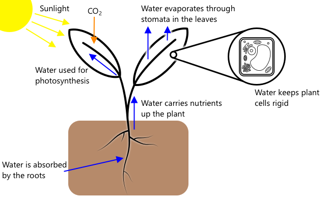
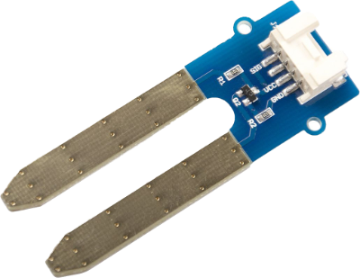

<!--
CO_OP_TRANSLATOR_METADATA:
{
  "original_hash": "4fb20273d299dc8d07a8f06c9cd0cdd9",
  "translation_date": "2025-08-27T11:45:08+00:00",
  "source_file": "2-farm/lessons/2-detect-soil-moisture/README.md",
  "language_code": "pa"
}
-->
# ਮਿੱਟੀ ਦੀ ਨਮੀ ਦੀ ਪਛਾਣ ਕਰੋ

> ਸਕੈਚਨੋਟ [ਨਿਤਿਆ ਨਰਸਿੰਮਨ](https://github.com/nitya) ਦੁਆਰਾ। ਵੱਡੇ ਵਰਜਨ ਲਈ ਚਿੱਤਰ 'ਤੇ ਕਲਿੱਕ ਕਰੋ।

ਇਹ ਪਾਠ [IoT for Beginners Project 2 - Digital Agriculture series](https://youtube.com/playlist?list=PLmsFUfdnGr3yCutmcVg6eAUEfsGiFXgcx) ਦੇ ਹਿੱਸੇ ਵਜੋਂ [Microsoft Reactor](https://developer.microsoft.com/reactor/?WT.mc_id=academic-17441-jabenn) ਤੋਂ ਸਿਖਾਇਆ ਗਿਆ ਸੀ।

## ਪਾਠ ਤੋਂ ਪਹਿਲਾਂ ਕਵੀਜ਼

[ਪ੍ਰੀ-ਲੈਕਚਰ ਕਵੀਜ਼](https://black-meadow-040d15503.1.azurestaticapps.net/quiz/11)

## ਪਰਿਚਯ

ਪਿਛਲੇ ਪਾਠ ਵਿੱਚ ਅਸੀਂ ਇੱਕ ਵਾਤਾਵਰਣੀ ਗੁਣਵੱਤਾ ਨੂੰ ਮਾਪਣ ਅਤੇ ਇਸਨੂੰ ਪੌਦਿਆਂ ਦੀ ਵਾਧੇ ਦੀ ਭਵਿੱਖਬਾਣੀ ਕਰਨ ਲਈ ਵਰਤਣ ਬਾਰੇ ਸਿੱਖਿਆ। ਤਾਪਮਾਨ ਨੂੰ ਨਿਯੰਤਰਿਤ ਕੀਤਾ ਜਾ ਸਕਦਾ ਹੈ, ਪਰ ਇਹ ਮਹਿੰਗਾ ਹੁੰਦਾ ਹੈ, ਜਿਸ ਲਈ ਨਿਯੰਤਰਿਤ ਵਾਤਾਵਰਣ ਦੀ ਲੋੜ ਹੁੰਦੀ ਹੈ। ਪੌਦਿਆਂ ਲਈ ਸਭ ਤੋਂ ਆਸਾਨ ਵਾਤਾਵਰਣੀ ਗੁਣਵੱਤਾ ਨੂੰ ਨਿਯੰਤਰਿਤ ਕਰਨਾ ਪਾਣੀ ਹੈ - ਕੁਝ ਜੋ ਹਰ ਰੋਜ਼ ਵੱਡੇ ਪੱਧਰ ਦੇ ਸਿੰਚਾਈ ਪ੍ਰਣਾਲੀਆਂ ਤੋਂ ਲੈ ਕੇ ਬੱਚਿਆਂ ਦੁਆਰਾ ਆਪਣੇ ਬਾਗਾਂ ਨੂੰ ਪਾਣੀ ਦੇਣ ਤੱਕ ਨਿਯੰਤਰਿਤ ਕੀਤਾ ਜਾਂਦਾ ਹੈ।

ਇਸ ਪਾਠ ਵਿੱਚ ਤੁਸੀਂ ਮਿੱਟੀ ਦੀ ਨਮੀ ਨੂੰ ਮਾਪਣ ਬਾਰੇ ਸਿੱਖੋਗੇ, ਅਤੇ ਅਗਲੇ ਪਾਠ ਵਿੱਚ ਤੁਸੀਂ ਇੱਕ ਆਟੋਮੈਟਿਕ ਪਾਣੀ ਦੇਣ ਵਾਲੀ ਪ੍ਰਣਾਲੀ ਨੂੰ ਨਿਯੰਤਰਿਤ ਕਰਨ ਬਾਰੇ ਸਿੱਖੋਗੇ। ਇਸ ਪਾਠ ਵਿੱਚ ਇੱਕ ਤੀਜਾ ਸੈਂਸਰ ਪੇਸ਼ ਕੀਤਾ ਗਿਆ ਹੈ। ਤੁਸੀਂ ਪਹਿਲਾਂ ਹੀ ਇੱਕ ਲਾਈਟ ਸੈਂਸਰ ਅਤੇ ਤਾਪਮਾਨ ਸੈਂਸਰ ਵਰਤ ਚੁੱਕੇ ਹੋ, ਇਸ ਲਈ ਇਸ ਪਾਠ ਵਿੱਚ ਤੁਸੀਂ ਇਹ ਵੀ ਸਿੱਖੋਗੇ ਕਿ ਸੈਂਸਰ ਅਤੇ ਐਕਚੁਏਟਰ IoT ਡਿਵਾਈਸਾਂ ਨਾਲ ਕਿਵੇਂ ਸੰਚਾਰ ਕਰਦੇ ਹਨ, ਤਾਂ ਜੋ ਇਹ ਸਮਝਿਆ ਜਾ ਸਕੇ ਕਿ ਮਿੱਟੀ ਦੀ ਨਮੀ ਦਾ ਸੈਂਸਰ IoT ਡਿਵਾਈਸ ਨੂੰ ਡਾਟਾ ਕਿਵੇਂ ਭੇਜ ਸਕਦਾ ਹੈ।

ਇਸ ਪਾਠ ਵਿੱਚ ਅਸੀਂ ਕਵਰ ਕਰਾਂਗੇ:

* [ਮਿੱਟੀ ਦੀ ਨਮੀ](../../../../../2-farm/lessons/2-detect-soil-moisture)
* [ਸੈਂਸਰ IoT ਡਿਵਾਈਸਾਂ ਨਾਲ ਕਿਵੇਂ ਸੰਚਾਰ ਕਰਦੇ ਹਨ](../../../../../2-farm/lessons/2-detect-soil-moisture)
* [ਮਿੱਟੀ ਵਿੱਚ ਨਮੀ ਦੇ ਪੱਧਰ ਨੂੰ ਮਾਪੋ](../../../../../2-farm/lessons/2-detect-soil-moisture)
* [ਸੈਂਸਰ ਕੈਲੀਬ੍ਰੇਸ਼ਨ](../../../../../2-farm/lessons/2-detect-soil-moisture)

## ਮਿੱਟੀ ਦੀ ਨਮੀ

ਪੌਦਿਆਂ ਨੂੰ ਵਧਣ ਲਈ ਪਾਣੀ ਦੀ ਲੋੜ ਹੁੰਦੀ ਹੈ। ਉਹ ਪੂਰੇ ਪੌਦੇ ਵਿੱਚ ਪਾਣੀ ਨੂੰ ਜਜ਼ਬ ਕਰਦੇ ਹਨ, ਜਿਸ ਵਿੱਚ ਜ਼ਿਆਦਾਤਰ ਪਾਣੀ ਜੜਾਂ ਦੁਆਰਾ ਜਜ਼ਬ ਹੁੰਦਾ ਹੈ। ਪਾਣੀ ਪੌਦੇ ਦੁਆਰਾ ਤਿੰਨ ਚੀਜ਼ਾਂ ਲਈ ਵਰਤਿਆ ਜਾਂਦਾ ਹੈ:

* [ਫੋਟੋਸਿੰਥੇਸਿਸ](https://wikipedia.org/wiki/Photosynthesis) - ਪੌਦੇ ਪਾਣੀ, ਕਾਰਬਨ ਡਾਈਆਕਸਾਈਡ ਅਤੇ ਰੌਸ਼ਨੀ ਨਾਲ ਰਸਾਇਣਕ ਪ੍ਰਤੀਕਿਰਿਆ ਕਰਦੇ ਹਨ, ਜਿਸ ਨਾਲ ਕਾਰਬੋਹਾਈਡਰੇਟ ਅਤੇ ਆਕਸੀਜਨ ਬਣਦੇ ਹਨ।
* [ਟ੍ਰਾਂਸਪਾਇਰੇਸ਼ਨ](https://wikipedia.org/wiki/Transpiration) - ਪੌਦੇ ਪਾਣੀ ਨੂੰ ਕਾਰਬਨ ਡਾਈਆਕਸਾਈਡ ਨੂੰ ਹਵਾ ਤੋਂ ਪੌਦੇ ਵਿੱਚ ਪਤਿਆਂ ਦੇ ਰਾਹੀਂ ਫੈਲਾਉਣ ਲਈ ਵਰਤਦੇ ਹਨ। ਇਹ ਪ੍ਰਕਿਰਿਆ ਪੌਦੇ ਦੇ ਆਲੇ-ਦੁਆਲੇ ਪੌਸ਼ਟਿਕ ਤੱਤਾਂ ਨੂੰ ਲਿਜਾਣ ਲਈ ਵੀ ਵਰਤਦੀ ਹੈ ਅਤੇ ਪੌਦੇ ਨੂੰ ਠੰਢਾ ਰੱਖਦੀ ਹੈ, ਜਿਵੇਂ ਮਨੁੱਖ ਪਸੀਨਾ ਕਰਦੇ ਹਨ।
* ਢਾਂਚਾ - ਪੌਦਿਆਂ ਨੂੰ ਆਪਣੇ ਢਾਂਚੇ ਨੂੰ ਕਾਇਮ ਰੱਖਣ ਲਈ ਵੀ ਪਾਣੀ ਦੀ ਲੋੜ ਹੁੰਦੀ ਹੈ - ਉਹ 90% ਪਾਣੀ ਹੁੰਦੇ ਹਨ (ਜਦਕਿ ਮਨੁੱਖ ਸਿਰਫ 60% ਹੁੰਦੇ ਹਨ), ਅਤੇ ਇਹ ਪਾਣੀ ਕੋਸ਼ਿਕਾਵਾਂ ਨੂੰ ਸਖ਼ਤ ਰੱਖਦਾ ਹੈ। ਜੇਕਰ ਪੌਦੇ ਕੋਲ ਕਾਫ਼ੀ ਪਾਣੀ ਨਹੀਂ ਹੈ, ਤਾਂ ਉਹ ਮੁੜ੍ਹ ਜਾਂਦੇ ਹਨ ਅਤੇ ਆਖ਼ਰਕਾਰ ਮਰ ਜਾਂਦੇ ਹਨ।

✅ ਕੁਝ ਖੋਜ ਕਰੋ: ਟ੍ਰਾਂਸਪਾਇਰੇਸ਼ਨ ਦੁਆਰਾ ਕਿੰਨਾ ਪਾਣੀ ਖਤਮ ਹੁੰਦਾ ਹੈ?

ਜੜਾਂ ਦੀ ਪ੍ਰਣਾਲੀ ਮਿੱਟੀ ਵਿੱਚ ਮੌਜੂਦ ਨਮੀ ਤੋਂ ਪਾਣੀ ਪ੍ਰਦਾਨ ਕਰਦੀ ਹੈ ਜਿੱਥੇ ਪੌਦਾ ਵਧਦਾ ਹੈ। ਜੇ ਮਿੱਟੀ ਵਿੱਚ ਬਹੁਤ ਘੱਟ ਪਾਣੀ ਹੋਵੇ, ਤਾਂ ਪੌਦਾ ਵਧਣ ਲਈ ਕਾਫ਼ੀ ਪਾਣੀ ਜਜ਼ਬ ਨਹੀਂ ਕਰ ਸਕਦਾ। ਜੇ ਬਹੁਤ ਜ਼ਿਆਦਾ ਪਾਣੀ ਹੋਵੇ, ਤਾਂ ਜੜਾਂ ਕਾਫ਼ੀ ਆਕਸੀਜਨ ਜਜ਼ਬ ਨਹੀਂ ਕਰ ਸਕਦੀਆਂ, ਜੋ ਕਿ ਉਨ੍ਹਾਂ ਦੇ ਕੰਮ ਕਰਨ ਲਈ ਲਾਜ਼ਮੀ ਹੈ। ਇਸ ਨਾਲ ਜੜਾਂ ਮਰ ਜਾਂਦੀਆਂ ਹਨ ਅਤੇ ਪੌਦਾ ਜ਼ਿੰਦਾ ਰਹਿਣ ਲਈ ਕਾਫ਼ੀ ਪੌਸ਼ਟਿਕ ਤੱਤ ਨਹੀਂ ਲੈ ਸਕਦਾ।

ਇੱਕ ਕਿਸਾਨ ਲਈ ਸਭ ਤੋਂ ਵਧੀਆ ਪੌਦੇ ਦੀ ਵਾਧਾ ਪ੍ਰਾਪਤ ਕਰਨ ਲਈ, ਮਿੱਟੀ ਨਾ ਬਹੁਤ ਗਿੱਲੀ ਹੋਣੀ ਚਾਹੀਦੀ ਹੈ ਅਤੇ ਨਾ ਹੀ ਬਹੁਤ ਸੁੱਕੀ। IoT ਡਿਵਾਈਸ ਇਸ ਵਿੱਚ ਮਦਦ ਕਰ ਸਕਦੇ ਹਨ ਮਿੱਟੀ ਦੀ ਨਮੀ ਨੂੰ ਮਾਪ ਕੇ, ਜਿਸ ਨਾਲ ਕਿਸਾਨ ਸਿਰਫ਼ ਜਦੋਂ ਲੋੜ ਹੋਵੇ ਪਾਣੀ ਦੇ ਸਕਦਾ ਹੈ।

### ਮਿੱਟੀ ਦੀ ਨਮੀ ਨੂੰ ਮਾਪਣ ਦੇ ਤਰੀਕੇ

ਮਿੱਟੀ ਦੀ ਨਮੀ ਨੂੰ ਮਾਪਣ ਲਈ ਤੁਸੀਂ ਵੱਖ-ਵੱਖ ਕਿਸਮ ਦੇ ਸੈਂਸਰ ਵਰਤ ਸਕਦੇ ਹੋ:

* ਰੇਜ਼ਿਸਟਿਵ - ਇੱਕ ਰੇਜ਼ਿਸਟਿਵ ਸੈਂਸਰ ਵਿੱਚ 2 ਪ੍ਰੋਬ ਹੁੰਦੇ ਹਨ ਜੋ ਮਿੱਟੀ ਵਿੱਚ ਜਾਂਦੇ ਹਨ। ਇੱਕ ਪ੍ਰੋਬ ਨੂੰ ਬਿਜਲੀ ਦੀ ਧਾਰਾ ਭੇਜੀ ਜਾਂਦੀ ਹੈ, ਅਤੇ ਦੂਜੇ ਦੁਆਰਾ ਪ੍ਰਾਪਤ ਕੀਤੀ ਜਾਂਦੀ ਹੈ। ਸੈਂਸਰ ਫਿਰ ਮਿੱਟੀ ਦੀ ਰੋਧਕਤਾ ਨੂੰ ਮਾਪਦਾ ਹੈ - ਇਹ ਮਾਪਦਾ ਹੈ ਕਿ ਦੂਜੇ ਪ੍ਰੋਬ 'ਤੇ ਧਾਰਾ ਕਿੰਨਾ ਘਟਦਾ ਹੈ। ਪਾਣੀ ਬਿਜਲੀ ਦਾ ਚੰਗਾ ਚਾਲਕ ਹੈ, ਇਸ ਲਈ ਮਿੱਟੀ ਵਿੱਚ ਪਾਣੀ ਦੀ ਸਮੱਗਰੀ ਜਿੰਨੀ ਜ਼ਿਆਦਾ ਹੋਵੇਗੀ, ਰੋਧਕਤਾ ਉੱਨੀ ਘੱਟ ਹੋਵੇਗੀ।

    

    > 💁 ਤੁਸੀਂ ਦੋ ਧਾਤਾਂ ਦੇ ਟੁਕੜਿਆਂ, ਜਿਵੇਂ ਕਿ ਕਿਲਾਂ, ਨੂੰ ਕੁਝ ਸੈਂਟੀਮੀਟਰ ਦੇ ਫਾਸਲੇ 'ਤੇ ਰੱਖ ਕੇ ਅਤੇ ਉਨ੍ਹਾਂ ਦੇ ਵਿਚਕਾਰ ਰੋਧਕਤਾ ਨੂੰ ਮਲਟੀਮੀਟਰ ਦੀ ਵਰਤੋਂ ਨਾਲ ਮਾਪ ਕੇ ਇੱਕ ਰੇਜ਼ਿਸਟਿਵ ਮਿੱਟੀ ਦੀ ਨਮੀ ਦਾ ਸੈਂਸਰ ਬਣਾ ਸਕਦੇ ਹੋ।

* ਕੈਪੇਸਿਟਿਵ - ਇੱਕ ਕੈਪੇਸਿਟਿਵ ਨਮੀ ਸੈਂਸਰ ਇੱਕ ਸਕਾਰਾਤਮਕ ਅਤੇ ਨਕਾਰਾਤਮਕ ਬਿਜਲੀ ਪਲੇਟ ਦੇ ਵਿਚਕਾਰ ਸਟੋਰ ਕੀਤੇ ਜਾ ਸਕਣ ਵਾਲੇ ਬਿਜਲੀ ਚਾਰਜ ਦੀ ਮਾਤਰਾ ਜਾਂ [ਕੈਪੇਸਿਟੈਂਸ](https://wikipedia.org/wiki/Capacitance) ਨੂੰ ਮਾਪਦਾ ਹੈ। ਮਿੱਟੀ ਦੀ ਕੈਪੇਸਿਟੈਂਸ ਨਮੀ ਦੇ ਪੱਧਰ ਦੇ ਬਦਲਣ ਨਾਲ ਬਦਲਦੀ ਹੈ, ਅਤੇ ਇਸਨੂੰ ਇੱਕ ਵੋਲਟੇਜ ਵਿੱਚ ਬਦਲਿਆ ਜਾ ਸਕਦਾ ਹੈ ਜਿਸਨੂੰ IoT ਡਿਵਾਈਸ ਦੁਆਰਾ ਮਾਪਿਆ ਜਾ ਸਕਦਾ ਹੈ। ਮਿੱਟੀ ਜਿੰਨੀ ਗਿੱਲੀ ਹੋਵੇਗੀ, ਨਿਕਲਣ ਵਾਲਾ ਵੋਲਟੇਜ ਉੱਨਾ ਘੱਟ ਹੋਵੇਗਾ।

    

ਇਹ ਦੋਵੇਂ ਐਨਾਲੌਗ ਸੈਂਸਰ ਹਨ, ਜੋ ਮਿੱਟੀ ਦੀ ਨਮੀ ਨੂੰ ਦਰਸਾਉਣ ਲਈ ਵੋਲਟੇਜ ਵਾਪਸ ਕਰਦੇ ਹਨ। ਤਾਂ ਇਹ ਵੋਲਟੇਜ ਤੁਹਾਡੇ ਕੋਡ ਤੱਕ ਕਿਵੇਂ ਪਹੁੰਚਦਾ ਹੈ? ਇਹ ਸੈਂਸਰ ਵਰਤਣ ਤੋਂ ਪਹਿਲਾਂ, ਆਓ ਵੇਖੀਏ ਕਿ ਸੈਂਸਰ ਅਤੇ ਐਕਚੁਏਟਰ IoT ਡਿਵਾਈਸਾਂ ਨਾਲ ਕਿਵੇਂ ਸੰਚਾਰ ਕਰਦੇ ਹਨ।

2C ਵਿੱਚ ਗਤੀ ਸੀਮਾਵਾਂ ਹਨ, ਜਿਨ੍ਹਾਂ ਵਿੱਚ 3 ਵੱਖ-ਵੱਖ ਮੋਡ ਨਿਰਧਾਰਤ ਗਤੀਆਂ 'ਤੇ ਚਲਦੇ ਹਨ। ਸਭ ਤੋਂ ਤੇਜ਼ High Speed ਮੋਡ ਹੈ ਜਿਸਦੀ ਵੱਧ ਤੋਂ ਵੱਧ ਗਤੀ 3.4Mbps (ਮੇਗਾਬਿਟ ਪ੍ਰਤੀ ਸਕਿੰਟ) ਹੈ, ਹਾਲਾਂਕਿ ਬਹੁਤ ਘੱਟ ਡਿਵਾਈਸ ਇਸ ਗਤੀ ਨੂੰ ਸਮਰਥਨ ਕਰਦੇ ਹਨ। ਉਦਾਹਰਣ ਵਜੋਂ Raspberry Pi 400Kbps (ਕਿਲੋਬਿਟ ਪ੍ਰਤੀ ਸਕਿੰਟ) ਦੀ ਗਤੀ 'ਤੇ fast mode ਤੱਕ ਸੀਮਿਤ ਹੈ। Standard mode 100Kbps 'ਤੇ ਚਲਦਾ ਹੈ।

> 💁 ਜੇ ਤੁਸੀਂ Raspberry Pi ਨੂੰ Grove Base hat ਨਾਲ ਆਪਣੇ IoT ਹਾਰਡਵੇਅਰ ਵਜੋਂ ਵਰਤ ਰਹੇ ਹੋ, ਤਾਂ ਤੁਸੀਂ ਬੋਰਡ 'ਤੇ ਕਈ I2C ਸਾਕਟਸ ਦੇਖ ਸਕਦੇ ਹੋ ਜੋ I2C ਸੈਂਸਰਾਂ ਨਾਲ ਸੰਚਾਰ ਕਰਨ ਲਈ ਵਰਤੇ ਜਾ ਸਕਦੇ ਹਨ। Analog Grove ਸੈਂਸਰ ਵੀ I2C ਨੂੰ ਵਰਤਦੇ ਹਨ ਇੱਕ ADC ਨਾਲ analog values ਨੂੰ digital data ਵਜੋਂ ਭੇਜਣ ਲਈ, ਇਸ ਲਈ ਜੋ light sensor ਤੁਸੀਂ ਵਰਤਿਆ ਉਹ ਇੱਕ analog pin ਨੂੰ simulate ਕਰਦਾ ਹੈ, ਜਿਸਦੀ value I2C ਰਾਹੀਂ ਭੇਜੀ ਜਾਂਦੀ ਹੈ ਕਿਉਂਕਿ Raspberry Pi ਸਿਰਫ digital pins ਨੂੰ ਸਮਰਥਨ ਕਰਦਾ ਹੈ।

### Universal asynchronous receiver-transmitter (UART)

UART ਵਿੱਚ physical circuitry ਸ਼ਾਮਲ ਹੁੰਦੀ ਹੈ ਜੋ ਦੋ ਡਿਵਾਈਸਾਂ ਨੂੰ ਸੰਚਾਰ ਕਰਨ ਦੀ ਆਗਿਆ ਦਿੰਦੀ ਹੈ। ਹਰ ਡਿਵਾਈਸ ਦੇ 2 ਸੰਚਾਰ pins ਹੁੰਦੇ ਹਨ - transmit (Tx) ਅਤੇ receive (Rx), ਜਿੱਥੇ ਪਹਿਲੇ ਡਿਵਾਈਸ ਦਾ Tx pin ਦੂਜੇ ਡਿਵਾਈਸ ਦੇ Rx pin ਨਾਲ ਜੁੜਿਆ ਹੁੰਦਾ ਹੈ, ਅਤੇ ਦੂਜੇ ਡਿਵਾਈਸ ਦਾ Tx pin ਪਹਿਲੇ ਡਿਵਾਈਸ ਦੇ Rx pin ਨਾਲ ਜੁੜਿਆ ਹੁੰਦਾ ਹੈ। ਇਸ ਨਾਲ ਦੋਵੇਂ ਦਿਸ਼ਾਵਾਂ ਵਿੱਚ ਡਾਟਾ ਭੇਜਿਆ ਜਾ ਸਕਦਾ ਹੈ।

* ਡਿਵਾਈਸ 1 ਆਪਣੇ Tx pin ਤੋਂ ਡਾਟਾ ਭੇਜਦਾ ਹੈ, ਜੋ ਡਿਵਾਈਸ 2 ਦੇ Rx pin 'ਤੇ ਪ੍ਰਾਪਤ ਹੁੰਦਾ ਹੈ।
* ਡਿਵਾਈਸ 1 ਆਪਣੇ Rx pin 'ਤੇ ਡਾਟਾ ਪ੍ਰਾਪਤ ਕਰਦਾ ਹੈ ਜੋ ਡਿਵਾਈਸ 2 ਦੇ Tx pin ਤੋਂ ਭੇਜਿਆ ਜਾਂਦਾ ਹੈ।

> 🎓 ਡਾਟਾ ਇੱਕ ਸਮੇਂ 'ਤੇ ਇੱਕ ਬਿਟ ਭੇਜਿਆ ਜਾਂਦਾ ਹੈ, ਅਤੇ ਇਸਨੂੰ *serial* ਸੰਚਾਰ ਕਿਹਾ ਜਾਂਦਾ ਹੈ। ਜ਼ਿਆਦਾਤਰ operating systems ਅਤੇ microcontrollers ਦੇ *serial ports* ਹੁੰਦੇ ਹਨ, ਜੋ ਕਿ connections ਹਨ ਜੋ serial ਡਾਟਾ ਭੇਜਣ ਅਤੇ ਪ੍ਰਾਪਤ ਕਰਨ ਦੀ ਆਗਿਆ ਦਿੰਦੇ ਹਨ ਜੋ ਤੁਹਾਡੇ ਕੋਡ ਲਈ ਉਪਲਬਧ ਹੁੰਦੇ ਹਨ।

UART ਡਿਵਾਈਸਾਂ ਦਾ ਇੱਕ [baud rate](https://wikipedia.org/wiki/Symbol_rate) (ਜਿਸਨੂੰ Symbol rate ਵੀ ਕਿਹਾ ਜਾਂਦਾ ਹੈ) ਹੁੰਦਾ ਹੈ, ਜੋ ਕਿ ਡਾਟਾ ਭੇਜਣ ਅਤੇ ਪ੍ਰਾਪਤ ਕਰਨ ਦੀ ਗਤੀ bits ਪ੍ਰਤੀ ਸਕਿੰਟ ਵਿੱਚ ਹੁੰਦੀ ਹੈ। ਇੱਕ ਆਮ baud rate 9,600 ਹੈ, ਜਿਸਦਾ ਮਤਲਬ ਹੈ ਕਿ ਹਰ ਸਕਿੰਟ 9,600 bits (0s ਅਤੇ 1s) ਡਾਟਾ ਭੇਜਿਆ ਜਾਂਦਾ ਹੈ।

UART start ਅਤੇ stop bits ਵਰਤਦਾ ਹੈ - ਇਸਦਾ ਮਤਲਬ ਹੈ ਕਿ ਇਹ ਇੱਕ start bit ਭੇਜਦਾ ਹੈ ਇਹ ਦਰਸਾਉਣ ਲਈ ਕਿ ਇਹ 8 bits (byte) ਡਾਟਾ ਭੇਜਣ ਵਾਲਾ ਹੈ, ਅਤੇ ਫਿਰ 8 bits ਭੇਜਣ ਤੋਂ ਬਾਅਦ ਇੱਕ stop bit ਭੇਜਦਾ ਹੈ।

UART ਦੀ ਗਤੀ hardware 'ਤੇ ਨਿਰਭਰ ਕਰਦੀ ਹੈ, ਪਰ ਸਭ ਤੋਂ ਤੇਜ਼ implementations ਵੀ 6.5 Mbps (ਮੇਗਾਬਿਟ ਪ੍ਰਤੀ ਸਕਿੰਟ) ਤੋਂ ਵੱਧ ਨਹੀਂ ਹੁੰਦੀ।

ਤੁਸੀਂ GPIO pins 'ਤੇ UART ਵਰਤ ਸਕਦੇ ਹੋ - ਤੁਸੀਂ ਇੱਕ pin ਨੂੰ Tx ਅਤੇ ਦੂਜੇ ਨੂੰ Rx ਵਜੋਂ ਸੈਟ ਕਰ ਸਕਦੇ ਹੋ, ਫਿਰ ਇਹਨਾਂ ਨੂੰ ਦੂਜੇ ਡਿਵਾਈਸ ਨਾਲ ਜੁੜ ਸਕਦੇ ਹੋ।

> 💁 ਜੇ ਤੁਸੀਂ Raspberry Pi ਨੂੰ Grove Base hat ਨਾਲ ਆਪਣੇ IoT ਹਾਰਡਵੇਅਰ ਵਜੋਂ ਵਰਤ ਰਹੇ ਹੋ, ਤਾਂ ਤੁਸੀਂ ਬੋਰਡ 'ਤੇ ਇੱਕ UART ਸਾਕਟ ਦੇਖ ਸਕਦੇ ਹੋ ਜੋ sensors ਨਾਲ ਸੰਚਾਰ ਕਰਨ ਲਈ ਵਰਤਿਆ ਜਾ ਸਕਦਾ ਹੈ ਜੋ UART protocol ਵਰਤਦੇ ਹਨ।

### Serial Peripheral Interface (SPI)

SPI ਛੋਟੇ ਦੂਰੀਆਂ 'ਤੇ ਸੰਚਾਰ ਕਰਨ ਲਈ ਡਿਜ਼ਾਈਨ ਕੀਤਾ ਗਿਆ ਹੈ, ਜਿਵੇਂ ਕਿ ਇੱਕ microcontroller 'ਤੇ storage device ਜਿਵੇਂ flash memory ਨਾਲ ਗੱਲਬਾਤ ਕਰਨ ਲਈ। ਇਹ controller/peripheral ਮਾਡਲ 'ਤੇ ਆਧਾਰਿਤ ਹੈ ਜਿਸ ਵਿੱਚ ਇੱਕ controller (ਆਮ ਤੌਰ 'ਤੇ IoT ਡਿਵਾਈਸ ਦਾ processor) ਕਈ peripherals ਨਾਲ ਸੰਚਾਰ ਕਰਦਾ ਹੈ। Controller ਹਰ ਚੀਜ਼ ਨੂੰ peripheral ਨੂੰ ਚੁਣ ਕੇ ਅਤੇ ਡਾਟਾ ਭੇਜ ਕੇ ਜਾਂ ਮੰਗ ਕੇ ਕੰਟਰੋਲ ਕਰਦਾ ਹੈ।

> 💁 I2C ਵਾਂਗ, controller ਅਤੇ peripheral ਸ਼ਬਦ ਹਾਲ ਹੀ ਵਿੱਚ ਬਦਲੇ ਗਏ ਹਨ, ਇਸ ਲਈ ਤੁਸੀਂ ਪੁਰਾਣੇ ਸ਼ਬਦਾਂ ਨੂੰ ਅਜੇ ਵੀ ਵਰਤਦੇ ਹੋਏ ਦੇਖ ਸਕਦੇ ਹੋ।

SPI controllers 3 wires ਵਰਤਦੇ ਹਨ, ਨਾਲ ਹੀ ਹਰ peripheral ਲਈ 1 extra wire। Peripherals 4 wires ਵਰਤਦੇ ਹਨ। ਇਹ wires ਹਨ:

| Wire | Name | Description |
| ---- | --------- | ----------- |
| COPI | Controller Output, Peripheral Input | ਇਹ wire controller ਤੋਂ peripheral ਨੂੰ ਡਾਟਾ ਭੇਜਣ ਲਈ ਹੈ। |
| CIPO | Controller Input, peripheral Output | ਇਹ wire peripheral ਤੋਂ controller ਨੂੰ ਡਾਟਾ ਭੇਜਣ ਲਈ ਹੈ। |
| SCLK | Serial Clock | ਇਹ wire controller ਦੁਆਰਾ ਸੈਟ ਕੀਤੀ ਗਤੀ 'ਤੇ clock signal ਭੇਜਦਾ ਹੈ। |
| CS   | Chip Select | Controller ਦੇ ਕਈ wires ਹੁੰਦੇ ਹਨ, ਹਰ peripheral ਲਈ ਇੱਕ, ਅਤੇ ਹਰ wire ਸੰਬੰਧਿਤ peripheral ਦੇ CS wire ਨਾਲ ਜੁੜਦਾ ਹੈ। |

CS wire ਇੱਕ ਸਮੇਂ 'ਤੇ ਇੱਕ peripheral ਨੂੰ activate ਕਰਨ ਲਈ ਵਰਤਿਆ ਜਾਂਦਾ ਹੈ, COPI ਅਤੇ CIPO wires ਰਾਹੀਂ ਸੰਚਾਰ ਕਰਦਾ ਹੈ। ਜਦੋਂ controller ਨੂੰ peripheral ਬਦਲਣ ਦੀ ਲੋੜ ਹੁੰਦੀ ਹੈ, ਤਾਂ ਇਹ currently active peripheral ਨਾਲ ਜੁੜੇ CS wire ਨੂੰ deactivate ਕਰਦਾ ਹੈ, ਫਿਰ ਉਸ wire ਨੂੰ activate ਕਰਦਾ ਹੈ ਜੋ ਅਗਲੇ peripheral ਨਾਲ ਸੰਚਾਰ ਕਰਨ ਲਈ ਜੁੜਿਆ ਹੋਇਆ ਹੈ।

SPI *full-duplex* ਹੈ, ਜਿਸਦਾ ਮਤਲਬ ਹੈ ਕਿ controller COPI ਅਤੇ CIPO wires ਦੀ ਵਰਤੋਂ ਕਰਕੇ ਇੱਕ ਹੀ ਸਮੇਂ ਵਿੱਚ ਇੱਕ ਹੀ peripheral ਤੋਂ ਡਾਟਾ ਭੇਜ ਅਤੇ ਪ੍ਰਾਪਤ ਕਰ ਸਕਦਾ ਹੈ। SPI SCLK wire 'ਤੇ ਇੱਕ clock signal ਵਰਤਦਾ ਹੈ devices ਨੂੰ sync ਵਿੱਚ ਰੱਖਣ ਲਈ, ਇਸ ਲਈ UART 'ਤੇ ਸਿੱਧਾ ਭੇਜਣ ਦੇ ਵਿਰੁੱਧ ਇਸਨੂੰ start ਅਤੇ stop bits ਦੀ ਲੋੜ ਨਹੀਂ ਹੁੰਦੀ।

SPI ਲਈ ਕੋਈ ਨਿਰਧਾਰਤ ਗਤੀ ਸੀਮਾਵਾਂ ਨਹੀਂ ਹਨ, ਅਤੇ implementations ਅਕਸਰ ਪ੍ਰਤੀ ਸਕਿੰਟ ਕਈ megabytes ਡਾਟਾ ਭੇਜਣ ਦੇ ਯੋਗ ਹੁੰਦੇ ਹਨ।

IoT developer kits ਅਕਸਰ ਕੁਝ GPIO pins 'ਤੇ SPI ਨੂੰ ਸਮਰਥਨ ਕਰਦੇ ਹਨ। ਉਦਾਹਰਣ ਵਜੋਂ, Raspberry Pi 'ਤੇ ਤੁਸੀਂ GPIO pins 19, 21, 23, 24 ਅਤੇ 26 ਨੂੰ SPI ਲਈ ਵਰਤ ਸਕਦੇ ਹੋ।

### Wireless

ਕੁਝ sensors ਮਿਆਰੀ wireless protocols ਜਿਵੇਂ Bluetooth (ਮੁੱਖ ਤੌਰ 'ਤੇ Bluetooth Low Energy, ਜਾਂ BLE), LoRaWAN (**Lo**ng **Ra**nge low power networking protocol), ਜਾਂ WiFi ਰਾਹੀਂ ਸੰਚਾਰ ਕਰ ਸਕਦੇ ਹਨ। ਇਹ sensors ਨੂੰ IoT ਡਿਵਾਈਸ ਨਾਲ physical ਤੌਰ 'ਤੇ ਨਾ ਜੁੜੇ ਹੋਣ ਦੀ ਆਗਿਆ ਦਿੰਦੇ ਹਨ।

ਇਸਦਾ ਇੱਕ ਉਦਾਹਰਣ ਵਪਾਰਕ soil moisture sensors ਵਿੱਚ ਹੈ। ਇਹ ਖੇਤ ਵਿੱਚ soil moisture ਨੂੰ ਮਾਪਦੇ ਹਨ, ਫਿਰ LoRaWAN ਰਾਹੀਂ ਇੱਕ hub device ਨੂੰ ਡਾਟਾ ਭੇਜਦੇ ਹਨ, ਜੋ ਡਾਟਾ ਨੂੰ process ਕਰਦਾ ਹੈ ਜਾਂ Internet 'ਤੇ ਭੇਜਦਾ ਹੈ। ਇਸ ਨਾਲ sensor IoT ਡਿਵਾਈਸ ਤੋਂ ਦੂਰ ਹੋ ਸਕਦਾ ਹੈ ਜੋ ਡਾਟਾ ਨੂੰ manage ਕਰਦਾ ਹੈ, power consumption ਨੂੰ ਘਟਾਉਂਦਾ ਹੈ ਅਤੇ ਵੱਡੇ WiFi networks ਜਾਂ ਲੰਬੇ cables ਦੀ ਲੋੜ ਨੂੰ ਘਟਾਉਂਦਾ ਹੈ।

BLE advanced sensors ਲਈ ਲੋਕਪ੍ਰਿਯ ਹੈ ਜਿਵੇਂ fitness trackers ਜੋ ਕਲਾਈ 'ਤੇ ਕੰਮ ਕਰਦੇ ਹਨ। ਇਹ ਕਈ sensors ਨੂੰ ਜੋੜਦੇ ਹਨ ਅਤੇ sensor ਡਾਟਾ ਨੂੰ IoT ਡਿਵਾਈਸ (ਤੁਹਾਡੇ phone) ਨੂੰ BLE ਰਾਹੀਂ ਭੇਜਦੇ ਹਨ।

✅ ਕੀ ਤੁਹਾਡੇ ਕੋਲ ਕੋਈ bluetooth sensors ਹਨ ਜੋ ਤੁਹਾਡੇ ਨਾਲ, ਤੁਹਾਡੇ ਘਰ ਵਿੱਚ ਜਾਂ ਤੁਹਾਡੇ ਸਕੂਲ ਵਿੱਚ ਹਨ? ਇਹ temperature sensors, occupancy sensors, device trackers ਅਤੇ fitness devices ਸ਼ਾਮਲ ਹੋ ਸਕਦੇ ਹਨ।

ਵਪਾਰਕ ਡਿਵਾਈਸਾਂ ਨੂੰ ਜੁੜਨ ਦਾ ਇੱਕ ਲੋਕਪ੍ਰਿਯ ਤਰੀਕਾ Zigbee ਹੈ। Zigbee WiFi ਨੂੰ ਵਰਤਦਾ ਹੈ devices ਦੇ ਵਿਚਕਾਰ mesh networks ਬਣਾਉਣ ਲਈ, ਜਿੱਥੇ ਹਰ device ਜਿੰਨੇ ਹੋ ਸਕੇ ਨੇੜਲੇ devices ਨਾਲ ਜੁੜਦਾ ਹੈ, ਇੱਕ ਮੱਖੀ ਦੇ ਜਾਲ ਵਾਂਗ ਕਈ connections ਬਣਾਉਂਦਾ ਹੈ। ਜਦੋਂ ਇੱਕ device Internet ਨੂੰ message ਭੇਜਣਾ ਚਾਹੁੰਦਾ ਹੈ, ਤਾਂ ਇਹ ਨੇੜਲੇ devices ਨੂੰ ਭੇਜ ਸਕਦਾ ਹੈ, ਜੋ ਫਿਰ ਇਸਨੂੰ ਹੋਰ ਨੇੜਲੇ devices ਨੂੰ ਅੱਗੇ ਭੇਜਦੇ ਹਨ ਅਤੇ ਇਸ ਤਰ੍ਹਾਂ, ਜਦੋਂ ਤੱਕ ਇਹ coordinator ਤੱਕ ਨਹੀਂ ਪਹੁੰਚਦਾ ਅਤੇ Internet ਨੂੰ ਭੇਜਿਆ ਨਹੀਂ ਜਾਂਦਾ।

> 🐝 Zigbee ਦਾ ਨਾਮ ਮੱਖੀਆਂ ਦੇ waggle dance ਨੂੰ ਦਰਸਾਉਂਦਾ ਹੈ ਜਦੋਂ ਉਹ ਆਪਣੇ beehive ਵਿੱਚ ਵਾਪਸ ਆਉਂਦੀਆਂ ਹਨ।

## ਮਿੱਟੀ ਵਿੱਚ ਨਮੀ ਦੇ ਪੱਧਰ ਨੂੰ ਮਾਪੋ

ਤੁਸੀਂ ਇੱਕ soil moisture sensor, ਇੱਕ IoT ਡਿਵਾਈਸ, ਅਤੇ ਇੱਕ house plant ਜਾਂ ਨੇੜਲੇ ਮਿੱਟੀ ਦੇ ਟੁਕੜੇ ਦੀ ਵਰਤੋਂ ਕਰਕੇ soil moisture ਦੇ ਪੱਧਰ ਨੂੰ ਮਾਪ ਸਕਦੇ ਹੋ।

### ਟਾਸਕ - soil moisture ਮਾਪੋ

ਆਪਣੇ IoT ਡਿਵਾਈਸ ਦੀ ਵਰਤੋਂ ਕਰਕੇ soil moisture ਮਾਪਣ ਲਈ ਸੰਬੰਧਿਤ guide ਦੁਆਰਾ ਕੰਮ ਕਰੋ:

* [Arduino - Wio Terminal](wio-terminal-soil-moisture.md)
* [Single-board computer - Raspberry Pi](pi-soil-moisture.md)
* [Single-board computer - Virtual device](virtual-device-soil-moisture.md)

## Sensor calibration

Sensors electrical properties ਜਿਵੇਂ resistance ਜਾਂ capacitance ਨੂੰ ਮਾਪਣ 'ਤੇ ਨਿਰਭਰ ਕਰਦੇ ਹਨ।

> 🎓 Resistance, ਜੋ ohms (Ω) ਵਿੱਚ ਮਾਪਿਆ ਜਾਂਦਾ ਹੈ, ਇਹ ਦਰਸਾਉਂਦਾ ਹੈ ਕਿ ਕਿਸੇ ਚੀਜ਼ ਵਿੱਚ electric current ਨੂੰ ਕਿੰਨੀ ਰੋਕਾਵਟ ਹੈ। ਜਦੋਂ ਕਿਸੇ material 'ਤੇ voltage ਲਾਗੂ ਕੀਤਾ ਜਾਂਦਾ ਹੈ, ਤਾਂ ਇਸ ਵਿੱਚੋਂ ਗੁਜ਼ਰਦੇ current ਦੀ ਮਾਤਰਾ material ਦੀ resistance 'ਤੇ ਨਿਰਭਰ ਕਰਦੀ ਹੈ। ਤੁਸੀਂ [electrical resistance page on Wikipedia](https://wikipedia.org/wiki/Electrical_resistance_and_conductance) 'ਤੇ ਹੋਰ ਪੜ੍ਹ ਸਕਦੇ ਹੋ।

> 🎓 Capacitance, ਜੋ farads (F) ਵਿੱਚ ਮਾਪਿਆ ਜਾਂਦਾ ਹੈ, ਇਹ ਦਰਸਾਉਂਦਾ ਹੈ ਕਿ ਕਿਸੇ component ਜਾਂ circuit ਵਿੱਚ electrical energy ਨੂੰ ਇਕੱਠਾ ਕਰਨ ਅਤੇ ਸਟੋਰ ਕਰਨ ਦੀ ਸਮਰਥਾ ਕਿੰਨੀ ਹੈ। ਤੁਸੀਂ [capacitance page on Wikipedia](https://wikipedia.org/wiki/Capacitance) 'ਤੇ capacitance ਬਾਰੇ ਹੋਰ ਪੜ੍ਹ ਸਕਦੇ ਹੋ।

ਇਹ ਮਾਪੇ ਹਮੇਸ਼ਾ ਲਾਭਦਾਇਕ ਨਹੀਂ ਹੁੰਦੇ - ਕਲਪਨਾ ਕਰੋ ਕਿ ਇੱਕ temperature sensor ਤੁਹਾਨੂੰ 22.5KΩ ਦਾ ਮਾਪ ਦਿੰਦਾ ਹੈ! ਇਸਦੀ ਬਜਾਏ ਮਾਪੀ ਗਈ value ਨੂੰ ਇੱਕ ਲਾਭਦਾਇਕ unit ਵਿੱਚ convert ਕਰਨ ਦੀ ਲੋੜ ਹੁੰਦੀ ਹੈ ਜਿਸਨੂੰ calibrated ਕੀਤਾ ਜਾਂਦਾ ਹੈ - ਇਸਦਾ ਮਤਲਬ ਹੈ ਮਾਪੇ ਗਏ values ਨੂੰ ਮਾਪੇ ਗਏ quantity ਨਾਲ ਮਿਲਾਉਣਾ ਤਾਂ ਜੋ ਨਵੇਂ ਮਾਪਾਂ ਨੂੰ ਸਹੀ unit ਵਿੱਚ convert ਕੀਤਾ ਜਾ ਸਕੇ।

ਕੁਝ sensors ਪਹਿਲਾਂ ਹੀ calibrated ਹੁੰਦੇ ਹਨ। ਉਦਾਹਰਣ ਵਜੋਂ, ਪਿਛਲੇ ਪਾਠ ਵਿੱਚ ਵਰਤਿਆ temperature sensor ਪਹਿਲਾਂ ਹੀ calibrated ਸੀ ਤਾਂ ਜੋ ਇਹ °C ਵਿੱਚ temperature ਮਾਪ ਦੇ ਸਕੇ। ਫੈਕਟਰੀ ਵਿੱਚ ਪਹਿਲਾ sensor ਬਣਾਇਆ ਗਿਆ ਸੀ ਜਿਸਨੂੰ ਮਾਪੇ ਗਏ resistance ਨਾਲ ਜਾਣੇ-ਪਛਾਣੇ temperature ਦੀ range ਵਿੱਚ expose ਕੀਤਾ ਗਿਆ। ਇਸਨੂੰ ਫਿਰ ਇੱਕ calculation ਬਣਾਉਣ ਲਈ ਵਰਤਿਆ ਗਿਆ ਜੋ Ω (resistance ਦੀ unit) ਵਿੱਚ ਮਾਪੇ ਗਏ value ਨੂੰ °C ਵਿੱਚ convert ਕਰ ਸਕਦਾ ਹੈ।

> 💁 Temperature ਨੂੰ resistance ਤੋਂ calculate ਕਰਨ ਦਾ formula [Steinhart–Hart equation](https://wikipedia.org/wiki/Steinhart–Hart_equation) ਕਿਹਾ ਜਾਂਦਾ ਹੈ।

### Soil moisture sensor calibration

Soil moisture ਨੂੰ gravimetric ਜਾਂ volumetric water content ਵਰਤ ਕੇ ਮਾਪਿਆ ਜਾਂਦਾ ਹੈ।

* Gravimetric ਮਿੱਟੀ ਦੇ ਇੱਕ unit weight ਵਿੱਚ ਪਾਣੀ ਦੇ weight ਨੂੰ ਮਾਪਦਾ ਹੈ, ਜਿਵੇਂ ਕਿ ਇੱਕ ਕਿਲੋਗ੍ਰਾਮ dry soil ਵਿੱਚ ਕਿਲੋਗ੍ਰਾਮ ਪਾਣੀ।
* Volumetric ਮਿੱਟੀ ਦੇ ਇੱਕ unit volume ਵਿੱਚ ਪਾਣੀ ਦੇ volume ਨੂੰ ਮਾਪਦਾ ਹੈ, ਜਿਵੇਂ ਕਿ ਇੱਕ cubic metre dry soil ਵਿੱਚ cubic metres ਪਾਣੀ।

> 🇺🇸 ਅਮਰੀਕੀਆਂ ਲਈ, units ਦੀ consistency ਦੇ ਕਾਰਨ, ਇਹਨਾਂ ਨੂੰ ਕਿਲੋਗ੍ਰਾਮ ਜਾਂ cubic metres ਦੀ ਬਜਾਏ pounds ਜਾਂ cubic feet ਵਿੱਚ ਮਾਪਿਆ ਜਾ ਸਕਦਾ ਹੈ।

Soil moisture sensors electrical resistance ਜਾਂ capacitance ਨੂੰ ਮਾਪਦੇ ਹਨ - ਇਹ ਸਿਰਫ soil moisture 'ਤੇ ਹੀ ਨਹੀਂ, ਸਗੋਂ soil type 'ਤੇ ਵੀ ਨਿਰਭਰ ਕਰਦਾ ਹੈ ਕਿਉਂਕਿ ਮਿੱਟੀ ਦੇ components ਇਸਦੀ electrical characteristics ਨੂੰ ਬਦਲ ਸਕਦੇ ਹਨ। Ideally sensors ਨੂੰ calibrated ਕੀਤਾ ਜਾਣਾ ਚਾਹੀਦਾ ਹੈ - ਇਸਦਾ ਮਤਲਬ ਹੈ sensor ਤੋਂ readings ਲੈਣਾ ਅਤੇ ਇਹਨਾਂ ਨੂੰ ਇੱਕ ਹੋਰ scientific ਤਰੀਕੇ ਨਾਲ ਪਾਈਆਂ ਗਈਆਂ ਮਾਪਾਂ ਨਾਲ ਤੁਲਨਾ ਕਰਨਾ। ਉਦਾਹਰਣ ਵਜੋਂ, ਇੱਕ lab ਖੇਤ ਦੇ ਇੱਕ ਵਿਸ਼ੇਸ਼ ਖੇਤਰ ਦੇ samples ਨੂੰ ਕੁਝ ਵਾਰ ਸਾਲ ਵਿੱਚ ਲੈ ਕੇ gravimetric soil moisture ਨੂੰ calculate ਕਰ ਸਕਦਾ ਹੈ, ਅਤੇ ਇਹ numbers sensor ਨੂੰ calibrated ਕਰਨ ਲਈ ਵਰਤੇ ਜਾ ਸਕਦੇ ਹਨ, sensor reading ਨੂੰ gravimetric soil moisture ਨਾਲ ਮਿਲਾਉਣਾ।

ਉਪਰਲੇ ਗ੍ਰਾਫ ਵਿੱਚ ਦਿਖਾਇਆ ਗਿਆ ਹੈ ਕਿ sensor ਨੂੰ ਕਿਵੇਂ calibrated ਕੀਤਾ ਜਾ ਸਕਦਾ ਹੈ। Voltage ਨੂੰ soil sample ਲਈ capture ਕੀਤਾ ਜਾਂਦਾ ਹੈ ਜਿਸਨੂੰ ਫਿਰ lab ਵਿੱਚ ਮਾਪਿਆ ਜਾਂਦਾ ਹੈ wet weight ਨੂੰ dry weight ਨਾਲ ਤੁਲਨਾ ਕਰਕੇ (wet ਮਾਪਿਆ ਜਾਂਦਾ ਹੈ, ਫਿਰ oven ਵਿੱਚ ਸੁੱਕ ਕੇ dry ਮਾਪਿਆ ਜਾਂਦਾ ਹੈ)। ਜਦੋਂ ਕੁਝ readings ਲਿਆ ਜਾਂਦੇ ਹਨ, ਤਾਂ ਇਹਨਾਂ ਨੂੰ ਗ੍ਰਾਫ 'ਤੇ plot ਕੀਤਾ ਜਾ ਸਕਦਾ ਹੈ ਅਤੇ points 'ਤੇ ਇੱਕ line fit ਕੀਤੀ ਜਾ ਸਕਦੀ ਹੈ। ਇਹ line ਫਿਰ IoT ਡਿਵਾਈਸ ਦੁਆਰਾ soil moisture sensor readings ਨੂੰ actual soil moisture measurements ਵਿੱਚ convert ਕਰਨ ਲਈ ਵਰਤੀ ਜਾ ਸਕਦੀ ਹੈ।

💁 Resistive soil moisture sensors ਲਈ, voltage soil moisture ਵਧਣ ਨਾਲ ਵਧਦਾ ਹੈ। Capacitive soil moisture sensors ਲਈ, voltage soil moisture ਵਧਣ ਨਾਲ ਘਟਦਾ ਹੈ, ਇਸ ਲਈ ਇਹਨਾਂ ਦੇ ਗ੍ਰਾਫ ਉੱਪਰ ਨਹੀਂ, ਸਗੋਂ ਹੇਠਾਂ ਵੱਲ ਝੁਕਦੇ ਹਨ।

ਉਪਰਲੇ ਗ੍ਰਾਫ ਵਿੱਚ soil moisture sensor ਤੋਂ ਇੱਕ voltage reading ਦਿਖਾਈ ਗਈ ਹੈ, ਅਤੇ ਇਸ line ਨੂੰ ਗ੍ਰਾਫ 'ਤੇ follow ਕਰਕੇ, actual soil moisture ਨੂੰ calculate ਕੀਤਾ ਜਾ ਸਕਦਾ ਹੈ।

ਇਹ ਤਰੀਕਾ ਇਸਦਾ ਮਤਲਬ ਹੈ ਕਿ ਕਿਸਾਨ ਨੂੰ ਸਿਰਫ ਖੇਤ ਲਈ ਕੁਝ lab measurements ਲੈਣ ਦੀ ਲੋੜ ਹੁੰਦੀ ਹੈ, ਫਿਰ ਉਹ IoT ਡਿਵਾਈਸਾਂ ਦੀ ਵਰਤੋਂ ਕਰਕੇ soil moisture ਨੂੰ ਮਾਪ ਸਕਦੇ ਹਨ - ਮਾਪਾਂ ਲੈਣ ਦੇ ਸਮੇਂ ਨੂੰ ਬਹੁਤ ਤੇਜ਼ੀ ਨਾਲ ਘਟਾਉਂਦੇ ਹਨ।

---

## 🚀 ਚੁਣੌਤੀ

Resistive ਅਤੇ capacitive soil moisture sensors ਵਿੱਚ ਕਈ ਅੰਤਰ ਹਨ। ਇਹ ਅੰਤਰ ਕੀ ਹਨ, ਅਤੇ ਕਿਸਾਨ ਲਈ ਕਿਹੜਾ type (ਜੇ ਕੋਈ ਹੋਵੇ) ਸਭ ਤੋਂ ਵਧੀਆ ਹੈ? ਕੀ ਇਹ ਜਵਾਬ ਵਿਕਾਸਸ਼ੀਲ ਅਤੇ ਵਿਕਸਿਤ ਦੇਸ਼ਾਂ ਵਿੱਚ ਬਦਲਦਾ ਹੈ?

## Post-lecture quiz

[Post-lecture quiz](https://black-meadow-040d15503.1.azurestaticapps.net/quiz/12)

## Review & Self Study

Sensors ਅਤੇ actuators ਦੁਆਰਾ ਵਰਤੇ hardware ਅਤੇ protocols ਬਾਰੇ ਪੜ੍ਹੋ:

* [GPIO Wikipedia page](https://wikipedia.org/wiki/General-purpose_input/output)
* [UART Wikipedia page](https://wikipedia.org/wiki/Universal_asynchronous_receiver-transmitter)
* [SPI Wikipedia page](https://wikipedia.org/wiki/Serial_Peripheral_Interface)
* [I2C Wikipedia page](https://wikipedia.org/wiki

---

**ਅਸਵੀਕਤੀ**:  
ਇਹ ਦਸਤਾਵੇਜ਼ AI ਅਨੁਵਾਦ ਸੇਵਾ [Co-op Translator](https://github.com/Azure/co-op-translator) ਦੀ ਵਰਤੋਂ ਕਰਕੇ ਅਨੁਵਾਦ ਕੀਤਾ ਗਿਆ ਹੈ। ਜਦੋਂ ਕਿ ਅਸੀਂ ਸਹੀਤਾ ਲਈ ਯਤਨਸ਼ੀਲ ਹਾਂ, ਕਿਰਪਾ ਕਰਕੇ ਧਿਆਨ ਦਿਓ ਕਿ ਸਵੈਚਾਲਿਤ ਅਨੁਵਾਦਾਂ ਵਿੱਚ ਗਲਤੀਆਂ ਜਾਂ ਅਸੁਚੱਜੇਪਣ ਹੋ ਸਕਦੇ ਹਨ। ਮੂਲ ਦਸਤਾਵੇਜ਼, ਜੋ ਇਸਦੀ ਮੂਲ ਭਾਸ਼ਾ ਵਿੱਚ ਹੈ, ਨੂੰ ਅਧਿਕਾਰਤ ਸਰੋਤ ਮੰਨਿਆ ਜਾਣਾ ਚਾਹੀਦਾ ਹੈ। ਮਹੱਤਵਪੂਰਨ ਜਾਣਕਾਰੀ ਲਈ, ਪੇਸ਼ੇਵਰ ਮਨੁੱਖੀ ਅਨੁਵਾਦ ਦੀ ਸਿਫਾਰਸ਼ ਕੀਤੀ ਜਾਂਦੀ ਹੈ। ਇਸ ਅਨੁਵਾਦ ਦੀ ਵਰਤੋਂ ਤੋਂ ਪੈਦਾ ਹੋਣ ਵਾਲੇ ਕਿਸੇ ਵੀ ਗਲਤਫਹਿਮੀ ਜਾਂ ਗਲਤ ਵਿਆਖਿਆ ਲਈ ਅਸੀਂ ਜ਼ਿੰਮੇਵਾਰ ਨਹੀਂ ਹਾਂ।