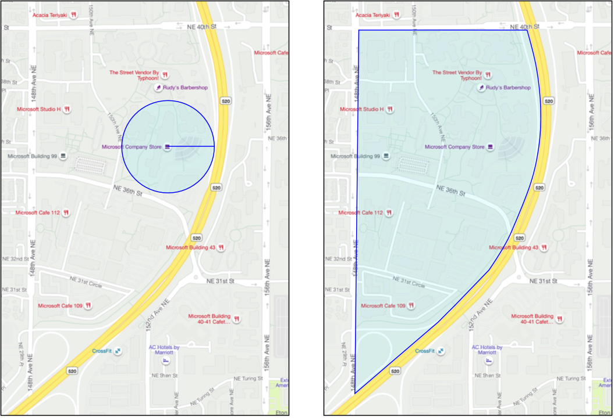

<!--
CO_OP_TRANSLATOR_METADATA:
{
  "original_hash": "078ae664c7b686bf069545e9a5fc95b2",
  "translation_date": "2025-08-27T14:34:26+00:00",
  "source_file": "3-transport/lessons/4-geofences/README.md",
  "language_code": "pa"
}
-->
# ਜਿਓਫੈਂਸ


> ਸਕੈਚਨੋਟ [ਨਿਤਿਆ ਨਰਸਿੰਮਹਨ](https://github.com/nitya) ਦੁਆਰਾ। ਵੱਡੇ ਵਰਜਨ ਲਈ ਚਿੱਤਰ 'ਤੇ ਕਲਿੱਕ ਕਰੋ।

ਇਹ ਵੀਡੀਓ ਜਿਓਫੈਂਸ ਅਤੇ Azure Maps ਵਿੱਚ ਉਨ੍ਹਾਂ ਦੇ ਉਪਯੋਗ ਬਾਰੇ ਝਲਕ ਦਿੰਦੀ ਹੈ, ਜੋ ਕਿ ਇਸ ਪਾਠ ਵਿੱਚ ਕਵਰ ਕੀਤੇ ਜਾਣ ਵਾਲੇ ਵਿਸ਼ੇ ਹਨ:

[](https://www.youtube.com/watch?v=nsrgYhaYNVY)

> 🎥 ਉੱਪਰ ਦਿੱਤੇ ਚਿੱਤਰ 'ਤੇ ਕਲਿੱਕ ਕਰਕੇ ਵੀਡੀਓ ਦੇਖੋ

## ਪਾਠ-ਪਹਿਲਾਂ ਪ੍ਰਸ਼ਨਾਵਲੀ

[ਪਾਠ-ਪਹਿਲਾਂ ਪ੍ਰਸ਼ਨਾਵਲੀ](https://black-meadow-040d15503.1.azurestaticapps.net/quiz/27)

## ਪਰਿਚਯ

ਪਿਛਲੇ 3 ਪਾਠਾਂ ਵਿੱਚ, ਤੁਸੀਂ IoT ਦੀ ਵਰਤੋਂ ਕਰਕੇ ਆਪਣੇ ਖੇਤ ਤੋਂ ਪ੍ਰੋਸੈਸਿੰਗ ਹੱਬ ਤੱਕ ਸਾਮਾਨ ਲਿਜਾਣ ਵਾਲੇ ਟਰੱਕਾਂ ਦੀ ਸਥਿਤੀ ਪਤਾ ਲਗਾਈ। ਤੁਸੀਂ GPS ਡਾਟਾ ਕੈਪਚਰ ਕੀਤਾ, ਇਸਨੂੰ ਕਲਾਉਡ ਵਿੱਚ ਸਟੋਰ ਕੀਤਾ, ਅਤੇ ਨਕਸ਼ੇ 'ਤੇ ਵਿਜੁਅਲਾਈਜ਼ ਕੀਤਾ। ਤੁਹਾਡੇ ਸਪਲਾਈ ਚੇਨ ਦੀ ਕੁਸ਼ਲਤਾ ਵਧਾਉਣ ਦਾ ਅਗਲਾ ਕਦਮ ਇਹ ਹੈ ਕਿ ਜਦੋਂ ਟਰੱਕ ਪ੍ਰੋਸੈਸਿੰਗ ਹੱਬ 'ਤੇ ਪਹੁੰਚਣ ਵਾਲਾ ਹੋਵੇ, ਤਾਂ ਤੁਹਾਨੂੰ ਇੱਕ ਅਲਰਟ ਮਿਲੇ, ਤਾਂ ਜੋ ਅਨਲੋਡ ਕਰਨ ਲਈ ਲੋੜੀਂਦਾ ਸਟਾਫ ਫੋਰਕਲਿਫਟ ਅਤੇ ਹੋਰ ਸਾਜ਼ੋ-ਸਾਮਾਨ ਨਾਲ ਤਿਆਰ ਹੋ ਸਕੇ। ਇਸ ਤਰੀਕੇ ਨਾਲ ਉਹ ਜਲਦੀ ਅਨਲੋਡ ਕਰ ਸਕਦੇ ਹਨ, ਅਤੇ ਤੁਸੀਂ ਟਰੱਕ ਅਤੇ ਡਰਾਈਵਰ ਦੇ ਉਡੀਕ ਲਈ ਪੈਸੇ ਨਹੀਂ ਦੇ ਰਹੇ ਹੋਵੇਗੇ।

ਇਸ ਪਾਠ ਵਿੱਚ ਤੁਸੀਂ ਜਿਓਫੈਂਸ ਬਾਰੇ ਸਿੱਖੋਗੇ - ਜਿਵੇਂ ਕਿ ਪ੍ਰੋਸੈਸਿੰਗ ਹੱਬ ਦੇ 2 ਕਿਲੋਮੀਟਰ ਦੇ ਦਾਇਰੇ ਵਿੱਚ ਇੱਕ ਖੇਤਰ, ਅਤੇ GPS ਕੋਆਰਡੀਨੇਟਸ ਨੂੰ ਜਾਚਣ ਦਾ ਤਰੀਕਾ ਕਿ ਉਹ ਜਿਓਫੈਂਸ ਦੇ ਅੰਦਰ ਹਨ ਜਾਂ ਬਾਹਰ, ਤਾਂ ਜੋ ਤੁਸੀਂ ਦੇਖ ਸਕੋ ਕਿ ਤੁਹਾਡਾ GPS ਸੈਂਸਰ ਖੇਤਰ ਵਿੱਚ ਪਹੁੰਚਿਆ ਹੈ ਜਾਂ ਨਹੀਂ।

ਇਸ ਪਾਠ ਵਿੱਚ ਅਸੀਂ ਕਵਰ ਕਰਾਂਗੇ:

* [ਜਿਓਫੈਂਸ ਕੀ ਹਨ](../../../../../3-transport/lessons/4-geofences)
* [ਜਿਓਫੈਂਸ ਨੂੰ ਪਰਿਭਾਸ਼ਿਤ ਕਰੋ](../../../../../3-transport/lessons/4-geofences)
* [ਜਿਓਫੈਂਸ ਦੇ ਖਿਲਾਫ ਪਾਇੰਟਸ ਦੀ ਜਾਂਚ ਕਰੋ](../../../../../3-transport/lessons/4-geofences)
* [ਸਰਵਰਲੈਸ ਕੋਡ ਤੋਂ ਜਿਓਫੈਂਸ ਦੀ ਵਰਤੋਂ ਕਰੋ](../../../../../3-transport/lessons/4-geofences)

> 🗑 ਇਹ ਪ੍ਰੋਜੈਕਟ ਦਾ ਆਖਰੀ ਪਾਠ ਹੈ, ਇਸ ਲਈ ਇਸ ਪਾਠ ਅਤੇ ਅਸਾਈਨਮੈਂਟ ਨੂੰ ਪੂਰਾ ਕਰਨ ਤੋਂ ਬਾਅਦ, ਆਪਣੇ ਕਲਾਉਡ ਸਰਵਿਸਿਜ਼ ਨੂੰ ਸਾਫ਼ ਕਰਨਾ ਨਾ ਭੁੱਲੋ। ਤੁਹਾਨੂੰ ਅਸਾਈਨਮੈਂਟ ਪੂਰਾ ਕਰਨ ਲਈ ਸਰਵਿਸਿਜ਼ ਦੀ ਲੋੜ ਹੋਵੇਗੀ, ਇਸ ਲਈ ਪਹਿਲਾਂ ਇਸਨੂੰ ਪੂਰਾ ਕਰਨਾ ਯਕੀਨੀ ਬਣਾਓ।
>
> ਜੇ ਲੋੜ ਹੋਵੇ, ਤਾਂ [ਆਪਣੇ ਪ੍ਰੋਜੈਕਟ ਨੂੰ ਸਾਫ਼ ਕਰਨ ਦੀ ਗਾਈਡ](../../../clean-up.md) ਨੂੰ ਵੇਖੋ।

## ਜਿਓਫੈਂਸ ਕੀ ਹਨ

ਜਿਓਫੈਂਸ ਇੱਕ ਅਸਲੀ ਜ਼ਮੀਨੀ ਖੇਤਰ ਲਈ ਵਰਚੁਅਲ ਪਰਿਮਿਟਰ ਹੈ। ਜਿਓਫੈਂਸ ਗੋਲ ਚੱਕਰ ਹੋ ਸਕਦੇ ਹਨ ਜੋ ਇੱਕ ਬਿੰਦੂ ਅਤੇ ਰੇਡੀਅਸ ਦੁਆਰਾ ਪਰਿਭਾਸ਼ਿਤ ਹੁੰਦੇ ਹਨ (ਉਦਾਹਰਣ ਲਈ, ਇੱਕ ਇਮਾਰਤ ਦੇ ਆਲੇ-ਦੁਆਲੇ 100 ਮੀਟਰ ਦਾ ਗੋਲ ਚੱਕਰ), ਜਾਂ ਇੱਕ ਖੇਤਰ ਨੂੰ ਕਵਰ ਕਰਨ ਵਾਲੇ ਬਹੁਭੁਜ ਜਿਵੇਂ ਕਿ ਸਕੂਲ ਜ਼ੋਨ, ਸ਼ਹਿਰ ਦੀ ਸੀਮਾ, ਜਾਂ ਯੂਨੀਵਰਸਿਟੀ ਜਾਂ ਦਫ਼ਤਰ ਕੈਂਪਸ।



> 💁 ਤੁਸੀਂ ਸ਼ਾਇਦ ਪਹਿਲਾਂ ਹੀ ਜਿਓਫੈਂਸ ਦੀ ਵਰਤੋਂ ਕਰ ਚੁੱਕੇ ਹੋਵੋਗੇ ਬਿਨਾਂ ਜਾਣਦੇ। ਜੇ ਤੁਸੀਂ iOS ਰਿਮਾਈਂਡਰ ਐਪ ਜਾਂ Google Keep ਵਿੱਚ ਸਥਿਤੀ ਦੇ ਆਧਾਰ 'ਤੇ ਰਿਮਾਈਂਡਰ ਸੈਟ ਕੀਤਾ ਹੈ, ਤਾਂ ਤੁਸੀਂ ਜਿਓਫੈਂਸ ਦੀ ਵਰਤੋਂ ਕੀਤੀ ਹੈ। ਇਹ ਐਪਸ ਦਿੱਤੀ ਸਥਿਤੀ ਦੇ ਆਧਾਰ 'ਤੇ ਜਿਓਫੈਂਸ ਸੈਟ ਕਰਦੀਆਂ ਹਨ ਅਤੇ ਜਦੋਂ ਤੁਹਾਡਾ ਫੋਨ ਜਿਓਫੈਂਸ ਵਿੱਚ ਦਾਖਲ ਹੁੰਦਾ ਹੈ, ਤਾਂ ਤੁਹਾਨੂੰ ਅਲਰਟ ਕਰਦੀਆਂ ਹਨ।

ਤੁਹਾਨੂੰ ਇਹ ਜਾਣਨ ਦੀ ਲੋੜ ਕਿਉਂ ਹੋ ਸਕਦੀ ਹੈ ਕਿ ਇੱਕ ਵਾਹਨ ਜਿਓਫੈਂਸ ਦੇ ਅੰਦਰ ਹੈ ਜਾਂ ਬਾਹਰ:

* ਅਨਲੋਡ ਕਰਨ ਦੀ ਤਿਆਰੀ - ਜਦੋਂ ਇੱਕ ਵਾਹਨ ਸਾਈਟ 'ਤੇ ਪਹੁੰਚਦਾ ਹੈ, ਤਾਂ ਨੋਟੀਫਿਕੇਸ਼ਨ ਮਿਲਣ ਨਾਲ ਟੀਮ ਵਾਹਨ ਨੂੰ ਅਨਲੋਡ ਕਰਨ ਲਈ ਤਿਆਰ ਹੋ ਸਕਦੀ ਹੈ, ਜਿਸ ਨਾਲ ਵਾਹਨ ਦੇ ਉਡੀਕ ਦੇ ਸਮੇਂ ਨੂੰ ਘਟਾਇਆ ਜਾ ਸਕਦਾ ਹੈ। ਇਸ ਨਾਲ ਡਰਾਈਵਰ ਘੱਟ ਉਡੀਕ ਸਮੇਂ ਨਾਲ ਇੱਕ ਦਿਨ ਵਿੱਚ ਹੋਰ ਡਿਲਿਵਰੀ ਕਰ ਸਕਦਾ ਹੈ।
* ਟੈਕਸ ਅਨੁਸਾਰਤਾ - ਕੁਝ ਦੇਸ਼ਾਂ ਵਿੱਚ, ਜਿਵੇਂ ਕਿ ਨਿਊਜ਼ੀਲੈਂਡ, ਡੀਜ਼ਲ ਵਾਹਨਾਂ ਲਈ ਸਿਰਫ਼ ਸਰਕਾਰੀ ਸੜਕਾਂ 'ਤੇ ਚਲਾਉਣ ਦੇ ਆਧਾਰ 'ਤੇ ਵਾਹਨ ਦੇ ਭਾਰ ਦੇ ਅਨੁਸਾਰ ਰੋਡ ਟੈਕਸ ਲਗਾਇਆ ਜਾਂਦਾ ਹੈ। ਜਿਓਫੈਂਸ ਦੀ ਵਰਤੋਂ ਕਰਕੇ ਤੁਸੀਂ ਸਰਕਾਰੀ ਸੜਕਾਂ 'ਤੇ ਚਲਾਈ ਗਈ ਦੂਰੀ ਨੂੰ ਟਰੈਕ ਕਰ ਸਕਦੇ ਹੋ, ਬਜਾਏ ਕਿ ਖੇਤਾਂ ਜਾਂ ਲੱਗਿੰਗ ਖੇਤਰਾਂ ਵਿੱਚ ਨਿੱਜੀ ਸੜਕਾਂ 'ਤੇ।
* ਚੋਰੀ ਦੀ ਨਿਗਰਾਨੀ - ਜੇਕਰ ਇੱਕ ਵਾਹਨ ਸਿਰਫ਼ ਕਿਸੇ ਖੇਤਰ ਵਿੱਚ ਰਹਿਣਾ ਚਾਹੀਦਾ ਹੈ, ਜਿਵੇਂ ਕਿ ਖੇਤ, ਅਤੇ ਇਹ ਜਿਓਫੈਂਸ ਤੋਂ ਬਾਹਰ ਚਲਾ ਜਾਂਦਾ ਹੈ, ਤਾਂ ਇਹ ਚੋਰੀ ਹੋ ਸਕਦਾ ਹੈ।
* ਸਥਿਤੀ ਅਨੁਸਾਰਤਾ - ਕੰਮ ਦੀ ਸਾਈਟ, ਖੇਤ ਜਾਂ ਫੈਕਟਰੀ ਦੇ ਕੁਝ ਹਿੱਸੇ ਕੁਝ ਵਾਹਨਾਂ ਲਈ ਪਾਬੰਦੀ ਵਾਲੇ ਹੋ ਸਕਦੇ ਹਨ, ਜਿਵੇਂ ਕਿ ਕ੍ਰਿਤ੍ਰਿਮ ਖਾਦ ਅਤੇ ਕੀਟਨਾਸ਼ਕ ਲਿਜਾਣ ਵਾਲੇ ਵਾਹਨਾਂ ਨੂੰ ਜੈਵਿਕ ਉਤਪਾਦ ਉਗਾਉਣ ਵਾਲੇ ਖੇਤਰਾਂ ਤੋਂ ਦੂਰ ਰੱਖਣਾ। ਜੇਕਰ ਜਿਓਫੈਂਸ ਵਿੱਚ ਦਾਖਲ ਹੁੰਦਾ ਹੈ, ਤਾਂ ਵਾਹਨ ਅਨੁਸਾਰਤਾ ਤੋਂ ਬਾਹਰ ਹੈ ਅਤੇ ਡਰਾਈਵਰ ਨੂੰ ਸੂਚਿਤ ਕੀਤਾ ਜਾ ਸਕਦਾ ਹੈ।

✅ ਕੀ ਤੁਸੀਂ ਜਿਓਫੈਂਸ ਦੇ ਹੋਰ ਉਪਯੋਗ ਬਾਰੇ ਸੋਚ ਸਕਦੇ ਹੋ?

Azure Maps, ਜਿਸਦੀ ਤੁਸੀਂ ਪਿਛਲੇ ਪਾਠ ਵਿੱਚ GPS ਡਾਟਾ ਵਿਜੁਅਲਾਈਜ਼ ਕਰਨ ਲਈ ਵਰਤੋਂ ਕੀਤੀ ਸੀ, ਤੁਹਾਨੂੰ ਜਿਓਫੈਂਸ ਪਰਿਭਾਸ਼ਿਤ ਕਰਨ ਦੀ ਅਤੇ ਫਿਰ ਜਾਂਚ ਕਰਨ ਦੀ ਆਗਿਆ ਦਿੰਦਾ ਹੈ ਕਿ ਇੱਕ ਬਿੰਦੂ ਜਿਓਫੈਂਸ ਦੇ ਅੰਦਰ ਹੈ ਜਾਂ ਬਾਹਰ।

## ਜਿਓਫੈਂਸ ਨੂੰ ਪਰਿਭਾਸ਼ਿਤ ਕਰੋ

ਜਿਓਫੈਂਸ GeoJSON ਦੀ ਵਰਤੋਂ ਕਰਕੇ ਪਰਿਭਾਸ਼ਿਤ ਕੀਤੇ ਜਾਂਦੇ ਹਨ, ਬਿਲਕੁਲ ਉਹੀ ਜਿਵੇਂ ਕਿ ਪਿਛਲੇ ਪਾਠ ਵਿੱਚ ਨਕਸ਼ੇ 'ਤੇ ਸ਼ਾਮਲ ਕੀਤੇ ਗਏ ਬਿੰਦੂ। ਇਸ ਮਾਮਲੇ ਵਿੱਚ, ਇਹ `Point` ਮੁੱਲਾਂ ਦੇ `FeatureCollection` ਦੀ ਬਜਾਏ, ਇੱਕ `Polygon` ਵਾਲੇ `FeatureCollection` ਹੁੰਦੇ ਹਨ।

```json
{
   "type": "FeatureCollection",
   "features": [
     {
       "type": "Feature",
       "geometry": {
         "type": "Polygon",
         "coordinates": [
           [
             [
               -122.13393688201903,
               47.63829579223815
             ],
             [
               -122.13389128446579,
               47.63782047131512
             ],
             [
               -122.13240802288054,
               47.63783312249837
             ],
             [
               -122.13238388299942,
               47.63829037035086
             ],
             [
               -122.13393688201903,
               47.63829579223815
             ]
           ]
         ]
       },
       "properties": {
         "geometryId": "1"
       }
     }
   ]
}
```

ਬਹੁਭੁਜ ਦੇ ਹਰ ਬਿੰਦੂ ਨੂੰ ਲੰਬਕਾਰ ਅਤੇ ਅਕਸ਼ਾਂਸ਼ ਦੇ ਜੋੜੇ ਵਜੋਂ ਪਰਿਭਾਸ਼ਿਤ ਕੀਤਾ ਜਾਂਦਾ ਹੈ, ਜੋ ਕਿ ਇੱਕ ਐਰੇ ਵਿੱਚ ਹੁੰਦੇ ਹਨ, ਅਤੇ ਇਹ ਬਿੰਦੂ ਇੱਕ ਐਰੇ ਵਿੱਚ ਹੁੰਦੇ ਹਨ ਜੋ `coordinates` ਵਜੋਂ ਸੈਟ ਹੁੰਦੇ ਹਨ। ਪਿਛਲੇ ਪਾਠ ਵਿੱਚ ਇੱਕ `Point` ਵਿੱਚ, `coordinates` ਇੱਕ ਐਰੇ ਸੀ ਜਿਸ ਵਿੱਚ 2 ਮੁੱਲ, ਅਕਸ਼ਾਂਸ਼ ਅਤੇ ਲੰਬਕਾਰ ਹੁੰਦੇ ਸਨ, ਜਦਕਿ ਇੱਕ `Polygon` ਵਿੱਚ ਇਹ 2 ਮੁੱਲਾਂ ਦੇ ਐਰੇ ਦਾ ਐਰੇ ਹੁੰਦਾ ਹੈ।

> 💁 ਯਾਦ ਰੱਖੋ, GeoJSON ਵਿੱਚ ਬਿੰਦੂਆਂ ਲਈ `longitude, latitude` ਵਰਤਿਆ ਜਾਂਦਾ ਹੈ, ਨਾ ਕਿ `latitude, longitude`

ਬਹੁਭੁਜ ਕੋਆਰਡੀਨੇਟਸ ਐਰੇ ਹਮੇਸ਼ਾਂ ਬਹੁਭੁਜ ਦੇ ਬਿੰਦੂਆਂ ਦੀ ਗਿਣਤੀ ਨਾਲੋਂ 1 ਵੱਧ ਐਂਟਰੀ ਰੱਖਦਾ ਹੈ, ਜਿਸ ਵਿੱਚ ਆਖਰੀ ਐਂਟਰੀ ਪਹਿਲੀ ਦੇ ਬਰਾਬਰ ਹੁੰਦੀ ਹੈ, ਬਹੁਭੁਜ ਨੂੰ ਬੰਦ ਕਰਦਾ ਹੈ। ਉਦਾਹਰਣ ਲਈ, ਇੱਕ ਆਯਤਕਾਰ ਲਈ 5 ਬਿੰਦੂ ਹੋਣਗੇ।


ਉਪਰ ਦਿੱਤੇ ਚਿੱਤਰ ਵਿੱਚ, ਇੱਕ ਆਯਤਕਾਰ ਹੈ। ਬਹੁਭੁਜ ਕੋਆਰਡੀਨੇਟਸ 47,-122 'ਤੇ ਉੱਤਰ-ਪੱਛਮ ਤੋਂ ਸ਼ੁਰੂ ਹੁੰਦੇ ਹਨ, ਫਿਰ 47,-121 'ਤੇ ਸੱਜੇ ਵੱਲ ਜਾਂਦੇ ਹਨ, ਫਿਰ 46,-121 'ਤੇ ਹੇਠਾਂ ਜਾਂਦੇ ਹਨ, ਫਿਰ 46,-122 'ਤੇ ਖੱਬੇ ਵੱਲ ਜਾਂਦੇ ਹਨ, ਅਤੇ ਫਿਰ 47,-122 'ਤੇ ਸ਼ੁਰੂਆਤੀ ਬਿੰਦੂ 'ਤੇ ਵਾਪਸ ਆ ਜਾਂਦੇ ਹਨ। ਇਸ ਨਾਲ ਬਹੁਭੁਜ ਨੂੰ 5 ਬਿੰਦੂ ਮਿਲਦੇ ਹਨ - ਉੱਤਰ-ਪੱਛਮ, ਉੱਤਰ-ਪੂਰਬ, ਦੱਖਣ-ਪੂਰਬ, ਦੱਖਣ-ਪੱਛਮ, ਅਤੇ ਫਿਰ ਉੱਤਰ-ਪੱਛਮ।

✅ ਆਪਣੇ ਘਰ ਜਾਂ ਸਕੂਲ ਦੇ ਆਲੇ-ਦੁਆਲੇ ਇੱਕ GeoJSON ਬਹੁਭੁਜ ਬਣਾਉਣ ਦੀ ਕੋਸ਼ਿਸ਼ ਕਰੋ। [GeoJSON.io](https://geojson.io/) ਵਰਗੇ ਟੂਲ ਦੀ ਵਰਤੋਂ ਕਰੋ।
ਉਪਰ ਦਿੱਤੀ ਤਸਵੀਰ ਵਿੱਚ, ਮਾਈਕਰੋਸਾਫਟ ਕੈਂਪਸ ਦੇ ਇੱਕ ਹਿੱਸੇ 'ਤੇ ਇੱਕ ਜਿਓਫੈਂਸ ਹੈ। ਲਾਲ ਰੇਖਾ ਇੱਕ ਟਰੱਕ ਨੂੰ 520 ਦੇ ਨਾਲ ਚਲਦੇ ਹੋਏ ਦਿਖਾਉਂਦੀ ਹੈ, ਜਿਸ ਵਿੱਚ GPS ਪੜ੍ਹਤਾਂ ਨੂੰ ਦਰਸਾਉਣ ਲਈ ਗੋਲ ਚਿੰਨ੍ਹ ਹਨ। ਜ਼ਿਆਦਾਤਰ ਪੜ੍ਹਤਾਂ ਸਹੀ ਹਨ ਅਤੇ 520 ਦੇ ਨਾਲ ਹਨ, ਪਰ ਇੱਕ ਗਲਤ ਪੜ੍ਹਤ ਜਿਓਫੈਂਸ ਦੇ ਅੰਦਰ ਹੈ। ਇਹ ਪੜ੍ਹਤ ਸਹੀ ਨਹੀਂ ਹੋ ਸਕਦੀ - ਕੋਈ ਵੀ ਸੜਕ ਨਹੀਂ ਹੈ ਜਿੱਥੇ ਟਰੱਕ ਅਚਾਨਕ 520 ਤੋਂ ਕੈਂਪਸ ਵਿੱਚ ਮੁੜ ਜਾਵੇ ਅਤੇ ਫਿਰ 520 'ਤੇ ਵਾਪਸ ਆ ਜਾਵੇ। ਜਿਓਫੈਂਸ ਦੀ ਜਾਂਚ ਕਰਨ ਵਾਲੇ ਕੋਡ ਨੂੰ ਜਿਓਫੈਂਸ ਟੈਸਟ ਦੇ ਨਤੀਜਿਆਂ 'ਤੇ ਕਾਰਵਾਈ ਕਰਨ ਤੋਂ ਪਹਿਲਾਂ ਪਿਛਲੀਆਂ ਪੜ੍ਹਤਾਂ ਨੂੰ ਧਿਆਨ ਵਿੱਚ ਰੱਖਣਾ ਪਵੇਗਾ।

✅ ਤੁਹਾਨੂੰ ਕਿਹੜੇ ਵਾਧੂ ਡਾਟਾ ਦੀ ਲੋੜ ਹੋਵੇਗੀ ਇਹ ਜਾਂਚਣ ਲਈ ਕਿ ਕੀ GPS ਪੜ੍ਹਤ ਸਹੀ ਮੰਨੀ ਜਾ ਸਕਦੀ ਹੈ?

### ਕੰਮ - ਜਿਓਫੈਂਸ ਦੇ ਖਿਲਾਫ ਪੌਇੰਟਸ ਦੀ ਜਾਂਚ ਕਰੋ

1. ਵੈੱਬ API ਕਵੈਰੀ ਲਈ URL ਬਣਾਉਣ ਨਾਲ ਸ਼ੁਰੂ ਕਰੋ। ਫਾਰਮੈਟ ਇਹ ਹੈ:

    ```output
    https://atlas.microsoft.com/spatial/geofence/json?api-version=1.0&deviceId=gps-sensor&subscription-key=<subscription-key>&udid=<UDID>&lat=<lat>&lon=<lon>
    ```

    `<subscription_key>` ਨੂੰ ਆਪਣੇ Azure Maps ਖਾਤੇ ਲਈ API ਕੁੰਜੀ ਨਾਲ ਬਦਲੋ।

    `<UDID>` ਨੂੰ ਪਿਛਲੇ ਕੰਮ ਤੋਂ ਜਿਓਫੈਂਸ ਦੇ UDID ਨਾਲ ਬਦਲੋ।

    `<lat>` ਅਤੇ `<lon>` ਨੂੰ ਉਸ ਅਕਸ਼ਾਂਸ ਅਤੇ ਦੇਸ਼ਾਂਤਰ ਨਾਲ ਬਦਲੋ ਜਿਸਨੂੰ ਤੁਸੀਂ ਜਾਂਚਣਾ ਚਾਹੁੰਦੇ ਹੋ।

    ਇਹ URL `https://atlas.microsoft.com/spatial/geofence/json` API ਨੂੰ ਵਰਤਦਾ ਹੈ ਜੋ GeoJSON ਦੀ ਵਰਤੋਂ ਕਰਕੇ ਪਰਿਭਾਸ਼ਿਤ ਜਿਓਫੈਂਸ ਨੂੰ ਕਵੈਰੀ ਕਰਦਾ ਹੈ। ਇਹ `1.0` API ਵਰਜਨ ਨੂੰ ਟਾਰਗੇਟ ਕਰਦਾ ਹੈ। `deviceId` ਪੈਰਾਮੀਟਰ ਲਾਜ਼ਮੀ ਹੈ ਅਤੇ ਇਹ ਉਸ ਡਿਵਾਈਸ ਦਾ ਨਾਮ ਹੋਣਾ ਚਾਹੀਦਾ ਹੈ ਜਿਸ ਤੋਂ ਅਕਸ਼ਾਂਸ ਅਤੇ ਦੇਸ਼ਾਂਤਰ ਆਉਂਦੇ ਹਨ।

    ਡਿਫੌਲਟ ਖੋਜ ਬਫਰ 50 ਮੀਟਰ ਹੈ, ਅਤੇ ਤੁਸੀਂ ਇਸਨੂੰ ਵਾਧੂ ਪੈਰਾਮੀਟਰ `searchBuffer=<distance>` ਪਾਸ ਕਰਕੇ ਬਦਲ ਸਕਦੇ ਹੋ, ਜਿੱਥੇ `<distance>` ਨੂੰ ਮੀਟਰਾਂ ਵਿੱਚ ਖੋਜ ਬਫਰ ਦੀ ਦੂਰੀ ਸੈਟ ਕੀਤਾ ਜਾ ਸਕਦਾ ਹੈ, 0 ਤੋਂ 500 ਤੱਕ।

1. ਇਸ URL 'ਤੇ GET ਬੇਨਤੀ ਕਰਨ ਲਈ curl ਦੀ ਵਰਤੋਂ ਕਰੋ:

    ```sh
    curl --request GET '<URL>'
    ```

    > 💁 ਜੇ ਤੁਹਾਨੂੰ `BadRequest` ਦਾ ਰਿਸਪਾਂਸ ਕੋਡ ਮਿਲਦਾ ਹੈ, ਜਿਸ ਵਿੱਚ ਗਲਤੀ ਹੈ:
    >
    > ```output
    > Invalid GeoJSON: All feature properties should contain a geometryId, which is used for identifying the geofence.
    > ```
    >
    > ਤਾਂ ਤੁਹਾਡਾ GeoJSON `properties` ਸੈਕਸ਼ਨ ਨਾਲ `geometryId` ਦੇ ਬਗੈਰ ਹੈ। ਤੁਹਾਨੂੰ ਆਪਣੇ GeoJSON ਨੂੰ ਠੀਕ ਕਰਨਾ ਪਵੇਗਾ, ਫਿਰ ਉਪਰੋਕਤ ਕਦਮਾਂ ਨੂੰ ਦੁਹਰਾਉਣਾ ਅਤੇ ਨਵਾਂ UDID ਪ੍ਰਾਪਤ ਕਰਨਾ ਪਵੇਗਾ।

1. ਜਵਾਬ ਵਿੱਚ `geometries` ਦੀ ਸੂਚੀ ਹੋਵੇਗੀ, GeoJSON ਦੀ ਵਰਤੋਂ ਕਰਕੇ ਬਣਾਏ ਗਏ ਜਿਓਫੈਂਸ ਵਿੱਚ ਪਰਿਭਾਸ਼ਿਤ ਹਰ ਪਾਲੀਗਨ ਲਈ ਇੱਕ। ਹਰ ਜਿਓਮੈਟਰੀ ਵਿੱਚ 3 ਖੇਤਰ ਹੁੰਦੇ ਹਨ ਜੋ ਦਿਲਚਸਪੀ ਦੇ ਹਨ, `distance`, `nearestLat` ਅਤੇ `nearestLon`।

    ```output
    {
        "geometries": [
            {
                "deviceId": "gps-sensor",
                "udId": "7c3776eb-da87-4c52-ae83-caadf980323a",
                "geometryId": "1",
                "distance": 999.0,
                "nearestLat": 47.645875,
                "nearestLon": -122.142713
            }
        ],
        "expiredGeofenceGeometryId": [],
        "invalidPeriodGeofenceGeometryId": []
    }
    ```

    * `nearestLat` ਅਤੇ `nearestLon` ਉਹ ਅਕਸ਼ਾਂਸ ਅਤੇ ਦੇਸ਼ਾਂਤਰ ਹਨ ਜੋ ਜਿਓਫੈਂਸ ਦੇ ਕਿਨਾਰੇ 'ਤੇ ਉਸ ਸਥਾਨ ਦੇ ਸਭ ਤੋਂ ਨੇੜੇ ਹਨ ਜਿਸਨੂੰ ਜਾਂਚਿਆ ਜਾ ਰਿਹਾ ਹੈ।

    * `distance` ਉਹ ਦੂਰੀ ਹੈ ਜੋ ਜਾਂਚੇ ਜਾ ਰਹੇ ਸਥਾਨ ਤੋਂ ਜਿਓਫੈਂਸ ਦੇ ਕਿਨਾਰੇ ਦੇ ਸਭ ਤੋਂ ਨੇੜੇ ਬਿੰਦੂ ਤੱਕ ਹੈ। ਨਕਾਰਾਤਮਕ ਸੰਖਿਆਵਾਂ ਦਾ ਮਤਲਬ ਹੈ ਜਿਓਫੈਂਸ ਦੇ ਅੰਦਰ, ਸਕਾਰਾਤਮਕ ਬਾਹਰ। ਇਹ ਮੁੱਲ 50 (ਡਿਫੌਲਟ ਖੋਜ ਬਫਰ) ਜਾਂ 999 ਤੋਂ ਘੱਟ ਹੋਵੇਗਾ।

1. ਇਸਨੂੰ ਜਿਓਫੈਂਸ ਦੇ ਅੰਦਰ ਅਤੇ ਬਾਹਰ ਸਥਾਨਾਂ ਨਾਲ ਕਈ ਵਾਰ ਦੁਹਰਾਓ।

## ਸਰਵਰਲੈੱਸ ਕੋਡ ਤੋਂ ਜਿਓਫੈਂਸ ਦੀ ਵਰਤੋਂ ਕਰੋ

ਹੁਣ ਤੁਸੀਂ ਆਪਣੇ ਫੰਕਸ਼ਨਜ਼ ਐਪ ਵਿੱਚ ਇੱਕ ਨਵਾਂ ਟ੍ਰਿਗਰ ਸ਼ਾਮਲ ਕਰ ਸਕਦੇ ਹੋ ਜੋ IoT ਹੱਬ GPS ਇਵੈਂਟ ਡਾਟਾ ਨੂੰ ਜਿਓਫੈਂਸ ਦੇ ਖਿਲਾਫ ਜਾਂਚਦਾ ਹੈ।

### ਕਨਜ਼ਿਊਮਰ ਗਰੁੱਪ

ਜਿਵੇਂ ਤੁਸੀਂ ਪਿਛਲੇ ਪਾਠਾਂ ਵਿੱਚ ਯਾਦ ਕਰਦੇ ਹੋ, IoT ਹੱਬ ਤੁਹਾਨੂੰ ਉਹ ਇਵੈਂਟ ਦੁਬਾਰਾ ਚਲਾਉਣ ਦੀ ਆਗਿਆ ਦੇਵੇਗਾ ਜੋ ਹੱਬ ਦੁਆਰਾ ਪ੍ਰਾਪਤ ਕੀਤੇ ਗਏ ਹਨ ਪਰ ਪ੍ਰਕਿਰਿਆ ਨਹੀਂ ਕੀਤੇ ਗਏ। ਪਰ ਜੇਕਰ ਕਈ ਟ੍ਰਿਗਰ ਜੁੜੇ ਹੋਣ ਤਾਂ ਕੀ ਹੋਵੇਗਾ? ਇਹ ਕਿਵੇਂ ਜਾਣੇਗਾ ਕਿ ਕਿਹੜੇ ਨੇ ਕਿਹੜੇ ਇਵੈਂਟ ਪ੍ਰਕਿਰਿਆ ਕੀਤੇ ਹਨ?

ਜਵਾਬ ਹੈ ਕਿ ਇਹ ਨਹੀਂ ਕਰ ਸਕਦਾ! ਇਸ ਦੀ ਬਜਾਏ ਤੁਸੀਂ ਵੱਖ-ਵੱਖ ਕਨੈਕਸ਼ਨ ਪਰਿਭਾਸ਼ਿਤ ਕਰ ਸਕਦੇ ਹੋ ਜੋ ਇਵੈਂਟਸ ਨੂੰ ਪੜ੍ਹ ਸਕਦੇ ਹਨ, ਅਤੇ ਹਰ ਇੱਕ ਅਪੜਾਏ ਗਏ ਸੁਨੇਹਿਆਂ ਦੀ ਦੁਬਾਰਾ ਚਲਾਉਣ ਦੀ ਪ੍ਰਬੰਧਨਾ ਕਰ ਸਕਦਾ ਹੈ। ਇਹਨਾਂ ਨੂੰ *ਕਨਜ਼ਿਊਮਰ ਗਰੁੱਪ* ਕਿਹਾ ਜਾਂਦਾ ਹੈ। ਜਦੋਂ ਤੁਸੀਂ ਐਂਡਪੌਇੰਟ ਨਾਲ ਜੁੜਦੇ ਹੋ, ਤੁਸੀਂ ਨਿਰਧਾਰਤ ਕਰ ਸਕਦੇ ਹੋ ਕਿ ਤੁਸੀਂ ਕਿਹੜੇ ਕਨਜ਼ਿਊਮਰ ਗਰੁੱਪ ਨਾਲ ਜੁੜਨਾ ਚਾਹੁੰਦੇ ਹੋ। ਤੁਹਾਡੇ ਐਪਲੀਕੇਸ਼ਨ ਦੇ ਹਰ ਹਿੱਸੇ ਨੂੰ ਵੱਖਰੇ ਕਨਜ਼ਿਊਮਰ ਗਰੁੱਪ ਨਾਲ ਜੁੜਨਾ ਪਵੇਗਾ।


ਸਿਧਾਂਤਕ ਤੌਰ 'ਤੇ ਹਰ ਕਨਜ਼ਿਊਮਰ ਗਰੁੱਪ ਨਾਲ 5 ਐਪਲੀਕੇਸ਼ਨ ਜੁੜ ਸਕਦੇ ਹਨ, ਅਤੇ ਉਹਨਾਂ ਨੂੰ ਸੁਨੇਹੇ ਪ੍ਰਾਪਤ ਹੋਣ 'ਤੇ ਮਿਲਣਗੇ। ਇਹ ਸਭ ਤੋਂ ਵਧੀਆ ਅਭਿਆਸ ਹੈ ਕਿ ਹਰ ਕਨਜ਼ਿਊਮਰ ਗਰੁੱਪ ਨੂੰ ਸਿਰਫ ਇੱਕ ਐਪਲੀਕੇਸ਼ਨ ਐਕਸੈਸ ਕਰੇ ਤਾਂ ਜੋ ਸੁਨੇਹੇ ਦੀ ਦੁਬਾਰਾ ਪ੍ਰਕਿਰਿਆ ਤੋਂ ਬਚਿਆ ਜਾ ਸਕੇ, ਅਤੇ ਯਕੀਨੀ ਬਣਾਇਆ ਜਾ ਸਕੇ ਕਿ ਰੀਸਟਾਰਟ ਕਰਨ 'ਤੇ ਸਾਰੇ ਕਤਾਰਬੱਧ ਸੁਨੇਹੇ ਸਹੀ ਤਰੀਕੇ ਨਾਲ ਪ੍ਰਕਿਰਿਆ ਕੀਤੇ ਗਏ ਹਨ। ਉਦਾਹਰਣ ਲਈ, ਜੇ ਤੁਸੀਂ ਆਪਣਾ ਫੰਕਸ਼ਨਜ਼ ਐਪ ਲੋਕਲ ਤੌਰ 'ਤੇ ਚਲਾਇਆ ਅਤੇ ਇਸਨੂੰ ਕਲਾਉਡ ਵਿੱਚ ਚਲਾਇਆ, ਤਾਂ ਦੋਵੇਂ ਸੁਨੇਹੇ ਪ੍ਰਕਿਰਿਆ ਕਰਨਗੇ, ਜਿਸ ਨਾਲ ਸਟੋਰੇਜ ਖਾਤੇ ਵਿੱਚ ਡੁਪਲੀਕੇਟ ਬਲੌਬ ਸਟੋਰ ਹੋਣਗੇ।

ਜੇ ਤੁਸੀਂ ਪਿਛਲੇ ਪਾਠ ਵਿੱਚ ਬਣਾਏ IoT ਹੱਬ ਟ੍ਰਿਗਰ ਲਈ `function.json` ਫਾਈਲ ਦੀ ਸਮੀਖਿਆ ਕਰਦੇ ਹੋ, ਤਾਂ ਤੁਸੀਂ ਇਵੈਂਟ ਹੱਬ ਟ੍ਰਿਗਰ ਬਾਈਂਡਿੰਗ ਸੈਕਸ਼ਨ ਵਿੱਚ ਕਨਜ਼ਿਊਮਰ ਗਰੁੱਪ ਦੇਖੋਗੇ:

```json
"consumerGroup": "$Default"
```

ਜਦੋਂ ਤੁਸੀਂ IoT ਹੱਬ ਬਣਾਉਂਦੇ ਹੋ, ਤਾਂ ਤੁਹਾਨੂੰ ਡਿਫੌਲਟ ਤੌਰ 'ਤੇ `$Default` ਕਨਜ਼ਿਊਮਰ ਗਰੁੱਪ ਮਿਲਦਾ ਹੈ। ਜੇ ਤੁਸੀਂ ਇੱਕ ਵਾਧੂ ਟ੍ਰਿਗਰ ਸ਼ਾਮਲ ਕਰਨਾ ਚਾਹੁੰਦੇ ਹੋ, ਤਾਂ ਤੁਸੀਂ ਇਸਨੂੰ ਇੱਕ ਨਵੇਂ ਕਨਜ਼ਿਊਮਰ ਗਰੁੱਪ ਦੀ ਵਰਤੋਂ ਕਰਕੇ ਸ਼ਾਮਲ ਕਰ ਸਕਦੇ ਹੋ।

> 💁 ਇਸ ਪਾਠ ਵਿੱਚ, ਤੁਸੀਂ ਜਿਓਫੈਂਸ ਦੀ ਜਾਂਚ ਕਰਨ ਲਈ ਇੱਕ ਵੱਖਰੇ ਫੰਕਸ਼ਨ ਦੀ ਵਰਤੋਂ ਕਰੋਗੇ ਜੋ GPS ਡਾਟਾ ਸਟੋਰ ਕਰਨ ਲਈ ਵਰਤਿਆ ਜਾਂਦਾ ਹੈ। ਇਹ ਦਿਖਾਉਣ ਲਈ ਹੈ ਕਿ ਕਿਵੇਂ ਕਨਜ਼ਿਊਮਰ ਗਰੁੱਪ ਦੀ ਵਰਤੋਂ ਕੀਤੀ ਜਾ ਸਕਦੀ ਹੈ ਅਤੇ ਕੋਡ ਨੂੰ ਵੱਖਰਾ ਕੀਤਾ ਜਾ ਸਕਦਾ ਹੈ ਤਾਂ ਜੋ ਇਸਨੂੰ ਪੜ੍ਹਨਾ ਅਤੇ ਸਮਝਣਾ ਆਸਾਨ ਹੋਵੇ। ਇੱਕ ਉਤਪਾਦਨ ਐਪਲੀਕੇਸ਼ਨ ਵਿੱਚ ਤੁਸੀਂ ਇਸਨੂੰ ਕਈ ਤਰੀਕਿਆਂ ਨਾਲ ਆਰਕੀਟੈਕਟ ਕਰ ਸਕਦੇ ਹੋ - ਦੋਵੇਂ ਨੂੰ ਇੱਕ ਫੰਕਸ਼ਨ 'ਤੇ ਰੱਖਣਾ, ਸਟੋਰੇਜ ਖਾਤੇ 'ਤੇ ਟ੍ਰਿਗਰ ਦੀ ਵਰਤੋਂ ਕਰਕੇ ਜਿਓਫੈਂਸ ਦੀ ਜਾਂਚ ਕਰਨ ਲਈ ਇੱਕ ਫੰਕਸ਼ਨ ਚਲਾਉਣਾ, ਜਾਂ ਕਈ ਫੰਕਸ਼ਨਜ਼ ਦੀ ਵਰਤੋਂ ਕਰਨਾ। ਇਸਦਾ ਕੋਈ 'ਸਹੀ ਤਰੀਕਾ' ਨਹੀਂ ਹੈ, ਇਹ ਤੁਹਾਡੇ ਐਪਲੀਕੇਸ਼ਨ ਅਤੇ ਤੁਹਾਡੀਆਂ ਲੋੜਾਂ 'ਤੇ ਨਿਰਭਰ ਕਰਦਾ ਹੈ।

### ਕੰਮ - ਇੱਕ ਨਵਾਂ ਕਨਜ਼ਿਊਮਰ ਗਰੁੱਪ ਬਣਾਓ

1. ਆਪਣੇ IoT ਹੱਬ ਲਈ `geofence` ਨਾਮਕ ਇੱਕ ਨਵਾਂ ਕਨਜ਼ਿਊਮਰ ਗਰੁੱਪ ਬਣਾਉਣ ਲਈ ਹੇਠਾਂ ਦਿੱਤੇ ਕਮਾਂਡ ਨੂੰ ਚਲਾਓ:

    ```sh
    az iot hub consumer-group create --name geofence \
                                     --hub-name <hub_name>
    ```

    `<hub_name>` ਨੂੰ ਆਪਣੇ IoT ਹੱਬ ਲਈ ਵਰਤੇ ਗਏ ਨਾਮ ਨਾਲ ਬਦਲੋ।

1. ਜੇ ਤੁਸੀਂ IoT ਹੱਬ ਲਈ ਸਾਰੇ ਕਨਜ਼ਿਊਮਰ ਗਰੁੱਪ ਦੇਖਣਾ ਚਾਹੁੰਦੇ ਹੋ, ਤਾਂ ਹੇਠਾਂ ਦਿੱਤੇ ਕਮਾਂਡ ਨੂੰ ਚਲਾਓ:

    ```sh
    az iot hub consumer-group list --output table \
                                   --hub-name <hub_name>
    ```

    `<hub_name>` ਨੂੰ ਆਪਣੇ IoT ਹੱਬ ਲਈ ਵਰਤੇ ਗਏ ਨਾਮ ਨਾਲ ਬਦਲੋ। ਇਹ ਸਾਰੇ ਕਨਜ਼ਿਊਮਰ ਗਰੁੱਪ ਦੀ ਸੂਚੀ ਦਿਖਾਵੇਗਾ।

    ```output
    Name      ResourceGroup
    --------  ---------------
    $Default  gps-sensor
    geofence  gps-sensor
    ```

> 💁 ਜਦੋਂ ਤੁਸੀਂ ਪਿਛਲੇ ਪਾਠ ਵਿੱਚ IoT ਹੱਬ ਇਵੈਂਟ ਮਾਨੀਟਰ ਚਲਾਇਆ, ਤਾਂ ਇਹ `$Default` ਕਨਜ਼ਿਊਮਰ ਗਰੁੱਪ ਨਾਲ ਜੁੜਿਆ। ਇਸ ਕਾਰਨ ਤੁਸੀਂ ਇਵੈਂਟ ਮਾਨੀਟਰ ਅਤੇ ਇੱਕ ਇਵੈਂਟ ਟ੍ਰਿਗਰ ਨਹੀਂ ਚਲਾ ਸਕਦੇ। ਜੇ ਤੁਸੀਂ ਦੋਵੇਂ ਚਲਾਉਣਾ ਚਾਹੁੰਦੇ ਹੋ, ਤਾਂ ਤੁਸੀਂ ਆਪਣੇ ਸਾਰੇ ਫੰਕਸ਼ਨਜ਼ ਐਪਸ ਲਈ ਹੋਰ ਕਨਜ਼ਿਊਮਰ ਗਰੁੱਪ ਦੀ ਵਰਤੋਂ ਕਰ ਸਕਦੇ ਹੋ, ਅਤੇ `$Default` ਨੂੰ ਇਵੈਂਟ ਮਾਨੀਟਰ ਲਈ ਰੱਖ ਸਕਦੇ ਹੋ।

### ਕੰਮ - ਇੱਕ ਨਵਾਂ IoT ਹੱਬ ਟ੍ਰਿਗਰ ਬਣਾਓ

1. ਆਪਣੇ `gps-trigger` ਫੰਕਸ਼ਨ ਐਪ ਵਿੱਚ ਜੋ ਤੁਸੀਂ ਪਿਛਲੇ ਪਾਠ ਵਿੱਚ ਬਣਾਇਆ ਸੀ, ਇੱਕ ਨਵਾਂ IoT ਹੱਬ ਇਵੈਂਟ ਟ੍ਰਿਗਰ ਸ਼ਾਮਲ ਕਰੋ। ਇਸ ਫੰਕਸ਼ਨ ਨੂੰ `geofence-trigger` ਕਹੋ।

    > ⚠️ ਜੇ ਲੋੜ ਹੋਵੇ, ਤਾਂ ਤੁਸੀਂ [ਪ੍ਰੋਜੈਕਟ 2, ਪਾਠ 5 ਤੋਂ IoT ਹੱਬ ਇਵੈਂਟ ਟ੍ਰਿਗਰ ਬਣਾਉਣ ਲਈ ਹਦਾਇਤਾਂ ਨੂੰ ਵੇਖ ਸਕਦੇ ਹੋ](../../../2-farm/lessons/5-migrate-application-to-the-cloud/README.md#create-an-iot-hub-event-trigger)।

1. `function.json` ਫਾਈਲ ਵਿੱਚ IoT ਹੱਬ ਕਨੈਕਸ਼ਨ ਸਟਰਿੰਗ ਨੂੰ ਕਨਫਿਗਰ ਕਰੋ। `local.settings.json` ਸਾਰੇ ਟ੍ਰਿਗਰਾਂ ਵਿੱਚ ਸਾਂਝਾ ਕੀਤਾ ਜਾਂਦਾ ਹੈ।

1. `function.json` ਫਾਈਲ ਵਿੱਚ `consumerGroup` ਦੇ ਮੁੱਲ ਨੂੰ ਨਵੇਂ `geofence` ਕਨਜ਼ਿਊਮਰ ਗਰੁੱਪ ਨੂੰ ਦਰਸਾਉਣ ਲਈ ਅਪਡੇਟ ਕਰੋ:

    ```json
    "consumerGroup": "geofence"
    ```

1. ਤੁਹਾਨੂੰ ਇਸ ਟ੍ਰਿਗਰ ਵਿੱਚ ਆਪਣੇ Azure Maps ਖਾਤੇ ਲਈ ਸਬਸਕ੍ਰਿਪਸ਼ਨ ਕੁੰਜੀ ਦੀ ਲੋੜ ਹੋਵੇਗੀ, ਇਸ ਲਈ `local.settings.json` ਫਾਈਲ ਵਿੱਚ `MAPS_KEY` ਨਾਮਕ ਇੱਕ ਨਵਾਂ ਐਂਟਰੀ ਸ਼ਾਮਲ ਕਰੋ।

1. ਯਕੀਨੀ ਬਣਾਓ ਕਿ ਇਹ ਸੁਨੇਹੇ ਪ੍ਰਕਿਰਿਆ ਕਰ ਰਿਹਾ ਹੈ। `iot-hub-trigger` ਜੋ ਪਿਛਲੇ ਪਾਠ ਵਿੱਚ ਬਣਾਇਆ ਗਿਆ ਸੀ, ਉਹ ਵੀ ਚੱਲੇਗਾ ਅਤੇ ਸਟੋਰੇਜ ਵਿੱਚ ਬਲੌਬ ਅਪਲੋਡ ਕਰੇਗਾ।

    > ਡੁਪਲੀਕੇਟ GPS ਪੜ੍ਹਤਾਂ ਤੋਂ ਬਚਣ ਲਈ, ਤੁਸੀਂ ਕਲਾਉਡ ਵਿੱਚ ਚੱਲ ਰਹੇ ਫੰਕਸ਼ਨਜ਼ ਐਪ ਨੂੰ ਰੋਕ ਸਕਦੇ ਹੋ। ਇਸ ਲਈ ਹੇਠਾਂ ਦਿੱਤੇ ਕਮਾਂਡ ਦੀ ਵਰਤੋਂ ਕਰੋ:
    >
    > ```sh
    > az functionapp stop --resource-group gps-sensor \
    >                     --name <functions_app_name>
    > ```
    >
    > `<functions_app_name>` ਨੂੰ ਆਪਣੇ ਫੰਕਸ਼ਨਜ਼ ਐਪ ਲਈ ਵਰਤੇ ਗਏ ਨਾਮ ਨਾਲ ਬਦਲੋ।
    >
    > ਤੁਸੀਂ ਇਸਨੂੰ ਬਾਅਦ ਵਿੱਚ ਹੇਠਾਂ ਦਿੱਤੇ ਕਮਾਂਡ ਨਾਲ ਦੁਬਾਰਾ ਚਾਲੂ ਕਰ ਸਕਦੇ ਹੋ:
    >
    > ```sh
    > az functionapp start --resource-group gps-sensor \
    >                     --name <functions_app_name>
    > ```
    >
    > `<functions_app_name>` ਨੂੰ ਆਪਣੇ ਫੰਕਸ਼ਨਜ਼ ਐਪ ਲਈ ਵਰਤੇ ਗਏ ਨਾਮ ਨਾਲ ਬਦਲੋ।

### ਕੰਮ - ਟ੍ਰਿਗਰ ਤੋਂ ਜਿਓਫੈਂਸ ਦੀ ਜਾਂਚ ਕਰੋ

ਪਿਛਲੇ ਪਾਠ ਵਿੱਚ ਤੁਸੀਂ ਇੱਕ ਜਿਓਫੈਂਸ ਨੂੰ ਕਵੈਰੀ ਕਰਨ ਲਈ curl ਦੀ ਵਰਤੋਂ ਕੀਤੀ ਸੀ ਤਾਂ ਜੋ ਦੇਖਿਆ ਜਾ ਸਕੇ ਕਿ ਇੱਕ ਬਿੰਦੂ ਅੰਦਰ ਜਾਂ ਬਾਹਰ ਹੈ। ਤੁਸੀਂ ਆਪਣੇ ਟ੍ਰਿਗਰ ਦੇ ਅੰਦਰੋਂ ਇੱਕ ਸਮਾਨ ਵੈੱਬ ਬੇਨਤੀ ਕਰ ਸਕਦੇ ਹੋ।

1. ਜਿਓਫੈਂਸ ਨੂੰ ਕਵੈਰੀ ਕਰਨ ਲਈ, ਤੁਹਾਨੂੰ ਇਸਦਾ UDID ਚਾਹੀਦਾ ਹੈ। `local.settings.json` ਫਾਈਲ ਵਿੱਚ `GEOFENCE_UDID` ਨਾਮਕ ਇੱਕ ਨਵਾਂ ਐਂਟਰੀ ਸ਼ਾਮਲ ਕਰੋ।

1. ਨਵੇਂ `geofence-trigger` ਟ੍ਰਿਗਰ ਤੋਂ `__init__.py` ਫਾਈਲ ਖੋਲ੍ਹੋ।

1. ਫਾਈਲ ਦੇ ਸ਼ੁਰੂ ਵਿੱਚ ਹੇਠਾਂ ਦਿੱਤਾ ਗਿਆ ਇੰਪੋਰਟ ਸ਼ਾਮਲ ਕਰੋ:

    ```python
    import json
    import os
    import requests
    ```

    `requests` ਪੈਕੇਜ ਤੁਹਾਨੂੰ ਵੈੱਬ API ਕਾਲਾਂ ਕਰਨ ਦੀ ਆਗਿਆ ਦਿੰਦਾ ਹੈ। Azure Maps ਵਿੱਚ ਕੋਈ Python SDK ਨਹੀਂ ਹੈ, ਤੁਹਾਨੂੰ ਇਸਨੂੰ Python ਕੋਡ ਤੋਂ ਵਰਤਣ ਲਈ ਵੈੱਬ API ਕਾਲਾਂ ਕਰਨ ਦੀ ਲੋੜ ਹੈ।

1. `main` ਵਿਧੀ ਦੇ ਸ਼ੁਰੂ ਵਿੱਚ ਹੇਠਾਂ ਦਿੱਤੀਆਂ 2 ਲਾਈਨਾਂ ਨੂੰ ਸ਼ਾਮਲ ਕਰੋ ਤਾਂ ਜੋ Maps ਸਬਸਕ੍ਰਿਪਸ਼ਨ ਕੁੰਜੀ ਪ੍ਰਾਪਤ ਕੀਤੀ ਜਾ ਸਕੇ:

    ```python
    maps_key = os.environ['MAPS_KEY']
    geofence_udid = os.environ['GEOFENCE_UDID']    
    ```

1. `for event in events` ਲੂਪ ਦੇ ਅੰਦਰ, ਹੇਠਾਂ ਦਿੱਤਾ ਕੋਡ ਸ਼ਾਮਲ ਕਰੋ ਤਾਂ ਜੋ ਹਰ ਇਵੈਂਟ ਤੋਂ ਅਕਸ਼ਾਂਸ ਅਤੇ ਦੇਸ਼ਾਂਤਰ ਪ੍ਰਾਪਤ ਕੀਤਾ ਜਾ ਸਕੇ:

    ```python
    event_body = json.loads(event.get_body().decode('utf-8'))
    lat = event_body['gps']['lat']
    lon = event_body['gps']['lon']
    ```

    ਇਹ ਕੋਡ ਇਵੈਂਟ ਬਾਡੀ ਤੋਂ JSON ਨੂੰ ਡਿਕਸ਼ਨਰੀ ਵਿੱਚ ਪਰਿਵਰਤਿਤ ਕਰਦਾ ਹੈ, ਫਿਰ `gps` ਖੇਤਰ ਤੋਂ `lat` ਅਤੇ `lon` ਨੂੰ ਕੱਢਦਾ ਹੈ।

1. ਜਦੋਂ ਤੁਸੀਂ `requests` ਦੀ ਵਰਤੋਂ ਕਰਦੇ ਹੋ, ਤਾਂ curl ਨਾਲ ਲੰਬੇ URL ਬਣਾਉਣ ਦੀ ਬਜਾਏ, ਤੁਸੀਂ ਸਿਰਫ URL ਹਿੱਸੇ ਦੀ ਵਰਤੋਂ ਕਰ ਸਕਦੇ ਹੋ ਅਤੇ ਪੈਰਾਮੀਟਰਾਂ ਨੂੰ ਡਿਕਸ਼ਨਰੀ ਵਜੋਂ ਪਾਸ ਕਰ ਸਕਦੇ ਹੋ। ਕਾਲ ਕਰਨ ਲਈ URL ਨੂੰ ਪਰਿਭਾਸ਼ਿਤ ਕਰਨ ਅਤੇ ਪੈਰਾਮੀਟਰਾਂ ਨੂੰ ਕਨਫਿਗਰ ਕਰਨ ਲਈ ਹੇਠਾਂ ਦਿੱਤਾ ਕੋਡ ਸ਼ਾਮਲ ਕਰੋ:

    ```python
    url = 'https://atlas.microsoft.com/spatial/geofence/json'

    params = {
        'api-version': 1.0,
        'deviceId': 'gps-sensor',
        'subscription-key': maps_key,
        'udid' : geofence_udid,
        'lat' : lat,
        'lon' : lon
    }
    ```

    `params` ਡਿਕਸ਼ਨਰੀ ਵਿੱਚ ਆਈਟਮ ਉਹ ਕੁੰਜੀ ਮੁੱਲ ਜੋੜੇ ਨਾਲ ਮੇਲ ਖਾਂਦੇ ਹਨ ਜੋ ਤੁਸੀਂ curl ਰਾਹੀਂ ਵੈੱਬ API ਨੂੰ ਕਾਲ ਕਰਦੇ ਸਮੇਂ ਵਰਤੇ ਸਨ।

1. ਵੈੱਬ API ਨੂੰ ਕਾਲ ਕਰਨ ਲਈ ਹੇਠਾਂ ਦਿੱਤੀਆਂ ਲਾਈਨਾਂ ਸ਼ਾਮਲ ਕਰੋ:

    ```python
    response = requests.get(url, params=params)
    response_body = json.loads(response.text)
    ```

    ਇਹ URL ਨੂੰ ਪੈਰਾਮੀਟਰਾਂ ਨਾਲ ਕਾਲ ਕਰਦਾ ਹੈ, ਅਤੇ ਇੱਕ ਜਵਾਬ ਵਸਤੂ ਪ੍ਰਾਪਤ ਕਰਦਾ ਹੈ।

1. ਇਸ ਦੇ ਹੇਠਾਂ ਹੇਠਾਂ ਦਿੱਤਾ ਕੋਡ ਸ਼ਾਮਲ ਕਰੋ:

    @@CODE_BLOCK

---

**ਅਸਵੀਕਾਰਨਾ**:  
ਇਹ ਦਸਤਾਵੇਜ਼ AI ਅਨੁਵਾਦ ਸੇਵਾ [Co-op Translator](https://github.com/Azure/co-op-translator) ਦੀ ਵਰਤੋਂ ਕਰਕੇ ਅਨੁਵਾਦ ਕੀਤਾ ਗਿਆ ਹੈ। ਜਦੋਂ ਕਿ ਅਸੀਂ ਸਹੀਤਾ ਲਈ ਯਤਨਸ਼ੀਲ ਹਾਂ, ਕਿਰਪਾ ਕਰਕੇ ਧਿਆਨ ਦਿਓ ਕਿ ਸਵੈਚਾਲਿਤ ਅਨੁਵਾਦਾਂ ਵਿੱਚ ਗਲਤੀਆਂ ਜਾਂ ਅਸੁਚੀਤਤਾਵਾਂ ਹੋ ਸਕਦੀਆਂ ਹਨ। ਮੂਲ ਦਸਤਾਵੇਜ਼ ਨੂੰ ਇਸਦੀ ਮੂਲ ਭਾਸ਼ਾ ਵਿੱਚ ਅਧਿਕਾਰਤ ਸਰੋਤ ਮੰਨਿਆ ਜਾਣਾ ਚਾਹੀਦਾ ਹੈ। ਮਹੱਤਵਪੂਰਨ ਜਾਣਕਾਰੀ ਲਈ, ਪੇਸ਼ੇਵਰ ਮਨੁੱਖੀ ਅਨੁਵਾਦ ਦੀ ਸਿਫਾਰਸ਼ ਕੀਤੀ ਜਾਂਦੀ ਹੈ। ਇਸ ਅਨੁਵਾਦ ਦੀ ਵਰਤੋਂ ਤੋਂ ਪੈਦਾ ਹੋਣ ਵਾਲੇ ਕਿਸੇ ਵੀ ਗਲਤਫਹਿਮੀ ਜਾਂ ਗਲਤ ਵਿਆਖਿਆ ਲਈ ਅਸੀਂ ਜ਼ਿੰਮੇਵਾਰ ਨਹੀਂ ਹਾਂ।