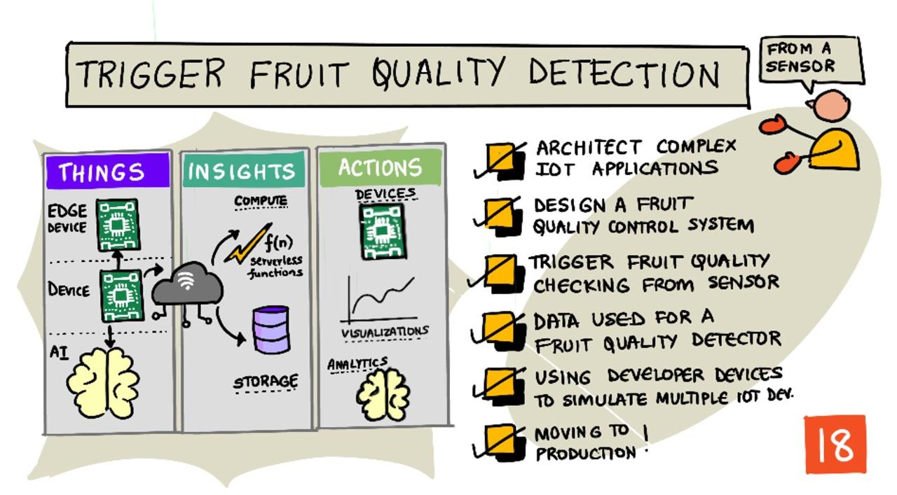
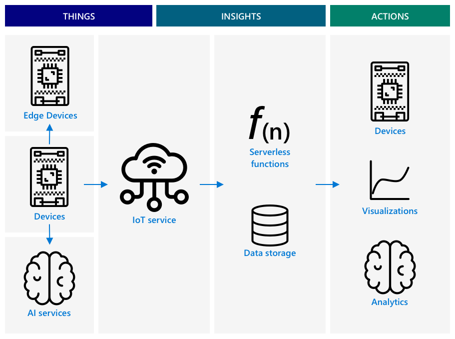

<!--
CO_OP_TRANSLATOR_METADATA:
{
  "original_hash": "f74f4ccb61f00e5f7e9f49c3ed416e36",
  "translation_date": "2025-08-27T10:49:26+00:00",
  "source_file": "4-manufacturing/lessons/4-trigger-fruit-detector/README.md",
  "language_code": "pa"
}
-->
# ਫਲ ਦੀ ਗੁਣਵੱਤਾ ਪਤਾ ਕਰਨ ਲਈ ਸੈਂਸਰ ਤੋਂ ਟ੍ਰਿਗਰ ਕਰੋ

> ਸਕੈਚਨੋਟ [ਨਿਤਿਆ ਨਰਸਿੰਮਨ](https://github.com/nitya) ਦੁਆਰਾ। ਵੱਡੇ ਵਰਜਨ ਲਈ ਚਿੱਤਰ 'ਤੇ ਕਲਿੱਕ ਕਰੋ।

## ਪਾਠ ਤੋਂ ਪਹਿਲਾਂ ਕਵੀਜ਼

[ਪਾਠ ਤੋਂ ਪਹਿਲਾਂ ਕਵੀਜ਼](https://black-meadow-040d15503.1.azurestaticapps.net/quiz/35)

## ਪਰਿਚਯ

ਇੱਕ IoT ਐਪਲੀਕੇਸ਼ਨ ਸਿਰਫ ਇੱਕ ਜੰਤਰ ਨਹੀਂ ਹੁੰਦਾ ਜੋ ਡਾਟਾ ਕੈਪਚਰ ਕਰਦਾ ਹੈ ਅਤੇ ਕਲਾਉਡ ਨੂੰ ਭੇਜਦਾ ਹੈ। ਅਕਸਰ ਇਹ ਕਈ ਜੰਤਰਾਂ ਦਾ ਸਮੂਹ ਹੁੰਦਾ ਹੈ ਜੋ ਸੈਂਸਰਾਂ ਦੀ ਵਰਤੋਂ ਕਰਕੇ ਭੌਤਿਕ ਜਗਤ ਤੋਂ ਡਾਟਾ ਕੈਪਚਰ ਕਰਦੇ ਹਨ, ਉਸ ਡਾਟਾ ਦੇ ਆਧਾਰ 'ਤੇ ਫੈਸਲੇ ਲੈਂਦੇ ਹਨ, ਅਤੇ ਐਕਚੁਏਟਰਾਂ ਜਾਂ ਵਿਜੁਅਲਾਈਜ਼ੇਸ਼ਨ ਰਾਹੀਂ ਭੌਤਿਕ ਜਗਤ ਨਾਲ ਮੁੜ ਸੰਚਾਰ ਕਰਦੇ ਹਨ।

ਇਸ ਪਾਠ ਵਿੱਚ ਤੁਸੀਂ ਸਿੱਖੋਗੇ ਕਿ ਕਿਵੇਂ ਜਟਿਲ IoT ਐਪਲੀਕੇਸ਼ਨਾਂ ਦੀ ਰਚਨਾ ਕਰਨੀ ਹੈ, ਕਈ ਸੈਂਸਰਾਂ ਅਤੇ ਕਲਾਉਡ ਸੇਵਾਵਾਂ ਨੂੰ ਸ਼ਾਮਲ ਕਰਕੇ ਡਾਟਾ ਦਾ ਵਿਸ਼ਲੇਸ਼ਣ ਅਤੇ ਸਟੋਰੇਜ ਕਰਨਾ ਹੈ, ਅਤੇ ਐਕਚੁਏਟਰ ਰਾਹੀਂ ਪ੍ਰਤੀਕਿਰਿਆ ਦਿਖਾਉਣੀ ਹੈ। ਤੁਸੀਂ ਸਿੱਖੋਗੇ ਕਿ ਫਲ ਦੀ ਗੁਣਵੱਤਾ ਨਿਯੰਤਰਣ ਪ੍ਰਣਾਲੀ ਦਾ ਪ੍ਰੋਟੋਟਾਈਪ ਕਿਵੇਂ ਬਣਾਉਣਾ ਹੈ, ਜਿਸ ਵਿੱਚ ਨਜ਼ਦੀਕੀ ਸੈਂਸਰਾਂ ਦੀ ਵਰਤੋਂ ਕਰਕੇ IoT ਐਪਲੀਕੇਸ਼ਨ ਨੂੰ ਟ੍ਰਿਗਰ ਕਰਨਾ ਸ਼ਾਮਲ ਹੈ, ਅਤੇ ਇਸ ਪ੍ਰੋਟੋਟਾਈਪ ਦੀ ਆਰਕੀਟੈਕਚਰ ਕੀ ਹੋਵੇਗੀ।

ਇਸ ਪਾਠ ਵਿੱਚ ਅਸੀਂ ਕਵਰ ਕਰਾਂਗੇ:

* [ਜਟਿਲ IoT ਐਪਲੀਕੇਸ਼ਨਾਂ ਦੀ ਰਚਨਾ](../../../../../4-manufacturing/lessons/4-trigger-fruit-detector)
* [ਫਲ ਦੀ ਗੁਣਵੱਤਾ ਨਿਯੰਤਰਣ ਪ੍ਰਣਾਲੀ ਦੀ ਡਿਜ਼ਾਈਨ](../../../../../4-manufacturing/lessons/4-trigger-fruit-detector)
* [ਸੈਂਸਰ ਤੋਂ ਫਲ ਦੀ ਗੁਣਵੱਤਾ ਦੀ ਜਾਂਚ ਟ੍ਰਿਗਰ ਕਰੋ](../../../../../4-manufacturing/lessons/4-trigger-fruit-detector)
* [ਫਲ ਦੀ ਗੁਣਵੱਤਾ ਡਿਟੈਕਟਰ ਲਈ ਵਰਤਿਆ ਗਿਆ ਡਾਟਾ](../../../../../4-manufacturing/lessons/4-trigger-fruit-detector)
* [ਕਈ IoT ਜੰਤਰਾਂ ਦੀ ਨਕਲ ਕਰਨ ਲਈ ਡਿਵੈਲਪਰ ਜੰਤਰਾਂ ਦੀ ਵਰਤੋਂ](../../../../../4-manufacturing/lessons/4-trigger-fruit-detector)
* [ਉਤਪਾਦਨ ਵੱਲ ਅੱਗੇ ਵਧਣਾ](../../../../../4-manufacturing/lessons/4-trigger-fruit-detector)

> 🗑 ਇਹ ਪ੍ਰੋਜੈਕਟ ਦਾ ਆਖਰੀ ਪਾਠ ਹੈ, ਇਸ ਲਈ ਇਸ ਪਾਠ ਅਤੇ ਅਸਾਈਨਮੈਂਟ ਨੂੰ ਪੂਰਾ ਕਰਨ ਤੋਂ ਬਾਅਦ, ਆਪਣੀਆਂ ਕਲਾਉਡ ਸੇਵਾਵਾਂ ਨੂੰ ਸਾਫ਼ ਕਰਨਾ ਨਾ ਭੁੱਲੋ। ਤੁਹਾਨੂੰ ਅਸਾਈਨਮੈਂਟ ਪੂਰਾ ਕਰਨ ਲਈ ਸੇਵਾਵਾਂ ਦੀ ਲੋੜ ਹੋਵੇਗੀ, ਇਸ ਲਈ ਪਹਿਲਾਂ ਇਸਨੂੰ ਪੂਰਾ ਕਰਨਾ ਯਕੀਨੀ ਬਣਾਓ।
>
> ਜੇ ਲੋੜ ਹੋਵੇ ਤਾਂ [ਆਪਣੇ ਪ੍ਰੋਜੈਕਟ ਨੂੰ ਸਾਫ਼ ਕਰਨ ਦੀ ਗਾਈਡ](../../../clean-up.md) ਨੂੰ ਵੇਖੋ।

## ਜਟਿਲ IoT ਐਪਲੀਕੇਸ਼ਨਾਂ ਦੀ ਰਚਨਾ

IoT ਐਪਲੀਕੇਸ਼ਨਾਂ ਵਿੱਚ ਕਈ ਹਿੱਸੇ ਹੁੰਦੇ ਹਨ। ਇਹ ਵੱਖ-ਵੱਖ ਚੀਜ਼ਾਂ ਅਤੇ ਇੰਟਰਨੈਟ ਸੇਵਾਵਾਂ ਨੂੰ ਸ਼ਾਮਲ ਕਰਦੇ ਹਨ।

IoT ਐਪਲੀਕੇਸ਼ਨਾਂ ਨੂੰ *ਚੀਜ਼ਾਂ* (ਜੰਤਰਾਂ) ਵਜੋਂ ਵਰਣਿਤ ਕੀਤਾ ਜਾ ਸਕਦਾ ਹੈ ਜੋ ਡਾਟਾ ਭੇਜਦੀਆਂ ਹਨ ਜੋ ਕਿ *ਅੰਦਰੂਨੀ ਜਾਣਕਾਰੀ* ਪੈਦਾ ਕਰਦਾ ਹੈ। ਇਹ *ਅੰਦਰੂਨੀ ਜਾਣਕਾਰੀ* ਕਾਰਵਾਈਆਂ ਨੂੰ ਪ੍ਰੇਰਿਤ ਕਰਦੀ ਹੈ ਜੋ ਕਿਸੇ ਕਾਰੋਬਾਰ ਜਾਂ ਪ੍ਰਕਿਰਿਆ ਨੂੰ ਸੁਧਾਰਨ ਲਈ ਹੁੰਦੀਆਂ ਹਨ। ਉਦਾਹਰਣ ਵਜੋਂ, ਇੱਕ ਇੰਜਣ (ਚੀਜ਼) ਤਾਪਮਾਨ ਡਾਟਾ ਭੇਜਦਾ ਹੈ। ਇਹ ਡਾਟਾ ਇਸ ਗੱਲ ਦਾ ਮੁਲਾਂਕਣ ਕਰਨ ਲਈ ਵਰਤਿਆ ਜਾਂਦਾ ਹੈ ਕਿ ਕੀ ਇੰਜਣ ਉਮੀਦਾਂ ਅਨੁਸਾਰ ਕੰਮ ਕਰ ਰਿਹਾ ਹੈ (ਅੰਦਰੂਨੀ ਜਾਣਕਾਰੀ)। ਇਹ ਜਾਣਕਾਰੀ ਇੰਜਣ ਲਈ ਰੱਖ-ਰਖਾਵ ਦੇ ਸ਼ਡਿਊਲ ਨੂੰ ਪ੍ਰਾਥਮਿਕਤਾ ਦੇਣ ਲਈ ਵਰਤੀ ਜਾਂਦੀ ਹੈ (ਕਾਰਵਾਈ)।

* ਵੱਖ-ਵੱਖ ਚੀਜ਼ਾਂ ਵੱਖ-ਵੱਖ ਡਾਟਾ ਇਕੱਠਾ ਕਰਦੀਆਂ ਹਨ।
* IoT ਸੇਵਾਵਾਂ ਉਸ ਡਾਟਾ 'ਤੇ ਅੰਦਰੂਨੀ ਜਾਣਕਾਰੀ ਦਿੰਦੀਆਂ ਹਨ, ਕਈ ਵਾਰ ਇਸਨੂੰ ਹੋਰ ਸਰੋਤਾਂ ਦੇ ਡਾਟਾ ਨਾਲ ਵਧਾਉਂਦੀਆਂ ਹਨ।
* ਇਹ ਅੰਦਰੂਨੀ ਜਾਣਕਾਰੀਆਂ ਕਾਰਵਾਈਆਂ ਨੂੰ ਪ੍ਰੇਰਿਤ ਕਰਦੀਆਂ ਹਨ, ਜਿਸ ਵਿੱਚ ਜੰਤਰਾਂ ਵਿੱਚ ਐਕਚੁਏਟਰਾਂ ਨੂੰ ਨਿਯੰਤਰਿਤ ਕਰਨਾ ਜਾਂ ਡਾਟਾ ਨੂੰ ਵਿਜੁਅਲਾਈਜ਼ ਕਰਨਾ ਸ਼ਾਮਲ ਹੈ।

### ਰੈਫਰੈਂਸ IoT ਆਰਕੀਟੈਕਚਰ

ਉਪਰ ਦਿੱਤਾ ਚਿੱਤਰ ਇੱਕ ਰੈਫਰੈਂਸ IoT ਆਰਕੀਟੈਕਚਰ ਦਿਖਾਉਂਦਾ ਹੈ।

> 🎓 ਇੱਕ *ਰੈਫਰੈਂਸ ਆਰਕੀਟੈਕਚਰ* ਇੱਕ ਉਦਾਹਰਣ ਆਰਕੀਟੈਕਚਰ ਹੁੰਦੀ ਹੈ ਜਿਸਨੂੰ ਤੁਸੀਂ ਨਵੀਆਂ ਪ੍ਰਣਾਲੀਆਂ ਦੀ ਰਚਨਾ ਕਰਦੇ ਸਮੇਂ ਰੈਫਰੈਂਸ ਵਜੋਂ ਵਰਤ ਸਕਦੇ ਹੋ। ਇਸ ਮਾਮਲੇ ਵਿੱਚ, ਜੇ ਤੁਸੀਂ ਇੱਕ ਨਵੀਂ IoT ਪ੍ਰਣਾਲੀ ਬਣਾਉਣ ਜਾ ਰਹੇ ਹੋ, ਤਾਂ ਤੁਸੀਂ ਇਸ ਰੈਫਰੈਂਸ ਆਰਕੀਟੈਕਚਰ ਦੀ ਪਾਲਣਾ ਕਰ ਸਕਦੇ ਹੋ, ਜਿੱਥੇ ਲੋੜ ਹੋਵੇ ਉੱਥੇ ਆਪਣੇ ਜੰਤਰਾਂ ਅਤੇ ਸੇਵਾਵਾਂ ਨੂੰ ਬਦਲ ਸਕਦੇ ਹੋ।

* **ਚੀਜ਼ਾਂ** ਉਹ ਜੰਤਰ ਹਨ ਜੋ ਸੈਂਸਰਾਂ ਤੋਂ ਡਾਟਾ ਇਕੱਠਾ ਕਰਦੇ ਹਨ, ਸ਼ਾਇਦ ਐਜ ਸੇਵਾਵਾਂ ਨਾਲ ਸੰਚਾਰ ਕਰਦੇ ਹੋਏ ਉਸ ਡਾਟਾ ਦੀ ਵਿਆਖਿਆ ਕਰਦੇ ਹਨ, ਜਿਵੇਂ ਕਿ ਚਿੱਤਰ ਡਾਟਾ ਦੀ ਵਿਆਖਿਆ ਕਰਨ ਲਈ ਚਿੱਤਰ ਵਰਗੀਕਰਨ। ਜੰਤਰਾਂ ਤੋਂ ਡਾਟਾ IoT ਸੇਵਾ ਨੂੰ ਭੇਜਿਆ ਜਾਂਦਾ ਹੈ।
* **ਅੰਦਰੂਨੀ ਜਾਣਕਾਰੀ** ਸਰਵਰਲੈੱਸ ਐਪਲੀਕੇਸ਼ਨਾਂ ਤੋਂ ਆਉਂਦੀ ਹੈ, ਜਾਂ ਸਟੋਰ ਕੀਤੇ ਡਾਟਾ 'ਤੇ ਚਲਾਏ ਗਏ ਵਿਸ਼ਲੇਸ਼ਣ ਤੋਂ।
* **ਕਾਰਵਾਈਆਂ** ਜੰਤਰਾਂ ਨੂੰ ਭੇਜੇ ਗਏ ਕਮਾਂਡ ਹੋ ਸਕਦੀਆਂ ਹਨ, ਜਾਂ ਡਾਟਾ ਦੀ ਵਿਜੁਅਲਾਈਜ਼ੇਸ਼ਨ ਜੋ ਮਨੁੱਖਾਂ ਨੂੰ ਫੈਸਲੇ ਲੈਣ ਦੀ ਆਗਿਆ ਦਿੰਦੀ ਹੈ।

ਉਪਰ ਦਿੱਤਾ ਚਿੱਤਰ ਕੁਝ ਹਿੱਸਿਆਂ ਅਤੇ ਸੇਵਾਵਾਂ ਨੂੰ ਦਿਖਾਉਂਦਾ ਹੈ ਜੋ ਹੁਣ ਤੱਕ ਪਾਠਾਂ ਵਿੱਚ ਕਵਰ ਕੀਤੇ ਗਏ ਹਨ ਅਤੇ ਇਹ ਕਿਵੇਂ ਇੱਕ ਰੈਫਰੈਂਸ IoT ਆਰਕੀਟੈਕਚਰ ਵਿੱਚ ਜੁੜਦੇ ਹਨ।

* **ਚੀਜ਼ਾਂ** - ਤੁਸੀਂ ਸੈਂਸਰਾਂ ਤੋਂ ਡਾਟਾ ਕੈਪਚਰ ਕਰਨ ਲਈ ਜੰਤਰ ਕੋਡ ਲਿਖਿਆ ਹੈ, ਅਤੇ ਕਲਾਉਡ ਅਤੇ ਐਜ ਜੰਤਰ ਦੋਵਾਂ 'ਤੇ ਚੱਲ ਰਹੇ Custom Vision ਦੀ ਵਰਤੋਂ ਕਰਕੇ ਚਿੱਤਰਾਂ ਦਾ ਵਿਸ਼ਲੇਸ਼ਣ ਕੀਤਾ ਹੈ। ਇਹ ਡਾਟਾ IoT Hub ਨੂੰ ਭੇਜਿਆ ਗਿਆ ਸੀ।
* **ਅੰਦਰੂਨੀ ਜਾਣਕਾਰੀ** - ਤੁਸੀਂ Azure Functions ਦੀ ਵਰਤੋਂ ਕੀਤੀ ਹੈ ਜੋ IoT Hub ਨੂੰ ਭੇਜੇ ਗਏ ਸੁਨੇਹਿਆਂ ਦਾ ਜਵਾਬ ਦਿੰਦੀ ਹੈ, ਅਤੇ ਡਾਟਾ ਨੂੰ ਬਾਅਦ ਦੇ ਵਿਸ਼ਲੇਸ਼ਣ ਲਈ Azure Storage ਵਿੱਚ ਸਟੋਰ ਕੀਤਾ ਹੈ।
* **ਕਾਰਵਾਈਆਂ** - ਤੁਸੀਂ ਕਲਾਉਡ ਵਿੱਚ ਕੀਤੇ ਗਏ ਫੈਸਲਿਆਂ ਅਤੇ ਜੰਤਰਾਂ ਨੂੰ ਭੇਜੇ ਗਏ ਕਮਾਂਡਾਂ ਦੇ ਆਧਾਰ 'ਤੇ ਐਕਚੁਏਟਰਾਂ ਨੂੰ ਨਿਯੰਤਰਿਤ ਕੀਤਾ ਹੈ, ਅਤੇ ਤੁਸੀਂ Azure Maps ਦੀ ਵਰਤੋਂ ਕਰਕੇ ਡਾਟਾ ਨੂੰ ਵਿਜੁਅਲਾਈਜ਼ ਕੀਤਾ ਹੈ।

✅ ਉਹ ਹੋਰ IoT ਜੰਤਰਾਂ ਬਾਰੇ ਸੋਚੋ ਜੋ ਤੁਸੀਂ ਵਰਤੇ ਹਨ, ਜਿਵੇਂ ਕਿ ਸਮਾਰਟ ਘਰ ਦੇ ਉਪਕਰਣ। ਉਸ ਜੰਤਰ ਅਤੇ ਇਸਦੇ ਸੌਫਟਵੇਅਰ ਵਿੱਚ ਸ਼ਾਮਲ ਚੀਜ਼ਾਂ, ਅੰਦਰੂਨੀ ਜਾਣਕਾਰੀ ਅਤੇ ਕਾਰਵਾਈਆਂ ਕੀ ਹਨ?

ਇਹ ਪੈਟਰਨ ਤੁਹਾਡੀ ਲੋੜ ਅਨੁਸਾਰ ਵੱਡਾ ਜਾਂ ਛੋਟਾ ਕੀਤਾ ਜਾ ਸਕਦਾ ਹੈ, ਹੋਰ ਜੰਤਰਾਂ ਅਤੇ ਹੋਰ ਸੇਵਾਵਾਂ ਸ਼ਾਮਲ ਕੀਤੀਆਂ ਜਾ ਸਕਦੀਆਂ ਹਨ।

### ਡਾਟਾ ਅਤੇ ਸੁਰੱਖਿਆ

ਜਦੋਂ ਤੁਸੀਂ ਆਪਣੇ ਸਿਸਟਮ ਦੀ ਆਰਕੀਟੈਕਚਰ ਨੂੰ ਪਰਿਭਾਸ਼ਿਤ ਕਰਦੇ ਹੋ, ਤਾਂ ਤੁਹਾਨੂੰ ਹਮੇਸ਼ਾਂ ਡਾਟਾ ਅਤੇ ਸੁਰੱਖਿਆ ਬਾਰੇ ਸੋਚਣਾ ਚਾਹੀਦਾ ਹੈ।

* ਤੁਹਾਡਾ ਜੰਤਰ ਕਿਹੜਾ ਡਾਟਾ ਭੇਜਦਾ ਅਤੇ ਪ੍ਰਾਪਤ ਕਰਦਾ ਹੈ?
* ਉਸ ਡਾਟਾ ਨੂੰ ਕਿਵੇਂ ਸੁਰੱਖਿਅਤ ਅਤੇ ਸੁਰੱਖਿਅਤ ਕੀਤਾ ਜਾਣਾ ਚਾਹੀਦਾ ਹੈ?
* ਜੰਤਰ ਅਤੇ ਕਲਾਉਡ ਸੇਵਾ ਤੱਕ ਪਹੁੰਚ ਨੂੰ ਕਿਵੇਂ ਨਿਯੰਤਰਿਤ ਕੀਤਾ ਜਾਣਾ ਚਾਹੀਦਾ ਹੈ?

✅ ਆਪਣੇ ਕਿਸੇ ਵੀ IoT ਜੰਤਰ ਦੀ ਡਾਟਾ ਸੁਰੱਖਿਆ ਬਾਰੇ ਸੋਚੋ। ਉਸ ਡਾਟਾ ਵਿੱਚੋਂ ਕਿੰਨਾ ਨਿੱਜੀ ਹੈ ਅਤੇ ਇਸਨੂੰ ਗੁਪਤ ਰੱਖਣਾ ਚਾਹੀਦਾ ਹੈ, ਚਾਹੇ ਉਹ ਟ੍ਰਾਂਜ਼ਿਟ ਵਿੱਚ ਹੋਵੇ ਜਾਂ ਸਟੋਰ ਕੀਤਾ ਗਿਆ ਹੋਵੇ? ਕਿਹੜਾ ਡਾਟਾ ਸਟੋਰ ਨਹੀਂ ਕੀਤਾ ਜਾਣਾ ਚਾਹੀਦਾ?

## ਫਲ ਦੀ ਗੁਣਵੱਤਾ ਨਿਯੰਤਰਣ ਪ੍ਰਣਾਲੀ ਦੀ ਡਿਜ਼ਾਈਨ

ਹੁਣ ਆਓ ਚੀਜ਼ਾਂ, ਅੰਦਰੂਨੀ ਜਾਣਕਾਰੀ, ਅਤੇ ਕਾਰਵਾਈਆਂ ਦੇ ਇਸ ਵਿਚਾਰ ਨੂੰ ਲੈ ਕੇ ਆਪਣੇ ਫਲ ਗੁਣਵੱਤਾ ਡਿਟੈਕਟਰ 'ਤੇ ਲਾਗੂ ਕਰੀਏ, ਤਾਂ ਜੋ ਇੱਕ ਵੱਡੀ ਐਂਡ-ਟੂ-ਐਂਡ ਐਪਲੀਕੇਸ਼ਨ ਡਿਜ਼ਾਈਨ ਕਰ ਸਕੀਏ।

ਕਲਪਨਾ ਕਰੋ ਕਿ ਤੁਹਾਨੂੰ ਇੱਕ ਫਲ ਗੁਣਵੱਤਾ ਡਿਟੈਕਟਰ ਬਣਾਉਣ ਦਾ ਕੰਮ ਦਿੱਤਾ ਗਿਆ ਹੈ ਜੋ ਇੱਕ ਪ੍ਰੋਸੈਸਿੰਗ ਪਲਾਂਟ ਵਿੱਚ ਵਰਤਿਆ ਜਾਵੇਗਾ। ਫਲ ਇੱਕ ਕਨਵੇਅਰ ਬੈਲਟ ਪ੍ਰਣਾਲੀ 'ਤੇ ਯਾਤਰਾ ਕਰਦਾ ਹੈ ਜਿੱਥੇ ਵਰਤਮਾਨ ਵਿੱਚ ਕਰਮਚਾਰੀ ਹੱਥ ਨਾਲ ਫਲ ਦੀ ਜਾਂਚ ਕਰਦੇ ਹਨ ਅਤੇ ਜਦੋਂ ਇਹ ਆਉਂਦਾ ਹੈ ਤਾਂ ਕੋਈ ਵੀ ਕੱਚਾ ਫਲ ਹਟਾ ਦਿੰਦੇ ਹਨ। ਲਾਗਤ ਨੂੰ ਘਟਾਉਣ ਲਈ, ਪਲਾਂਟ ਮਾਲਕ ਇੱਕ ਆਟੋਮੈਟਿਕ ਪ੍ਰਣਾਲੀ ਚਾਹੁੰਦਾ ਹੈ।

✅ IoT (ਅਤੇ ਜਨਰਲ ਤਕਨਾਲੋਜੀ) ਦੇ ਉਭਾਰ ਨਾਲ ਇੱਕ ਰੁਝਾਨ ਇਹ ਹੈ ਕਿ ਮੈਨੂਅਲ ਨੌਕਰੀਆਂ ਨੂੰ ਮਸ਼ੀਨਾਂ ਦੁਆਰਾ ਬਦਲਿਆ ਜਾ ਰਿਹਾ ਹੈ। ਕੁਝ ਖੋਜ ਕਰੋ: IoT ਕਾਰਨ ਕਿੰਨੀ ਨੌਕਰੀਆਂ ਖਤਮ ਹੋਣ ਦਾ ਅੰਦਾਜ਼ਾ ਹੈ? IoT ਜੰਤਰ ਬਣਾਉਣ ਲਈ ਕਿੰਨੀਆਂ ਨਵੀਆਂ ਨੌਕਰੀਆਂ ਬਣਨਗੀਆਂ?

ਤੁਹਾਨੂੰ ਇੱਕ ਪ੍ਰਣਾਲੀ ਬਣਾਉਣੀ ਹੈ ਜਿੱਥੇ ਫਲ ਦੇ ਕਨਵੇਅਰ ਬੈਲਟ 'ਤੇ ਆਉਣ 'ਤੇ ਇਸ ਦੀ ਪਛਾਣ ਕੀਤੀ ਜਾਂਦੀ ਹੈ, ਇਸ ਦੀ ਫੋਟੋ ਖਿੱਚੀ ਜਾਂਦੀ ਹੈ ਅਤੇ ਐਜ 'ਤੇ ਚੱਲ ਰਹੇ AI ਮਾਡਲ ਦੀ ਵਰਤੋਂ ਕਰਕੇ ਜਾਂਚ ਕੀਤੀ ਜਾਂਦੀ ਹੈ। ਨਤੀਜੇ ਫਿਰ ਕਲਾਉਡ ਵਿੱਚ ਸਟੋਰ ਕੀਤੇ ਜਾਂਦੇ ਹਨ, ਅਤੇ ਜੇਕਰ ਫਲ ਕੱਚਾ ਹੈ ਤਾਂ ਸੂਚਨਾ ਦਿੱਤੀ ਜਾਂਦੀ ਹੈ ਤਾਂ ਜੋ ਕੱਚੇ ਫਲ ਨੂੰ ਹਟਾਇਆ ਜਾ ਸਕੇ।

|   |   |
| - | - |
| **ਚੀਜ਼ਾਂ** | ਕਨਵੇਅਰ ਬੈਲਟ 'ਤੇ ਆਉਣ ਵਾਲੇ ਫਲ ਦੀ ਪਛਾਣ ਕਰਨ ਵਾਲਾ ਡਿਟੈਕਟਰ ਫਲ ਦੀ ਫੋਟੋ ਖਿੱਚਣ ਅਤੇ ਵਰਗੀਕਰਨ ਕਰਨ ਵਾਲਾ ਕੈਮਰਾ ਐਜ ਜੰਤਰ ਜੋ ਵਰਗੀਕਰਨ ਚਲਾਉਂਦਾ ਹੈ ਕੱਚੇ ਫਲ ਦੀ ਸੂਚਨਾ ਦੇਣ ਵਾਲਾ ਜੰਤਰ |
| **ਅੰਦਰੂਨੀ ਜਾਣਕਾਰੀ** | ਫਲ ਦੀ ਪੱਕਣ ਦੀ ਜਾਂਚ ਕਰਨ ਦਾ ਫੈਸਲਾ ਵਰਗੀਕਰਨ ਦੇ ਨਤੀਜਿਆਂ ਨੂੰ ਸਟੋਰ ਕਰੋ ਇਹ ਨਿਰਧਾਰਤ ਕਰੋ ਕਿ ਕੀ ਕੱਚੇ ਫਲ ਬਾਰੇ ਸੂਚਿਤ ਕਰਨ ਦੀ ਲੋੜ ਹੈ |
| **ਕਾਰਵਾਈਆਂ** | ਫਲ ਦੀ ਫੋਟੋ ਖਿੱਚਣ ਅਤੇ ਇਸਨੂੰ ਚਿੱਤਰ ਵਰਗੀਕਰਨ ਨਾਲ ਜਾਂਚਣ ਲਈ ਜੰਤਰ ਨੂੰ ਕਮਾਂਡ ਭੇਜੋ ਜੰਤਰ ਨੂੰ ਕਮਾਂਡ ਭੇਜੋ ਕਿ ਕੱਚੇ ਫਲ ਬਾਰੇ ਸੂਚਿਤ ਕਰੇ |

### ਆਪਣੇ ਐਪਲੀਕੇਸ਼ਨ ਦਾ ਪ੍ਰੋਟੋਟਾਈਪ ਬਣਾਉਣਾ

ਉਪਰ ਦਿੱਤਾ ਚਿੱਤਰ ਇਸ ਪ੍ਰੋਟੋਟਾਈਪ ਐਪਲੀਕੇਸ਼ਨ ਲਈ ਇੱਕ ਰੈਫਰੈਂਸ ਆਰਕੀਟੈਕਚਰ ਦਿਖਾਉਂਦਾ ਹੈ।

* ਇੱਕ IoT ਜੰਤਰ ਜਿਸ ਵਿੱਚ ਨਜ਼ਦੀਕੀ ਸੈਂਸਰ ਹੈ, ਫਲ ਦੇ ਆਉਣ ਦੀ ਪਛਾਣ ਕਰਦਾ ਹੈ। ਇਹ ਕਲਾਉਡ ਨੂੰ ਸੁਨੇਹਾ ਭੇਜਦਾ ਹੈ ਕਿ ਫਲ ਦੀ ਪਛਾਣ ਕੀਤੀ ਗਈ ਹੈ।
* ਕਲਾਉਡ ਵਿੱਚ ਇੱਕ ਸਰਵਰਲੈੱਸ ਐਪਲੀਕੇਸ਼ਨ ਦੂਜੇ ਜੰਤਰ ਨੂੰ ਫਲ ਦੀ ਫੋਟੋ ਖਿੱਚਣ ਅਤੇ ਵਰਗੀਕਰਨ ਕਰਨ ਲਈ ਕਮਾਂਡ ਭੇਜਦਾ ਹੈ।
* ਇੱਕ IoT ਜੰਤਰ ਜਿਸ ਵਿੱਚ ਕੈਮਰਾ ਹੈ, ਇੱਕ ਤਸਵੀਰ ਖਿੱਚਦਾ ਹੈ ਅਤੇ ਇਸਨੂੰ ਐਜ 'ਤੇ ਚੱਲ ਰਹੇ ਚਿੱਤਰ ਵਰਗੀਕਰਨ ਨੂੰ ਭੇਜਦਾ ਹੈ। ਨਤੀਜੇ ਫਿਰ ਕਲਾਉਡ ਵਿੱਚ ਭੇਜੇ ਜਾਂਦੇ ਹਨ।
* ਕਲਾਉਡ ਵਿੱਚ ਇੱਕ ਸਰਵਰਲੈੱਸ ਐਪਲੀਕੇਸ਼ਨ ਇਸ ਜਾਣਕਾਰੀ ਨੂੰ ਬਾਅਦ ਵਿੱਚ ਵਿਸ਼ਲੇਸ਼ਣ ਲਈ ਸਟੋਰ ਕਰਦਾ ਹੈ ਤਾਂ ਕਿ ਪਤਾ ਲਗਾਇਆ ਜਾ ਸਕੇ ਕਿ ਕਿੰਨਾ ਫਲ ਕੱਚਾ ਹੈ। ਜੇਕਰ ਫਲ ਕੱਚਾ ਹੈ, ਤਾਂ ਇਹ ਦੂਜੇ IoT ਜੰਤਰ ਨੂੰ ਕਮਾਂਡ ਭੇਜਦਾ ਹੈ ਕਿ LED ਰਾਹੀਂ ਫੈਕਟਰੀ ਵਰਕਰਾਂ ਨੂੰ ਸੂਚਿਤ ਕਰੇ।

> 💁 ਇਹ ਪੂਰਾ IoT ਐਪਲੀਕੇਸ਼ਨ ਇੱਕ ਹੀ ਜੰਤਰ ਵਜੋਂ ਲਾਗੂ ਕੀਤਾ ਜਾ ਸਕਦਾ ਹੈ, ਜਿਸ ਵਿੱਚ ਚਿੱਤਰ ਵਰਗੀਕਰਨ ਸ਼ੁਰੂ ਕਰਨ ਅਤੇ LED ਨੂੰ ਨਿਯੰਤਰਿਤ ਕਰਨ ਲਈ ਸਾਰੀ ਲਾਜ਼ਿਕ ਸ਼ਾਮਲ ਹੈ। ਇਹ ਸਿਰਫ ਕੱਚੇ ਫਲ ਦੀ ਗਿਣਤੀ ਨੂੰ ਟ੍ਰੈਕ ਕਰਨ ਅਤੇ ਜੰਤਰ ਨੂੰ ਕਨਫਿਗਰ ਕਰਨ ਲਈ IoT Hub ਦੀ ਵਰਤੋਂ ਕਰ ਸਕਦਾ ਹੈ। ਇਸ ਪਾਠ ਵਿੱਚ ਇਸਨੂੰ ਵੱਡੇ ਪੱਧਰ ਦੇ IoT ਐਪਲੀਕੇਸ਼ਨਾਂ ਲਈ ਸੰਕਲਪ ਦਿਖਾਉਣ ਲਈ ਵਧਾਇਆ ਗਿਆ ਹੈ।

ਪ੍ਰੋਟੋਟਾਈਪ ਲਈ, ਤੁਸੀਂ ਇਹ ਸਾਰਾ ਕੰਮ ਇੱਕ ਹੀ ਜੰਤਰ 'ਤੇ ਲਾਗੂ ਕਰੋਗੇ। ਜੇ ਤੁਸੀਂ ਇੱਕ ਮਾਈਕਰੋਕੰਟਰੋਲਰ ਦੀ ਵਰਤੋਂ ਕਰ ਰਹੇ ਹੋ, ਤਾਂ ਤੁਸੀਂ ਚਿੱਤਰ ਵਰਗੀਕਰਨ ਚਲਾਉਣ ਲਈ ਇੱਕ ਵੱਖਰੇ ਐਜ ਜੰਤਰ ਦੀ ਵਰਤੋਂ ਕਰੋਗੇ। ਤੁਸੀਂ ਪਹਿਲਾਂ ਹੀ ਜ਼ਿਆਦਾਤਰ ਚੀਜ਼ਾਂ ਸਿੱਖ ਚੁੱਕੇ ਹੋ ਜੋ ਤੁਹਾਨੂੰ ਇਹ ਬਣਾਉਣ ਲਈ ਲੋੜੀਂਦੀਆਂ ਹਨ।

## ਸੈਂਸਰ ਤੋਂ ਫਲ ਦੀ ਗੁਣਵੱਤਾ ਦੀ ਜਾਂਚ ਟ੍ਰਿਗਰ ਕਰੋ

IoT ਜੰਤਰ ਨੂੰ ਕਿਸੇ ਤਰ੍ਹਾਂ ਦੇ ਟ੍ਰਿਗਰ ਦੀ ਲੋੜ ਹੁੰਦੀ ਹੈ ਜੋ ਦਰਸਾਏ ਕਿ ਫਲ ਦੀ ਵਰਗੀਕਰਨ ਕਰਨ
💁 ਧਿਆਨ ਦਿਓ ਕਿ ਕੁਝ ਹਾਰਡਵੇਅਰ ਇੱਕੋ ਸਮੇਂ ਵਿੱਚ ਕਈ ਐਪਲੀਕੇਸ਼ਨਾਂ ਦੁਆਰਾ ਐਕਸੈਸ ਕੀਤੇ ਜਾਣ 'ਤੇ ਕੰਮ ਨਹੀਂ ਕਰੇਗਾ।
### ਮਾਈਕਰੋਕੰਟਰੋਲਰ 'ਤੇ ਕਈ ਡਿਵਾਈਸਾਂ ਦੀ ਨਕਲ ਕਰਨਾ

ਮਾਈਕਰੋਕੰਟਰੋਲਰਾਂ 'ਤੇ ਕਈ ਡਿਵਾਈਸਾਂ ਦੀ ਨਕਲ ਕਰਨਾ ਥੋੜ੍ਹਾ ਜਟਿਲ ਹੁੰਦਾ ਹੈ। ਸਿੰਗਲ ਬੋਰਡ ਕੰਪਿਊਟਰਾਂ ਦੇ ਵਿਰੁੱਧ, ਤੁਸੀਂ ਇੱਕ ਸਮੇਂ ਵਿੱਚ ਕਈ ਐਪਲੀਕੇਸ਼ਨ ਨਹੀਂ ਚਲਾ ਸਕਦੇ। ਤੁਹਾਨੂੰ ਸਾਰੇ ਵੱਖ-ਵੱਖ IoT ਡਿਵਾਈਸਾਂ ਲਈ ਲਾਜਿਕ ਨੂੰ ਇੱਕ ਹੀ ਐਪਲੀਕੇਸ਼ਨ ਵਿੱਚ ਸ਼ਾਮਲ ਕਰਨਾ ਪੈਂਦਾ ਹੈ।

ਇਸ ਪ੍ਰਕਿਰਿਆ ਨੂੰ ਆਸਾਨ ਬਣਾਉਣ ਲਈ ਕੁਝ ਸੁਝਾਅ ਹਨ:

* ਹਰ IoT ਡਿਵਾਈਸ ਲਈ ਇੱਕ ਜਾਂ ਵੱਧ ਕਲਾਸਾਂ ਬਣਾਓ - ਉਦਾਹਰਨ ਲਈ, `DistanceSensor`, `ClassifierCamera`, `LEDController` ਨਾਮਕ ਕਲਾਸਾਂ। ਹਰ ਇੱਕ ਦੀ ਆਪਣੀ `setup` ਅਤੇ `loop` ਵਿਧੀ ਹੋ ਸਕਦੀ ਹੈ, ਜੋ ਮੁੱਖ `setup` ਅਤੇ `loop` ਫੰਕਸ਼ਨਾਂ ਦੁਆਰਾ ਕਾਲ ਕੀਤੀ ਜਾਂਦੀ ਹੈ।
* ਕਮਾਂਡਾਂ ਨੂੰ ਇੱਕ ਹੀ ਜਗ੍ਹਾ 'ਤੇ ਹੈਂਡਲ ਕਰੋ ਅਤੇ ਜਰੂਰਤ ਅਨੁਸਾਰ ਉਨ੍ਹਾਂ ਨੂੰ ਸਬੰਧਤ ਡਿਵਾਈਸ ਕਲਾਸ ਵੱਲ ਡਾਇਰੈਕਟ ਕਰੋ।
* ਮੁੱਖ `loop` ਫੰਕਸ਼ਨ ਵਿੱਚ, ਤੁਹਾਨੂੰ ਹਰ ਵੱਖਰੇ ਡਿਵਾਈਸ ਲਈ ਟਾਈਮਿੰਗ ਦਾ ਧਿਆਨ ਰੱਖਣਾ ਪਵੇਗਾ। ਉਦਾਹਰਨ ਲਈ, ਜੇਕਰ ਤੁਹਾਡੇ ਕੋਲ ਇੱਕ ਡਿਵਾਈਸ ਕਲਾਸ ਹੈ ਜੋ ਹਰ 10 ਸਕਿੰਟ ਵਿੱਚ ਪ੍ਰੋਸੈਸ ਕਰਦੀ ਹੈ, ਅਤੇ ਦੂਜੀ ਜੋ ਹਰ 1 ਸਕਿੰਟ ਵਿੱਚ ਪ੍ਰੋਸੈਸ ਕਰਦੀ ਹੈ, ਤਾਂ ਮੁੱਖ `loop` ਫੰਕਸ਼ਨ ਵਿੱਚ 1 ਸਕਿੰਟ ਦੀ ਡਿਲੇਅ ਵਰਤੋ। ਹਰ `loop` ਕਾਲ ਉਸ ਡਿਵਾਈਸ ਲਈ ਸਬੰਧਤ ਕੋਡ ਨੂੰ ਟ੍ਰਿਗਰ ਕਰਦੀ ਹੈ ਜੋ ਹਰ ਸਕਿੰਟ ਪ੍ਰੋਸੈਸ ਕਰਦੀ ਹੈ, ਅਤੇ ਕਾਊਂਟਰ ਦੀ ਵਰਤੋਂ ਕਰਕੇ ਹਰ 10 ਕਾਊਂਟ 'ਤੇ ਦੂਜੇ ਡਿਵਾਈਸ ਨੂੰ ਪ੍ਰੋਸੈਸ ਕਰੋ (ਫਿਰ ਕਾਊਂਟਰ ਨੂੰ ਰੀਸੈਟ ਕਰੋ)।

## ਪ੍ਰੋਡਕਸ਼ਨ ਵੱਲ ਅੱਗੇ ਵਧਣਾ

ਪ੍ਰੋਟੋਟਾਈਪ ਅੰਤਮ ਪ੍ਰੋਡਕਸ਼ਨ ਸਿਸਟਮ ਦਾ ਅਧਾਰ ਬਣੇਗਾ। ਜਦੋਂ ਤੁਸੀਂ ਪ੍ਰੋਡਕਸ਼ਨ ਵੱਲ ਵਧਦੇ ਹੋ, ਤਾਂ ਕੁਝ ਅੰਤਰ ਹੋ ਸਕਦੇ ਹਨ:

* ਮਜ਼ਬੂਤ ਹਾਰਡਵੇਅਰ - ਫੈਕਟਰੀ ਦੇ ਸ਼ੋਰ, ਗਰਮੀ, ਵਾਈਬ੍ਰੇਸ਼ਨ ਅਤੇ ਦਬਾਅ ਨੂੰ ਸਹਿਣ ਵਾਲੇ ਹਾਰਡਵੇਅਰ ਦੀ ਵਰਤੋਂ।
* ਅੰਦਰੂਨੀ ਕਮਿਊਨੀਕੇਸ਼ਨ ਦੀ ਵਰਤੋਂ - ਕੁਝ ਕੰਪੋਨੈਂਟ ਸਿੱਧੇ ਹੀ ਕਮਿਊਨੀਕੇਟ ਕਰਨਗੇ, ਕਲਾਉਡ ਤੱਕ ਜਾਣ ਦੀ ਲੋੜ ਨਹੀਂ ਹੋਵੇਗੀ। ਸਿਰਫ ਡਾਟਾ ਸਟੋਰ ਕਰਨ ਲਈ ਕਲਾਉਡ ਨੂੰ ਭੇਜਿਆ ਜਾਵੇਗਾ। ਇਹ ਕਿਵੇਂ ਕੀਤਾ ਜਾਂਦਾ ਹੈ, ਇਹ ਫੈਕਟਰੀ ਸੈਟਅੱਪ 'ਤੇ ਨਿਰਭਰ ਕਰਦਾ ਹੈ, ਜਿਵੇਂ ਕਿ ਸਿੱਧੀ ਕਮਿਊਨੀਕੇਸ਼ਨ ਜਾਂ ਗੇਟਵੇ ਡਿਵਾਈਸ ਦੀ ਵਰਤੋਂ ਕਰਕੇ IoT ਸੇਵਾ ਦੇ ਕੁਝ ਹਿੱਸੇ ਨੂੰ ਐਜ 'ਤੇ ਚਲਾਉਣਾ।
* ਕਨਫਿਗਰੇਸ਼ਨ ਵਿਕਲਪ - ਹਰ ਫੈਕਟਰੀ ਅਤੇ ਇਸਤੇਮਾਲ ਦੇ ਕੇਸ ਵੱਖਰੇ ਹੁੰਦੇ ਹਨ, ਇਸ ਲਈ ਹਾਰਡਵੇਅਰ ਨੂੰ ਕਨਫਿਗਰੇਬਲ ਹੋਣਾ ਚਾਹੀਦਾ ਹੈ। ਉਦਾਹਰਨ ਲਈ, ਨਜ਼ਦੀਕੀ ਸੈਂਸਰ ਨੂੰ ਵੱਖ-ਵੱਖ ਦੂਰੀਆਂ 'ਤੇ ਵੱਖ-ਵੱਖ ਫਲਾਂ ਦਾ ਪਤਾ ਲਗਾਉਣ ਦੀ ਲੋੜ ਹੋ ਸਕਦੀ ਹੈ। ਦੂਰੀ ਨੂੰ ਹਾਰਡ ਕੋਡ ਕਰਨ ਦੀ ਬਜਾਏ, ਤੁਸੀਂ ਇਸਨੂੰ ਕਲਾਉਡ ਰਾਹੀਂ ਕਨਫਿਗਰ ਕਰਨ ਯੋਗ ਬਣਾਉਣਾ ਚਾਹੋਗੇ, ਉਦਾਹਰਨ ਲਈ, ਡਿਵਾਈਸ ਟਵਿਨ ਦੀ ਵਰਤੋਂ ਕਰਕੇ।
* ਆਟੋਮੈਟਿਕ ਫਲ ਹਟਾਉਣਾ - ਅਣਪੱਕੇ ਫਲਾਂ ਨੂੰ ਦਰਸਾਉਣ ਲਈ LED ਦੀ ਵਰਤੋਂ ਕਰਨ ਦੀ ਬਜਾਏ, ਆਟੋਮੈਟਿਕ ਡਿਵਾਈਸਾਂ ਇਸਨੂੰ ਹਟਾ ਸਕਦੀਆਂ ਹਨ।

✅ ਕੁਝ ਖੋਜ ਕਰੋ: ਹੋਰ ਕਿਹੜੇ ਤਰੀਕਿਆਂ ਨਾਲ ਪ੍ਰੋਡਕਸ਼ਨ ਡਿਵਾਈਸ ਡਿਵੈਲਪਰ ਕਿਟਾਂ ਤੋਂ ਵੱਖਰੇ ਹੋ ਸਕਦੇ ਹਨ?

---

## 🚀 ਚੁਣੌਤੀ

ਇਸ ਪਾਠ ਵਿੱਚ ਤੁਸੀਂ IoT ਸਿਸਟਮ ਨੂੰ ਆਰਕੀਟੈਕਟ ਕਰਨ ਦੇ ਕੁਝ ਮੂਲ ਸਿਧਾਂਤ ਸਿੱਖੇ ਹਨ। ਪਿਛਲੇ ਪ੍ਰੋਜੈਕਟਾਂ ਬਾਰੇ ਸੋਚੋ। ਉਹ ਉਪਰੋਕਤ ਰੇਫਰੈਂਸ ਆਰਕੀਟੈਕਚਰ ਵਿੱਚ ਕਿਵੇਂ ਫਿੱਟ ਹੁੰਦੇ ਹਨ?

ਪਿਛਲੇ ਪ੍ਰੋਜੈਕਟਾਂ ਵਿੱਚੋਂ ਇੱਕ ਚੁਣੋ ਅਤੇ ਇੱਕ ਹੋਰ ਜਟਿਲ ਹੱਲ ਦੇ ਡਿਜ਼ਾਈਨ ਬਾਰੇ ਸੋਚੋ ਜੋ ਪ੍ਰੋਜੈਕਟਾਂ ਵਿੱਚ ਕਵਰ ਕੀਤੇ ਗਏ ਤੋਂ ਵੱਧ ਸਮਰੱਥਾਵਾਂ ਨੂੰ ਇਕੱਠਾ ਕਰਦਾ ਹੋਵੇ। ਆਰਕੀਟੈਕਚਰ ਬਣਾਓ ਅਤੇ ਸਾਰੇ ਡਿਵਾਈਸਾਂ ਅਤੇ ਸੇਵਾਵਾਂ ਬਾਰੇ ਸੋਚੋ ਜੋ ਤੁਹਾਨੂੰ ਲੋੜੀਂਦੀਆਂ ਹਨ।

ਉਦਾਹਰਨ ਲਈ - ਇੱਕ ਵਾਹਨ ਟ੍ਰੈਕਿੰਗ ਡਿਵਾਈਸ ਜੋ GPS ਨੂੰ ਸੈਂਸਰਾਂ ਨਾਲ ਜੋੜਦਾ ਹੈ, ਜਿਵੇਂ ਕਿ ਰਿਫ੍ਰਿਜਰੇਟਡ ਟਰੱਕ ਵਿੱਚ ਤਾਪਮਾਨ, ਇੰਜਣ ਦੇ ਚਾਲੂ ਅਤੇ ਬੰਦ ਹੋਣ ਦੇ ਸਮੇਂ, ਅਤੇ ਡਰਾਈਵਰ ਦੀ ਪਛਾਣ ਦੀ ਨਿਗਰਾਨੀ ਕਰਦਾ ਹੈ। ਇਸ ਵਿੱਚ ਕਿਹੜੇ ਡਿਵਾਈਸ ਸ਼ਾਮਲ ਹਨ, ਕਿਹੜੀਆਂ ਸੇਵਾਵਾਂ ਸ਼ਾਮਲ ਹਨ, ਕਿਹੜੇ ਡਾਟਾ ਪ੍ਰੇਰਿਤ ਕੀਤੇ ਜਾ ਰਹੇ ਹਨ ਅਤੇ ਸੁਰੱਖਿਆ ਅਤੇ ਗੋਪਨੀਯਤਾ ਦੇ ਵਿਚਾਰ ਕੀ ਹਨ?

## ਪਾਠ-ਪ੍ਰਸ਼ਨੋਤਰੀ

[ਪਾਠ-ਪ੍ਰਸ਼ਨੋਤਰੀ](https://black-meadow-040d15503.1.azurestaticapps.net/quiz/36)

## ਸਮੀਖਿਆ ਅਤੇ ਖੁਦ ਅਧਿਐਨ

* IoT ਆਰਕੀਟੈਕਚਰ ਬਾਰੇ ਹੋਰ ਪੜ੍ਹੋ [Azure IoT ਰੇਫਰੈਂਸ ਆਰਕੀਟੈਕਚਰ ਡੌਕਯੂਮੈਂਟੇਸ਼ਨ Microsoft Docs 'ਤੇ](https://docs.microsoft.com/azure/architecture/reference-architectures/iot?WT.mc_id=academic-17441-jabenn)
* ਡਿਵਾਈਸ ਟਵਿਨਜ਼ ਬਾਰੇ ਹੋਰ ਪੜ੍ਹੋ [IoT Hub ਡੌਕਯੂਮੈਂਟੇਸ਼ਨ 'ਤੇ ਡਿਵਾਈਸ ਟਵਿਨਜ਼ ਨੂੰ ਸਮਝੋ ਅਤੇ ਵਰਤੋ](https://docs.microsoft.com/azure/iot-hub/iot-hub-devguide-device-twins?WT.mc_id=academic-17441-jabenn)
* OPC-UA ਬਾਰੇ ਪੜ੍ਹੋ, ਜੋ ਕਿ ਉਦਯੋਗਿਕ ਆਟੋਮੇਸ਼ਨ ਵਿੱਚ ਵਰਤਿਆ ਜਾਣ ਵਾਲਾ ਮਸ਼ੀਨ-ਟੂ-ਮਸ਼ੀਨ ਕਮਿਊਨੀਕੇਸ਼ਨ ਪ੍ਰੋਟੋਕੋਲ ਹੈ, [Wikipedia 'ਤੇ OPC-UA ਪੇਜ](https://wikipedia.org/wiki/OPC_Unified_Architecture)

## ਅਸਾਈਨਮੈਂਟ

[ਫਲ ਦੀ ਗੁਣਵੱਤਾ ਪਤਾ ਲਗਾਉਣ ਵਾਲਾ ਡਿਵਾਈਸ ਬਣਾਓ](assignment.md)

---

**ਅਸਵੀਕਾਰਨਾ**:  
ਇਹ ਦਸਤਾਵੇਜ਼ AI ਅਨੁਵਾਦ ਸੇਵਾ [Co-op Translator](https://github.com/Azure/co-op-translator) ਦੀ ਵਰਤੋਂ ਕਰਕੇ ਅਨੁਵਾਦ ਕੀਤਾ ਗਿਆ ਹੈ। ਜਦੋਂ ਕਿ ਅਸੀਂ ਸਹੀ ਹੋਣ ਦੀ ਕੋਸ਼ਿਸ਼ ਕਰਦੇ ਹਾਂ, ਕਿਰਪਾ ਕਰਕੇ ਧਿਆਨ ਦਿਓ ਕਿ ਸਵੈਚਾਲਿਤ ਅਨੁਵਾਦਾਂ ਵਿੱਚ ਗਲਤੀਆਂ ਜਾਂ ਅਸੁਚੱਜੇਪਣ ਹੋ ਸਕਦੇ ਹਨ। ਮੂਲ ਦਸਤਾਵੇਜ਼, ਜੋ ਇਸਦੀ ਮੂਲ ਭਾਸ਼ਾ ਵਿੱਚ ਹੈ, ਨੂੰ ਅਧਿਕਾਰਤ ਸਰੋਤ ਮੰਨਿਆ ਜਾਣਾ ਚਾਹੀਦਾ ਹੈ। ਮਹੱਤਵਪੂਰਨ ਜਾਣਕਾਰੀ ਲਈ, ਪੇਸ਼ੇਵਰ ਮਨੁੱਖੀ ਅਨੁਵਾਦ ਦੀ ਸਿਫਾਰਸ਼ ਕੀਤੀ ਜਾਂਦੀ ਹੈ। ਇਸ ਅਨੁਵਾਦ ਦੀ ਵਰਤੋਂ ਤੋਂ ਪੈਦਾ ਹੋਣ ਵਾਲੇ ਕਿਸੇ ਵੀ ਗਲਤਫਹਿਮੀ ਜਾਂ ਗਲਤ ਵਿਆਖਿਆ ਲਈ ਅਸੀਂ ਜ਼ਿੰਮੇਵਾਰ ਨਹੀਂ ਹਾਂ।