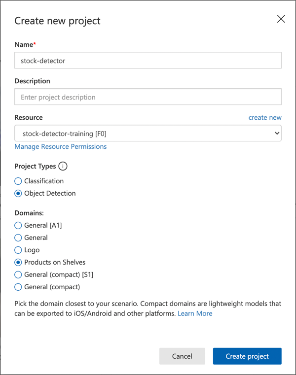

<!--
CO_OP_TRANSLATOR_METADATA:
{
  "original_hash": "8df310a42f902139a01417dacb1ffbef",
  "translation_date": "2025-08-27T10:04:12+00:00",
  "source_file": "5-retail/lessons/1-train-stock-detector/README.md",
  "language_code": "pa"
}
-->
# ਸਟਾਕ ਡਿਟੈਕਟਰ ਨੂੰ ਟ੍ਰੇਨ ਕਰੋ

> ਸਕੈਚਨੋਟ [ਨਿਤਿਆ ਨਰਸਿੰਹਨ](https://github.com/nitya) ਦੁਆਰਾ। ਵੱਡੇ ਵਰਜਨ ਲਈ ਚਿੱਤਰ 'ਤੇ ਕਲਿਕ ਕਰੋ।

ਇਹ ਵੀਡੀਓ ਆਬਜੈਕਟ ਡਿਟੈਕਸ਼ਨ ਅਤੇ Azure Custom Vision ਸੇਵਾ ਦਾ ਝਲਕ ਦਿੰਦੀ ਹੈ, ਜੋ ਕਿ ਇਸ ਪਾਠ ਵਿੱਚ ਕਵਰ ਕੀਤੀ ਜਾਵੇਗੀ।

> 🎥 ਉਪਰੋਕਤ ਚਿੱਤਰ 'ਤੇ ਕਲਿਕ ਕਰਕੇ ਵੀਡੀਓ ਦੇਖੋ

## ਪਾਠ ਤੋਂ ਪਹਿਲਾਂ ਕਵਿਜ਼

[ਪ੍ਰੀ-ਲੈਕਚਰ ਕਵਿਜ਼](https://black-meadow-040d15503.1.azurestaticapps.net/quiz/37)

## ਪਰਿਚਯ

ਪਿਛਲੇ ਪ੍ਰੋਜੈਕਟ ਵਿੱਚ, ਤੁਸੀਂ AI ਦੀ ਵਰਤੋਂ ਕਰਕੇ ਇੱਕ ਇਮੇਜ ਕਲਾਸੀਫਾਇਰ ਟ੍ਰੇਨ ਕੀਤਾ - ਇੱਕ ਮਾਡਲ ਜੋ ਦੱਸ ਸਕਦਾ ਹੈ ਕਿ ਚਿੱਤਰ ਵਿੱਚ ਕੁਝ ਹੈ, ਜਿਵੇਂ ਕਿ ਪੱਕੇ ਫਲ ਜਾਂ ਕੱਚੇ ਫਲ। ਚਿੱਤਰਾਂ ਨਾਲ ਵਰਤਣ ਲਈ ਇੱਕ ਹੋਰ ਕਿਸਮ ਦਾ AI ਮਾਡਲ ਆਬਜੈਕਟ ਡਿਟੈਕਸ਼ਨ ਹੈ। ਇਹ ਮਾਡਲ ਚਿੱਤਰ ਨੂੰ ਟੈਗਾਂ ਦੁਆਰਾ ਕਲਾਸੀਫਾਈ ਨਹੀਂ ਕਰਦੇ, ਬਲਕਿ ਇਹ ਚਿੱਤਰਾਂ ਵਿੱਚ ਆਬਜੈਕਟਾਂ ਨੂੰ ਪਛਾਣਨ ਲਈ ਟ੍ਰੇਨ ਕੀਤੇ ਜਾਂਦੇ ਹਨ। ਇਹ ਸਿਰਫ਼ ਇਹ ਨਹੀਂ ਦੱਸਦੇ ਕਿ ਚਿੱਤਰ ਵਿੱਚ ਆਬਜੈਕਟ ਮੌਜੂਦ ਹੈ, ਬਲਕਿ ਇਹ ਵੀ ਦੱਸਦੇ ਹਨ ਕਿ ਚਿੱਤਰ ਵਿੱਚ ਕਿੱਥੇ ਹੈ। ਇਸ ਨਾਲ ਚਿੱਤਰਾਂ ਵਿੱਚ ਆਬਜੈਕਟਾਂ ਦੀ ਗਿਣਤੀ ਕਰਨਾ ਸੰਭਵ ਹੁੰਦਾ ਹੈ।

ਇਸ ਪਾਠ ਵਿੱਚ ਤੁਸੀਂ ਆਬਜੈਕਟ ਡਿਟੈਕਸ਼ਨ ਬਾਰੇ ਸਿੱਖੋਗੇ, ਜਿਸ ਵਿੱਚ ਇਹ ਵੀ ਸ਼ਾਮਲ ਹੈ ਕਿ ਇਸਨੂੰ ਰਿਟੇਲ ਵਿੱਚ ਕਿਵੇਂ ਵਰਤਿਆ ਜਾ ਸਕਦਾ ਹੈ। ਤੁਸੀਂ ਕਲਾਉਡ ਵਿੱਚ ਇੱਕ ਆਬਜੈਕਟ ਡਿਟੈਕਟਰ ਨੂੰ ਟ੍ਰੇਨ ਕਰਨ ਦਾ ਤਰੀਕਾ ਵੀ ਸਿੱਖੋਗੇ।

ਇਸ ਪਾਠ ਵਿੱਚ ਅਸੀਂ ਕਵਰ ਕਰਾਂਗੇ:

* [ਆਬਜੈਕਟ ਡਿਟੈਕਸ਼ਨ](../../../../../5-retail/lessons/1-train-stock-detector)
* [ਰਿਟੇਲ ਵਿੱਚ ਆਬਜੈਕਟ ਡਿਟੈਕਸ਼ਨ ਦੀ ਵਰਤੋਂ](../../../../../5-retail/lessons/1-train-stock-detector)
* [ਆਬਜੈਕਟ ਡਿਟੈਕਟਰ ਨੂੰ ਟ੍ਰੇਨ ਕਰੋ](../../../../../5-retail/lessons/1-train-stock-detector)
* [ਆਪਣੇ ਆਬਜੈਕਟ ਡਿਟੈਕਟਰ ਦੀ ਜਾਂਚ ਕਰੋ](../../../../../5-retail/lessons/1-train-stock-detector)
* [ਆਪਣੇ ਆਬਜੈਕਟ ਡਿਟੈਕਟਰ ਨੂੰ ਦੁਬਾਰਾ ਟ੍ਰੇਨ ਕਰੋ](../../../../../5-retail/lessons/1-train-stock-detector)

## ਆਬਜੈਕਟ ਡਿਟੈਕਸ਼ਨ

ਆਬਜੈਕਟ ਡਿਟੈਕਸ਼ਨ ਵਿੱਚ AI ਦੀ ਵਰਤੋਂ ਕਰਕੇ ਚਿੱਤਰਾਂ ਵਿੱਚ ਆਬਜੈਕਟਾਂ ਦੀ ਪਛਾਣ ਕਰਨੀ ਸ਼ਾਮਲ ਹੈ। ਪਿਛਲੇ ਪ੍ਰੋਜੈਕਟ ਵਿੱਚ ਟ੍ਰੇਨ ਕੀਤੇ ਇਮੇਜ ਕਲਾਸੀਫਾਇਰ ਦੇ ਵਿਰੁੱਧ, ਆਬਜੈਕਟ ਡਿਟੈਕਸ਼ਨ ਸਿਰਫ਼ ਚਿੱਤਰ ਦੇ ਲਈ ਸਭ ਤੋਂ ਵਧੀਆ ਟੈਗ ਦੀ ਪੇਸ਼ਕਸ਼ ਕਰਨ ਬਾਰੇ ਨਹੀਂ ਹੈ, ਬਲਕਿ ਚਿੱਤਰ ਵਿੱਚ ਇੱਕ ਜਾਂ ਵੱਧ ਆਬਜੈਕਟਾਂ ਨੂੰ ਲੱਭਣ ਬਾਰੇ ਹੈ।

### ਆਬਜੈਕਟ ਡਿਟੈਕਸ਼ਨ ਵਿਰੁੱਧ ਇਮੇਜ ਕਲਾਸੀਫਿਕੇਸ਼ਨ

ਇਮੇਜ ਕਲਾਸੀਫਿਕੇਸ਼ਨ ਸਾਰੇ ਚਿੱਤਰ ਨੂੰ ਕਲਾਸੀਫਾਈ ਕਰਨ ਬਾਰੇ ਹੈ - ਸਾਰੇ ਚਿੱਤਰ ਵਿੱਚ ਹਰ ਟੈਗ ਨਾਲ ਮੇਲ ਖਾਣ ਦੀ ਸੰਭਾਵਨਾ ਕੀ ਹੈ। ਤੁਹਾਨੂੰ ਮਾਡਲ ਨੂੰ ਟ੍ਰੇਨ ਕਰਨ ਲਈ ਵਰਤੇ ਗਏ ਹਰ ਟੈਗ ਲਈ ਸੰਭਾਵਨਾਵਾਂ ਵਾਪਸ ਮਿਲਦੀਆਂ ਹਨ।

ਉਪਰੋਕਤ ਉਦਾਹਰਨ ਵਿੱਚ, ਦੋ ਚਿੱਤਰਾਂ ਨੂੰ ਇੱਕ ਮਾਡਲ ਦੀ ਵਰਤੋਂ ਕਰਕੇ ਕਲਾਸੀਫਾਈ ਕੀਤਾ ਗਿਆ ਹੈ ਜੋ ਕਿ ਕਾਜੂ ਦੇ ਡੱਬਿਆਂ ਜਾਂ ਟਮਾਟਰ ਪੇਸਟ ਦੇ ਕੈਨਾਂ ਨੂੰ ਕਲਾਸੀਫਾਈ ਕਰਨ ਲਈ ਟ੍ਰੇਨ ਕੀਤਾ ਗਿਆ ਹੈ। ਪਹਿਲਾ ਚਿੱਤਰ ਕਾਜੂ ਦੇ ਡੱਬੇ ਦਾ ਹੈ, ਅਤੇ ਇਮੇਜ ਕਲਾਸੀਫਾਇਰ ਤੋਂ ਦੋ ਨਤੀਜੇ ਹਨ:

| ਟੈਗ            | ਸੰਭਾਵਨਾ |
| -------------- | ----------: |
| `ਕਾਜੂ`         | 98.4%       |
| `ਟਮਾਟਰ ਪੇਸਟ`  | 1.6%        |

ਦੂਜਾ ਚਿੱਤਰ ਟਮਾਟਰ ਪੇਸਟ ਦੇ ਕੈਨ ਦਾ ਹੈ, ਅਤੇ ਨਤੀਜੇ ਹਨ:

| ਟੈਗ            | ਸੰਭਾਵਨਾ |
| -------------- | ----------: |
| `ਕਾਜੂ`         | 0.7%        |
| `ਟਮਾਟਰ ਪੇਸਟ`  | 99.3%       |

ਤੁਸੀਂ ਇਹ ਮੁੱਲ ਇੱਕ ਥ੍ਰੈਸ਼ਹੋਲਡ ਪ੍ਰਤੀਸ਼ਤ ਨਾਲ ਵਰਤ ਸਕਦੇ ਹੋ ਕਿ ਚਿੱਤਰ ਵਿੱਚ ਕੀ ਹੈ। ਪਰ ਜੇਕਰ ਚਿੱਤਰ ਵਿੱਚ ਟਮਾਟਰ ਪੇਸਟ ਦੇ ਕਈ ਕੈਨ ਜਾਂ ਕਾਜੂ ਅਤੇ ਟਮਾਟਰ ਪੇਸਟ ਦੋਵੇਂ ਹਨ? ਨਤੀਜੇ ਸ਼ਾਇਦ ਤੁਹਾਨੂੰ ਜੋ ਚਾਹੀਦਾ ਹੈ ਉਹ ਨਹੀਂ ਦੇਣਗੇ। ਇਹ ਜਿੱਥੇ ਆਬਜੈਕਟ ਡਿਟੈਕਸ਼ਨ ਦੀ ਲੋੜ ਹੁੰਦੀ ਹੈ।

ਆਬਜੈਕਟ ਡਿਟੈਕਸ਼ਨ ਵਿੱਚ ਮਾਡਲ ਨੂੰ ਆਬਜੈਕਟਾਂ ਨੂੰ ਪਛਾਣਨ ਲਈ ਟ੍ਰੇਨ ਕਰਨਾ ਸ਼ਾਮਲ ਹੈ। ਇਸਨੂੰ ਚਿੱਤਰਾਂ ਦੇਣ ਦੀ ਬਜਾਏ ਜੋ ਕਿ ਆਬਜੈਕਟ ਨੂੰ ਸ਼ਾਮਲ ਕਰਦੇ ਹਨ ਅਤੇ ਦੱਸਦੇ ਹਨ ਕਿ ਹਰ ਚਿੱਤਰ ਇੱਕ ਟੈਗ ਜਾਂ ਦੂਜਾ ਹੈ, ਤੁਸੀਂ ਚਿੱਤਰ ਦੇ ਉਸ ਭਾਗ ਨੂੰ ਹਾਈਲਾਈਟ ਕਰਦੇ ਹੋ ਜੋ ਵਿਸ਼ੇਸ਼ ਆਬਜੈਕਟ ਨੂੰ ਸ਼ਾਮਲ ਕਰਦਾ ਹੈ, ਅਤੇ ਉਸਨੂੰ ਟੈਗ ਕਰਦੇ ਹੋ। ਤੁਸੀਂ ਚਿੱਤਰ ਵਿੱਚ ਇੱਕ ਆਬਜੈਕਟ ਜਾਂ ਕਈ ਆਬਜੈਕਟਾਂ ਨੂੰ ਟੈਗ ਕਰ ਸਕਦੇ ਹੋ। ਇਸ ਤਰੀਕੇ ਨਾਲ ਮਾਡਲ ਸਿੱਖਦਾ ਹੈ ਕਿ ਆਬਜੈਕਟ ਖੁਦ ਕਿਵੇਂ ਦਿਖਦਾ ਹੈ, ਸਿਰਫ਼ ਇਹ ਨਹੀਂ ਕਿ ਆਬਜੈਕਟ ਨੂੰ ਸ਼ਾਮਲ ਕਰਨ ਵਾਲੇ ਚਿੱਤਰ ਕਿਵੇਂ ਦਿਖਦੇ ਹਨ।

ਜਦੋਂ ਤੁਸੀਂ ਇਸਨੂੰ ਚਿੱਤਰਾਂ ਦੀ ਪੇਸ਼ਕਸ਼ ਕਰਨ ਲਈ ਵਰਤਦੇ ਹੋ, ਤੁਹਾਨੂੰ ਟੈਗਾਂ ਅਤੇ ਪ੍ਰਤੀਸ਼ਤਾਂ ਦੀ ਸੂਚੀ ਵਾਪਸ ਮਿਲਣ ਦੀ ਬਜਾਏ, ਤੁਹਾਨੂੰ ਪਛਾਣੇ ਗਏ ਆਬਜੈਕਟਾਂ ਦੀ ਸੂਚੀ ਮਿਲਦੀ ਹੈ, ਉਨ੍ਹਾਂ ਦੇ ਬਾਊਂਡਿੰਗ ਬਾਕਸ ਅਤੇ ਪ੍ਰਤੀਸ਼ਤ ਸੰਭਾਵਨਾ ਦੇ ਨਾਲ ਕਿ ਬਾਊਂਡਿੰਗ ਬਾਕਸ ਅਸਾਈਨ ਕੀਤੇ ਟੈਗ ਨਾਲ ਮੇਲ ਖਾਂਦਾ ਹੈ।

> 🎓 *ਬਾਊਂਡਿੰਗ ਬਾਕਸ* ਉਹ ਬਾਕਸ ਹਨ ਜੋ ਆਬਜੈਕਟ ਦੇ ਆਲੇ-ਦੁਆਲੇ ਹੁੰਦੇ ਹਨ।

ਉਪਰੋਕਤ ਚਿੱਤਰ ਵਿੱਚ ਕਾਜੂ ਦੇ ਡੱਬੇ ਅਤੇ ਟਮਾਟਰ ਪੇਸਟ ਦੇ ਤਿੰਨ ਕੈਨ ਹਨ। ਆਬਜੈਕਟ ਡਿਟੈਕਟਰ ਨੇ ਕਾਜੂ ਨੂੰ ਪਛਾਣਿਆ ਹੈ, ਬਾਊਂਡਿੰਗ ਬਾਕਸ ਵਾਪਸ ਕਰਦਾ ਹੈ ਜੋ ਕਿ ਕਾਜੂ ਨੂੰ ਸ਼ਾਮਲ ਕਰਦਾ ਹੈ ਜਿਸ ਵਿੱਚ ਆਬਜੈਕਟ ਨੂੰ ਸ਼ਾਮਲ ਕਰਨ ਦੀ ਸੰਭਾਵਨਾ ਹੈ, ਇਸ ਮਾਮਲੇ ਵਿੱਚ 97.6%। ਆਬਜੈਕਟ ਡਿਟੈਕਟਰ ਨੇ ਟਮਾਟਰ ਪੇਸਟ ਦੇ ਤਿੰਨ ਕੈਨਾਂ ਨੂੰ ਵੀ ਪਛਾਣਿਆ ਹੈ, ਅਤੇ ਤਿੰਨ ਵੱਖਰੇ ਬਾਊਂਡਿੰਗ ਬਾਕਸ ਪ੍ਰਦਾਨ ਕਰਦਾ ਹੈ, ਹਰ ਪਛਾਣੇ ਗਏ ਕੈਨ ਲਈ ਇੱਕ, ਅਤੇ ਹਰ ਇੱਕ ਵਿੱਚ ਪ੍ਰਤੀਸ਼ਤ ਸੰਭਾਵਨਾ ਹੈ ਕਿ ਬਾਊਂਡਿੰਗ ਬਾਕਸ ਵਿੱਚ ਟਮਾਟਰ ਪੇਸਟ ਦਾ ਕੈਨ ਹੈ।

✅ ਕੁਝ ਵੱਖ-ਵੱਖ ਸਥਿਤੀਆਂ ਬਾਰੇ ਸੋਚੋ ਜਿਨ੍ਹਾਂ ਲਈ ਤੁਸੀਂ ਚਿੱਤਰ-ਅਧਾਰਤ AI ਮਾਡਲਾਂ ਦੀ ਵਰਤੋਂ ਕਰਨਾ ਚਾਹੁੰਦੇ ਹੋ। ਕਿਹੜੇ ਕਲਾਸੀਫਿਕੇਸ਼ਨ ਦੀ ਲੋੜ ਹੋਵੇਗੀ, ਅਤੇ ਕਿਹੜੇ ਆਬਜੈਕਟ ਡਿਟੈਕਸ਼ਨ ਦੀ ਲੋੜ ਹੋਵੇਗੀ?

### ਆਬਜੈਕਟ ਡਿਟੈਕਸ਼ਨ ਕਿਵੇਂ ਕੰਮ ਕਰਦਾ ਹੈ

ਆਬਜੈਕਟ ਡਿਟੈਕਸ਼ਨ ਜਟਿਲ ML ਮਾਡਲਾਂ ਦੀ ਵਰਤੋਂ ਕਰਦਾ ਹੈ। ਇਹ ਮਾਡਲ ਚਿੱਤਰ ਨੂੰ ਕਈ ਸੈਲਾਂ ਵਿੱਚ ਵੰਡਦੇ ਹਨ, ਫਿਰ ਜਾਂਚ ਕਰਦੇ ਹਨ ਕਿ ਬਾਊਂਡਿੰਗ ਬਾਕਸ ਦਾ ਕੇਂਦਰ ਚਿੱਤਰ ਦੇ ਕੇਂਦਰ ਨਾਲ ਮੇਲ ਖਾਂਦਾ ਹੈ ਜੋ ਮਾਡਲ ਨੂੰ ਟ੍ਰੇਨ ਕਰਨ ਲਈ ਵਰਤੇ ਗਏ ਚਿੱਤਰਾਂ ਵਿੱਚੋਂ ਇੱਕ ਨਾਲ ਮੇਲ ਖਾਂਦਾ ਹੈ। ਤੁਸੀਂ ਇਸਨੂੰ ਕੁਝ ਹੱਦ ਤੱਕ ਇਸ ਤਰ੍ਹਾਂ ਸੋਚ ਸਕਦੇ ਹੋ ਕਿ ਚਿੱਤਰ ਦੇ ਵੱਖ-ਵੱਖ ਭਾਗਾਂ 'ਤੇ ਇੱਕ ਇਮੇਜ ਕਲਾਸੀਫਾਇਰ ਚਲਾਇਆ ਜਾ ਰਿਹਾ ਹੈ ਤਾਂ ਜੋ ਮੇਲ ਲੱਭੇ ਜਾ ਸਕਣ।

> 💁 ਇਹ ਇੱਕ ਬਹੁਤ ਹੀ ਸਧਾਰਨ ਸਿੱਧਾ ਸਿੱਧਾ ਵਰਣਨ ਹੈ। ਆਬਜੈਕਟ ਡਿਟੈਕਸ਼ਨ ਲਈ ਕਈ ਤਕਨੀਕਾਂ ਹਨ, ਅਤੇ ਤੁਸੀਂ ਉਨ੍ਹਾਂ ਬਾਰੇ ਹੋਰ ਪੜ੍ਹ ਸਕਦੇ ਹੋ [Object detection page on Wikipedia](https://wikipedia.org/wiki/Object_detection) 'ਤੇ।

ਕਈ ਵੱਖ-ਵੱਖ ਮਾਡਲ ਹਨ ਜੋ ਆਬਜੈਕਟ ਡਿਟੈਕਸ਼ਨ ਕਰ ਸਕਦੇ ਹਨ। ਇੱਕ ਖਾਸ ਤੌਰ 'ਤੇ ਪ੍ਰਸਿੱਧ ਮਾਡਲ [YOLO (You only look once)](https://pjreddie.com/darknet/yolo/) ਹੈ, ਜੋ ਬਹੁਤ ਤੇਜ਼ ਹੈ ਅਤੇ 20 ਵੱਖ-ਵੱਖ ਆਬਜੈਕਟ ਕਲਾਸਾਂ ਨੂੰ ਪਛਾਣ ਸਕਦਾ ਹੈ, ਜਿਵੇਂ ਕਿ ਲੋਕ, ਕੁੱਤੇ, ਬੋਤਲਾਂ ਅਤੇ ਕਾਰਾਂ।

✅ YOLO ਮਾਡਲ ਬਾਰੇ [pjreddie.com/darknet/yolo/](https://pjreddie.com/darknet/yolo/) 'ਤੇ ਪੜ੍ਹੋ

ਆਬਜੈਕਟ ਡਿਟੈਕਸ਼ਨ ਮਾਡਲਾਂ ਨੂੰ ਟ੍ਰਾਂਸਫਰ ਲਰਨਿੰਗ ਦੀ ਵਰਤੋਂ ਕਰਕੇ ਕਸਟਮ ਆਬਜੈਕਟਾਂ ਨੂੰ ਪਛਾਣਨ ਲਈ ਦੁਬਾਰਾ ਟ੍ਰੇਨ ਕੀਤਾ ਜਾ ਸਕਦਾ ਹੈ।

## ਰਿਟੇਲ ਵਿੱਚ ਆਬਜੈਕਟ ਡਿਟੈਕਸ਼ਨ ਦੀ ਵਰਤੋਂ

ਰਿਟੇਲ ਵਿੱਚ ਆਬਜੈਕਟ ਡਿਟੈਕਸ਼ਨ ਦੀ ਕਈ ਵਰਤੋਂ ਹੈ। ਕੁਝ ਸ਼ਾਮਲ ਹਨ:

* **ਸਟਾਕ ਦੀ ਜਾਂਚ ਅਤੇ ਗਿਣਤੀ** - ਸ਼ੇਲਫਾਂ 'ਤੇ ਸਟਾਕ ਘੱਟ ਹੋਣ ਦੀ ਪਛਾਣ। ਜੇਕਰ ਸਟਾਕ ਬਹੁਤ ਘੱਟ ਹੈ, ਸਟਾਫ ਜਾਂ ਰੋਬੋਟਾਂ ਨੂੰ ਸ਼ੇਲਫਾਂ ਨੂੰ ਦੁਬਾਰਾ ਭਰਨ ਲਈ ਸੂਚਨਾਵਾਂ ਭੇਜੀਆਂ ਜਾ ਸਕਦੀਆਂ ਹਨ।
* **ਮਾਸਕ ਡਿਟੈਕਸ਼ਨ** - ਸਟੋਰਾਂ ਵਿੱਚ ਜਿੱਥੇ ਜਨਤਕ ਸਿਹਤ ਘਟਨਾਵਾਂ ਦੌਰਾਨ ਮਾਸਕ ਨੀਤੀਆਂ ਹਨ, ਆਬਜੈਕਟ ਡਿਟੈਕਸ਼ਨ ਮਾਸਕ ਵਾਲੇ ਲੋਕਾਂ ਅਤੇ ਬਿਨਾਂ ਮਾਸਕ ਵਾਲੇ ਲੋਕਾਂ ਨੂੰ ਪਛਾਣ ਸਕਦਾ ਹੈ।
* **ਆਟੋਮੈਟਿਕ ਬਿਲਿੰਗ** - ਆਟੋਮੈਟਿਕ ਸਟੋਰਾਂ ਵਿੱਚ ਸ਼ੇਲਫਾਂ ਤੋਂ ਚੁੱਕੀਆਂ ਗਈਆਂ ਚੀਜ਼ਾਂ ਦੀ ਪਛਾਣ ਕਰਨਾ ਅਤੇ ਗਾਹਕਾਂ ਨੂੰ ਸਹੀ ਤੌਰ 'ਤੇ ਬਿਲਿੰਗ ਕਰਨਾ।
* **ਖਤਰੇ ਦੀ ਪਛਾਣ** - ਫਰਸ਼ਾਂ 'ਤੇ ਟੁੱਟੀਆਂ ਚੀਜ਼ਾਂ ਜਾਂ ਗਿਰੇ ਹੋਏ ਤਰਲ ਪਦਾਰਥਾਂ ਦੀ ਪਛਾਣ ਕਰਨਾ, ਸਫਾਈ ਕਰਮਚਾਰੀਆਂ ਨੂੰ ਸੂਚਿਤ ਕਰਨਾ।

✅ ਕੁਝ ਖੋਜ ਕਰੋ: ਰਿਟੇਲ ਵਿੱਚ ਆਬਜੈਕਟ ਡਿਟੈਕਸ਼ਨ ਲਈ ਹੋਰ ਕਿਹੜੀਆਂ ਵਰਤੋਂ ਦੇ ਕੇਸ ਹੋ ਸਕਦੇ ਹਨ?

## ਆਬਜੈਕਟ ਡਿਟੈਕਟਰ ਨੂੰ ਟ੍ਰੇਨ ਕਰੋ

ਤੁਸੀਂ Custom Vision ਦੀ ਵਰਤੋਂ ਕਰਕੇ ਇੱਕ ਆਬਜੈਕਟ ਡਿਟੈਕਟਰ ਨੂੰ ਟ੍ਰੇਨ ਕਰ ਸਕਦੇ ਹੋ, ਜਿਵੇਂ ਕਿ ਤੁਸੀਂ ਇੱਕ ਇਮੇਜ ਕਲਾਸੀਫਾਇਰ ਨੂੰ ਟ੍ਰੇਨ ਕੀਤਾ ਸੀ।

### ਟਾਸਕ - ਇੱਕ ਆਬਜੈਕਟ ਡਿਟੈਕਟਰ ਬਣਾਓ

1. ਇਸ ਪ੍ਰੋਜੈਕਟ ਲਈ ਇੱਕ ਰਿਸੋਰਸ ਗਰੁੱਪ ਬਣਾਓ ਜਿਸਨੂੰ `stock-detector` ਕਿਹਾ ਜਾਂਦਾ ਹੈ।

1. `stock-detector` ਰਿਸੋਰਸ ਗਰੁੱਪ ਵਿੱਚ ਇੱਕ ਮੁਫ਼ਤ Custom Vision ਟ੍ਰੇਨਿੰਗ ਰਿਸੋਰਸ ਅਤੇ ਇੱਕ ਮੁਫ਼ਤ Custom Vision ਪ੍ਰਿਡਿਕਸ਼ਨ ਰਿਸੋਰਸ ਬਣਾਓ। ਉਨ੍ਹਾਂ ਨੂੰ `stock-detector-training` ਅਤੇ `stock-detector-prediction` ਨਾਮ ਦਿਓ।

    > 💁 ਤੁਸੀਂ ਸਿਰਫ਼ ਇੱਕ ਮੁਫ਼ਤ ਟ੍ਰੇਨਿੰਗ ਅਤੇ ਪ੍ਰਿਡਿਕਸ਼ਨ ਰਿਸੋਰਸ ਰੱਖ ਸਕਦੇ ਹੋ, ਇਸ ਲਈ ਯਕੀਨੀ ਬਣਾਓ ਕਿ ਤੁਸੀਂ ਪਹਿਲੇ ਪਾਠਾਂ ਤੋਂ ਆਪਣੇ ਪ੍ਰੋਜੈਕਟ ਨੂੰ ਸਾਫ਼ ਕਰ ਦਿੱਤਾ ਹੈ।

    > ⚠️ ਜੇਕਰ ਲੋੜ ਹੋਵੇ ਤਾਂ [ਪ੍ਰੋਜੈਕਟ 4, ਪਾਠ 1 ਤੋਂ ਟ੍ਰੇਨਿੰਗ ਅਤੇ ਪ੍ਰਿਡਿਕਸ਼ਨ ਰਿਸੋਰਸ ਬਣਾਉਣ ਦੇ ਨਿਰਦੇਸ਼ਾਂ](../../../4-manufacturing/lessons/1-train-fruit-detector/README.md#task---create-a-cognitive-services-resource) ਨੂੰ ਰਿਫਰ ਕਰੋ।

1. Custom Vision ਪੋਰਟਲ [CustomVision.ai](https://customvision.ai) 'ਤੇ ਲਾਂਚ ਕਰੋ, ਅਤੇ ਆਪਣੇ Azure ਖਾਤੇ ਲਈ ਵਰਤੇ ਗਏ Microsoft ਖਾਤੇ ਨਾਲ ਸਾਈਨ ਇਨ ਕਰੋ।

1. Microsoft Docs 'ਤੇ [Build an object detector quickstart](https://docs.microsoft.com/azure/cognitive-services/custom-vision-service/get-started-build-detector?WT.mc_id=academic-17441-jabenn#create-a-new-project) ਦੇ "Create a new Project" ਸੈਕਸ਼ਨ ਦੀ ਪਾਲਣਾ ਕਰੋ ਤਾਂ ਜੋ ਇੱਕ ਨਵਾਂ Custom Vision ਪ੍ਰੋਜੈਕਟ ਬਣਾਇਆ ਜਾ ਸਕੇ। UI ਬਦਲ ਸਕਦਾ ਹੈ ਅਤੇ ਇਹ ਡੌਕਸ ਹਮੇਸ਼ਾ ਸਭ ਤੋਂ ਅੱਪ-ਟੂ-ਡੇਟ ਰਿਫਰੈਂਸ ਹੁੰਦੇ ਹਨ।

    ਆਪਣੇ ਪ੍ਰੋਜੈਕਟ ਨੂੰ `stock-detector` ਕਹੋ।

    ਜਦੋਂ ਤੁਸੀਂ ਆਪਣਾ ਪ੍ਰੋਜੈਕਟ ਬਣਾਉਂਦੇ ਹੋ, ਯਕੀਨੀ ਬਣਾਓ ਕਿ ਤੁਸੀਂ ਪਹਿਲਾਂ ਬਣਾਏ `stock-detector-training` ਰਿਸੋਰਸ ਦੀ ਵਰਤੋਂ ਕਰਦੇ ਹੋ। *Object Detection* ਪ੍ਰੋਜੈਕਟ ਕਿਸਮ ਅਤੇ *Products on Shelves* ਡੋਮੇਨ ਦੀ ਵਰਤੋਂ ਕਰੋ।

    

    ✅ *Products on Shelves* ਡੋਮੇਨ ਖਾਸ ਤੌਰ 'ਤੇ ਸਟੋਰ ਸ਼ੇਲਫਾਂ 'ਤੇ ਸਟਾਕ ਦੀ ਪਛਾਣ ਲਈ ਟਾਰਗਟ ਕੀਤਾ ਗਿਆ ਹੈ। Microsoft Docs 'ਤੇ [Select a domain documentation](https://docs.microsoft.com/azure/cognitive-services/custom-vision-service/select-domain?WT.mc_id=academic-17441-jabenn#object-detection) 'ਤੇ ਵੱਖ-ਵੱਖ ਡੋਮੇਨ ਬਾਰੇ ਹੋਰ ਪੜ੍ਹੋ।

✅ ਆਪਣੇ ਆਬਜੈਕਟ ਡਿਟੈਕਟਰ ਲਈ Custom Vision UI ਦੀ ਜਾਂਚ ਕਰਨ ਲਈ ਕੁਝ ਸਮਾਂ ਲਓ।

### ਟਾਸਕ - ਆਪਣੇ ਆਬਜੈਕਟ ਡਿਟੈਕਟਰ ਨੂੰ ਟ੍ਰੇਨ ਕਰੋ

ਆਪਣੇ ਮਾਡਲ ਨੂੰ ਟ੍ਰੇਨ ਕਰਨ ਲਈ ਤੁਹਾਨੂੰ ਉਹ ਚਿੱਤਰਾਂ ਦੀ ਲੋੜ ਹੋਵੇਗੀ ਜੋ ਤੁਸੀਂ ਪਛਾਣਨਾ ਚਾਹੁੰਦੇ ਹੋ।

1. ਉਹ ਚਿੱਤਰ ਇਕੱਠੇ ਕਰੋ ਜੋ ਪਛਾਣਨ ਵਾਲੇ ਆਬਜੈਕਟ ਨੂੰ ਸ਼ਾਮਲ ਕਰਦੇ ਹਨ। ਤੁਹਾਨੂੰ ਹਰ ਆਬਜੈਕਟ ਨੂੰ ਪਛਾਣਨ ਲਈ ਘੱਟੋ-ਘੱਟ 15 ਚਿੱਤਰਾਂ ਦੀ ਲੋੜ ਹੋਵੇਗੀ ਜੋ ਵੱਖ-ਵੱਖ ਕੋਣਾਂ ਤੋਂ ਅਤੇ ਵੱਖ-ਵੱਖ ਰੌਸ਼ਨੀ ਦੀਆਂ ਸਥਿਤੀਆਂ ਵਿੱਚ ਹੋਣ, ਪਰ ਜਿੰਨੇ ਜ਼ਿਆਦਾ ਹੋਣਗੇ, ਉਨ੍ਹਾਂ ਨੂੰ ਵਧੀਆ। ਇਹ ਆਬਜੈਕਟ ਡਿਟੈਕ
[ਪੋਸਟ-ਲੈਕਚਰ ਕਵਿਜ਼](https://black-meadow-040d15503.1.azurestaticapps.net/quiz/38)

## ਸਮੀਖਿਆ ਅਤੇ ਖੁਦ ਅਧਿਐਨ

* ਜਦੋਂ ਤੁਸੀਂ ਆਪਣੇ ਆਬਜੈਕਟ ਡਿਟੈਕਟਰ ਨੂੰ ਟ੍ਰੇਨ ਕੀਤਾ, ਤਾਂ ਤੁਸੀਂ *Precision*, *Recall*, ਅਤੇ *mAP* ਦੇ ਮੁੱਲ ਵੇਖੇ ਹੋਣਗੇ ਜੋ ਬਣੇ ਮਾਡਲ ਦੀ ਰੇਟਿੰਗ ਦਿੰਦੇ ਹਨ। ਇਹ ਮੁੱਲ ਕੀ ਹਨ, ਇਸ ਬਾਰੇ ਹੋਰ ਪੜ੍ਹੋ [ਮਾਈਕਰੋਸਾਫਟ ਡੌਕਸ ਦੇ "Evaluate the detector" ਸੈਕਸ਼ਨ ਵਿੱਚ, ਜੋ ਕਿ "ਬਿਲਡ ਐਨ ਆਬਜੈਕਟ ਡਿਟੈਕਟਰ ਕਵਿਕਸਟਾਰਟ" ਵਿੱਚ ਦਿੱਤਾ ਗਿਆ ਹੈ](https://docs.microsoft.com/azure/cognitive-services/custom-vision-service/get-started-build-detector?WT.mc_id=academic-17441-jabenn#evaluate-the-detector)
* ਆਬਜੈਕਟ ਡਿਟੈਕਸ਼ਨ ਬਾਰੇ ਹੋਰ ਜਾਣਕਾਰੀ ਲਈ [ਵਿਕੀਪੀਡੀਆ ਦੇ ਆਬਜੈਕਟ ਡਿਟੈਕਸ਼ਨ ਪੰਨੇ](https://wikipedia.org/wiki/Object_detection) 'ਤੇ ਪੜ੍ਹੋ।

## ਅਸਾਈਨਮੈਂਟ

[ਡੋਮੇਨ ਦੀ ਤੁਲਨਾ ਕਰੋ](assignment.md)

---

**ਅਸਵੀਕਰਤਾ**:  
ਇਹ ਦਸਤਾਵੇਜ਼ AI ਅਨੁਵਾਦ ਸੇਵਾ [Co-op Translator](https://github.com/Azure/co-op-translator) ਦੀ ਵਰਤੋਂ ਕਰਕੇ ਅਨੁਵਾਦ ਕੀਤਾ ਗਿਆ ਹੈ। ਜਦੋਂ ਕਿ ਅਸੀਂ ਸਹੀ ਹੋਣ ਦੀ ਕੋਸ਼ਿਸ਼ ਕਰਦੇ ਹਾਂ, ਕਿਰਪਾ ਕਰਕੇ ਧਿਆਨ ਦਿਓ ਕਿ ਸਵੈਚਾਲਿਤ ਅਨੁਵਾਦਾਂ ਵਿੱਚ ਗਲਤੀਆਂ ਜਾਂ ਅਸੁਚੱਜੇਪਣ ਹੋ ਸਕਦੇ ਹਨ। ਇਸ ਦੀ ਮੂਲ ਭਾਸ਼ਾ ਵਿੱਚ ਮੂਲ ਦਸਤਾਵੇਜ਼ ਨੂੰ ਅਧਿਕਾਰਤ ਸਰੋਤ ਮੰਨਿਆ ਜਾਣਾ ਚਾਹੀਦਾ ਹੈ। ਮਹੱਤਵਪੂਰਨ ਜਾਣਕਾਰੀ ਲਈ, ਪੇਸ਼ੇਵਰ ਮਨੁੱਖੀ ਅਨੁਵਾਦ ਦੀ ਸਿਫਾਰਸ਼ ਕੀਤੀ ਜਾਂਦੀ ਹੈ। ਇਸ ਅਨੁਵਾਦ ਦੀ ਵਰਤੋਂ ਤੋਂ ਪੈਦਾ ਹੋਣ ਵਾਲੇ ਕਿਸੇ ਵੀ ਗਲਤਫਹਿਮੀ ਜਾਂ ਗਲਤ ਵਿਆਖਿਆ ਲਈ ਅਸੀਂ ਜ਼ਿੰਮੇਵਾਰ ਨਹੀਂ ਹਾਂ।