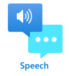

<!--
CO_OP_TRANSLATOR_METADATA:
{
  "original_hash": "6d6aa1be033625d201a190fc9c5cbfb4",
  "translation_date": "2025-08-27T14:08:03+00:00",
  "source_file": "6-consumer/lessons/1-speech-recognition/README.md",
  "language_code": "pa"
}
-->
# IoT ਡਿਵਾਈਸ ਨਾਲ ਬੋਲਚਾਲ ਦੀ ਪਹਚਾਣ ਕਰੋ


> ਸਕੈਚਨੋਟ [ਨਿਤਿਆ ਨਰਸਿੰਮਨ](https://github.com/nitya) ਦੁਆਰਾ। ਵੱਡੇ ਵਰਜਨ ਲਈ ਚਿੱਤਰ 'ਤੇ ਕਲਿੱਕ ਕਰੋ।

ਇਹ ਵੀਡੀਓ Azure ਬੋਲਚਾਲ ਸੇਵਾ ਦਾ ਇੱਕ ਝਲਕ ਦਿੰਦੀ ਹੈ, ਜੋ ਕਿ ਇਸ ਪਾਠ ਵਿੱਚ ਕਵਰ ਕੀਤੀ ਜਾਵੇਗੀ:

[](https://www.youtube.com/watch?v=iW0Fw0l3mrA)

> 🎥 ਉਪਰੋਕਤ ਚਿੱਤਰ 'ਤੇ ਕਲਿੱਕ ਕਰਕੇ ਵੀਡੀਓ ਦੇਖੋ

## ਪਾਠ ਤੋਂ ਪਹਿਲਾਂ ਕਵੀਜ਼

[ਪਾਠ ਤੋਂ ਪਹਿਲਾਂ ਕਵੀਜ਼](https://black-meadow-040d15503.1.azurestaticapps.net/quiz/41)

## ਪਰਿਚਯ

'ਅਲੇਕਸਾ, 12 ਮਿੰਟ ਦਾ ਟਾਈਮਰ ਸੈਟ ਕਰੋ'

'ਅਲੇਕਸਾ, ਟਾਈਮਰ ਦੀ ਸਥਿਤੀ ਦੱਸੋ'

'ਅਲੇਕਸਾ, 8 ਮਿੰਟ ਦਾ ਟਾਈਮਰ ਸੈਟ ਕਰੋ ਜਿਸਦਾ ਨਾਮ ਸਟੀਮ ਬ੍ਰੋਕਲੀ ਰੱਖੋ'

ਸਮਾਰਟ ਡਿਵਾਈਸ ਹਰ ਜਗ੍ਹਾ ਵਿਆਪਕ ਹੋ ਰਹੇ ਹਨ। ਸਿਰਫ ਸਮਾਰਟ ਸਪੀਕਰਾਂ ਜਿਵੇਂ ਕਿ ਹੋਮਪੋਡ, ਏਕੋ ਅਤੇ ਗੂਗਲ ਹੋਮ ਹੀ ਨਹੀਂ, ਸਗੋਂ ਸਾਡੇ ਫੋਨਾਂ, ਘੜੀਆਂ, ਇੱਥੋਂ ਤੱਕ ਕਿ ਲਾਈਟ ਫਿਟਿੰਗ ਅਤੇ ਥਰਮੋਸਟੈਟ ਵਿੱਚ ਵੀ ਇਹ ਸ਼ਾਮਲ ਹਨ।

> 💁 ਮੇਰੇ ਘਰ ਵਿੱਚ ਘੱਟੋ-ਘੱਟ 19 ਡਿਵਾਈਸ ਹਨ ਜਿਨ੍ਹਾਂ ਵਿੱਚ ਵੌਇਸ ਅਸਿਸਟੈਂਟ ਹਨ, ਅਤੇ ਇਹ ਸਿਰਫ ਉਹ ਹਨ ਜਿਨ੍ਹਾਂ ਬਾਰੇ ਮੈਨੂੰ ਪਤਾ ਹੈ!

ਵੌਇਸ ਕੰਟਰੋਲ ਪਹੁੰਚਯੋਗਤਾ ਨੂੰ ਵਧਾਉਂਦਾ ਹੈ, ਜਿਸ ਨਾਲ ਸੀਮਿਤ ਹਿਲਜੁਲ ਵਾਲੇ ਲੋਕ ਡਿਵਾਈਸਾਂ ਨਾਲ ਇੰਟਰੈਕਟ ਕਰ ਸਕਦੇ ਹਨ। ਚਾਹੇ ਇਹ ਜਨਮ ਤੋਂ ਬਿਨਾਂ ਬਾਂਹਾਂ ਵਾਲੇ ਹੋਣ ਦਾ ਸਥਾਈ ਅਪਾਹਜਤਾ ਹੋਵੇ, ਜਾਂ ਟੁੱਟੀਆਂ ਬਾਂਹਾਂ ਵਾਲੇ ਅਸਥਾਈ ਅਪਾਹਜਤਾ ਹੋਵੇ, ਜਾਂ ਖਰੀਦਦਾਰੀ ਜਾਂ ਛੋਟੇ ਬੱਚਿਆਂ ਨਾਲ ਹੱਥ ਭਰੇ ਹੋਣ, ਸਾਡੇ ਘਰਾਂ ਨੂੰ ਹੱਥਾਂ ਦੀ ਬਜਾਏ ਸਿਰਫ਼ ਆਪਣੀ ਆਵਾਜ਼ ਨਾਲ ਕੰਟਰੋਲ ਕਰਨਾ ਪਹੁੰਚ ਦਾ ਇੱਕ ਨਵਾਂ ਜਹਾਨ ਖੋਲ੍ਹਦਾ ਹੈ। ਜਦੋਂ ਤੁਸੀਂ ਇੱਕ ਬੱਚੇ ਦੀ ਦੇਖਭਾਲ ਕਰ ਰਹੇ ਹੋ ਅਤੇ ਇੱਕ ਸ਼ਰਾਰਤੀ ਬੱਚੇ ਨਾਲ ਨਜਿੱਠ ਰਹੇ ਹੋ, ਤਾਂ 'ਹੇ ਸਿਰੀ, ਮੇਰਾ ਗੈਰਾਜ ਦਾ ਦਰਵਾਜ਼ਾ ਬੰਦ ਕਰੋ' ਚੀਕਣਾ ਜੀਵਨ ਵਿੱਚ ਇੱਕ ਛੋਟਾ ਪਰ ਪ੍ਰਭਾਵਸ਼ਾਲੀ ਸੁਧਾਰ ਹੋ ਸਕਦਾ ਹੈ।

ਵੌਇਸ ਅਸਿਸਟੈਂਟਾਂ ਲਈ ਸਭ ਤੋਂ ਪ੍ਰਸਿੱਧ ਵਰਤੋਂ ਵਿੱਚੋਂ ਇੱਕ ਟਾਈਮਰ ਸੈਟ ਕਰਨਾ ਹੈ, ਖਾਸ ਕਰਕੇ ਰਸੋਈ ਟਾਈਮਰ। ਸਿਰਫ ਆਪਣੀ ਆਵਾਜ਼ ਨਾਲ ਕਈ ਟਾਈਮਰ ਸੈਟ ਕਰਨ ਦੇ ਯੋਗ ਹੋਣਾ ਰਸੋਈ ਵਿੱਚ ਬਹੁਤ ਮਦਦਗਾਰ ਹੈ - ਡੋ ਗੂੰਦਣ, ਸੂਪ ਹਿਲਾਉਣ ਜਾਂ ਆਪਣੇ ਹੱਥਾਂ ਤੋਂ ਗੰਦੇ ਭਰਾਵੇ ਨੂੰ ਸਾਫ਼ ਕਰਨ ਦੀ ਲੋੜ ਨਹੀਂ।

ਇਸ ਪਾਠ ਵਿੱਚ ਤੁਸੀਂ ਸਿੱਖੋਗੇ ਕਿ IoT ਡਿਵਾਈਸਾਂ ਵਿੱਚ ਵੌਇਸ ਪਹਚਾਣ ਕਿਵੇਂ ਬਣਾਈ ਜਾਵੇ। ਤੁਸੀਂ ਮਾਈਕਰੋਫੋਨ ਨੂੰ ਸੈਂਸਰ ਵਜੋਂ ਸਮਝਣਾ, IoT ਡਿਵਾਈਸ ਨਾਲ ਜੁੜੇ ਮਾਈਕਰੋਫੋਨ ਤੋਂ ਆਡੀਓ ਕੈਪਚਰ ਕਰਨਾ, ਅਤੇ ਸੁਣੀ ਗਈ ਗੱਲ ਨੂੰ ਟੈਕਸਟ ਵਿੱਚ ਬਦਲਣ ਲਈ AI ਦੀ ਵਰਤੋਂ ਕਰਨਾ ਸਿੱਖੋਗੇ। ਇਸ ਪ੍ਰੋਜੈਕਟ ਦੇ ਬਾਕੀ ਹਿੱਸੇ ਵਿੱਚ ਤੁਸੀਂ ਇੱਕ ਸਮਾਰਟ ਰਸੋਈ ਟਾਈਮਰ ਬਣਾਉਗੇ, ਜੋ ਕਈ ਭਾਸ਼ਾਵਾਂ ਵਿੱਚ ਤੁਹਾਡੀ ਆਵਾਜ਼ ਨਾਲ ਟਾਈਮਰ ਸੈਟ ਕਰਨ ਦੇ ਯੋਗ ਹੋਵੇਗਾ।

ਇਸ ਪਾਠ ਵਿੱਚ ਅਸੀਂ ਕਵਰ ਕਰਾਂਗੇ:

* [ਮਾਈਕਰੋਫੋਨ](../../../../../6-consumer/lessons/1-speech-recognition)
* [ਆਪਣੇ IoT ਡਿਵਾਈਸ ਤੋਂ ਆਡੀਓ ਕੈਪਚਰ ਕਰੋ](../../../../../6-consumer/lessons/1-speech-recognition)
* [ਸਪੀਚ ਤੋਂ ਟੈਕਸਟ](../../../../../6-consumer/lessons/1-speech-recognition)
* [ਸਪੀਚ ਨੂੰ ਟੈਕਸਟ ਵਿੱਚ ਬਦਲੋ](../../../../../6-consumer/lessons/1-speech-recognition)

## ਮਾਈਕਰੋਫੋਨ

ਮਾਈਕਰੋਫੋਨ ਐਨਾਲੌਗ ਸੈਂਸਰ ਹਨ ਜੋ ਧੁਨੀ ਤਰੰਗਾਂ ਨੂੰ ਬਿਜਲਈ ਸੰਕੇਤਾਂ ਵਿੱਚ ਬਦਲਦੇ ਹਨ। ਹਵਾ ਵਿੱਚ ਕੰਪਨ ਮਾਈਕਰੋਫੋਨ ਦੇ ਹਿੱਸਿਆਂ ਨੂੰ ਬਹੁਤ ਘੱਟ ਮਾਤਰਾ ਵਿੱਚ ਹਿਲਾਉਂਦੇ ਹਨ, ਅਤੇ ਇਹ ਬਿਜਲਈ ਸੰਕੇਤਾਂ ਵਿੱਚ ਬਦਲ ਜਾਂਦੇ ਹਨ। ਇਹ ਬਦਲਾਅ ਫਿਰ ਬਿਜਲਈ ਆਉਟਪੁੱਟ ਪੈਦਾ ਕਰਨ ਲਈ ਵਧਾਏ ਜਾਂਦੇ ਹਨ।

### ਮਾਈਕਰੋਫੋਨ ਦੇ ਪ੍ਰਕਾਰ

ਮਾਈਕਰੋਫੋਨ ਕਈ ਪ੍ਰਕਾਰਾਂ ਵਿੱਚ ਆਉਂਦੇ ਹਨ:

* ਡਾਇਨਾਮਿਕ - ਡਾਇਨਾਮਿਕ ਮਾਈਕਰੋਫੋਨ ਵਿੱਚ ਇੱਕ ਚਲਣ ਵਾਲੀ ਡਾਇਅਫ੍ਰੇਮ ਨਾਲ ਜੁੜੀ ਚੁੰਬਕ ਹੁੰਦੀ ਹੈ ਜੋ ਤਾਰ ਦੇ ਕੁੰਡਲ ਵਿੱਚ ਹਿਲਦੀ ਹੈ ਅਤੇ ਬਿਜਲਈ ਕਰੰਟ ਪੈਦਾ ਕਰਦੀ ਹੈ। ਇਹ ਜ਼ਿਆਦਾਤਰ ਲਾਊਡਸਪੀਕਰਾਂ ਦੇ ਉਲਟ ਹੁੰਦਾ ਹੈ, ਜੋ ਬਿਜਲਈ ਕਰੰਟ ਦੀ ਵਰਤੋਂ ਕਰਕੇ ਚੁੰਬਕ ਨੂੰ ਤਾਰ ਦੇ ਕੁੰਡਲ ਵਿੱਚ ਹਿਲਾਉਂਦੇ ਹਨ, ਡਾਇਅਫ੍ਰੇਮ ਨੂੰ ਹਿਲਾਉਣ ਲਈ ਧੁਨੀ ਪੈਦਾ ਕਰਦੇ ਹਨ। ਇਸਦਾ ਮਤਲਬ ਹੈ ਕਿ ਸਪੀਕਰਾਂ ਨੂੰ ਡਾਇਨਾਮਿਕ ਮਾਈਕਰੋਫੋਨ ਵਜੋਂ ਵਰਤਿਆ ਜਾ ਸਕਦਾ ਹੈ, ਅਤੇ ਡਾਇਨਾਮਿਕ ਮਾਈਕਰੋਫੋਨ ਨੂੰ ਸਪੀਕਰ ਵਜੋਂ ਵਰਤਿਆ ਜਾ ਸਕਦਾ ਹੈ। ਜਿਵੇਂ ਕਿ ਇੰਟਰਕੌਮ ਜਿਵੇਂ ਡਿਵਾਈਸਾਂ ਵਿੱਚ, ਜਿੱਥੇ ਉਪਭੋਗਤਾ ਜਾਂ ਤਾਂ ਸੁਣ ਰਿਹਾ ਹੁੰਦਾ ਹੈ ਜਾਂ ਬੋਲ ਰਿਹਾ ਹੁੰਦਾ ਹੈ, ਪਰ ਦੋਵੇਂ ਨਹੀਂ, ਇੱਕ ਹੀ ਡਿਵਾਈਸ ਸਪੀਕਰ ਅਤੇ ਮਾਈਕਰੋਫੋਨ ਦੋਵੇਂ ਵਜੋਂ ਕੰਮ ਕਰ ਸਕਦਾ ਹੈ।

    ਡਾਇਨਾਮਿਕ ਮਾਈਕਰੋਫੋਨ ਨੂੰ ਕੰਮ ਕਰਨ ਲਈ ਬਿਜਲੀ ਦੀ ਲੋੜ ਨਹੀਂ ਹੁੰਦੀ, ਬਿਜਲਈ ਸੰਕੇਤ ਪੂਰੀ ਤਰ੍ਹਾਂ ਮਾਈਕਰੋਫੋਨ ਤੋਂ ਪੈਦਾ ਹੁੰਦਾ ਹੈ।

    

* ਰਿਬਨ - ਰਿਬਨ ਮਾਈਕਰੋਫੋਨ ਡਾਇਨਾਮਿਕ ਮਾਈਕਰੋਫੋਨ ਦੇ ਸਮਾਨ ਹੁੰਦੇ ਹਨ, ਪਰ ਇਹਨਾਂ ਵਿੱਚ ਡਾਇਅਫ੍ਰੇਮ ਦੀ ਥਾਂ ਧਾਤੂ ਰਿਬਨ ਹੁੰਦਾ ਹੈ। ਇਹ ਰਿਬਨ ਚੁੰਬਕੀ ਖੇਤਰ ਵਿੱਚ ਹਿਲਦਾ ਹੈ ਅਤੇ ਬਿਜਲਈ ਕਰੰਟ ਪੈਦਾ ਕਰਦਾ ਹੈ। ਡਾਇਨਾਮਿਕ ਮਾਈਕਰੋਫੋਨ ਦੀ ਤਰ੍ਹਾਂ, ਰਿਬਨ ਮਾਈਕਰੋਫੋਨ ਨੂੰ ਵੀ ਬਿਜਲੀ ਦੀ ਲੋੜ ਨਹੀਂ ਹੁੰਦੀ।

    

* ਕੰਡੈਂਸਰ - ਕੰਡੈਂਸਰ ਮਾਈਕਰੋਫੋਨ ਵਿੱਚ ਇੱਕ ਪਤਲਾ ਧਾਤੂ ਡਾਇਅਫ੍ਰੇਮ ਅਤੇ ਇੱਕ ਸਥਿਰ ਧਾਤੂ ਬੈਕਪਲੇਟ ਹੁੰਦੀ ਹੈ। ਦੋਹਾਂ ਨੂੰ ਬਿਜਲੀ ਲਗਾਈ ਜਾਂਦੀ ਹੈ ਅਤੇ ਜਦੋਂ ਡਾਇਅਫ੍ਰੇਮ ਕੰਪਨ ਕਰਦਾ ਹੈ, ਤਾਂ ਪਲੇਟਾਂ ਦੇ ਵਿਚਕਾਰ ਸਥਿਰ ਚਾਰਜ ਬਦਲਦਾ ਹੈ ਅਤੇ ਇੱਕ ਸੰਕੇਤ ਪੈਦਾ ਹੁੰਦਾ ਹੈ। ਕੰਡੈਂਸਰ ਮਾਈਕਰੋਫੋਨ ਨੂੰ ਕੰਮ ਕਰਨ ਲਈ ਬਿਜਲੀ ਦੀ ਲੋੜ ਹੁੰਦੀ ਹੈ - ਜਿਸਨੂੰ *ਫੈਂਟਮ ਪਾਵਰ* ਕਿਹਾ ਜਾਂਦਾ ਹੈ।

    

* MEMS - ਮਾਈਕ੍ਰੋਇਲੈਕਟ੍ਰੋਮੈਕੈਨਿਕਲ ਸਿਸਟਮ ਮਾਈਕਰੋਫੋਨ, ਜਾਂ MEMS, ਚਿਪ 'ਤੇ ਮਾਈਕਰੋਫੋਨ ਹੁੰਦੇ ਹਨ। ਇਹਨਾਂ ਵਿੱਚ ਸਿਲਿਕਾਨ ਚਿਪ 'ਤੇ ਇੱਕ ਦਬਾਅ ਸੰਵੇਦਨਸ਼ੀਲ ਡਾਇਅਫ੍ਰੇਮ ਹੁੰਦੀ ਹੈ, ਅਤੇ ਇਹ ਕੰਡੈਂਸਰ ਮਾਈਕਰੋਫੋਨ ਦੀ ਤਰ੍ਹਾਂ ਕੰਮ ਕਰਦੇ ਹਨ। ਇਹ ਮਾਈਕਰੋਫੋਨ ਬਹੁਤ ਛੋਟੇ ਹੋ ਸਕਦੇ ਹਨ, ਅਤੇ ਸਰਕਟਰੀ ਵਿੱਚ ਸ਼ਾਮਲ ਕੀਤੇ ਜਾ ਸਕਦੇ ਹਨ।

    

    ਉਪਰੋਕਤ ਚਿੱਤਰ ਵਿੱਚ, **LEFT** ਲੇਬਲ ਵਾਲਾ ਚਿਪ ਇੱਕ MEMS ਮਾਈਕਰੋਫੋਨ ਹੈ, ਜਿਸ ਵਿੱਚ ਇੱਕ ਛੋਟਾ ਡਾਇਅਫ੍ਰੇਮ ਇੱਕ ਮਿਲੀਮੀਟਰ ਤੋਂ ਵੀ ਘੱਟ ਚੌੜਾ ਹੈ।

✅ ਕੁਝ ਖੋਜ ਕਰੋ: ਤੁਹਾਡੇ ਆਲੇ-ਦੁਆਲੇ ਕਿਹੜੇ ਮਾਈਕਰੋਫੋਨ ਹਨ - ਚਾਹੇ ਉਹ ਤੁਹਾਡੇ ਕੰਪਿਊਟਰ, ਤੁਹਾਡੇ ਫੋਨ, ਤੁਹਾਡੇ ਹੈਡਸੈਟ ਜਾਂ ਹੋਰ ਡਿਵਾਈਸਾਂ ਵਿੱਚ ਹੋਣ। ਉਹ ਕਿਹੜੇ ਪ੍ਰਕਾਰ ਦੇ ਮਾਈਕਰੋਫੋਨ ਹਨ?

### ਡਿਜ਼ੀਟਲ ਆਡੀਓ

ਆਡੀਓ ਇੱਕ ਐਨਾਲੌਗ ਸੰਕੇਤ ਹੈ ਜੋ ਬਹੁਤ ਹੀ ਸੁਖਮ ਜਾਣਕਾਰੀ ਲੈ ਕੇ ਜਾਂਦਾ ਹੈ। ਇਸ ਸੰਕੇਤ ਨੂੰ ਡਿਜ਼ੀਟਲ ਵਿੱਚ ਬਦਲਣ ਲਈ, ਆਡੀਓ ਨੂੰ ਹਰ ਸਕਿੰਟ ਵਿੱਚ ਹਜ਼ਾਰਾਂ ਵਾਰ ਸੈਂਪਲ ਕੀਤਾ ਜਾਣਾ ਚਾਹੀਦਾ ਹੈ।

> 🎓 ਸੈਂਪਲਿੰਗ ਦਾ ਮਤਲਬ ਹੈ ਆਡੀਓ ਸੰਕੇਤ ਨੂੰ ਇੱਕ ਡਿਜ਼ੀਟਲ ਮੁੱਲ ਵਿੱਚ ਬਦਲਣਾ ਜੋ ਉਸ ਸਮੇਂ ਸੰਕੇਤ ਨੂੰ ਦਰਸਾਉਂਦਾ ਹੈ।


ਡਿਜ਼ੀਟਲ ਆਡੀਓ ਨੂੰ ਪਲਸ ਕੋਡ ਮੋਡੂਲੇਸ਼ਨ, ਜਾਂ PCM ਦੀ ਵਰਤੋਂ ਕਰਕੇ ਸੈਂਪਲ ਕੀਤਾ ਜਾਂਦਾ ਹੈ। PCM ਵਿੱਚ ਸੰਕੇਤ ਦੇ ਵੋਲਟੇਜ ਨੂੰ ਪੜ੍ਹਨਾ ਸ਼ਾਮਲ ਹੁੰਦਾ ਹੈ, ਅਤੇ ਉਸ ਵੋਲਟੇਜ ਦੇ ਸਭ ਤੋਂ ਨੇੜੇ ਡਿਸਕ੍ਰੀਟ ਮੁੱਲ ਨੂੰ ਇੱਕ ਨਿਰਧਾਰਤ ਆਕਾਰ ਦੀ ਵਰਤੋਂ ਕਰਕੇ ਚੁਣਨਾ ਹੁੰਦਾ ਹੈ।

> 💁 ਤੁਸੀਂ PCM ਨੂੰ ਪਲਸ ਵਿਥ ਮੋਡੂਲੇਸ਼ਨ, ਜਾਂ PWM ਦੇ ਸੈਂਸਰ ਵਰਜਨ ਵਜੋਂ ਸੋਚ ਸਕਦੇ ਹੋ (PWM ਨੂੰ ਪਹਿਲਾਂ [ਸ਼ੁਰੂਆਤੀ ਪ੍ਰੋਜੈਕਟ ਦੇ ਪਾਠ 3 ਵਿੱਚ](../../../1-getting-started/lessons/3-sensors-and-actuators/README.md#pulse-width-modulation) ਕਵਰ ਕੀਤਾ ਗਿਆ ਸੀ)। PCM ਵਿੱਚ ਐਨਾਲੌਗ ਸੰਕੇਤ ਨੂੰ ਡਿਜ਼ੀਟਲ ਵਿੱਚ ਬਦਲਣਾ ਸ਼ਾਮਲ ਹੁੰਦਾ ਹੈ, PWM ਵਿੱਚ ਡਿਜ਼ੀਟਲ ਸੰਕੇਤ ਨੂੰ ਐਨਾਲੌਗ ਵਿੱਚ ਬਦਲਣਾ ਸ਼ਾਮਲ ਹੁੰਦਾ ਹੈ।

ਉਦਾਹਰਣ ਲਈ, ਜ਼ਿਆਦਾਤਰ ਸਟ੍ਰੀਮਿੰਗ ਮਿਊਜ਼ਿਕ ਸੇਵਾਵਾਂ 16-ਬਿਟ ਜਾਂ 24-ਬਿਟ ਆਡੀਓ ਪ੍ਰਦਾਨ ਕਰਦੀਆਂ ਹਨ। ਇਸਦਾ ਮਤਲਬ ਹੈ ਕਿ ਉਹ ਵੋਲਟੇਜ ਨੂੰ ਇੱਕ ਮੁੱਲ ਵਿੱਚ ਬਦਲਦੇ ਹਨ ਜੋ 16-ਬਿਟ ਇੰਟੀਜਰ ਜਾਂ 24-ਬਿਟ ਇੰਟੀਜਰ ਵਿੱਚ ਫਿੱਟ ਹੁੰਦਾ ਹੈ। 16-ਬਿਟ ਆਡੀਓ ਨੂੰ ਇੱਕ ਸੰਖਿਆ ਵਿੱਚ ਬਦਲਿਆ ਜਾਂਦਾ ਹੈ ਜੋ -32,768 ਤੋਂ 32,767 ਦੀ ਰੇਂਜ ਵਿੱਚ ਹੁੰਦੀ ਹੈ, 24-ਬਿਟ -8,388,608 ਤੋਂ 8,388,607 ਦੀ ਰੇਂਜ ਵਿੱਚ ਹੁੰਦੀ ਹੈ। ਜਿੰਨੇ ਜ਼ਿਆਦਾ ਬਿਟ, ਸੈਂਪਲ ਉਹਨਾਂ ਦੇ ਨੇੜੇ ਹੁੰਦਾ ਹੈ ਜੋ ਸਾਡੇ ਕੰਨ ਅਸਲ ਵਿੱਚ ਸੁਣਦੇ ਹਨ।

> 💁 ਤੁਸੀਂ 8-ਬਿਟ ਆਡੀਓ ਬਾਰੇ ਸੁਣਿਆ ਹੋਵੇਗਾ, ਜਿਸਨੂੰ ਅਕਸਰ LoFi ਕਿਹਾ ਜਾਂਦਾ ਹੈ। ਇਹ ਆਡੀਓ ਸਿਰਫ 8-ਬਿਟ ਦੀ ਵਰਤੋਂ ਕਰਕੇ ਸੈਂਪਲ ਕੀਤਾ ਜਾਂਦਾ ਹੈ, ਇਸ ਲਈ -128 ਤੋਂ 127। ਪਹਿਲੀ ਕੰਪਿਊਟਰ ਆਡੀਓ ਨੂੰ ਹਾਰਡਵੇਅਰ ਦੀਆਂ ਪਾਬੰਦੀਆਂ ਕਾਰਨ 8-ਬਿਟ ਤੱਕ ਸੀਮਿਤ ਕੀਤਾ ਗਿਆ ਸੀ, ਇਸ ਲਈ ਇਹ ਅਕਸਰ ਰੈਟਰੋ ਗੇਮਿੰਗ ਵਿੱਚ ਵੇਖਿਆ ਜਾਂਦਾ ਹੈ।

ਇਹ ਸੈਂਪਲ ਹਰ ਸਕਿੰਟ ਵਿੱਚ ਹਜ਼ਾਰਾਂ ਵਾਰ ਲਏ ਜਾਂਦੇ ਹਨ, ਨਿਰਧਾਰਤ ਸੈਂਪਲ ਰੇਟਾਂ ਦੀ ਵਰਤੋਂ ਕਰਦੇ ਹੋਏ ਜੋ KHz (ਹਰ ਸਕਿੰਟ ਵਿੱਚ ਹਜ਼ਾਰਾਂ ਪੜ੍ਹਾਈਆਂ) ਵਿੱਚ ਮਾਪੇ ਜਾਂਦੇ ਹਨ। ਸਟ੍ਰੀਮਿੰਗ ਮਿਊਜ਼ਿਕ ਸੇਵਾਵਾਂ ਜ਼ਿਆਦਾਤਰ ਆਡੀਓ ਲਈ 48KHz ਦੀ ਵਰਤੋਂ ਕਰਦੀਆਂ ਹਨ, ਪਰ ਕੁਝ 'ਲੌਸਲੈੱਸ' ਆਡੀਓ 96KHz ਜਾਂ ਇੱਥੋਂ ਤੱਕ ਕਿ 192KHz ਦੀ ਵਰਤੋਂ ਕਰਦੀਆਂ ਹਨ। ਜਿੰਨੀ ਉੱਚੀ ਸੈਂਪਲ ਰੇਟ, ਆਡੀਓ ਅਸਲ ਦੇ ਨੇੜੇ ਹੋਵੇਗਾ, ਇੱਕ ਹੱਦ ਤੱਕ। ਇਸ ਗੱਲ 'ਤੇ ਚਰਚਾ ਹੈ ਕਿ ਕੀ ਮਨੁੱਖ 48KHz ਤੋਂ ਉੱਪਰ ਦੇ ਫਰਕ ਨੂੰ ਮਹਿਸੂਸ ਕਰ ਸਕਦੇ ਹਨ।

✅ ਕੁਝ ਖੋਜ ਕਰੋ: ਜੇ ਤੁਸੀਂ ਸਟ੍ਰੀਮਿੰਗ ਮਿਊਜ਼ਿਕ ਸੇਵਾ ਦੀ ਵਰਤੋਂ ਕਰਦੇ ਹੋ, ਤਾਂ ਇਹ ਕਿਹੜੀ ਸੈਂਪਲ ਰੇਟ ਅਤੇ ਆਕਾਰ ਦੀ ਵਰਤੋਂ ਕਰਦੀ ਹੈ? ਜੇ ਤੁਸੀਂ CDs ਦੀ ਵਰਤੋਂ ਕਰਦੇ ਹੋ, ਤਾਂ CD ਆਡੀਓ ਦੀ ਸੈਂਪਲ ਰੇਟ ਅਤੇ ਆਕਾਰ ਕੀ ਹੈ?

ਆਡੀਓ ਡੇਟਾ ਲਈ ਕਈ ਵੱਖਰੇ ਫਾਰਮੈਟ ਹਨ। ਤੁਸੀਂ ਸ਼ਾਇਦ mp3 ਫਾਈਲਾਂ ਬਾਰੇ ਸੁਣਿਆ ਹੋਵੇਗਾ - ਆਡੀਓ ਡੇਟਾ ਜੋ ਗੁਣਵੱਤਾ ਗੁਆਏ ਬਿਨਾਂ ਛੋਟਾ ਕੀਤਾ ਜਾਂਦਾ ਹੈ। ਅਨਕੰਪ੍ਰੈਸਡ ਆਡੀਓ ਨੂੰ ਅਕਸਰ WAV ਫਾਈਲ ਵਜੋਂ ਸਟੋਰ ਕੀਤਾ ਜਾਂਦਾ ਹੈ - ਇਹ ਇੱਕ ਫਾਈਲ ਹੁੰਦੀ ਹੈ ਜਿਸ ਵਿੱਚ 44 ਬਾਈਟਾਂ ਦੀ ਹੈਡਰ ਜਾਣਕਾਰੀ ਹੁੰਦੀ ਹੈ, ਜਿਸ ਤੋਂ ਬਾਅਦ ਕੱਚਾ ਆਡੀਓ ਡੇਟਾ ਹੁੰਦਾ ਹੈ। ਹੈਡਰ ਵਿੱਚ ਜਾਣਕਾਰੀ ਹੁੰਦੀ ਹੈ ਜਿਵੇਂ ਕਿ ਸੈਂਪਲ ਰੇਟ (ਉਦਾਹਰਣ ਲਈ 16000 16KHz ਲਈ) ਅਤੇ ਸੈਂਪਲ ਆਕਾਰ (16 16-ਬਿਟ ਲਈ), ਅਤੇ ਚੈਨਲਾਂ ਦੀ ਗਿਣਤੀ। ਹੈਡਰ ਤੋਂ ਬਾਅਦ, WAV ਫਾਈਲ ਵਿੱਚ ਕੱਚਾ ਆਡੀਓ ਡੇਟਾ ਹੁੰਦਾ ਹੈ।

> 🎓 ਚੈਨਲ ਇਸ ਗੱਲ ਨੂੰ ਦਰਸਾਉਂਦੇ ਹਨ ਕਿ ਆਡੀਓ ਵਿੱਚ ਕਿੰਨੇ ਵੱਖਰੇ ਆਡੀਓ ਸਟ੍ਰੀਮ ਸ਼ਾਮਲ ਹਨ। ਉਦਾਹਰਣ ਲਈ, ਸਟੀਰੀਓ ਆਡੀਓ ਲਈ ਜਿੱਥੇ ਖੱਬੇ ਅਤੇ ਸੱਜੇ ਚੈਨਲ ਹੁੰਦੇ ਹਨ, ਉੱਥੇ 2 ਚੈਨਲ ਹੋਣਗੇ। 7.1 ਸਰਾਊਂਡ ਸਾਊਂਡ ਲਈ, ਜੋ ਘਰੇਲੂ ਸਿਨੇਮਾ ਪ੍ਰਣਾਲੀ ਲਈ ਹੁੰਦਾ ਹੈ, ਇਹ 8 ਹੋਵੇਗਾ।

### ਆਡੀਓ ਡ
💁 ਕੁਝ ਬੋਲਣ ਵਾਲੀਆਂ ਸੇਵਾਵਾਂ ਨੂੰ ਕਸਟਮਾਈਜ਼ ਕਰਨ ਦੀ ਆਗਿਆ ਦਿੰਦੀ ਹੈ ਤਾਂ ਜੋ ਉਹ ਫੈਕਟਰੀਆਂ ਵਰਗੇ ਸ਼ੋਰਗੁਲ ਵਾਲੇ ਮਾਹੌਲ ਵਿੱਚ ਜਾਂ ਉਦਯੋਗ-ਵਿਸ਼ੇਸ਼ ਸ਼ਬਦਾਂ ਜਿਵੇਂ ਕਿ ਰਸਾਇਣਕ ਨਾਮਾਂ ਨਾਲ ਬਿਹਤਰ ਕੰਮ ਕਰ ਸਕਣ। ਇਹ ਕਸਟਮਾਈਜ਼ੇਸ਼ਨ ਨਮੂਨਾ ਆਡੀਓ ਅਤੇ ਇੱਕ ਟ੍ਰਾਂਸਕ੍ਰਿਪਸ਼ਨ ਪ੍ਰਦਾਨ ਕਰਕੇ ਸਿਖਾਈ ਜਾਂਦੀ ਹੈ ਅਤੇ ਟ੍ਰਾਂਸਫਰ ਲਰਨਿੰਗ ਦੀ ਵਰਤੋਂ ਕਰਦੀ ਹੈ, ਬਿਲਕੁਲ ਉਸੇ ਤਰ੍ਹਾਂ ਜਿਵੇਂ ਤੁਸੀਂ ਪਿਛਲੇ ਪਾਠ ਵਿੱਚ ਸਿਰਫ ਕੁਝ ਚਿੱਤਰਾਂ ਦੀ ਵਰਤੋਂ ਕਰਕੇ ਇੱਕ ਚਿੱਤਰ ਵਰਗੀਕਰਨ ਮਾਡਲ ਨੂੰ ਸਿਖਾਇਆ ਸੀ।
### ਪਰਦੇਦਾਰੀ

ਜਦੋਂ ਕਿਸੇ ਉਪਭੋਗਤਾ IoT ਡਿਵਾਈਸ ਵਿੱਚ ਬੋਲਣ ਤੋਂ ਲਿਖਤ ਤੱਕ ਦੀ ਸੇਵਾ ਵਰਤੀ ਜਾਂਦੀ ਹੈ, ਤਾਂ ਪਰਦੇਦਾਰੀ ਬਹੁਤ ਮਹੱਤਵਪੂਰਨ ਹੁੰਦੀ ਹੈ। ਇਹ ਡਿਵਾਈਸ ਲਗਾਤਾਰ ਆਡੀਓ ਸੁਣਦੇ ਹਨ, ਇਸ ਲਈ ਇੱਕ ਉਪਭੋਗਤਾ ਵਜੋਂ ਤੁਸੀਂ ਨਹੀਂ ਚਾਹੋਗੇ ਕਿ ਤੁਸੀਂ ਜੋ ਕੁਝ ਵੀ ਕਹਿੰਦੇ ਹੋ ਉਹ ਕਲਾਉਡ ਵਿੱਚ ਭੇਜਿਆ ਜਾਵੇ ਅਤੇ ਲਿਖਤ ਵਿੱਚ ਬਦਲਿਆ ਜਾਵੇ। ਇਹ ਨਾ ਸਿਰਫ਼ ਇੰਟਰਨੈਟ ਬੈਂਡਵਿਡਥ ਦੀ ਬਹੁਤ ਖਪਤ ਕਰੇਗਾ, ਸਗੋਂ ਇਸ ਨਾਲ ਪਰਦੇਦਾਰੀ ਦੇ ਸੰਬੰਧ ਵਿੱਚ ਵੱਡੇ ਚਿੰਤਾਵਾਂ ਵੀ ਜੁੜੀਆਂ ਹਨ, ਖਾਸ ਕਰਕੇ ਜਦੋਂ ਕੁਝ ਸਮਾਰਟ ਡਿਵਾਈਸ ਨਿਰਮਾਤਾ ਮਾਡਲ ਨੂੰ ਸੁਧਾਰਨ ਲਈ ਬਿਨਾਂ ਸੂਚਨਾ ਦੇ ਆਡੀਓ ਨੂੰ ਚੁਣਦੇ ਹਨ ਅਤੇ ਇਸਨੂੰ ਲਿਖਤ ਨਾਲ ਮਿਲਾਉਂਦੇ ਹਨ। [ਇਸ ਬਾਰੇ ਹੋਰ ਪੜ੍ਹੋ](https://www.theverge.com/2019/4/10/18305378/amazon-alexa-ai-voice-assistant-annotation-listen-private-recordings)।

ਤੁਸੀਂ ਸਿਰਫ਼ ਇਹ ਚਾਹੋਗੇ ਕਿ ਤੁਹਾਡੀ ਸਮਾਰਟ ਡਿਵਾਈਸ ਤਦ ਹੀ ਆਡੀਓ ਕਲਾਉਡ ਵਿੱਚ ਭੇਜੇ ਜਦੋਂ ਤੁਸੀਂ ਇਸਨੂੰ ਵਰਤ ਰਹੇ ਹੋ, ਨਾ ਕਿ ਜਦੋਂ ਇਹ ਤੁਹਾਡੇ ਘਰ ਵਿੱਚ ਆਡੀਓ ਸੁਣਦੀ ਹੈ, ਜਿਸ ਵਿੱਚ ਨਿੱਜੀ ਮੀਟਿੰਗਾਂ ਜਾਂ ਨਿੱਜੀ ਗੱਲਬਾਤਾਂ ਸ਼ਾਮਲ ਹੋ ਸਕਦੀਆਂ ਹਨ। ਜ਼ਿਆਦਾਤਰ ਸਮਾਰਟ ਡਿਵਾਈਸ ਇੱਕ *ਵੇਕ ਵਰਡ* ਨਾਲ ਕੰਮ ਕਰਦੇ ਹਨ, ਜਿਵੇਂ ਕਿ "Alexa", "Hey Siri", ਜਾਂ "OK Google", ਜੋ ਡਿਵਾਈਸ ਨੂੰ 'ਜਾਗਣ' ਅਤੇ ਤੁਹਾਡੇ ਬੋਲਣ ਨੂੰ ਸੁਣਨ ਲਈ ਕਹਿੰਦਾ ਹੈ, ਜਦ ਤੱਕ ਇਹ ਤੁਹਾਡੇ ਬੋਲਣ ਦੇ ਰੁਕਣ ਦਾ ਪਤਾ ਨਹੀਂ ਲਗਾ ਲੈਂਦਾ।

> 🎓 ਵੇਕ ਵਰਡ ਡਿਟੈਕਸ਼ਨ ਨੂੰ *ਕੀਵਰਡ ਸਪੌਟਿੰਗ* ਜਾਂ *ਕੀਵਰਡ ਰਿਕਗਨੀਸ਼ਨ* ਵੀ ਕਿਹਾ ਜਾਂਦਾ ਹੈ।

ਇਹ ਵੇਕ ਵਰਡ ਕਲਾਉਡ ਵਿੱਚ ਨਹੀਂ, ਸਗੋਂ ਡਿਵਾਈਸ 'ਤੇ ਹੀ ਪਛਾਣੇ ਜਾਂਦੇ ਹਨ। ਇਹ ਸਮਾਰਟ ਡਿਵਾਈਸ ਛੋਟੇ AI ਮਾਡਲਾਂ ਨਾਲ ਲੈਸ ਹੁੰਦੇ ਹਨ ਜੋ ਡਿਵਾਈਸ 'ਤੇ ਹੀ ਵੇਕ ਵਰਡ ਸੁਣਦੇ ਹਨ, ਅਤੇ ਜਦੋਂ ਇਹ ਪਛਾਣਿਆ ਜਾਂਦਾ ਹੈ, ਤਾਂ ਆਡੀਓ ਨੂੰ ਕਲਾਉਡ ਵਿੱਚ ਸਟ੍ਰੀਮ ਕਰਨਾ ਸ਼ੁਰੂ ਕਰਦੇ ਹਨ। ਇਹ ਮਾਡਲ ਬਹੁਤ ਵਿਸ਼ੇਸ਼ ਹੁੰਦੇ ਹਨ ਅਤੇ ਸਿਰਫ਼ ਵੇਕ ਵਰਡ ਸੁਣਦੇ ਹਨ।

> 💁 ਕੁਝ ਤਕਨਾਲੋਜੀ ਕੰਪਨੀਆਂ ਆਪਣੇ ਡਿਵਾਈਸਾਂ ਵਿੱਚ ਹੋਰ ਪਰਦੇਦਾਰੀ ਸ਼ਾਮਲ ਕਰ ਰਹੀਆਂ ਹਨ ਅਤੇ ਬੋਲਣ ਤੋਂ ਲਿਖਤ ਤੱਕ ਦੀ ਕੁਝ ਪ੍ਰਕਿਰਿਆ ਡਿਵਾਈਸ 'ਤੇ ਹੀ ਕਰ ਰਹੀਆਂ ਹਨ। ਐਪਲ ਨੇ 2021 ਦੇ iOS ਅਤੇ macOS ਅਪਡੇਟਾਂ ਦੇ ਹਿੱਸੇ ਵਜੋਂ ਇਹ ਐਲਾਨ ਕੀਤਾ ਹੈ ਕਿ ਉਹ ਡਿਵਾਈਸ 'ਤੇ ਹੀ ਬੋਲਣ ਤੋਂ ਲਿਖਤ ਤੱਕ ਦੀ ਪ੍ਰਕਿਰਿਆ ਨੂੰ ਸਹਾਇਕ ਬਣਾਉਣਗੇ ਅਤੇ ਬਿਨਾਂ ਕਲਾਉਡ ਦੀ ਲੋੜ ਦੇ ਕਈ ਬੇਨਤੀਆਂ ਨੂੰ ਸੰਭਾਲਣ ਦੇ ਯੋਗ ਹੋਣਗੇ। ਇਹ ਉਨ੍ਹਾਂ ਦੇ ਡਿਵਾਈਸਾਂ ਵਿੱਚ ਸ਼ਕਤੀਸ਼ਾਲੀ ਪ੍ਰੋਸੈਸਰਾਂ ਦੇ ਕਾਰਨ ਸੰਭਵ ਹੋਇਆ ਹੈ ਜੋ ML ਮਾਡਲ ਚਲਾ ਸਕਦੇ ਹਨ।

✅ ਤੁਹਾਡੇ ਵਿਚਾਰ ਵਿੱਚ ਕਲਾਉਡ ਵਿੱਚ ਭੇਜੇ ਗਏ ਆਡੀਓ ਨੂੰ ਸਟੋਰ ਕਰਨ ਦੇ ਪਰਦੇਦਾਰੀ ਅਤੇ ਨੈਤਿਕ ਪ੍ਰਭਾਵ ਕੀ ਹਨ? ਕੀ ਇਹ ਆਡੀਓ ਸਟੋਰ ਕੀਤੀ ਜਾਣੀ ਚਾਹੀਦੀ ਹੈ, ਅਤੇ ਜੇ ਹਾਂ, ਤਾਂ ਕਿਵੇਂ? ਕੀ ਤੁਸੀਂ ਸੋਚਦੇ ਹੋ ਕਿ ਕਾਨੂੰਨੀ ਕਾਰਵਾਈ ਲਈ ਰਿਕਾਰਡਿੰਗਜ਼ ਦੀ ਵਰਤੋਂ ਪਰਦੇਦਾਰੀ ਦੇ ਨੁਕਸਾਨ ਲਈ ਇੱਕ ਵਧੀਆ ਸੌਦਾ ਹੈ?

ਵੇਕ ਵਰਡ ਡਿਟੈਕਸ਼ਨ ਆਮ ਤੌਰ 'ਤੇ ਇੱਕ ਤਕਨੀਕ ਵਰਤਦਾ ਹੈ ਜਿਸਨੂੰ TinyML ਕਿਹਾ ਜਾਂਦਾ ਹੈ, ਜੋ ML ਮਾਡਲਾਂ ਨੂੰ ਮਾਈਕਰੋਕੰਟਰੋਲਰਾਂ 'ਤੇ ਚਲਾਉਣ ਯੋਗ ਬਣਾਉਂਦਾ ਹੈ। ਇਹ ਮਾਡਲ ਛੋਟੇ ਹੁੰਦੇ ਹਨ ਅਤੇ ਬਹੁਤ ਘੱਟ ਪਾਵਰ ਦੀ ਖਪਤ ਕਰਦੇ ਹਨ।

ਵੇਕ ਵਰਡ ਮਾਡਲ ਨੂੰ ਟ੍ਰੇਨ ਕਰਨ ਅਤੇ ਵਰਤਣ ਦੀ ਜਟਿਲਤਾ ਤੋਂ ਬਚਣ ਲਈ, ਇਸ ਪਾਠ ਵਿੱਚ ਤੁਸੀਂ ਜੋ ਸਮਾਰਟ ਟਾਈਮਰ ਬਣਾਉਣ ਜਾ ਰਹੇ ਹੋ, ਉਹ ਬੋਲਣ ਦੀ ਪਛਾਣ ਚਾਲੂ ਕਰਨ ਲਈ ਇੱਕ ਬਟਨ ਦੀ ਵਰਤੋਂ ਕਰੇਗਾ।

> 💁 ਜੇ ਤੁਸੀਂ Wio Terminal ਜਾਂ Raspberry Pi 'ਤੇ ਚਲਾਉਣ ਲਈ ਇੱਕ ਵੇਕ ਵਰਡ ਡਿਟੈਕਸ਼ਨ ਮਾਡਲ ਬਣਾਉਣ ਦੀ ਕੋਸ਼ਿਸ਼ ਕਰਨਾ ਚਾਹੁੰਦੇ ਹੋ, ਤਾਂ Edge Impulse ਦੇ ਇਸ [ਤੁਹਾਡੇ ਬੋਲਣ ਦਾ ਜਵਾਬ ਦੇਣ ਵਾਲੇ ਟਿਊਟੋਰਿਅਲ](https://docs.edgeimpulse.com/docs/responding-to-your-voice) ਨੂੰ ਦੇਖੋ। ਜੇ ਤੁਸੀਂ ਆਪਣੇ ਕੰਪਿਊਟਰ 'ਤੇ ਇਹ ਕਰਨ ਦੀ ਕੋਸ਼ਿਸ਼ ਕਰਨਾ ਚਾਹੁੰਦੇ ਹੋ, ਤਾਂ Microsoft Docs 'ਤੇ [Custom Keyword quickstart](https://docs.microsoft.com/azure/cognitive-services/speech-service/keyword-recognition-overview?WT.mc_id=academic-17441-jabenn) ਨੂੰ ਦੇਖੋ।

## ਬੋਲਣ ਤੋਂ ਲਿਖਤ ਤੱਕ ਬਦਲੋ



ਬਿਲਕੁਲ ਪਹਿਲੇ ਪ੍ਰੋਜੈਕਟ ਵਿੱਚ ਚਿੱਤਰ ਵਰਗੀਕਰਨ ਦੀ ਤਰ੍ਹਾਂ, ਬੋਲਣ ਨੂੰ ਆਡੀਓ ਫਾਈਲ ਵਜੋਂ ਲੈ ਕੇ ਲਿਖਤ ਵਿੱਚ ਬਦਲਣ ਲਈ ਪਹਿਲਾਂ ਤੋਂ ਬਣੀਆਂ AI ਸੇਵਾਵਾਂ ਮੌਜੂਦ ਹਨ। ਇਨ੍ਹਾਂ ਵਿੱਚੋਂ ਇੱਕ ਸੇਵਾ ਹੈ Speech Service, ਜੋ Cognitive Services ਦਾ ਹਿੱਸਾ ਹੈ, ਅਤੇ ਤੁਹਾਡੇ ਐਪਸ ਵਿੱਚ ਵਰਤਣ ਲਈ ਪਹਿਲਾਂ ਤੋਂ ਬਣੀਆਂ AI ਸੇਵਾਵਾਂ ਹਨ।

### ਕੰਮ - ਇੱਕ ਬੋਲਣ AI ਸਰੋਤ ਕਨਫਿਗਰ ਕਰੋ

1. ਇਸ ਪ੍ਰੋਜੈਕਟ ਲਈ ਇੱਕ ਰਿਸੋਰਸ ਗਰੁੱਪ ਬਣਾਓ ਜਿਸਨੂੰ `smart-timer` ਕਿਹਾ ਜਾਵੇ।

1. ਮੁਫ਼ਤ ਬੋਲਣ ਸਰੋਤ ਬਣਾਉਣ ਲਈ ਹੇਠਾਂ ਦਿੱਤਾ ਕਮਾਂਡ ਵਰਤੋ:

    ```sh
    az cognitiveservices account create --name smart-timer \
                                        --resource-group smart-timer \
                                        --kind SpeechServices \
                                        --sku F0 \
                                        --yes \
                                        --location <location>
    ```

    `<location>` ਨੂੰ ਉਸ ਸਥਾਨ ਨਾਲ ਬਦਲੋ ਜੋ ਤੁਸੀਂ ਰਿਸੋਰਸ ਗਰੁੱਪ ਬਣਾਉਣ ਸਮੇਂ ਵਰਤਿਆ ਸੀ।

1. ਤੁਹਾਨੂੰ ਆਪਣੇ ਕੋਡ ਤੋਂ ਬੋਲਣ ਸਰੋਤ ਤੱਕ ਪਹੁੰਚ ਕਰਨ ਲਈ ਇੱਕ API ਕੁੰਜੀ ਦੀ ਲੋੜ ਹੋਵੇਗੀ। ਕੁੰਜੀ ਪ੍ਰਾਪਤ ਕਰਨ ਲਈ ਹੇਠਾਂ ਦਿੱਤਾ ਕਮਾਂਡ ਚਲਾਓ:

    ```sh
    az cognitiveservices account keys list --name smart-timer \
                                           --resource-group smart-timer \
                                           --output table
    ```

    ਕੁੰਜੀਆਂ ਵਿੱਚੋਂ ਇੱਕ ਦੀ ਕਾਪੀ ਲੈ ਲਵੋ।

### ਕੰਮ - ਬੋਲਣ ਨੂੰ ਲਿਖਤ ਵਿੱਚ ਬਦਲੋ

ਆਪਣੇ IoT ਡਿਵਾਈਸ 'ਤੇ ਬੋਲਣ ਨੂੰ ਲਿਖਤ ਵਿੱਚ ਬਦਲਣ ਲਈ ਸੰਬੰਧਿਤ ਗਾਈਡ ਪੂਰੀ ਕਰੋ:

* [Arduino - Wio Terminal](wio-terminal-speech-to-text.md)
* [Single-board computer - Raspberry Pi](pi-speech-to-text.md)
* [Single-board computer - Virtual device](virtual-device-speech-to-text.md)

---

## 🚀 ਚੁਣੌਤੀ

ਬੋਲਣ ਦੀ ਪਛਾਣ ਕਾਫ਼ੀ ਸਮੇਂ ਤੋਂ ਮੌਜੂਦ ਹੈ ਅਤੇ ਇਹ ਲਗਾਤਾਰ ਸੁਧਰ ਰਹੀ ਹੈ। ਮੌਜੂਦਾ ਸਮਰੱਥਾਵਾਂ ਦੀ ਖੋਜ ਕਰੋ ਅਤੇ ਇਹ ਕਿਵੇਂ ਸਮੇਂ ਦੇ ਨਾਲ ਵਿਕਸਿਤ ਹੋਈਆਂ ਹਨ, ਇਸ ਵਿੱਚ ਮਸ਼ੀਨ ਦੁਆਰਾ ਕੀਤੀ ਗਈ ਟ੍ਰਾਂਸਕ੍ਰਿਪਸ਼ਨ ਦੀ ਸਹੀਤਾ ਦੀ ਤੁਲਨਾ ਮਨੁੱਖੀ ਟ੍ਰਾਂਸਕ੍ਰਿਪਸ਼ਨ ਨਾਲ ਕਰੋ।

ਤੁਹਾਡੇ ਵਿਚਾਰ ਵਿੱਚ ਬੋਲਣ ਦੀ ਪਛਾਣ ਦਾ ਭਵਿੱਖ ਕੀ ਹੈ?

## ਪਾਠ-ਪ੍ਰਸ਼ਨੋਤਰੀ

[ਪਾਠ-ਪ੍ਰਸ਼ਨੋਤਰੀ](https://black-meadow-040d15503.1.azurestaticapps.net/quiz/42)

## ਸਮੀਖਿਆ ਅਤੇ ਸਵੈ ਅਧਿਐਨ

* ਵੱਖ-ਵੱਖ ਮਾਈਕਰੋਫੋਨ ਪ੍ਰਕਾਰਾਂ ਅਤੇ ਉਹ ਕਿਵੇਂ ਕੰਮ ਕਰਦੇ ਹਨ, ਇਸ ਬਾਰੇ ਪੜ੍ਹੋ [Musician's HQ ਦੇ ਲੇਖ 'ਡਾਇਨਾਮਿਕ ਅਤੇ ਕੰਡੈਂਸਰ ਮਾਈਕਰੋਫੋਨ ਵਿੱਚ ਕੀ ਅੰਤਰ ਹੈ'](https://musicianshq.com/whats-the-difference-between-dynamic-and-condenser-microphones/)।
* Microsoft Docs 'ਤੇ [Cognitive Services ਬੋਲਣ ਸੇਵਾ](https://docs.microsoft.com/azure/cognitive-services/speech-service/?WT.mc_id=academic-17441-jabenn) ਬਾਰੇ ਹੋਰ ਪੜ੍ਹੋ।
* Microsoft Docs 'ਤੇ [ਕੀਵਰਡ ਰਿਕਗਨੀਸ਼ਨ ਡੌਕਯੂਮੈਂਟੇਸ਼ਨ](https://docs.microsoft.com/azure/cognitive-services/speech-service/keyword-recognition-overview?WT.mc_id=academic-17441-jabenn) ਬਾਰੇ ਪੜ੍ਹੋ।

## ਅਸਾਈਨਮੈਂਟ

[](assignment.md)

---

**ਅਸਵੀਕਰਤੀ**:  
ਇਹ ਦਸਤਾਵੇਜ਼ AI ਅਨੁਵਾਦ ਸੇਵਾ [Co-op Translator](https://github.com/Azure/co-op-translator) ਦੀ ਵਰਤੋਂ ਕਰਕੇ ਅਨੁਵਾਦ ਕੀਤਾ ਗਿਆ ਹੈ। ਜਦੋਂ ਕਿ ਅਸੀਂ ਸਹੀ ਹੋਣ ਦੀ ਕੋਸ਼ਿਸ਼ ਕਰਦੇ ਹਾਂ, ਕਿਰਪਾ ਕਰਕੇ ਧਿਆਨ ਦਿਓ ਕਿ ਸਵੈਚਾਲਿਤ ਅਨੁਵਾਦਾਂ ਵਿੱਚ ਗਲਤੀਆਂ ਜਾਂ ਅਸੁਚੀਤਤਾਵਾਂ ਹੋ ਸਕਦੀਆਂ ਹਨ। ਮੂਲ ਦਸਤਾਵੇਜ਼ ਨੂੰ ਇਸਦੀ ਮੂਲ ਭਾਸ਼ਾ ਵਿੱਚ ਅਧਿਕਾਰਤ ਸਰੋਤ ਮੰਨਿਆ ਜਾਣਾ ਚਾਹੀਦਾ ਹੈ। ਮਹੱਤਵਪੂਰਨ ਜਾਣਕਾਰੀ ਲਈ, ਪੇਸ਼ੇਵਰ ਮਨੁੱਖੀ ਅਨੁਵਾਦ ਦੀ ਸਿਫਾਰਸ਼ ਕੀਤੀ ਜਾਂਦੀ ਹੈ। ਇਸ ਅਨੁਵਾਦ ਦੀ ਵਰਤੋਂ ਤੋਂ ਪੈਦਾ ਹੋਣ ਵਾਲੇ ਕਿਸੇ ਵੀ ਗਲਤ ਫਹਿਮੀ ਜਾਂ ਗਲਤ ਵਿਆਖਿਆ ਲਈ ਅਸੀਂ ਜ਼ਿੰਮੇਵਾਰ ਨਹੀਂ ਹਾਂ।