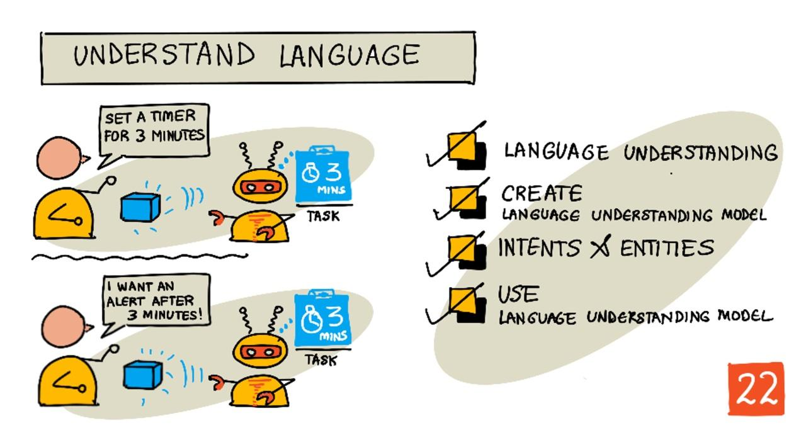

<!--
CO_OP_TRANSLATOR_METADATA:
{
  "original_hash": "6f4ba69d77f16c4a5110623a96a215c3",
  "translation_date": "2025-08-27T13:43:08+00:00",
  "source_file": "6-consumer/lessons/2-language-understanding/README.md",
  "language_code": "pa"
}
-->
# ਭਾਸ਼ਾ ਨੂੰ ਸਮਝਣਾ



> ਸਕੈਚਨੋਟ [ਨਿਤਿਆ ਨਰਸਿੰਹਨ](https://github.com/nitya) ਦੁਆਰਾ। ਵੱਡੇ ਵਰਜਨ ਲਈ ਚਿੱਤਰ 'ਤੇ ਕਲਿਕ ਕਰੋ।

## ਪਾਠ ਤੋਂ ਪਹਿਲਾਂ ਕਵਿਜ਼

[ਪਾਠ ਤੋਂ ਪਹਿਲਾਂ ਕਵਿਜ਼](https://black-meadow-040d15503.1.azurestaticapps.net/quiz/43)

## ਪਰਿਚਯ

ਪਿਛਲੇ ਪਾਠ ਵਿੱਚ ਤੁਸੀਂ ਬੋਲਣ ਨੂੰ ਲਿਖਤ ਵਿੱਚ ਬਦਲਿਆ। ਇਸਨੂੰ ਇੱਕ ਸਮਾਰਟ ਟਾਈਮਰ ਪ੍ਰੋਗਰਾਮ ਕਰਨ ਲਈ ਵਰਤਣ ਲਈ, ਤੁਹਾਡੇ ਕੋਡ ਨੂੰ ਇਹ ਸਮਝਣ ਦੀ ਲੋੜ ਹੋਵੇਗੀ ਕਿ ਕੀ ਕਿਹਾ ਗਿਆ ਸੀ। ਤੁਸੀਂ ਮੰਨ ਸਕਦੇ ਹੋ ਕਿ ਯੂਜ਼ਰ ਇੱਕ ਨਿਰਧਾਰਤ ਵਾਕ ਬੋਲਣਗੇ, ਜਿਵੇਂ ਕਿ "3 ਮਿੰਟ ਦਾ ਟਾਈਮਰ ਸੈਟ ਕਰੋ", ਅਤੇ ਉਸ ਵਾਕ ਨੂੰ ਪਾਰਸ ਕਰਕੇ ਟਾਈਮਰ ਕਿੰਨਾ ਲੰਬਾ ਹੋਣਾ ਚਾਹੀਦਾ ਹੈ, ਪਰ ਇਹ ਬਹੁਤ ਯੂਜ਼ਰ-ਫ੍ਰੈਂਡਲੀ ਨਹੀਂ ਹੈ। ਜੇਕਰ ਕੋਈ ਯੂਜ਼ਰ "3 ਮਿੰਟ ਲਈ ਟਾਈਮਰ ਸੈਟ ਕਰੋ" ਕਹਿੰਦਾ ਹੈ, ਤਾਂ ਤੁਸੀਂ ਜਾਂ ਮੈਂ ਸਮਝ ਸਕਦੇ ਹਾਂ ਕਿ ਉਹ ਕੀ ਮਤਲਬ ਰੱਖਦੇ ਹਨ, ਪਰ ਤੁਹਾਡਾ ਕੋਡ ਨਹੀਂ ਸਮਝੇਗਾ, ਕਿਉਂਕਿ ਇਹ ਨਿਰਧਾਰਤ ਵਾਕ ਦੀ ਉਮੀਦ ਕਰ ਰਿਹਾ ਹੈ।

ਇਥੇ ਭਾਸ਼ਾ ਸਮਝਣ ਦੀ ਜ਼ਰੂਰਤ ਹੁੰਦੀ ਹੈ, AI ਮਾਡਲਾਂ ਦੀ ਵਰਤੋਂ ਕਰਕੇ ਲਿਖਤ ਨੂੰ ਵਿਆਖਿਆ ਕਰਨਾ ਅਤੇ ਜ਼ਰੂਰੀ ਵੇਰਵੇ ਪ੍ਰਾਪਤ ਕਰਨਾ। ਉਦਾਹਰਨ ਲਈ, "3 ਮਿੰਟ ਦਾ ਟਾਈਮਰ ਸੈਟ ਕਰੋ" ਅਤੇ "3 ਮਿੰਟ ਲਈ ਟਾਈਮਰ ਸੈਟ ਕਰੋ" ਦੋਵੇਂ ਨੂੰ ਸਮਝਣਾ ਕਿ 3 ਮਿੰਟ ਲਈ ਟਾਈਮਰ ਦੀ ਲੋੜ ਹੈ।

ਇਸ ਪਾਠ ਵਿੱਚ ਤੁਸੀਂ ਭਾਸ਼ਾ ਸਮਝਣ ਵਾਲੇ ਮਾਡਲਾਂ ਬਾਰੇ ਸਿੱਖੋਗੇ, ਕਿਵੇਂ ਇਹ ਬਣਾਉਣੇ ਹਨ, ਕਿਵੇਂ ਇਹਨਾਂ ਨੂੰ ਟ੍ਰੇਨ ਕਰਨਾ ਹੈ, ਅਤੇ ਕਿਵੇਂ ਇਹਨਾਂ ਨੂੰ ਆਪਣੇ ਕੋਡ ਵਿੱਚ ਵਰਤਣਾ ਹੈ।

ਇਸ ਪਾਠ ਵਿੱਚ ਅਸੀਂ ਕਵਰ ਕਰਾਂਗੇ:

* [ਭਾਸ਼ਾ ਸਮਝਣਾ](../../../../../6-consumer/lessons/2-language-understanding)
* [ਭਾਸ਼ਾ ਸਮਝਣ ਵਾਲਾ ਮਾਡਲ ਬਣਾਉਣਾ](../../../../../6-consumer/lessons/2-language-understanding)
* [ਇਰਾਦੇ ਅਤੇ ਇਕਾਈਆਂ](../../../../../6-consumer/lessons/2-language-understanding)
* [ਭਾਸ਼ਾ ਸਮਝਣ ਵਾਲੇ ਮਾਡਲ ਦੀ ਵਰਤੋਂ](../../../../../6-consumer/lessons/2-language-understanding)

## ਭਾਸ਼ਾ ਸਮਝਣਾ

ਇਨਸਾਨ ਸੈਂਕੜੇ ਹਜ਼ਾਰਾਂ ਸਾਲਾਂ ਤੋਂ ਭਾਸ਼ਾ ਦੀ ਵਰਤੋਂ ਕਰਕੇ ਸੰਚਾਰ ਕਰ ਰਹੇ ਹਨ। ਅਸੀਂ ਸ਼ਬਦਾਂ, ਧੁਨੀਆਂ ਜਾਂ ਕਿਰਿਆਵਾਂ ਨਾਲ ਸੰਚਾਰ ਕਰਦੇ ਹਾਂ ਅਤੇ ਜੋ ਕਿਹਾ ਜਾਂਦਾ ਹੈ ਉਸ ਨੂੰ ਸਮਝਦੇ ਹਾਂ, ਨਾ ਸਿਰਫ਼ ਸ਼ਬਦਾਂ, ਧੁਨੀਆਂ ਜਾਂ ਕਿਰਿਆਵਾਂ ਦਾ ਅਰਥ, ਸਗੋਂ ਉਹਨਾਂ ਦਾ ਸੰਦਰਭ ਵੀ। ਅਸੀਂ ਸੱਚਾਈ ਅਤੇ ਤਨਖੇਦ ਨੂੰ ਸਮਝਦੇ ਹਾਂ, ਜਿਸ ਨਾਲ ਇੱਕੋ ਸ਼ਬਦ ਵੱਖ-ਵੱਖ ਮਤਲਬ ਰੱਖ ਸਕਦੇ ਹਨ, ਇਹ ਸਾਡੇ ਸੁਰ 'ਤੇ ਨਿਰਭਰ ਕਰਦਾ ਹੈ।

✅ ਆਪਣੇ ਹਾਲ ਹੀ ਦੇ ਕੁਝ ਗੱਲਬਾਤਾਂ ਬਾਰੇ ਸੋਚੋ। ਇਸ ਗੱਲਬਾਤ ਦਾ ਕਿੰਨਾ ਹਿੱਸਾ ਕੰਪਿਊਟਰ ਲਈ ਸਮਝਣਾ ਮੁਸ਼ਕਲ ਹੋਵੇਗਾ ਕਿਉਂਕਿ ਇਸਨੂੰ ਸੰਦਰਭ ਦੀ ਲੋੜ ਹੈ?

ਭਾਸ਼ਾ ਸਮਝਣਾ, ਜਿਸਨੂੰ ਕੁਦਰਤੀ-ਭਾਸ਼ਾ ਸਮਝਣਾ ਵੀ ਕਿਹਾ ਜਾਂਦਾ ਹੈ, ਕ੍ਰਿਤਰਿਮ ਬੁੱਧੀ ਦੇ ਇੱਕ ਖੇਤਰ ਦਾ ਹਿੱਸਾ ਹੈ ਜਿਸਨੂੰ ਕੁਦਰਤੀ-ਭਾਸ਼ਾ ਪ੍ਰੋਸੈਸਿੰਗ (ਜਾਂ NLP) ਕਿਹਾ ਜਾਂਦਾ ਹੈ, ਅਤੇ ਇਹ ਪੜ੍ਹਨ ਦੀ ਸਮਝ ਨਾਲ ਸਬੰਧਿਤ ਹੈ, ਸ਼ਬਦਾਂ ਜਾਂ ਵਾਕਾਂ ਦੇ ਵੇਰਵਿਆਂ ਨੂੰ ਸਮਝਣ ਦੀ ਕੋਸ਼ਿਸ਼ ਕਰਦਾ ਹੈ। ਜੇਕਰ ਤੁਸੀਂ Alexa ਜਾਂ Siri ਵਰਗੇ ਵਾਇਸ ਅਸਿਸਟੈਂਟ ਦੀ ਵਰਤੋਂ ਕਰਦੇ ਹੋ, ਤਾਂ ਤੁਸੀਂ ਭਾਸ਼ਾ ਸਮਝਣ ਵਾਲੀਆਂ ਸੇਵਾਵਾਂ ਦੀ ਵਰਤੋਂ ਕੀਤੀ ਹੈ। ਇਹ ਪਿੱਛੇ-ਪਿੱਛੇ ਚੱਲਣ ਵਾਲੀਆਂ AI ਸੇਵਾਵਾਂ ਹਨ ਜੋ "Alexa, Taylor Swift ਦਾ ਨਵਾਂ ਐਲਬਮ ਚਲਾਓ" ਨੂੰ ਮੇਰੀ ਧੀ ਨੂੰ ਉਸਦੇ ਮਨਪਸੰਦ ਗੀਤਾਂ 'ਤੇ ਨੱਚਣ ਵਿੱਚ ਬਦਲ ਦਿੰਦੇ ਹਨ।

> 💁 ਕੰਪਿਊਟਰ, ਸਾਰੇ ਤਰੱਕੀ ਦੇ ਬਾਵਜੂਦ, ਅਜੇ ਵੀ ਲਿਖਤ ਨੂੰ ਸੱਚਮੁੱਚ ਸਮਝਣ ਵਿੱਚ ਬਹੁਤ ਪਿੱਛੇ ਹਨ। ਜਦੋਂ ਅਸੀਂ ਕੰਪਿਊਟਰਾਂ ਨਾਲ ਭਾਸ਼ਾ ਸਮਝਣ ਦੀ ਗੱਲ ਕਰਦੇ ਹਾਂ, ਤਾਂ ਅਸੀਂ ਮਨੁੱਖੀ ਸੰਚਾਰ ਜਿਤਨਾ ਅਗਰਸਰ ਕੁਝ ਨਹੀਂ ਮੰਨਦੇ, ਸਗੋਂ ਅਸੀਂ ਕੁਝ ਸ਼ਬਦ ਲੈਣ ਅਤੇ ਮੁੱਖ ਵੇਰਵੇ ਪ੍ਰਾਪਤ ਕਰਨ ਦੀ ਗੱਲ ਕਰਦੇ ਹਾਂ।

ਇਨਸਾਨਾਂ ਵਜੋਂ, ਅਸੀਂ ਬਿਨਾਂ ਸੋਚੇ ਸਮਝੇ ਭਾਸ਼ਾ ਨੂੰ ਸਮਝਦੇ ਹਾਂ। ਜੇਕਰ ਮੈਂ ਕਿਸੇ ਹੋਰ ਇਨਸਾਨ ਨੂੰ "Taylor Swift ਦਾ ਨਵਾਂ ਐਲਬਮ ਚਲਾਓ" ਕਹਾਂ, ਤਾਂ ਉਹ ਸਵਭਾਵਿਕ ਤੌਰ 'ਤੇ ਜਾਣਦੇ ਹੋਣਗੇ ਕਿ ਮੈਂ ਕੀ ਮਤਲਬ ਰੱਖਦਾ ਹਾਂ। ਕੰਪਿਊਟਰ ਲਈ, ਇਹ ਮੁਸ਼ਕਲ ਹੈ। ਇਸਨੂੰ ਸ਼ਬਦਾਂ ਨੂੰ ਲੈਣਾ ਪਵੇਗਾ, ਜੋ ਬੋਲਣ ਤੋਂ ਲਿਖਤ ਵਿੱਚ ਬਦਲੇ ਗਏ ਹਨ, ਅਤੇ ਹੇਠਾਂ ਦਿੱਤੇ ਵੇਰਵੇ ਨੂੰ ਸਮਝਣਾ ਪਵੇਗਾ:

* ਸੰਗੀਤ ਚਲਾਉਣਾ ਹੈ
* ਸੰਗੀਤ ਕਲਾਕਾਰ Taylor Swift ਦਾ ਹੈ
* ਖਾਸ ਸੰਗੀਤ ਇੱਕ ਪੂਰਾ ਐਲਬਮ ਹੈ ਜਿਸ ਵਿੱਚ ਕਈ ਟਰੈਕ ਹਨ
* Taylor Swift ਦੇ ਕਈ ਐਲਬਮ ਹਨ, ਇਸ ਲਈ ਉਹਨਾਂ ਨੂੰ ਕ੍ਰਮਵਾਰ ਕ੍ਰਮ ਵਿੱਚ ਸਾਰਟ ਕਰਨਾ ਪਵੇਗਾ ਅਤੇ ਸਭ ਤੋਂ ਹਾਲ ਹੀ ਪ੍ਰਕਾਸ਼ਿਤ ਐਲਬਮ ਦੀ ਲੋੜ ਹੈ

✅ ਕੁਝ ਹੋਰ ਵਾਕਾਂ ਬਾਰੇ ਸੋਚੋ ਜੋ ਤੁਸੀਂ ਬੋਲਦੇ ਹੋ ਜਦੋਂ ਤੁਸੀਂ ਬੇਨਤੀ ਕਰਦੇ ਹੋ, ਜਿਵੇਂ ਕਿ ਕੌਫੀ ਮੰਗਣਾ ਜਾਂ ਕਿਸੇ ਪਰਿਵਾਰਕ ਮੈਂਬਰ ਨੂੰ ਕੁਝ ਪਾਸ ਕਰਨ ਲਈ ਕਹਿਣਾ। ਉਹਨਾਂ ਨੂੰ ਟੁਕੜਿਆਂ ਵਿੱਚ ਤੋੜਨ ਦੀ ਕੋਸ਼ਿਸ਼ ਕਰੋ ਜੋ ਕੰਪਿਊਟਰ ਨੂੰ ਵਾਕ ਨੂੰ ਸਮਝਣ ਲਈ ਪ੍ਰਾਪਤ ਕਰਨ ਦੀ ਲੋੜ ਹੋਵੇਗੀ।

ਭਾਸ਼ਾ ਸਮਝਣ ਵਾਲੇ ਮਾਡਲ AI ਮਾਡਲ ਹਨ ਜੋ ਭਾਸ਼ਾ ਤੋਂ ਕੁਝ ਵੇਰਵੇ ਪ੍ਰਾਪਤ ਕਰਨ ਲਈ ਟ੍ਰੇਨ ਕੀਤੇ ਜਾਂਦੇ ਹਨ, ਅਤੇ ਫਿਰ ਟ੍ਰਾਂਸਫਰ ਲਰਨਿੰਗ ਦੀ ਵਰਤੋਂ ਕਰਕੇ ਖਾਸ ਕੰਮਾਂ ਲਈ ਟ੍ਰੇਨ ਕੀਤੇ ਜਾਂਦੇ ਹਨ, ਜਿਵੇਂ ਕਿ ਤੁਸੀਂ ਇੱਕ ਛੋਟੇ ਸੈੱਟ ਦੀਆਂ ਚਿੱਤਰਾਂ ਦੀ ਵਰਤੋਂ ਕਰਕੇ Custom Vision ਮਾਡਲ ਟ੍ਰੇਨ ਕੀਤਾ। ਤੁਸੀਂ ਇੱਕ ਮਾਡਲ ਲੈ ਸਕਦੇ ਹੋ, ਫਿਰ ਇਸਨੂੰ ਉਸ ਲਿਖਤ ਨਾਲ ਟ੍ਰੇਨ ਕਰ ਸਕਦੇ ਹੋ ਜਿਸਨੂੰ ਤੁਸੀਂ ਸਮਝਣਾ ਚਾਹੁੰਦੇ ਹੋ।

## ਭਾਸ਼ਾ ਸਮਝਣ ਵਾਲਾ ਮਾਡਲ ਬਣਾਉਣਾ


ਤੁਸੀਂ LUIS ਦੀ ਵਰਤੋਂ ਕਰਕੇ ਭਾਸ਼ਾ ਸਮਝਣ ਵਾਲੇ ਮਾਡਲ ਬਣਾਉਣੇ ਹਨ, ਜੋ ਕਿ Microsoft ਦੀ ਇੱਕ ਭਾਸ਼ਾ ਸਮਝਣ ਵਾਲੀ ਸੇਵਾ ਹੈ ਜੋ Cognitive Services ਦਾ ਹਿੱਸਾ ਹੈ।

### ਟਾਸਕ - ਇੱਕ ਲੇਖਕ ਸਾਧਨ ਬਣਾਉਣਾ

LUIS ਦੀ ਵਰਤੋਂ ਕਰਨ ਲਈ, ਤੁਹਾਨੂੰ ਇੱਕ ਲੇਖਕ ਸਾਧਨ ਬਣਾਉਣ ਦੀ ਲੋੜ ਹੈ।

1. ਹੇਠਾਂ ਦਿੱਤੇ ਕਮਾਂਡ ਦੀ ਵਰਤੋਂ ਕਰਕੇ ਆਪਣੇ `smart-timer` ਰਿਸੋਰਸ ਗਰੁੱਪ ਵਿੱਚ ਇੱਕ ਲੇਖਕ ਸਾਧਨ ਬਣਾਓ:

    ```python
    az cognitiveservices account create --name smart-timer-luis-authoring \
                                        --resource-group smart-timer \
                                        --kind LUIS.Authoring \
                                        --sku F0 \
                                        --yes \
                                        --location <location>
    ```

    `<location>` ਨੂੰ ਉਸ ਸਥਾਨ ਨਾਲ ਬਦਲੋ ਜੋ ਤੁਸੀਂ ਰਿਸੋਰਸ ਗਰੁੱਪ ਬਣਾਉਣ ਸਮੇਂ ਵਰਤਿਆ ਸੀ।

    > ⚠️ LUIS ਸਾਰੇ ਖੇਤਰਾਂ ਵਿੱਚ ਉਪਲਬਧ ਨਹੀਂ ਹੈ, ਇਸ ਲਈ ਜੇਕਰ ਤੁਹਾਨੂੰ ਹੇਠਾਂ ਦਿੱਤਾ ਗਲਤੀ ਮਿਲੇ:
    >
    > ```output
    > InvalidApiSetId: The account type 'LUIS.Authoring' is either invalid or unavailable in given region.
    > ```
    >
    > ਤਾਂ ਇੱਕ ਵੱਖਰੇ ਖੇਤਰ ਦੀ ਚੋਣ ਕਰੋ।

    ਇਹ ਇੱਕ ਮੁਫ਼ਤ-ਟਾਇਰ LUIS ਲੇਖਕ ਸਾਧਨ ਬਣਾਏਗਾ।

### ਟਾਸਕ - ਇੱਕ ਭਾਸ਼ਾ ਸਮਝਣ ਵਾਲਾ ਐਪ ਬਣਾਉਣਾ

1. ਆਪਣੇ ਬ੍ਰਾਊਜ਼ਰ ਵਿੱਚ [luis.ai](https://luis.ai?WT.mc_id=academic-17441-jabenn) 'ਤੇ LUIS ਪੋਰਟਲ ਖੋਲ੍ਹੋ, ਅਤੇ ਉਸੇ ਖਾਤੇ ਨਾਲ ਸਾਈਨ ਇਨ ਕਰੋ ਜੋ ਤੁਸੀਂ Azure ਲਈ ਵਰਤ ਰਹੇ ਹੋ।

1. ਡਾਇਲਾਗ 'ਤੇ ਦਿੱਤੇ ਨਿਰਦੇਸ਼ਾਂ ਦੀ ਪਾਲਣਾ ਕਰੋ ਅਤੇ ਆਪਣੀ Azure ਸਬਸਕ੍ਰਿਪਸ਼ਨ ਚੁਣੋ, ਫਿਰ `smart-timer-luis-authoring` ਸਾਧਨ ਚੁਣੋ ਜੋ ਤੁਸੀਂ ਹੁਣੇ ਹੀ ਬਣਾਇਆ ਹੈ।

1. *Conversation apps* ਸੂਚੀ ਵਿੱਚੋਂ, **New app** ਬਟਨ ਚੁਣੋ ਅਤੇ ਇੱਕ ਨਵਾਂ ਐਪਲੀਕੇਸ਼ਨ ਬਣਾਓ। ਨਵੇਂ ਐਪ ਨੂੰ `smart-timer` ਨਾਮ ਦਿਓ, ਅਤੇ *Culture* ਨੂੰ ਆਪਣੀ ਭਾਸ਼ਾ 'ਤੇ ਸੈਟ ਕਰੋ।

    > 💁 ਇੱਥੇ ਇੱਕ ਪ੍ਰਡਿਕਸ਼ਨ ਸਾਧਨ ਲਈ ਖੇਤਰ ਹੈ। ਤੁਸੀਂ ਪ੍ਰਡਿਕਸ਼ਨ ਲਈ ਇੱਕ ਦੂਜਾ ਸਾਧਨ ਬਣਾਉਣ ਕਰ ਸਕਦੇ ਹੋ, ਪਰ ਮੁਫ਼ਤ ਲੇਖਕ ਸਾਧਨ ਇੱਕ ਮਹੀਨੇ ਵਿੱਚ 1,000 ਪ੍ਰਡਿਕਸ਼ਨ ਦੀ ਆਗਿਆ ਦਿੰਦਾ ਹੈ ਜੋ ਵਿਕਾਸ ਲਈ ਕਾਫ਼ੀ ਹੋਣਾ ਚਾਹੀਦਾ ਹੈ, ਇਸ ਲਈ ਤੁਸੀਂ ਇਸਨੂੰ ਖਾਲੀ ਛੱਡ ਸਕਦੇ ਹੋ।

1. ਐਪ ਬਣਾਉਣ ਤੋਂ ਬਾਅਦ ਪ੍ਰਦਰਸ਼ਿਤ ਗਾਈਡ ਨੂੰ ਪੜ੍ਹੋ ਤਾਂ ਜੋ ਤੁਸੀਂ ਸਮਝ ਸਕੋ ਕਿ ਭਾਸ਼ਾ ਸਮਝਣ ਵਾਲੇ ਮਾਡਲ ਨੂੰ ਟ੍ਰੇਨ ਕਰਨ ਲਈ ਤੁਹਾਨੂੰ ਕਿਹੜੇ ਕਦਮ ਲੈਣੇ ਹਨ। ਇਸ ਗਾਈਡ ਨੂੰ ਬੰਦ ਕਰੋ ਜਦੋਂ ਤੁਸੀਂ ਪੜ੍ਹ ਲਵੋ।

## ਇਰਾਦੇ ਅਤੇ ਇਕਾਈਆਂ

ਭਾਸ਼ਾ ਸਮਝਣਾ *ਇਰਾਦੇ* ਅਤੇ *ਇਕਾਈਆਂ* ਦੇ ਆਧਾਰ 'ਤੇ ਹੁੰਦਾ ਹੈ। ਇਰਾਦੇ ਉਹ ਹਨ ਜੋ ਸ਼ਬਦਾਂ ਦਾ ਮਕਸਦ ਹੈ, ਉਦਾਹਰਨ ਲਈ ਸੰਗੀਤ ਚਲਾਉਣਾ, ਟਾਈਮਰ ਸੈਟ ਕਰਨਾ, ਜਾਂ ਭੋਜਨ ਮੰਗਵਾਉਣਾ। ਇਕਾਈਆਂ ਉਹ ਹਨ ਜੋ ਇਰਾਦੇ ਦਾ ਹਵਾਲਾ ਦਿੰਦੇ ਹਨ, ਜਿਵੇਂ ਕਿ ਐਲਬਮ, ਟਾਈਮਰ ਦੀ ਲੰਬਾਈ, ਜਾਂ ਭੋਜਨ ਦੀ ਕਿਸਮ। ਮਾਡਲ ਦੁਆਰਾ ਵਿਆਖਿਆ ਕੀਤੇ ਗਏ ਹਰ ਵਾਕ ਵਿੱਚ ਘੱਟੋ-ਘੱਟ ਇੱਕ ਇਰਾਦਾ ਹੋਣਾ ਚਾਹੀਦਾ ਹੈ, ਅਤੇ ਵਿਕਲਪਕ ਤੌਰ 'ਤੇ ਇੱਕ ਜਾਂ ਵੱਧ ਇਕਾਈਆਂ ਹੋ ਸਕਦੀਆਂ ਹਨ।

ਕੁਝ ਉਦਾਹਰਨ:

| ਵਾਕ                                                    | ਇਰਾਦਾ            | ਇਕਾਈਆਂ                                    |
| ------------------------------------------------------- | ----------------- | ------------------------------------------ |
| "Taylor Swift ਦਾ ਨਵਾਂ ਐਲਬਮ ਚਲਾਓ"                      | *ਸੰਗੀਤ ਚਲਾਓ*     | *Taylor Swift ਦਾ ਨਵਾਂ ਐਲਬਮ*               |
| "3 ਮਿੰਟ ਦਾ ਟਾਈਮਰ ਸੈਟ ਕਰੋ"                              | *ਟਾਈਮਰ ਸੈਟ ਕਰੋ*   | *3 ਮਿੰਟ*                                   |
| "ਮੇਰਾ ਟਾਈਮਰ ਰੱਦ ਕਰੋ"                                   | *ਟਾਈਮਰ ਰੱਦ ਕਰੋ*   | ਕੋਈ ਨਹੀਂ                                  |
| "3 ਵੱਡੇ ਪਾਈਨਐਪਲ ਪੀਜ਼ਾ ਅਤੇ ਇੱਕ ਕੈਸਰ ਸਲਾਦ ਮੰਗਵਾਓ"       | *ਭੋਜਨ ਮੰਗਵਾਓ*    | *3 ਵੱਡੇ ਪਾਈਨਐਪਲ ਪੀਜ਼ਾ*, *ਕੈਸਰ ਸਲਾਦ*      |

✅ ਉਹ ਵਾਕਾਂ ਜੋ ਤੁਸੀਂ ਪਹਿਲਾਂ ਸੋਚੇ ਸਨ, ਉਹਨਾਂ ਵਿੱਚ ਇਰਾਦਾ ਅਤੇ ਕੋਈ ਵੀ ਇਕਾਈਆਂ ਕੀ ਹੋਣਗੀਆਂ?

LUIS ਨੂੰ ਟ੍ਰੇਨ ਕਰਨ ਲਈ, ਪਹਿਲਾਂ ਤੁਸੀਂ ਇਕਾਈਆਂ ਸੈਟ ਕਰਦੇ ਹੋ। ਇਹ ਨਿਰਧਾਰਤ ਸ਼ਬਦਾਂ ਦੀ ਸੂਚੀ ਹੋ ਸਕਦੀ ਹੈ, ਜਾਂ ਲਿਖਤ ਤੋਂ ਸਿੱਖੀ ਜਾ ਸਕਦੀ ਹੈ। ਉਦਾਹਰਨ ਲਈ, ਤੁਸੀਂ ਆਪਣੇ ਮੀਨੂ ਤੋਂ ਉਪਲਬਧ ਭੋਜਨ ਦੀ ਨਿਰਧਾਰਤ ਸੂਚੀ ਦੇ ਸਕਦੇ ਹੋ, ਹਰ ਸ਼ਬਦ ਦੇ ਰੂਪਾਂ (ਜਾਂ ਸਮਾਨਾਰਥਕ ਸ਼ਬਦ) ਦੇ ਨਾਲ, ਜਿਵੇਂ ਕਿ *egg plant* ਅਤੇ *aubergine* ਨੂੰ *aubergine* ਦੇ ਰੂਪਾਂ ਵਜੋਂ। LUIS ਵਿੱਚ ਪਹਿਲਾਂ ਤੋਂ ਬਣੀਆਂ ਇਕਾਈਆਂ ਵੀ ਹਨ ਜੋ ਵਰਤੀਆਂ ਜਾ ਸਕਦੀਆਂ ਹਨ, ਜਿਵੇਂ ਕਿ ਨੰਬਰ ਅਤੇ ਸਥਾਨ।

ਟਾਈਮਰ ਸੈਟ ਕਰਨ ਲਈ, ਤੁਸੀਂ ਇੱਕ ਇਕਾਈ ਨੂੰ ਨੰਬਰਾਂ ਲਈ ਪਹਿਲਾਂ ਤੋਂ ਬਣੀਆਂ ਇਕਾਈਆਂ ਦੀ ਵਰਤੋਂ ਕਰਕੇ ਸਮਾਂ ਲਈ ਰੱਖ ਸਕਦੇ ਹੋ, ਅਤੇ ਦੂਜੀ ਨੂੰ ਯੂਨਿਟ ਲਈ ਰੱਖ ਸਕਦੇ ਹੋ, ਜਿਵੇਂ ਕਿ ਮਿੰਟ ਅਤੇ ਸਕਿੰਟ। ਹਰ ਯੂਨਿਟ ਵਿੱਚ ਇੱਕ ਤੋਂ ਵੱਧ ਰੂਪ ਹੋਣਗੇ ਜੋ ਇਕਵਚਨ ਅਤੇ ਬਹੁਵਚਨ ਰੂਪਾਂ ਨੂੰ ਕਵਰ ਕਰਦੇ ਹਨ - ਜਿਵੇਂ ਕਿ ਮਿੰਟ ਅਤੇ ਮਿੰਟਾਂ।

ਜਦੋਂ ਇਕਾਈਆਂ ਨੂੰ ਪਰਿਭਾਸ਼ਿਤ ਕੀਤਾ ਜਾਂਦਾ ਹੈ, ਤਾਂ ਤੁਸੀਂ ਇਰਾਦੇ ਬਣਾਉਂਦੇ ਹੋ। ਇਹ ਮਾਡਲ ਦੁਆਰਾ ਦਿੱਤੇ ਗਏ ਉਦਾਹਰਨ ਵਾਕਾਂ ਦੇ ਆਧਾਰ 'ਤੇ ਸਿੱਖੇ ਜਾਂਦੇ ਹਨ (ਜਿਨ੍ਹਾਂ ਨੂੰ *utterances* ਕਿਹਾ ਜਾਂਦਾ ਹੈ)। ਉਦਾਹਰਨ ਲਈ, *set timer* ਇਰਾਦੇ ਲਈ, ਤੁਸੀਂ ਹੇਠਾਂ ਦਿੱਤੇ ਵਾਕਾਂ ਦੇ ਸਕਦੇ ਹੋ:

* `1 ਸਕਿੰਟ ਦਾ ਟimer ਸੈਟ ਕਰੋ`
* `1 ਮਿੰਟ ਅਤੇ 12 ਸਕਿੰਟ ਲਈ ਟimer ਸੈਟ ਕਰੋ`
* `3 ਮਿੰਟ ਲਈ ਟimer ਸੈਟ ਕਰੋ`
* `9 ਮਿੰਟ 30 ਸਕਿੰਟ ਦਾ ਟimer ਸੈਟ ਕਰੋ`

ਤੁਸੀਂ LUIS ਨੂੰ ਦੱਸਦੇ ਹੋ ਕਿ ਇਹਨਾਂ ਵਾਕਾਂ ਦੇ ਕਿਹੜੇ ਹਿੱਸੇ ਇਕਾਈਆਂ ਨਾਲ ਮੇਲ ਖਾਂਦੇ ਹਨ:


ਵਾਕ `1 ਮਿੰਟ ਅਤੇ 12 ਸਕਿੰਟ ਲਈ ਟimer ਸੈਟ ਕਰੋ` ਦਾ ਇਰਾਦਾ `set timer` ਹੈ। ਇਸ ਵਿੱਚ 2 ਇਕਾਈਆਂ ਹਨ ਜਿਨ੍ਹਾਂ ਵਿੱਚ 2 ਮੁੱਲ ਹਨ:

|            | ਸਮਾਂ | ਯੂਨਿਟ   |
| ---------- | ---: | ------ |
| 1 ਮਿੰਟ     | 1    | ਮਿੰਟ   |
| 12 ਸਕਿੰਟ   | 12   | ਸਕਿੰਟ |

ਇੱਕ ਚੰਗਾ ਮਾਡਲ ਟ੍ਰੇਨ ਕਰਨ ਲਈ, ਤੁਹਾਨੂੰ ਵੱਖ-ਵੱਖ ਉਦਾਹਰਨ ਵਾਕਾਂ ਦੀ ਲੋੜ ਹੈ ਜੋ ਕਈ ਵੱਖ-ਵੱਖ ਤਰੀਕਿਆਂ ਨੂੰ ਕਵਰ ਕਰਦੇ ਹਨ ਜਿਨ੍ਹਾਂ ਵਿੱਚ ਕੋਈ ਵਿਅਕਤੀ ਇੱਕੋ ਚੀਜ਼ ਦੀ ਬੇਨਤੀ ਕਰ ਸਕਦਾ ਹੈ।

> 💁 ਕਿਸੇ ਵੀ AI ਮਾਡਲ ਦੀ ਤਰ੍ਹਾਂ, ਜਿੰਨਾ ਜ਼ਿਆਦਾ ਡਾਟਾ ਅਤੇ ਜਿੰਨਾ ਸਹੀ ਡਾਟਾ ਤੁਸੀਂ ਟ੍ਰੇਨ ਕਰਨ ਲਈ ਵਰਤਦੇ ਹੋ, ਮਾਡਲ ਉਨਾ ਹੀ ਚੰਗਾ ਹੁੰਦਾ ਹੈ।

✅ ਉਹ ਵੱਖ-ਵੱਖ ਤਰੀਕੇ ਬਾਰੇ ਸੋਚੋ ਜਿਨ੍ਹਾਂ ਵਿੱਚ ਤੁਸੀਂ ਇੱਕੋ ਚੀਜ਼ ਦੀ ਬੇਨਤੀ ਕਰ ਸਕਦੇ ਹੋ ਅਤੇ ਇੱਕ ਇਨਸਾਨ ਤੋਂ ਸਮਝਣ ਦੀ ਉਮੀਦ ਕਰ ਸਕਦੇ ਹੋ।

### ਟਾਸਕ - ਭਾਸ਼ਾ ਸਮਝਣ ਵਾਲੇ ਮਾਡਲਾਂ ਵਿੱਚ ਇਕਾਈਆਂ ਸ਼ਾਮਲ ਕਰੋ

ਟimer ਲਈ, ਤੁਹਾਨੂੰ 2 ਇਕਾਈਆਂ ਸ਼ਾਮਲ ਕਰਨ ਦੀ ਲੋੜ ਹੈ - ਇੱਕ ਸਮਾਂ ਦੀ ਇਕਾਈ ਲਈ (ਮਿੰਟ ਜਾਂ ਸਕਿੰਟ), ਅਤੇ ਇੱਕ ਮਿੰਟ ਜਾਂ ਸਕਿੰਟ ਦੀ ਗਿਣਤੀ ਲਈ।

ਤੁਸੀਂ LUIS ਪੋਰਟਲ ਦੀ ਵਰਤੋਂ ਕਰਨ ਲਈ ਨਿਰਦੇਸ਼ Microsoft Docs 'ਤੇ [Quickstart: Build your app in LUIS portal](https://docs.microsoft.com/azure/cognitive-services/luis/luis-get-started-create-app?WT.mc_id=academic-17441-jabenn) ਵਿੱਚ ਪਾ ਸਕਦੇ ਹੋ।

1. LUIS ਪੋਰਟਲ ਤੋਂ, *Entities* ਟੈਬ ਚੁਣੋ ਅਤੇ **Add prebuilt entity** ਬਟਨ
1. *Azure Resources* ਸੈਕਸ਼ਨ ਤੋਂ, *Authoring Resource* ਚੁਣੋ, ਅਤੇ *Primary Key* ਅਤੇ *Endpoint URL* ਕਾਪੀ ਕਰੋ।

1. ਆਪਣੇ ਕਮਾਂਡ ਪ੍ਰਾਂਪਟ ਜਾਂ ਟਰਮੀਨਲ ਵਿੱਚ ਹੇਠਾਂ ਦਿੱਤਾ ਕਮਾਂਡ ਚਲਾਓ:

    ```sh
    curl "<endpoint url>/luis/prediction/v3.0/apps/<app id>/slots/staging/predict" \
          --request GET \
          --get \
          --data "subscription-key=<primary key>" \
          --data "verbose=false" \
          --data "show-all-intents=true" \
          --data-urlencode "query=<sentence>"
    ```

    `<endpoint url>` ਨੂੰ *Azure Resources* ਸੈਕਸ਼ਨ ਤੋਂ ਪ੍ਰਾਪਤ ਕੀਤੇ Endpoint URL ਨਾਲ ਬਦਲੋ।

    `<app id>` ਨੂੰ *Settings* ਸੈਕਸ਼ਨ ਤੋਂ ਪ੍ਰਾਪਤ ਕੀਤੇ App ID ਨਾਲ ਬਦਲੋ।

    `<primary key>` ਨੂੰ *Azure Resources* ਸੈਕਸ਼ਨ ਤੋਂ ਪ੍ਰਾਪਤ ਕੀਤੇ Primary Key ਨਾਲ ਬਦਲੋ।

    `<sentence>` ਨੂੰ ਉਸ ਵਾਕ ਨਾਲ ਬਦਲੋ ਜਿਸ ਨਾਲ ਤੁਸੀਂ ਟੈਸਟ ਕਰਨਾ ਚਾਹੁੰਦੇ ਹੋ।

1. ਇਸ ਕਾਲ ਦਾ ਆਉਟਪੁੱਟ ਇੱਕ JSON ਦਸਤਾਵੇਜ਼ ਹੋਵੇਗਾ ਜੋ ਕਵੈਰੀ, ਸਿਖਰਲੇ ਇਰਾਦੇ, ਅਤੇ ਕਿਸਮਾਂ ਅਨੁਸਾਰ ਤੋੜੇ ਗਏ ਇਕਾਈਆਂ ਦੀ ਸੂਚੀ ਦਾ ਵੇਰਵਾ ਦਿੰਦਾ ਹੈ।

    ```JSON
    {
        "query": "set a timer for 45 minutes and 12 seconds",
        "prediction": {
            "topIntent": "set timer",
            "intents": {
                "set timer": {
                    "score": 0.97031575
                },
                "None": {
                    "score": 0.02205793
                }
            },
            "entities": {
                "number": [
                    45,
                    12
                ],
                "time-unit": [
                    [
                        "minute"
                    ],
                    [
                        "second"
                    ]
                ]
            }
        }
    }
    ```

    ਉਪਰੋਕਤ JSON `set a timer for 45 minutes and 12 seconds` ਨਾਲ ਕਵੈਰੀ ਕਰਨ ਤੋਂ ਆਇਆ:

    * `set timer` 97% ਸੰਭਾਵਨਾ ਨਾਲ ਸਿਖਰਲਾ ਇਰਾਦਾ ਸੀ।
    * ਦੋ *number* ਇਕਾਈਆਂ ਪਛਾਣੀਆਂ ਗਈਆਂ, `45` ਅਤੇ `12`।
    * ਦੋ *time-unit* ਇਕਾਈਆਂ ਪਛਾਣੀਆਂ ਗਈਆਂ, `minute` ਅਤੇ `second`।

## ਭਾਸ਼ਾ ਸਮਝਣ ਵਾਲੇ ਮਾਡਲ ਦੀ ਵਰਤੋਂ ਕਰੋ

ਜਦੋਂ ਪ੍ਰਕਾਸ਼ਿਤ ਕੀਤਾ ਜਾਂਦਾ ਹੈ, LUIS ਮਾਡਲ ਨੂੰ ਕੋਡ ਤੋਂ ਕਾਲ ਕੀਤਾ ਜਾ ਸਕਦਾ ਹੈ। ਪਿਛਲੇ ਪਾਠਾਂ ਵਿੱਚ, ਤੁਸੀਂ IoT Hub ਦੀ ਵਰਤੋਂ ਕੀਤੀ ਹੈ ਕਲਾਉਡ ਸੇਵਾਵਾਂ ਨਾਲ ਸੰਚਾਰ ਨੂੰ ਸੰਭਾਲਣ ਲਈ, ਟੈਲੀਮੇਟਰੀ ਭੇਜਣ ਅਤੇ ਕਮਾਂਡਾਂ ਸੁਣਨ ਲਈ। ਇਹ ਬਹੁਤ ਅਸਮਰਥ ਹੈ - ਜਦੋਂ ਟੈਲੀਮੇਟਰੀ ਭੇਜੀ ਜਾਂਦੀ ਹੈ, ਤੁਹਾਡਾ ਕੋਡ ਜਵਾਬ ਦੀ ਉਡੀਕ ਨਹੀਂ ਕਰਦਾ, ਅਤੇ ਜੇ ਕਲਾਉਡ ਸੇਵਾ ਬੰਦ ਹੈ, ਤਾਂ ਤੁਹਾਨੂੰ ਪਤਾ ਨਹੀਂ ਲੱਗੇਗਾ।

ਸਮਾਰਟ ਟਾਈਮਰ ਲਈ, ਅਸੀਂ ਤੁਰੰਤ ਜਵਾਬ ਚਾਹੁੰਦੇ ਹਾਂ, ਤਾਂ ਜੋ ਅਸੀਂ ਯੂਜ਼ਰ ਨੂੰ ਦੱਸ ਸਕੀਏ ਕਿ ਟਾਈਮਰ ਸੈਟ ਕੀਤਾ ਗਿਆ ਹੈ, ਜਾਂ ਉਨ੍ਹਾਂ ਨੂੰ ਚੇਤਾਵਨੀ ਦੇ ਸਕੀਏ ਕਿ ਕਲਾਉਡ ਸੇਵਾਵਾਂ ਉਪਲਬਧ ਨਹੀਂ ਹਨ। ਇਸ ਲਈ, ਸਾਡਾ IoT ਡਿਵਾਈਸ ਸਿੱਧੇ ਇੱਕ ਵੈੱਬ ਐਂਡਪੌਇੰਟ ਨੂੰ ਕਾਲ ਕਰੇਗਾ, IoT Hub 'ਤੇ ਨਿਰਭਰ ਕਰਨ ਦੀ ਬਜਾਏ।

LUIS ਨੂੰ IoT ਡਿਵਾਈਸ ਤੋਂ ਕਾਲ ਕਰਨ ਦੀ ਬਜਾਏ, ਤੁਸੀਂ ਇੱਕ ਵੱਖਰੇ ਕਿਸਮ ਦੇ ਟ੍ਰਿਗਰ ਨਾਲ ਸਰਵਰਲੈਸ ਕੋਡ ਦੀ ਵਰਤੋਂ ਕਰ ਸਕਦੇ ਹੋ - HTTP ਟ੍ਰਿਗਰ। ਇਹ ਤੁਹਾਡੇ ਫੰਕਸ਼ਨ ਐਪ ਨੂੰ REST ਬੇਨਤੀਆਂ ਸੁਣਨ ਅਤੇ ਉਨ੍ਹਾਂ ਦਾ ਜਵਾਬ ਦੇਣ ਦੀ ਆਗਿਆ ਦਿੰਦਾ ਹੈ। ਇਹ ਫੰਕਸ਼ਨ ਤੁਹਾਡੇ ਡਿਵਾਈਸ ਦੁਆਰਾ ਕਾਲ ਕੀਤਾ ਜਾਣ ਵਾਲਾ REST ਐਂਡਪੌਇੰਟ ਹੋਵੇਗਾ।

> 💁 ਹਾਲਾਂਕਿ ਤੁਸੀਂ LUIS ਨੂੰ ਸਿੱਧੇ ਆਪਣੇ IoT ਡਿਵਾਈਸ ਤੋਂ ਕਾਲ ਕਰ ਸਕਦੇ ਹੋ, ਸਰਵਰਲੈਸ ਕੋਡ ਵਰਗੇ ਕੁਝ ਦੀ ਵਰਤੋਂ ਕਰਨਾ ਬਿਹਤਰ ਹੈ। ਇਸ ਤਰੀਕੇ ਨਾਲ ਜਦੋਂ ਤੁਸੀਂ ਕਾਲ ਕਰਨ ਲਈ LUIS ਐਪ ਨੂੰ ਬਦਲਣਾ ਚਾਹੁੰਦੇ ਹੋ, ਉਦਾਹਰਨ ਲਈ ਜਦੋਂ ਤੁਸੀਂ ਇੱਕ ਬਿਹਤਰ ਮਾਡਲ ਟ੍ਰੇਨ ਕਰਦੇ ਹੋ ਜਾਂ ਵੱਖਰੀ ਭਾਸ਼ਾ ਵਿੱਚ ਮਾਡਲ ਟ੍ਰੇਨ ਕਰਦੇ ਹੋ, ਤਾਂ ਤੁਹਾਨੂੰ ਸਿਰਫ਼ ਆਪਣੇ ਕਲਾਉਡ ਕੋਡ ਨੂੰ ਅਪਡੇਟ ਕਰਨਾ ਪਵੇਗਾ, ਸੰਭਾਵਤ ਤੌਰ 'ਤੇ ਹਜ਼ਾਰਾਂ ਜਾਂ ਮਿਲੀਅਨ IoT ਡਿਵਾਈਸਾਂ 'ਤੇ ਕੋਡ ਨੂੰ ਮੁੜ-ਤੈਨਾਤ ਕਰਨ ਦੀ ਲੋੜ ਨਹੀਂ ਹੋਵੇਗੀ।

### ਕੰਮ - ਸਰਵਰਲੈਸ ਫੰਕਸ਼ਨ ਐਪ ਬਣਾਓ

1. ਇੱਕ Azure Functions ਐਪ ਬਣਾਓ ਜਿਸਦਾ ਨਾਮ `smart-timer-trigger` ਹੋਵੇ, ਅਤੇ ਇਸਨੂੰ VS Code ਵਿੱਚ ਖੋਲ੍ਹੋ।

1. ਇਸ ਐਪ ਵਿੱਚ ਇੱਕ HTTP ਟ੍ਰਿਗਰ ਸ਼ਾਮਲ ਕਰੋ ਜਿਸਦਾ ਨਾਮ `speech-trigger` ਹੋਵੇ, ਹੇਠਾਂ ਦਿੱਤੇ ਕਮਾਂਡ ਦੀ ਵਰਤੋਂ ਕਰਕੇ ਜੋ VS Code ਟਰਮੀਨਲ ਦੇ ਅੰਦਰ ਚਲਾਇਆ ਜਾਵੇ:

    ```sh
    func new --name text-to-timer --template "HTTP trigger"
    ```

    ਇਹ ਇੱਕ HTTP ਟ੍ਰਿਗਰ ਬਣਾਏਗਾ ਜਿਸਦਾ ਨਾਮ `text-to-timer` ਹੋਵੇਗਾ।

1. HTTP ਟ੍ਰਿਗਰ ਦੀ ਜਾਂਚ ਕਰੋ ਫੰਕਸ਼ਨ ਐਪ ਚਲਾਕੇ। ਜਦੋਂ ਇਹ ਚਲਦਾ ਹੈ, ਤੁਹਾਨੂੰ ਆਉਟਪੁੱਟ ਵਿੱਚ ਐਂਡਪੌਇੰਟ ਦਿੱਤਾ ਜਾਵੇਗਾ:

    ```output
    Functions:
    
            text-to-timer: [GET,POST] http://localhost:7071/api/text-to-timer
    ```

    ਇਸਨੂੰ ਆਪਣੇ ਬ੍ਰਾਊਜ਼ਰ ਵਿੱਚ [http://localhost:7071/api/text-to-timer](http://localhost:7071/api/text-to-timer) URL ਲੋਡ ਕਰਕੇ ਜਾਂਚੋ।

    ```output
    This HTTP triggered function executed successfully. Pass a name in the query string or in the request body for a personalized response.
    ```

### ਕੰਮ - ਭਾਸ਼ਾ ਸਮਝਣ ਵਾਲੇ ਮਾਡਲ ਦੀ ਵਰਤੋਂ ਕਰੋ

1. LUIS ਲਈ SDK ਇੱਕ Pip ਪੈਕੇਜ ਰਾਹੀਂ ਉਪਲਬਧ ਹੈ। `requirements.txt` ਫਾਈਲ ਵਿੱਚ ਹੇਠਾਂ ਦਿੱਤੀ ਲਾਈਨ ਸ਼ਾਮਲ ਕਰੋ ਤਾਂ ਜੋ ਇਸ ਪੈਕੇਜ 'ਤੇ ਨਿਰਭਰਤਾ ਸ਼ਾਮਲ ਕੀਤੀ ਜਾ ਸਕੇ:

    ```sh
    azure-cognitiveservices-language-luis
    ```

1. ਯਕੀਨੀ ਬਣਾਓ ਕਿ VS Code ਟਰਮੀਨਲ ਵਿੱਚ ਵਰਚੁਅਲ ਵਾਤਾਵਰਣ ਐਕਟੀਵੇਟ ਕੀਤਾ ਗਿਆ ਹੈ, ਅਤੇ ਹੇਠਾਂ ਦਿੱਤਾ ਕਮਾਂਡ ਚਲਾਕੇ Pip ਪੈਕੇਜਾਂ ਨੂੰ ਇੰਸਟਾਲ ਕਰੋ:

    ```sh
    pip install -r requirements.txt
    ```

    > 💁 ਜੇ ਤੁਹਾਨੂੰ ਗਲਤੀਆਂ ਮਿਲਦੀਆਂ ਹਨ, ਤਾਂ ਤੁਹਾਨੂੰ ਹੇਠਾਂ ਦਿੱਤੇ ਕਮਾਂਡ ਨਾਲ pip ਨੂੰ ਅਪਗਰੇਡ ਕਰਨ ਦੀ ਲੋੜ ਹੋ ਸਕਦੀ ਹੈ:
    >
    > ```sh
    > pip install --upgrade pip
    > ```

1. `local.settings.json` ਫਾਈਲ ਵਿੱਚ ਆਪਣੇ LUIS API Key, Endpoint URL, ਅਤੇ App ID ਲਈ ਨਵੇਂ ਐਂਟਰੀ ਸ਼ਾਮਲ ਕਰੋ ਜੋ LUIS ਪੋਰਟਲ ਦੇ **MANAGE** ਟੈਬ ਤੋਂ ਪ੍ਰਾਪਤ ਕੀਤੇ ਗਏ ਹਨ:

    ```JSON
    "LUIS_KEY": "<primary key>",
    "LUIS_ENDPOINT_URL": "<endpoint url>",
    "LUIS_APP_ID": "<app id>"
    ```

    `<endpoint url>` ਨੂੰ **MANAGE** ਟੈਬ ਦੇ *Azure Resources* ਸੈਕਸ਼ਨ ਤੋਂ ਪ੍ਰਾਪਤ ਕੀਤੇ Endpoint URL ਨਾਲ ਬਦਲੋ। ਇਹ `https://<location>.api.cognitive.microsoft.com/` ਹੋਵੇਗਾ।

    `<app id>` ਨੂੰ **MANAGE** ਟੈਬ ਦੇ *Settings* ਸੈਕਸ਼ਨ ਤੋਂ ਪ੍ਰਾਪਤ ਕੀਤੇ App ID ਨਾਲ ਬਦਲੋ।

    `<primary key>` ਨੂੰ **MANAGE** ਟੈਬ ਦੇ *Azure Resources* ਸੈਕਸ਼ਨ ਤੋਂ ਪ੍ਰਾਪਤ ਕੀਤੇ Primary Key ਨਾਲ ਬਦਲੋ।

1. `__init__.py` ਫਾਈਲ ਵਿੱਚ ਹੇਠਾਂ ਦਿੱਤੇ ਇੰਪੋਰਟ ਸ਼ਾਮਲ ਕਰੋ:

    ```python
    import json
    import os
    from azure.cognitiveservices.language.luis.runtime import LUISRuntimeClient
    from msrest.authentication import CognitiveServicesCredentials
    ```

    ਇਹ ਕੁਝ ਸਿਸਟਮ ਲਾਇਬ੍ਰੇਰੀਆਂ, ਅਤੇ LUIS ਨਾਲ ਸੰਚਾਰ ਕਰਨ ਲਈ ਲਾਇਬ੍ਰੇਰੀਆਂ ਨੂੰ ਇੰਪੋਰਟ ਕਰਦਾ ਹੈ।

1. `main` ਮੈਥਡ ਦੀ ਸਮੱਗਰੀ ਨੂੰ ਮਿਟਾਓ, ਅਤੇ ਹੇਠਾਂ ਦਿੱਤਾ ਕੋਡ ਸ਼ਾਮਲ ਕਰੋ:

    ```python
    luis_key = os.environ['LUIS_KEY']
    endpoint_url = os.environ['LUIS_ENDPOINT_URL']
    app_id = os.environ['LUIS_APP_ID']
    
    credentials = CognitiveServicesCredentials(luis_key)
    client = LUISRuntimeClient(endpoint=endpoint_url, credentials=credentials)
    ```

    ਇਹ ਤੁਹਾਡੇ LUIS ਐਪ ਲਈ `local.settings.json` ਫਾਈਲ ਵਿੱਚ ਸ਼ਾਮਲ ਕੀਤੇ ਮੁੱਲਾਂ ਨੂੰ ਲੋਡ ਕਰਦਾ ਹੈ, ਤੁਹਾਡੇ API key ਨਾਲ ਇੱਕ credentials object ਬਣਾਉਂਦਾ ਹੈ, ਅਤੇ ਤੁਹਾਡੇ LUIS ਐਪ ਨਾਲ ਸੰਚਾਰ ਕਰਨ ਲਈ ਇੱਕ LUIS client object ਬਣਾਉਂਦਾ ਹੈ।

1. JSON ਵਿੱਚ `text` ਪ੍ਰਾਪਰਟੀ ਦੇ ਰੂਪ ਵਿੱਚ HTTP ਬੇਨਤੀ ਦੇ ਬਾਡੀ ਤੋਂ ਸਮਝਣ ਲਈ ਟੈਕਸਟ ਪ੍ਰਾਪਤ ਕੀਤਾ ਜਾਵੇਗਾ। ਹੇਠਾਂ ਦਿੱਤਾ ਕੋਡ `main` ਫੰਕਸ਼ਨ ਵਿੱਚ ਸ਼ਾਮਲ ਕਰੋ:

    ```python
    req_body = req.get_json()
    text = req_body['text']
    logging.info(f'Request - {text}')
    ```

1. LUIS ਤੋਂ ਪੇਸ਼ਗੂਈਆਂ JSON ਦਸਤਾਵੇਜ਼ ਭੇਜ ਕੇ ਮੰਗੀਆਂ ਜਾਂਦੀਆਂ ਹਨ। ਹੇਠਾਂ ਦਿੱਤੇ ਕੋਡ ਨਾਲ ਇਸਨੂੰ ਬਣਾਓ:

    ```python
    prediction_request = { 'query' : text }
    ```

1. ਇਹ ਬੇਨਤੀ LUIS ਨੂੰ ਭੇਜੀ ਜਾ ਸਕਦੀ ਹੈ, ਤੁਹਾਡੇ ਐਪ ਨੂੰ ਪ੍ਰਕਾਸ਼ਿਤ ਕੀਤੇ ਗਏ staging slot ਦੀ ਵਰਤੋਂ ਕਰਕੇ:

    ```python
    prediction_response = client.prediction.get_slot_prediction(app_id, 'Staging', prediction_request)
    ```

1. ਪੇਸ਼ਗੂਈ ਜਵਾਬ ਵਿੱਚ ਸਿਖਰਲਾ ਇਰਾਦਾ - ਸਭ ਤੋਂ ਉੱਚੀ ਪੇਸ਼ਗੂਈ ਸਕੋਰ ਵਾਲਾ ਇਰਾਦਾ, ਅਤੇ ਇਕਾਈਆਂ ਸ਼ਾਮਲ ਹੁੰਦੀਆਂ ਹਨ। ਜੇ ਸਿਖਰਲਾ ਇਰਾਦਾ `set timer` ਹੈ, ਤਾਂ ਇਕਾਈਆਂ ਨੂੰ ਟਾਈਮਰ ਲਈ ਲੋੜੀਂਦੇ ਸਮੇਂ ਨੂੰ ਪ੍ਰਾਪਤ ਕਰਨ ਲਈ ਪੜ੍ਹਿਆ ਜਾ ਸਕਦਾ ਹੈ:

    ```python
    if prediction_response.prediction.top_intent == 'set timer':
        numbers = prediction_response.prediction.entities['number']
        time_units = prediction_response.prediction.entities['time unit']
        total_seconds = 0
    ```

    `number` ਇਕਾਈਆਂ ਨੰਬਰਾਂ ਦੀ ਇੱਕ ਐਰੇ ਹੋਵੇਗੀ। ਉਦਾਹਰਨ ਲਈ, ਜੇ ਤੁਸੀਂ ਕਿਹਾ *"Set a four minute 17 second timer."*, ਤਾਂ `number` ਐਰੇ ਵਿੱਚ 2 ਇੰਟੀਜਰ ਹੋਣਗੇ - 4 ਅਤੇ 17।

    `time unit` ਇਕਾਈਆਂ ਸਤਰਾਂ ਦੇ ਐਰੇ ਦੀਆਂ ਐਰੇ ਹੋਣਗੀਆਂ, ਹਰ ਸਮੇਂ ਦੀ ਇਕਾਈ ਇੱਕ ਐਰੇ ਵਿੱਚ ਸਤਰਾਂ ਦੇ ਰੂਪ ਵਿੱਚ। ਉਦਾਹਰਨ ਲਈ, ਜੇ ਤੁਸੀਂ ਕਿਹਾ *"Set a four minute 17 second timer."*, ਤਾਂ `time unit` ਐਰੇ ਵਿੱਚ 2 ਐਰੇ ਹੋਣਗੀਆਂ ਜਿਨ੍ਹਾਂ ਵਿੱਚ ਹਰ ਇੱਕ ਵਿੱਚ ਇੱਕ ਮੁੱਲ ਹੋਵੇਗਾ - `['minute']` ਅਤੇ `['second']`।

    *"Set a four minute 17 second timer."* ਲਈ ਇਹ ਇਕਾਈਆਂ ਦਾ JSON ਵਰਜਨ ਹੈ:

    ```json
    {
        "number": [4, 17],
        "time unit": [
            ["minute"],
            ["second"]
        ]
    }
    ```

    ਇਹ ਕੋਡ ਸੈਕੰਡਾਂ ਵਿੱਚ ਟਾਈਮਰ ਲਈ ਕੁੱਲ ਸਮਾਂ ਦੀ ਗਿਣਤੀ ਨੂੰ ਪਰਿਭਾਸ਼ਿਤ ਕਰਦਾ ਹੈ। ਇਹ ਇਕਾਈਆਂ ਤੋਂ ਮੁੱਲਾਂ ਦੁਆਰਾ ਭਰਿਆ ਜਾਵੇਗਾ।

1. ਇਕਾਈਆਂ ਜੁੜੀਆਂ ਨਹੀਂ ਹਨ, ਪਰ ਅਸੀਂ ਕੁਝ ਅਨੁਮਾਨ ਲਗਾ ਸਕਦੇ ਹਾਂ। ਇਹ ਬੋਲਣ ਦੇ ਕ੍ਰਮ ਵਿੱਚ ਹੋਣਗੀਆਂ, ਇਸ ਲਈ ਐਰੇ ਵਿੱਚ ਸਥਿਤੀ ਨੂੰ ਵਰਤ ਕੇ ਇਹ ਪਤਾ ਲਗਾਇਆ ਜਾ ਸਕਦਾ ਹੈ ਕਿ ਕਿਹੜਾ ਨੰਬਰ ਕਿਹੜੇ ਸਮੇਂ ਦੀ ਇਕਾਈ ਨਾਲ ਮੇਲ ਖਾਂਦਾ ਹੈ। ਉਦਾਹਰਨ ਲਈ:

    * *"Set a 30 second timer"* - ਇਸ ਵਿੱਚ ਇੱਕ ਨੰਬਰ, `30`, ਅਤੇ ਇੱਕ ਸਮੇਂ ਦੀ ਇਕਾਈ, `second` ਹੋਵੇਗੀ, ਇਸ ਲਈ ਇੱਕ ਨੰਬਰ ਇੱਕ ਸਮੇਂ ਦੀ ਇਕਾਈ ਨਾਲ ਮੇਲ ਖਾਂਵੇਗਾ।
    * *"Set a 2 minute and 30 second timer"* - ਇਸ ਵਿੱਚ ਦੋ ਨੰਬਰ, `2` ਅਤੇ `30`, ਅਤੇ ਦੋ ਸਮੇਂ ਦੀਆਂ ਇਕਾਈਆਂ, `minute` ਅਤੇ `second` ਹੋਣਗੀਆਂ, ਇਸ ਲਈ ਪਹਿਲਾ ਨੰਬਰ ਪਹਿਲੀ ਸਮੇਂ ਦੀ ਇਕਾਈ ਲਈ ਹੋਵੇਗਾ (2 ਮਿੰਟ), ਅਤੇ ਦੂਜਾ ਨੰਬਰ ਦੂਜੀ ਸਮੇਂ ਦੀ ਇਕਾਈ ਲਈ (30 ਸਕਿੰਟ)।

    ਹੇਠਾਂ ਦਿੱਤਾ ਕੋਡ `if` ਬਲਾਕ ਦੇ ਅੰਦਰ ਸ਼ਾਮਲ ਕਰੋ:

    ```python
    for i in range(0, len(numbers)):
        number = numbers[i]
        time_unit = time_units[i][0]
    ```

    *"Set a four minute 17 second timer."* ਲਈ, ਇਹ ਦੋ ਵਾਰ ਲੂਪ ਕਰੇਗਾ, ਹੇਠਾਂ ਦਿੱਤੇ ਮੁੱਲਾਂ ਦੇਣਗਾ:

    | ਲੂਪ ਗਿਣਤੀ | `number` | `time_unit` |
    | ---------: | -------: | ----------- |
    | 0          | 4        | minute      |
    | 1          | 17       | second      |

1. ਇਸ ਲੂਪ ਦੇ ਅੰਦਰ, ਨੰਬਰ ਅਤੇ ਸਮੇਂ ਦੀ ਇਕਾਈ ਦੀ ਵਰਤੋਂ ਕਰਕੇ ਟਾਈਮਰ ਲਈ ਕੁੱਲ ਸਮਾਂ ਦੀ ਗਿਣਤੀ ਕਰੋ, ਹਰ ਮਿੰਟ ਲਈ 60 ਸਕਿੰਟ ਜੋੜਦੇ ਹੋਏ, ਅਤੇ ਕਿਸੇ ਵੀ ਸਕਿੰਟਾਂ ਲਈ ਨੰਬਰ ਜੋੜਦੇ ਹੋਏ।

    ```python
    if time_unit == 'minute':
        total_seconds += number * 60
    else:
        total_seconds += number
    ```

1. ਇਕਾਈਆਂ ਦੇ ਲੂਪ ਤੋਂ ਬਾਹਰ, ਟimer ਲਈ ਕੁੱਲ ਸਮਾਂ ਲੌਗ ਕਰੋ:

    ```python
    logging.info(f'Timer required for {total_seconds} seconds')
    ```

1. ਸੈਕੰਡਾਂ ਦੀ ਗਿਣਤੀ HTTP ਜਵਾਬ ਦੇ ਰੂਪ ਵਿੱਚ ਫੰਕਸ਼ਨ ਤੋਂ ਵਾਪਸ ਕੀਤੀ ਜਾਣੀ ਚਾਹੀਦੀ ਹੈ। `if` ਬਲਾਕ ਦੇ ਅੰਤ ਵਿੱਚ ਹੇਠਾਂ ਦਿੱਤਾ ਸ਼ਾਮਲ ਕਰੋ:

    ```python
    payload = {
        'seconds': total_seconds
    }
    return func.HttpResponse(json.dumps(payload), status_code=200)
    ```

    ਇਹ ਕੋਡ ਟimer ਲਈ ਕੁੱਲ ਸੈਕੰਡਾਂ ਦੀ ਗਿਣਤੀ ਵਾਲਾ payload ਬਣਾਉਂਦਾ ਹੈ, ਇਸਨੂੰ JSON ਸਤਰ ਵਿੱਚ ਬਦਲਦਾ ਹੈ ਅਤੇ ਇਸਨੂੰ HTTP ਨਤੀਜੇ ਦੇ ਰੂਪ ਵਿੱਚ 200 ਸਥਿਤੀ ਕੋਡ ਨਾਲ ਵਾਪਸ ਕਰਦਾ ਹੈ, ਜਿਸਦਾ ਮਤਲਬ ਹੈ ਕਿ ਕਾਲ ਸਫਲ ਹੋਈ।

1. ਅੰਤ ਵਿੱਚ, ਜੇ ਇਰਾਦਾ ਪਛਾਣਿਆ ਨਹੀਂ ਗਿਆ, ਤਾਂ ਗਲਤੀ ਕੋਡ ਵਾਪਸ ਕਰਨ ਲਈ `if` ਬਲਾਕ ਦੇ ਬਾਹਰ ਹੇਠਾਂ ਦਿੱਤਾ ਸ਼ਾਮਲ ਕਰੋ:

    ```python
    return func.HttpResponse(status_code=404)
    ```

    404 *not found* ਲਈ ਸਥਿਤੀ ਕੋਡ ਹੈ।

1. ਫੰਕਸ਼ਨ ਐਪ ਚਲਾਓ ਅਤੇ ਇਸਨੂੰ curl ਦੀ ਵਰਤੋਂ ਕਰਕੇ ਜਾਂਚੋ।

    ```sh
    curl --request POST 'http://localhost:7071/api/text-to-timer' \
         --header 'Content-Type: application/json' \
         --include \
         --data '{"text":"<text>"}'
    ```

    `<text>` ਨੂੰ ਤੁਹਾਡੇ ਬੇਨਤੀ ਦੇ ਟੈਕਸਟ ਨਾਲ ਬਦਲੋ, ਉਦਾਹਰਨ ਲਈ `set a 2 minutes 27 second timer`।

    ਤੁਹਾਨੂੰ ਫੰਕਸ਼ਨ ਐਪ ਤੋਂ ਹੇਠਾਂ ਦਿੱਤਾ ਆਉਟਪੁੱਟ ਮਿਲੇਗਾ:

    ```output
    Functions:

            text-to-timer: [GET,POST] http://localhost:7071/api/text-to-timer
    
    For detailed output, run func with --verbose flag.
    [2021-06-26T19:45:14.502Z] Worker process started and initialized.
    [2021-06-26T19:45:19.338Z] Host lock lease acquired by instance ID '000000000000000000000000951CAE4E'.
    [2021-06-26T19:45:52.059Z] Executing 'Functions.text-to-timer' (Reason='This function was programmatically called via the host APIs.', Id=f68bfb90-30e4-47a5-99da-126b66218e81)
    [2021-06-26T19:45:53.577Z] Timer required for 147 seconds
    [2021-06-26T19:45:53.746Z] Executed 'Functions.text-to-timer' (Succeeded, Id=f68bfb90-30e4-47a5-99da-126b66218e81, Duration=1750ms)
    ```

    curl ਨੂੰ ਕਾਲ ਕਰਨ ਦਾ ਨਤੀਜਾ ਹੇਠਾਂ ਦਿੱਤਾ ਜਾਵੇਗਾ:

    ```output
    HTTP/1.1 200 OK
    Date: Tue, 29 Jun 2021 01:14:11 GMT
    Content-Type: text/plain; charset=utf-8
    Server: Kestrel
    Transfer-Encoding: chunked
    
    {"seconds": 147}
    ```

    `"seconds"` ਮੁੱਲ ਵਿੱਚ ਟimer ਲਈ ਸੈਕੰਡਾਂ ਦੀ ਗਿਣਤੀ ਹੈ।

> 💁 ਤੁਸੀਂ ਇਸ ਕੋਡ ਨੂੰ [code/functions](../../../../../6-consumer/lessons/2-language-understanding/code/functions) ਫੋਲਡਰ ਵਿੱਚ ਪਾ ਸਕਦੇ ਹੋ।

### ਕੰਮ - ਆਪਣੇ ਫੰਕਸ਼ਨ ਨੂੰ ਆਪਣੇ IoT ਡਿਵਾਈਸ ਲਈ ਉਪਲਬਧ ਬਣਾਓ

1. ਤੁਹਾਡੇ IoT ਡਿਵਾਈਸ ਨੂੰ ਤੁਹਾਡੇ REST ਐਂਡਪੌਇੰਟ ਨੂੰ ਕਾਲ ਕਰਨ ਲਈ URL ਦੀ ਜਾਣਕਾਰੀ ਹੋਣੀ ਚਾਹੀਦੀ ਹੈ। ਜਦੋਂ ਤੁਸੀਂ ਇਸਨੂੰ ਪਹਿਲਾਂ ਐਕਸੈਸ ਕੀਤਾ, ਤਾਂ ਤੁਸੀਂ `localhost` ਦੀ ਵਰਤੋਂ ਕੀਤੀ, ਜੋ ਤੁਹਾਡੇ ਸਥਾਨਕ ਮਸ਼ੀਨ 'ਤੇ REST ਐਂਡਪੌਇੰਟ ਨੂੰ ਐਕਸੈਸ ਕਰਨ ਲਈ ਇੱਕ ਸ਼ਾਰਟਕਟ ਹੈ। ਆਪਣੇ IoT ਡਿਵਾਈਸ ਨੂੰ ਐਕਸੈਸ ਕਰਨ ਦੀ ਆਗਿਆ ਦੇਣ ਲਈ, ਤੁਹਾਨੂੰ ਜਾਂ ਤਾਂ ਕਲਾਉਡ ਵਿੱਚ ਪ੍ਰਕਾਸ਼ਿਤ ਕਰਨਾ ਪਵੇਗਾ, ਜਾਂ ਸਥਾਨਕ ਤੌਰ 'ਤੇ ਐਕਸੈਸ ਕਰਨ ਲਈ ਆਪਣਾ IP ਪਤਾ ਪ੍ਰਾਪਤ ਕਰਨਾ ਪਵੇਗਾ।

    > ⚠️ ਜੇ ਤੁਸੀਂ Wio Terminal ਦੀ ਵਰਤੋਂ ਕਰ ਰਹੇ ਹੋ, ਤਾਂ ਫੰਕਸ਼ਨ ਐਪ ਨੂੰ ਸਥਾਨਕ ਤੌਰ 'ਤੇ ਚਲਾਉਣਾ ਆਸਾਨ ਹੈ, ਕਿਉਂਕਿ ਲਾਇਬ੍ਰੇਰੀਆਂ 'ਤੇ ਨਿਰਭਰਤਾ ਹੋਵੇਗੀ ਜਿਸਦਾ ਮਤਲਬ ਹੈ ਕਿ ਤੁਸੀਂ ਪਹਿਲਾਂ ਦੀ ਤਰ੍ਹਾਂ ਫੰਕਸ਼ਨ ਐਪ ਨੂੰ ਤੈਨਾਤ ਨਹੀਂ ਕਰ ਸਕਦੇ। ਫੰਕਸ਼ਨ ਐਪ ਨੂੰ ਸਥਾਨਕ ਤੌਰ 'ਤੇ ਚਲਾਓ ਅਤੇ ਇਸਨੂੰ ਆਪਣੇ ਕੰਪਿਊਟਰ ਦੇ IP ਪਤੇ ਰਾਹੀਂ ਐਕਸੈਸ ਕਰੋ। ਜੇ ਤੁਸੀਂ ਕਲਾਉਡ ਵਿੱਚ ਤੈਨਾਤ ਕਰਨਾ ਚਾਹੁੰਦੇ ਹੋ, ਤਾਂ ਇਸਦੇ ਲਈ ਜਾਣਕਾਰੀ ਅਗਲੇ ਪਾਠ ਵਿੱਚ ਦਿੱਤੀ ਜਾਵੇਗੀ।

    * Functions ਐਪ ਨੂੰ ਪ੍ਰਕਾਸ਼ਿਤ ਕਰੋ - ਆਪਣੀ Functions ਐਪ ਨੂੰ ਕਲਾਉਡ ਵਿੱਚ ਪ੍ਰਕਾਸ਼ਿਤ ਕਰਨ ਲਈ ਪਹਿਲਾਂ ਦੇ ਪਾਠਾਂ ਵਿੱਚ ਦਿੱਤੇ ਨਿਰਦੇਸ਼ਾਂ ਦੀ ਪਾਲਣਾ ਕਰੋ। ਜਦੋਂ ਪ੍ਰਕਾਸ਼ਿਤ ਕੀਤਾ ਜਾਂਦਾ ਹੈ, URL `https://<APP_NAME>.azurewebsites.net/api/text-to-timer` ਹੋਵੇਗਾ, ਜਿੱਥੇ `<APP_NAME>` ਤੁਹਾਡੇ Functions ਐਪ ਦਾ ਨਾਮ ਹੋਵੇਗਾ। ਯਕੀਨੀ ਬਣਾਓ ਕਿ ਆਪਣੀਆਂ ਸਥਾਨਕ ਸੈਟਿੰਗਾਂ ਨੂੰ ਵੀ ਪ੍ਰਕਾਸ਼ਿਤ ਕਰੋ।

      HTTP ਟ੍ਰਿਗਰ ਨਾਲ ਕੰਮ ਕਰਦੇ ਸਮੇਂ, ਇਹ ਡਿਫਾਲਟ ਤੌਰ 'ਤੇ ਇੱਕ ਫੰਕਸ਼ਨ ਐਪ key ਨਾਲ ਸੁਰੱਖਿਅਤ ਹੁੰਦੇ ਹਨ। ਇਸ key ਨੂੰ ਪ੍ਰਾਪਤ ਕਰਨ ਲਈ ਹੇਠਾਂ ਦਿੱਤਾ ਕਮਾਂਡ ਚਲਾਓ:

      ```sh
      az functionapp keys list --resource-group smart-timer \
                               --name <APP_NAME>                               
      ```

      `functionKeys` ਸੈਕਸ਼ਨ ਤੋਂ `default` ਐਂਟਰੀ ਦਾ ਮੁੱਲ ਕਾਪੀ ਕਰੋ।

      ```output
      {
        "functionKeys": {
          "default": "sQO1LQaeK9N1qYD6SXeb/TctCmwQEkToLJU6Dw8TthNeUH8VA45hlA=="
        },
        "masterKey": "RSKOAIlyvvQEQt9dfpabJT018scaLpQu9p1poHIMCxx5LYrIQZyQ/g==",
        "systemKeys": {}
      }
      ```

      ਇਹ key URL ਵਿੱਚ ਇੱਕ ਕਵੈਰੀ ਪੈਰਾਮੀਟਰ ਦੇ ਰੂਪ ਵਿੱਚ ਸ਼ਾਮਲ ਕੀਤੀ ਜਾਣੀ ਚਾਹੀਦੀ ਹੈ, ਇਸ ਲਈ ਅੰਤਮ URL `https://<APP_NAME>.azurewebsites.net/api/text-to-timer?code=<FUNCTION_KEY>` ਹੋਵੇਗਾ, ਜਿੱਥੇ `<APP

:7071/api/text-to-timer`, ਜਿੱਥੇ `<IP_ADDRESS>` ਤੁਹਾਡਾ IP ਐਡਰੈੱਸ ਹੋਵੇਗਾ, ਉਦਾਹਰਨ ਲਈ `http://192.168.1.10:7071/api/text-to-timer`.

      > 💁 ਧਿਆਨ ਦਿਓ ਕਿ ਇਹ ਪੋਰਟ 7071 ਵਰਤਦਾ ਹੈ, ਇਸ ਲਈ IP ਐਡਰੈੱਸ ਤੋਂ ਬਾਅਦ ਤੁਹਾਨੂੰ `:7071` ਲਗਾਉਣਾ ਪਵੇਗਾ।

      > 💁 ਇਹ ਸਿਰਫ਼ ਤਦ ਹੀ ਕੰਮ ਕਰੇਗਾ ਜੇ ਤੁਹਾਡਾ IoT ਡਿਵਾਈਸ ਤੁਹਾਡੇ ਕੰਪਿਊਟਰ ਦੇ ਇੱਕੋ ਜਿਹੇ ਨੈਟਵਰਕ 'ਤੇ ਹੋਵੇ।

1. ਇਸ ਐਂਡਪੌਇੰਟ ਨੂੰ curl ਦੀ ਵਰਤੋਂ ਕਰਕੇ ਟੈਸਟ ਕਰੋ।

---

## 🚀 ਚੁਣੌਤੀ

ਇੱਕ ਹੀ ਚੀਜ਼ ਦੀ ਬੇਨਤੀ ਕਰਨ ਦੇ ਕਈ ਤਰੀਕੇ ਹਨ, ਜਿਵੇਂ ਕਿ ਟਾਈਮਰ ਸੈਟ ਕਰਨਾ। ਇਸ ਬਾਰੇ ਵੱਖ-ਵੱਖ ਤਰੀਕੇ ਸੋਚੋ ਅਤੇ ਉਨ੍ਹਾਂ ਨੂੰ ਆਪਣੇ LUIS ਐਪ ਵਿੱਚ ਉਦਾਹਰਨ ਵਜੋਂ ਵਰਤੋ। ਇਨ੍ਹਾਂ ਨੂੰ ਟੈਸਟ ਕਰੋ, ਇਹ ਦੇਖਣ ਲਈ ਕਿ ਤੁਹਾਡਾ ਮਾਡਲ ਕਿੰਨਾ ਚੰਗਾ ਹੈ ਵੱਖ-ਵੱਖ ਤਰੀਕਿਆਂ ਨਾਲ ਟਾਈਮਰ ਦੀ ਬੇਨਤੀ ਨੂੰ ਸਮਝਣ ਵਿੱਚ।

## ਲੈਕਚਰ ਬਾਅਦ ਕਵਿਜ਼

[ਲੈਕਚਰ ਬਾਅਦ ਕਵਿਜ਼](https://black-meadow-040d15503.1.azurestaticapps.net/quiz/44)

## ਸਮੀਖਿਆ ਅਤੇ ਸਵੈ ਅਧਿਐਨ

* LUIS ਅਤੇ ਇਸ ਦੀਆਂ ਸਮਰੱਥਾਵਾਂ ਬਾਰੇ ਹੋਰ ਪੜ੍ਹੋ [Microsoft Docs 'ਤੇ Language Understanding (LUIS) ਦਸਤਾਵੇਜ਼ੀ ਪੰਨਾ](https://docs.microsoft.com/azure/cognitive-services/luis/?WT.mc_id=academic-17441-jabenn) 'ਤੇ।
* ਭਾਸ਼ਾ ਸਮਝਣ ਬਾਰੇ ਹੋਰ ਪੜ੍ਹੋ [Wikipedia 'ਤੇ natural-language understanding ਪੰਨਾ](https://wikipedia.org/wiki/Natural-language_understanding) 'ਤੇ।
* HTTP ਟ੍ਰਿਗਰ ਬਾਰੇ ਹੋਰ ਪੜ੍ਹੋ [Microsoft Docs 'ਤੇ Azure Functions HTTP trigger ਦਸਤਾਵੇਜ਼ੀ](https://docs.microsoft.com/azure/azure-functions/functions-bindings-http-webhook-trigger?WT.mc_id=academic-17441-jabenn&tabs=python) 'ਤੇ।

## ਅਸਾਈਨਮੈਂਟ

[ਟਾਈਮਰ ਰੱਦ ਕਰੋ](assignment.md)

---

**ਅਸਵੀਕਾਰਨਾ**:  
ਇਹ ਦਸਤਾਵੇਜ਼ AI ਅਨੁਵਾਦ ਸੇਵਾ [Co-op Translator](https://github.com/Azure/co-op-translator) ਦੀ ਵਰਤੋਂ ਕਰਕੇ ਅਨੁਵਾਦ ਕੀਤਾ ਗਿਆ ਹੈ। ਜਦੋਂ ਕਿ ਅਸੀਂ ਸਹੀਤਾ ਲਈ ਯਤਨਸ਼ੀਲ ਹਾਂ, ਕਿਰਪਾ ਕਰਕੇ ਧਿਆਨ ਦਿਓ ਕਿ ਸਵੈਚਾਲਿਤ ਅਨੁਵਾਦਾਂ ਵਿੱਚ ਗਲਤੀਆਂ ਜਾਂ ਅਸੁਚੀਤਤਾਵਾਂ ਹੋ ਸਕਦੀਆਂ ਹਨ। ਮੂਲ ਦਸਤਾਵੇਜ਼ ਨੂੰ ਇਸਦੀ ਮੂਲ ਭਾਸ਼ਾ ਵਿੱਚ ਅਧਿਕਾਰਤ ਸਰੋਤ ਮੰਨਿਆ ਜਾਣਾ ਚਾਹੀਦਾ ਹੈ। ਮਹੱਤਵਪੂਰਨ ਜਾਣਕਾਰੀ ਲਈ, ਪੇਸ਼ੇਵਰ ਮਨੁੱਖੀ ਅਨੁਵਾਦ ਦੀ ਸਿਫਾਰਸ਼ ਕੀਤੀ ਜਾਂਦੀ ਹੈ। ਇਸ ਅਨੁਵਾਦ ਦੀ ਵਰਤੋਂ ਤੋਂ ਪੈਦਾ ਹੋਣ ਵਾਲੇ ਕਿਸੇ ਵੀ ਗਲਤਫਹਿਮੀ ਜਾਂ ਗਲਤ ਵਿਆਖਿਆ ਲਈ ਅਸੀਂ ਜ਼ਿੰਮੇਵਾਰ ਨਹੀਂ ਹਾਂ।