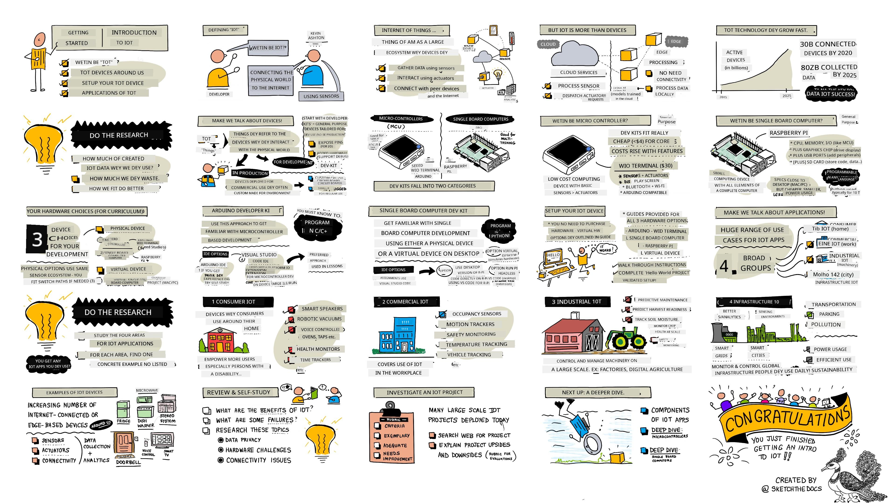
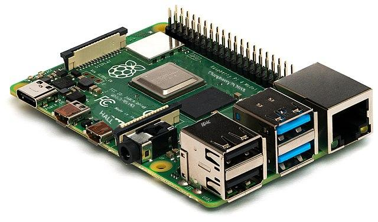

<!--
CO_OP_TRANSLATOR_METADATA:
{
  "original_hash": "9bae08314d8487cb76ddf3d8797e1544",
  "translation_date": "2025-11-18T18:33:20+00:00",
  "source_file": "1-getting-started/lessons/1-introduction-to-iot/README.md",
  "language_code": "pcm"
}
-->
# Introduction to IoT

> Sketchnote by [Nitya Narasimhan](https://github.com/nitya). Click the image for a larger version.

Dis lesson na part of di [Hello IoT series](https://youtube.com/playlist?list=PLmsFUfdnGr3xRts0TIwyaHyQuHaNQcb6-) wey Microsoft Reactor teach. Di lesson get two videos - one na 1 hour lesson, di oda na 1 hour office hour wey go deep inside di lesson and answer questions.

> 🎥 Click di images above to watch di videos

## Pre-lecture quiz

[Pre-lecture quiz](https://black-meadow-040d15503.1.azurestaticapps.net/quiz/1)

## Introduction

Dis lesson go talk about di basics of Internet of Things (IoT), and e go help you set up your hardware.

For dis lesson, we go cover:

* [Wetin be 'Internet of Things'?](../../../../../1-getting-started/lessons/1-introduction-to-iot)
* [IoT devices](../../../../../1-getting-started/lessons/1-introduction-to-iot)
* [Set up your device](../../../../../1-getting-started/lessons/1-introduction-to-iot)
* [Applications of IoT](../../../../../1-getting-started/lessons/1-introduction-to-iot)
* [Examples of IoT devices wey fit dey around you](../../../../../1-getting-started/lessons/1-introduction-to-iot)

## Wetin be 'Internet of Things'?

Di name 'Internet of Things' na [Kevin Ashton](https://wikipedia.org/wiki/Kevin_Ashton) give am for 1999, to describe how Internet fit connect to di physical world through sensors. Since dat time, di name don dey use for any device wey dey interact with di physical world, either by collecting data from sensors or doing real-world actions through actuators (like turning on switch or lighting LED), wey dey connect to oda devices or Internet.

> **Sensors** dey collect info from di world, like speed, temperature or location.
>
> **Actuators** dey change electrical signals to real-world actions like turning on light, making sound, or sending control signals to oda hardware, like to turn on power socket.

IoT no be only about devices - e dey include cloud services wey fit process sensor data or send requests to actuators wey dey connect to IoT devices. E also dey include devices wey no need Internet connection, wey dem dey call edge devices. Dis devices fit process and respond to sensor data by demself, usually using AI models wey dem train for cloud.

IoT na one fast-growing technology. By di end of 2020, dem estimate say 30 billion IoT devices don dey connect to Internet. By 2025, dem dey expect say IoT devices go dey collect almost 80 zettabytes of data (80 trillion gigabytes). Dat na plenty data!

✅ Do small research: How much of di data wey IoT devices dey generate dem dey use, and how much dem dey waste? Why dem dey ignore plenty data?

Dis data na di key to IoT success. To sabi IoT well, you need to understand di data wey you need, how to collect am, how to make decisions with am, and how to use di decisions to interact with di physical world if e dey necessary.

## IoT devices

Di **T** for IoT mean **Things** - devices wey dey interact with di physical world either by collecting data from sensors or doing real-world actions through actuators.

Devices wey dem dey use for production or commercial purposes, like fitness trackers or industrial machine controllers, na custom-made. Dem dey use custom circuit boards, processors, and design wey fit di task, whether e small enough to wear for hand or rugged enough for factory environment.

As developer wey dey learn IoT or dey create prototype, you go need developer kit. Dis na general-purpose IoT devices wey developers fit use, with features wey production devices no go get, like external pins to connect sensors or actuators, debugging hardware, or extra resources wey go add cost for large manufacturing.

Developer kits dey two types - microcontrollers and single-board computers. We go introduce dem here, and talk more for di next lesson.

> 💁 Your phone fit be general-purpose IoT device too, with sensors and actuators inside, wey different apps dey use in different ways with cloud services. Some IoT tutorials dey use phone app as IoT device.

### Microcontrollers

Microcontroller (MCU - microcontroller unit) na small computer wey get:

🧠 One or more CPUs - di 'brain' wey dey run your program

💾 Memory (RAM and program memory) - where your program, data and variables dey

🔌 Programmable input/output (I/O) connections - to connect external devices like sensors and actuators

Microcontrollers dey cheap, with average price around US$0.50, and some as low as US$0.03. Developer kits fit start from US$4, and di [Wio Terminal](https://www.seeedstudio.com/Wio-Terminal-p-4509.html) from [Seeed studios](https://www.seeedstudio.com) wey get sensors, actuators, WiFi and screen dey cost around US$30.

> 💁 If you dey search for microcontrollers online, no use **MCU** because e go show plenty Marvel Cinematic Universe results instead of microcontrollers.

Microcontrollers dey program to do specific tasks, no be general-purpose computers like PC or Mac. You no fit connect monitor, keyboard and mouse to use dem for general tasks.

Developer kits dey come with sensors and actuators onboard. Most boards get LEDs wey you fit program, and standard plugs to add more sensors or actuators. Some microcontrollers get wireless connectivity like Bluetooth or WiFi.

> 💁 Microcontrollers dey program with C/C++.

### Single-board computers

Single-board computer na small computer wey get all di parts of complete computer for one small board. E dey like desktop or laptop PC/Mac, but e small, dey use less power, and cheap.

Raspberry Pi na one of di most popular single-board computers.

Like microcontroller, single-board computers get CPU, memory and I/O pins, but e get extra features like graphics chip for monitor, audio output, USB ports for keyboard, mouse, webcam or storage. Programs dey store for SD cards or hard drives with operating system.

> 🎓 You fit think of single-board computer as smaller, cheaper version of di PC/Mac wey you dey use now, with GPIO pins to connect sensors and actuators.

Single-board computers na full computers, so you fit program dem with any language. IoT devices dey usually program with Python.

### Hardware choices for di rest of di lessons

Di next lessons go use IoT device to interact with di physical world and cloud. Each lesson go support 3 device choices - Arduino (Seeed Studios Wio Terminal), single-board computer (Raspberry Pi 4), or virtual single-board computer wey dey run for your PC/Mac.

You fit read about di hardware wey you need for di assignments for [hardware guide](../../../hardware.md).

> 💁 You no need buy IoT hardware to do di assignments, you fit use virtual single-board computer.

Which hardware you go choose depend on wetin you get for house or school, and di programming language wey you sabi or wan learn. Both hardware go use di same sensor ecosystem, so you fit switch without replacing most of di kit. Virtual single-board computer go be like Raspberry Pi, and di code go work for Pi if you later get device and sensors.

### Arduino developer kit

If you wan learn microcontroller development, you fit use Arduino device for di assignments. You go need basic understanding of C/C++ programming, as di lessons go only teach code wey dey relevant to Arduino framework, sensors, actuators, and cloud libraries.

Di assignments go use [Visual Studio Code](https://code.visualstudio.com/?WT.mc_id=academic-17441-jabenn) with [PlatformIO extension for microcontroller development](https://platformio.org). If you sabi Arduino IDE, you fit use am, but instructions no go dey.

### Single-board computer developer kit

If you wan learn IoT development with single-board computers, you fit use Raspberry Pi or virtual device for di assignments.

You go need basic understanding of Python programming, as di lessons go only teach code wey dey relevant to sensors, actuators, and cloud libraries.

> 💁 If you wan learn Python, check dis two video series:
>
> * [Python for beginners](https://channel9.msdn.com/Series/Intro-to-Python-Development?WT.mc_id=academic-17441-jabenn)
> * [More Python for beginners](https://channel9.msdn.com/Series/More-Python-for-Beginners?WT.mc_id=academic-7372-jabenn)

Di assignments go use [Visual Studio Code](https://code.visualstudio.com/?WT.mc_id=academic-17441-jabenn).

If you dey use Raspberry Pi, you fit run am with full desktop Raspberry Pi OS and code directly on di Pi using [Raspberry Pi OS version of VS Code](https://code.visualstudio.com/docs/setup/raspberry-pi?WT.mc_id=academic-17441-jabenn), or run am as headless device and code from your PC/Mac using VS Code with [Remote SSH extension](https://code.visualstudio.com/docs/remote/ssh?WT.mc_id=academic-17441-jabenn).

If you dey use virtual device, you go code directly on your computer. Instead of sensors and actuators, you go use tool to simulate hardware, define sensor values, and show actuator results on screen.

## Set up your device

Before you start programming your IoT device, you go need small setup. Follow di instructions wey match di device wey you dey use.

> 💁 If you never get device, check [hardware guide](../../../hardware.md) to decide which device you go use, and wetin you need buy. You no need buy hardware, as all di projects fit run on virtual hardware.

Dis instructions get links to third-party websites from di hardware or tool creators. Dis na to make sure you dey use di latest instructions for di tools and hardware.
Make sure say you follow di guide wey go help you set up your device and finish one 'Hello World' project. Dis na di first step to create one IoT nightlight for di 4 lessons wey dey dis getting started part.

* [Arduino - Wio Terminal](wio-terminal.md)
* [Single-board computer - Raspberry Pi](pi.md)
* [Single-board computer - Virtual device](virtual-device.md)

✅ You go dey use VS Code for both Arduino and Single-board computers. If you never use am before, read more about am for di [VS Code site](https://code.visualstudio.com?WT.mc_id=academic-17441-jabenn)

## Applications of IoT

IoT dey cover plenty use cases, across some big groups:

* Consumer IoT
* Commercial IoT
* Industrial IoT
* Infrastructure IoT

✅ Do small research: For each area wey dem describe below, find one example wey dem no mention for di text.

### Consumer IoT

Consumer IoT na di IoT devices wey people go buy use for house. Some of di devices dey very useful, like smart speakers, smart heating systems and robotic vacuum cleaners. Others dey somehow, like voice-controlled taps wey go make am hard to turn off di tap because di voice control no fit hear you over di sound of di water wey dey run.

Consumer IoT devices dey help people do more for dia environment, especially di 1 billion people wey get disability. Robotic vacuum cleaners fit help people wey no fit dey clean floor by demself, voice-controlled ovens dey allow people wey get limited vision or motor control to heat dia oven with only dia voice, health monitors dey help patients monitor dia chronic conditions with more regular and detailed updates. Dis devices don dey everywhere so tey even small pikin dey use dem for dia daily life, like students wey dey do virtual schooling during di COVID pandemic dey set timer for smart home devices to track dia schoolwork or alarms to remind dem of class meetings.

✅ Wetin be di consumer IoT devices wey you get for your body or house?

### Commercial IoT

Commercial IoT na di IoT wey dem dey use for work place. For office, dem fit get sensors wey dey check how many people dey di place and motion detectors to manage light and heating so dem go only dey on when people dey dia, e go help reduce cost and carbon emissions. For factory, IoT devices fit dey monitor safety hazards like workers wey no wear hard hats or noise wey don reach dangerous level. For retail, IoT devices fit dey measure di temperature of cold storage, alert di shop owner if fridge or freezer no dey di correct temperature range, or dem fit dey monitor items for shelf to direct workers to refill produce wey don finish. Transport industry dey use IoT more and more to monitor vehicle location, track mileage for road user charging, track driver hours and break compliance, or notify staff when vehicle dey near depot to prepare for loading or unloading.

✅ Wetin be di commercial IoT devices wey dey your school or workplace?

### Industrial IoT (IIoT)

Industrial IoT, or IIoT, na di use of IoT devices to control and manage big machinery. Dis one dey cover plenty use cases, from factories to digital agriculture.

Factories dey use IoT devices in different ways. Machines fit dey monitored with sensors to track things like temperature, vibration and rotation speed. Di data fit dey monitored to stop di machine if e no dey work well - like if e dey too hot, dem go shut am down. Di data fit also dey analyzed over time to do predictive maintenance, where AI models go look di data wey dey lead to failure, and use am predict other failures before dem happen.

Digital agriculture dey important to help feed di growing population, especially di 2 billion people wey dey 500 million households wey dey do [subsistence farming](https://wikipedia.org/wiki/Subsistence_agriculture). Digital agriculture fit range from small sensors wey cheap to big commercial setups. Farmers fit start by monitoring temperature and using [growing degree days](https://wikipedia.org/wiki/Growing_degree-day) to predict when crop go ready for harvest. Dem fit connect soil moisture monitoring to automated watering systems to give plants di water wey dem need, but no waste water. Farmers dey even use drones, satellite data and AI to monitor crop growth, disease and soil quality for big farmland.

✅ Wetin be di other IoT devices wey fit help farmers?

### Infrastructure IoT

Infrastructure IoT na di monitoring and controlling of di local and global infrastructure wey people dey use everyday.

[Smart Cities](https://wikipedia.org/wiki/Smart_city) na urban areas wey dey use IoT devices to gather data about di city and use am improve how di city dey run. Dis cities dey usually run with collaboration between local government, academia and local businesses, tracking and managing things like transport, parking and pollution. For example, for Copenhagen, Denmark, air pollution dey important to di people, so dem dey measure am and use di data to provide information on di cleanest cycling and jogging routes.

[Smart power grids](https://wikipedia.org/wiki/Smart_grid) dey allow better analytics of power demand by gathering usage data for individual homes. Dis data fit guide decisions for country level like where to build new power stations, and for personal level by giving users insight into how dem dey use power, when dem dey use am, and even suggestions on how to reduce cost, like charging electric cars for night.

✅ If you fit add IoT devices to measure anything for where you dey live, wetin e go be?

## Examples of IoT devices wey fit dey around you

You go surprise how many IoT devices dey around you. As I dey write dis one for house, I get di following devices wey connect to Internet with smart features like app control, voice control, or di ability to send data to me via my phone:

* Plenty smart speakers
* Fridge, dishwasher, oven and microwave
* Electricity monitor for solar panels
* Smart plugs
* Video doorbell and security cameras
* Smart thermostat with plenty smart room sensors
* Garage door opener
* Home entertainment systems and voice-controlled TVs
* Lights
* Fitness and health trackers

All dis devices get sensors and/or actuators and dey talk to Internet. I fit check from my phone if my garage door dey open, and ask my smart speaker to close am for me. I fit even set timer so if e still dey open for night, e go close automatically. When my doorbell ring, I fit see from my phone who dey dia anywhere I dey for di world, and talk to dem via speaker and microphone wey dey di doorbell. I fit monitor my blood glucose, heart rate and sleep patterns, dey look for patterns for di data to improve my health. I fit control my lights via di cloud, and sit for dark if my Internet connection go down.

---

## 🚀 Challenge

List as many IoT devices as you fit wey dey your house, school or workplace - e fit plenty pass wetin you think!

## Post-lecture quiz

[Post-lecture quiz](https://black-meadow-040d15503.1.azurestaticapps.net/quiz/2)

## Review & Self Study

Read about di benefits and problems of consumer IoT projects. Check news sites for articles about when e don go wrong, like privacy issues, hardware problems or problems wey dey caused by lack of connectivity.

Some examples:

* Check di Twitter account **[Internet of Sh*t](https://twitter.com/internetofshit)** *(profanity warning)* for some good examples of problems with consumer IoT.
* [c|net - My Apple Watch saved my life: 5 people share their stories](https://www.cnet.com/news/apple-watch-lifesaving-health-features-read-5-peoples-stories/)
* [c|net - ADT technician pleads guilty to spying on customer camera feeds for years](https://www.cnet.com/news/adt-home-security-technician-pleads-guilty-to-spying-on-customer-camera-feeds-for-years/) *(trigger warning - non-consensual voyeurism)*

## Assignment

[Investigate an IoT project](assignment.md)

---

<!-- CO-OP TRANSLATOR DISCLAIMER START -->
**Disclaimer**:  
Dis dokyument don use AI transle-shon service [Co-op Translator](https://github.com/Azure/co-op-translator) do di transle-shon. Even as we dey try make am accurate, abeg make you sabi say transle-shon wey machine do fit get mistake or no dey correct well. Di original dokyument for im native language na di one wey you go take as di correct source. For important mata, e good make you use professional human transle-shon. We no go fit take blame for any misunderstanding or wrong interpretation wey fit happen because you use dis transle-shon.
<!-- CO-OP TRANSLATOR DISCLAIMER END -->