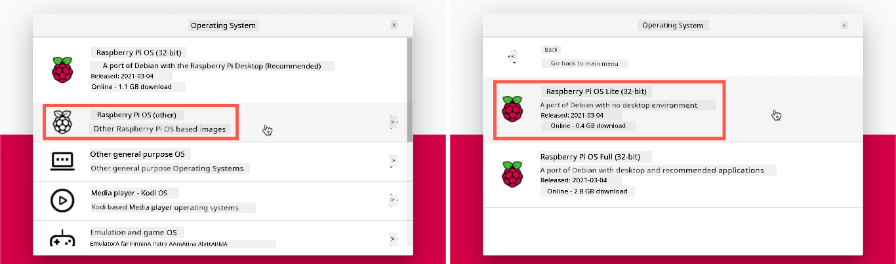
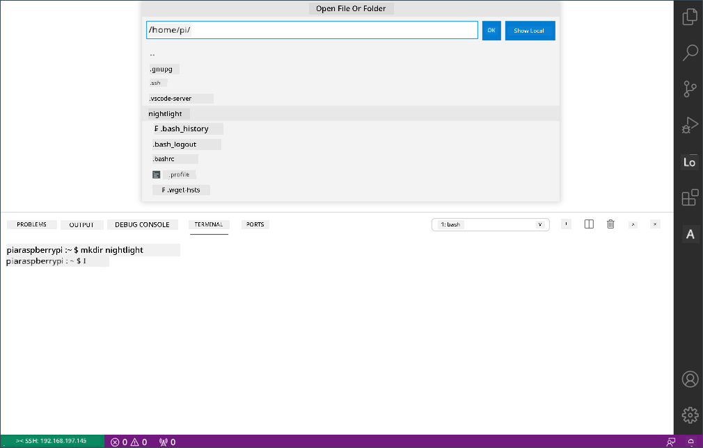

<!--
CO_OP_TRANSLATOR_METADATA:
{
  "original_hash": "8ff0d0a1d29832bb896b9c103b69a452",
  "translation_date": "2025-11-18T18:31:16+00:00",
  "source_file": "1-getting-started/lessons/1-introduction-to-iot/pi.md",
  "language_code": "pcm"
}
-->
# Raspberry Pi

[Raspberry Pi](https://raspberrypi.org) na one small computer wey dey one board. You fit add sensors and actuators join am using plenty different devices and ecosystems, and for dis lessons we go use one hardware ecosystem wey dem dey call [Grove](https://www.seeedstudio.com/category/Grove-c-1003.html). You go write code for your Pi and use Python take access the Grove sensors.


## Setup

If you dey use Raspberry Pi as your IoT hardware, you get two options - you fit do all dis lessons and write code directly for the Pi, or you fit connect am remotely to one 'headless' Pi and write code from your computer.

Before you start, you go need connect the Grove Base Hat to your Pi.

### Task - setup

Install the Grove base hat for your Pi and configure the Pi

1. Connect the Grove base hat to your Pi. The socket for the hat go cover all the GPIO pins for the Pi, e go slide go down the pins well well make e sit tight for the base. E go dey on top the Pi, cover am.

    

1. Decide how you wan program your Pi, then go the section wey match your choice:

    * [Work directly on your Pi](../../../../../1-getting-started/lessons/1-introduction-to-iot)
    * [Remote access to code the Pi](../../../../../1-getting-started/lessons/1-introduction-to-iot)

### Work directly on your Pi

If you wan work directly for your Pi, you fit use the desktop version of Raspberry Pi OS and install all the tools wey you need.

#### Task - work directly on your Pi

Set up your Pi for development.

1. Follow the instructions for the [Raspberry Pi setup guide](https://projects.raspberrypi.org/en/projects/raspberry-pi-setting-up) to set up your Pi, connect am to keyboard/mouse/monitor, connect am to your WiFi or ethernet network, and update the software.

To program the Pi using the Grove sensors and actuators, you go need install one editor wey go allow you write the device code, and some libraries and tools wey go work with the Grove hardware.

1. After your Pi don reboot, open the Terminal by clicking the **Terminal** icon for the top menu bar, or choose *Menu -> Accessories -> Terminal*

1. Run dis command to make sure say the OS and software wey dey installed dey up to date:

    ```sh
    sudo apt update && sudo apt full-upgrade --yes
    ```

1. Run dis commands to install all the libraries wey you need for the Grove hardware:

    ```sh
    sudo apt install git python3-dev python3-pip --yes

    git clone https://github.com/Seeed-Studio/grove.py
    cd grove.py
    sudo pip3 install .

    sudo raspi-config nonint do_i2c 0
    ```

    Dis one go first install Git, plus Pip wey you go use install Python packages.

    One strong feature wey Python get na say you fit install [Pip packages](https://pypi.org) - dis na code wey other people don write and put for Internet. You fit install one Pip package for your computer with one command, then use am for your code.

    The Seeed Grove Python packages need make you install am from source. Dis commands go clone the repo wey get the source code for dis package, then install am locally.

    > 💁 Normally, when you install one package e go dey available everywhere for your computer, but dis fit cause wahala with package versions - like one application wey need one version of package wey go break if you install new version for another application. To avoid dis wahala, you fit use [Python virtual environment](https://docs.python.org/3/library/venv.html), wey be like copy of Python for one folder, and when you install Pip packages dem go dey only for dat folder. But for dis Pi setup, you no go use virtual environments. The Grove install script go install the Grove Python packages globally, so if you wan use virtual environment, you go need set am up then manually re-install the Grove packages inside dat environment. E dey easier to just use global packages, especially as plenty Pi developers dey re-flash clean SD card for each project.

    Finally, dis go enable the I<sup>2</sup>C interface.

1. Reboot the Pi either by using the menu or running dis command for the Terminal:

    ```sh
    sudo reboot
    ```

1. After the Pi don reboot, open the Terminal again and run dis command to install [Visual Studio Code (VS Code)](https://code.visualstudio.com?WT.mc_id=academic-17441-jabenn) - dis na the editor wey you go use write your device code for Python.

    ```sh
    sudo apt install code
    ```

    After you don install am, VS Code go dey available for the top menu.

    > 💁 You fit use any Python IDE or editor for dis lessons if you get one wey you like, but the lessons go dey based on VS Code.

1. Install Pylance. Dis na extension for VS Code wey dey provide Python language support. Check the [Pylance extension documentation](https://marketplace.visualstudio.com/items?WT.mc_id=academic-17441-jabenn&itemName=ms-python.vscode-pylance) for instructions on how to install dis extension for VS Code.

### Remote access to code the Pi

Instead of coding directly for the Pi, e fit run 'headless', wey mean say e no go connect to keyboard/mouse/monitor, and you go configure and code am from your computer, using Visual Studio Code.

#### Set up the Pi OS

To code remotely, the Pi OS need dey installed for one SD Card.

##### Task - set up the Pi OS

Set up the headless Pi OS.

1. Download the **Raspberry Pi Imager** from the [Raspberry Pi OS software page](https://www.raspberrypi.org/software/) and install am

1. Put one SD card inside your computer, use adapter if e dey necessary

1. Open the Raspberry Pi Imager

1. For the Raspberry Pi Imager, click the **CHOOSE OS** button, then select *Raspberry Pi OS (Other)*, followed by *Raspberry Pi OS Lite (32-bit)*

    

    > 💁 Raspberry Pi OS Lite na version of Raspberry Pi OS wey no get desktop UI or UI based tools. You no need dis ones for headless Pi and e go make the install small and boot up time fast.

1. Click the **CHOOSE STORAGE** button, then select your SD card

1. Open the **Advanced Options** by pressing `Ctrl+Shift+X`. Dis options go allow you pre-configure the Raspberry Pi OS before e go dey written to the SD card.

    1. Check the **Enable SSH** check box, and set password for the `pi` user. Dis na the password wey you go use log in to the Pi later.

    1. If you wan connect the Pi over WiFi, check the **Configure WiFi** check box, and enter your WiFi SSID and password, plus select your WiFi country. You no need do dis if you go use ethernet cable. Make sure say the network wey you connect to na the same one wey your computer dey.

    1. Check the **Set locale settings** check box, and set your country and timezone

    1. Click the **SAVE** button

1. Click the **WRITE** button to write the OS to the SD card. If you dey use macOS, e go ask you to enter your password because the tool wey dey write disk images need privileged access.

The OS go dey written to the SD card, and when e finish the card go eject by the OS, and e go notify you. Remove the SD card from your computer, put am inside the Pi, power up the Pi and wait like 2 mins make e boot well.

#### Connect to the Pi

The next step na to access the Pi remotely. You fit do dis using `ssh`, wey dey available for macOS, Linux and recent Windows versions.

##### Task - connect to the Pi

Access the Pi remotely.

1. Open Terminal or Command Prompt, and enter dis command to connect to the Pi:

    ```sh
    ssh pi@raspberrypi.local
    ```

    If you dey use Windows wey no get `ssh` installed, you fit use OpenSSH. You fit find the installation instructions for the [OpenSSH installation documentation](https://docs.microsoft.com//windows-server/administration/openssh/openssh_install_firstuse?WT.mc_id=academic-17441-jabenn).

1. Dis go connect to your Pi and ask for the password.

    To find computers for your network using `<hostname>.local` na new feature for Linux and Windows. If you dey use Linux or Windows and you see error say Hostname no dey found, you go need install extra software to enable ZeroConf networking (Apple dey call am Bonjour):

    1. If you dey use Linux, install Avahi using dis command:

        ```sh
        sudo apt-get install avahi-daemon
        ```

    1. If you dey use Windows, the easiest way to enable ZeroConf na to install [Bonjour Print Services for Windows](http://support.apple.com/kb/DL999). You fit also install [iTunes for Windows](https://www.apple.com/itunes/download/) to get newer version of the utility (wey no dey available standalone).

    > 💁 If you no fit connect using `raspberrypi.local`, you fit use the IP address of your Pi. Check the [Raspberry Pi IP address documentation](https://www.raspberrypi.org/documentation/remote-access/ip-address.md) for instructions on different ways to get the IP address.

1. Enter the password wey you set for the Raspberry Pi Imager Advanced Options

#### Configure software on the Pi

After you don connect to the Pi, you go need make sure say the OS dey up to date, and install some libraries and tools wey go work with the Grove hardware.

##### Task - configure software on the Pi

Configure the installed Pi software and install the Grove libraries.

1. From your `ssh` session, run dis command to update then reboot the Pi:

    ```sh
    sudo apt update && sudo apt full-upgrade --yes && sudo reboot
    ```

    The Pi go update and reboot. The `ssh` session go end when the Pi reboot, so leave am for like 30 seconds then reconnect.

1. From the reconnected `ssh` session, run dis commands to install all the libraries wey you need for the Grove hardware:

    ```sh
    sudo apt install git python3-dev python3-pip --yes

    git clone https://github.com/Seeed-Studio/grove.py
    cd grove.py
    sudo pip3 install .

    sudo raspi-config nonint do_i2c 0
    ```

    Dis one go first install Git, plus Pip wey you go use install Python packages.

    One strong feature wey Python get na say you fit install [Pip packages](https://pypi.org) - dis na code wey other people don write and put for Internet. You fit install one Pip package for your computer with one command, then use am for your code.

    The Seeed Grove Python packages need make you install am from source. Dis commands go clone the repo wey get the source code for dis package, then install am locally.

    > 💁 Normally, when you install one package e go dey available everywhere for your computer, but dis fit cause wahala with package versions - like one application wey need one version of package wey go break if you install new version for another application. To avoid dis wahala, you fit use [Python virtual environment](https://docs.python.org/3/library/venv.html), wey be like copy of Python for one folder, and when you install Pip packages dem go dey only for dat folder. But for dis Pi setup, you no go use virtual environments. The Grove install script go install the Grove Python packages globally, so if you wan use virtual environment, you go need set am up then manually re-install the Grove packages inside dat environment. E dey easier to just use global packages, especially as plenty Pi developers dey re-flash clean SD card for each project.

    Finally, dis go enable the I<sup>2</sup>C interface.

1. Reboot the Pi by running dis command:

    ```sh
    sudo reboot
    ```

    The `ssh` session go end when the Pi reboot. You no need reconnect.

#### Configure VS Code for remote access

After the Pi don configure, you fit connect to am using Visual Studio Code (VS Code) from your computer - dis na free developer text editor wey you go use write your device code for Python.

##### Task - configure VS Code for remote access

Install the software wey you need and connect remotely to your Pi.

1. Install VS Code for your computer by following the [VS Code documentation](https://code.visualstudio.com?WT.mc_id=academic-17441-jabenn)

1. Follow the instructions for the [VS Code Remote Development using SSH documentation](https://code.visualstudio.com/docs/remote/ssh?WT.mc_id=academic-17441-jabenn) to install the components wey you need

1. Follow the same instructions, connect VS Code to the Pi
1. Once you don connect, follow di [managing extensions](https://code.visualstudio.com/docs/remote/ssh#_managing-extensions?WT.mc_id=academic-17441-jabenn) instructions to install di [Pylance extension](https://marketplace.visualstudio.com/items?WT.mc_id=academic-17441-jabenn&itemName=ms-python.vscode-pylance) for di Pi.

## Hello world

E dey normal wen person dey start wit new programming language or technology to create 'Hello World' app - one small app wey go show text like `"Hello World"` to confirm say all di tools dey set well.

Di Hello World app for di Pi go make sure say Python and Visual Studio Code dey install well.

Dis app go dey inside one folder wey dem call `nightlight`, and we go use am again wit different code for di later parts of dis assignment to build di nightlight app.

### Task - hello world

Make di Hello World app.

1. Open VS Code, either directly for di Pi, or for your computer wey don connect to di Pi wit di Remote SSH extension.

1. Open di VS Code Terminal by selecting *Terminal -> New Terminal, or pressing `` CTRL+` ``. E go open for di `pi` user home directory.

1. Run di commands wey dey below to create one directory for your code, and create one Python file wey dem call `app.py` inside di directory:

    ```sh
    mkdir nightlight
    cd nightlight
    touch app.py
    ```

1. Open dis folder for VS Code by selecting *File -> Open...* and selecting di *nightlight* folder, then select **OK**

    

1. Open di `app.py` file from di VS Code explorer and add di code wey dey below:

    ```python
    print('Hello World!')
    ```

    Di `print` function dey print anything wey dem pass give am for di console.

1. From di VS Code Terminal, run di command wey dey below to run your Python app:

    ```sh
    python app.py
    ```

    > 💁 You fit need to call `python3` directly to run dis code if Python 2 dey your system join Python 3 (di latest version). If Python 2 dey your system, calling `python` go use Python 2 instead of Python 3. Normally, di latest Raspberry Pi OS versions dey only get Python 3.

    Di output wey dey below go show for di terminal:

    ```output
    pi@raspberrypi:~/nightlight $ python3 app.py
    Hello World!
    ```

> 💁 You fit find dis code for di [code/pi](../../../../../1-getting-started/lessons/1-introduction-to-iot/code/pi) folder.

😀 Your 'Hello World' program don work well!

---

<!-- CO-OP TRANSLATOR DISCLAIMER START -->
**Disclaimer**:  
Dis dokyument don use AI transleshion service [Co-op Translator](https://github.com/Azure/co-op-translator) do di transleshion. Even as we dey try make am accurate, abeg make you sabi say machine transleshion fit get mistake or no dey correct well. Di original dokyument wey dey for im native language na di one wey you go take as di correct source. For important mata, e good make professional human transleshion dey use. We no go fit take blame for any misunderstanding or wrong interpretation wey fit happen because you use dis transleshion.
<!-- CO-OP TRANSLATOR DISCLAIMER END -->