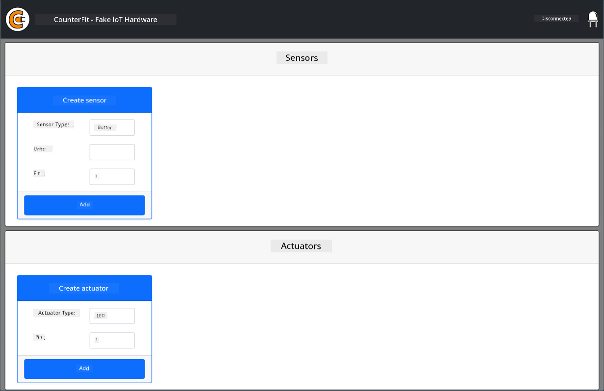
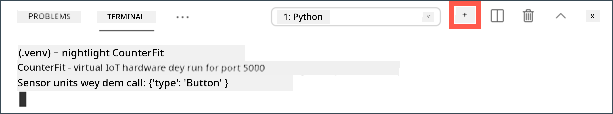

<!--
CO_OP_TRANSLATOR_METADATA:
{
  "original_hash": "52b4de6144b2efdced7797a5339d6035",
  "translation_date": "2025-11-18T18:32:44+00:00",
  "source_file": "1-getting-started/lessons/1-introduction-to-iot/virtual-device.md",
  "language_code": "pcm"
}
-->
# Virtual single-board computer

Instead of to buy IoT device, plus sensors and actuators, you fit use your computer take do simulation for IoT hardware. The [CounterFit project](https://github.com/CounterFit-IoT/CounterFit) go allow you run app for your computer wey go simulate IoT hardware like sensors and actuators, and you fit access the sensors and actuators from Python code wey you write for your computer, same way you go write am for Raspberry Pi wey dey use physical hardware.

## Setup

To use CounterFit, you go need install some free software for your computer.

### Task

Install the software wey you need.

1. Install Python. Check the [Python downloads page](https://www.python.org/downloads/) for how you go fit install the latest version of Python.

1. Install Visual Studio Code (VS Code). Na this editor you go use write your virtual device code for Python. Check the [VS Code documentation](https://code.visualstudio.com?WT.mc_id=academic-17441-jabenn) for how you go fit install VS Code.

    > 💁 You fit use any Python IDE or editor wey you like for these lessons if you get one wey you prefer, but the lessons go dey base on how to use VS Code.

1. Install the VS Code Pylance extension. Na extension for VS Code wey dey provide Python language support. Check the [Pylance extension documentation](https://marketplace.visualstudio.com/items?WT.mc_id=academic-17441-jabenn&itemName=ms-python.vscode-pylance) for how you go fit install this extension for VS Code.

The instructions to install and configure the CounterFit app go dey for the assignment instructions when e reach time to install am, as e dey installed per project.

## Hello world

E dey normal when you dey start new programming language or technology to create 'Hello World' application - small app wey go show text like `"Hello World"` to confirm say all the tools dey work well.

The Hello World app for the virtual IoT hardware go make sure say you don install Python and Visual Studio Code well. E go also connect to CounterFit for the virtual IoT sensors and actuators. E no go use any hardware, e go just connect to show say everything dey work.

This app go dey inside folder wey dem call `nightlight`, and e go dey reused with different code for later parts of this assignment to build the nightlight application.

### Configure Python virtual environment

One better thing wey Python get na the ability to install [Pip packages](https://pypi.org) - these na packages of code wey other people don write and put for Internet. You fit install Pip package for your computer with one command, then use the package for your code. You go use Pip install package wey go help you talk to CounterFit.

Normally, when you install package, e go dey available everywhere for your computer, and this fit cause wahala with package versions - like one app wey need one version of package wey go break if you install new version for another app. To avoid this wahala, you fit use [Python virtual environment](https://docs.python.org/3/library/venv.html), wey be like copy of Python for one folder, and when you install Pip packages, dem go dey only for that folder.

> 💁 If you dey use Raspberry Pi, you no go set up virtual environment for that device to manage Pip packages, instead you go dey use global packages, as the Grove packages dey installed globally by the installer script.

#### Task - configure Python virtual environment

Set up Python virtual environment and install the Pip packages for CounterFit.

1. From your terminal or command line, run this command for any location wey you choose to create and enter new directory:

    ```sh
    mkdir nightlight
    cd nightlight
    ```

1. Run this command to create virtual environment for `.venv` folder:

    ```sh
    python3 -m venv .venv
    ```

    > 💁 You need to call `python3` directly to create the virtual environment in case you get Python 2 installed along with Python 3 (the latest version). If you get Python 2 installed, calling `python` go use Python 2 instead of Python 3.

1. Activate the virtual environment:

    * For Windows:
        * If you dey use Command Prompt, or Command Prompt through Windows Terminal, run:

            ```cmd
            .venv\Scripts\activate.bat
            ```

        * If you dey use PowerShell, run:

            ```powershell
            .\.venv\Scripts\Activate.ps1
            ```

            > If you see error wey talk say running scripts dey disabled for this system, you go need enable running scripts by setting correct execution policy. You fit do this by opening PowerShell as administrator, then run this command:

            ```powershell
            Set-ExecutionPolicy -ExecutionPolicy Unrestricted
            ```

            Enter `Y` when dem ask you to confirm. Then open PowerShell again and try am.

            You fit reset this execution policy later if you need. You fit read more about this for [Execution Policies page on Microsoft Docs](https://docs.microsoft.com/powershell/module/microsoft.powershell.core/about/about_execution_policies?WT.mc_id=academic-17441-jabenn).

    * For macOS or Linux, run:

        ```cmd
        source ./.venv/bin/activate
        ```

    > 💁 Make sure say you run these commands from the same location wey you run the command to create the virtual environment. You no go ever need enter the `.venv` folder, you go always run the activate command and any commands to install packages or run code from the folder wey you dey when you create the virtual environment.

1. Once you don activate the virtual environment, the default `python` command go run the version of Python wey dem use create the virtual environment. Run this command to check the version:

    ```sh
    python --version
    ```

    The output go show this:

    ```output
    (.venv) ➜  nightlight python --version
    Python 3.9.1
    ```

    > 💁 Your Python version fit dey different - as long as e be version 3.6 or higher, you dey okay. If not, delete this folder, install newer version of Python and try again.

1. Run these commands to install the Pip packages for CounterFit. These packages include the main CounterFit app plus shims for Grove hardware. These shims go allow you write code as if you dey program physical sensors and actuators from the Grove ecosystem but connected to virtual IoT devices.

    ```sh
    pip install CounterFit
    pip install counterfit-connection
    pip install counterfit-shims-grove
    ```

    These pip packages go dey installed only for the virtual environment, and dem no go dey available outside.

### Write the code

Once the Python virtual environment don ready, you fit write the code for the 'Hello World' application.

#### Task - write the code

Create Python app wey go print `"Hello World"` for the console.

1. From your terminal or command line, run this command inside the virtual environment to create Python file wey dem call `app.py`:

    * For Windows run:

        ```cmd
        type nul > app.py
        ```

    * For macOS or Linux, run:

        ```cmd
        touch app.py
        ```

1. Open the current folder for VS Code:

    ```sh
    code .
    ```

    > 💁 If your terminal talk say `command not found` for macOS, e mean say VS Code never dey added to your PATH. You fit add VS Code to your PATH by following the instructions for [Launching from the command line section of the VS Code documentation](https://code.visualstudio.com/docs/setup/mac?WT.mc_id=academic-17441-jabenn#_launching-from-the-command-line) and run the command again. VS Code dey added to your PATH by default for Windows and Linux.

1. When VS Code open, e go activate the Python virtual environment. The selected virtual environment go show for the bottom status bar:

    

1. If the VS Code Terminal dey already open when VS Code start, e no go activate the virtual environment for the terminal. The easiest way na to kill the terminal using the **Kill the active terminal instance** button:

    

    You fit know if the terminal don activate the virtual environment as the name of the virtual environment go dey as prefix for the terminal prompt. For example, e fit be:

    ```sh
    (.venv) ➜  nightlight
    ```

    If `.venv` no dey as prefix for the prompt, e mean say the virtual environment no dey active for the terminal.

1. Open new VS Code Terminal by selecting *Terminal -> New Terminal*, or press `` CTRL+` ``. The new terminal go load the virtual environment, and the call to activate am go show for the terminal. The prompt go also get the name of the virtual environment (`.venv`):

    ```output
    ➜  nightlight source .venv/bin/activate
    (.venv) ➜  nightlight 
    ```

1. Open the `app.py` file from the VS Code explorer and add this code:

    ```python
    print('Hello World!')
    ```

    The `print` function go print anything wey you pass to am for the console.

1. From the VS Code terminal, run this command to run your Python app:

    ```sh
    python app.py
    ```

    The output go show this:

    ```output
    (.venv) ➜  nightlight python app.py 
    Hello World!
    ```

😀 Your 'Hello World' program don work!

### Connect the 'hardware'

As second 'Hello World' step, you go run the CounterFit app and connect your code to am. This na the virtual way to plug IoT hardware to dev kit.

#### Task - connect the 'hardware'

1. From the VS Code terminal, start the CounterFit app with this command:

    ```sh
    counterfit
    ```

    The app go start to run and open for your web browser:

    

    E go show as *Disconnected*, with the LED for the top-right corner off.

1. Add this code to the top of `app.py`:

    ```python
    from counterfit_connection import CounterFitConnection
    CounterFitConnection.init('127.0.0.1', 5000)
    ```

    This code go import the `CounterFitConnection` class from the `counterfit_connection` module, wey come from the `counterfit-connection` pip package wey you don install before. E go then initialize connection to the CounterFit app wey dey run for `127.0.0.1`, wey be IP address wey you fit always use to access your computer (dem dey call am *localhost*), for port 5000.

    > 💁 If you get other apps wey dey run for port 5000, you fit change am by updating the port for the code, and run CounterFit using `CounterFit --port <port_number>`, replace `<port_number>` with the port wey you wan use.

1. You go need open new VS Code terminal by selecting the **Create a new integrated terminal** button. This na because the CounterFit app dey run for the current terminal.

    

1. For this new terminal, run the `app.py` file like before. The status of CounterFit go change to **Connected** and the LED go light up.

    

> 💁 You fit find this code for the [code/virtual-device](../../../../../1-getting-started/lessons/1-introduction-to-iot/code/virtual-device) folder.

😀 Your connection to the hardware don work!

---

<!-- CO-OP TRANSLATOR DISCLAIMER START -->
**Disclaimer**:  
Dis dokyument don use AI transleshion service [Co-op Translator](https://github.com/Azure/co-op-translator) do di transleshion. Even as we dey try make am correct, abeg make you sabi say transleshion wey machine do fit get mistake or no dey accurate well. Di original dokyument for im native language na di one wey you go take as di correct source. For important mata, e good make you use professional human transleshion. We no go fit take blame for any misunderstanding or wrong interpretation wey fit happen because you use dis transleshion.
<!-- CO-OP TRANSLATOR DISCLAIMER END -->