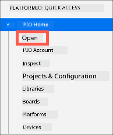
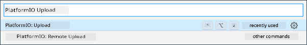
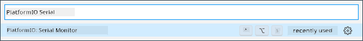

<!--
CO_OP_TRANSLATOR_METADATA:
{
  "original_hash": "a4f0c166010e31fd7b6ca20bc88dec6d",
  "translation_date": "2025-11-18T18:35:40+00:00",
  "source_file": "1-getting-started/lessons/1-introduction-to-iot/wio-terminal.md",
  "language_code": "pcm"
}
-->
# Wio Terminal

Di [Wio Terminal wey Seeed Studios make](https://www.seeedstudio.com/Wio-Terminal-p-4509.html) na Arduino-compatible microcontroller, wey get WiFi, some sensors, and actuators wey dem don already put inside. E still get ports wey you fit use add more sensors and actuators, using one hardware ecosystem wey dem dey call [Grove](https://www.seeedstudio.com/category/Grove-c-1003.html).


## Setup

To use di Wio Terminal, you go need install some free software for your computer. You go also need update di Wio Terminal firmware before you fit connect am to WiFi.

### Task - setup

Install di software wey you need and update di firmware.

1. Install Visual Studio Code (VS Code). Na di editor wey you go use write your device code for C/C++. Check di [VS Code documentation](https://code.visualstudio.com?WT.mc_id=academic-17441-jabenn) to see how you fit install VS Code.

    > 💁 Another IDE wey people dey use for Arduino development na di [Arduino IDE](https://www.arduino.cc/en/software). If you sabi use dis tool already, you fit use am instead of VS Code and PlatformIO, but di lessons go dey based on how to use VS Code.

1. Install di VS Code PlatformIO extension. Dis extension dey support programming microcontrollers for C/C++. Check di [PlatformIO extension documentation](https://marketplace.visualstudio.com/items?WT.mc_id=academic-17441-jabenn&itemName=platformio.platformio-ide) to see how you fit install dis extension for VS Code. Dis extension dey depend on di Microsoft C/C++ extension to work with C and C++ code, and di C/C++ extension go install automatically when you install PlatformIO.

1. Connect your Wio Terminal to your computer. Di Wio Terminal get USB-C port for di bottom, and you go need connect am to one USB port for your computer. Di Wio Terminal dey come with USB-C to USB-A cable, but if your computer only get USB-C ports, you go need USB-C cable or USB-A to USB-C adapter.

1. Follow di instructions for di [Wio Terminal Wiki WiFi Overview documentation](https://wiki.seeedstudio.com/Wio-Terminal-Network-Overview/) to setup your Wio Terminal and update di firmware.

## Hello world

E dey normal when you dey start with new programming language or technology to create one 'Hello World' app - one small app wey go show text like `"Hello World"` to confirm say all di tools dey work well.

Di Hello World app for Wio Terminal go make sure say you don install Visual Studio Code well with PlatformIO and e dey ready for microcontroller development.

### Create a PlatformIO project

Di first step na to create new project using PlatformIO wey dem don configure for Wio Terminal.

#### Task - create a PlatformIO project

Create di PlatformIO project.

1. Connect di Wio Terminal to your computer.

1. Open VS Code.

1. You go see di PlatformIO icon for di side menu bar:

    

    Select dis menu item, then select *PIO Home -> Open*

    

1. From di welcome screen, select di **+ New Project** button.

    

1. Configure di project for di *Project Wizard*:

    1. Name your project `nightlight`.

    1. For di *Board* dropdown, type `WIO` to filter di boards, then select *Seeeduino Wio Terminal*.

    1. Leave di *Framework* as *Arduino*.

    1. Either leave di *Use default location* checkbox checked, or uncheck am and select location for your project.

    1. Select di **Finish** button.

    

    PlatformIO go download di components wey e need to compile code for di Wio Terminal and create your project. E fit take small time.

### Investigate di PlatformIO project

Di VS Code explorer go show plenty files and folders wey di PlatformIO wizard create.

#### Folders

* `.pio` - dis folder dey hold temporary data wey PlatformIO need like libraries or compiled code. If you delete am, e go recreate am automatically. You no need add am to source code control if you wan share your project for places like GitHub.
* `.vscode` - dis folder dey hold di configuration wey PlatformIO and VS Code dey use. If you delete am, e go recreate am automatically. You no need add am to source code control if you wan share your project for places like GitHub.
* `include` - dis folder na for external header files wey you go need if you wan add extra libraries to your code. You no go use dis folder for dis lessons.
* `lib` - dis folder na for external libraries wey you wan call from your code. You no go use dis folder for dis lessons.
* `src` - dis folder dey hold di main source code for your app. Initially, e go get only one file - `main.cpp`.
* `test` - dis folder na where you go put any unit tests for your code.

#### Files

* `main.cpp` - dis file dey inside di `src` folder and e dey hold di entry point for your app. Open dis file, and you go see dis code:

    ```cpp
    #include <Arduino.h>
    
    void setup() {
      // put your setup code here, to run once:
    }
    
    void loop() {
      // put your main code here, to run repeatedly:
    }
    ```

    When di device start, di Arduino framework go run di `setup` function once, then e go dey run di `loop` function again and again until you off di device.

* `.gitignore` - dis file dey list di files and directories wey git no go add when you dey upload your code to places like GitHub.

* `platformio.ini` - dis file dey hold di configuration for your device and app. Open dis file, and you go see dis code:

    ```ini
    [env:seeed_wio_terminal]
    platform = atmelsam
    board = seeed_wio_terminal
    framework = arduino
    ```

    Di `[env:seeed_wio_terminal]` section dey hold di configuration for di Wio Terminal. You fit get multiple `env` sections so your code fit compile for different boards.

    Di other values dey match di configuration wey you set for di project wizard:

  * `platform = atmelsam` dey define di hardware wey di Wio Terminal dey use (ATSAMD51-based microcontroller).
  * `board = seeed_wio_terminal` dey define di type of microcontroller board (di Wio Terminal).
  * `framework = arduino` dey show say dis project dey use di Arduino framework.

### Write di Hello World app

You don ready to write di Hello World app.

#### Task - write di Hello World app

Write di Hello World app.

1. Open di `main.cpp` file for VS Code.

1. Change di code to match dis one:

    ```cpp
    #include <Arduino.h>

    void setup()
    {
        Serial.begin(9600);

        while (!Serial)
            ; // Wait for Serial to be ready
    
        delay(1000);
    }
    
    void loop()
    {
        Serial.println("Hello World");
        delay(5000);
    }
    ```

    Di `setup` function dey initialize connection to di serial port - for dis case, na di USB port wey connect di Wio Terminal to your computer. Di parameter `9600` na di [baud rate](https://wikipedia.org/wiki/Symbol_rate), or di speed wey data go dey send for di serial port in bits per second. Dis setting mean say 9,600 bits (0s and 1s) of data go dey send every second. E go then wait make di serial port ready.

    Di `loop` function go send di line `Hello World!` to di serial port, so di characters of `Hello World!` go show with new line character. E go then sleep for 5,000 milliseconds or 5 seconds. After di `loop` finish, e go run again, and again, and so on as long as di microcontroller dey on.

1. Put your Wio Terminal for upload mode. You go need do dis every time you wan upload new code to di device:

    1. Pull di power switch down two times quick-quick - e go spring back to di on position each time.

    1. Check di blue status LED wey dey di right hand side of di USB port. E suppose dey pulse.

    [](https://youtu.be/LeKU_7zLRrQ)
    
    Click di image above to watch video wey go show you how to do am.

1. Build and upload di code to di Wio Terminal.

    1. Open di VS Code command palette.

    1. Type `PlatformIO Upload` to search for di upload option, then select *PlatformIO: Upload*.

        

        PlatformIO go automatically build di code if e need am before e upload.

    1. Di code go compile and upload to di Wio Terminal.

        > 💁 If you dey use macOS, you fit see notification about *DISK NOT EJECTED PROPERLY*. Na because di Wio Terminal dey mount as drive during di flashing process, and e go disconnect when di compiled code dey write to di device. You fit ignore dis notification.

    ⚠️ If you see error say di upload port no dey available, first make sure say you don connect di Wio Terminal to your computer, and e dey on using di switch wey dey di left hand side of di screen, and e dey for upload mode. Di green light for di bottom suppose dey on, and di blue light suppose dey pulse. If di error still dey, pull di on/off switch down two times quick-quick again to force di Wio Terminal enter upload mode, then try upload again.

PlatformIO get Serial Monitor wey fit monitor data wey dey send through di USB cable from di Wio Terminal. Dis one go allow you see di data wey di `Serial.println("Hello World");` command dey send.

1. Open di VS Code command palette.

1. Type `PlatformIO Serial` to search for di Serial Monitor option, then select *PlatformIO: Serial Monitor*.

    

    New terminal go open, and di data wey dey send through di serial port go dey stream enter dis terminal:

    ```output
    > Executing task: platformio device monitor <
    
    --- Available filters and text transformations: colorize, debug, default, direct, hexlify, log2file, nocontrol, printable, send_on_enter, time
    --- More details at http://bit.ly/pio-monitor-filters
    --- Miniterm on /dev/cu.usbmodem101  9600,8,N,1 ---
    --- Quit: Ctrl+C | Menu: Ctrl+T | Help: Ctrl+T followed by Ctrl+H ---
    Hello World
    Hello World
    ```

    `Hello World` go dey print for di serial monitor every 5 seconds.

> 💁 You fit find dis code for di [code/wio-terminal](../../../../../1-getting-started/lessons/1-introduction-to-iot/code/wio-terminal) folder.

😀 Your 'Hello World' program don work!

---

<!-- CO-OP TRANSLATOR DISCLAIMER START -->
**Disclaimer**:  
Dis dokyument don use AI translation service [Co-op Translator](https://github.com/Azure/co-op-translator) do di translation. Even as we dey try make am correct, abeg sabi say machine translation fit get mistake or no dey accurate well. Di original dokyument for im native language na di main source wey you go trust. For important information, e better make professional human translator check am. We no go fit take blame for any misunderstanding or wrong interpretation wey fit happen because you use dis translation.
<!-- CO-OP TRANSLATOR DISCLAIMER END -->