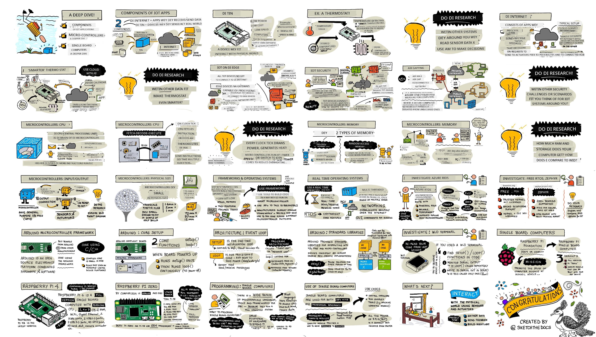
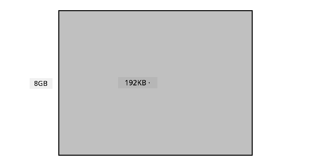
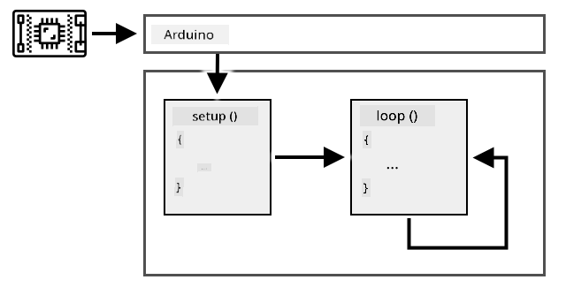
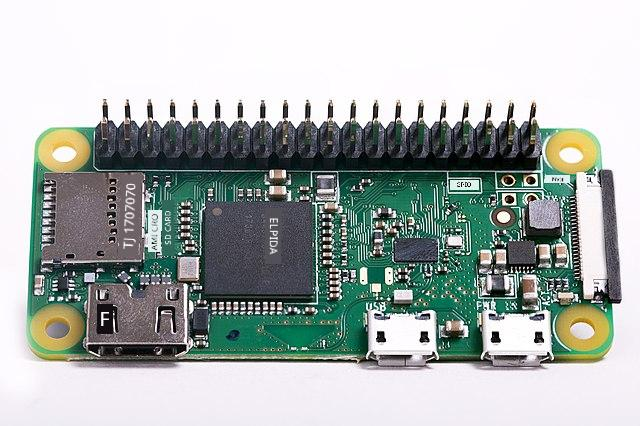

<!--
CO_OP_TRANSLATOR_METADATA:
{
  "original_hash": "9dd7f645ad1c6f20b72fee512987f772",
  "translation_date": "2025-11-18T18:36:25+00:00",
  "source_file": "1-getting-started/lessons/2-deeper-dive/README.md",
  "language_code": "pcm"
}
-->
# A deeper dive into IoT

> Sketchnote by [Nitya Narasimhan](https://github.com/nitya). Click the image for a larger version.

Dis lesson na part of di [Hello IoT series](https://youtube.com/playlist?list=PLmsFUfdnGr3xRts0TIwyaHyQuHaNQcb6-) wey dem teach for [Microsoft Reactor](https://developer.microsoft.com/reactor/?WT.mc_id=academic-17441-jabenn). Di lesson na 2 videos - one 1 hour lesson, and one 1 hour office hour wey go deep into di lesson and answer questions.

> 🎥 Click di images above to watch di videos

## Pre-lecture quiz

[Pre-lecture quiz](https://black-meadow-040d15503.1.azurestaticapps.net/quiz/3)

## Introduction

Dis lesson go explain more about some of di things wey we talk for di last lesson.

For dis lesson we go talk about:

* [Components of an IoT application](../../../../../1-getting-started/lessons/2-deeper-dive)
* [Deeper dive into microcontrollers](../../../../../1-getting-started/lessons/2-deeper-dive)
* [Deeper dive into single-board computers](../../../../../1-getting-started/lessons/2-deeper-dive)

## Components of an IoT application

Di two main parts of IoT application na di *Internet* and di *thing*. Make we look dem well.

### The Thing

Di **Thing** part of IoT na di device wey dey interact with di physical world. Dis devices dey small, cheap, and dey use low power - like microcontrollers wey get small RAM (kilobytes instead of gigabytes for PC) and dey run slow (hundreds of megahertz instead of gigahertz for PC). Dem fit use battery wey go last weeks, months or even years.

Dis devices dey use sensors to collect data or actuators to make changes for di physical world. Example na smart thermostat - e get temperature sensor, touchscreen or dial to set temperature, and e dey connect to heating or cooling system. Di sensor go know say di room cold, then actuator go turn di heating on.

Plenty different things fit be IoT devices, from hardware wey dey sense one thing to general purpose devices like smartphone. Smartphone fit use sensors to know wetin dey happen around am, and actuators to interact with di world - like GPS to know your location and speaker to give you navigation instructions.

✅ Think about other systems wey dey use sensor to read data and make decisions. Example na oven thermostat. Fit find more?

### The Internet

Di **Internet** part of IoT na di applications wey di IoT device dey connect to send and receive data, and other apps wey dey process di data and make decisions.

One common setup na cloud service wey di IoT device dey connect to. Di cloud service dey handle security, receive messages from di device, and send messages back. Di cloud service fit connect to apps wey dey process or store sensor data, or use di data to make decisions.

Sometimes, devices no dey connect directly to Internet. Dem fit use mesh networking like Bluetooth to talk to each other, then connect to Internet through hub device.

For example, smart thermostat go connect to cloud service through home WiFi. E go send temperature data to di cloud, di cloud go store am for database wey di homeowner fit check with phone app. Another service go know di temperature wey di homeowner want, then send message back to di IoT device to turn heating system on or off.

Smarter version fit use AI for di cloud with data from other sensors like occupancy sensors, weather, and calendar to make better decisions. Example, e fit turn heating off if e see for your calendar say you dey vacation, or turn heating off for rooms wey you no dey use.

✅ Wetin other data fit help make Internet connected thermostat smarter?

### IoT on the Edge

Even though IoT dey use Internet, di devices no always need Internet connection. Sometimes dem fit connect to 'edge' devices for local network to process data without Internet. Dis dey faster if data plenty or Internet slow, e fit work offline, and e dey keep data private. Some devices dey use cloud tools to create processing code wey go run locally.

Example na smart home device like Apple HomePod, Amazon Alexa, or Google Home. Dem dey use AI models wey dem train for di cloud but dey run locally. Di device go 'wake up' when e hear certain word, then send your speech go Internet for processing. E go stop to send speech when e hear pause. Wetin you talk before di wake word and after e stop go dey private.

✅ Think about other situations wey privacy dey important so e better make di processing dey happen for edge instead of cloud. Hint - think about IoT devices wey get camera or imaging devices.

### IoT Security

Any Internet connection need security. People dey joke say 'di S for IoT na Security' - meaning IoT no dey secure.

IoT devices dey connect to cloud service, so di security na as strong as di cloud service. If di cloud service no secure, bad people fit send fake data or virus attack fit happen. Dis fit cause real world wahala as IoT devices dey control other devices. Example na [Stuxnet worm](https://wikipedia.org/wiki/Stuxnet) wey damage centrifuges. Hackers don also use [poor security to enter baby monitors](https://www.npr.org/sections/thetwo-way/2018/06/05/617196788/s-c-mom-says-baby-monitor-was-hacked-experts-say-many-devices-are-vulnerable) and other home surveillance devices.

> 💁 Sometimes IoT devices and edge devices dey run for network wey no connect to Internet to keep di data private and secure. Dis na [air-gapping](https://wikipedia.org/wiki/Air_gap_(networking)).

## Deeper dive into microcontrollers

For di last lesson, we talk small about microcontrollers. Now make we go deep.

### CPU

Di CPU na di 'brain' of di microcontroller. E dey run your code and dey send and receive data from connected devices. CPUs fit get one or more cores wey dey work together to run your code.

CPU dey use clock wey dey tick millions or billions of times per second. Each tick dey synchronize wetin di CPU dey do. Di CPU fit execute instruction like collect data or do calculation for each tick. Di faster di clock, di more instructions e fit process per second.

Di speed of CPU dey measured in [Hertz (Hz)](https://wikipedia.org/wiki/Hertz), wey mean one cycle per second.

> 🎓 CPU speed dey measured in MHz or GHz. 1MHz na 1 million Hz, 1GHz na 1 billion Hz.

> 💁 CPUs dey run programs using [fetch-decode-execute cycle](https://wikipedia.org/wiki/Instruction_cycle). For each clock tick, di CPU go fetch instruction from memory, decode am, then execute am like add 2 numbers. Some instructions fit take multiple ticks.

Microcontrollers dey run slower than desktop or laptop computers or smartphones. Example, Wio Terminal CPU dey run at 120MHz or 120,000,000 cycles per second.

✅ Di average PC or Mac CPU dey run at multiple GigaHertz with multiple cores. Research di clock speed of your computer and compare am with Wio Terminal.

Each clock cycle dey use power and generate heat. Di faster di ticks, di more power e go use and di more heat e go generate. PCs dey use heat sinks and fans to cool down, but microcontrollers no dey need am as dem dey run cooler and slower. PCs dey use mains power or big batteries, microcontrollers fit use small batteries wey go last long. Some microcontrollers get cores wey dey run at different speeds to save power.

> 💁 Some PCs and Macs don start to use di same mix of fast and slow cores to save battery. Example na M1 chip for Apple laptops wey fit switch between performance cores and efficiency cores.

✅ Do small research: Read about CPUs for [Wikipedia CPU article](https://wikipedia.org/wiki/Central_processing_unit)

#### Task

Check di Wio Terminal.

If you dey use Wio Terminal for dis lessons, try find di CPU. Look di *Hardware Overview* section for di [Wio Terminal product page](https://www.seeedstudio.com/Wio-Terminal-p-4509.html) for picture of di inside, and try find di CPU through di clear plastic window for di back.

### Memory

Microcontrollers dey get two types of memory - program memory and random-access memory (RAM).

Program memory no dey lose wetin e store even if power no dey. Na di memory wey dey keep your program code.

RAM na di memory wey di program dey use to run, e dey keep variables and data wey di program dey collect. RAM dey lose wetin e store if power no dey, e go reset di program.
> 🎓 Program memory dey store your code and e no go disappear even if power no dey.

> 🎓 RAM na wetin dem dey use run your program, but e go reset if power no dey.

Just like CPU, memory wey dey inside microcontroller small well well compared to PC or Mac. Normal PC fit get like 8 Gigabytes (GB) of RAM, wey be 8,000,000,000 bytes, and each byte fit hold one letter or number from 0-255. But microcontroller go get only Kilobytes (KB) of RAM, and one kilobyte na 1,000 bytes. For example, the Wio terminal wey we talk about get 192KB of RAM, wey be 192,000 bytes - e small pass normal PC RAM by more than 40,000 times!

The diagram wey dey below go show you how 192KB and 8GB take compare - that small dot for center na 192KB.

Program storage for microcontroller sef small pass PC own. Normal PC fit get 500GB hard drive for program storage, but microcontroller fit get only kilobytes or maybe small megabytes (MB) of storage (1MB na 1,000KB, or 1,000,000 bytes). The Wio terminal get 4MB of program storage.

✅ Do small research: How much RAM and storage your computer wey you dey use now get? How e take compare with microcontroller?

### Input/Output

Microcontrollers need input and output (I/O) connections to fit read data from sensors and send control signals to actuators. Dem dey usually get plenty general-purpose input/output (GPIO) pins. You fit configure these pins for software to be input (to receive signal) or output (to send signal).

🧠⬅️ Input pins dey read values from sensors.

🧠➡️ Output pins dey send instructions to actuators.

✅ You go learn more about this one for next lesson.

#### Task

Check the Wio Terminal.

If you dey use Wio Terminal for these lessons, find the GPIO pins. Check the *Pinout diagram* section for the [Wio Terminal product page](https://www.seeedstudio.com/Wio-Terminal-p-4509.html) to sabi which pin be which. The Wio Terminal get sticker wey you fit put for back wey get pin numbers, so if you never put am, do am now.

### Physical size

Microcontrollers dey usually small for size. The smallest one, [Freescale Kinetis KL03 MCU, small reach to fit inside golf ball dimple](https://www.edn.com/tiny-arm-cortex-m0-based-mcu-shrinks-package/). Just the CPU for PC fit measure 40mm x 40mm, and that one no even include the heat sinks and fans wey dem need to make sure the CPU no go overheat after some seconds. E big pass complete microcontroller well well. The Wio terminal developer kit wey get microcontroller, case, screen, and plenty connections and components no big pass bare Intel i9 CPU, and e small pass the CPU wey get heat sink and fan!

| Device                          | Size                  |
| ------------------------------- | --------------------- |
| Freescale Kinetis KL03          | 1.6mm x 2mm x 1mm     |
| Wio terminal                    | 72mm x 57mm x 12mm    |
| Intel i9 CPU, Heat sink and fan | 136mm x 145mm x 103mm |

### Frameworks and operating systems

Because microcontrollers no fast and their memory small, dem no dey run operating system (OS) like desktop computer. The OS wey dey make your computer run (Windows, Linux or macOS) need plenty memory and processing power to run tasks wey microcontroller no need. Microcontrollers dey usually programmed to do one or two specific tasks, unlike general-purpose computer like PC or Mac wey fit do plenty things like user interface, play music or movies, write documents or code, play games, or browse Internet.

To program microcontroller wey no get OS, you go need tools wey go help you build your code so the microcontroller fit run am, using APIs wey fit talk to any peripherals. Each microcontroller dey different, so manufacturers dey usually support standard frameworks wey go allow you follow standard 'recipe' to build your code and make am run for any microcontroller wey support that framework.

You fit program microcontrollers with OS - dem dey call am real-time operating system (RTOS), because dem dey designed to handle sending data to and from peripherals in real time. These operating systems dey very light and dem dey provide features like:

* Multi-threading, wey go allow your code run more than one block of code at the same time, either for multiple cores or by taking turns for one core.
* Networking to allow communication over Internet securely.
* Graphical user interface (GUI) components to build user interfaces (UI) for devices wey get screen.

✅ Read about some different RTOSes: [Azure RTOS](https://azure.microsoft.com/services/rtos/?WT.mc_id=academic-17441-jabenn), [FreeRTOS](https://www.freertos.org), [Zephyr](https://www.zephyrproject.org)

#### Arduino

[Arduino](https://www.arduino.cc) na probably the most popular microcontroller framework, especially for students, hobbyists, and makers. Arduino na open source electronics platform wey combine software and hardware. You fit buy Arduino compatible boards from Arduino themselves or from other manufacturers, then code am using the Arduino framework.

Arduino boards dey coded with C or C++. Using C/C++ go make your code small and fast, something wey microcontroller need because e no get plenty resources. The main part of Arduino application na sketch, and e be C/C++ code wey get 2 functions - `setup` and `loop`. When the board start, the Arduino framework go run the `setup` function once, then e go dey run the `loop` function again and again until you off the power.

For `setup` function, you go write code like connecting to WiFi and cloud services or initializing pins for input and output. For `loop` function, you go write processing code like reading from sensor and sending the value to cloud. You fit add delay for each loop, for example, if you want make sensor data dey send every 10 seconds, you go add delay of 10 seconds for the end of the loop so the microcontroller go sleep, save power, then run the loop again after 10 seconds.

✅ This program architecture na wetin dem dey call *event loop* or *message loop*. Plenty applications dey use this method, and e be standard for most desktop applications wey dey run for OS like Windows, macOS or Linux. The `loop` dey listen for messages from user interface components like buttons, or devices like keyboard, and e dey respond to them. You fit read more for this [article on the event loop](https://wikipedia.org/wiki/Event_loop).

Arduino dey provide standard libraries to interact with microcontrollers and the I/O pins, with different implementations under the hood to run for different microcontrollers. For example, the [`delay` function](https://www.arduino.cc/reference/en/language/functions/time/delay/) go pause the program for some time, the [`digitalRead` function](https://www.arduino.cc/reference/en/language/functions/digital-io/digitalread/) go read value of `HIGH` or `LOW` from the pin wey you give am, no matter the board wey the code dey run on. These standard libraries mean say Arduino code wey you write for one board fit run for another Arduino board if the pins and features dey the same.

Plenty third-party Arduino libraries dey wey go allow you add extra features to your Arduino projects, like using sensors and actuators or connecting to cloud IoT services.

##### Task

Check the Wio Terminal.

If you dey use Wio Terminal for these lessons, go back check the code wey you write for the last lesson. Find the `setup` and `loop` function. Monitor the serial output to see how the loop function dey called repeatedly. Try add code to the `setup` function to write to the serial port and observe say this code dey only run once anytime you reboot. Try reboot your device with the power switch for the side to see say e dey run each time the device reboot.

## Deeper dive into single-board computers

For the last lesson, we talk about single-board computers. Now, make we look am well well.

### Raspberry Pi

The [Raspberry Pi Foundation](https://www.raspberrypi.org) na charity from UK wey dem start for 2009 to promote computer science study, especially for school level. As part of their mission, dem develop single-board computer wey dem call Raspberry Pi. Raspberry Pi dey come in 3 types - full size version, smaller Pi Zero, and compute module wey you fit use build your final IoT device.

The latest full size Raspberry Pi na Raspberry Pi 4B. E get quad-core (4 core) CPU wey dey run for 1.5GHz, 2, 4, or 8GB of RAM, gigabit ethernet, WiFi, 2 HDMI ports wey fit support 4k screens, audio and composite video output port, USB ports (2 USB 2.0, 2 USB 3.0), 40 GPIO pins, camera connector for Raspberry Pi camera module, and SD card slot. All these dey for board wey be 88mm x 58mm x 19.5mm and e dey powered by 3A USB-C power supply. E dey start from US$35, e cheap pass PC or Mac.

> 💁 Dem still get Pi400 all-in-one computer wey get Pi4 inside keyboard.

The Pi Zero small well well, and e no dey use plenty power. E get single core 1GHz CPU, 512MB of RAM, WiFi (for the Zero W model), one HDMI port, one micro-USB port, 40 GPIO pins, camera connector for Raspberry Pi camera module, and SD card slot. E measure 65mm x 30mm x 5mm, and e no dey use plenty power. The Zero na US$5, and the W version wey get WiFi na US$10.

> 🎓 The CPUs for both of them na ARM processors, no be the Intel/AMD x86 or x64 processors wey dey most PCs and Macs. Dem dey similar to the CPUs wey dey some microcontrollers, and almost all mobile phones, Microsoft Surface X, and the new Apple Silicon based Apple Macs.

All Raspberry Pi variants dey run version of Debian Linux wey dem call Raspberry Pi OS. E get lite version wey no get desktop, wey perfect for 'headless' projects wey no need screen, or full version wey get desktop environment, web browser, office applications, coding tools, and games. Since the OS na version of Debian Linux, you fit install any application or tool wey dey run for Debian and wey dem build for the ARM processor wey dey inside the Pi.

#### Task

Check the Raspberry Pi.

If you dey use Raspberry Pi for these lessons, read about the different hardware components wey dey the board.

* You fit find details about the processors wey dem use for the [Raspberry Pi hardware documentation page](https://www.raspberrypi.org/documentation/hardware/raspberrypi/). Read about the processor wey dey the Pi wey you dey use.
* Locate the GPIO pins. Read more about them for the [Raspberry Pi GPIO documentation](https://www.raspberrypi.org/documentation/hardware/raspberrypi/gpio/README.md). Use the [GPIO Pin Usage guide](https://www.raspberrypi.org/documentation/usage/gpio/README.md) to identify the different pins wey dey your Pi.

### Programming single-board computers

Single-board computers na full computers wey dey run full OS. This one mean say you fit use plenty programming languages, frameworks, and tools to code them, unlike microcontrollers wey dey depend on frameworks like Arduino. Most programming languages get libraries wey fit access the GPIO pins to send and receive data from sensors and actuators.

✅ Which programming languages you sabi? Dem dey supported for Linux?
The most common programming language wey people dey use build IoT apps for Raspberry Pi na Python. Plenty hardware dey wey dem design for Pi, and almost all of dem get the correct code wey you need to use dem as Python libraries. Some of dis hardware dey based on 'hats' - dem call am so because e dey sit for top the Pi like hat and e dey connect with big socket to the 40 GPIO pins. Dis hats dey add extra things like screens, sensors, remote-controlled cars, or adapters wey go allow you plug sensors wey get standard cables.

### How single-board computers dey work for professional IoT deployments

Single-board computers no be only for developer kits, dem dey use am for professional IoT deployments too. Dem fit give strong way to control hardware and run complex tasks like machine learning models. For example, [Raspberry Pi 4 compute module](https://www.raspberrypi.org/blog/raspberry-pi-compute-module-4/) dey give all the power wey Raspberry Pi 4 get but e small and cheap pass, e no get plenty ports, and dem design am make e fit enter custom hardware.

---

## 🚀 Challenge

The challenge for the last lesson na to list as many IoT devices wey dey your house, school or work. For each device wey you list, you fit think say dem dey use microcontrollers or single-board computers, or even mix of both?

## Post-lecture quiz

[Post-lecture quiz](https://black-meadow-040d15503.1.azurestaticapps.net/quiz/4)

## Review & Self Study

* Read the [Arduino getting started guide](https://www.arduino.cc/en/Guide/Introduction) to sabi more about the Arduino platform.
* Read the [introduction to the Raspberry Pi 4](https://www.raspberrypi.org/products/raspberry-pi-4-model-b/) to learn more about Raspberry Pis.
* Learn more about some of the concepts and acronyms for the [What the FAQ are CPUs, MPUs, MCUs, and GPUs article for Electrical Engineering Journal](https://www.eejournal.com/article/what-the-faq-are-cpus-mpus-mcus-and-gpus/).

✅ Use these guides, plus the costs wey dey show for the links for the [hardware guide](../../../hardware.md) to decide which hardware platform you wan use, or if you go prefer use virtual device.

## Assignment

[Compare and contrast microcontrollers and single-board computers](assignment.md)

---

<!-- CO-OP TRANSLATOR DISCLAIMER START -->
**Disclaimer**:  
Dis dokyument don translate wit AI translation service [Co-op Translator](https://github.com/Azure/co-op-translator). Even though we dey try make am accurate, abeg sabi say machine translation fit get mistake or no dey correct well. Di original dokyument for im native language na di main source wey you go fit trust. For important mata, e good make professional human translator check am. We no go fit take blame for any misunderstanding or wrong interpretation wey fit happen because you use dis translation.
<!-- CO-OP TRANSLATOR DISCLAIMER END -->