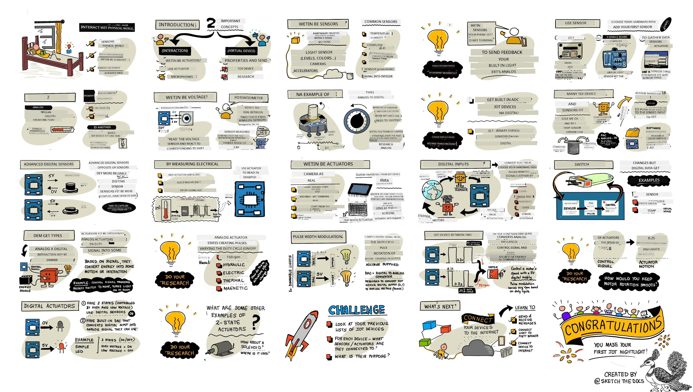
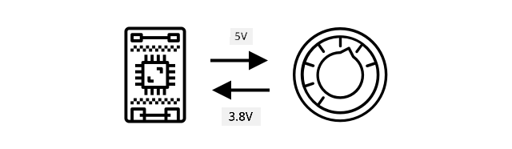
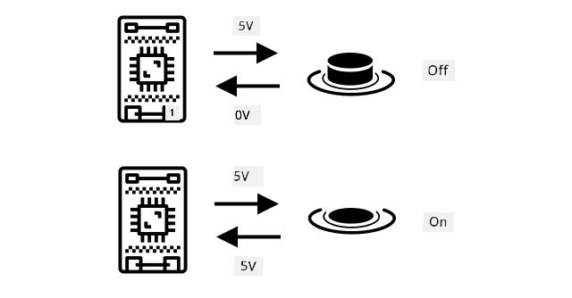
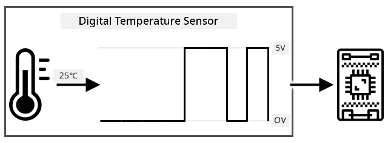
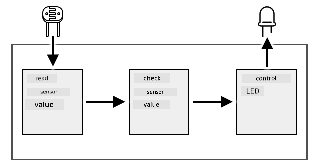
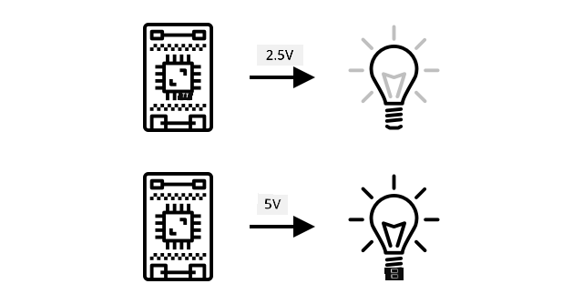
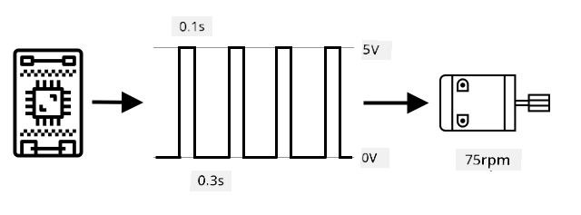
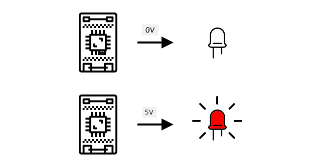

<!--
CO_OP_TRANSLATOR_METADATA:
{
  "original_hash": "e9ee00eb5fc55922a73762acc542166b",
  "translation_date": "2025-11-18T18:39:28+00:00",
  "source_file": "1-getting-started/lessons/3-sensors-and-actuators/README.md",
  "language_code": "pcm"
}
-->
# Interact wit di physical world wit sensors and actuators



> Sketchnote by [Nitya Narasimhan](https://github.com/nitya). Click di image for bigger version.

Dis lesson na part of di [Hello IoT series](https://youtube.com/playlist?list=PLmsFUfdnGr3xRts0TIwyaHyQuHaNQcb6-) wey di [Microsoft Reactor](https://developer.microsoft.com/reactor/?WT.mc_id=academic-17441-jabenn) teach. Di lesson na 2 videos - one 1 hour lesson, and one 1 hour office hour wey go deep into di lesson and answer questions.

[](https://youtu.be/Lqalu1v6aF4)

[](https://youtu.be/qR3ekcMlLWA)

> 🎥 Click di images above to watch di videos

## Pre-lecture quiz

[Pre-lecture quiz](https://black-meadow-040d15503.1.azurestaticapps.net/quiz/5)

## Introduction

Dis lesson go show you two important things for your IoT device - sensors and actuators. You go also do hands-on wit dem, add light sensor to your IoT project, then add LED wey light dey control, so you go fit build nightlight.

For dis lesson we go talk about:

* [Wetin be sensors?](../../../../../1-getting-started/lessons/3-sensors-and-actuators)
* [How to use sensor](../../../../../1-getting-started/lessons/3-sensors-and-actuators)
* [Di types of sensors](../../../../../1-getting-started/lessons/3-sensors-and-actuators)
* [Wetin be actuators?](../../../../../1-getting-started/lessons/3-sensors-and-actuators)
* [How to use actuator](../../../../../1-getting-started/lessons/3-sensors-and-actuators)
* [Di types of actuators](../../../../../1-getting-started/lessons/3-sensors-and-actuators)

## Wetin be sensors?

Sensors na hardware wey dey sense di physical world - dem dey measure one or more things around dem and send di info go IoT device. Sensors plenty wella because e get many things wey person fit measure, like air temperature or movement.

Some common sensors na:

* Temperature sensors - dem dey sense di air temperature or di temperature of wetin dem dey inside. For hobbyists and developers, dem dey combine am wit air pressure and humidity for one sensor.
* Buttons - dem dey sense when person press dem.
* Light sensors - dem dey detect light levels, fit be for specific colors, UV light, IR light, or general visible light.
* Cameras - dem dey sense di world visual by taking photo or streaming video.
* Accelerometers - dem dey sense movement for different directions.
* Microphones - dem dey sense sound, either general sound levels or directional sound.

✅ Do small research. Wetin be di sensors wey dey your phone?

All sensors get one thing wey dem dey do - dem dey change wetin dem sense into electrical signal wey IoT device fit understand. How di IoT device go understand di signal depend on di sensor and di communication protocol wey di sensor dey use.

## How to use sensor

Follow di guide wey dey below to add sensor to your IoT device:

* [Arduino - Wio Terminal](wio-terminal-sensor.md)
* [Single-board computer - Raspberry Pi](pi-sensor.md)
* [Single-board computer - Virtual device](virtual-device-sensor.md)

## Di types of sensors

Sensors fit be analog or digital.

### Analog sensors

Di basic sensors na analog sensors. Dem dey receive voltage from di IoT device, di sensor go adjust di voltage, and di voltage wey di sensor return go show di sensor value.

> 🎓 Voltage na how dem dey measure di push wey dey move electricity from one place go another, like from di positive terminal of battery go di negative terminal. For example, AA battery na 1.5V (V na di symbol for volts) and e fit push electricity wit di force of 1.5V. Different electrical hardware need different voltages to work, like LED fit light wit 2-3V, but 100W filament bulb go need 240V. You fit read more about voltage for [Voltage page for Wikipedia](https://wikipedia.org/wiki/Voltage).

One example na potentiometer. Dis na dial wey you fit turn between two positions and di sensor go measure di rotation.



Di IoT device go send electrical signal to di potentiometer wit voltage, like 5 volts (5V). As you dey adjust di potentiometer, e go change di voltage wey dey come out. Imagine say di potentiometer get dial wey dey go from 0 to [11](https://wikipedia.org/wiki/Up_to_eleven), like volume knob for amplifier. When di potentiometer dey full off position (0), 0V (0 volts) go come out. When e dey full on position (11), 5V (5 volts) go come out.

> 🎓 Dis na oversimplification, you fit read more about potentiometers and variable resistors for [potentiometer Wikipedia page](https://wikipedia.org/wiki/Potentiometer).

Di voltage wey dey come out from di sensor na wetin di IoT device go read, and di device fit respond to am. Depending on di sensor, di voltage fit be random value or fit match standard unit. For example, analog temperature sensor wey dey use [thermistor](https://wikipedia.org/wiki/Thermistor) go change e resistance based on di temperature. Di output voltage fit change to temperature in Kelvin, and fit also change to °C or °F, wit calculation for code.

✅ Wetin you think go happen if di sensor return higher voltage than wetin dem send (like from external power supply)? ⛔️ NO try test am.

#### Analog to digital conversion

IoT devices na digital - dem no fit work wit analog values, dem dey only work wit 0s and 1s. Dis mean say analog sensor values need to change to digital signal before di device fit process am. Many IoT devices get analog-to-digital converters (ADCs) wey dey change analog inputs to digital values. Sensors fit also work wit ADCs via connector board. For example, for Seeed Grove ecosystem wit Raspberry Pi, analog sensors dey connect to specific ports for 'hat' wey dey sit on di Pi connected to di Pi GPIO pins, and dis hat get ADC wey dey change di voltage to digital signal wey di Pi GPIO pins fit send.

Imagine say you get analog light sensor wey dey connect to IoT device wey dey use 3.3V and e dey return 1V. Dis 1V no mean anything for digital world, so e need to change. Di voltage go change to analog value wit scale wey depend on di device and sensor. One example na Seeed Grove light sensor wey dey output values from 0 to 1,023. For dis sensor wey dey run for 3.3V, 1V output go be value of 300. IoT device no fit handle 300 as analog value, so di value go change to `0000000100101100`, di binary representation of 300 by di Grove hat. Dis go then dey process by di IoT device.

✅ If you no sabi binary, do small research to learn how numbers dey represent wit 0s and 1s. Di [BBC Bitesize introduction to binary lesson](https://www.bbc.co.uk/bitesize/guides/zwsbwmn/revision/1) na good place to start.

For coding, di libraries wey dey come wit di sensors dey handle all dis conversion, so you no need worry about am. For Grove light sensor, you go use di Python library and call di `light` property, or use di Arduino library and call `analogRead` to get value of 300.

### Digital sensors

Digital sensors, like analog sensors, dey detect di world around dem wit changes for electrical voltage. Di difference be say dem dey output digital signal, either by measuring only two states or by using ADC wey dey inside dem. Digital sensors dey common now so dem no go need ADC for connector board or di IoT device.

Di simplest digital sensor na button or switch. Dis na sensor wey get two states, on or off.



Pins for IoT devices like GPIO pins fit measure dis signal directly as 0 or 1. If di voltage wey dem send dey same as di voltage wey dem return, di value wey dem read na 1, if e no dey same di value na 0. No need to change di signal, e fit only be 1 or 0.

> 💁 Voltages no dey exact especially as di components for sensor go get small resistance, so dem dey usually get tolerance. For example, di GPIO pins for Raspberry Pi dey work wit 3.3V, and dem dey read return signal wey dey above 1.8V as 1, below 1.8V as 0.

* 3.3V dey enter di button. Di button dey off so 0V dey come out, di value na 0
* 3.3V dey enter di button. Di button dey on so 3.3V dey come out, di value na 1

More advanced digital sensors dey read analog values, then dem dey change am wit ADC wey dey inside dem to digital signal. For example, digital temperature sensor go still use thermocouple like analog sensor, and e go still measure di change for voltage wey di thermocouple resistance dey cause for di current temperature. Instead of returning analog value and relying on di device or connector board to change am to digital signal, ADC wey dey inside di sensor go change di value and send am as 0s and 1s to di IoT device. Dis 0s and 1s dey send di same way as di digital signal for button wit 1 being full voltage and 0 being 0v.



Sending digital data dey allow sensors to dey more complex and send more detailed data, even encrypted data for secure sensors. One example na camera. Dis na sensor wey dey capture image and send am as digital data wey get di image, usually for compressed format like JPEG, to di IoT device. E fit even stream video by capturing images and sending di complete image frame by frame or compressed video stream.

## Wetin be actuators?

Actuators na di opposite of sensors - dem dey change electrical signal from your IoT device into interaction wit di physical world like light, sound, or motor movement.

Some common actuators na:

* LED - dem dey emit light when dem turn on
* Speaker - dem dey emit sound based on di signal wey dem send, from basic buzzer to audio speaker wey fit play music
* Stepper motor - dem dey change signal into defined rotation, like turning dial 90°
* Relay - dem na switches wey fit turn on or off wit electrical signal. Dem dey allow small voltage from IoT device to turn on bigger voltages.
* Screens - dem na more complex actuators wey dey show info for multi-segment display. Screens dey range from simple LED displays to high-resolution video monitors.

✅ Do small research. Wetin be di actuators wey dey your phone?

## How to use actuator

Follow di guide wey dey below to add actuator to your IoT device, wey di sensor go dey control, to build IoT nightlight. E go gather light levels from di light sensor, and use actuator like LED to emit light when di light level wey dem detect dey too low.



* [Arduino - Wio Terminal](wio-terminal-actuator.md)
* [Single-board computer - Raspberry Pi](pi-actuator.md)
* [Single-board computer - Virtual device](virtual-device-actuator.md)

## Di types of actuators

Like sensors, actuators fit be analog or digital.

### Analog actuators

Analog actuators dey take analog signal and change am into interaction, where di interaction dey change based on di voltage wey dem supply.
One example na light wey fit dim, like the one wey you fit get for your house. How bright the light go be na the voltage wey dem supply am go determine.



Just like sensors, the IoT device dey work with digital signals, no be analog. This mean say to send analog signal, the IoT device go need digital to analog converter (DAC), either directly for the IoT device or for connector board. This converter go change the 0s and 1s wey the IoT device dey send to analog voltage wey the actuator fit use.

✅ Wetin you think go happen if the IoT device send voltage wey pass wetin the actuator fit handle?
⛔️ NO TRY am o.

#### Pulse-Width Modulation

Another way to change digital signals from IoT device to analog signal na pulse-width modulation. This one na to send plenty short digital pulses wey go act like analog signal.

For example, you fit use PWM to control motor speed.

Imagine say you dey control motor wey dey use 5V supply. You send short pulse to your motor, switch the voltage to high (5V) for two hundredths of a second (0.02s). For that time, your motor fit turn one tenth of a rotation, or 36°. The signal go pause for two hundredths of a second (0.02s), send low signal (0V). Each cycle of on then off go last 0.04s. The cycle go repeat.


This mean say for one second, you go get 25 5V pulses of 0.02s wey go turn the motor, each one go follow 0.02s pause of 0V wey no go turn the motor. Each pulse go turn the motor one tenth of a rotation, meaning the motor go complete 2.5 rotations per second. You don use digital signal to turn the motor at 2.5 rotations per second, or 150 [revolutions per minute](https://wikipedia.org/wiki/Revolutions_per_minute) (na non-standard measure of rotational velocity).

```output
25 pulses per second x 0.1 rotations per pulse = 2.5 rotations per second
2.5 rotations per second x 60 seconds in a minute = 150rpm
```

> 🎓 When PWM signal dey on for half the time, and off for half, dem dey call am [50% duty cycle](https://wikipedia.org/wiki/Duty_cycle). Duty cycles na percentage time wey signal dey on compared to off.



You fit change motor speed by changing the size of the pulses. For example, with the same motor, you fit keep the same cycle time of 0.04s, with the on pulse cut to 0.01s, and the off pulse increase to 0.03s. You go still get the same number of pulses per second (25), but each on pulse go short. Short pulse go only turn the motor one twentieth of a rotation, and at 25 pulses per second, the motor go complete 1.25 rotations per second or 75rpm. By changing the pulse speed of digital signal, you don reduce the speed of analog motor by half.

```output
25 pulses per second x 0.05 rotations per pulse = 1.25 rotations per second
1.25 rotations per second x 60 seconds in a minute = 75rpm
```

✅ How you go make sure say the motor rotation dey smooth, especially for low speeds? You go use small number of long pulses with long pauses or plenty short pulses with short pauses?

> 💁 Some sensors dey use PWM too to change analog signals to digital signals.

> 🎓 You fit read more about pulse-width modulation for [pulse-width modulation page on Wikipedia](https://wikipedia.org/wiki/Pulse-width_modulation).

### Digital actuators

Digital actuators, like digital sensors, dey get two states wey high or low voltage dey control or dem get DAC inside wey fit change digital signal to analog one.

One simple digital actuator na LED. When device send digital signal of 1, high voltage go light the LED. When device send digital signal of 0, voltage go drop to 0V and LED go off.



✅ Which other simple 2-state actuators you fit think of? One example na solenoid, wey be electromagnet wey fit activate to do things like move door bolt to lock/unlock door.

More advanced digital actuators, like screens, dey need digital data to dey send in certain formats. Dem dey usually come with libraries wey go make am easy to send correct data to control dem.

---

## 🚀 Challenge

The challenge for the last two lessons na to list as many IoT devices as you fit see for your house, school or workplace and decide if dem dey use microcontrollers or single-board computers, or even mix of both.

For every device wey you list, which sensors and actuators dem connect to? Wetin be the purpose of each sensor and actuator wey dem connect to these devices?

## Post-lecture quiz

[Post-lecture quiz](https://black-meadow-040d15503.1.azurestaticapps.net/quiz/6)

## Review & Self Study

* Read about electricity and circuits for [ThingLearn](http://thinglearn.jenlooper.com/curriculum/).
* Read about the different types of temperature sensors for [Seeed Studios Temperature Sensors guide](https://www.seeedstudio.com/blog/2019/10/14/temperature-sensors-for-arduino-projects/)
* Read about LEDs for [Wikipedia LED page](https://wikipedia.org/wiki/Light-emitting_diode)

## Assignment

[Research sensors and actuators](assignment.md)

---

<!-- CO-OP TRANSLATOR DISCLAIMER START -->
**Disclaimer**:  
Dis dokyument don use AI transleshion service [Co-op Translator](https://github.com/Azure/co-op-translator) do di transleshion. Even as we dey try make am accurate, abeg make you sabi say transleshion wey machine do fit get mistake or no dey correct well. Di original dokyument for im native language na di one wey you go take as di main source. For important informashon, e good make professional human transleshion dey use. We no go fit take blame for any misunderstanding or wrong interpretation wey fit happen because you use dis transleshion.
<!-- CO-OP TRANSLATOR DISCLAIMER END -->