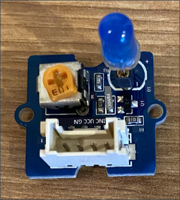
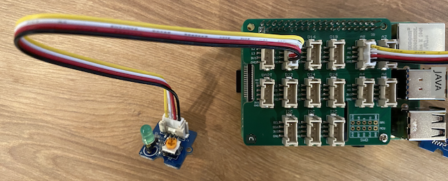

<!--
CO_OP_TRANSLATOR_METADATA:
{
  "original_hash": "4db8a3879a53490513571df2f6cf7641",
  "translation_date": "2025-11-18T18:39:06+00:00",
  "source_file": "1-getting-started/lessons/3-sensors-and-actuators/pi-actuator.md",
  "language_code": "pcm"
}
-->
# Build nightlight - Raspberry Pi

For dis part of di lesson, you go add LED to your Raspberry Pi and use am to make nightlight.

## Hardware

Di nightlight need actuator now.

Di actuator na **LED**, na [light-emitting diode](https://wikipedia.org/wiki/Light-emitting_diode) wey dey shine light when current pass through am. E be digital actuator wey get 2 states, on and off. If you send value of 1, e go turn di LED on, and 0 go turn am off. Di LED na external Grove actuator and e need to connect to di Grove Base hat wey dey di Raspberry Pi.

Di nightlight logic for pseudo-code be:

```output
Check the light level.
If the light is less than 300
    Turn the LED on
Otherwise
    Turn the LED off
```

### Connect di LED

Di Grove LED dey come as module wey get different LEDs, so you fit choose di color wey you like.

#### Task - connect di LED

Connect di LED.



1. Choose di LED wey you like and put di legs inside di two holes for di LED module.

    LEDs na light-emitting diodes, and diodes na electronic device wey fit carry current only one way. Dis mean say di LED need to connect di correct way, if not e no go work.

    One leg of di LED na di positive pin, di other one na di negative pin. Di LED no dey perfectly round, e get one side wey flat small. Di side wey flat small na di negative pin. When you dey connect di LED to di module, make sure say di pin wey dey di round side connect to di socket wey dem mark **+** for di outside of di module, and di flat side connect to di socket wey dey close to di middle of di module.

1. Di LED module get spin button wey you fit use control di brightness. Turn am reach di highest level first by rotating am anti-clockwise as e fit go using small Phillips head screwdriver.

1. Put one end of Grove cable inside di socket for di LED module. E go only enter one way.

1. When di Raspberry Pi dey off, connect di other end of di Grove cable to di digital socket wey dem mark **D5** for di Grove Base hat wey dey attach to di Pi. Dis socket na di second one from di left, for di row of sockets wey dey next to di GPIO pins.



## Program di nightlight

Now you fit program di nightlight using di Grove light sensor and di Grove LED.

### Task - program di nightlight

Program di nightlight.

1. Power di Pi and wait make e boot.

1. Open di nightlight project for VS Code wey you create for di last part of dis assignment, whether e dey run directly for di Pi or e dey connect using di Remote SSH extension.

1. Add dis code to di `app.py` file to import di library wey you need. Put am for di top, under di other `import` lines.

    ```python
    from grove.grove_led import GroveLed
    ```

    Di `from grove.grove_led import GroveLed` statement dey import di `GroveLed` from di Grove Python libraries. Dis library get code wey dey interact with Grove LED.

1. Add dis code after di `light_sensor` declaration to create instance of di class wey dey manage di LED:

    ```python
    led = GroveLed(5)
    ```

    Di line `led = GroveLed(5)` dey create instance of di `GroveLed` class wey dey connect to pin **D5** - di digital Grove pin wey di LED dey connect to.

    > 💁 All di sockets get unique pin numbers. Pins 0, 2, 4, and 6 na analog pins, pins 5, 16, 18, 22, 24, and 26 na digital pins.

1. Add check inside di `while` loop, and before di `time.sleep` to check di light levels and turn di LED on or off:

    ```python
    if light < 300:
        led.on()
    else:
        led.off()
    ```

    Dis code dey check di `light` value. If e dey less than 300, e go call di `on` method of di `GroveLed` class wey dey send digital value of 1 to di LED, wey go turn am on. If di light value dey greater than or equal to 300, e go call di `off` method, wey dey send digital value of 0 to di LED, wey go turn am off.

    > 💁 Dis code suppose dey indent di same level as di `print('Light level:', light)` line so e go dey inside di while loop!

    > 💁 When you dey send digital values to actuators, 0 value na 0V, and 1 value na di max voltage for di device. For Raspberry Pi wey dey use Grove sensors and actuators, di 1 voltage na 3.3V.

1. From di VS Code Terminal, run dis command to run your Python app:

    ```sh
    python3 app.py
    ```

    Light values go dey show for di console.

    ```output
    pi@raspberrypi:~/nightlight $ python3 app.py 
    Light level: 634
    Light level: 634
    Light level: 634
    Light level: 230
    Light level: 104
    Light level: 290
    ```

1. Cover and uncover di light sensor. You go notice say di LED go light up if di light level dey 300 or less, and e go off when di light level dey greater than 300.

    > 💁 If di LED no dey turn on, make sure say e connect di correct way, and di spin button dey set to full on.


> 💁 You fit find dis code for di [code-actuator/pi](../../../../../1-getting-started/lessons/3-sensors-and-actuators/code-actuator/pi) folder.

😀 Your nightlight program don work well!

---

<!-- CO-OP TRANSLATOR DISCLAIMER START -->
**Disclaimer**:  
Dis dokyument don use AI translation service [Co-op Translator](https://github.com/Azure/co-op-translator) do di translation. Even as we dey try make am accurate, abeg sabi say machine translation fit get mistake or no dey correct well. Di original dokyument wey dey for im native language na di one wey you go take as di correct source. For important information, e better make professional human translation dey use. We no go fit take blame for any misunderstanding or wrong interpretation wey fit happen because you use dis translation.
<!-- CO-OP TRANSLATOR DISCLAIMER END -->