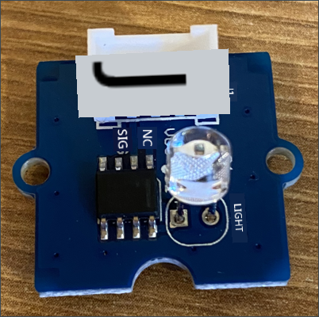
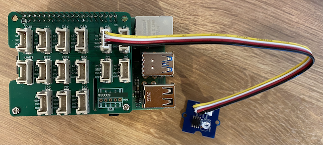

<!--
CO_OP_TRANSLATOR_METADATA:
{
  "original_hash": "ea733bd0cdf2479e082373f765a08678",
  "translation_date": "2025-11-18T18:40:50+00:00",
  "source_file": "1-getting-started/lessons/3-sensors-and-actuators/pi-sensor.md",
  "language_code": "pcm"
}
-->
# Build nightlight - Raspberry Pi

For dis part of di lesson, you go add light sensor to your Raspberry Pi.

## Hardware

Di sensor wey we go use for dis lesson na **light sensor** wey dey use [photodiode](https://wikipedia.org/wiki/Photodiode) to change light to electric signal. Dis na analog sensor wey dey send number value from 0 to 1,000 wey show how much light dey, but e no dey follow any standard measurement like [lux](https://wikipedia.org/wiki/Lux).

Di light sensor na external Grove sensor and e need make you connect am to di Grove Base hat wey dey di Raspberry Pi.

### Connect di light sensor

Di Grove light sensor wey we dey use to check di light level need make e connect to di Raspberry Pi.

#### Task - connect di light sensor

Connect di light sensor



1. Put one side of di Grove cable inside di socket wey dey di light sensor module. E go only fit enter one way.

1. When di Raspberry Pi dey off, connect di other side of di Grove cable to di analog socket wey dem mark **A0** for di Grove Base hat wey dey di Pi. Dis socket na di second one from di right, for di row of sockets wey dey near di GPIO pins.



## Program di light sensor

Now, you fit program di device wey dey use di Grove light sensor.

### Task - program di light sensor

Program di device.

1. Power di Pi and wait make e boot.

1. Open di nightlight project for VS Code wey you don create for di last part of dis assignment, whether e dey run directly for di Pi or e dey connect using di Remote SSH extension.

1. Open di `app.py` file and remove all di code wey dey inside.

1. Add dis code to di `app.py` file to import some libraries wey you need:

    ```python
    import time
    from grove.grove_light_sensor_v1_2 import GroveLightSensor
    ```

    Di `import time` statement dey bring di `time` module wey you go use later for dis assignment.

    Di `from grove.grove_light_sensor_v1_2 import GroveLightSensor` statement dey bring di `GroveLightSensor` from di Grove Python libraries. Dis library get code wey fit work with Grove light sensor, and dem don install am globally during di Pi setup.

1. Add dis code after di one wey dey above to create one instance of di class wey dey manage di light sensor:

    ```python
    light_sensor = GroveLightSensor(0)
    ```

    Di line `light_sensor = GroveLightSensor(0)` dey create one instance of di `GroveLightSensor` class wey dey connect to pin **A0** - di analog Grove pin wey di light sensor dey connect to.

1. Add one infinite loop after di code wey dey above to dey check di light sensor value and print am for di console:

    ```python
    while True:
        light = light_sensor.light
        print('Light level:', light)
    ```

    Dis one go read di current light level for scale of 0-1,023 using di `light` property of di `GroveLightSensor` class. Dis property dey read di analog value from di pin. Di value go then show for di console.

1. Add small sleep of one second for di end of di `loop` because you no need dey check di light level every time. Di sleep go help reduce di power wey di device dey use.

    ```python
    time.sleep(1)
    ```

1. From di VS Code Terminal, run dis command to run your Python app:

    ```sh
    python3 app.py
    ```

    Di light values go dey show for di console. Cover and uncover di light sensor, and di values go dey change:

    ```output
    pi@raspberrypi:~/nightlight $ python3 app.py 
    Light level: 634
    Light level: 634
    Light level: 634
    Light level: 230
    Light level: 104
    Light level: 290
    ```

> 💁 You fit find dis code for di [code-sensor/pi](../../../../../1-getting-started/lessons/3-sensors-and-actuators/code-sensor/pi) folder.

😀 Adding sensor to your nightlight program na success!

---

<!-- CO-OP TRANSLATOR DISCLAIMER START -->
**Disclaimer**:  
Dis dokyument don use AI translet service [Co-op Translator](https://github.com/Azure/co-op-translator) do di translet. Even as we dey try make am correct, abeg make you sabi say machine translet fit get mistake or no dey accurate well. Di original dokyument for im native language na di one wey you go take as di correct source. For important mata, e good make professional human translet am. We no go fit take blame for any misunderstanding or wrong interpretation wey fit happen because you use dis translet.
<!-- CO-OP TRANSLATOR DISCLAIMER END -->