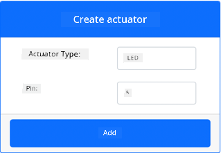
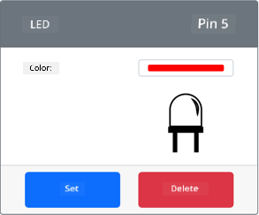

<!--
CO_OP_TRANSLATOR_METADATA:
{
  "original_hash": "9c640f93263fd9adbfda920739e09feb",
  "translation_date": "2025-11-18T18:43:27+00:00",
  "source_file": "1-getting-started/lessons/3-sensors-and-actuators/virtual-device-actuator.md",
  "language_code": "pcm"
}
-->
# Build nightlight - Virtual IoT Hardware

For dis part of di lesson, you go add LED to your virtual IoT device and use am to make nightlight.

## Virtual Hardware

Di nightlight need one actuator wey you go create for di CounterFit app.

Di actuator na **LED**. For real IoT device, e go be [light-emitting diode](https://wikipedia.org/wiki/Light-emitting_diode) wey dey shine light when current pass through am. Dis one na digital actuator wey get 2 states, on and off. If you send value of 1, e go turn di LED on, and if you send 0, e go turn am off.

Di nightlight logic for pseudo-code be:

```output
Check the light level.
If the light is less than 300
    Turn the LED on
Otherwise
    Turn the LED off
```

### Add di actuator to CounterFit

To use virtual LED, you go need add am to di CounterFit app.

#### Task - add di actuator to CounterFit

Add di LED to di CounterFit app.

1. Make sure say di CounterFit web app dey run from di last part of dis assignment. If e no dey run, start am again and re-add di light sensor.

1. Create LED:

    1. For di *Create actuator* box wey dey di *Actuator* pane, drop down di *Actuator type* box and choose *LED*.

    1. Set di *Pin* to *5*

    1. Click di **Add** button to create di LED for Pin 5.

    

    Di LED go dey created and e go show for di actuators list.

    

    Once di LED don dey created, you fit change di color using di *Color* picker. Click di **Set** button to change di color after you don select am.

### Program di nightlight

Now you fit program di nightlight using di CounterFit light sensor and LED.

#### Task - program di nightlight

Program di nightlight.

1. Open di nightlight project for VS Code wey you create for di last part of dis assignment. Kill and re-create di terminal to make sure say e dey run with di virtual environment if e dey necessary.

1. Open di `app.py` file.

1. Add dis code to di `app.py` file to import di required library. Put am for di top, under di other `import` lines.

    ```python
    from counterfit_shims_grove.grove_led import GroveLed
    ```

    Di `from counterfit_shims_grove.grove_led import GroveLed` statement dey import di `GroveLed` from di CounterFit Grove shim Python libraries. Dis library get code wey fit interact with LED wey you create for di CounterFit app.

1. Add dis code after di `light_sensor` declaration to create instance of di class wey dey manage di LED:

    ```python
    led = GroveLed(5)
    ```

    Di line `led = GroveLed(5)` dey create instance of di `GroveLed` class wey dey connect to pin **5** - di CounterFit Grove pin wey di LED dey connect to.

1. Add check inside di `while` loop, and before di `time.sleep` to check di light levels and turn di LED on or off:

    ```python
    if light < 300:
        led.on()
    else:
        led.off()
    ```

    Dis code dey check di `light` value. If e dey less than 300, e go call di `on` method of di `GroveLed` class wey go send digital value of 1 to di LED, make e turn on. If di light value dey greater than or equal to 300, e go call di `off` method, wey go send digital value of 0 to di LED, make e turn off.

    > 💁 Dis code suppose dey indented to di same level as di `print('Light level:', light)` line to dey inside di while loop!

1. From di VS Code Terminal, run dis command to run your Python app:

    ```sh
    python3 app.py
    ```

    Light values go dey show for di console.

    ```output
    (.venv) ➜  GroveTest python3 app.py 
    Light level: 143
    Light level: 244
    Light level: 246
    Light level: 253
    ```

1. Change di *Value* or di *Random* settings to make di light level dey above and below 300. Di LED go dey turn on and off.


> 💁 You fit find dis code for di [code-actuator/virtual-device](../../../../../1-getting-started/lessons/3-sensors-and-actuators/code-actuator/virtual-device) folder.

😀 Your nightlight program don work well!

---

<!-- CO-OP TRANSLATOR DISCLAIMER START -->
**Disclaimer**:  
Dis dokyument don translate wit AI translation service [Co-op Translator](https://github.com/Azure/co-op-translator). Even as we dey try make am accurate, abeg no forget say automatic translation fit get mistake or no dey correct well. Di original dokyument for im native language na di main correct source. For important information, e good make una use professional human translation. We no go fit take blame for any misunderstanding or wrong interpretation wey fit happen because una use dis translation.
<!-- CO-OP TRANSLATOR DISCLAIMER END -->