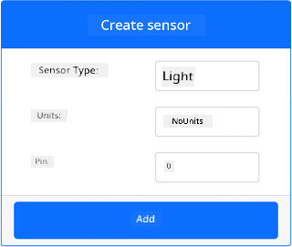

<!--
CO_OP_TRANSLATOR_METADATA:
{
  "original_hash": "11f10c6760fb8202cf368422702fdf70",
  "translation_date": "2025-11-18T18:42:12+00:00",
  "source_file": "1-getting-started/lessons/3-sensors-and-actuators/virtual-device-sensor.md",
  "language_code": "pcm"
}
-->
# Build Nightlight - Virtual IoT Hardware

For dis part of di lesson, you go add light sensor to your virtual IoT device.

## Virtual Hardware

Di nightlight need one sensor wey you go create for di CounterFit app.

Di sensor na **light sensor**. For real IoT device, e go be [photodiode](https://wikipedia.org/wiki/Photodiode) wey dey change light to electrical signal. Light sensors na analog sensors wey dey send integer value wey dey show how much light dey, but e no dey match any standard unit like [lux](https://wikipedia.org/wiki/Lux).

### Add di sensors to CounterFit

To use virtual light sensor, you go need add am to di CounterFit app.

#### Task - Add di sensors to CounterFit

Add di light sensor to di CounterFit app.

1. Make sure say di CounterFit web app dey run from di last part of dis assignment. If e no dey run, start am.

1. Create light sensor:

    1. For di *Create sensor* box wey dey di *Sensors* pane, drop di *Sensor type* box and select *Light*.

    1. Leave di *Units* as *NoUnits*.

    1. Make sure say di *Pin* dey set to *0*.

    1. Click di **Add** button to create di light sensor for Pin 0.

    

    Di light sensor go dey created and e go show for di sensors list.

    

## Program di light sensor

Now, di device fit dey programmed to use di built-in light sensor.

### Task - Program di light sensor

Program di device.

1. Open di nightlight project for VS Code wey you create for di last part of dis assignment. If necessary, kill and re-create di terminal to make sure say e dey run with di virtual environment.

1. Open di `app.py` file.

1. Add dis code to di top of `app.py` file with di rest of di `import` statements to import some libraries wey you need:

    ```python
    import time
    from counterfit_shims_grove.grove_light_sensor_v1_2 import GroveLightSensor
    ```

    Di `import time` statement dey bring in di Python `time` module wey you go use later for dis assignment.

    Di `from counterfit_shims_grove.grove_light_sensor_v1_2 import GroveLightSensor` statement dey bring in di `GroveLightSensor` from di CounterFit Grove shim Python libraries. Dis library get code to work with light sensor wey you create for di CounterFit app.

1. Add dis code to di bottom of di file to create instances of classes wey go manage di light sensor:

    ```python
    light_sensor = GroveLightSensor(0)
    ```

    Di line `light_sensor = GroveLightSensor(0)` dey create instance of di `GroveLightSensor` class wey dey connect to pin **0** - di CounterFit Grove pin wey di light sensor dey connect to.

1. Add infinite loop after di code wey dey above to dey check di light sensor value and print am for di console:

    ```python
    while True:
        light = light_sensor.light
        print('Light level:', light)
    ```

    Dis one go read di current light level using di `light` property of di `GroveLightSensor` class. Dis property dey read di analog value from di pin. Di value go then dey print for di console.

1. Add small sleep of one second for di end of di `while` loop because di light levels no need dey checked every time. Sleep dey help reduce di power wey di device dey use.

    ```python
    time.sleep(1)
    ```

1. From di VS Code Terminal, run dis command to run your Python app:

    ```sh
    python3 app.py
    ```

    Light values go dey show for di console. At first, di value go be 0.

1. From di CounterFit app, change di value of di light sensor wey di app go dey read. You fit do am in two ways:

    * Enter number for di *Value* box for di light sensor, then click di **Set** button. Di number wey you enter go be di value wey di sensor go return.

    * Check di *Random* checkbox, and enter *Min* and *Max* value, then click di **Set** button. Anytime di sensor read value, e go read random number between *Min* and *Max*.

    Di values wey you set go dey show for di console. Change di *Value* or di *Random* settings to make di value dey change.

    ```output
    (.venv) ➜  GroveTest python3 app.py 
    Light level: 143
    Light level: 244
    Light level: 246
    Light level: 253
    ```

> 💁 You fit find dis code for di [code-sensor/virtual-device](../../../../../1-getting-started/lessons/3-sensors-and-actuators/code-sensor/virtual-device) folder.

😀 Your nightlight program don work well!

---

<!-- CO-OP TRANSLATOR DISCLAIMER START -->
**Disclaimer**:  
Dis dokyument don use AI transle-shon service [Co-op Translator](https://github.com/Azure/co-op-translator) do di transle-shon. Even as we dey try make sure say e correct, abeg make you sabi say transle-shon wey machine do fit get mistake or no dey accurate. Di original dokyument for im native language na di one wey you go take as di correct source. For important mata, e good make professional human transle-shon dey use. We no go fit take blame for any misunderstanding or wrong interpretation wey fit happen because you use dis transle-shon.
<!-- CO-OP TRANSLATOR DISCLAIMER END -->