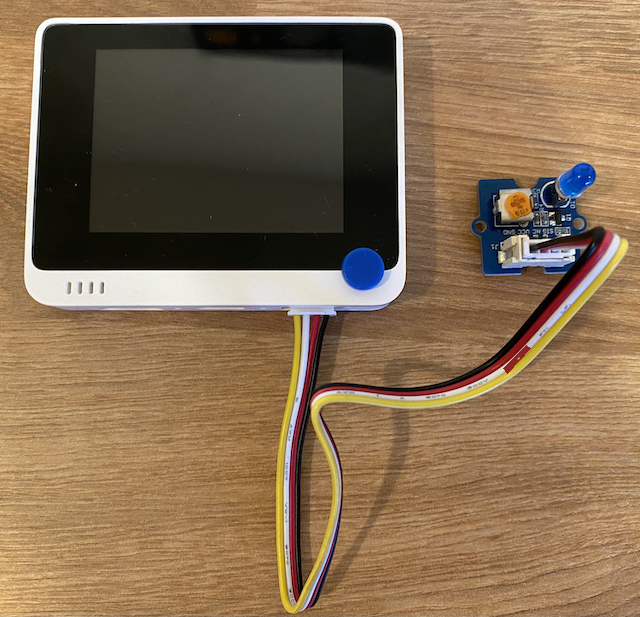

<!--
CO_OP_TRANSLATOR_METADATA:
{
  "original_hash": "db44083b4dc6fb06eac83c4f16448940",
  "translation_date": "2025-11-18T18:41:30+00:00",
  "source_file": "1-getting-started/lessons/3-sensors-and-actuators/wio-terminal-actuator.md",
  "language_code": "pcm"
}
-->
# Build nightlight - Wio Terminal

For dis part of di lesson, you go add LED to your Wio Terminal and use am to make nightlight.

## Hardware

Di nightlight need actuator now.

Di actuator na **LED**, na [light-emitting diode](https://wikipedia.org/wiki/Light-emitting_diode) wey dey shine light when current pass through am. E be digital actuator wey get 2 states, on and off. If you send value of 1, e go turn di LED on, and 0 go turn am off. Dis one na external Grove actuator wey need to connect to di Wio Terminal.

Di nightlight logic for pseudo-code be:

```output
Check the light level.
If the light is less than 300
    Turn the LED on
Otherwise
    Turn the LED off
```

### Connect di LED

Di Grove LED na module wey get different LEDs, so you fit choose di color wey you like.

#### Task - connect di LED

Connect di LED.


1. Choose di LED wey you like and put di legs inside di two holes for di LED module.

    LEDs na light-emitting diodes, and diodes na electronic device wey fit carry current only one way. Dis mean say di LED need to connect di correct way, if not e no go work.

    One leg of di LED na di positive pin, di other one na di negative pin. Di LED no dey perfectly round, e dey small flat for one side. Di small flat side na di negative pin. When you dey connect di LED to di module, make sure say di pin wey dey di round side connect to di socket wey dem mark **+** for di outside of di module, and di flat side connect to di socket wey dey close to di middle of di module.

1. Di LED module get spin button wey fit control di brightness. Turn am all di way up first by rotating am anti-clockwise as e fit go using small Phillips head screwdriver.

1. Put one end of Grove cable inside di socket for di LED module. E go only enter one way.

1. Make sure say di Wio Terminal no connect to your computer or any power supply, then connect di other end of di Grove cable to di right-hand side Grove socket for di Wio Terminal as you dey look di screen. Dis socket na di one wey far pass di power button.

    > 💁 Di right-hand Grove socket fit work with analog or digital sensors and actuators. Di left-hand socket na for I<sup>2</sup>C and digital sensors and actuators only. I<sup>2</sup>C go dey explain for later lesson.



## Program di nightlight

Now you fit program di nightlight using di built-in light sensor and di Grove LED.

### Task - program di nightlight

Program di nightlight.

1. Open di nightlight project for VS Code wey you create for di last part of dis assignment.

1. Add dis line to di bottom of di `setup` function:

    ```cpp
    pinMode(D0, OUTPUT);
    ```

    Dis line dey configure di pin wey dem dey use to communicate with di LED through di Grove port.

    Di `D0` pin na di digital pin for di right-hand Grove socket. Dis pin dey set to `OUTPUT`, meaning e dey connect to actuator and data go dey write to di pin.

1. Add dis code immediately before di `delay` for di loop function:

    ```cpp
    if (light < 300)
    {
        digitalWrite(D0, HIGH);
    }
    else
    {
        digitalWrite(D0, LOW);
    }
    ```

    Dis code dey check di `light` value. If e dey less than 300, e go send `HIGH` value to di `D0` digital pin. Dis `HIGH` na value of 1, e go turn di LED on. If di light dey 300 or more, e go send `LOW` value of 0 to di pin, e go turn di LED off.

    > 💁 When you dey send digital values to actuators, LOW value na 0v, and HIGH value na di max voltage for di device. For di Wio Terminal, di HIGH voltage na 3.3V.

1. Connect di Wio Terminal back to your computer, and upload di new code like you do before.

1. Connect di Serial Monitor. Di light values go dey show for di terminal.

    ```output
    > Executing task: platformio device monitor <

    --- Available filters and text transformations: colorize, debug, default, direct, hexlify, log2file, nocontrol, printable, send_on_enter, time
    --- More details at http://bit.ly/pio-monitor-filters
    --- Miniterm on /dev/cu.usbmodem101  9600,8,N,1 ---
    --- Quit: Ctrl+C | Menu: Ctrl+T | Help: Ctrl+T followed by Ctrl+H ---
    Light value: 4
    Light value: 5
    Light value: 4
    Light value: 158
    Light value: 343
    Light value: 348
    Light value: 344
    ```

1. Cover and uncover di light sensor. You go notice say di LED go light up if di light level dey 300 or less, and e go off when di light level dey more than 300.


> 💁 You fit find dis code for di [code-actuator/wio-terminal](../../../../../1-getting-started/lessons/3-sensors-and-actuators/code-actuator/wio-terminal) folder.

😀 Your nightlight program work well!

---

<!-- CO-OP TRANSLATOR DISCLAIMER START -->
**Disclaimer**:  
Dis dokyument don use AI transleto service [Co-op Translator](https://github.com/Azure/co-op-translator) do di translation. Even as we dey try make am accurate, abeg sabi say machine translation fit get mistake or no dey correct well. Di original dokyument wey dey im native language na di main source wey you go trust. For important mata, e better make professional human transleto check am. We no go fit take blame for any misunderstanding or wrong interpretation wey fit happen because you use dis translation.
<!-- CO-OP TRANSLATOR DISCLAIMER END -->