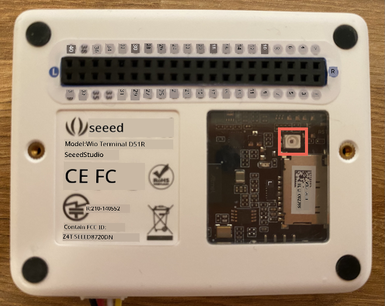

<!--
CO_OP_TRANSLATOR_METADATA:
{
  "original_hash": "7f4ad0ef54f248b85b92187c94cf9dcb",
  "translation_date": "2025-11-18T18:44:28+00:00",
  "source_file": "1-getting-started/lessons/3-sensors-and-actuators/wio-terminal-sensor.md",
  "language_code": "pcm"
}
-->
# Add sensor - Wio Terminal

For dis part of di lesson, you go use di light sensor wey dey your Wio Terminal.

## Hardware

Di sensor for dis lesson na **light sensor** wey dey use [photodiode](https://wikipedia.org/wiki/Photodiode) to change light to electric signal. Dis na analog sensor wey dey send number value from 0 to 1,023 wey show how much light dey, but e no dey match any standard measurement like [lux](https://wikipedia.org/wiki/Lux).

Di light sensor dey inside di Wio Terminal and you fit see am through di clear plastic window wey dey di back.



## Program di light sensor

Di device fit now dey programmed to use di built-in light sensor.

### Task

Program di device.

1. Open di nightlight project for VS Code wey you don create for di last part of dis assignment.

1. Add dis line for di bottom of di `setup` function:

    ```cpp
    pinMode(WIO_LIGHT, INPUT);
    ```

    Dis line dey set di pins wey go work with di sensor hardware.

    Di `WIO_LIGHT` pin na di number of di GPIO pin wey connect to di onboard light sensor. Dis pin dey set to `INPUT`, meaning say e dey connect to sensor and e go read data from di pin.

1. Delete wetin dey inside di `loop` function.

1. Add dis code for di empty `loop` function.

    ```cpp
    int light = analogRead(WIO_LIGHT);
    Serial.print("Light value: ");
    Serial.println(light);
    ```

    Dis code dey read analog value from di `WIO_LIGHT` pin. E dey read value from 0-1,023 from di onboard light sensor. Di value go then dey send to di serial port so you fit read am for di Serial Monitor when dis code dey run. `Serial.print` dey write di text without new line for di end, so each line go start with `Light value:` and end with di actual light value.

1. Add small delay of one second (1,000ms) for di end of di `loop` because light levels no need to dey check every time. Delay dey help reduce di power wey di device dey use.

    ```cpp
    delay(1000);
    ```

1. Connect di Wio Terminal back to your computer, and upload di new code like you don do before.

1. Connect di Serial Monitor. Light values go dey show for di terminal. Cover and uncover di light sensor wey dey di back of di Wio Terminal, and di values go dey change.

    ```output
    > Executing task: platformio device monitor <

    --- Available filters and text transformations: colorize, debug, default, direct, hexlify, log2file, nocontrol, printable, send_on_enter, time
    --- More details at http://bit.ly/pio-monitor-filters
    --- Miniterm on /dev/cu.usbmodem101  9600,8,N,1 ---
    --- Quit: Ctrl+C | Menu: Ctrl+T | Help: Ctrl+T followed by Ctrl+H ---
    Light value: 4
    Light value: 5
    Light value: 4
    Light value: 158
    Light value: 343
    Light value: 348
    Light value: 344
    ```

> 💁 You fit find dis code for di [code-sensor/wio-terminal](../../../../../1-getting-started/lessons/3-sensors-and-actuators/code-sensor/wio-terminal) folder.

😀 Adding sensor to your nightlight program na success!

---

<!-- CO-OP TRANSLATOR DISCLAIMER START -->
**Disclaimer**:  
Dis dokyument don use AI translation service [Co-op Translator](https://github.com/Azure/co-op-translator) do di translation. Even as we dey try make am accurate, abeg sabi say automated translations fit get mistake or no dey correct well. Di original dokyument for im native language na di main source wey you go fit trust. For important information, e good make professional human translation dey use. We no go fit take blame for any misunderstanding or wrong interpretation wey fit happen because you use dis translation.
<!-- CO-OP TRANSLATOR DISCLAIMER END -->