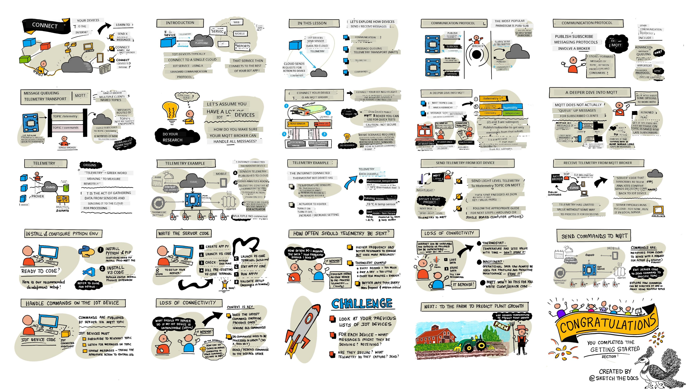
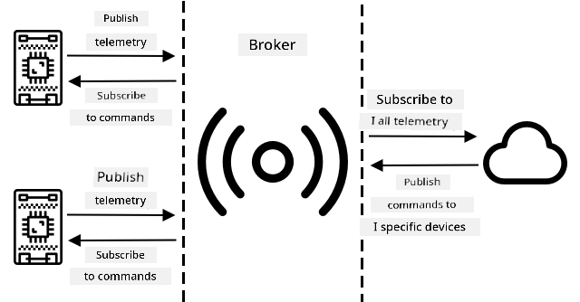
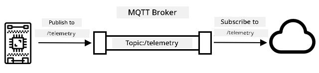
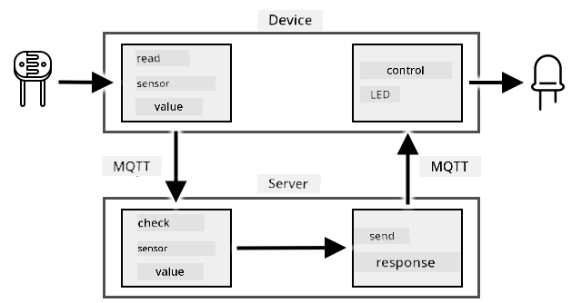
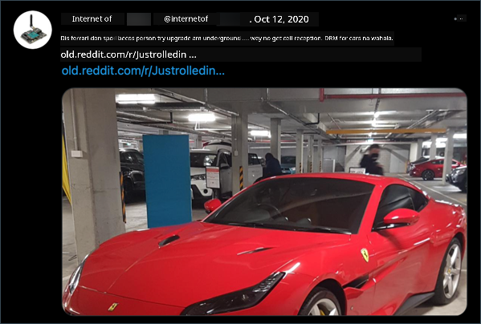

<!--
CO_OP_TRANSLATOR_METADATA:
{
  "original_hash": "71b5040e0b3472f1c0949c9b55f224c0",
  "translation_date": "2025-11-18T18:29:00+00:00",
  "source_file": "1-getting-started/lessons/4-connect-internet/README.md",
  "language_code": "pcm"
}
-->
# Connect your device to di Internet



> Sketchnote by [Nitya Narasimhan](https://github.com/nitya). Click di image for bigger version.

Dis lesson na part of di [Hello IoT series](https://youtube.com/playlist?list=PLmsFUfdnGr3xRts0TIwyaHyQuHaNQcb6-) wey di [Microsoft Reactor](https://developer.microsoft.com/reactor/?WT.mc_id=academic-17441-jabenn) teach. Di lesson get two videos - one 1-hour lesson, and one 1-hour office hour wey go deep into di lesson and answer questions.

[](https://youtu.be/O4dd172mZhs)

[](https://youtu.be/j-cVCzRDE2Q)

> 🎥 Click di images above to watch di videos

## Pre-lecture quiz

[Pre-lecture quiz](https://black-meadow-040d15503.1.azurestaticapps.net/quiz/7)

## Introduction

Di **I** for IoT mean **Internet** - na di cloud connectivity and services wey dey make plenty IoT device features possible, like to gather measurements from sensors wey connect to di device, or to send message wey go control actuators. IoT devices dey usually connect to one cloud IoT service wey dey use standard communication protocol, and di service dey connect to di rest of your IoT application, like AI services to make smart decisions with your data, or web apps for control or reporting.

> 🎓 Data wey sensors gather and send go cloud na wetin dem dey call telemetry.

IoT devices fit receive message from di cloud. Di message fit carry commands - instructions to do something either inside di device (like reboot or update firmware), or with actuator (like to on light).

Dis lesson go show you some communication protocols wey IoT devices fit use to connect to di cloud, and di kind data dem fit send or receive. You go also try am yourself, add internet control to your nightlight, and move di LED control logic go 'server' code wey go dey run for your local machine.

For dis lesson, we go talk about:

* [Communication protocols](../../../../../1-getting-started/lessons/4-connect-internet)
* [Message Queueing Telemetry Transport (MQTT)](../../../../../1-getting-started/lessons/4-connect-internet)
* [Telemetry](../../../../../1-getting-started/lessons/4-connect-internet)
* [Commands](../../../../../1-getting-started/lessons/4-connect-internet)

## Communication protocols

Plenty popular communication protocols dey wey IoT devices dey use to talk with di Internet. Di most popular ones dey use publish/subscribe messaging through broker. Di IoT devices go connect to di broker, publish telemetry, and subscribe to commands. Di cloud services go also connect to di broker, subscribe to all di telemetry messages, and publish commands to specific devices or groups of devices.



MQTT na di most popular communication protocol for IoT devices and we go talk about am for dis lesson. Other protocols include AMQP and HTTP/HTTPS.

## Message Queueing Telemetry Transport (MQTT)

[MQTT](http://mqtt.org) na lightweight, open standard messaging protocol wey fit send messages between devices. Dem design am for 1999 to monitor oil pipelines, before IBM release am as open standard 15 years later.

MQTT get one broker and plenty clients. All di clients go connect to di broker, and di broker go route messages to di clients wey need am. Messages dey route using named topics, instead of sending directly to one client. Client fit publish to one topic, and any client wey subscribe to dat topic go receive di message.



✅ Do small research. If you get plenty IoT devices, how you go make sure say your MQTT broker fit handle all di messages?

### Connect your IoT device to MQTT

Di first step to add Internet control to your nightlight na to connect am to MQTT broker.

#### Task

Connect your device to MQTT broker.

For dis part of di lesson, you go connect your IoT nightlight to di internet so you fit control am remotely. Later for dis lesson, your IoT device go send telemetry message through MQTT to public MQTT broker with di light level, and server code wey you go write go pick am up. Di code go check di light level and send command message back to di device to tell am to on or off di LED.

For real life, dis kind setup fit dey useful to gather data from plenty light sensors before deciding to on lights, like for stadium wey get plenty lights. E fit stop di lights from on if only one sensor dey under cloud or bird, but di other sensors dey detect enough light.

✅ Wetin be other situations wey go need data from plenty sensors before dem send commands?

Instead of setting up MQTT broker for dis assignment, you fit use public test server wey dey run [Eclipse Mosquitto](https://www.mosquitto.org), open-source MQTT broker. Dis test broker dey public for [test.mosquitto.org](https://test.mosquitto.org), and you no need account to use am, so e good for testing MQTT clients and servers.

> 💁 Dis test broker dey public and e no secure. Anybody fit dey listen to wetin you publish, so no use am for private data.



Follow di step wey concern you to connect your device to di MQTT broker:

* [Arduino - Wio Terminal](wio-terminal-mqtt.md)
* [Single-board computer - Raspberry Pi/Virtual IoT device](single-board-computer-mqtt.md)

### A deeper dive into MQTT

Topics fit get hierarchy, and clients fit subscribe to different levels of di hierarchy using wildcards. For example, you fit send temperature telemetry messages to di `/telemetry/temperature` topic and humidity messages to di `/telemetry/humidity` topic, then for your cloud app subscribe to di `/telemetry/*` topic to receive both di temperature and humidity telemetry messages.

Messages fit get quality of service (QoS), wey go determine di guarantee say di message go deliver.

* At most once - di message go send only once and di client and broker no go do extra steps to confirm delivery (fire and forget).
* At least once - di sender go retry di message many times until e get confirmation (acknowledged delivery).
* Exactly once - di sender and receiver go do two-level handshake to make sure say only one copy of di message go deliver (assured delivery).

✅ Wetin be di kind situations wey go need assured delivery message instead of fire and forget message?

Even though di name na Message Queueing (MQTT), e no really support message queues. Dis mean say if client disconnect, then reconnect, e no go receive messages wey dem send during di disconnection, except di ones wey e don already start to process using di QoS process. Messages fit get retained flag. If dem set dis flag, di MQTT broker go store di last message wey dem send on di topic and send am to any client wey later subscribe to di topic. Dis way, di clients go always get di latest message.

MQTT also get keep alive function wey dey check if di connection still dey alive during long gaps between messages.

> 🦟 [Mosquitto from di Eclipse Foundation](https://mosquitto.org) get free MQTT broker wey you fit run by yourself to experiment with MQTT, and public MQTT broker wey you fit use to test your code, hosted for [test.mosquitto.org](https://test.mosquitto.org).

MQTT connections fit dey public and open, or encrypted and secured using usernames and passwords, or certificates.

> 💁 MQTT dey communicate through TCP/IP, di same network protocol wey HTTP dey use, but for different port. You fit also use MQTT over websockets to communicate with web apps wey dey run for browser, or for situations wey firewalls or other network rules dey block standard MQTT connections.

## Telemetry

Di word telemetry come from Greek roots wey mean to measure remotely. Telemetry na di act of gathering data from sensors and sending am go cloud.

> 💁 One of di first telemetry devices dem invent am for France for 1874 and e dey send real-time weather and snow depths from Mont Blanc go Paris. E use physical wires because wireless technology no dey dat time.

Make we look di example of di smart thermostat from Lesson 1.


Di thermostat get temperature sensors to gather telemetry. E go most likely get one temperature sensor inside, and e fit connect to plenty external temperature sensors through wireless protocol like [Bluetooth Low Energy](https://wikipedia.org/wiki/Bluetooth_Low_Energy) (BLE).

Example of di telemetry data wey e fit send be:

| Name | Value | Description |
| ---- | ----- | ----------- |
| `thermostat_temperature` | 18°C | Di temperature wey di thermostat's built-in temperature sensor measure |
| `livingroom_temperature` | 19°C | Di temperature wey remote temperature sensor measure, wey dem name `livingroom` to show di room wey e dey |
| `bedroom_temperature` | 21°C | Di temperature wey remote temperature sensor measure, wey dem name `bedroom` to show di room wey e dey |

Di cloud service fit use dis telemetry data to decide wetin commands to send to control di heating.

### Send telemetry from your IoT device

Di next step to add Internet control to your nightlight na to send di light level telemetry go MQTT broker for telemetry topic.

#### Task - send telemetry from your IoT device

Send light level telemetry go MQTT broker.

Data dey encode as JSON - short for JavaScript Object Notation, standard way to encode data as text using key/value pairs.

✅ If JSON no dey familiar to you, you fit learn more about am for [JSON.org documentation](https://www.json.org/).

Follow di step wey concern you to send telemetry from your device go MQTT broker:

* [Arduino - Wio Terminal](wio-terminal-telemetry.md)
* [Single-board computer - Raspberry Pi/Virtual IoT device](single-board-computer-telemetry.md)

### Receive telemetry from di MQTT broker

E no make sense to dey send telemetry if nothing dey to listen to am. Di light level telemetry need something wey go dey listen to am to process di data. Dis 'server' code na di kind code wey you go deploy to cloud service as part of bigger IoT application, but for here you go run am locally for your computer (or for your Pi if na there you dey code). Di server code na Python app wey dey listen to telemetry messages through MQTT with light levels. Later for dis lesson, you go make am reply with command message wey go tell di LED to on or off.

✅ Do small research: Wetin go happen to MQTT messages if no listener dey?

#### Install Python and VS Code

If you no get Python and VS Code for your computer, you go need install dem to code di server. If you dey use virtual IoT device, or you dey work for your Raspberry Pi, you fit skip dis step because you suppose don already get am installed and configured.

##### Task - install Python and VS Code

Install Python and VS Code.

1. Install Python. Check di [Python downloads page](https://www.python.org/downloads/) for instructions on how to install di latest version of Python.

1. Install Visual Studio Code (VS Code). Na di editor wey you go use to write your virtual device code for Python. Check di [VS Code documentation](https://code.visualstudio.com?WT.mc_id=academic-17441-jabenn) for instructions on how to install VS Code.

    > 💁 You fit use any Python IDE or editor wey you like for dis lessons, but di instructions go dey based on VS Code.

1. Install di VS Code Pylance extension. Dis extension dey give Python language support for VS Code. Check di [Pylance extension documentation](https://marketplace.visualstudio.com/items?WT.mc_id=academic-17441-jabenn&itemName=ms-python.vscode-pylance) for instructions on how to install dis extension for VS Code.

#### Configure a Python virtual environment
One strong thing wey Python fit do na say e fit make you install [pip packages](https://pypi.org) - dis na code wey other people don write and put for internet. You fit install pip package for your computer with one command, then use am for your code. You go use pip to install one package wey go help you talk over MQTT.

Normally, when you install package, e go dey available everywhere for your computer, but dis fit cause wahala with package versions - like one app wey need one version of package go spoil if you install new version for another app. To avoid dis wahala, you fit use [Python virtual environment](https://docs.python.org/3/library/venv.html), wey be like copy of Python for one folder, and when you install pip packages, dem go dey only for dat folder.

##### Task - set up Python virtual environment

Set up Python virtual environment and install MQTT pip packages.

1. For your terminal or command line, run dis command for any place wey you like to create and enter new directory:

    ```sh
    mkdir nightlight-server
    cd nightlight-server
    ```

1. Run dis command to create virtual environment for `.venv` folder:

    ```sh
    python3 -m venv .venv
    ```

    > 💁 You need to use `python3` to create virtual environment because if you get Python 2 join Python 3 (wey be latest version), calling `python` go use Python 2 instead of Python 3.

1. Activate the virtual environment:

    * For Windows:
        * If you dey use Command Prompt or Command Prompt through Windows Terminal, run:

            ```cmd
            .venv\Scripts\activate.bat
            ```

        * If you dey use PowerShell, run:

            ```powershell
            .\.venv\Scripts\Activate.ps1
            ```

    * For macOS or Linux, run:

        ```cmd
        source ./.venv/bin/activate
        ```

    > 💁 Make sure say you dey for same place wey you run the command to create virtual environment. You no need to enter `.venv` folder, just run the activate command and any command to install packages or run code from the folder wey you dey when you create the virtual environment.

1. Once you don activate the virtual environment, the default `python` command go run the Python version wey dem use create the virtual environment. Run dis command to check the version:

    ```sh
    python --version
    ```

    The output go look like dis:

    ```output
    (.venv) ➜  nightlight-server python --version
    Python 3.9.1
    ```

    > 💁 Your Python version fit dey different - as long as e be version 3.6 or higher, you dey okay. If not, delete dis folder, install newer Python version and try again.

1. Run dis command to install pip package for [Paho-MQTT](https://pypi.org/project/paho-mqtt/), wey be popular MQTT library.

    ```sh
    pip install paho-mqtt
    ```

    Dis pip package go dey only for the virtual environment, e no go dey available outside am.

#### Write server code

Now you fit write server code for Python.

##### Task - write server code

Write server code.

1. For your terminal or command line, run dis command inside the virtual environment to create Python file wey dem call `app.py`:

    * For Windows, run:

        ```cmd
        type nul > app.py
        ```

    * For macOS or Linux, run:

        ```cmd
        touch app.py
        ```

1. Open the current folder for VS Code:

    ```sh
    code .
    ```

1. When VS Code open, e go activate the Python virtual environment. You go see am for the bottom status bar:

    

1. If VS Code Terminal dey already run when VS Code start, e no go activate the virtual environment for am. The easiest way na to kill the terminal using **Kill the active terminal instance** button:

    

1. Open new VS Code Terminal by selecting *Terminal -> New Terminal, or pressing `` CTRL+` ``. The new terminal go load the virtual environment, and you go see the activate command for the terminal. The name of the virtual environment (`.venv`) go dey for the prompt:

    ```output
    ➜  nightlight-server source .venv/bin/activate
    (.venv) ➜  nightlight 
    ```

1. Open the `app.py` file from VS Code explorer and add dis code:

    ```python
    import json
    import time
    
    import paho.mqtt.client as mqtt
    
    id = '<ID>'
    
    client_telemetry_topic = id + '/telemetry'
    client_name = id + 'nightlight_server'
    
    mqtt_client = mqtt.Client(client_name)
    mqtt_client.connect('test.mosquitto.org')
    
    mqtt_client.loop_start()
    
    def handle_telemetry(client, userdata, message):
        payload = json.loads(message.payload.decode())
        print("Message received:", payload)
    
    mqtt_client.subscribe(client_telemetry_topic)
    mqtt_client.on_message = handle_telemetry
    
    while True:
        time.sleep(2)
    ```

    Change `<ID>` for line 6 to the unique ID wey you use when you create your device code.

    ⚠️ Dis **must** be the same ID wey you use for your device, or the server code no go subscribe or publish to the correct topic.

    Dis code go create MQTT client with unique name, connect to *test.mosquitto.org* broker, and start processing loop wey dey run for background thread dey listen for messages for any subscribed topics.

    The client go subscribe to messages for telemetry topic, and e go define function wey dem go call when message land. When telemetry message land, the `handle_telemetry` function go run, print the message wey e receive for console.

    Finally, infinite loop go keep the app dey run. The MQTT client dey listen to messages for background thread and e go dey run as long as the main app dey run.

1. From VS Code terminal, run dis command to run your Python app:

    ```sh
    python app.py
    ```

    The app go start dey listen to messages from the IoT device.

1. Make sure say your device dey run and dey send telemetry messages. Adjust the light levels wey your physical or virtual device dey detect. Messages wey dem receive go dey print for terminal.

    ```output
    (.venv) ➜  nightlight-server python app.py
    Message received: {'light': 0}
    Message received: {'light': 400}
    ```

    The app.py file for nightlight virtual environment gatz dey run for the app.py file for nightlight-server virtual environment to fit receive the messages wey dem dey send.

> 💁 You fit find dis code for [code-server/server](../../../../../1-getting-started/lessons/4-connect-internet/code-server/server) folder.

### How often telemetry go dey send?

One important thing for telemetry na how often you go measure and send the data? The answer na - e depend. If you measure often, you fit respond quick to changes, but e go use more power, more bandwidth, generate more data and need more cloud resources to process. You gatz measure often enough, but no too much.

For thermostat, measuring every few minutes fit dey okay because temperature no dey change often. If you measure once a day, you fit dey heat your house for night temperature for middle of sunny day, but if you measure every second, you go get thousands of unnecessary temperature measurements wey go slow down Internet speed, use more power (problem for battery-powered devices), and increase cost for cloud computing resources.

If you dey monitor machine for factory wey fit cause big damage if e spoil, measuring multiple times per second fit dey necessary. E better make you waste bandwidth than miss telemetry wey fit show say machine need repair before e spoil.

> 💁 For dis kind situation, you fit use edge device to process telemetry first to reduce Internet wahala.

### Loss of connectivity

Internet connection fit dey unreliable, with outages dey happen. Wetin IoT device go do if dis kind thing happen - e go lose the data or e go store am till connection come back? Again, e depend.

For thermostat, the data fit dey lost as soon as new temperature measurement don dey. The heating system no go care say 20 minutes ago e be 20.5°C if the temperature now na 19°C, na the temperature now go determine if heating go dey on or off.

For machine, you fit wan keep the data, especially if e dey used to check trends. Machine learning models fit detect anomalies for data streams by looking over data for defined time (like last hour) and spotting strange data. Dis dey used for predictive maintenance, to check if something fit spoil soon so you fit repair or replace am before e happen. You fit wan send every telemetry for machine so e fit process for anomaly detection, so once IoT device reconnect, e go send all telemetry wey e generate during Internet outage.

IoT device designers gatz think if IoT device fit dey useful during Internet outage or loss of signal because of location. Smart thermostat fit make small decisions to control heating if e no fit send telemetry to cloud because of outage.

[](https://twitter.com/internetofshit/status/1315736960082808832)

For MQTT to handle loss of connectivity, the device and server code go gatz make sure say message delivery dey happen if e dey needed, like requiring all messages wey dem send to get reply for reply topic, and if e no get reply, dem go queue am manually to send later.

## Commands

Commands na messages wey cloud dey send to device, dey tell am wetin to do. Most times, e dey involve giving output through actuator, but e fit be instruction for the device itself, like to reboot or gather extra telemetry and send am back.


Thermostat fit receive command from cloud to turn heating on. Based on telemetry data from sensors, if cloud service don decide say heating gatz dey on, e go send the command.

### Send commands to MQTT broker

The next step for our Internet-controlled nightlight na for server code to send command back to IoT device to control light based on the light levels e dey sense.

1. Open the server code for VS Code

1. Add dis line after the `client_telemetry_topic` declaration to define topic to send commands:

    ```python
    server_command_topic = id + '/commands'
    ```

1. Add dis code to the end of `handle_telemetry` function:

    ```python
    command = { 'led_on' : payload['light'] < 300 }
    print("Sending message:", command)
    
    client.publish(server_command_topic, json.dumps(command))
    ```

    Dis go send JSON message to command topic with `led_on` value set to true or false depending on if light dey less than 300 or not. If light dey less than 300, e go send true to tell device to turn LED on.

1. Run the code as before

1. Adjust the light levels wey your physical or virtual device dey detect. Messages wey dem receive and commands wey dem send go dey show for terminal:

    ```output
    (.venv) ➜  nightlight-server python app.py
    Message received: {'light': 0}
    Sending message: {'led_on': True}
    Message received: {'light': 400}
    Sending message: {'led_on': False}
    ```

> 💁 The telemetry and commands dey send for single topic each. Dis mean telemetry from many devices go dey show for same telemetry topic, and commands to many devices go dey show for same commands topic. If you wan send command to one device, you fit use many topics, wey get unique device id, like `/commands/device1`, `/commands/device2`. Dis way, device fit dey listen to messages wey dem send only to am.

> 💁 You fit find dis code for [code-commands/server](../../../../../1-getting-started/lessons/4-connect-internet/code-commands/server) folder.

### Handle commands for IoT device

Now wey commands dey sent from server, you fit add code for IoT device to handle dem and control LED.

Follow the step wey match your device to listen to commands from MQTT broker:

* [Arduino - Wio Terminal](wio-terminal-commands.md)
* [Single-board computer - Raspberry Pi/Virtual IoT device](single-board-computer-commands.md)

Once dis code don dey written and dey run, try change light levels. Check the output from server and device, and check the LED as you dey change light levels.

### Loss of connectivity

Wetin cloud service go do if e need send command to IoT device wey no dey online? Again, e depend.

If latest command dey override earlier one, dem fit ignore the earlier ones. If cloud service send command to turn heating on, then send command to turn am off, dem fit ignore the on command and no resend am.

If commands gatz dey processed in order, like move robot arm up, then close grabber, dem gatz send am in order once connection come back.

✅ How device or server code fit make sure say commands dey always sent and handled in order over MQTT if e dey needed?

---

## 🚀 Challenge

The challenge for the last three lessons na to list as many IoT devices wey dey your house, school or work, and decide if dem dey built around microcontrollers or single-board computers, or even mix of both, and think about the sensors and actuators wey dem dey use.

For dis devices, think about the messages wey dem fit dey send or receive. Wetin telemetry dem dey send? Wetin messages or commands dem fit dey receive? You think say dem dey secure?

## Post-lecture quiz
[Post-lecture quiz](https://black-meadow-040d15503.1.azurestaticapps.net/quiz/8)

## Review & Self Study

Make you read more about MQTT for [MQTT Wikipedia page](https://wikipedia.org/wiki/MQTT).

Try make MQTT broker by yasef using [Mosquitto](https://www.mosquitto.org) and connect am to your IoT device and server code.

> 💁 Tip - normally, Mosquitto no dey allow anonymous connections (wey mean say you no fit connect without username and password), e no dey allow connections from outside di computer wey e dey run on top.
> You fit fix dis one with [`mosquitto.conf` config file](https://www.mosquitto.org/man/mosquitto-conf-5.html) wey get dis:
>
> ```sh
> listener 1883 0.0.0.0
> allow_anonymous true
> ```

## Assignment

[Compare and contrast MQTT with other communication protocols](assignment.md)

---

<!-- CO-OP TRANSLATOR DISCLAIMER START -->
**Disclaimer**:  
Dis docu don dey translate wit AI translation service [Co-op Translator](https://github.com/Azure/co-op-translator). Even though we dey try make am accurate, abeg sabi say automated translations fit get mistake or no dey 100% correct. Di original docu for di native language na di main correct source. For important information, e better make una use professional human translation. We no go fit take blame for any misunderstanding or wrong interpretation wey fit happen because of dis translation.
<!-- CO-OP TRANSLATOR DISCLAIMER END -->