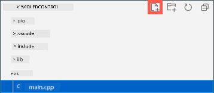

<!--
CO_OP_TRANSLATOR_METADATA:
{
  "original_hash": "d6faf0e8d3c2d6d20c0aef2a305dab18",
  "translation_date": "2025-11-18T18:27:41+00:00",
  "source_file": "1-getting-started/lessons/4-connect-internet/wio-terminal-mqtt.md",
  "language_code": "pcm"
}
-->
# Control your nightlight for Internet - Wio Terminal

Di IoT device go need code wey go make am fit connect wit *test.mosquitto.org* using MQTT to send telemetry values wit di light sensor reading, and receive commands to control di LED.

For dis part of di lesson, you go connect your Wio Terminal to one MQTT broker.

## Install di WiFi and MQTT Arduino libraries

To fit connect wit di MQTT broker, you go need install some Arduino libraries wey go make you use di WiFi chip for di Wio Terminal, and connect wit MQTT. When you dey develop for Arduino devices, you fit use plenty libraries wey get open-source code and fit do many things. Seeed dey publish libraries for Wio Terminal wey go make am fit connect wit WiFi. Other developers don publish libraries wey go make am fit connect wit MQTT brokers, and you go use dem wit your device.

Dis libraries dey as source code wey fit dey imported automatically into PlatformIO and compiled for your device. Dis way, Arduino libraries go work for any device wey support di Arduino framework, as long as di device get di hardware wey di library need. Some libraries, like di Seeed WiFi libraries, dey specific to some hardware.

Libraries fit dey installed globally and compiled if e dey needed, or into one specific project. For dis assignment, di libraries go dey installed into di project.

✅ You fit learn more about library management and how to find and install libraries for di [PlatformIO library documentation](https://docs.platformio.org/en/latest/librarymanager/index.html).

### Task - install di WiFi and MQTT Arduino libraries

Install di Arduino libraries.

1. Open di nightlight project for VS Code.

1. Add di following for di end of di `platformio.ini` file:

    ```ini
    lib_deps =
        seeed-studio/Seeed Arduino rpcWiFi @ 1.0.5
        seeed-studio/Seeed Arduino FS @ 2.1.1
        seeed-studio/Seeed Arduino SFUD @ 2.0.2
        seeed-studio/Seeed Arduino rpcUnified @ 2.1.3
        seeed-studio/Seeed_Arduino_mbedtls @ 3.0.1
    ```

    Dis one dey import di Seeed WiFi libraries. Di `@ <number>` syntax dey refer to one specific version number of di library.

    > 💁 You fit remove di `@ <number>` to always use di latest version of di libraries, but e no sure say di later versions go work wit di code wey dey below. Di code wey dey here don dey tested wit dis version of di libraries.

    Na all dis you need do to add di libraries. Next time wey PlatformIO go build di project, e go download di source code for dis libraries and compile am into your project.

1. Add di following for di `lib_deps`:

    ```ini
    knolleary/PubSubClient @ 2.8
    ```

    Dis one dey import [PubSubClient](https://github.com/knolleary/pubsubclient), one Arduino MQTT client.

## Connect to WiFi

Di Wio Terminal fit now dey connected to WiFi.

### Task - connect to WiFi

Connect di Wio Terminal to WiFi.

1. Create one new file for di `src` folder wey you go call `config.h`. You fit do dis by selecting di `src` folder, or di `main.cpp` file wey dey inside, and selecting di **New file** button for di explorer. Dis button go only show when your cursor dey over di explorer.

    

1. Add di following code for dis file to define constants for your WiFi credentials:

    ```cpp
    #pragma once

    #include <string>
    
    using namespace std;
    
    // WiFi credentials
    const char *SSID = "<SSID>";
    const char *PASSWORD = "<PASSWORD>";
    ```

    Replace `<SSID>` wit di SSID of your WiFi. Replace `<PASSWORD>` wit your WiFi password.

1. Open di `main.cpp` file.

1. Add di following `#include` directives for di top of di file:

    ```cpp
    #include <PubSubClient.h>
    #include <rpcWiFi.h>
    #include <SPI.h>
    
    #include "config.h"
    ```

    Dis one dey include header files for di libraries wey you don add before, plus di config header file. Dis header files dey needed to tell PlatformIO to bring di code from di libraries. If you no explicitly include dis header files, some code no go dey compiled in and you go get compiler errors.

1. Add di following code above di `setup` function:

    ```cpp
    void connectWiFi()
    {
        while (WiFi.status() != WL_CONNECTED)
        {
            Serial.println("Connecting to WiFi..");
            WiFi.begin(SSID, PASSWORD);
            delay(500);
        }
    
        Serial.println("Connected!");
    }
    ```

    Dis code dey loop while di device no dey connected to WiFi, and e dey try connect using di SSID and password from di config header file.

1. Add one call to dis function for di bottom of di `setup` function, after di pins don dey configured.

    ```cpp
    connectWiFi();
    ```

1. Upload dis code to your device to check say di WiFi connection dey work. You go see dis for di serial monitor.

    ```output
    > Executing task: platformio device monitor <
    
    --- Available filters and text transformations: colorize, debug, default, direct, hexlify, log2file, nocontrol, printable, send_on_enter, time
    --- More details at http://bit.ly/pio-monitor-filters
    --- Miniterm on /dev/cu.usbmodem1101  9600,8,N,1 ---
    --- Quit: Ctrl+C | Menu: Ctrl+T | Help: Ctrl+T followed by Ctrl+H ---
    Connecting to WiFi..
    Connected!
    ```

## Connect to MQTT

Once di Wio Terminal don connect to WiFi, e fit connect to di MQTT broker.

### Task - connect to MQTT

Connect to di MQTT broker.

1. Add di following code for di bottom of di `config.h` file to define di connection details for di MQTT broker:

    ```cpp
    // MQTT settings
    const string ID = "<ID>";
    
    const string BROKER = "test.mosquitto.org";
    const string CLIENT_NAME = ID + "nightlight_client";
    ```

    Replace `<ID>` wit one unique ID wey go dey used as di name of dis device client, and later for di topics wey dis device dey publish and subscribe to. Di *test.mosquitto.org* broker dey public and plenty people dey use am, including other students wey dey work on dis assignment. To get unique MQTT client name and topic names go make sure say your code no go clash wit anybody own. You go also need dis ID when you dey create di server code later for dis assignment.

    > 💁 You fit use one website like [GUIDGen](https://www.guidgen.com) to generate one unique ID.

    Di `BROKER` na di URL of di MQTT broker.

    Di `CLIENT_NAME` na one unique name for dis MQTT client for di broker.

1. Open di `main.cpp` file, and add di following code below di `connectWiFi` function and above di `setup` function:

    ```cpp
    WiFiClient wioClient;
    PubSubClient client(wioClient);
    ```

    Dis code dey create one WiFi client using di Wio Terminal WiFi libraries and e dey use am to create one MQTT client.

1. Below dis code, add di following:

    ```cpp
    void reconnectMQTTClient()
    {
        while (!client.connected())
        {
            Serial.print("Attempting MQTT connection...");
    
            if (client.connect(CLIENT_NAME.c_str()))
            {
                Serial.println("connected");
            }
            else
            {
                Serial.print("Retying in 5 seconds - failed, rc=");
                Serial.println(client.state());
                
                delay(5000);
            }
        }
    }
    ```

    Dis function dey test di connection to di MQTT broker and e dey reconnect if e no dey connected. E dey loop all di time wey e no dey connected and e dey try connect using di unique client name wey dey defined for di config header file.

    If di connection fail, e go retry after 5 seconds.

1. Add di following code below di `reconnectMQTTClient` function:

    ```cpp
    void createMQTTClient()
    {
        client.setServer(BROKER.c_str(), 1883);
        reconnectMQTTClient();
    }
    ```

    Dis code dey set di MQTT broker for di client, plus e dey set up di callback when message dey received. E go then try connect to di broker.

1. Call di `createMQTTClient` function for di `setup` function after di WiFi don connect.

1. Replace di whole `loop` function wit di following:

    ```cpp
    void loop()
    {
        reconnectMQTTClient();
        client.loop();
    
        delay(2000);
    }
    ```

    Dis code dey start by reconnecting to di MQTT broker. Dis connections fit break easily, so e good to dey check regularly and reconnect if e dey necessary. E go then call di `loop` method for di MQTT client to process any messages wey dey come in for di topic wey e subscribe to. Dis app na single-threaded, so messages no fit dey received for background thread, so time for di main thread go dey allocated to process any messages wey dey wait for di network connection.

    Finally, delay of 2 seconds go make sure say di light levels no dey sent too often and e go reduce di power wey di device dey use.

1. Upload di code to your Wio Terminal, and use di Serial Monitor to see di device dey connect to WiFi and MQTT.

    ```output
    > Executing task: platformio device monitor <
    
    source /Users/jimbennett/GitHub/IoT-For-Beginners/1-getting-started/lessons/4-connect-internet/code-mqtt/wio-terminal/nightlight/.venv/bin/activate
    --- Available filters and text transformations: colorize, debug, default, direct, hexlify, log2file, nocontrol, printable, send_on_enter, time
    --- More details at http://bit.ly/pio-monitor-filters
    --- Miniterm on /dev/cu.usbmodem1201  9600,8,N,1 ---
    --- Quit: Ctrl+C | Menu: Ctrl+T | Help: Ctrl+T followed by Ctrl+H ---
    Connecting to WiFi..
    Connected!
    Attempting MQTT connection...connected
    ```

> 💁 You fit find dis code for di [code-mqtt/wio-terminal](../../../../../1-getting-started/lessons/4-connect-internet/code-mqtt/wio-terminal) folder.

😀 You don successfully connect your device to one MQTT broker.

---

<!-- CO-OP TRANSLATOR DISCLAIMER START -->
**Disclaimer**:  
Dis document don use AI translation service [Co-op Translator](https://github.com/Azure/co-op-translator) take translate am. Even though we dey try make e accurate, abeg sabi say automated translations fit get mistake or no dey 100% correct. Di original document for di native language na di main correct source. For important information, e better make una use professional human translation. We no go fit take responsibility for any misunderstanding or wrong interpretation wey fit happen because of dis translation.
<!-- CO-OP TRANSLATOR DISCLAIMER END -->