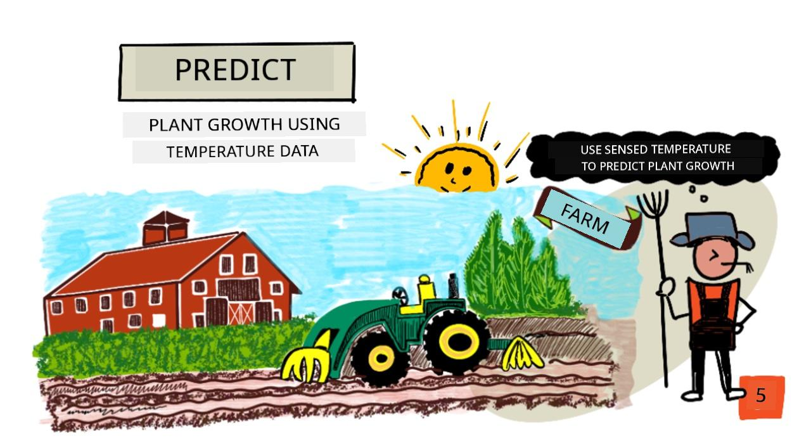
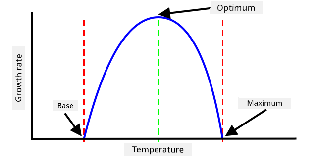
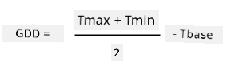
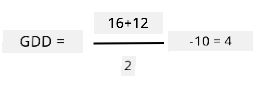
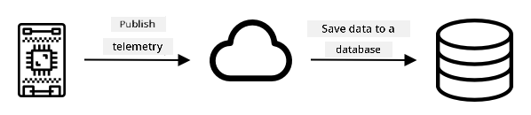
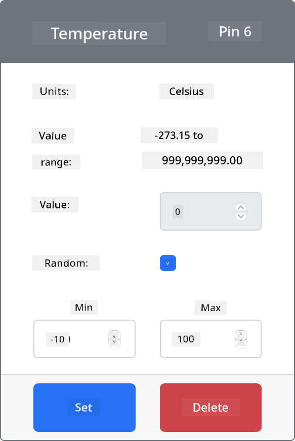
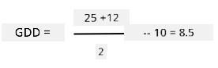

<!--
CO_OP_TRANSLATOR_METADATA:
{
  "original_hash": "d105b44deae539165855c976dcdeca99",
  "translation_date": "2025-11-18T19:41:09+00:00",
  "source_file": "2-farm/lessons/1-predict-plant-growth/README.md",
  "language_code": "pcm"
}
-->
# Predict plant growth wit IoT



> Sketchnote by [Nitya Narasimhan](https://github.com/nitya). Click di image for bigger version.

## Pre-lecture quiz

[Pre-lecture quiz](https://black-meadow-040d15503.1.azurestaticapps.net/quiz/9)

## Introduction

Plants need some kain things to grow - water, carbon dioxide, nutrients, light, and heat. For dis lesson, you go learn how to calculate di growth and maturity rate of plants by measuring di air temperature.

For dis lesson we go talk about:

* [Digital agriculture](../../../../../2-farm/lessons/1-predict-plant-growth)
* [Why temperature dey important for farming?](../../../../../2-farm/lessons/1-predict-plant-growth)
* [Measure ambient temperature](../../../../../2-farm/lessons/1-predict-plant-growth)
* [Growing degree days (GDD)](../../../../../2-farm/lessons/1-predict-plant-growth)
* [Calculate GDD using temperature sensor data](../../../../../2-farm/lessons/1-predict-plant-growth)

## Digital agriculture

Digital Agriculture dey change di way we dey farm, e dey use tools to collect, store and analyze data from farming. Right now, we dey for one period wey dem dey call 'Fourth Industrial Revolution' by di World Economic Forum, and di rise of digital agriculture don get di name 'Fourth Agricultural Revolution', or 'Agriculture 4.0'.

> 🎓 Di term Digital Agriculture also include di whole 'agriculture value chain', dat na di full journey from farm to table. E include tracking di quality of food as dem dey ship am, process am, warehouse and e-commerce systems, even tractor rental apps!

Dis kain change dey help farmers increase di amount of food dem dey produce, use less fertilizer and pesticide, and manage water well well. Even though e dey mostly for richer countries, sensors and other devices don dey reduce for price, so e dey more accessible for developing countries.

Some techniques wey digital agriculture dey enable na:

* Temperature measurement - measuring temperature dey help farmers predict plant growth and maturity.
* Automated watering - measuring soil moisture and turning on irrigation systems when di soil don dry, instead of timed watering. Timed watering fit make crops no get enough water during hot, dry time, or too much water during rain. By watering only when di soil need am, farmers fit manage their water well.
* Pest control - farmers fit use cameras on robots or drones to check for pests, then apply pesticide only for di place wey need am, reducing di amount of pesticide wey dem dey use and reducing pesticide wey dey enter local water.

✅ Do small research. Wetin be di other techniques wey dem dey use to improve farming yields?

> 🎓 Di term 'Precision Agriculture' na di way wey farmers dey observe, measure and respond to crops for each field, or even for parts of di field. E include measuring water, nutrient and pest levels and responding well, like watering only small part of di field.

## Why temperature dey important for farming?

When people dey learn about plants, dem dey mostly talk about di need for water, light, carbon dioxide (CO<sub>2</sub>) and nutrients. But plants also need heat to grow - na why plants dey bloom for spring as temperature dey rise, why snowdrops or daffodils fit grow early because of small warm time, and why hothouses and greenhouses dey help plants grow well.

> 🎓 Hothouses and greenhouses dey do similar work, but e get one big difference. Hothouses dey use artificial heat and farmers fit control di temperature well, greenhouses dey depend on di sun for heat and di only control na windows or openings to let heat comot.

Plants get base or minimum temperature, optimal temperature, and maximum temperature, all based on di daily average temperature.

* Base temperature - na di minimum daily average temperature wey plant need to grow.
* Optimum temperature - na di best daily average temperature wey go make di plant grow well.
* Maximum temperature - Na di maximum temperature wey plant fit handle. If e pass dis one, di plant go stop to grow to save water and survive.

> 💁 Dis na average temperature, wey dem dey calculate from di day and night temperature. Plants also need different temperature for day and night to help dem photosynthesize well and save energy for night.

Each type of plant get different values for their base, optimal and maximum temperature. Na why some plants dey grow well for hot countries, and others for cold countries.

✅ Do small research. For di plants wey dey your garden, school, or local park, try find di base temperature.



Di graph wey dey above dey show example of growth rate to temperature graph. Up to di base temperature, di plant no go grow. Di growth rate go increase until e reach di optimum temperature, then e go drop after e reach di peak. For di maximum temperature, growth go stop.

Di shape of dis graph dey different for each type of plant. Some dey drop fast after di optimum, some dey rise slow from di base to di optimum.

> 💁 For farmer to get di best growth, dem need to sabi di three temperature values and understand di shape of di graph for di plants wey dem dey grow.

If farmer fit control di temperature, like for commercial hothouse, dem fit optimize am for their plants. For example, commercial hothouse wey dey grow tomatoes go set di temperature to around 25°C for day and 20°C for night to make di plant grow fast.

> 🍅 If dem combine dis temperature with artificial light, fertilizer and controlled CO<sub>2</sub> levels, commercial farmers fit grow and harvest all year round.

## Measure ambient temperature

Temperature sensors fit dey use with IoT devices to measure ambient temperature.

### Task - measure temperature

Follow di guide wey dey relevant to monitor temperature using your IoT device:

* [Arduino - Wio Terminal](wio-terminal-temp.md)
* [Single-board computer - Raspberry Pi](pi-temp.md)
* [Single-board computer - Virtual device](virtual-device-temp.md)

## Growing degree days

Growing degree days (wey people dey also call growing degree units) na di way wey dem dey measure di growth of plants based on temperature. If plant get enough water, nutrients and CO<sub>2</sub>, na di temperature go determine di growth rate.

Growing degree days, or GDD dey calculate per day as di average temperature for one day above di plant base temperature. Each plant need certain number of GDD to grow, flower or produce and mature di crop. Di more GDD each day, di faster di plant go grow.

> 🇺🇸 For Americans, growing degree days fit also dey calculate using Fahrenheit. 5 GDD<sup>C</sup> (growing degree days for Celsius) na di same as 9 GDD<sup>F</sup> (growing degree days for Fahrenheit).

Di full formula for GDD dey small complicated, but e get one simplified equation wey people dey use as good approximation:



* **GDD** - na di number of growing degree days
* **T<sub>max</sub>** - na di daily maximum temperature for degrees Celsius
* **T<sub>min</sub>** - na di daily minimum temperature for degrees Celsius
* **T<sub>base</sub>** - na di plant base temperature for degrees Celsius

> 💁 E get variations wey dey deal with T<sub>max</sub> above 30°C or T<sub>min</sub> below T<sub>base</sub>, but we no go talk about dem now.

### Example - Corn/Maize 🌽

Depending on di variety, corn (or maize) need between 800 and 2,700 GDD to mature, with base temperature of 10°C.

For di first day wey temperature pass di base temperature, di following temperatures dey measured:

| Measurement | Temp °C |
| :---------- | :-----: |
| Maximum     | 16      |
| Minimum     | 12      |

If we put dis numbers for di calculation:

* T<sub>max</sub> = 16
* T<sub>min</sub> = 12
* T<sub>base</sub> = 10

Dis go give calculation of:



Di corn get 4 GDD for dat day. If na corn variety wey need 800 GDD days to mature, e go need another 796 GDD to reach maturity.

✅ Do small research. For di plants wey dey your garden, school, or local park, try find di number of GDD wey dem need to mature or produce crops.

## Calculate GDD using temperature sensor data

Plants no dey grow based on fixed dates - for example, you no fit plant seed and sabi say di plant go bear fruit exactly 100 days later. Instead, as farmer, you fit get rough idea how long plant dey take to grow, then you go dey check daily to see when di crops don ready.

Dis dey cause plenty work for big farm, and e fit make farmer miss crops wey don ready early. By measuring temperature, farmer fit calculate di GDD wey plant don get, so dem go only check when di plant don near maturity.

By gathering temperature data using IoT device, farmer fit get automatic notification when plants don near maturity. Di normal way na to make di IoT devices measure temperature, then send di telemetry data over Internet using something like MQTT. Server code go dey listen to dis data and save am somewhere, like database. Dis go make di data fit dey analyzed later, like nightly job to calculate di GDD for di day, total di GDD for each crop so far and alert if plant don near maturity.



Di server code fit also add extra information. For example, di IoT device fit send identifier to show which device e be, and di server code fit use am to find di location of di device, and di crops wey e dey monitor. E fit also add basic data like di current time as some IoT devices no get di hardware to keep track of accurate time, or dem need extra code to read di current time from Internet.

✅ Why you think say different fields fit get different temperature?

### Task - publish temperature information

Follow di guide wey dey relevant to publish temperature data over MQTT using your IoT device so e fit dey analyzed later:

* [Arduino - Wio Terminal](wio-terminal-temp-publish.md)
* [Single-board computer - Raspberry Pi/Virtual IoT device](single-board-computer-temp-publish.md)

### Task - capture and store di temperature information

Once di IoT device don dey publish telemetry, di server code fit dey write to subscribe to dis data and store am. Instead of saving am to database, di server code go save am to Comma Separated Values (CSV) file. CSV files dey store data as rows of values as text, with each value separated by comma, and each record for new line. Dem dey convenient, easy to read and well supported way to save data as file.

Di CSV file go get two columns - *date* and *temperature*. Di *date* column go be di current date and time wey di message reach di server, di *temperature* go come from di telemetry message.

1. Repeat di steps for lesson 4 to create server code to subscribe to telemetry. You no need to add code to publish commands.

    Di steps for dis na:

    * Configure and activate Python Virtual Environment

    * Install di paho-mqtt pip package

    * Write di code to listen for MQTT messages wey dem publish for di telemetry topic

      > ⚠️ You fit check [di instructions for lesson 4 for how to create Python app to receive telemetry if you need am](../../../1-getting-started/lessons/4-connect-internet/README.md#receive-telemetry-from-the-mqtt-broker).

    Name di folder for dis project `temperature-sensor-server`.

1. Make sure say di `client_name` dey reflect dis project:

    ```cpp
    client_name = id + 'temperature_sensor_server'
    ```

1. Add di following imports to di top of di file, below di existing imports:

    ```python
    from os import path
    import csv
    from datetime import datetime
    ```

    Dis dey import library for reading files, library to interact with CSV files, and library to help with dates and times.

1. Add di following code before di `handle_telemetry` function:

    ```python
    temperature_file_name = 'temperature.csv'
    fieldnames = ['date', 'temperature']
    
    if not path.exists(temperature_file_name):
        with open(temperature_file_name, mode='w') as csv_file:
            writer = csv.DictWriter(csv_file, fieldnames=fieldnames)
            writer.writeheader()
    ```

    Dis code dey declare some constants for di name of di file to write to, and di name of di column headers for di CSV file. Di first row of CSV file dey usually get column headers wey comma dey separate.

    Di code go check if di CSV file don already dey. If e no dey, e go create am with di column headers for di first row.

1. Add di following code to di end of di `handle_telemetry` function:

    ```python
    with open(temperature_file_name, mode='a') as temperature_file:        
        temperature_writer = csv.DictWriter(temperature_file, fieldnames=fieldnames)
        temperature_writer.writerow({'date' : datetime.now().astimezone().replace(microsecond=0).isoformat(), 'temperature' : payload['temperature']})
    ```

Dis code dey open di CSV file, den e go add new row for di end. Di row get di current date and time wey dem don format make e dey easy to read, plus di temperature wey di IoT device send. Di data dey store for [ISO 8601 format](https://wikipedia.org/wiki/ISO_8601) wit di timezone, but e no get microseconds.

1. Run dis code di same way as before, make sure say your IoT device dey send data. CSV file wey dem call `temperature.csv` go dey create for di same folder. If you check am, you go see date/times and temperature measurements:

    ```output
    date,temperature
    2021-04-19T17:21:36-07:00,25
    2021-04-19T17:31:36-07:00,24
    2021-04-19T17:41:36-07:00,25
    ```

1. Run dis code for some time to collect data. E go better make you run am for one full day to gather enough data for GDD calculations.

    > 💁 If you dey use Virtual IoT Device, select di random checkbox and set range so you no go dey get di same temperature every time di temperature value dey return.
     

    > 💁 If you wan run dis code for one full day, you go need make sure say di computer wey your server code dey run on no go sleep. You fit change di power settings or run something like [dis keep system active Python script](https://github.com/jaqsparow/keep-system-active).
    
> 💁 You fit find dis code for di [code-server/temperature-sensor-server](../../../../../2-farm/lessons/1-predict-plant-growth/code-server/temperature-sensor-server) folder.

### Task - calculate GDD wit di stored data

Once di server don collect temperature data, di GDD for plant fit dey calculate.

Di steps to do am manually na:

1. Find di base temperature for di plant. Example, for strawberries di base temperature na 10°C.

1. From di `temperature.csv`, find di highest and lowest temperatures for di day.

1. Use di GDD calculation wey dem give before to calculate GDD.

Example, if di highest temperature for di day na 25°C, and di lowest na 12°C:



* 25 + 12 = 37
* 37 / 2 = 18.5
* 18.5 - 10 = 8.5

So di strawberries don get **8.5** GDD. Strawberries need about 250 GDD to produce fruit, so e still dey far.

---

## 🚀 Challenge

Plants need more than heat to grow. Wetin else dem need?

For dis ones, find out if sensors dey wey fit measure dem. Wetin of actuators wey fit control di levels? How you go fit arrange one or more IoT devices to make plant growth better?

## Post-lecture quiz

[Post-lecture quiz](https://black-meadow-040d15503.1.azurestaticapps.net/quiz/10)

## Review & Self Study

* Read more about digital agriculture for di [Digital Agriculture Wikipedia page](https://wikipedia.org/wiki/Digital_agriculture). Also read more about precision agriculture for di [Precision Agriculture Wikipedia page](https://wikipedia.org/wiki/Precision_agriculture).
* Di full growing degree days calculation dey more complex pass di simplified one wey dem give here. Read more about di more complex equation and how to handle temperatures wey dey below di baseline for di [Growing Degree Day Wikipedia page](https://wikipedia.org/wiki/Growing_degree-day).
* Food fit dey scarce for future if we still dey use di same methods for farming. Learn more about hi-tech farming techniques for dis [Hi-Tech Farms of Future video for YouTube](https://www.youtube.com/watch?v=KIEOuKD9KX8).

## Assignment

[Visualize GDD data using a Jupyter Notebook](assignment.md)

---

<!-- CO-OP TRANSLATOR DISCLAIMER START -->
**Disclaimer**:  
Dis docu wey you dey see don use AI translation service [Co-op Translator](https://github.com/Azure/co-op-translator) take translate am. Even though we dey try make sure say e correct, make you sabi say translation wey machine do fit get mistake or no too accurate. Di original docu for di language wey dem first write am na im you go take as di correct one. If na important information, e go better make professional human translator check am. We no go fit take blame for any misunderstanding or wrong interpretation wey fit happen because you use dis translation.
<!-- CO-OP TRANSLATOR DISCLAIMER END -->