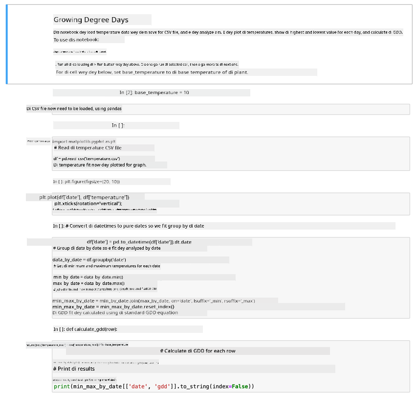

<!--
CO_OP_TRANSLATOR_METADATA:
{
  "original_hash": "1e21b012c6685f8bf73e0e76cdca3347",
  "translation_date": "2025-11-18T19:42:15+00:00",
  "source_file": "2-farm/lessons/1-predict-plant-growth/assignment.md",
  "language_code": "pcm"
}
-->
# Visualize GDD data wit Jupyter Notebook

## Instructions

For dis lesson, you don gather GDD data wit IoT sensor. To get beta GDD data, you go need gather data for plenty days. To help you see temperature data well and calculate GDD, you fit use tools like [Jupyter Notebooks](https://jupyter.org) to analyze di data.

Start by gathering data for some days. You go need make sure say your server code dey run anytime your IoT device dey run, either by adjusting your power management settings or running something like [dis keep system active Python script](https://github.com/jaqsparow/keep-system-active).

Once you don get temperature data, you fit use di Jupyter Notebook wey dey dis repo to see am well and calculate GDD. Jupyter notebooks dey mix code and instructions inside blocks wey dem dey call *cells*, most times na Python code. You fit read di instructions, then run each block of code one by one. You fit also edit di code. For dis notebook example, you fit change di base temperature wey dem dey use calculate di GDD for your plant.

1. Create one folder wey you go call `gdd-calculation`

1. Download di [gdd.ipynb](./code-notebook/gdd.ipynb) file and put am inside di `gdd-calculation` folder.

1. Copy di `temperature.csv` file wey di MQTT server create.

1. Create new Python virtual environment inside di `gdd-calculation` folder.

1. Install some pip packages for Jupyter notebooks, plus libraries wey you go need to manage and plot di data:

    ```sh
    pip install --upgrade pip
    pip install pandas
    pip install matplotlib
    pip install jupyter
    ```

1. Run di notebook for Jupyter:

    ```sh
    jupyter notebook gdd.ipynb
    ```

    Jupyter go start and open di notebook for your browser. Follow di instructions wey dey di notebook to see di temperatures wey dem measure, and calculate di growing degree days.

    

## Rubric

| Criteria | Exemplary | Adequate | Needs Improvement |
| -------- | --------- | -------- | ----------------- |
| Capture data | Capture at least 2 complete days of data | Capture at least 1 complete day of data | Capture some data |
| Calculate GDD | Successfully run di notebook and calculate GDD | Successfully run di notebook | No fit run di notebook |

---

<!-- CO-OP TRANSLATOR DISCLAIMER START -->
**Disclaimer**:  
Dis dokyument don use AI translation service [Co-op Translator](https://github.com/Azure/co-op-translator) do di translation. Even as we dey try make am accurate, abeg sabi say automated translations fit get mistake or no dey correct well. Di original dokyument wey dey for im native language na di main source wey you go trust. For important information, e better make professional human translation dey use. We no go fit take blame for any misunderstanding or wrong interpretation wey fit happen because you use dis translation.
<!-- CO-OP TRANSLATOR DISCLAIMER END -->