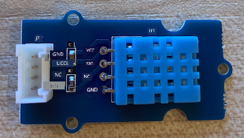
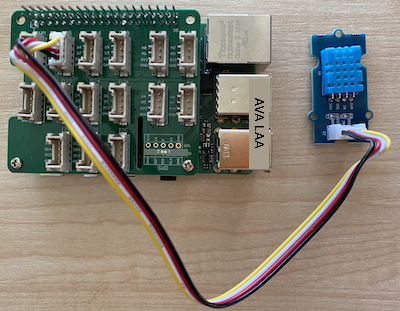

<!--
CO_OP_TRANSLATOR_METADATA:
{
  "original_hash": "7678f7c67b97ee52d5727496dcd7d346",
  "translation_date": "2025-11-18T19:38:57+00:00",
  "source_file": "2-farm/lessons/1-predict-plant-growth/pi-temp.md",
  "language_code": "pcm"
}
-->
# Measure temperature - Raspberry Pi

For dis part of di lesson, you go add temperature sensor to your Raspberry Pi.

## Hardware

Di sensor wey you go use na [DHT11 humidity and temperature sensor](https://www.seeedstudio.com/Grove-Temperature-Humidity-Sensor-DHT11.html), wey combine 2 sensors for one package. E dey popular well well, and plenty sensors wey dem dey sell for market dey combine temperature, humidity, and sometimes atmospheric pressure. Di temperature sensor part na negative temperature coefficient (NTC) thermistor, wey be thermistor wey di resistance go reduce as di temperature dey increase.

Dis sensor na digital sensor, e get onboard ADC wey dey create digital signal wey get di temperature and humidity data wey di microcontroller fit read.

### Connect di temperature sensor

Di Grove temperature sensor fit connect to di Raspberry Pi.

#### Task

Connect di temperature sensor



1. Put one end of di Grove cable inside di socket for di humidity and temperature sensor. E go only enter one way.

1. When di Raspberry Pi dey off, connect di other end of di Grove cable to di digital socket wey dem mark **D5** for di Grove Base hat wey dey attach to di Pi. Dis socket na di second one from di left, for di row of sockets wey dey near di GPIO pins.



## Program di temperature sensor

Now, di device fit program to use di temperature sensor wey dem attach.

### Task

Program di device.

1. On di Pi and wait make e boot finish.

1. Open VS Code, either directly for di Pi, or connect am through di Remote SSH extension.

    > ⚠️ You fit check [di instructions for how to set up and open VS Code for lesson 1 if you need am](../../../1-getting-started/lessons/1-introduction-to-iot/pi.md).

1. From di terminal, create new folder for di `pi` user home directory wey dem call `temperature-sensor`. Create file for dis folder wey dem call `app.py`:

    ```sh
    mkdir temperature-sensor
    cd temperature-sensor
    touch app.py
    ```

1. Open dis folder for VS Code.

1. To use di temperature and humidity sensor, you go need install one extra Pip package. From di Terminal for VS Code, run dis command to install di Pip package for di Pi:

    ```sh
    pip3 install seeed-python-dht
    ```

1. Add dis code to di `app.py` file to import di libraries wey you need:

    ```python
    import time
    from seeed_dht import DHT
    ```

    Di `from seeed_dht import DHT` statement dey import di `DHT` sensor class wey go help you interact with di Grove temperature sensor from di `seeed_dht` module.

1. Add dis code after di one wey dey above to create one instance of di class wey dey manage di temperature sensor:

    ```python
    sensor = DHT("11", 5)
    ```

    Dis one dey declare one instance of di `DHT` class wey dey manage di **D**igital **H**umidity and **T**emperature sensor. Di first parameter dey tell di code say di sensor wey you dey use na *DHT11* sensor - di library wey you dey use dey support other types of dis sensor. Di second parameter dey tell di code say di sensor dey connect to digital port `D5` for di Grove base hat.

    > ✅ Remember say all di sockets get their own pin numbers. Pins 0, 2, 4, and 6 na analog pins, pins 5, 16, 18, 22, 24, and 26 na digital pins.

1. Add one infinite loop after di code wey dey above to dey check di temperature sensor value and print am for di console:

    ```python
    while True:
        _, temp = sensor.read()
        print(f'Temperature {temp}°C')
    ```

    Di call to `sensor.read()` dey return one tuple wey get humidity and temperature. You only need di temperature value, so you go ignore di humidity. Di temperature value go then print for di console.

1. Add small sleep of ten seconds for di end of di `loop` because di temperature levels no need dey check every time. Sleep dey help reduce di power wey di device dey use.

    ```python
    time.sleep(10)
    ```

1. From di VS Code Terminal, run dis command to run your Python app:

    ```sh
    python3 app.py
    ```

    You go see temperature values dey show for di console. Use something to warm di sensor, like pressing your thumb on top am, or use fan to see how di values go change:

    ```output
    pi@raspberrypi:~/temperature-sensor $ python3 app.py 
    Temperature 26°C
    Temperature 26°C
    Temperature 28°C
    Temperature 30°C
    Temperature 32°C
    ```

> 💁 You fit find dis code for di [code-temperature/pi](../../../../../2-farm/lessons/1-predict-plant-growth/code-temperature/pi) folder.

😀 Your temperature sensor program don work well!

---

<!-- CO-OP TRANSLATOR DISCLAIMER START -->
**Disclaimer**:  
Dis dokyument don use AI transleshion service [Co-op Translator](https://github.com/Azure/co-op-translator) do di transleshion. Even as we dey try make am accurate, abeg make you sabi say transleshion wey machine do fit get mistake or no dey correct well. Di original dokyument for im native language na di one wey you go take as di correct source. For important mata, e good make professional human transleshion dey use. We no go fit take blame for any misunderstanding or wrong interpretation wey fit happen because you use dis transleshion.
<!-- CO-OP TRANSLATOR DISCLAIMER END -->