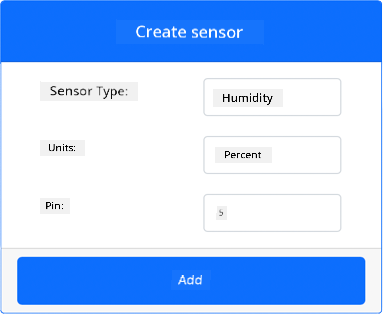
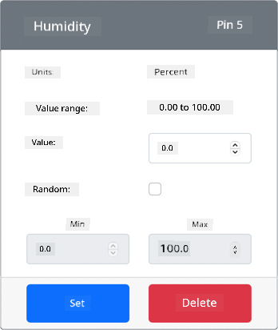
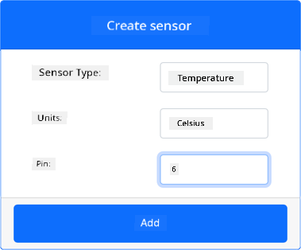
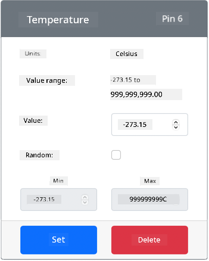

<!--
CO_OP_TRANSLATOR_METADATA:
{
  "original_hash": "70e5a428b607cd5a9a4f422c2a4df03d",
  "translation_date": "2025-11-18T19:37:38+00:00",
  "source_file": "2-farm/lessons/1-predict-plant-growth/virtual-device-temp.md",
  "language_code": "pcm"
}
-->
# Measure temperature - Virtual IoT Hardware

For dis part of di lesson, you go add temperature sensor to your virtual IoT device.

## Virtual Hardware

Di virtual IoT device go use simulated Grove Digital Humidity and Temperature sensor. Dis one go make di lab be like say you dey use Raspberry Pi wey get physical Grove DHT11 sensor.

Di sensor dey combine **temperature sensor** wit **humidity sensor**, but for dis lab, na di temperature sensor part you go focus on. For physical IoT device, di temperature sensor go be [thermistor](https://wikipedia.org/wiki/Thermistor) wey dey measure temperature by sensing di change wey dey happen for resistance as temperature dey change. Temperature sensors na usually digital sensors wey dey internally convert di resistance wey dem measure into temperature for degrees Celsius (or Kelvin, or Fahrenheit).

### Add di sensors to CounterFit

To use virtual humidity and temperature sensor, you go need add di two sensors to di CounterFit app.

#### Task - add di sensors to CounterFit

Add di humidity and temperature sensors to di CounterFit app.

1. Create new Python app for your computer inside folder wey you go call `temperature-sensor` wit one file wey you go call `app.py` and Python virtual environment, then add di CounterFit pip packages.

    > ⚠️ You fit check [di instructions for how to create and setup CounterFit Python project for lesson 1 if you need am](../../../1-getting-started/lessons/1-introduction-to-iot/virtual-device.md).

1. Install extra Pip package to install CounterFit shim for di DHT11 sensor. Make sure say you dey install am from terminal wey get di virtual environment activated.

    ```sh
    pip install counterfit-shims-seeed-python-dht
    ```

1. Make sure say di CounterFit web app dey run.

1. Create humidity sensor:

    1. For di *Create sensor* box wey dey di *Sensors* pane, drop down di *Sensor type* box and select *Humidity*.

    1. Leave di *Units* as *Percentage*.

    1. Make sure say di *Pin* dey set to *5*.

    1. Click di **Add** button to create di humidity sensor for Pin 5.

    

    Di humidity sensor go dey created and e go show for di sensors list.

    

1. Create temperature sensor:

    1. For di *Create sensor* box wey dey di *Sensors* pane, drop down di *Sensor type* box and select *Temperature*.

    1. Leave di *Units* as *Celsius*.

    1. Make sure say di *Pin* dey set to *6*.

    1. Click di **Add** button to create di temperature sensor for Pin 6.

    

    Di temperature sensor go dey created and e go show for di sensors list.

    

## Program di temperature sensor app

Now you fit program di temperature sensor app using di CounterFit sensors.

### Task - program di temperature sensor app

Program di temperature sensor app.

1. Make sure say di `temperature-sensor` app dey open for VS Code.

1. Open di `app.py` file.

1. Add dis code to di top of `app.py` to connect di app to CounterFit:

    ```python
    from counterfit_connection import CounterFitConnection
    CounterFitConnection.init('127.0.0.1', 5000)
    ```

1. Add dis code to di `app.py` file to import di libraries wey you need:

    ```python
    import time
    from counterfit_shims_seeed_python_dht import DHT
    ```

    Di `from seeed_dht import DHT` statement dey import di `DHT` sensor class to interact wit virtual Grove temperature sensor using shim from di `counterfit_shims_seeed_python_dht` module.

1. Add dis code after di code wey dey above to create instance of di class wey dey manage di virtual humidity and temperature sensor:

    ```python
    sensor = DHT("11", 5)
    ```

    Dis one dey declare instance of di `DHT` class wey dey manage di virtual **D**igital **H**umidity and **T**emperature sensor. Di first parameter dey tell di code say di sensor wey dem dey use na virtual *DHT11* sensor. Di second parameter dey tell di code say di sensor dey connect to port `5`.

    > 💁 CounterFit dey simulate dis combined humidity and temperature sensor by connecting to 2 sensors, humidity sensor for di pin wey dem give when dem create di `DHT` class, and temperature sensor wey dey run for di next pin. If di humidity sensor dey pin 5, di shim go expect say di temperature sensor dey pin 6.

1. Add infinite loop after di code wey dey above to dey check di temperature sensor value and print am for di console:

    ```python
    while True:
        _, temp = sensor.read()
        print(f'Temperature {temp}°C')
    ```

    Di call to `sensor.read()` dey return tuple of humidity and temperature. Na only di temperature value you need, so di humidity dey ignored. Di temperature value go then dey printed for di console.

1. Add small sleep of ten seconds for di end of di `loop` because di temperature levels no need dey checked every time. Sleep dey help reduce di power wey di device dey use.

    ```python
    time.sleep(10)
    ```

1. From di VS Code Terminal wey get activated virtual environment, run dis one to run your Python app:

    ```sh
    python app.py
    ```

1. From di CounterFit app, change di value of di temperature sensor wey di app go read. You fit do dis one in two ways:

    * Enter number for di *Value* box for di temperature sensor, then click di **Set** button. Di number wey you enter go be di value wey di sensor go return.

    * Check di *Random* checkbox, then enter *Min* and *Max* value, then click di **Set** button. Every time wey di sensor dey read value, e go read random number between *Min* and *Max*.

    You go see di values wey you set dey show for di console. Change di *Value* or di *Random* settings to see di value dey change.

    ```output
    (.venv) ➜  temperature-sensor python app.py
    Temperature 28.25°C
    Temperature 30.71°C
    Temperature 25.17°C
    ```

> 💁 You fit find dis code for di [code-temperature/virtual-device](../../../../../2-farm/lessons/1-predict-plant-growth/code-temperature/virtual-device) folder.

😀 Your temperature sensor program don work well!

---

<!-- CO-OP TRANSLATOR DISCLAIMER START -->
**Disclaimer**:  
Dis dokyument don use AI translet service [Co-op Translator](https://github.com/Azure/co-op-translator) do di translet. Even as we dey try make am correct, abeg make you sabi say AI translet fit get mistake or no dey accurate well. Di original dokyument wey dey for im native language na di one wey you go take as di correct source. For important mata, e good make you use professional human translet. We no go fit take blame for any misunderstanding or wrong interpretation wey fit happen because you use dis translet.
<!-- CO-OP TRANSLATOR DISCLAIMER END -->