<!--
CO_OP_TRANSLATOR_METADATA:
{
  "original_hash": "4fb20273d299dc8d07a8f06c9cd0cdd9",
  "translation_date": "2025-11-18T19:31:33+00:00",
  "source_file": "2-farm/lessons/2-detect-soil-moisture/README.md",
  "language_code": "pcm"
}
-->
# Detect soil moisture

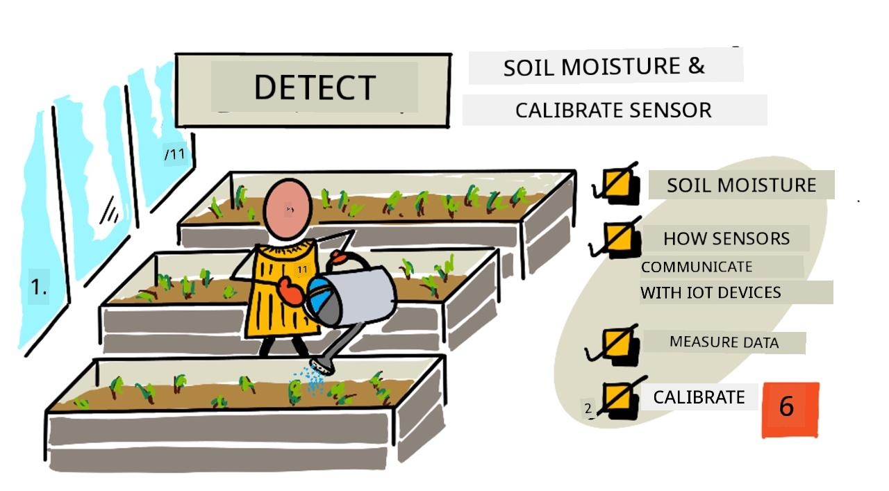

> Sketchnote by [Nitya Narasimhan](https://github.com/nitya). Click the image for a larger version.

Dis lesson na part of di [IoT for Beginners Project 2 - Digital Agriculture series](https://youtube.com/playlist?list=PLmsFUfdnGr3yCutmcVg6eAUEfsGiFXgcx) wey Microsoft Reactor teach. 

## Pre-lecture quiz

[Pre-lecture quiz](https://black-meadow-040d15503.1.azurestaticapps.net/quiz/11)

## Introduction

For di last lesson, we talk about how to measure one environmental property wey fit help predict how plant go grow. Temperature fit dey control, but e dey cost plenty money because e need controlled environment. Di easiest environmental property wey person fit control for plant na water - somtin wey people dey control everyday, from big irrigation system to small pikin wey dey use watering can for garden.

For dis lesson, you go learn how to measure soil moisture, and for di next lesson, you go sabi how to control automated watering system. Dis lesson go introduce di third sensor wey you go use. You don already use light sensor and temperature sensor before, so dis time you go learn how sensors and actuators dey communicate with IoT devices, and how soil moisture sensor dey send data go IoT device.

Dis lesson go cover:

* [Soil moisture](../../../../../2-farm/lessons/2-detect-soil-moisture)
* [How sensors communicate with IoT devices](../../../../../2-farm/lessons/2-detect-soil-moisture)
* [Measure the moisture levels in soil](../../../../../2-farm/lessons/2-detect-soil-moisture)
* [Sensor calibration](../../../../../2-farm/lessons/2-detect-soil-moisture)

## Soil moisture

Plants need water to grow. Dem dey absorb water through di whole plant, but na di root system dey absorb di most. Plants dey use water for three main things:

* [Photosynthesis](https://wikipedia.org/wiki/Photosynthesis) - Plants dey use water, carbon dioxide, and light to create carbohydrates and oxygen through chemical reaction.
* [Transpiration](https://wikipedia.org/wiki/Transpiration) - Plants dey use water to carry nutrients around di plant, cool di plant, and help carbon dioxide enter di plant through di leaf pores. E dey similar to how humans dey sweat.
* Structure - Plants need water to maintain their structure. Dem be 90% water (humans na only 60%), and di water dey keep di cells strong. If plant no get enough water, e go bend (wilt) and fit die.

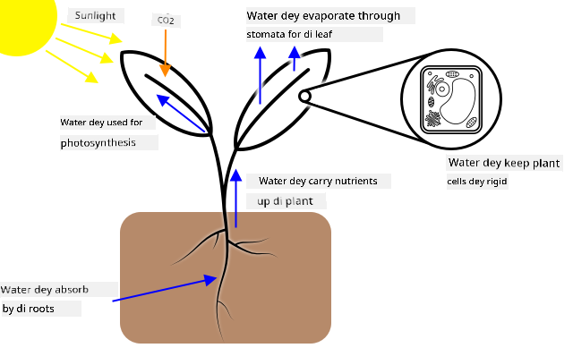

✅ Do some research: how much water dey lost through transpiration?

Di root system dey collect water from di soil wey di plant dey grow. If water too small for di soil, di plant no go fit absorb enough to grow. If water too much, di roots no go fit absorb di oxygen wey dem need to work. Dis one fit make di roots die and di plant no go get enough nutrients to survive.

For farmer to get di best plant growth, di soil no suppose dey too wet or too dry. IoT devices fit help measure soil moisture so farmer go only water di plant when e dey necessary.

### Ways to measure soil moisture

Plenty sensors dey wey fit measure soil moisture:

* Resistive - Resistive sensor get two probes wey dem go put for soil. Electric current go pass one probe and di other probe go receive am. Di sensor go measure di resistance of di soil - how much di current drop for di second probe. Water dey conduct electricity well, so di more water dey di soil, di less resistance e go get.

    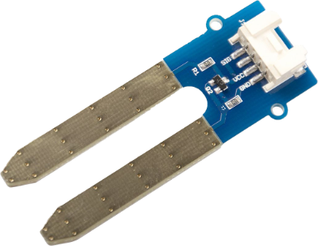

    > 💁 You fit build resistive soil moisture sensor with two metal pieces, like nails, wey you go separate by small space, then measure di resistance between dem with multimeter.

* Capacitive - Capacitive moisture sensor dey measure di amount of electric charge wey fit store between positive and negative electrical plate, or [capacitance](https://wikipedia.org/wiki/Capacitance). Di capacitance of soil dey change as di moisture level dey change, and e fit convert to voltage wey IoT device fit measure. Di wetter di soil, di lower di voltage wey e go produce.

    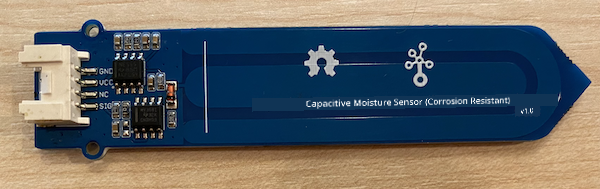

Both sensors na analog sensors, dem dey return voltage wey show soil moisture. But how dis voltage go reach your code? Before we go further, make we look how sensors and actuators dey communicate with IoT devices.

## How sensors communicate with IoT devices

For di lessons wey you don do so far, you don learn about sensors and actuators wey dey communicate with IoT dev kit if you dey do di physical hardware labs. But how dis communication dey work? How resistance measurement from soil moisture sensor go turn number wey you fit use for code?

To communicate with sensors and actuators, you need hardware and communication protocol - di defined way wey data dey send and receive. For example, capacitive soil moisture sensor:

* How e dey connect to IoT device?
* If e dey measure voltage wey be analog signal, e go need ADC to turn di value to digital representation, and dis value go send as alternating voltage to show 0s and 1s - but how long dem dey send each bit?
* If di sensor dey return digital value, e go be stream of 0s and 1s, but how long dem dey send each bit?
* If voltage high for 0.1s, e be single 1 bit, or 2 consecutive 1 bits, or 10?
* Where di number dey start? `00001101` na 25, or di first 5 bits na di end of di previous value?

Di hardware dey provide physical connection wey data dey pass, di communication protocols dey make sure di data dey send or receive well so e fit interpret am.

### General Purpose Input Output (GPIO) pins

GPIO na set of pins wey you fit use connect hardware to IoT device. Dem dey available for IoT developer kits like Raspberry Pi or Wio Terminal. You fit use di communication protocols wey we go talk about for dis section with GPIO pins. Some GPIO pins dey provide voltage, usually 3.3V or 5V, some na ground, and others fit program to send voltage (output) or receive voltage (input).

> 💁 Electrical circuit dey need to connect voltage to ground through di circuit wey you dey use. You fit think of voltage as di positive (+ve) terminal of battery and ground as di negative (-ve) terminal.

You fit use GPIO pins directly with some digital sensors and actuators if you only need on or off values - on na high, off na low. Examples:

* Button. You fit connect button between 5V pin and pin wey dey set to input. When you press di button, e go complete circuit between 5V pin, through di button, to di input pin. From code, you fit read di voltage for di input pin. If e high (5V), di button dey pressed. If e low (0v), di button no dey pressed. Di actual voltage no dey read, na digital signal of 1 or 0 depending on if di voltage pass threshold.

    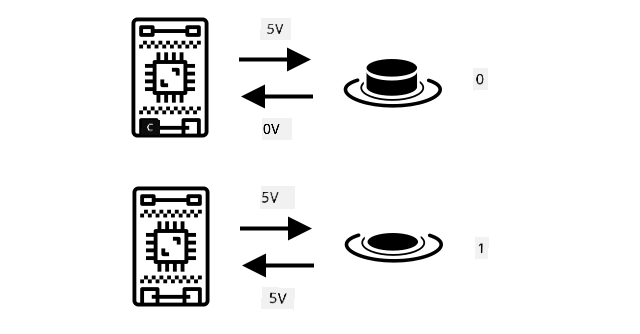

* LED. You fit connect LED between output pin and ground pin (use resistor so LED no go burn). From code, you fit set output pin to high and e go send 3.3V, making circuit from 3.3V pin, through LED, to ground pin. Dis go light di LED.

    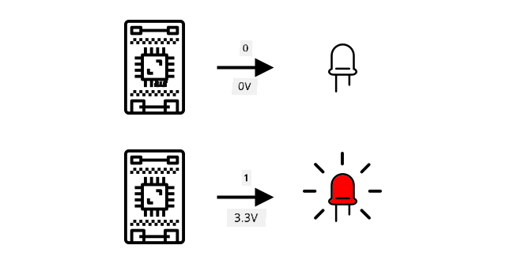

For advanced sensors, you fit use GPIO pins to send and receive digital data directly with digital sensors and actuators, or through controller boards with ADCs and DACs to talk to analog sensors and actuators.

> 💁 If you dey use Raspberry Pi for dis labs, di Grove Base Hat get hardware wey dey convert analog sensor signals to digital wey e go send through GPIO.

✅ If you get IoT device wey get GPIO pins, locate di pins and find diagram wey show which pins be voltage, ground or programmable.

### Analog pins

Some devices, like Arduino devices, get analog pins. Dis pins dey same as GPIO pins, but dem dey support analog signal. Dem get ADC wey dey convert voltage ranges to numerical values. Di ADC usually get 10-bit resolution, meaning e dey convert voltages to value between 0-1,023.

For example, for 3.3V board, if di sensor return 3.3V, di value go be 1,023. If di voltage wey e return na 1.65v, di value go be 511.

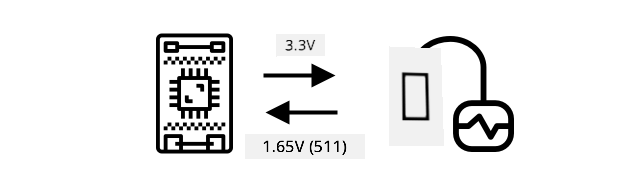

> 💁 For nightlight - lesson 3, di light sensor dey return value from 0-1,023. If you dey use Wio Terminal, di sensor dey connect to analog pin. If you dey use Raspberry Pi, di sensor dey connect to analog pin for di base hat wey get ADC to communicate through GPIO pins. Di virtual device dey send value from 0-1,023 to act like analog pin.

Soil moisture sensors dey depend on voltages, so dem go use analog pins and give values from 0-1,023.

### Inter Integrated Circuit  (I2C)

I2C, wey people dey call *I-squared-C*, na multi-controller, multi-peripheral protocol wey any connected device fit act as controller or peripheral wey dey communicate through di I2C bus (di name for communication system wey dey transfer data). Data dey send as addressed packets, and each packet get di address of di connected device wey e dey go.

> 💁 Dis model before na master/slave, but people don dey stop to use dis name because e dey remind people of slavery. Di [Open Source Hardware Association don adopt controller/peripheral](https://www.oshwa.org/a-resolution-to-redefine-spi-signal-names/), but you fit still see di old name.

Devices get address wey dem dey use when dem connect to I2C bus, and e dey usually hard coded for di device. For example, each type of Grove sensor from Seeed get di same address. All di light sensors get di same address, all di buttons get di same address wey different from di light sensor address. Some devices get way to change di address, like changing jumper settings or soldering pins together.

I2C get bus wey dey made of 2 main wires, plus 2 power wires:

| Wire | Name | Description |
| ---- | --------- | ----------- |
| SDA | Serial Data | Dis wire dey send data between devices. |
| SCL | Serial Clock | Dis wire dey send clock signal wey di controller set. |
| VCC | Voltage common collector | Di power supply for di devices. E dey connect to SDA and SCL wires to give dem power through pull-up resistor wey dey switch di signal off when no device dey act as controller. |
| GND | Ground | Dis dey provide common ground for di electrical circuit. |

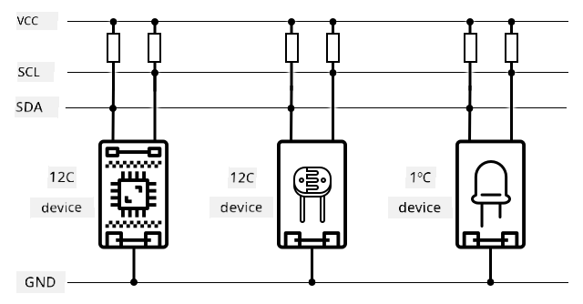

To send data, one device go issue start condition to show say e ready to send data. E go then act as controller. Di controller go send di address of di device wey e wan communicate with, plus if e wan read or write data. After di data don transmit, di controller go send stop condition to show say e don finish. After dis, another device fit act as controller to send or receive data.
I2C get speed limit, e get 3 different mode wey dey run for fixed speed. Di fastest na High Speed mode wey maximum speed na 3.4Mbps (megabits per second), but no plenty device dey support dat speed. Example na Raspberry Pi, e dey limit to fast mode for 400Kbps (kilobits per second). Standard mode dey run for 100Kbps.

> 💁 If you dey use Raspberry Pi with Grove Base hat as your IoT hardware, you go fit see plenty I2C socket for di board wey you fit use to connect with I2C sensors. Analog Grove sensors dey use I2C with ADC to send analog value as digital data, so di light sensor wey you use dey simulate analog pin, with di value wey e send through I2C since Raspberry Pi no dey support analog pin, na only digital pin e dey support.

### Universal asynchronous receiver-transmitter (UART)

UART na physical circuit wey dey allow two device to communicate. Each device get 2 communication pin - transmit (Tx) and receive (Rx), di Tx pin for di first device go connect to di Rx pin for di second device, and di Tx pin for di second device go connect to di Rx pin for di first device. Dis one go allow data to dey send for both side.

* Device 1 dey send data from e Tx pin, wey device 2 go receive for e Rx pin
* Device 1 dey receive data for e Rx pin wey device 2 dey send from e Tx pin

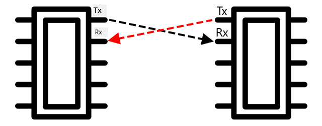

> 🎓 Di data dey send one bit at a time, and dem dey call dis one *serial* communication. Most operating system and microcontroller get *serial port*, wey be connection wey fit send and receive serial data wey your code fit use.

UART device get [baud rate](https://wikipedia.org/wiki/Symbol_rate) (dem dey call am Symbol rate too), wey be di speed wey data go dey send and receive for bits per second. Common baud rate na 9,600, wey mean say 9,600 bits (0s and 1s) of data dey send every second.

UART dey use start and stop bit - e dey send start bit to show say e wan send one byte (8 bits) of data, then e go send stop bit after e don send di 8 bits.

UART speed dey depend on hardware, but even di fastest implementation no dey pass 6.5 Mbps (megabits per second, or millions of bits, 0 or 1, wey dem dey send per second).

You fit use UART for GPIO pin - you fit set one pin as Tx and another as Rx, then connect dem to another device.

> 💁 If you dey use Raspberry Pi with Grove Base hat as your IoT hardware, you go fit see UART socket for di board wey you fit use to connect with sensors wey dey use UART protocol.

### Serial Peripheral Interface (SPI)

SPI na design wey dem make for communication wey no far, like for microcontroller wey dey talk to storage device like flash memory. E dey base on controller/peripheral model wey get one controller (normally na di processor for di IoT device) wey dey interact with plenty peripherals. Di controller dey control everything by selecting one peripheral and sending or requesting data.

> 💁 Like I2C, di terms controller and peripheral na recent change, so you fit still see di old terms.

SPI controller dey use 3 wire, plus 1 extra wire for each peripheral. Peripheral dey use 4 wire. Di wire na:

| Wire | Name | Description |
| ---- | --------- | ----------- |
| COPI | Controller Output, Peripheral Input | Dis wire na for sending data from di controller to di peripheral. |
| CIPO | Controller Input, Peripheral Output | Dis wire na for sending data from di peripheral to di controller. |
| SCLK | Serial Clock | Dis wire dey send clock signal for rate wey di controller set. |
| CS   | Chip Select | Di controller get plenty wire, one for each peripheral, and each wire dey connect to di CS wire for di peripheral wey e dey correspond to. |

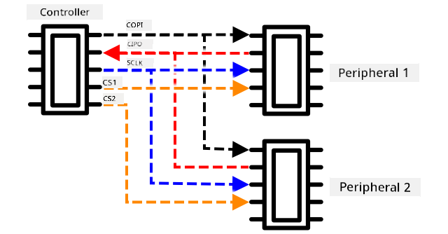

Di CS wire dey activate one peripheral at a time, dey communicate through di COPI and CIPO wire. When di controller wan change peripheral, e go deactivate di CS wire wey connect to di active peripheral, then e go activate di wire wey connect to di next peripheral wey e wan communicate with.

SPI na *full-duplex*, e mean say di controller fit send and receive data at di same time from di same peripheral using di COPI and CIPO wire. SPI dey use clock signal for di SCLK wire to keep di device in sync, so e no need start and stop bit like UART.

SPI no get defined speed limit, implementation fit transmit plenty megabytes of data per second.

IoT developer kits dey support SPI for some GPIO pin. Example, for Raspberry Pi you fit use GPIO pin 19, 21, 23, 24 and 26 for SPI.

### Wireless

Some sensors fit communicate through standard wireless protocol, like Bluetooth (mainly Bluetooth Low Energy, or BLE), LoRaWAN (na **Lo**ng **Ra**nge low power networking protocol), or WiFi. Dis one dey allow remote sensors wey no dey physically connect to IoT device.

Example na commercial soil moisture sensors. Dis one go measure soil moisture for one field, then send di data through LoRaWAN go hub device, wey go process di data or send am go Internet. Dis one dey allow di sensor to dey far from di IoT device wey dey manage di data, e dey reduce power consumption and di need for big WiFi network or long cable.

BLE dey popular for advanced sensors like fitness tracker wey dey work for wrist. Dis one dey combine plenty sensors and dey send di sensor data go IoT device like your phone through BLE.

✅ You get any Bluetooth sensor for your body, house or school? Dis fit include temperature sensor, occupancy sensor, device tracker and fitness device.

One popular way wey commercial device dey connect na Zigbee. Zigbee dey use WiFi to form mesh network between device, where each device dey connect to plenty nearby device, dey form plenty connection like spider web. When one device wan send message go Internet, e fit send am go di nearest device, wey go forward am go other nearby device and so on, until e reach coordinator wey go send am go Internet.

> 🐝 Di name Zigbee dey refer to di waggle dance wey honey bee dey do when dem return to di beehive.

## Measure di moisture level for soil

You fit measure di moisture level for soil using soil moisture sensor, IoT device, and house plant or nearby soil.

### Task - measure soil moisture

Follow di guide wey dey relevant to measure soil moisture using your IoT device:

* [Arduino - Wio Terminal](wio-terminal-soil-moisture.md)
* [Single-board computer - Raspberry Pi](pi-soil-moisture.md)
* [Single-board computer - Virtual device](virtual-device-soil-moisture.md)

## Sensor calibration

Sensors dey depend on measuring electrical property like resistance or capacitance.

> 🎓 Resistance, wey dem dey measure for ohms (Ω), na how much opposition dey to di electric current wey dey pass through something. When voltage dey apply to material, di amount of current wey go pass through e dey depend on di resistance of di material. You fit read more for di [electrical resistance page for Wikipedia](https://wikipedia.org/wiki/Electrical_resistance_and_conductance).

> 🎓 Capacitance, wey dem dey measure for farads (F), na di ability of component or circuit to collect and store electrical energy. You fit read more about capacitance for di [capacitance page for Wikipedia](https://wikipedia.org/wiki/Capacitance).

Dis measurement no dey always useful - imagine temperature sensor wey give you measurement of 22.5KΩ! Instead di value wey dem measure need to convert to useful unit by calibration - dat na matching di value wey dem measure to di quantity wey dem measure so dat new measurement fit convert to di correct unit.

Some sensors dey come pre-calibrated. Example na di temperature sensor wey you use for di last lesson, e don already calibrate so e fit return temperature measurement for °C. For factory, di first sensor wey dem create go dey expose to range of known temperature and di resistance go dey measure. Dis one go dey use to build calculation wey fit convert di value wey dem measure for Ω (di unit of resistance) to °C.

> 💁 Di formula wey dem dey use to calculate resistance from temperature na [Steinhart–Hart equation](https://wikipedia.org/wiki/Steinhart–Hart_equation).

### Soil moisture sensor calibration

Soil moisture dey measure using gravimetric or volumetric water content.

* Gravimetric na di weight of water for one unit weight of soil wey dem measure, as di number of kilogram of water per kilogram of dry soil
* Volumetric na di volume of water for one unit volume of soil wey dem measure, as di number of cubic metre of water per cubic metre of dry soil

> 🇺🇸 For Americans, because di unit dey consistent, dem fit measure dis one for pounds instead of kilogram or cubic feet instead of cubic metre.

Soil moisture sensors dey measure electrical resistance or capacitance - dis one no dey only vary by soil moisture, but also soil type because di component for di soil fit change e electrical characteristic. Ideally sensors suppose calibrate - dat na taking reading from di sensor and comparing dem to measurement wey dem find using more scientific method. Example, lab fit calculate di gravimetric soil moisture using sample from specific field wey dem take few times for di year, and dis number go dey use to calibrate di sensor, matching di sensor reading to di gravimetric soil moisture.

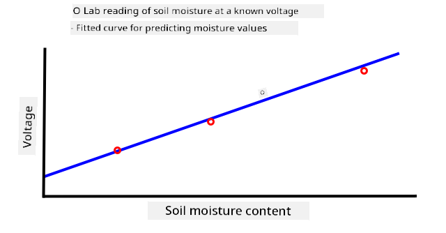

Di graph wey dey up show how to calibrate sensor. Di voltage go dey capture for soil sample wey dem go measure for lab by comparing di moist weight to di dry weight (by measuring di weight wet, then drying am for oven and measuring di dry weight). Once dem don take few readings, dem fit plot am for graph and fit line to di points. Dis line fit dey use to convert soil moisture sensor reading wey IoT device dey take to actual soil moisture measurement.

💁 For resistive soil moisture sensors, di voltage dey increase as soil moisture dey increase. For capacitive soil moisture sensors, di voltage dey reduce as soil moisture dey increase, so di graph for dis one go dey slope down, no be up.

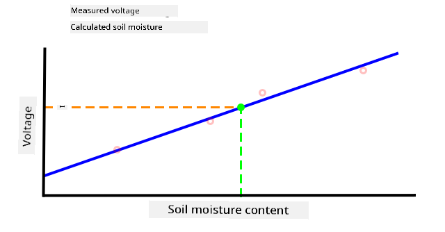

Di graph wey dey up show voltage reading from soil moisture sensor, and by following dat one go di line for di graph, di actual soil moisture fit dey calculate.

Dis method mean say farmer no need to dey get plenty lab measurement for field, dem fit use IoT device to measure soil moisture - e go make di time wey dem dey take measurement fast well well.

---

## 🚀 Challenge

Resistive and capacitive soil moisture sensors get plenty difference. Wetin be di difference, and which type (if any) go better for farmer to use? Di answer go change for developing and developed country?

## Post-lecture quiz

[Post-lecture quiz](https://black-meadow-040d15503.1.azurestaticapps.net/quiz/12)

## Review & Self Study

Make you read about di hardware and protocol wey sensors and actuators dey use:

* [GPIO Wikipedia page](https://wikipedia.org/wiki/General-purpose_input/output)
* [UART Wikipedia page](https://wikipedia.org/wiki/Universal_asynchronous_receiver-transmitter)
* [SPI Wikipedia page](https://wikipedia.org/wiki/Serial_Peripheral_Interface)
* [I2C Wikipedia page](https://wikipedia.org/wiki/I²C)
* [Zigbee Wikipedia page](https://wikipedia.org/wiki/Zigbee)

## Assignment

[Calibrate your sensor](assignment.md)

---

<!-- CO-OP TRANSLATOR DISCLAIMER START -->
**Disclaimer**:  
Dis dokyument don use AI transle-shon service [Co-op Translator](https://github.com/Azure/co-op-translator) do di transle-shon. Even as we dey try make am correct, abeg sabi say transle-shon wey machine do fit get mistake or no dey accurate. Di original dokyument for im native language na di main source wey you go fit trust. For important mata, e good make professional human transle-shon dey use. We no go fit take blame for any misunderstanding or wrong interpretation wey fit happen because you use dis transle-shon.
<!-- CO-OP TRANSLATOR DISCLAIMER END -->