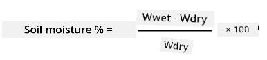
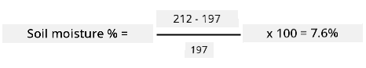

<!--
CO_OP_TRANSLATOR_METADATA:
{
  "original_hash": "506d21b544d5de47406c89ad496a21cd",
  "translation_date": "2025-11-18T19:33:57+00:00",
  "source_file": "2-farm/lessons/2-detect-soil-moisture/assignment.md",
  "language_code": "pcm"
}
-->
# How to calibrate your sensor

## Wetin you go do

For dis lesson, you don gather soil moisture sensor readings wey dey measure as values from 0-1023. To turn dis readings to real soil moisture readings, you go need to calibrate your sensor. You fit do am by taking readings from soil samples, then calculate the gravimetric soil moisture content from dis samples.

You go need repeat dis steps plenty times to get the readings wey you need, with different wetness of soil each time.

1. Use the soil moisture sensor take soil moisture reading. Write down the reading.

1. Take sample of the soil, weigh am. Write down the weight.

1. Dry the soil - warm oven wey dey 110°C (230°F) for few hours na the best way, you fit dry am for sunlight, or put am for warm, dry place until the soil don dry well well. E go dey powdery and loose.

    > 💁 For lab, to get the most correct result, you go dry am for oven for 48-72 hours. If your school get drying ovens, try use am to dry for longer. The longer e dry, the more correct the result.

1. Weigh the soil again.

    > 🔥 If you dry am for oven, make sure say e don cool first!

To calculate gravimetric soil moisture:

* Wwet - the weight of the wet soil
* Wdry - the weight of the dry soil

For example, make we say you get soil sample wey weigh 212g wet, and 197g dry.

* Wwet = 212g
* Wdry = 197g
* 212 - 197 = 15
* 15 / 197 = 0.076
* 0.076 * 100 = 7.6%

For dis example, the soil get gravimetric soil moisture of 7.6%.

Once you don get readings for at least 3 samples, draw graph of soil moisture % to soil moisture sensor reading and add line wey fit the points well. You fit use dis graph calculate the gravimetric soil moisture content for any sensor reading by checking the value from the line.

## Rubric

| Criteria | Exemplary | Adequate | Needs Improvement |
| -------- | --------- | -------- | ----------------- |
| Gather calibration data | Capture at least 3 calibration samples | Capture at least 2 calibration samples | Capture at least 1 calibration sample |
| Make a calibrated reading | Successfully draw the calibration graph and use sensor reading turn am to gravimetric soil moisture content | Successfully draw the calibration graph | No fit draw the graph |

---

<!-- CO-OP TRANSLATOR DISCLAIMER START -->
**Disclaimer**:  
Dis dokyument don translate wit AI translation service [Co-op Translator](https://github.com/Azure/co-op-translator). Even as we dey try make am accurate, abeg sabi say machine translation fit get mistake or no dey correct well. Di original dokyument for im native language na di main correct source. For important information, e good make una use professional human translation. We no go fit take blame for any misunderstanding or wrong interpretation wey fit happen because una use dis translation.
<!-- CO-OP TRANSLATOR DISCLAIMER END -->