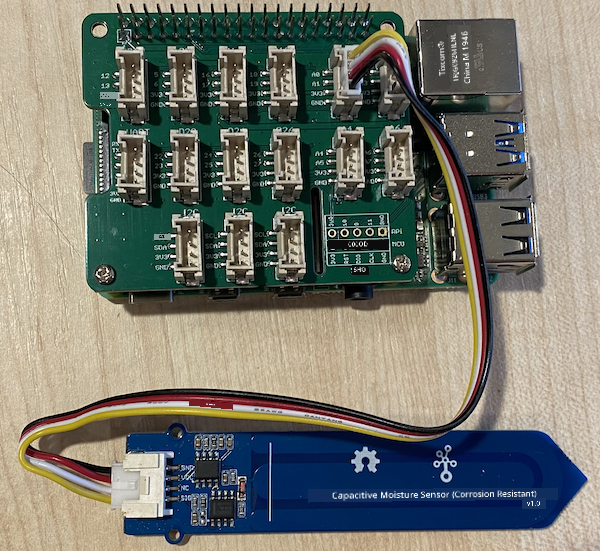
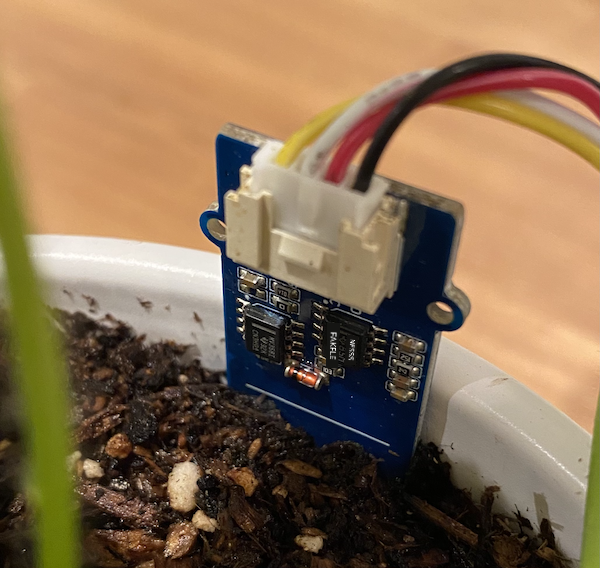

<!--
CO_OP_TRANSLATOR_METADATA:
{
  "original_hash": "9d4d00a47d5d0f3e6ce42c0d1020064a",
  "translation_date": "2025-11-18T19:33:21+00:00",
  "source_file": "2-farm/lessons/2-detect-soil-moisture/pi-soil-moisture.md",
  "language_code": "pcm"
}
-->
# Measure soil moisture - Raspberry Pi

For dis part of di lesson, you go add one capacitive soil moisture sensor to your Raspberry Pi, and you go read di values wey e dey give.

## Hardware

Di Raspberry Pi go need one capacitive soil moisture sensor.

Di sensor wey you go use na [Capacitive Soil Moisture Sensor](https://www.seeedstudio.com/Grove-Capacitive-Moisture-Sensor-Corrosion-Resistant.html), wey dey measure soil moisture by detecting di capacitance of di soil. Dis capacitance dey change as di soil moisture dey change. As di soil moisture dey increase, di voltage go dey reduce.

Dis sensor na analog sensor, so e dey use analog pin, and di 10-bit ADC wey dey di Grove Base Hat for di Pi go convert di voltage to digital signal from 1-1,023. Di signal go then pass through I<sup>2</sup>C via di GPIO pins for di Pi.

### Connect di soil moisture sensor

You fit connect di Grove soil moisture sensor to di Raspberry Pi.

#### Task - connect di soil moisture sensor

Connect di soil moisture sensor.


1. Put one end of di Grove cable for di socket wey dey di soil moisture sensor. E go only enter one way.

1. When di Raspberry Pi no get power, connect di other end of di Grove cable to di analog socket wey dem mark **A0** for di Grove Base hat wey dey di Pi. Dis socket na di second one from di right, for di row of sockets wey dey near di GPIO pins.



1. Put di soil moisture sensor inside soil. E get one 'highest position line' - na white line wey dey across di sensor. Put di sensor reach di line but no pass am.



## Program di soil moisture sensor

Now, you fit program di Raspberry Pi to use di soil moisture sensor wey you don attach.

### Task - program di soil moisture sensor

Program di device.

1. On di Pi and wait make e boot finish.

1. Open VS Code, either directly for di Pi, or connect am through di Remote SSH extension.

    > ⚠️ You fit check [di instructions for how to set up and open VS Code for nightlight - lesson 1 if you need am](../../../1-getting-started/lessons/1-introduction-to-iot/pi.md).

1. From di terminal, create new folder for di `pi` user home directory wey you go call `soil-moisture-sensor`. Create one file for dis folder wey you go call `app.py`.

1. Open dis folder for VS Code.

1. Add di code wey dey below to di `app.py` file to import some libraries wey you go need:

    ```python
    import time
    from grove.adc import ADC
    ```

    Di `import time` statement dey bring in di `time` module wey you go use later for dis assignment.

    Di `from grove.adc import ADC` statement dey bring in di `ADC` from di Grove Python libraries. Dis library get code wey go help you interact with di analog to digital converter wey dey di Pi base hat and read voltages from analog sensors.

1. Add di code wey dey below to create one instance of di `ADC` class:

    ```python
    adc = ADC()
    ```

1. Add one infinite loop wey go dey read from dis ADC for di A0 pin, and write di result go console. Dis loop go then sleep for 10 seconds between di reads.

    ```python
    while True:
        soil_moisture = adc.read(0)
        print("Soil moisture:", soil_moisture)

        time.sleep(10)
    ```

1. Run di Python app. You go see di soil moisture measurements wey go dey show for di console. Add small water to di soil, or commot di sensor from di soil, and see as di value go change.

    ```output
    pi@raspberrypi:~/soil-moisture-sensor $ python3 app.py 
    Soil moisture: 615
    Soil moisture: 612
    Soil moisture: 498
    Soil moisture: 493
    Soil moisture: 490
    Soil Moisture: 388
    ```

    For di example output wey dey above, you fit see as di voltage dey drop as you add water.

> 💁 You fit find dis code for di [code/pi](../../../../../2-farm/lessons/2-detect-soil-moisture/code/pi) folder.

😀 Your soil moisture sensor program work well!

---

<!-- CO-OP TRANSLATOR DISCLAIMER START -->
**Disclaimer**:  
Dis docu don dey translate wit AI translation service [Co-op Translator](https://github.com/Azure/co-op-translator). Even though we dey try make am accurate, abeg no forget say automatic translation fit get mistake or no dey 100% correct. Di original docu for di language wey dem write am first na di main correct one. For important information, e go better make professional human translator check am. We no go fit take blame for any misunderstanding or wrong interpretation wey fit happen because of dis translation.
<!-- CO-OP TRANSLATOR DISCLAIMER END -->