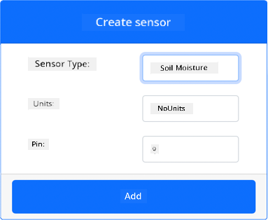
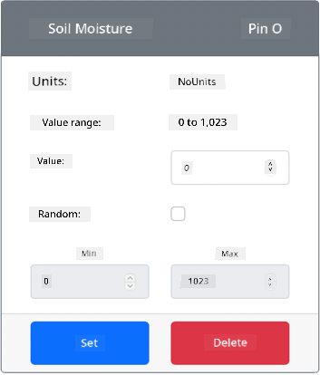

<!--
CO_OP_TRANSLATOR_METADATA:
{
  "original_hash": "2bf65f162bcebd35fbcba5fd245afac4",
  "translation_date": "2025-11-18T19:30:39+00:00",
  "source_file": "2-farm/lessons/2-detect-soil-moisture/virtual-device-soil-moisture.md",
  "language_code": "pcm"
}
-->
# Measure soil moisture - Virtual IoT Hardware

For dis part of di lesson, you go add one capacitive soil moisture sensor to your virtual IoT device, and read di values wey e dey give.

## Virtual Hardware

Di virtual IoT device go use one simulated Grove capacitive soil moisture sensor. Dis one go make dis lab dey same as wen you dey use Raspberry Pi wit physical Grove capacitive soil moisture sensor.

For physical IoT device, di soil moisture sensor na capacitive sensor wey dey measure soil moisture by detecting di capacitance of di soil, one property wey dey change as di soil moisture dey change. As di soil moisture dey increase, di voltage go dey reduce.

Dis sensor na analog sensor, so e dey use one simulated 10-bit ADC to report value from 1-1,023.

### Add di soil moisture sensor to CounterFit

To use virtual soil moisture sensor, you go need add am to di CounterFit app.

#### Task - Add di soil moisture sensor to CounterFit

Add di soil moisture sensor to di CounterFit app.

1. Create one new Python app for your computer inside one folder wey you go call `soil-moisture-sensor` wit one single file wey you go call `app.py` and one Python virtual environment, then add di CounterFit pip packages.

    > ⚠️ You fit check [di instructions for how to create and set up CounterFit Python project for lesson 1 if you need am](../../../1-getting-started/lessons/1-introduction-to-iot/virtual-device.md).

1. Make sure say di CounterFit web app dey run.

1. Create di soil moisture sensor:

    1. For di *Create sensor* box inside di *Sensors* pane, drop down di *Sensor type* box and select *Soil Moisture*.

    1. Leave di *Units* as *NoUnits*.

    1. Make sure say di *Pin* dey set to *0*.

    1. Click di **Add** button to create di *Soil Moisture* sensor for Pin 0.

    

    Di soil moisture sensor go dey created and e go show for di sensors list.

    

## Program di soil moisture sensor app

Now you fit program di soil moisture sensor app using di CounterFit sensors.

### Task - program di soil moisture sensor app

Program di soil moisture sensor app.

1. Make sure say di `soil-moisture-sensor` app dey open for VS Code.

1. Open di `app.py` file.

1. Add di code wey dey below to di top of `app.py` to connect di app to CounterFit:

    ```python
    from counterfit_connection import CounterFitConnection
    CounterFitConnection.init('127.0.0.1', 5000)
    ```

1. Add di code wey dey below to di `app.py` file to import some libraries wey you go need:

    ```python
    import time
    from counterfit_shims_grove.adc import ADC
    ```

    Di `import time` statement dey bring in di `time` module wey you go use later for dis assignment.

    Di `from counterfit_shims_grove.adc import ADC` statement dey bring in di `ADC` class to interact wit one virtual analog to digital converter wey fit connect to CounterFit sensor.

1. Add di code wey dey below dis one to create one instance of di `ADC` class:

    ```python
    adc = ADC()
    ```

1. Add one infinite loop wey go dey read from dis ADC for pin 0 and write di result go console. Dis loop go sleep for 10 seconds between di reads.

    ```python
    while True:
        soil_moisture = adc.read(0)
        print("Soil moisture:", soil_moisture)
    
        time.sleep(10)
    ```

1. From di CounterFit app, change di value of di soil moisture sensor wey di app go dey read. You fit do dis one in two ways:

    * Enter one number for di *Value* box for di soil moisture sensor, then click di **Set** button. Di number wey you enter go be di value wey di sensor go return.

    * Check di *Random* checkbox, and enter *Min* and *Max* value, then click di **Set** button. Every time wey di sensor dey read value, e go read one random number between *Min* and *Max*.

1. Run di Python app. You go see di soil moisture measurements wey dem dey write for console. Change di *Value* or di *Random* settings to see di value dey change.

    ```output
    (.venv) ➜ soil-moisture-sensor $ python app.py 
    Soil moisture: 615
    Soil moisture: 612
    Soil moisture: 498
    Soil moisture: 493
    Soil moisture: 490
    Soil Moisture: 388
    ```

> 💁 You fit find dis code for di [code/virtual-device](../../../../../2-farm/lessons/2-detect-soil-moisture/code/virtual-device) folder.

😀 Your soil moisture sensor program don work well!

---

<!-- CO-OP TRANSLATOR DISCLAIMER START -->
**Disclaimer**:  
Dis dokyument don use AI transleto service [Co-op Translator](https://github.com/Azure/co-op-translator) do di translation. Even as we dey try make am correct, abeg sabi say machine translation fit get mistake or no dey accurate well. Di original dokyument for im native language na di one wey you go take as di correct source. For important mata, e better make professional human transleto do di work. We no go fit take blame for any misunderstanding or wrong interpretation wey fit happen because you use dis translation.
<!-- CO-OP TRANSLATOR DISCLAIMER END -->