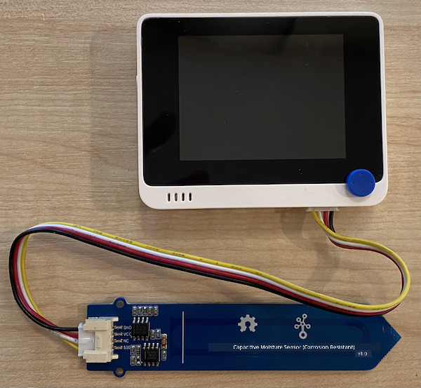

<!--
CO_OP_TRANSLATOR_METADATA:
{
  "original_hash": "0d55caa8c23d73635b7559102cd17b8a",
  "translation_date": "2025-11-18T19:31:13+00:00",
  "source_file": "2-farm/lessons/2-detect-soil-moisture/wio-terminal-soil-moisture.md",
  "language_code": "pcm"
}
-->
# Measure soil moisture - Wio Terminal

For dis part of di lesson, you go add one capacitive soil moisture sensor to your Wio Terminal, and read di values wey e dey give.

## Hardware

Di Wio Terminal go need one capacitive soil moisture sensor.

Di sensor wey you go use na [Capacitive Soil Moisture Sensor](https://www.seeedstudio.com/Grove-Capacitive-Moisture-Sensor-Corrosion-Resistant.html), e dey measure soil moisture by detecting di capacitance of di soil, one property wey dey change as di soil moisture dey change. As di soil moisture dey increase, di voltage go dey reduce.

Dis sensor na analog sensor, e go connect to di analog pins for di Wio Terminal, using di onboard ADC to create value from 0-1,023.

### Connect di soil moisture sensor

Di Grove soil moisture sensor fit connect to di Wio Terminal configurable analog/digital port.

#### Task - connect di soil moisture sensor

Connect di soil moisture sensor.


1. Put one end of Grove cable inside di socket for di soil moisture sensor. E go only enter one way.

1. Make sure say di Wio Terminal no dey connect to your computer or any power supply, then connect di other end of di Grove cable to di right-hand side Grove socket for di Wio Terminal as you dey look di screen. Dis socket na di one wey far pass di power button.



1. Put di soil moisture sensor inside soil. E get one 'highest position line' - one white line wey dey across di sensor. Put di sensor reach di line but no pass am.


1. Now you fit connect di Wio Terminal to your computer.

## Program di soil moisture sensor

Di Wio Terminal don ready to program make e use di soil moisture sensor wey you don attach.

### Task - program di soil moisture sensor

Program di device.

1. Create one new Wio Terminal project using PlatformIO. Call di project `soil-moisture-sensor`. Add code for di `setup` function to configure di serial port.

    > ⚠️ You fit check [di instructions for how to create PlatformIO project for project 1, lesson 1 if you need am](../../../1-getting-started/lessons/1-introduction-to-iot/wio-terminal.md#create-a-platformio-project).

1. Dis sensor no get library, so you fit read from di analog pin using di Arduino [`analogRead`](https://www.arduino.cc/reference/en/language/functions/analog-io/analogread/) function wey dey built-in. Start by configuring di analog pin for input so values fit dey read from am by adding dis code to di `setup` function.

    ```cpp
    pinMode(A0, INPUT);
    ```

    Dis one go set di `A0` pin, di combined analog/digital pin, as input pin wey voltage fit dey read from.

1. Add dis code to di `loop` function to read di voltage from di pin:

    ```cpp
    int soil_moisture = analogRead(A0);
    ```

1. After dis code, add dis code to print di value to di serial port:

    ```cpp
    Serial.print("Soil Moisture: ");
    Serial.println(soil_moisture);
    ```

1. Finally, add delay for di end wey go last 10 seconds:

    ```cpp
    delay(10000);
    ```

1. Build and upload di code to di Wio Terminal.

    > ⚠️ You fit check [di instructions for how to create PlatformIO project for project 1, lesson 1 if you need am](../../../1-getting-started/lessons/1-introduction-to-iot/wio-terminal.md#write-the-hello-world-app).

1. Once you don upload am, you fit monitor di soil moisture using di serial monitor. Add small water to di soil, or commot di sensor from di soil, and see how di value go change.

    ```output
    > Executing task: platformio device monitor <
    
    --- Available filters and text transformations: colorize, debug, default, direct, hexlify, log2file, nocontrol, printable, send_on_enter, time
    --- More details at http://bit.ly/pio-monitor-filters
    --- Miniterm on /dev/cu.usbmodem1201  9600,8,N,1 ---
    --- Quit: Ctrl+C | Menu: Ctrl+T | Help: Ctrl+T followed by Ctrl+H ---
    Soil Moisture: 526
    Soil Moisture: 529
    Soil Moisture: 521
    Soil Moisture: 494
    Soil Moisture: 454
    Soil Moisture: 456
    Soil Moisture: 395
    Soil Moisture: 388
    Soil Moisture: 394
    Soil Moisture: 391
    ```

    For di example output wey dey above, you go see how di voltage dey drop as you dey add water.

> 💁 You fit find dis code for di [code/wio-terminal](../../../../../2-farm/lessons/2-detect-soil-moisture/code/wio-terminal) folder.

😀 Your soil moisture sensor program don work well!

---

<!-- CO-OP TRANSLATOR DISCLAIMER START -->
**Disclaimer**:  
Dis dokyument don use AI transleto service [Co-op Translator](https://github.com/Azure/co-op-translator) do di translation. Even as we dey try make am accurate, abeg sabi say machine translation fit get mistake or no dey correct well. Di original dokyument wey dey for im native language na di one wey you go take as di correct source. For important mata, e good make professional human transleto check am. We no go fit take blame for any misunderstanding or wrong interpretation wey fit happen because you use dis translation.
<!-- CO-OP TRANSLATOR DISCLAIMER END -->