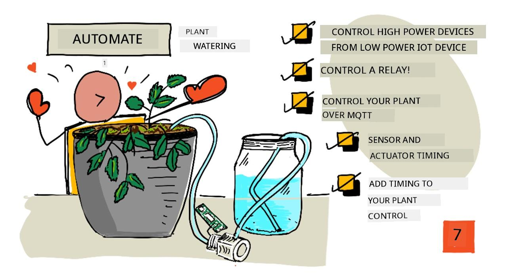
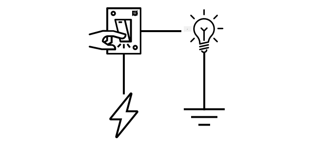
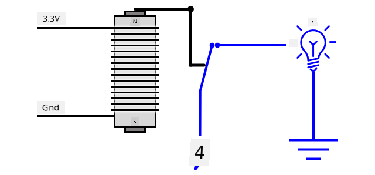
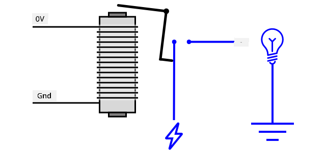
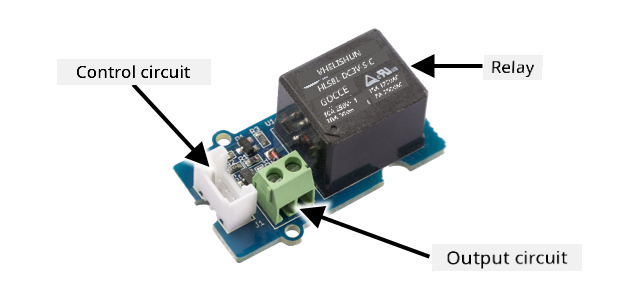
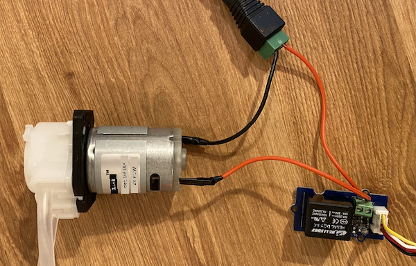
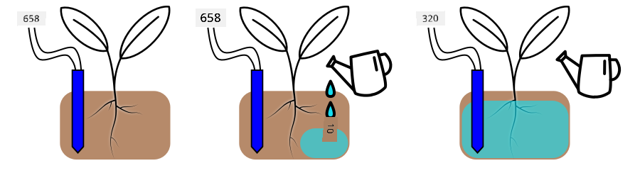
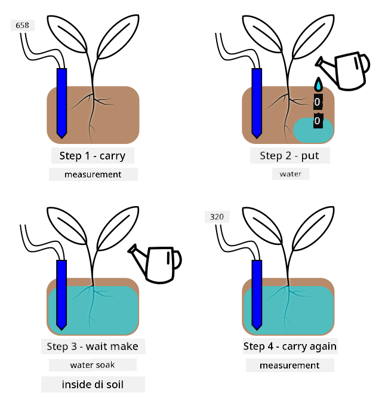

<!--
CO_OP_TRANSLATOR_METADATA:
{
  "original_hash": "f7bb24ba53fb627ddb38a8b24a05e594",
  "translation_date": "2025-11-18T19:47:01+00:00",
  "source_file": "2-farm/lessons/3-automated-plant-watering/README.md",
  "language_code": "pcm"
}
-->
# Automated plant watering



> Sketchnote by [Nitya Narasimhan](https://github.com/nitya). Click di image for bigger version.

Dis lesson na part of di [IoT for Beginners Project 2 - Digital Agriculture series](https://youtube.com/playlist?list=PLmsFUfdnGr3yCutmcVg6eAUEfsGiFXgcx) wey Microsoft Reactor teach. [Microsoft Reactor](https://developer.microsoft.com/reactor/?WT.mc_id=academic-17441-jabenn).

[](https://youtu.be/g9FfZwv9R58)

## Pre-lecture quiz

[Pre-lecture quiz](https://black-meadow-040d15503.1.azurestaticapps.net/quiz/13)

## Introduction

For di last lesson, you don learn how to dey check soil moisture. For dis lesson, you go sabi how to build di main parts of one automated watering system wey go respond to soil moisture. You go also learn about timing - how sensors fit take time to respond to changes, and how actuators fit take time to change di properties wey sensors dey measure.

For dis lesson we go talk about:

* [Control high power devices from a low power IoT device](../../../../../2-farm/lessons/3-automated-plant-watering)
* [Control a relay](../../../../../2-farm/lessons/3-automated-plant-watering)
* [Control your plant over MQTT](../../../../../2-farm/lessons/3-automated-plant-watering)
* [Sensor and actuator timing](../../../../../2-farm/lessons/3-automated-plant-watering)
* [Add timing to your plant control server](../../../../../2-farm/lessons/3-automated-plant-watering)

## Control high power devices from a low power IoT device

IoT devices dey use low voltage. Dis voltage dey okay for sensors and low-power actuators like LEDs, but e no dey enough to control bigger hardware, like water pump wey dem dey use for irrigation. Even small pumps wey you fit use for houseplants dey draw too much current for IoT dev kit and e fit burn di board.

> 🎓 Current, wey dem dey measure in Amps (A), na di amount of electricity wey dey move through circuit. Voltage na di push, current na how much dem dey push. You fit read more about current for [electric current page on Wikipedia](https://wikipedia.org/wiki/Electric_current).

Di solution na to connect di pump to external power supply, and use actuator to switch di pump on, like how you go switch light on. E dey take small power (energy wey dey your body) for your finger to flip switch, and dis go connect di light to mains electricity wey dey run for 110v/240v.



> 🎓 [Mains electricity](https://wikipedia.org/wiki/Mains_electricity) na di electricity wey dem dey deliver to houses and businesses through national infrastructure for many parts of di world.

✅ IoT devices fit usually provide 3.3V or 5V, at less than 1 amp (1A) of current. Compare dis to mains electricity wey dey most times at 230V (120V for North America and 100V for Japan), and fit provide power for devices wey dey draw 30A.

Plenty actuators dey wey fit do dis work, including mechanical devices wey you fit attach to switches wey dey mimic finger wey dey turn dem on. Di most popular one na relay.

### Relays

Relay na electromechanical switch wey dey change electrical signal to mechanical movement wey dey turn switch on. Di main part of relay na electromagnet.

> 🎓 [Electromagnets](https://wikipedia.org/wiki/Electromagnet) na magnets wey dem dey create by passing electricity through coil of wire. When electricity dey on, di coil go magnetize. When electricity dey off, di coil go lose di magnetism.



For relay, control circuit dey power di electromagnet. When di electromagnet dey on, e go pull lever wey go move switch, close di contacts and complete di output circuit.



When di control circuit dey off, di electromagnet go off, release di lever and open di contacts, turn off di output circuit. Relays na digital actuators - high signal to di relay go turn am on, low signal go turn am off.

Di output circuit fit power extra hardware, like irrigation system. IoT device fit turn di relay on, complete di output circuit wey dey power di irrigation system, and di plants go get water. Di IoT device fit then turn di relay off, cut di power to di irrigation system, turn di water off.


For di video above, relay dey turn on. LED for di relay dey light up to show say e dey on (some relay boards get LEDs to show if relay dey on or off), and power dey go di pump, turn am on and pump water go di plant.

> 💁 Relays fit also dey switch between two output circuits instead of turning one on and off. As di lever dey move, e dey move switch from completing one output circuit to completing another output circuit, usually dey share common power connection, or common ground connection.

✅ Do small research: Plenty types of relays dey, with differences like if di control circuit dey turn di relay on or off when power dey apply, or multiple output circuits. Find out about dis different types.

When di lever dey move, you fit usually hear am make contact with di electromagnet with one clear click sound.

> 💁 Relay fit dey wire so say di connection go actually break power to di relay, turn di relay off, wey go then send power to di relay turn am back on again, and so on. Dis go make di relay dey click very fast dey make buzzing sound. Na so some of di first buzzers wey dem dey use for electric doorbells dey work.

### Relay power

Di electromagnet no need plenty power to activate and pull di lever, e fit dey control using di 3.3V or 5V output from IoT dev kit. Di output circuit fit carry plenty power, depending on di relay, including mains voltage or even higher power levels for industrial use. Dis way IoT dev kit fit control irrigation system, from small pump for one plant, to big industrial system for whole commercial farm.



Di image above dey show Grove relay. Di control circuit dey connect to IoT device and dey turn di relay on or off using 3.3V or 5V. Di output circuit get two terminals, any one fit be power or ground. Di output circuit fit handle up to 250V at 10A, enough for plenty mains-powered devices. You fit get relays wey fit handle even higher power levels.



For di image above, power dey supply to pump through relay. Red wire dey connect di +5V terminal of USB power supply to one terminal of di output circuit of di relay, and another red wire dey connect di other terminal of di output circuit to di pump. Black wire dey connect di pump to di ground for di USB power supply. When di relay turn on, e go complete di circuit, send 5V to di pump, turn di pump on.

## Control a relay

You fit control relay from your IoT dev kit.

### Task - control a relay

Follow di guide wey dey relevant to control relay using your IoT device:

* [Arduino - Wio Terminal](wio-terminal-relay.md)
* [Single-board computer - Raspberry Pi](pi-relay.md)
* [Single-board computer - Virtual device](virtual-device-relay.md)

## Control your plant over MQTT

So far di relay dey control by di IoT device directly based on one soil moisture reading. For commercial irrigation system, di control logic go dey centralized, e go allow am make decisions on watering using data from plenty sensors, and e go allow any configuration to dey change for one single place. To simulate dis, you fit control di relay over MQTT.

### Task - control the relay over MQTT

1. Add di relevant MQTT libraries/pip packages and code to your `soil-moisture-sensor` project to connect to MQTT. Name di client ID as `soilmoisturesensor_client` wey dey prefix by your ID.

    > ⚠️ You fit check [di instructions for connecting to MQTT for project 1, lesson 4 if you need am](../../../1-getting-started/lessons/4-connect-internet/README.md#connect-your-iot-device-to-mqtt).

1. Add di relevant device code to send telemetry with di soil moisture settings. For di telemetry message, name di property `soil_moisture`.

    > ⚠️ You fit check [di instructions for sending telemetry to MQTT for project 1, lesson 4 if you need am](../../../1-getting-started/lessons/4-connect-internet/README.md#send-telemetry-from-your-iot-device).

1. Create some local server code to subscribe to telemetry and send command to control di relay for folder wey dem call `soil-moisture-sensor-server`. Name di property for di command message `relay_on`, and set di client ID as `soilmoisturesensor_server` wey dey prefix by your ID. Keep di same structure as di server code wey you write for project 1, lesson 4 as you go dey add to dis code later for dis lesson.

    > ⚠️ You fit check [di instructions for sending telemetry to MQTT](../../../1-getting-started/lessons/4-connect-internet/README.md#write-the-server-code) and [sending commands over MQTT](../../../1-getting-started/lessons/4-connect-internet/README.md#send-commands-to-the-mqtt-broker) for project 1, lesson 4 if you need am.

1. Add di relevant device code to control di relay from received commands, using di `relay_on` property from di message. Send true for `relay_on` if di `soil_moisture` dey greater than 450, otherwise send false, di same logic wey you add for di IoT device earlier.

    > ⚠️ You fit check [di instructions for responding to commands from MQTT for project 1, lesson 4 if you need am](../../../1-getting-started/lessons/4-connect-internet/README.md#handle-commands-on-the-iot-device).

> 💁 You fit find dis code for [code-mqtt](../../../../../2-farm/lessons/3-automated-plant-watering/code-mqtt) folder.

Make sure say di code dey run for your device and local server, and test am by changing soil moisture levels, either by changing di values wey virtual sensor dey send, or by changing di moisture levels of di soil by adding water or removing di sensor from di soil.

## Sensor and actuator timing

For lesson 3 you build nightlight - LED wey dey turn on as soon as low level of light dey detect by light sensor. Di light sensor dey detect change for light levels quick, and di device fit respond fast, only dey limit by di length of delay for di `loop` function or `while True:` loop. As IoT developer, you no fit always rely on dis kind fast feedback loop.

### Timing for soil moisture

If you do di last lesson on soil moisture using physical sensor, you go notice say e dey take few seconds for di soil moisture reading to drop after you water your plant. Dis no be because di sensor dey slow, but because e dey take time for water to soak through di soil.

> 💁 If you water too close to di sensor you fit see say di reading drop quick, then e go come back up - dis na because di water wey dey near di sensor dey spread throughout di rest of di soil, reduce di soil moisture by di sensor.



For di diagram above, soil moisture reading dey show 658. Di plant dey water, but dis reading no dey change immediately, as di water never reach di sensor. Watering fit even finish before di water reach di sensor and di value drop to show di new moisture level.

If you dey write code to control irrigation system through relay based on soil moisture levels, you go need to think about dis delay and build smarter timing into your IoT device.

✅ Take small time to think how you fit do dis.

### Control sensor and actuator timing
Imagine say dem give you work to build irrigation system for farm. Base on the soil type, dem find say the correct soil moisture level wey the plant need dey match analog voltage reading of 400-450.

You fit program the device like the nightlight - anytime the sensor read pass 450, make e turn on relay wey go turn on pump. But the wahala be say water dey take time to move from the pump, enter the soil reach the sensor. The sensor go stop the water when e detect level of 450, but the water level go still dey drop as the pumped water dey soak enter the soil. The end result na wasted water, and e fit spoil the root.

✅ Remember - too much water fit bad for plant like say water no dey at all, and e dey waste important resource.

The better way na to sabi say e get delay between when actuator dey turn on and when the sensor go show change. This mean say the sensor no suppose dey rush to measure the value again, and the actuator need to turn off for some time before the next sensor measurement.

How long the relay go dey on each time? E better make you dey careful and just turn the relay on for small time, then wait make the water soak enter, then check the moisture level again. After all, you fit always turn am on again to add more water, but you no fit remove water from the soil.

💁 This kind timing control na something wey depend on the IoT device wey you dey build, the property wey you dey measure and the sensors plus actuators wey you dey use.


For example, I get strawberry plant wey get soil moisture sensor and pump wey relay dey control. I don observe say when I add water, e dey take like 20 seconds before the soil moisture reading go balance. This mean say I need to turn the relay off and wait 20 seconds before I check the moisture level. I go prefer make water no too plenty than make e too much - I fit always turn the pump on again, but I no fit remove water from the plant.



This mean say the best process go be watering cycle wey be like this:

* Turn on the pump for 5 seconds
* Wait 20 seconds
* Check the soil moisture
* If the level still dey above wetin I need, repeat the steps wey dey up

5 seconds fit too long for the pump, especially if the moisture level just dey small above the required level. The best way to sabi wetin timing to use na to try am, then adjust am when you get sensor data, with constant feedback loop. This fit even lead to more detailed timing, like turning the pump on for 1 second for every 100 above the required soil moisture, instead of fixed 5 seconds.

✅ Do small research: E get other timing things wey you suppose consider? The plant fit dey watered anytime the soil moisture dey too low, or e get specific time of day wey good or bad to water plants?

💁 Weather prediction fit also dey useful when you dey control automated watering system for outdoor farming. If rain dey come, you fit pause the watering till after the rain finish. By that time, the soil fit don moist enough wey e no need watering, e go dey more efficient than to waste water by watering just before rain.

## Add timing to your plant control server

You fit change the server code to add control for the timing of the watering cycle, and wait for the soil moisture level to change. The server logic for controlling the relay timing be:

1. Telemetry message don land
1. Check the soil moisture level
1. If e dey ok, no do anything. If the reading dey too high (meaning the soil moisture dey too low) then:
    1. Send command to turn the relay on
    1. Wait for 5 seconds
    1. Send command to turn the relay off
    1. Wait for 20 seconds make the soil moisture level balance

The watering cycle, the process from when telemetry message land till e ready to process soil moisture level again, dey take about 25 seconds. We dey send soil moisture level every 10 seconds, so e get overlap wey message go land while the server dey wait for soil moisture level to balance, wey fit start another watering cycle.

E get two options to solve this:

* Change the IoT device code make e dey send telemetry every minute, this way the watering cycle go don finish before the next message go land
* Unsubscribe from the telemetry during the watering cycle

The first option no dey always good for big farms. The farmer fit want capture the soil moisture level as the soil dey watered for later analysis, for example to sabi water flow for different areas for the farm to guide more targeted watering. The second option better - the code just dey ignore telemetry when e no fit use am, but the telemetry still dey for other services wey fit subscribe to am.

💁 IoT data no dey sent from only one device to only one service, instead many devices fit send data to broker, and many services fit dey listen to the data from the broker. For example, one service fit dey listen to soil moisture data and store am for database for analysis later. Another service fit also dey listen to the same telemetry to control irrigation system.

### Task - add timing to your plant control server

Update your server code make e run the relay for 5 seconds, then wait 20 seconds.

1. Open the `soil-moisture-sensor-server` folder for VS Code if e never open. Make sure say the virtual environment dey activated.

1. Open the `app.py` file

1. Add this code to the `app.py` file under the imports wey dey already:

    ```python
    import threading
    ```

    This statement dey import `threading` from Python libraries, threading dey allow python run other code while e dey wait.

1. Add this code before the `handle_telemetry` function wey dey handle telemetry messages wey the server code dey receive:

    ```python
    water_time = 5
    wait_time = 20
    ```

    This one dey define how long the relay go run (`water_time`), and how long e go wait after to check the soil moisture (`wait_time`).

1. Under this code, add this one:

    ```python
    def send_relay_command(client, state):
        command = { 'relay_on' : state }
        print("Sending message:", command)
        client.publish(server_command_topic, json.dumps(command))
    ```

    This code dey define function wey dem call `send_relay_command` wey dey send command through MQTT to control the relay. The telemetry dey created as dictionary, then e dey convert to JSON string. The value wey e pass enter `state` dey determine if the relay go dey on or off.

1. After the `send_relay_code` function, add this code:

    ```python
    def control_relay(client):
        print("Unsubscribing from telemetry")
        mqtt_client.unsubscribe(client_telemetry_topic)
    
        send_relay_command(client, True)
        time.sleep(water_time)
        send_relay_command(client, False)
    
        time.sleep(wait_time)
    
        print("Subscribing to telemetry")
        mqtt_client.subscribe(client_telemetry_topic)
    ```

    This one dey define function to control the relay based on the timing wey dem need. E dey start by unsubscribing from telemetry so that soil moisture messages no go dey processed while watering dey happen. Next e dey send command to turn the relay on. E go wait for the `water_time` before e send command to turn the relay off. Finally e go wait for the soil moisture level to balance for `wait_time` seconds. E go then re-subscribe to telemetry.

1. Change the `handle_telemetry` function to this:

    ```python
    def handle_telemetry(client, userdata, message):
        payload = json.loads(message.payload.decode())
        print("Message received:", payload)
    
        if payload['soil_moisture'] > 450:
            threading.Thread(target=control_relay, args=(client,)).start()
    ```

    This code dey check the soil moisture level. If e pass 450, the soil need watering, so e go call the `control_relay` function. This function dey run for separate thread, dey run for background.

1. Make sure say your IoT device dey run, then run this code. Change the soil moisture level and observe wetin go happen to the relay - e suppose turn on for 5 seconds then remain off for at least 20 seconds, only turning on if the soil moisture level no dey enough.

    ```output
    (.venv) ➜  soil-moisture-sensor-server ✗ python app.py
    Message received: {'soil_moisture': 457}
    Unsubscribing from telemetry
    Sending message: {'relay_on': True}
    Sending message: {'relay_on': False}
    Subscribing to telemetry
    Message received: {'soil_moisture': 302}
    ```

    Good way to test this for simulated irrigation system na to use dry soil, then pour water manually while the relay dey on, stop to pour when the relay turn off.

💁 You fit find this code for [code-timing](../../../../../2-farm/lessons/3-automated-plant-watering/code-timing) folder.

💁 If you wan use pump to build real irrigation system, then you fit use [6V water pump](https://www.seeedstudio.com/6V-Mini-Water-Pump-p-1945.html) with [USB terminal power supply](https://www.adafruit.com/product/3628). Make sure say the power to or from the pump dey connect through the relay.

---

## 🚀 Challenge

You fit think of other IoT or electrical devices wey get similar wahala where e dey take time for the actuator result to reach the sensor. You fit get some for your house or school.

* Wetin dem dey measure?
* How long e dey take for the property to change after actuator dey used?
* E dey ok if the property change pass the required value?
* How e fit return back to the required value if e need am?

## Post-lecture quiz

[Post-lecture quiz](https://black-meadow-040d15503.1.azurestaticapps.net/quiz/14)

## Review & Self Study

* Read more about relays including how dem dey use am before for telephone exchanges for [relay Wikipedia page](https://wikipedia.org/wiki/Relay).

## Assignment

[Build a more efficient watering cycle](assignment.md)

---

<!-- CO-OP TRANSLATOR DISCLAIMER START -->
**Disclaimer**:  
Dis dokyument don translate wit AI translation service [Co-op Translator](https://github.com/Azure/co-op-translator). Even as we dey try make sure say e correct, abeg make you sabi say machine translation fit get mistake or no dey accurate well. Di original dokyument for im native language na di main source wey you go trust. For important information, e good make professional human translation dey use. We no go fit take blame for any misunderstanding or wrong interpretation wey fit happen because you use dis translation.
<!-- CO-OP TRANSLATOR DISCLAIMER END -->