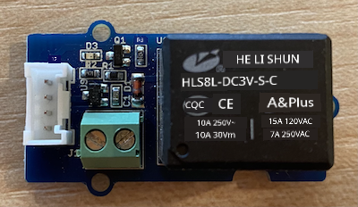
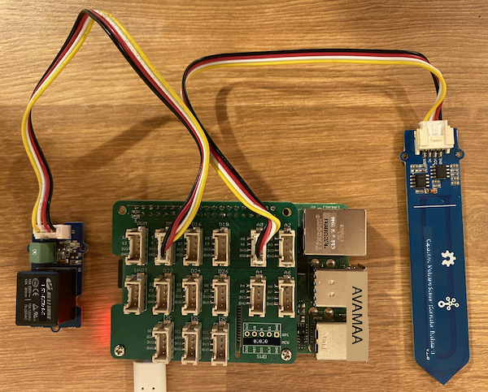

<!--
CO_OP_TRANSLATOR_METADATA:
{
  "original_hash": "66b81165e60f8f169bd52a401b6a0f8b",
  "translation_date": "2025-11-18T19:48:26+00:00",
  "source_file": "2-farm/lessons/3-automated-plant-watering/pi-relay.md",
  "language_code": "pcm"
}
-->
# Control Relay - Raspberry Pi

For dis part of di lesson, you go add relay to your Raspberry Pi join di soil moisture sensor, and control am based on di soil moisture level.

## Hardware

Di Raspberry Pi need relay.

Di relay wey you go use na [Grove relay](https://www.seeedstudio.com/Grove-Relay.html), e be normally-open relay (e mean say di output circuit dey open, or e no connect when signal no dey go di relay) and e fit handle output circuits up to 250V and 10A.

Dis one na digital actuator, so e go connect to digital pin for di Grove Base Hat.

### Connect di relay

Di Grove relay fit connect to di Raspberry Pi.

#### Task

Connect di relay.



1. Put one end of Grove cable for di socket wey dey di relay. E go only enter one way.

1. When di Raspberry Pi dey off, connect di other end of di Grove cable to di digital socket wey dem mark **D5** for di Grove Base hat wey dey attach to di Pi. Dis socket na di second one from di left, for di row of sockets wey dey near di GPIO pins. Leave di soil moisture sensor wey dey connect to di **A0** socket.



1. Put di soil moisture sensor inside soil, if e no dey already from di last lesson.

## Program di relay

Now, di Raspberry Pi fit program to use di relay wey you don attach.

### Task

Program di device.

1. Power di Pi and wait make e boot.

1. Open di `soil-moisture-sensor` project from di last lesson for VS Code if e no dey open already. You go dey add to dis project.

1. Add dis code to di `app.py` file under di imports wey dey already:

    ```python
    from grove.grove_relay import GroveRelay
    ```

    Dis statement dey import di `GroveRelay` from di Grove Python libraries to fit interact with di Grove relay.

1. Add dis code under di declaration of di `ADC` class to create `GroveRelay` instance:

    ```python
    relay = GroveRelay(5)
    ```

    Dis one go create relay wey dey use pin **D5**, di digital pin wey you connect di relay to.

1. To test say di relay dey work, add dis one to di `while True:` loop:

    ```python
    relay.on()
    time.sleep(.5)
    relay.off()
    ```

    Di code go turn di relay on, wait 0.5 seconds, then e go turn di relay off.

1. Run di Python app. Di relay go dey turn on and off every 10 seconds, with half second delay between di on and off. You go hear di relay click on then click off. One LED for di Grove board go light when di relay dey on, then e go off when di relay dey off.

    

## Control di relay from soil moisture

Now wey di relay dey work, you fit control am based on di soil moisture readings.

### Task

Control di relay.

1. Delete di 3 lines of code wey you add to test di relay. Replace dem with dis code:

    ```python
    if soil_moisture > 450:
        print("Soil Moisture is too low, turning relay on.")
        relay.on()
    else:
        print("Soil Moisture is ok, turning relay off.")
        relay.off()
    ```

    Dis code dey check di soil moisture level from di soil moisture sensor. If e pass 450, e go turn di relay on, and e go turn am off when e go below 450.

    > 💁 Remember say di capacitive soil moisture sensor dey read say di lower di soil moisture level, di more moisture dey di soil and vice versa.

1. Run di Python app. You go see di relay dey turn on or off based on di soil moisture level. Try am for dry soil, then add water.

    ```output
    Soil Moisture: 638
    Soil Moisture is too low, turning relay on.
    Soil Moisture: 452
    Soil Moisture is too low, turning relay on.
    Soil Moisture: 347
    Soil Moisture is ok, turning relay off.
    ```

> 💁 You fit find dis code for di [code-relay/pi](../../../../../2-farm/lessons/3-automated-plant-watering/code-relay/pi) folder.

😀 Your soil moisture sensor wey dey control relay program don work well!

---

<!-- CO-OP TRANSLATOR DISCLAIMER START -->
**Disclaimer**:  
Dis dokyument don use AI transle-shon service [Co-op Translator](https://github.com/Azure/co-op-translator) do di transle-shon. Even as we dey try make am accurate, abeg make you sabi say transle-shon wey machine do fit get mistake or no dey correct well. Di original dokyument for im native language na di one wey you go take as di correct source. For important mata, e good make you use professional human transle-shon. We no go fit take blame for any misunderstanding or wrong interpretation wey fit happen because you use dis transle-shon.
<!-- CO-OP TRANSLATOR DISCLAIMER END -->