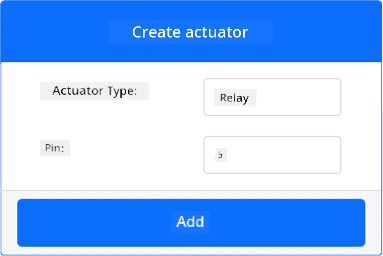
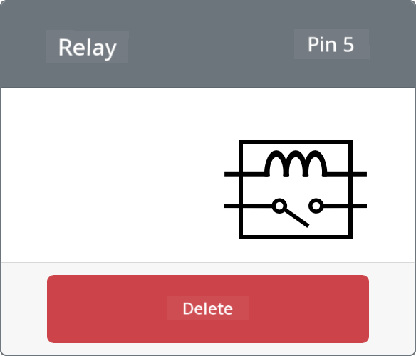

<!--
CO_OP_TRANSLATOR_METADATA:
{
  "original_hash": "f8f541ee945545017a51aaf309aa37c3",
  "translation_date": "2025-11-18T19:49:34+00:00",
  "source_file": "2-farm/lessons/3-automated-plant-watering/virtual-device-relay.md",
  "language_code": "pcm"
}
-->
# Control Relay - Virtual IoT Hardware

For dis part of di lesson, you go add relay to your virtual IoT device join di soil moisture sensor, and control am based on di soil moisture level.

## Virtual Hardware

Di virtual IoT device go use one simulated Grove relay. Dis one go make dis lab dey same as if you dey use Raspberry Pi with physical Grove relay.

For physical IoT device, di relay go be normally-open relay (e mean say di output circuit go dey open, or e no go connect when signal no dey go di relay). Relay like dis fit handle output circuits up to 250V and 10A.

### Add di relay to CounterFit

To use virtual relay, you go need add am to di CounterFit app.

#### Task

Add di relay to di CounterFit app.

1. Open di `soil-moisture-sensor` project from di last lesson for VS Code if e no dey already open. You go dey add to dis project.

1. Make sure say di CounterFit web app dey run.

1. Create relay:

    1. For di *Create actuator* box for di *Actuators* pane, drop down di *Actuator type* box and select *Relay*.

    1. Set di *Pin* to *5*.

    1. Select di **Add** button to create di relay for Pin 5.

    

    Di relay go dey created and e go show for di actuators list.

    

## Program di relay

Di soil moisture sensor app fit now dey programmed to use di virtual relay.

### Task

Program di virtual device.

1. Open di `soil-moisture-sensor` project from di last lesson for VS Code if e no dey already open. You go dey add to dis project.

1. Add di code wey dey below to di `app.py` file under di existing imports:

    ```python
    from counterfit_shims_grove.grove_relay import GroveRelay
    ```

    Dis statement dey import di `GroveRelay` from di Grove Python shim libraries to interact with di virtual Grove relay.

1. Add di code wey dey below under di declaration of di `ADC` class to create one `GroveRelay` instance:

    ```python
    relay = GroveRelay(5)
    ```

    Dis one go create relay using pin **5**, di pin wey you connect di relay to.

1. To test say di relay dey work, add di code wey dey below to di `while True:` loop:

    ```python
    relay.on()
    time.sleep(.5)
    relay.off()
    ```

    Di code go turn di relay on, wait 0.5 seconds, then e go turn di relay off.

1. Run di Python app. Di relay go dey turn on and off every 10 seconds, with half second delay between di on and off. You go see di virtual relay for di CounterFit app dey close and open as di relay dey turn on and off.

    

## Control di relay from soil moisture

Now wey di relay dey work, you fit control am based on di soil moisture readings.

### Task

Control di relay.

1. Delete di 3 lines of code wey you add to test di relay. Replace dem with di code wey dey below for di same place:

    ```python
    if soil_moisture > 450:
        print("Soil Moisture is too low, turning relay on.")
        relay.on()
    else:
        print("Soil Moisture is ok, turning relay off.")
        relay.off()
    ```

    Dis code dey check di soil moisture level from di soil moisture sensor. If e dey above 450, e go turn on di relay, and e go turn am off if e go below 450.

    > 💁 Remember say di capacitive soil moisture sensor dey read say di lower di soil moisture level, di more moisture dey for di soil and vice versa.

1. Run di Python app. You go see di relay dey turn on or off based on di soil moisture levels. Change di *Value* or di *Random* settings for di soil moisture sensor to see di value change.

    ```output
    Soil Moisture: 638
    Soil Moisture is too low, turning relay on.
    Soil Moisture: 452
    Soil Moisture is too low, turning relay on.
    Soil Moisture: 347
    Soil Moisture is ok, turning relay off.
    ```

> 💁 You fit find dis code for di [code-relay/virtual-device](../../../../../2-farm/lessons/3-automated-plant-watering/code-relay/virtual-device) folder.

😀 Your virtual soil moisture sensor wey dey control relay program na success!

---

<!-- CO-OP TRANSLATOR DISCLAIMER START -->
**Disclaimer**:  
Dis dokyument don use AI transleto service [Co-op Translator](https://github.com/Azure/co-op-translator) do di translation. Even as we dey try make am accurate, abeg make you sabi say machine translation fit get mistake or no dey correct well. Di original dokyument wey dey for im native language na di main source wey you go fit trust. For important mata, e good make you use professional human translation. We no go fit take blame for any misunderstanding or wrong interpretation wey fit happen because you use dis translation.
<!-- CO-OP TRANSLATOR DISCLAIMER END -->