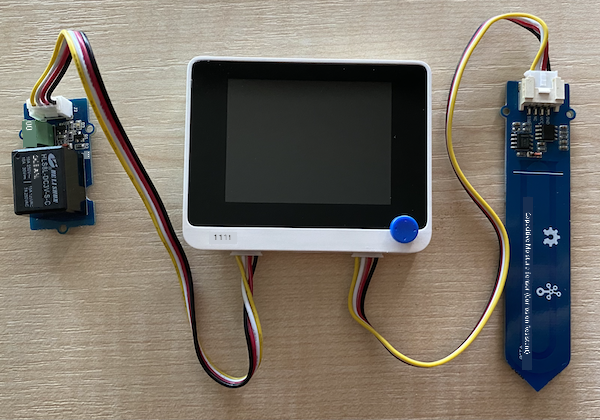

<!--
CO_OP_TRANSLATOR_METADATA:
{
  "original_hash": "f3c5d8afa2ef6a0b425ef8ff20615cb4",
  "translation_date": "2025-11-18T19:46:45+00:00",
  "source_file": "2-farm/lessons/3-automated-plant-watering/wio-terminal-relay.md",
  "language_code": "pcm"
}
-->
# Control relay - Wio Terminal

For dis part of di lesson, you go add relay to your Wio Terminal join di soil moisture sensor, and use am control based on di soil moisture level.

## Hardware

Di Wio Terminal need relay.

Di relay wey you go use na [Grove relay](https://www.seeedstudio.com/Grove-Relay.html), e be normally-open relay (e mean say di output circuit dey open or e no connect when signal no dey go di relay) wey fit handle output circuits up to 250V and 10A.

Dis one na digital actuator, so e dey connect to di digital pins for di Wio Terminal. Di analog/digital port wey dem join together don already dey use for di soil moisture sensor, so dis one go plug for di other port wey be combined I<sub>2</sub>C and digital port.

### Connect di relay

Di Grove relay fit connect to di Wio Terminal digital port.

#### Task

Connect di relay.


1. Put one end of Grove cable inside di socket for di relay. E go only enter one way.

1. Make sure say di Wio Terminal no connect to your computer or any power supply, then connect di other end of di Grove cable to di left-hand side Grove socket for di Wio Terminal as you dey look di screen. Leave di soil moisture sensor for di right-hand socket.



1. Put di soil moisture sensor inside soil, if e never dey there from di last lesson.

## Program di relay

Di Wio Terminal fit now dey program to use di relay wey you don attach.

### Task

Program di device.

1. Open di `soil-moisture-sensor` project from di last lesson for VS Code if e never open. You go dey add to dis project.

2. No library dey for dis actuator - e be digital actuator wey dem dey control with high or low signal. To turn am on, you go send high signal to di pin (3.3V), to turn am off you go send low signal (0V). You fit do dis one with di built-in Arduino [`digitalWrite`](https://www.arduino.cc/reference/en/language/functions/digital-io/digitalwrite/) function. Start by adding di code below to di bottom of di `setup` function to setup di combined I<sub>2</sub>C/digital port as output pin to send voltage to di relay:

    ```cpp
    pinMode(PIN_WIRE_SCL, OUTPUT);
    ```

    `PIN_WIRE_SCL` na di port number for di combined I<sub>2</sub>C/digital port.

1. To test say di relay dey work, add di code below to di `loop` function, under di final `delay`:

    ```cpp
    digitalWrite(PIN_WIRE_SCL, HIGH);
    delay(500);
    digitalWrite(PIN_WIRE_SCL, LOW);
    ```

    Di code dey send high signal to di pin wey di relay connect to make e turn on, e go wait 500ms (half second), then e go send low signal to turn di relay off.

1. Build and upload di code to di Wio Terminal.

1. Once di code don upload, di relay go dey turn on and off every 10 seconds, with half second delay between di on and off. You go hear di relay click on then click off. One LED for di Grove board go light when di relay dey on, then e go off when di relay dey off.

    

## Control di relay from soil moisture

Now wey di relay don dey work, e fit dey control based on di soil moisture readings.

### Task

Control di relay.

1. Delete di 3 lines of code wey you add to test di relay. Replace dem with di code below:

    ```cpp
    if (soil_moisture > 450)
    {
        Serial.println("Soil Moisture is too low, turning relay on.");
        digitalWrite(PIN_WIRE_SCL, HIGH);
    }
    else
    {
        Serial.println("Soil Moisture is ok, turning relay off.");
        digitalWrite(PIN_WIRE_SCL, LOW);
    }
    ```

    Dis code dey check di soil moisture level from di soil moisture sensor. If e pass 450, e go turn di relay on, and e go turn am off when e go below 450.

    > 💁 Remember say di capacitive soil moisture sensor dey read say di lower di soil moisture level, di more moisture dey for di soil and vice versa.

1. Build and upload di code to di Wio Terminal.

1. Use di serial monitor check di device. You go see di relay dey turn on or off based on di soil moisture level. Try am for dry soil, then add water.

    ```output
    Soil Moisture: 638
    Soil Moisture is too low, turning relay on.
    Soil Moisture: 452
    Soil Moisture is too low, turning relay on.
    Soil Moisture: 347
    Soil Moisture is ok, turning relay off.
    ```

> 💁 You fit find dis code for di [code-relay/wio-terminal](../../../../../2-farm/lessons/3-automated-plant-watering/code-relay/wio-terminal) folder.

😀 Your soil moisture sensor wey dey control relay program don work well!

---

<!-- CO-OP TRANSLATOR DISCLAIMER START -->
**Disclaimer**:  
Dis dokyument don use AI transleshion service [Co-op Translator](https://github.com/Azure/co-op-translator) do di transleshion. Even though we dey try make am accurate, abeg make you sabi say machine transleshion fit get mistake or no dey correct well. Di original dokyument wey dey for im native language na di main source wey you go fit trust. For important informashon, e good make you use professional human transleshion. We no go fit take blame for any misunderstanding or wrong meaning wey fit happen because you use dis transleshion.
<!-- CO-OP TRANSLATOR DISCLAIMER END -->